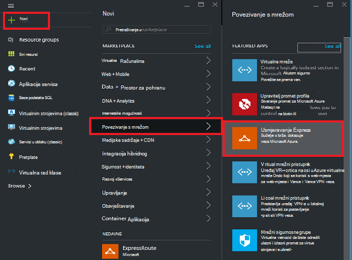
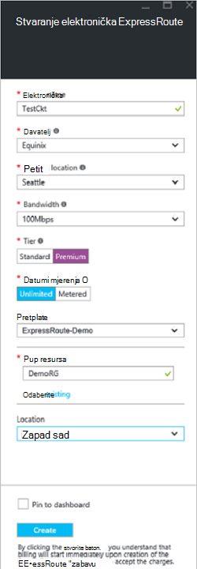
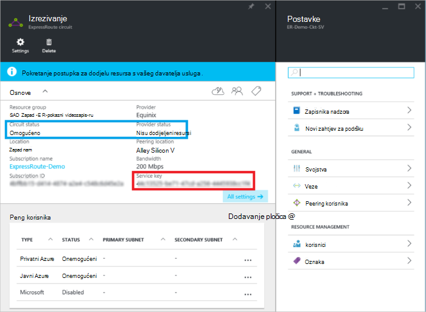
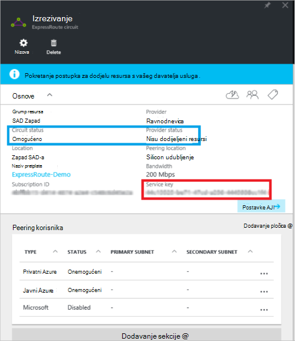
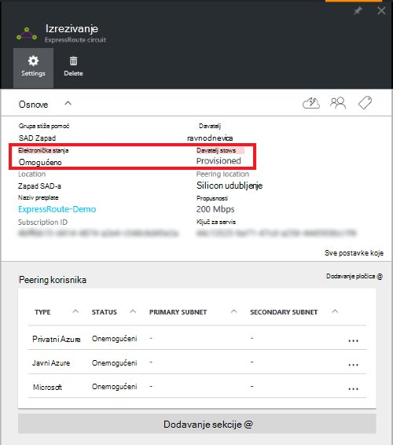

<properties
   pageTitle="Stvaranje i izmjena je elektronička ExpressRoute pomoću upravitelja resursa i Azure portal | Microsoft Azure"
   description="U ovom se članku opisuje kako stvoriti, dodijelite, provjerite je li, ažuriranje, brisanje i deprovision je elektronička ExpressRoute."
   documentationCenter="na"
   services="expressroute"
   authors="cherylmc"
   manager="carmonm"
   editor=""
   tags="azure-resource-manager"/>
<tags
   ms.service="expressroute"
   ms.devlang="na"
   ms.topic="article"
   ms.tgt_pltfrm="na"
   ms.workload="infrastructure-services"
   ms.date="10/10/2016"
   ms.author="cherylmc"/>

# Stvaranje i izmjena je elektronička ExpressRoute

> [AZURE.SELECTOR]
[Azure portala - resursima](expressroute-howto-circuit-portal-resource-manager.md)
[PowerShell – resursima](expressroute-howto-circuit-arm.md)
[PowerShell – klasični](expressroute-howto-circuit-classic.md)

U ovom se članku opisuje kako stvoriti programa Azure ExpressRoute elektronička pomoću portala za Azure i model implementacije Azure Voditelj resursa. Sljedeći koraci i pokazuju kako Provjera statusa u elektronička, ažurirati, ili brisanje i deprovision ga.

**O modelima Azure implementacije**

[AZURE.INCLUDE [vpn-gateway-clasic-rm](../../includes/vpn-gateway-classic-rm-include.md)] 

## Prije početka

- Pregledajte [preduvjeti](expressroute-prerequisites.md) i [tijekove rada](expressroute-workflows.md) prije nego što počnete konfiguracije.
- Provjerite je li pristup za [Azure portal](https://portal.azure.com).
- Provjerite imate li dozvole za stvaranje nove mrežne resurse. Ako nemate odgovarajuće dozvole, obratite se administratoru računa.

## Stvaranje i Dodjela je elektronička ExpressRoute

### 1. prijavite se na portal za Azure

U pregledniku idite na [portal za Azure](http://portal.azure.com) i prijavite se pomoću računa za Azure.

### 2. Stvaranje nove elektronička ExpressRoute

>[AZURE.IMPORTANT] Vaš elektronička ExpressRoute će se naplatiti od trenutka izdavanja ključa usluge. Provjerite je li kada davatelj usluga za povezivanje je spremna za dodjelu resursa u elektronička izvođenje ovog postupka.

1. Elektronička se ExpressRoute možete stvoriti tako da odaberete mogućnost da biste stvorili novi resurs. Kliknite **Novo** > **umrežavanje** > **ExpressRoute**, kao što je prikazano na sljedećoj slici:

    

2. Nakon što kliknete **ExpressRoute**, vidjet ćete plohu **elektronička ExpressRoute za stvaranje** . Kada ste popunjavanje vrijednosti na ovaj plohu, provjerite je li odredite točne SKU sloju i mjerenja podataka.

    - **Razina** određuje hoće li je omogućen ExpressRoute standard ili premium dodatak ExpressRoute. Možete navesti **standardne** da biste dobili standardne SKU ili **Premium** za dodatak premium.

    - **Mjerenja podataka** određuje vrstu naplate. Možete navesti **s ograničenim prometom** za tarifu s ograničenim prometom podataka i **neograničeno** za tarifu neograničeno podataka. Imajte na umu da možete promijeniti vrstu naplate iz **s ograničenim prometom** u **neograničeno**, ali ne možete promijeniti vrstu iz **neograničeno** da biste **s ograničenim prometom**.

    

>[AZURE.IMPORTANT] Imajte na umu da mjesto Peering označava [lokacije](expressroute-locations.md) gdje su peering kod Microsofta. To **je povezana s "Mjesto" svojstvo koje se odnosi na Zemljopis gdje se nalazi davatelja resursa za Azure mreže** . Dok se ne odnose, je dobro odabrati davatelja mrežni resurs geografski blizu Peering mjesto na elektronička. 

### 3. prikaz krugova i svojstava

**Prikaz svih krugova**

Možete pogledati sve krugova koji ste stvorili tako da odaberete **sve resurse** na izborniku s lijeve strane.
    

**Prikaz svojstava**

    You can view the properties of the circuit by selecting it. On this blade, note the service key for the circuit. You must copy the circuit key for your circuit and pass it down to the service provider to complete the provisioning process. The circuit key is specific to your circuit.

### 4. poslati ključa usluge povezivanja davatelju za dodjelu resursa

Na ovom plohu **status davatelja** sadrži informacije o trenutnom stanju aktiviranja na strani davatelja usluga. **Elektronička status** nudi stanje na strani Microsoft. Dodatne informacije o elektronička dodjeljivanje stanja potražite u članku [Tijekovi rada](expressroute-workflows.md#expressroute-circuit-provisioning-states) .

Prilikom stvaranja novog elektronička ExpressRoute na elektronička bit će u stanju sljedeće:

Status davatelja: nisu dodijeljeni resursi 
Elektronička status: omogućeno

Na elektronička će se promijeniti sljedeće stanje kada je u tijeku omogućiti za koje je davatelj usluga za povezivanje:

Status davatelja: Dodjela resursa 
Elektronička status: omogućeno

Umjesto vas moći koristiti u ExpressRoute elektronička mora biti u stanju sljedeće:

Status davatelja: dodjeli 
Elektronička status: omogućeno

### 5. povremeno status i stanje ključa elektronička

Možete pogledati svojstva elektronička koje ste zainteresirani tako da ga odaberete. Provjerite **status davatelja** i bili sigurni da ona se premješta u **Provisioned** prije nastavka.

### 6. stvaranje konfiguraciju usmjeravanje

Detaljne upute potražite u članku [konfiguracija za usmjeravanje elektronička ExpressRoute](expressroute-howto-routing-portal-resource-manager.md) za stvaranje i mijenjanje peerings elektronička.

>[AZURE.IMPORTANT] Ove se upute odnose samo na krugova koje su stvorene pomoću davateljima usluga koje nude usluge za povezivanje 2 sloja. Ako koristite usluga koje nudi upravljanih slojeva 3 services (obično je IP VPN, kao što je MPLS), vaš davatelj usluga za povezivanje će konfigurirati i upravljati njima usmjeravanje umjesto vas.

### 7. povezati virtualne mreže je elektronička ExpressRoute

Nakon toga veza virtualne mreže vaše elektronička ExpressRoute. Pomoću članka [Linking virtualne mreže ExpressRoute krugova](expressroute-howto-linkvnet-arm.md) kada radite s modelom implementacije Voditelj resursa.

## Početak status je elektronička ExpressRoute

Možete pogledati status je elektronička tako da ga odaberete. 

## Izmjena je elektronička ExpressRoute

Neka svojstva programa ExpressRoute elektronička možete izmijeniti bez utjecaja povezivanje. Trenutno ne možete mijenjati svojstva elektronička ExpressRoute pomoću portala za Azure. Međutim, koristite PowerShell da biste izmijenili svojstva elektronička. Dodatne informacije potražite u odjeljku [Izmjena je elektronička ExpressRoute pomoću komponente PowerShell](expressroute-howto-circuit-arm.md#modify).

Možete učiniti sljedeće s bez nedostupnost:

- Omogućite ili onemogućite dodatak premium ExpressRoute za svoje sklopovske ExpressRoute.

- Povećanje propusnosti vaše elektronička ExpressRoute. Imajte na umu da prijelaz na stariju propusnosti je elektronička nije podržana. 

- Promjena mjerne plana iz podataka s ograničenim prometom neograničeno podataka. Imajte na umu da promjena mjerne tarifu iz neograničeno podataka s ograničenim prometom podataka nije podržana.

-  Možete omogućiti i onemogućiti **Dopusti klasični operacije**.

Dodatne informacije o ograničenjima i ograničenja odnose se na [Najčešća pitanja vezana uz ExpressRoute](expressroute-faqs.md).

## Deprovisioning i brisanje je elektronička ExpressRoute

Možete izbrisati vaše ExpressRoute elektronička odabirom ikone za **Brisanje** . Imajte na umu sljedeće:

- Morate prekinuti vezu virtualne mreže s sklopovske ExpressRoute. Ako ovaj postupak ne uspije, provjerite je li sve virtualne mreže povezani s instalacijom.

- Ako je ExpressRoute elektronička servisa davatelja dodjele resursa stanje **Provisioning** ili **Provisioned** morate raditi s vaš davatelj usluga za deprovision elektronička kod sebe. Nastavit ćemo rezervirati resurse i fakturu dok davatelj usluga dovršava deprovisioning na elektronička i obavještava us.

- Ako davatelj usluga sadrži pretplati su uklonjeni resursi za elektronička (stanje dodjele resursa servisa davatelja postavljeno je na **nisu dodijeljeni resursi**) na elektronička moći ćete izbrisati. Time će se zaustaviti naplatom za na elektronička

## Daljnji koraci

Kada stvorite vaše elektronička, provjerite je li da to učinite sljedeće:

- [Stvaranje i izmjena usmjeravanja za vaše elektronička ExpressRoute](expressroute-howto-routing-portal-resource-manager.md)
- [Povezivanje virtualne mreže vaše elektronička ExpressRoute](expressroute-howto-linkvnet-arm.md)
