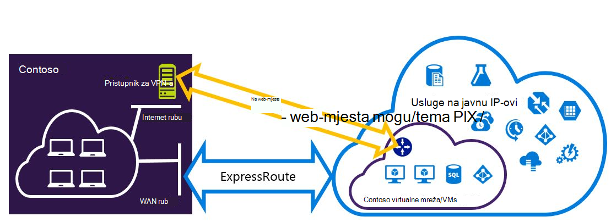

<properties
   pageTitle="Konfiguriranje Expressroute i web-mjesto VPN veza koje se mogu postojati zajedno | Microsoft Azure"
   description="U ovom se članku vodit će vas kroz konfiguriranje ExpressRoute i web-mjesto VPN veza koje se mogu postojati zajedno za uvođenje klasičnog model."
   documentationCenter="na"
   services="expressroute"
   authors="charwen"
   manager="carmonm"
   editor=""
   tags="azure-service-management"/>
<tags
   ms.service="expressroute"
   ms.devlang="na"
   ms.topic="get-started-article"
   ms.tgt_pltfrm="na"
   ms.workload="infrastructure-services"
   ms.date="10/10/2016"
   ms.author="charwen"/>

# Konfiguriranje ExpressRoute i web-mjesto coexisting veza za model klasični implementacije

> [AZURE.SELECTOR]
- [PowerShell – Voditelj resursa](expressroute-howto-coexist-resource-manager.md)
- [PowerShell – klasični](expressroute-howto-coexist-classic.md)

Imate mogućnost da biste konfigurirali VPN-a web-mjesto i ExpressRoute ima nekoliko prednosti. Konfiguriranje VPN-a web-mjesto kao sigurnu prebacivanje put za ExressRoute ili korištenje VPN-ovi web-mjesto za povezivanje s web-mjesta koja se povezuju kroz ExpressRoute. Ne možemo obrađuje korake da biste konfigurirali oba scenarija u ovom članku. Ovaj se članak odnosi model klasični implementacije. Tu konfiguraciju nije dostupna na portalu.

**O modelima Azure implementacije**

[AZURE.INCLUDE [vpn-gateway-clasic-rm](../../includes/vpn-gateway-classic-rm-include.md)] 

>[AZURE.IMPORTANT] ExpressRoute krugova mora biti unaprijed konfiguriran prije slijedite upute u nastavku. Provjerite da niste slijedili vodilica [je elektronička ExpressRoute za stvaranje](expressroute-howto-circuit-classic.md) i [Konfiguriranje usmjeravanje](expressroute-howto-routing-classic.md) prije slijedite korake u nastavku.

## Ograničenja i ograničenja

- **Usmjeravanje prijenosa nije podržana.** Ne možete usmjeriti (putem Azure) između lokalne mreže povezan putem VPN-a web-mjesto i lokalnoj mreži povezan putem ExpressRoute.
- **Točke na mjesto nije podržana.** Ne možete omogućiti istu VNet koji je povezan s ExpressRoute VPN veza točke na web. Nije moguće za istu VNet supostojanje VPN-a i ExpressRoute točke na web.
- **Prisilne tuneliranje ne može se omogućiti na web-mjesto VPN pristupnika.** Možete samo "pokrenuti" svih povezanih s Interneta promet natrag na lokalnu mrežu putem ExpressRoute.
- **Osnovni SKU pristupnika nije podržana.** Pristupnik nije – osnovni SKU morate koristiti za [ExpressRoute pristupnika](expressroute-about-virtual-network-gateways.md) i [VPN pristupnika](../vpn-gateway/vpn-gateway-about-vpngateways.md).
- **Podržana je samo utemeljen na usmjeravanje VPN pristupnika.** Morate koristiti utemeljen na usmjeravanje [VPN pristupnika](../vpn-gateway/vpn-gateway-about-vpngateways.md).
- **Statički smjer potrebno je konfigurirati za pristupnik za VPN-a.** Ako lokalnoj mreži je povezano s ExpressRoute i VPN-a web-mjesto, morate imati statički smjer konfiguriran u lokalnoj mreži da biste usmjerili web-mjesto VPN vezu s Internetom javno.
- **Najprije morate ga konfigurirati pristupnik ExpressRoute.** Potrebno je stvoriti pristupnika ExpressRoute najprije prije nego što dodate pristupnika VPN-a web-mjesto.

## Konfiguriranje dizajna

### Konfiguriranje web-mjesto VPN-a kao put prebacivanje za ExpressRoute

Web-mjesto VPN veza možete konfigurirati kao sigurnosnu kopiju za ExpressRoute. To se odnosi samo na virtualne mreže povezane s Azure privatne peering put. Je dostupan putem javne Azure i Microsoft peerings bez koji se temelji na VPN prebacivanje rješenja za servise. Elektronička ExpressRoute uvijek je primarni vezu. Putem web-mjesto VPN će tijek podataka samo ako je elektronička ExpressRoute neće uspjeti. 

### Konfiguriranje web-mjesto VPN-a za povezivanje s web-mjesta nije povezan putem ExpressRoute

Možete konfigurirati mreže koju neka web-mjesta povezati izravno Azure putem VPN-a web-mjesto, a neka web-mjesta povežite se putem ExpressRoute. 

>[AZURE.NOTE] Konfiguracija virtualne mreže ne kao usmjerivač prijenosa.

## Odabir korake da biste koristili

Postoje dva različita skupa postupaka za odabir da biste konfigurirali veze koje se mogu postojati zajedno. Konfiguriranje postupak koji ste odabrali ovisi o imate li postojeće virtualne mreže koje želite povezati ili želite stvoriti novi virtualne mreže.

- Ne ste na VNet i potrebne da biste je stvorili.
    
    Ako još nemate virtualne mreže, postupak će vas voditi kroz stvaranje nove virtualne mreže pomoću modela uvođenje klasičnog i stvaranje novih ExpressRoute i web-mjesto VPN veza. Da biste konfigurirali, slijedite korake u odjeljku članak [Da biste stvorili novi virtualne mreže i coexisting veze](#new).

- Već imam model klasični implementacije VNet.

    Možda već imate virtualne mreže na mjestu s postojećeg web-mjesto VPN vezu ili ExpressRoute veze. U odjeljku članak [Konfiguriranje coexsiting veze za postojeće VNet](#add) će vas voditi kroz brisanje pristupnika, a zatim stvorite novu ExpressRoute i web-mjesto VPN veza. Imajte na umu da prilikom stvaranja nove veze korake morate izvršiti vrlo određenim redoslijedom. Nemojte koristiti upute u druge članke da biste stvorili pristupnika i veze.

    U ovom postupku stvaranja veze koje se mogu postojati zajedno će biti potrebno da biste izbrisali pristupnikom, a zatim konfigurirajte novog pristupnika. To znači da će imati nedostupnost za više lokacija veze dok izbrišete i ponovno stvaranje pristupnika i veze, ali ćete morati migriranje bilo koji od VMs ili servisa u novi virtualne mreže. VMs i usluge će i dalje moći komuniciraju izvan kroz raspoređivača opterećenja dok konfiguriranje pristupnikom ako su konfigurirana da biste to učinili.

## Da biste stvorili novi virtualne mreže i coexisting veze

Ovaj postupak će vas voditi kroz stvaranje na VNet i stvaranje web-mjesto i ExpressRoute veze koje će supostojanje.

1. Morat ćete instalirati najnoviju verziju programa Azure PowerShell cmdleti. Dodatne informacije o instaliranju cmdleta ljuske PowerShell potražite u članku [kako instalirati i konfigurirati Azure PowerShell](../powershell-install-configure.md) . Imajte na umu da cmdletima koji će se koristiti za konfiguraciju može se malo razlikovati od što vjerojatno ste upoznati s. Ne zaboravite da bi koristio Cmdlete navedeno u ovim uputama. 

2. Stvori shemu virtualne mreže. Dodatne informacije o shemi konfiguracije potražite u članku [sheme konfiguracije Azure virtualne mreže](https://msdn.microsoft.com/library/azure/jj157100.aspx).

    Kada stvorite sheme, provjerite jeste li koristili sljedeće vrijednosti:

    - Podmreže pristupnik za virtualne mreže mora biti /27 ili kraći prefiks (primjerice /26 ili /25).
    - Vrsta veze pristupnika "predano".

              <VirtualNetworkSite name="MyAzureVNET" Location="Central US">
                <AddressSpace>
                  <AddressPrefix>10.17.159.192/26</AddressPrefix>
                </AddressSpace>
                <Subnets>
                  <Subnet name="Subnet-1">
                    <AddressPrefix>10.17.159.192/27</AddressPrefix>
                  </Subnet>
                  <Subnet name="GatewaySubnet">
                    <AddressPrefix>10.17.159.224/27</AddressPrefix>
                  </Subnet>
                </Subnets>
                <Gateway>
                  <ConnectionsToLocalNetwork>
                    <LocalNetworkSiteRef name="MyLocalNetwork">
                      <Connection type="Dedicated" />
                    </LocalNetworkSiteRef>
                  </ConnectionsToLocalNetwork>
                </Gateway>
              </VirtualNetworkSite>

3. Nakon stvaranja i konfiguriranju vaše datoteke xml sheme, prenesite datoteku. To će stvoriti virtualne mreže.

    Koristite sljedeći cmdlet da biste prenijeli datoteku i zamjena vrijednost vlastite.

        Set-AzureVNetConfig -ConfigurationPath 'C:\NetworkConfig.xml'

4. Stvaranje pristupnika za ExpressRoute. Ne zaboravite da biste odredili na GatewaySKU kao *standardni*, *HighPerformance*ili *UltraPerformance* i GatewayType kao *DynamicRouting*.

    Koristite sljedeće ogledne zamjenjujući vlastite vrijednosti.

        New-AzureVNetGateway -VNetName MyAzureVNET -GatewayType DynamicRouting -GatewaySKU HighPerformance

5. Veza pristupnik ExpressRoute elektronička ExpressRoute. Nakon dovršetka ovaj korak veze između lokalne mreže i Azure putem ExpressRoute, je pokrenut.

        New-AzureDedicatedCircuitLink -ServiceKey <service-key> -VNetName MyAzureVNET

6. Nakon toga stvaranje pristupnika za VPN-a web-mjesto. Na GatewaySKU moraju biti *standardne*, *HighPerformance*ili *UltraPerformance* i u GatewayType moraju biti *DynamicRouting*.

        New-AzureVirtualNetworkGateway -VNetName MyAzureVNET -GatewayName S2SVPN -GatewayType DynamicRouting -GatewaySKU  HighPerformance

    Da biste dohvatili pristupnika postavke virtualne mreže, uključujući ID pristupnika i javnu IP koristite na `Get-AzureVirtualNetworkGateway` cmdlet.

        Get-AzureVirtualNetworkGateway

        GatewayId            : 348ae011-ffa9-4add-b530-7cb30010565e
        GatewayName          : S2SVPN
        LastEventData        :
        GatewayType          : DynamicRouting
        LastEventTimeStamp   : 5/29/2015 4:41:41 PM
        LastEventMessage     : Successfully created a gateway for the following virtual network: GNSDesMoines
        LastEventID          : 23002
        State                : Provisioned
        VIPAddress           : 104.43.x.y
        DefaultSite          :
        GatewaySKU           : HighPerformance
        Location             :
        VnetId               : 979aabcf-e47f-4136-ab9b-b4780c1e1bd5
        SubnetId             :
        EnableBgp            : False
        OperationDescription : Get-AzureVirtualNetworkGateway
        OperationId          : 42773656-85e1-a6b6-8705-35473f1e6f6a
        OperationStatus      : Succeeded

7. Stvaranje lokalne web-mjesta entitet pristupnika VPN-a. Ta se naredba ne konfigurirati pristupnik za VPN-a na lokalni. Umjesto toga omogućuje da unesete postavke lokalne pristupnika kao što su javnu IP i na lokalni adrese razmak, tako da pristupnika Azure VPN-a mogu se povezati s njim.

    >[AZURE.IMPORTANT] Lokalnog web-mjesta za VPN web-mjesto nije definirano u na netcfg. Umjesto toga, morate koristiti ovaj cmdlet da biste odredili parametre lokalnog web-mjesta. Ne možete definirati ga pomoću portala ili netcfg datoteku.

    Koristite sljedeće ogledne vrijednosti zamjenjuje vlastite.

        New-AzureLocalNetworkGateway -GatewayName MyLocalNetwork -IpAddress <MyLocalGatewayIp> -AddressSpace <MyLocalNetworkAddress>

    > [AZURE.NOTE] Ako lokalnoj mreži ima više smjerova, prenesite ih u obliku matrice.  $MyLocalNetworkAddress =@("10.1.2.0/24","10.1.3.0/24","10.2.1.0/24")  

    Da biste dohvatili pristupnika postavke virtualne mreže, uključujući ID pristupnika i javnu IP koristite na `Get-AzureVirtualNetworkGateway` cmdlet. Pogledajte u sljedećem primjeru.

        Get-AzureLocalNetworkGateway

        GatewayId            : 532cb428-8c8c-4596-9a4f-7ae3a9fcd01b
        GatewayName          : MyLocalNetwork
        IpAddress            : 23.39.x.y
        AddressSpace         : {10.1.2.0/24}
        OperationDescription : Get-AzureLocalNetworkGateway
        OperationId          : ddc4bfae-502c-adc7-bd7d-1efbc00b3fe5
        OperationStatus      : Succeeded

8. Konfiguriranje lokalnog VPN uređaj za povezivanje s novog pristupnika. Pomoću informacija koje dohvaća u koraku 6 prilikom konfiguriranja uređaju VPN-a. Dodatne informacije o konfiguraciji uređaja VPN-a potražite u članku [Konfiguracija uređaja VPN-a](../vpn-gateway/vpn-gateway-about-vpn-devices.md).

9. Veza web-mjesto VPN pristupnika na Azure na lokalni pristupnika.

    U ovom primjeru connectedEntityId je ID za lokalni pristupnika koje možete pronaći tako da pokrenete `Get-AzureLocalNetworkGateway`. Možete pronaći virtualNetworkGatewayId pomoću na `Get-AzureVirtualNetworkGateway` cmdlet. Nakon ovaj korak uspostavljanja veze između lokalne mreže i Azure putem web-mjesto VPN veza.

        New-AzureVirtualNetworkGatewayConnection -connectedEntityId <local-network-gateway-id> -gatewayConnectionName Azure2Local -gatewayConnectionType IPsec -sharedKey abc123 -virtualNetworkGatewayId <azure-s2s-vpn-gateway-id>

## Da biste konfigurirali coexsiting veze za postojeće VNet

Ako imate postojeću virtualne mreže, potvrdite okvir veličina podmreže pristupnika. Ako je podmreže pristupnika /28 ili /29, morate brisanje pristupnika virtualne mreže i povećati veličinu podmreže pristupnika. Koraci u ovom odjeljku vidjet ćete kako to učiniti.

Ako je podmreže pristupnika /27 ili veća i virtualne mreže je povezan putem ExpressRoute, preskočite korake u nastavku i nastavite s ["Korak 6 – stvaranje pristupnika za VPN-a web-mjesto"](#vpngw) u prethodnom odjeljku.

>[AZURE.NOTE] Kada izbrišete postojeće pristupnika, vaši lokalni lokalno izgubit će veze s mrežom virtualne dok radite na tu konfiguraciju.

1. Morat ćete instalirati najnoviju verziju programa Azure resursima PowerShell cmdleti. Dodatne informacije o instaliranju cmdleta ljuske PowerShell potražite u članku [kako instalirati i konfigurirati Azure PowerShell](../powershell-install-configure.md) . Imajte na umu da cmdletima koji će se koristiti za konfiguraciju može se malo razlikovati od što vjerojatno ste upoznati s. Ne zaboravite da bi koristio Cmdlete navedeno u ovim uputama. 

2. Brisanje postojeće pristupnika ExpressRoute ili VPN-a web-mjesto. Koristite sljedeći cmdlet zamjenu vrijednosti s vlastitim.

        Remove-AzureVNetGateway –VnetName MyAzureVNET

3. Izvoz u shemi virtualne mreže. Koristite sljedeći cmdlet komponente PowerShell zamjenu vrijednosti s vlastitim.

        Get-AzureVNetConfig –ExportToFile “C:\NetworkConfig.xml”

4. Uređivanje sheme datoteka konfiguracije mreže da bi pristupnik podmreži /27 ili kraći prefiks (primjerice /26 ili /25). Pogledajte u sljedećem primjeru. 
>[AZURE.NOTE] Ako nemate dovoljno IP adrese lijevo u virtualne mreže da biste povećali veličinu podmreže pristupnika, morate dodati više prostora IP adresa. Dodatne informacije o shemi konfiguracije potražite u članku [sheme konfiguracije Azure virtualne mreže](https://msdn.microsoft.com/library/azure/jj157100.aspx).

          <Subnet name="GatewaySubnet">
            <AddressPrefix>10.17.159.224/27</AddressPrefix>
          </Subnet>

5. Ako je prethodno pristupnikom VPN-a web-mjesto, morate promijeniti i vrstu veze da biste **Dedicated**.

                 <Gateway>
                  <ConnectionsToLocalNetwork>
                    <LocalNetworkSiteRef name="MyLocalNetwork">
                      <Connection type="Dedicated" />
                    </LocalNetworkSiteRef>
                  </ConnectionsToLocalNetwork>
                </Gateway>

6. Sada imate VNet s nema pristupnika. Da biste stvorili novi pristupnika i dovršili svoje veze, možete nastaviti s [4 korak – stvaranje pristupnika za ExpressRoute](#gw), nalaze u prethodni skup koraka.

## Daljnji koraci

Dodatne informacije o ExpressRoute potražite u članku [Najčešća pitanja vezana uz ExpressRoute](expressroute-faqs.md)
