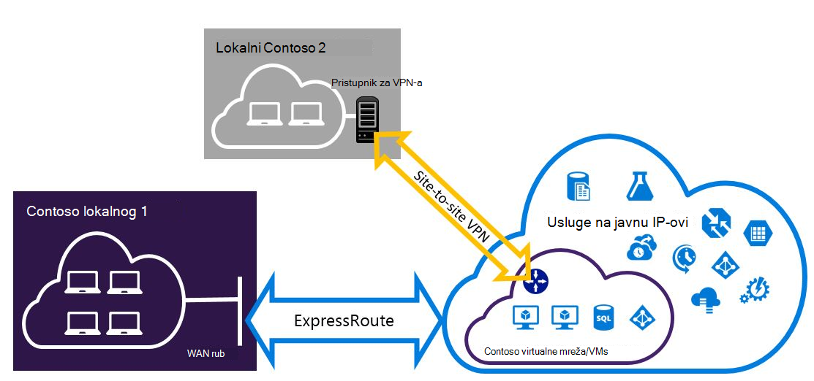

<properties
   pageTitle="Konfiguriranje Expressroute i web-mjesto VPN veza koje se mogu postojati zajedno za implementaciju model upravljanja resursima | Microsoft Azure"
   description="U ovom se članku vodit će vas kroz konfiguriranje ExpressRoute i web-mjesto VPN veza koje se mogu postojati zajedno za model Voditelj resursa."
   documentationCenter="na"
   services="expressroute"
   authors="charwen"
   manager="carmonm"
   editor=""
   tags="azure-resource-manager"/>
<tags
   ms.service="expressroute"
   ms.devlang="na"
   ms.topic="get-started-article"
   ms.tgt_pltfrm="na"
   ms.workload="infrastructure-services"
   ms.date="10/10/2016"
   ms.author="charleywen"/>

# Konfiguriranje ExpressRoute i web-mjesto coexisting veze za implementaciju model Voditelj resursa

> [AZURE.SELECTOR]
- [PowerShell – Voditelj resursa](expressroute-howto-coexist-resource-manager.md)
- [PowerShell – klasični](expressroute-howto-coexist-classic.md)

Imate mogućnost da biste konfigurirali VPN-a web-mjesto i ExpressRoute ima nekoliko prednosti. Konfiguriranje VPN-a web-mjesto kao sigurnu prebacivanje put za ExressRoute ili korištenje VPN-ovi web-mjesto za povezivanje s web-mjesta koja se povezuju kroz ExpressRoute. Ne možemo obrađuje korake da biste konfigurirali oba scenarija u ovom članku. Ovaj se članak odnosi model implementacije Voditelj resursa. Tu konfiguraciju nije dostupna na portalu za Azure.

**O modelima Azure implementacije**

[AZURE.INCLUDE [vpn-gateway-clasic-rm](../../includes/vpn-gateway-classic-rm-include.md)] 

>[AZURE.IMPORTANT] ExpressRoute krugova mora biti unaprijed konfiguriran prije slijedite upute u nastavku. Provjerite da niste slijedili vodilica [je elektronička ExpressRoute za stvaranje](expressroute-howto-circuit-arm.md) i [Konfiguriranje usmjeravanje](expressroute-howto-routing-arm.md) prije slijedite korake u nastavku.

## Ograničenja i ograničenja

- **Usmjeravanje prijenosa nije podržana.** Ne možete usmjeriti (putem Azure) između lokalne mreže povezan putem VPN-a web-mjesto i lokalnoj mreži povezan putem ExpressRoute.
- **Osnovni SKU pristupnika nije podržana.** Pristupnik nije – osnovni SKU morate koristiti za [ExpressRoute pristupnika](expressroute-about-virtual-network-gateways.md) i [VPN pristupnika](../vpn-gateway/vpn-gateway-about-vpngateways.md).
- **Podržana je samo utemeljen na usmjeravanje VPN pristupnika.** Morate koristiti utemeljen na usmjeravanje [VPN pristupnika](../vpn-gateway/vpn-gateway-about-vpngateways.md).
- **Statički smjer potrebno je konfigurirati za pristupnik za VPN-a.** Ako lokalnoj mreži je povezano s ExpressRoute i VPN-a web-mjesto, morate imati statički smjer konfiguriran u lokalnoj mreži da biste usmjerili web-mjesto VPN vezu s Internetom javno.
- **Najprije morate ga konfigurirati pristupnik ExpressRoute.** Potrebno je stvoriti pristupnika ExpressRoute najprije prije nego što dodate pristupnika VPN-a web-mjesto.

## Konfiguriranje dizajna

### Konfiguriranje web-mjesto VPN-a kao put prebacivanje za ExpressRoute

Web-mjesto VPN veza možete konfigurirati kao sigurnosnu kopiju za ExpressRoute. To se odnosi samo na virtualne mreže povezane s Azure privatne peering put. Je dostupan putem javne Azure i Microsoft peerings bez koji se temelji na VPN prebacivanje rješenja za servise. Elektronička ExpressRoute uvijek je primarni vezu. Putem web-mjesto VPN će tijek podataka samo ako je elektronička ExpressRoute neće uspjeti.
>[AZURE.NOTE] Dok ExpressRoute elektronička prefered putem web-mjesto VPN-a kada obje usmjerava jednaki, Azure pomoću prefiks podudaranje longuest da biste odabrali usmjeravanje prema odredište u paketu.

### Konfiguriranje web-mjesto VPN-a za povezivanje s web-mjesta nije povezan putem ExpressRoute

Možete konfigurirati mreže koju neka web-mjesta povezati izravno Azure putem VPN-a web-mjesto, a neka web-mjesta povežite se putem ExpressRoute. 

>[AZURE.NOTE] Konfiguracija virtualne mreže ne kao usmjerivač prijenosa.

## Odabir korake da biste koristili

Postoje dva različita skupa postupaka za odabir da biste konfigurirali veze koje se mogu postojati zajedno. Konfiguriranje postupak koji ste odabrali ovisi o imate li postojeće virtualne mreže koje želite povezati ili želite stvoriti novi virtualne mreže.

- Ne ste na VNet i potrebne da biste je stvorili.
    
    Ako još nemate virtualne mreže, postupak će vas voditi kroz stvaranje nove virtualne mreže pomoću upravitelja resursa implementacije modela i stvaranje novih ExpressRoute i web-mjesto VPN veza. Da biste konfigurirali, slijedite korake u odjeljku članak [Da biste stvorili novi virtualne mreže i coexisting veze](#new).

- Već imam model implementacije resursima VNet.

    Možda već imate virtualne mreže na mjestu s postojećeg web-mjesto VPN vezu ili ExpressRoute veze. [Konfiguriranje veza coexsiting za već postojeće VNet](#add) odjeljak će vas voditi kroz brisanje pristupnika, a zatim stvorite novu ExpressRoute i web-mjesto VPN veza. Imajte na umu da prilikom stvaranja nove veze korake morate izvršiti vrlo određenim redoslijedom. Nemojte koristiti upute u druge članke da biste stvorili pristupnika i veze.

    U ovom postupku stvaranja veze koje se mogu postojati zajedno će biti potrebno da biste izbrisali pristupnikom, a zatim konfigurirajte novog pristupnika. To znači da će imati nedostupnost za više lokacija veze dok izbrišete i ponovno stvaranje pristupnika i veze, ali ćete morati migriranje bilo koji od VMs ili servisa u novi virtualne mreže. VMs i usluge će i dalje moći komuniciraju izvan kroz raspoređivača opterećenja dok konfiguriranje pristupnikom ako su konfigurirana da biste to učinili.

## Da biste stvorili novi virtualne mreže i coexisting veze

Ovaj postupak će vas voditi kroz stvaranje na VNet i stvaranje web-mjesto i ExpressRoute veze koje će supostojanje.
    
1. Morat ćete instalirati najnoviju verziju programa Azure PowerShell cmdleti. Dodatne informacije o instaliranju cmdleta ljuske PowerShell potražite u članku [kako instalirati i konfigurirati Azure PowerShell](../powershell-install-configure.md) . Imajte na umu da cmdletima koji će se koristiti za konfiguraciju može se malo razlikovati od što vjerojatno ste upoznati s. Ne zaboravite da bi koristio Cmdlete navedeno u ovim uputama.

2. Prijava računa i Postavljanje okruženja.
    
        login-AzureRmAccount
        Select-AzureRmSubscription -SubscriptionName 'yoursubscription'
        $location = "Central US"
        $resgrp = New-AzureRmResourceGroup -Name "ErVpnCoex" -Location $location

3. Stvaranje virtualne mreže uključujući podmreže pristupnika. Dodatne informacije o konfiguraciji virtualne mreže potražite u članku [Konfiguracija Azure virtualne mreže](../virtual-network/virtual-networks-create-vnet-arm-ps.md).

    >[AZURE.IMPORTANT] Pristupnik podmreže mora biti /27 ili kraći prefiks (primjerice /26 ili /25).
    
    Stvorite novi VNet.

        $vnet = New-AzureRmVirtualNetwork -Name "CoexVnet" -ResourceGroupName $resgrp.ResourceGroupName -Location $location -AddressPrefix "10.200.0.0/16" 

    Dodajte podmreže.

        Add-AzureRmVirtualNetworkSubnetConfig -Name "App" -VirtualNetwork $vnet -AddressPrefix "10.200.1.0/24"
        Add-AzureRmVirtualNetworkSubnetConfig -Name "GatewaySubnet" -VirtualNetwork $vnet -AddressPrefix "10.200.255.0/24"

    Spremanje VNet konfiguracije.

        $vnet = Set-AzureRmVirtualNetwork -VirtualNetwork $vnet

4. Stvaranje pristupnika za ExpressRoute. Dodatne informacije o konfiguraciji pristupnika ExpressRoute potražite u članku [Konfiguracija ExpressRoute pristupnika](expressroute-howto-add-gateway-resource-manager.md). Na GatewaySKU mora biti *standardne*, *HighPerformance*ili *UltraPerformance*.

        $gwSubnet = Get-AzureRmVirtualNetworkSubnetConfig -Name "GatewaySubnet" -VirtualNetwork $vnet
        $gwIP = New-AzureRmPublicIpAddress -Name "ERGatewayIP" -ResourceGroupName $resgrp.ResourceGroupName -Location $location -AllocationMethod Dynamic
        $gwConfig = New-AzureRmVirtualNetworkGatewayIpConfig -Name "ERGatewayIpConfig" -SubnetId $gwSubnet.Id -PublicIpAddressId $gwIP.Id
        $gw = New-AzureRmVirtualNetworkGateway -Name "ERGateway" -ResourceGroupName $resgrp.ResourceGroupName -Location $location -IpConfigurations $gwConfig -GatewayType "ExpressRoute" -GatewaySku Standard 

5. Veza pristupnik ExpressRoute elektronička ExpressRoute. Nakon dovršetka ovaj korak veze između lokalne mreže i Azure putem ExpressRoute, je pokrenut. Dodatne informacije o operacije povezivanje potražite u članku [VNets vezu da biste ExpressRoute](expressroute-howto-linkvnet-arm.md).

        $ckt = Get-AzureRmExpressRouteCircuit -Name "YourCircuit" -ResourceGroupName "YourCircuitResourceGroup"
        New-AzureRmVirtualNetworkGatewayConnection -Name "ERConnection" -ResourceGroupName $resgrp.ResourceGroupName -Location $location -VirtualNetworkGateway1 $gw -PeerId $ckt.Id -ConnectionType ExpressRoute

6. Nakon toga stvaranje pristupnika za VPN-a web-mjesto. Dodatne informacije o konfiguraciji pristupnika VPN-a potražite u članku [Konfiguriranje VNet s vezom za web-mjesto](../vpn-gateway/vpn-gateway-create-site-to-site-rm-powershell.md). Na GatewaySKU mora biti *standardne*, *HighPerformance*ili *UltraPerformance*. Na VpnType mora biti *RouteBased*.

        $gwSubnet = Get-AzureRmVirtualNetworkSubnetConfig -Name "GatewaySubnet" -VirtualNetwork $vnet
        $gwIP = New-AzureRmPublicIpAddress -Name "VPNGatewayIP" -ResourceGroupName $resgrp.ResourceGroupName -Location $location -AllocationMethod Dynamic
        $gwConfig = New-AzureRmVirtualNetworkGatewayIpConfig -Name "VPNGatewayIpConfig" -SubnetId $gwSubnet.Id -PublicIpAddressId $gwIP.Id
        New-AzureRmVirtualNetworkGateway -Name "VPNGateway" -ResourceGroupName $resgrp.ResourceGroupName -Location $location -IpConfigurations $gwConfig -GatewayType "Vpn" -VpnType "RouteBased" -GatewaySku "Standard"

    Azure VPN pristupnika podržava na BGP. Možete odrediti - EnableBgp u sljedeću naredbu.

        $azureVpn = New-AzureRmVirtualNetworkGateway -Name "VPNGateway" -ResourceGroupName $resgrp.ResourceGroupName -Location $location -IpConfigurations $gwConfig -GatewayType "Vpn" -VpnType "RouteBased" -GatewaySku "Standard" -EnableBgp $true

    Možete pronaći BGP peering IP i kao broj kojim Azure služi za pristupnik za VPN-a u $azureVpn.BgpSettings.BgpPeeringAddress i $azureVpn.BgpSettings.Asn. Dodatne informacije potražite u članku [Konfiguriranje BGP](../vpn-gateway/vpn-gateway-bgp-resource-manager-ps.md) za pristupnik za Azure VPN-a.

7. Stvaranje lokalne web-mjesta entitet pristupnika VPN-a. Ta se naredba ne konfigurirati pristupnik za VPN-a na lokalni. Umjesto toga omogućuje da unesete postavke lokalne pristupnika kao što su javnu IP i na lokalni adrese razmak, tako da pristupnika Azure VPN-a mogu se povezati s njim.

    Ako lokalni VPN uređaj podržava samo statične usmjeravanja, možete konfigurirati Statički smjerovi na sljedeći način.

        $MyLocalNetworkAddress = @("10.100.0.0/16","10.101.0.0/16","10.102.0.0/16")
        $localVpn = New-AzureRmLocalNetworkGateway -Name "LocalVPNGateway" -ResourceGroupName $resgrp.ResourceGroupName -Location $location -GatewayIpAddress *<Public IP>* -AddressPrefix $MyLocalNetworkAddress

    Ako lokalni VPN uređaj podržava u BGP, a želite omogućiti dinamički usmjeravanja, morate znati BGP peering IP i broj kao koja koristi lokalni uređaj VPN-a.

        $localVPNPublicIP = "<Public IP>"
        $localBGPPeeringIP = "<Private IP for the BGP session>"
        $localBGPASN = "<ASN>"
        $localAddressPrefix = $localBGPPeeringIP + "/32"
        $localVpn = New-AzureRmLocalNetworkGateway -Name "LocalVPNGateway" -ResourceGroupName $resgrp.ResourceGroupName -Location $location -GatewayIpAddress $localVPNPublicIP -AddressPrefix $localAddressPrefix -BgpPeeringAddress $localBGPPeeringIP -Asn $localBGPASN

8. Konfiguriranje lokalnog uređaja VPN-a za povezivanje s novog pristupnika Azure VPN-a. Dodatne informacije o konfiguraciji uređaja VPN-a potražite u članku [Konfiguracija uređaja VPN-a](../vpn-gateway/vpn-gateway-about-vpn-devices.md).

9. Veza web-mjesto VPN pristupnika na Azure na lokalni pristupnika.

        $azureVpn = Get-AzureRmVirtualNetworkGateway -Name "VPNGateway" -ResourceGroupName $resgrp.ResourceGroupName
        New-AzureRmVirtualNetworkGatewayConnection -Name "VPNConnection" -ResourceGroupName $resgrp.ResourceGroupName -Location $location -VirtualNetworkGateway1 $azureVpn -LocalNetworkGateway2 $localVpn -ConnectionType IPsec -SharedKey <yourkey>

## Da biste konfigurirali coexsiting veze za postojeće VNet

Ako imate postojeću virtualne mreže, potvrdite okvir veličina podmreže pristupnika. Ako je podmreže pristupnika /28 ili /29, morate brisanje pristupnika virtualne mreže i povećati veličinu podmreže pristupnika. Koraci u ovom odjeljku vidjet ćete kako to učiniti.

Ako je podmreže pristupnika /27 ili veća i virtualne mreže je povezan putem ExpressRoute, preskočite korake u nastavku i nastavite s ["Korak 6 – stvaranje pristupnika za VPN-a web-mjesto"](#vpngw) u prethodnom odjeljku. 

>[AZURE.NOTE] Kada izbrišete postojeće pristupnika, vaši lokalni lokalno izgubit će veze s mrežom virtualne dok radite na tu konfiguraciju. 

1. Morat ćete instalirati najnoviju verziju programa Azure PowerShell cmdleti. Dodatne informacije o instaliranju cmdleta ljuske PowerShell potražite u članku [kako instalirati i konfigurirati Azure PowerShell](../powershell-install-configure.md) . Imajte na umu da cmdletima koji će se koristiti za konfiguraciju može se malo razlikovati od što vjerojatno ste upoznati s. Ne zaboravite da bi koristio Cmdlete navedeno u ovim uputama. 

2. Brisanje postojeće pristupnika ExpressRoute ili VPN-a web-mjesto. 

        Remove-AzureRmVirtualNetworkGateway -Name <yourgatewayname> -ResourceGroupName <yourresourcegroup>

3. Brisanje pristupnika podmreže.
        
        $vnet = Get-AzureRmVirtualNetwork -Name <yourvnetname> -ResourceGroupName <yourresourcegroup> 
        Remove-AzureRmVirtualNetworkSubnetConfig -Name GatewaySubnet -VirtualNetwork $vnet

4. Dodavanje podmreži pristupnika koji je /27 ili veća.
    >[AZURE.NOTE] Ako nemate dovoljno IP adrese lijevo u virtualne mreže da biste povećali veličinu podmreže pristupnika, morate dodati više prostora IP adresa.

        $vnet = Get-AzureRmVirtualNetwork -Name <yourvnetname> -ResourceGroupName <yourresourcegroup>
        Add-AzureRmVirtualNetworkSubnetConfig -Name "GatewaySubnet" -VirtualNetwork $vnet -AddressPrefix "10.200.255.0/24"

    Spremanje VNet konfiguracije.

        $vnet = Set-AzureRmVirtualNetwork -VirtualNetwork $vnet

5. Sada imate VNet s nema pristupnika. Da biste stvorili novi pristupnika i dovršili svoje veze, možete nastaviti s [4 korak – stvaranje pristupnika za ExpressRoute](#gw), nalaze u prethodni skup koraka.

## Da biste dodali konfiguracija točke stranice pristupnika VPN-a
Slijedite korake u nastavku da biste dodali konfiguracija točke stranice u pristupnik za VPN-a u koegzistencija postavi.

1. Dodajte skupna adresa VPN klijent. 

        $azureVpn = Get-AzureRmVirtualNetworkGateway -Name "VPNGateway" -ResourceGroupName $resgrp.ResourceGroupName
        Set-AzureRmVirtualNetworkGatewayVpnClientConfig -VirtualNetworkGateway $azureVpn -VpnClientAddressPool "10.251.251.0/24"

2. Prenesite korijenski certifikat VPN Azure za pristupnik za VPN-a. U ovom primjeru, pretpostavlja se da korijenski certifikat pohranjen na lokalnom računalu na kojem će se izvoditi sljedeće Cmdlete ljuske PowerShell. 

        $p2sCertFullName = "RootErVpnCoexP2S.cer"
        $p2sCertMatchName = "RootErVpnCoexP2S"
        $p2sCertToUpload=get-childitem Cert:\CurrentUser\My | Where-Object {$_.Subject -match $p2sCertMatchName}
        if ($p2sCertToUpload.count -eq 1){
            write-host "cert found"
        } else {
            write-host "cert not found"
            exit
        } 
        $p2sCertData = [System.Convert]::ToBase64String($p2sCertToUpload.RawData)
        Add-AzureRmVpnClientRootCertificate -VpnClientRootCertificateName $p2sCertFullName -VirtualNetworkGatewayname $azureVpn.Name -ResourceGroupName $resgrp.ResourceGroupName -PublicCertData $p2sCertData

Dodatne informacije o točke web VPN-a potražite u članku [Konfiguriranje veze točke na web](../vpn-gateway/vpn-gateway-howto-point-to-site-rm-ps.md).

## Daljnji koraci

Dodatne informacije o ExpressRoute potražite u članku [Najčešća pitanja vezana uz ExpressRoute](expressroute-faqs.md).
