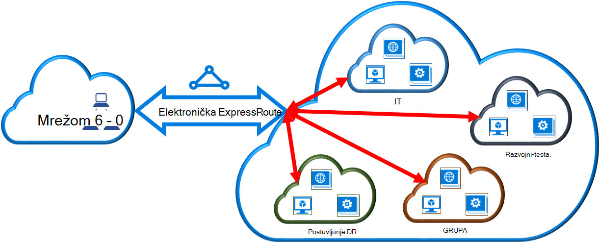

<properties 
   pageTitle="Povezati se elektronička ExpressRoute virtualne mreže pomoću komponente PowerShell | Microsoft Azure"
   description="Ovaj dokument sadrži pregled uputa za povezivanje virtualne mreže (VNets) ExpressRoute krugova pomoću model implementacije Voditelj resursa i PowerShell."
   services="expressroute"
   documentationCenter="na"
   authors="ganesr"
   manager="carmonm"
   editor=""
   tags="azure-resource-manager"/>
<tags 
   ms.service="expressroute"
   ms.devlang="na"
   ms.topic="article"
   ms.tgt_pltfrm="na"
   ms.workload="infrastructure-services"
   ms.date="10/10/2016"
   ms.author="ganesr" />

# Povezivanje virtualne mreže je elektronička ExpressRoute

> [AZURE.SELECTOR]
- [Azure portala - Voditelj resursa](expressroute-howto-linkvnet-portal-resource-manager.md)
- [PowerShell – Voditelj resursa](expressroute-howto-linkvnet-arm.md)
- [PowerShell – klasični](expressroute-howto-linkvnet-classic.md)

U ovom se članku pronaći ćete povezati Azure ExpressRoute krugova virtualne mreže (VNets) pomoću model implementacije Voditelj resursa i PowerShell. Virtualne mreže mogu biti iste pretplate ili dio pretplate na drugi.

**O modelima Azure implementacije**

[AZURE.INCLUDE [vpn-gateway-clasic-rm](../../includes/vpn-gateway-classic-rm-include.md)] 

## Preduvjeti za konfiguraciju

- Morate najnoviju verziju modula Azure PowerShell (najmanje verzije 1.0). Dodatne informacije o instaliranju cmdleta ljuske PowerShell potražite u članku [kako instalirati i konfigurirati Azure PowerShell](../powershell-install-configure.md) .
- Morate pregledati [preduvjeti](expressroute-prerequisites.md), [preduvjeti za usmjeravanje](expressroute-routing.md)i [tijekove rada](expressroute-workflows.md) prije nego što počnete konfiguracije.
- Mora imati aktivan elektronička za ExpressRoute. 
    - Slijedite upute da biste [stvorili je elektronička ExpressRoute](expressroute-howto-circuit-arm.md) i imati elektronička omogućeno vaš davatelj povezivanje. 
    - Provjerite možete li se Azure privatne peering konfigurirana za vaše elektronička. Potražite u članku [Konfiguriranje usmjeravanje](expressroute-howto-routing-arm.md) usmjeravanje upute. 
    - Provjerite je li Azure privatne peering je konfiguriran i BGP peering između mreže i Microsoft je gore tako da možete omogućiti povezivanje završetka do kraja.
    - Provjerite možete li se virtualne mreže i virtualne mreže pristupnika stvorili i potpuno dodjeli. Slijedite upute za stvaranje [pristupnika za VPN](../articles/vpn-gateway/vpn-gateway-create-site-to-site-rm-powershell.md), ali ne zaboravite da biste koristili `-GatewayType ExpressRoute`.

Standardni ExpressRoute elektronička možete povezati do 10 virtualne mreže. Sve virtualne mreže mora biti u istoj Geopolitički regiji prilikom korištenja standardne elektronička ExpressRoute. 

Možete povezati virtualne mreže izvan područje Geopolitički elektronička ExpressRoute ili povezati veći broj virtualne mreže vaše elektronička ExpressRoute ako je omogućeno premium dodatak ExpressRoute. Pročitajte [Najčešća pitanja vezana uz](expressroute-faqs.md) više pojedinosti o dodatak premium.

## Povezivanje virtualne mreže u okviru iste pretplate na elektronička

Pristupnik virtualne mreže da biste je elektronička ExpressRoute možete povezati pomoću sljedeći cmdlet. Provjerite je li pristupnik virtualne mreže se stvara i spreman je za povezivanje prije pokrenite cmdlet:

    $circuit = Get-AzureRmExpressRouteCircuit -Name "MyCircuit" -ResourceGroupName "MyRG"
    $gw = Get-AzureRmVirtualNetworkGateway -Name "ExpressRouteGw" -ResourceGroupName "MyRG"
    $connection = New-AzureRmVirtualNetworkGatewayConnection -Name "ERConnection" -ResourceGroupName "MyRG" -Location "East US" -VirtualNetworkGateway1 $gw -PeerId $circuit.Id -ConnectionType ExpressRoute

## Povezivanje virtualne mreže u neku drugu pretplatu na elektronička

Možete zajednički koristiti je elektronička ExpressRoute preko višestruke pretplate. Na sljedećoj slici prikazan je jednostavna koji schematic od načina zajedničkog korištenja radi ExpressRoute krugova preko višestruke pretplate.

Svaki od manjih oblaka unutar velike oblaka koristi se za predstavljanje pretplate koji pripadaju različitim odjelima unutar tvrtke ili ustanove. Svaki od odjelima unutar tvrtke ili ustanove možete koristiti svoje pretplate za implementaciju usluge –, ali ih možete zajednički koristiti jednu elektronička ExpressRoute za povezivanje lokalne mreže. Jednom odjelu (u ovom primjeru: IT) mogu biti vlasnici elektronička ExpressRoute. Druge pretplate za unutar tvrtke ili ustanove možete koristiti elektronička ExpressRoute.

>[AZURE.NOTE] Povezivanje i propusnosti naknade za namjenski elektronička će se primijeniti na vlasnik elektronička ExpressRoute. Sve virtualne mreže zajednički koristiti iste propusnosti.

### Administracija

*Elektronička vlasnik* je korisnik ovlašteni power ExpressRoute elektronička resursa. Vlasnik elektronička možete stvoriti autorizacijama koje možete aktivacije *elektronička*korisnici. *Elektronička korisnici* su vlasnici virtualne mreže pristupnika (koja nije unutar iste pretplate kao elektronička ExpressRoute). *Elektronička korisnici* mogu iskoristiti autorizacijama (jedan autorizacije po virtualne mreže).

*Elektronička vlasnik* ima power za izmjenu i oduzimanje autorizacijama u bilo kojem trenutku. Opoziva autorizaciju rezultira svih veza veza koje se brišu se iz pretplate čiji pristup je povučen.

### Elektronička vlasnik operacije 

#### Stvaranje odobrenje
    
Vlasnik elektronička stvara za autorizaciju. Rezultat stvaranje ključa autorizacije koje je moguće koristiti korisnik elektronička povezati svoje pristupnika virtualne mreže da biste elektronička ExpressRoute. Odobrenje vrijedi za samo jednu vezu.

Sljedeći cmdlet isječak prikazuje kako stvoriti odobrenje:

    $circuit = Get-AzureRmExpressRouteCircuit -Name "MyCircuit" -ResourceGroupName "MyRG"
    Add-AzureRmExpressRouteCircuitAuthorization -ExpressRouteCircuit $circuit -Name "MyAuthorization1"
    Set-AzureRmExpressRouteCircuit -ExpressRouteCircuit $circuit

        $circuit = Get-AzureRmExpressRouteCircuit -Name "MyCircuit" -ResourceGroupName "MyRG"
    $auth1 = Get-AzureRmExpressRouteCircuitAuthorization -ExpressRouteCircuit $circuit -Name "MyAuthorization1"
        

Odgovor na to će sadržavati ključ autorizacije i status:

    Name                   : MyAuthorization1
    Id                     : /subscriptions/&&&&&&&&&&&&&&&&&&&&&&&&&&&&&&&&&&&&/resourceGroups/ERCrossSubTestRG/providers/Microsoft.Network/expressRouteCircuits/CrossSubTest/authorizations/MyAuthorization1
    Etag                   : &&&&&&&&&&&&&&&&&&&&&&&&&&&&&&&&&&&& 
    AuthorizationKey       : ####################################
    AuthorizationUseStatus : Available
    ProvisioningState      : Succeeded

        

#### Pregled autorizacijama

Vlasnik elektronička možete pregledati sve autorizacijama koje izdaje na određeni elektronička tako da pokrenete sljedeći cmdlet:

    $circuit = Get-AzureRmExpressRouteCircuit -Name "MyCircuit" -ResourceGroupName "MyRG"
    $authorizations = Get-AzureRmExpressRouteCircuitAuthorization -ExpressRouteCircuit $circuit
    

#### Dodavanje autorizacijama

Vlasnik elektronička možete dodati autorizacijama pomoću sljedeći cmdlet:

    $circuit = Get-AzureRmExpressRouteCircuit -Name "MyCircuit" -ResourceGroupName "MyRG"
    Add-AzureRmExpressRouteCircuitAuthorization -ExpressRouteCircuit $circuit -Name "MyAuthorization2"
    Set-AzureRmExpressRouteCircuit -ExpressRouteCircuit $circuit
    
    $circuit = Get-AzureRmExpressRouteCircuit -Name "MyCircuit" -ResourceGroupName "MyRG"
    $authorizations = Get-AzureRmExpressRouteCircuitAuthorization -ExpressRouteCircuit $circuit

    
#### Brisanje autorizacijama

Vlasnik elektronička možete revoke/brisanje autorizacijama korisniku tako da pokrenete sljedeći cmdlet:

    Remove-AzureRmExpressRouteCircuitAuthorization -Name "MyAuthorization2" -ExpressRouteCircuit $circuit
    Set-AzureRmExpressRouteCircuit -ExpressRouteCircuit $circuit    

### Elektronička korisničkog operacija

Elektronička korisnik mora ID ravnopravnih članova i ključa autorizacije od vlasnika elektronička. Ključ za provjeru autentičnosti nije GUID.

ID ravnopravnih članova je, potrebno je provjeriti iz sljedeću naredbu.

    Get-AzureRmExpressRouteCircuit -Name "MyCircuit" -ResourceGroupName "MyRG"

#### Iskorištavanja autorizacijama veze

Korisniku elektronička možete pokrenuti sljedeći cmdlet da biste iskoristili vezu autorizacije:

    $id = "/subscriptions/********************************/resourceGroups/ERCrossSubTestRG/providers/Microsoft.Network/expressRouteCircuits/MyCircuit"  
    $gw = Get-AzureRmVirtualNetworkGateway -Name "ExpressRouteGw" -ResourceGroupName "MyRG"
    $connection = New-AzureRmVirtualNetworkGatewayConnection -Name "ERConnection" -ResourceGroupName "RemoteResourceGroup" -Location "East US" -VirtualNetworkGateway1 $gw -PeerId $id -ConnectionType ExpressRoute -AuthorizationKey "^^^^^^^^^^^^^^^^^^^^^^^^^^^^^^^^^^^^^^^^^^^^^"

#### Otpustite autorizacijama veze

Odobrenje možete ga tako da izbrišete vezu koja je povezana elektronička ExpressRoute za virtualne mreže.

## Daljnji koraci

Dodatne informacije o ExpressRoute potražite u članku [Najčešća pitanja vezana uz ExpressRoute](expressroute-faqs.md).
