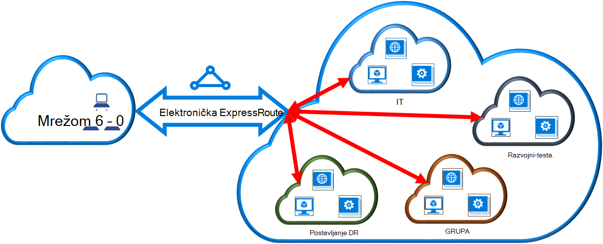

<properties
   pageTitle="Povezivanje virtualne mreže je elektronička ExpressRoute pomoću model klasični implementacije i PowerShell | Microsoft Azure"
   description="Ovaj dokument sadrži pregled uputa za povezivanje virtualne mreže (VNets) ExpressRoute krugova pomoću model klasični implementacije i PowerShell."
   services="expressroute"
   documentationCenter="na"
   authors="ganesr"
   manager="carmonm"
   editor=""
   tags="azure-service-management"/>
<tags
   ms.service="expressroute"
   ms.devlang="na"
   ms.topic="article"
   ms.tgt_pltfrm="na"
   ms.workload="infrastructure-services"
   ms.date="10/10/2016"
   ms.author="ganesr" />

# Povezivanje virtualne mreže je elektronička ExpressRoute

> [AZURE.SELECTOR]
- [Azure portala - Voditelj resursa](expressroute-howto-linkvnet-portal-resource-manager.md)
- [PowerShell – Voditelj resursa](expressroute-howto-linkvnet-arm.md)
- [PowerShell – klasični](expressroute-howto-linkvnet-classic.md)

U ovom se članku pronaći ćete povezati Azure ExpressRoute krugova virtualne mreže (VNets) pomoću model klasični implementacije i PowerShell. Virtualne mreže mogu biti dio iste pretplate ili može biti dio drugu pretplatu.

**O modelima Azure implementacije**

[AZURE.INCLUDE [vpn-gateway-clasic-rm](../../includes/vpn-gateway-classic-rm-include.md)]

## Preduvjeti za konfiguraciju

1. Morate najnoviju verziju modula Azure PowerShell. Najnovije moduli PowerShell možete preuzeti iz odjeljka PowerShell [stranice s preuzimanjima Azure](https://azure.microsoft.com/downloads/). Slijedite upute u [načinu instaliranja i konfiguriranja Azure PowerShell](../powershell-install-configure.md) postupne upute o tome kako konfigurirati računalo da biste koristili modula Azure PowerShell.
2. Morate pregledati [preduvjeti](expressroute-prerequisites.md), [preduvjeti za usmjeravanje](expressroute-routing.md)i [tijekove rada](expressroute-workflows.md) prije nego što počnete konfiguracije.
3. Mora imati aktivan elektronička za ExpressRoute.
    - Slijedite upute da biste [stvorili je elektronička ExpressRoute](expressroute-howto-circuit-classic.md) i imati davatelja povezivanje omogućiti na elektronička.
    - Provjerite možete li se Azure privatne peering konfigurirana za vaše elektronička. Potražite u članku [Konfiguriranje usmjeravanje](expressroute-howto-routing-classic.md) usmjeravanje upute.
    - Provjerite je li Azure privatne peering je konfiguriran i BGP peering između mreže i Microsoft je gore tako da možete omogućiti povezivanje završetka do kraja.
    - Morate imati virtualne mreže i virtualne mreže pristupnika stvorili i potpuno dodjeli. Slijedite upute za [Konfiguriranje virtualne mreže za ExpressRoute](expressroute-howto-vnet-portal-classic.md).

Do 10 virtualne mreže možete povezati je elektronička ExpressRoute. Sve virtualne mreže mora biti u istoj Geopolitički regiji. Možete povezati veći broj virtualne mrežama za vaše elektronička ExpressRoute ili vezu virtualne mrežama u drugim regijama Geopolitički ako je omogućeno premium dodatak ExpressRoute. Pročitajte [Najčešća pitanja vezana uz](expressroute-faqs.md) više pojedinosti o dodatak premium.

## Povezivanje virtualne mreže u okviru iste pretplate na elektronička

Virtualne mreže je elektronička ExpressRoute možete povezati pomoću sljedeći cmdlet. Provjerite je li pristupnik virtualne mreže se stvara i spreman je za povezivanje prije pokrenite cmdlet.

    New-AzureDedicatedCircuitLink -ServiceKey "*****************************" -VNetName "MyVNet"
    Provisioned

## Povezivanje virtualne mreže u neku drugu pretplatu na elektronička

Možete zajednički koristiti je elektronička ExpressRoute preko višestruke pretplate. Na sljedećoj slici prikazan je jednostavna koji schematic od načina zajedničkog korištenja radi ExpressRoute krugova preko višestruke pretplate.

Svaki od manjih oblaka unutar velike oblaka koristi se za predstavljanje pretplate koji pripadaju različitim odjelima unutar tvrtke ili ustanove. Svaki od odjelima unutar tvrtke ili ustanove možete koristiti svoje pretplate za uvođenje servisa – ali odjeljaka možete zajednički koristiti jednu elektronička ExpressRoute za povezivanje lokalne mreže. Jednom odjelu (u ovom primjeru: IT) mogu biti vlasnici elektronička ExpressRoute. Druge pretplate za unutar tvrtke ili ustanove možete koristiti elektronička ExpressRoute.

>[AZURE.NOTE] Povezivanje i propusnosti naknade za namjenski elektronička će se primijeniti na vlasnik elektronička ExpressRoute. Sve virtualne mreže zajednički koristiti iste propusnosti.

### Administracija

*Elektronička vlasnik* je administrator/coadministrator pretplate u kojem je stvorena elektronička ExpressRoute. Vlasnik elektronička možete Autorizirajte administratori/coadministrators druge pretplata se nazivaju *elektronička korisnicima*da biste koristili namjenski elektronička koji su u vašem vlasništvu. Elektronička korisnici koji imaju dozvolu za korištenje u tvrtki ili ustanovi ExpressRoute elektronička možete povezati virtualne mreže u svoje pretplate elektronička ExpressRoute nakon što oni imaju dozvolu.

Vlasnik elektronička sadrži power za izmjenu i oduzimanje autorizacijama u bilo kojem trenutku. Opozivanje odobrenje rezultirat će sve veze koje se brišu se iz pretplate čiji pristup je povučen.

### Elektronička vlasnik operacije

#### Stvaranje odobrenje

Vlasnik elektronička neadministratorskog administratori druge pretplate za korištenje navedenog elektronička. U sljedećem primjeru administrator elektronička (Contoso IT) omogućuje administrator drugu pretplatu (razvojni-Test) da biste se povezali s elektronička do dva virtualne mreže. Contoso IT administratoru omogućuje to navođenjem ID Microsoft razvojni-testa. Cmdlet ne slanje e-pošte na navedeni Microsoft ID-a. Vlasnik elektronička mora izričito obavijestiti druge vlasnik pretplate autorizacija dovršetka.

    New-AzureDedicatedCircuitLinkAuthorization -ServiceKey "**************************" -Description "Dev-Test Links" -Limit 2 -MicrosoftIds 'devtest@contoso.com'

    Description         : Dev-Test Links
    Limit               : 2
    LinkAuthorizationId : **********************************
    MicrosoftIds        : devtest@contoso.com
    Used                : 0

#### Pregled autorizacijama

Vlasnik elektronička možete pregledati sve autorizacijama koje izdaje na određeni elektronička tako da pokrenete sljedeći cmdlet:

    Get-AzureDedicatedCircuitLinkAuthorization -ServiceKey: "**************************"

    Description         : EngineeringTeam
    Limit               : 3
    LinkAuthorizationId : ####################################
    MicrosoftIds        : engadmin@contoso.com
    Used                : 1

    Description         : MarketingTeam
    Limit               : 1
    LinkAuthorizationId : @@@@@@@@@@@@@@@@@@@@@@@@@@@@@@@@@@@@
    MicrosoftIds        : marketingadmin@contoso.com
    Used                : 0

    Description         : Dev-Test Links
    Limit               : 2
    LinkAuthorizationId : &&&&&&&&&&&&&&&&&&&&&&&&&&&&&&&&&&&&
    MicrosoftIds        : salesadmin@contoso.com
    Used                : 2

#### Ažuriranje autorizacijama

Vlasnik elektronička možete izmijeniti autorizacijama pomoću sljedeći cmdlet:

    Set-AzureDedicatedCircuitLinkAuthorization -ServiceKey "**************************" -AuthorizationId "&&&&&&&&&&&&&&&&&&&&&&&&&&&&"-Limit 5

    Description         : Dev-Test Links
    Limit               : 5
    LinkAuthorizationId : &&&&&&&&&&&&&&&&&&&&&&&&&&&&&&&&&&&&&&
    MicrosoftIds        : devtest@contoso.com
    Used                : 0

#### Brisanje autorizacijama

Vlasnik elektronička možete revoke/brisanje autorizacijama korisniku tako da pokrenete sljedeći cmdlet:

    Remove-AzureDedicatedCircuitLinkAuthorization -ServiceKey "*****************************" -AuthorizationId "###############################"

### Elektronička korisničkog operacija

#### Pregled autorizacijama

Korisniku elektronička možete pregledati autorizacijama pomoću sljedeći cmdlet:

    Get-AzureAuthorizedDedicatedCircuit

    Bandwidth                        : 200
    CircuitName                      : ContosoIT
    Location                         : Washington DC
    MaximumAllowedLinks              : 2
    ServiceKey                       : &&&&&&&&&&&&&&&&&&&&&&&&&&&&&&&&&&&&
    ServiceProviderName              : equinix
    ServiceProviderProvisioningState : Provisioned
    Status                           : Enabled
    UsedLinks                        : 0

#### Iskorištavanja autorizacijama veze

Korisniku elektronička možete pokrenuti sljedeći cmdlet da biste iskoristili vezu autorizacije:

    New-AzureDedicatedCircuitLink –servicekey "&&&&&&&&&&&&&&&&&&&&&&&&&&" –VnetName 'SalesVNET1'

    State VnetName
    ----- --------
    Provisioned SalesVNET1

## Daljnji koraci

Dodatne informacije o ExpressRoute potražite u članku [Najčešća pitanja vezana uz ExpressRoute](expressroute-faqs.md).
