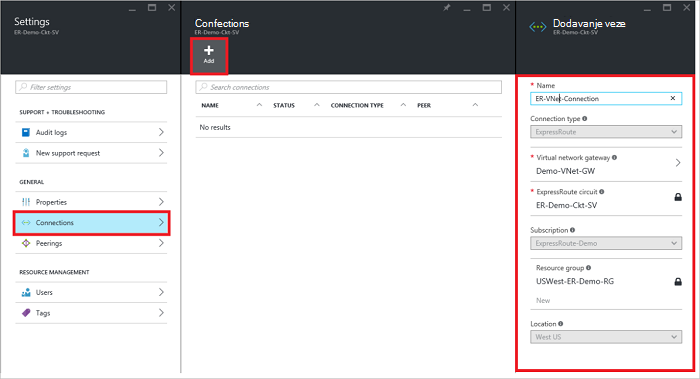
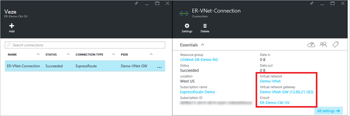

<properties
   pageTitle="Povezivanje virtualne mreže je elektronička ExpressRoute pomoću model implementacije Voditelj resursa i Azure portal | Microsoft Azure"
   description="Ovaj dokument sadrži pregled načina da biste se povezali virtualne mreže (VNets) ExpressRoute krugova."
   services="expressroute"
   documentationCenter="na"
   authors="cherylmc"
   manager="carmonm"
   editor=""
   tags="azure-resource-manager"/>
<tags
   ms.service="expressroute"
   ms.devlang="na"
   ms.topic="article"
   ms.tgt_pltfrm="na"
   ms.workload="infrastructure-services"
   ms.date="10/10/2016"
   ms.author="cherylmc" />

# Povezivanje virtualne mreže je elektronička ExpressRoute

> [AZURE.SELECTOR]
- [Azure portala - Voditelj resursa](expressroute-howto-linkvnet-portal-resource-manager.md)
- [PowerShell – Voditelj resursa](expressroute-howto-linkvnet-arm.md)
- [PowerShell – klasični](expressroute-howto-linkvnet-classic.md)

U ovom se članku pronaći ćete povezati Azure ExpressRoute krugova virtualne mreže (VNets) pomoću model implementacije Voditelj resursa i Azure portal. Virtualne mreže mogu biti dio iste pretplate ili mogu biti dio pretplate na drugi.

**O modelima Azure implementacije**

[AZURE.INCLUDE [vpn-gateway-clasic-rm](../../includes/vpn-gateway-classic-rm-include.md)]

## Preduvjeti za konfiguraciju

- Pripazite da pregledate [preduvjeti](expressroute-prerequisites.md), [usmjeravanje preduvjeti](expressroute-routing.md)i [tijekove rada](expressroute-workflows.md) prije nego što počnete konfiguracije.
- Mora imati aktivan elektronička za ExpressRoute.
    - Slijedite upute da biste [stvorili je elektronička ExpressRoute](expressroute-howto-circuit-arm.md) i imati elektronička omogućeno vaš davatelj povezivanje.

    - Provjerite možete li se Azure privatne peering konfigurirana za vaše elektronička. Potražite u članku [Konfiguriranje usmjeravanje](expressroute-howto-routing-portal-resource-manager.md) usmjeravanje upute.

    - Provjerite je li Azure privatne peering je konfiguriran i BGP peering između mreže i Microsoft je gore tako da možete omogućiti povezivanje završetka do kraja.

    - Provjerite možete li se virtualne mreže i virtualne mreže pristupnika stvorili i potpuno dodjeli. Slijedite upute da biste stvorili [pristupnik VPN-a](../articles/vpn-gateway/vpn-gateway-howto-site-to-site-resource-manager-portal.md) (slijedite samo korake 1-5).

Standardni ExpressRoute elektronička možete povezati do 10 virtualne mreže. Sve virtualne mreže mora biti u istoj Geopolitički regiji prilikom korištenja standardne elektronička ExpressRoute. Možete povezati virtualne mreže izvan područje Geopolitički elektronička ExpressRoute ili povezati veći broj virtualne mreže vaše elektronička ExpressRoute ako je omogućeno premium dodatak ExpressRoute. Pročitajte [Najčešća pitanja vezana uz](expressroute-faqs.md) više pojedinosti o dodatak premium.

## Povezivanje virtualne mreže u okviru iste pretplate na elektronička

### Stvaranje veze

1. Provjerite je li da ExpressRoute elektronička i Azure privatne peering nije konfiguriran uspješno. Slijedite upute u [je elektronička ExpressRoute za stvaranje](expressroute-howto-circuit-arm.md) i [Konfiguriranje usmjeravanja](expressroute-howto-routing-arm.md). Vaša elektronička ExpressRoute trebao izgledati kao na sljedećoj slici.

    

    >[AZURE.NOTE] Informacije o konfiguraciji BGP neće se prikazivati ako davatelj layer 3 konfigurirano vaše peerings. Ako je vaša elektronička dodijeljenu stanje, moći da biste stvorili veze.

2. Sada možete započeti vezu da biste se povezali vaš portal virtualne mreže vaše elektronička ExpressRoute za dodjelu resursa. Kliknite **vezu** > **Dodaj** da biste otvorili plohu **Dodaj vezu** , a zatim konfigurirajte vrijednosti. Pogledajte u sljedećem primjeru referencu.

      

3. Kada se veza s uspješno je konfiguriran, connection objekt prikazivat će podatke za povezivanje.

    

### Da biste izbrisali vezu

Vezu možete izbrisati tako da odaberete ikonu za **Brisanje** na plohu za vezu.

## Povezivanje virtualne mreže u neku drugu pretplatu na elektronička

Trenutačno ne može povezati virtualne mreže preko pretplata pomoću portala za Azure. No PowerShell možete koristiti da biste to učinili. Dodatne informacije potražite u članku [PowerShell](expressroute-howto-linkvnet-arm.md) .

## Daljnji koraci

Dodatne informacije o ExpressRoute potražite u članku [Najčešća pitanja vezana uz ExpressRoute](expressroute-faqs.md).
