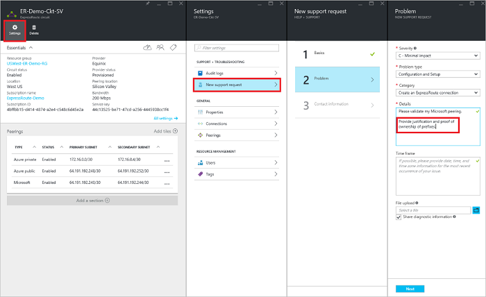

<properties
   pageTitle="Kako konfigurirati usmjeravanja za je elektronička ExpressRoute pomoću portala za Azure | Microsoft Azure"
   description="U ovom se članku vodit će vas kroz korake za stvaranje i dodjela resursa u privatno, javno i Microsoft peering od programa elektronička ExpressRoute. U ovom se članku se objašnjava da biste provjerili status, ažuriranje i brisanje peerings za vaše elektronička."
   documentationCenter="na"
   services="expressroute"
   authors="cherylmc"
   manager="carmonm"
   editor=""
   tags="azure-resource-manager"/>
<tags
   ms.service="expressroute"
   ms.devlang="na"
   ms.topic="hero-article" 
   ms.tgt_pltfrm="na"
   ms.workload="infrastructure-services"
   ms.date="10/10/2016"
   ms.author="cherylmc"/>

# Stvaranje i izmjena usmjeravanja za je elektronička ExpressRoute

> [AZURE.SELECTOR]
[Azure portala - resursima](expressroute-howto-routing-portal-resource-manager.md)
[PowerShell – resursima](expressroute-howto-routing-arm.md)
[PowerShell – klasični](expressroute-howto-routing-classic.md)

U ovom se članku vodit će vas kroz korake za stvaranje i upravljanje usmjeravanje Konfiguracija programa elektronička ExpressRoute pomoću portala za Azure i model implementacije Voditelj resursa.

**O modelima Azure implementacije**

[AZURE.INCLUDE [vpn-gateway-clasic-rm](../../includes/vpn-gateway-classic-rm-include.md)] 

## Preduvjeti za konfiguraciju

- Pripazite da pregledate stranici [preduvjeti](expressroute-prerequisites.md) , stranice [usmjeravanju preduvjeti](expressroute-routing.md) i stranica [tijekova rada](expressroute-workflows.md) prije nego što počnete konfiguracije.
- Mora imati aktivan elektronička za ExpressRoute. Slijedite upute za [Stvaranje je elektronička ExpressRoute](expressroute-howto-circuit-arm.md) i imati elektronička omogućeno vaš davatelj povezivanje prije nastavka. Elektronička ExpressRoute mora biti u stanju dodijeljenu i omogućena za moći pokretati Cmdlete opisanim.

Ove se upute odnose samo na krugova stvorene pomoću davateljima usluga koja nudi servisa za povezivanje sloja 2. Ako koristite usluga koja nudi upravljanih Layer 3 services (obično je IPVPN, kao što je MPLS), vaš davatelj usluga za povezivanje će konfigurirati i upravljanje usmjeravanje umjesto vas. 

>[AZURE.IMPORTANT] Ne možemo trenutno ne Oglasite peerings konfigurirao davateljima usluga putem portala za upravljanje servisa. Radimo na prije omogućivanja tu mogućnost. Provjerite kod davatelja usluge prije konfiguriranja BGP peerings.

Možete konfigurirati jednu, dvije ili sve tri peerings (Azure privatne, Azure javan i Microsoft) za je elektronička ExpressRoute. Možete konfigurirati peerings u nekom redoslijedu koje odaberete. Međutim, morate učiniti da ste dovršili konfiguraciju svaki peering jedan po jedan. 

## Azure privatne peering

U ovom se odjeljku daju upute o tome kako stvoriti, se, ažuriranje i brisanje Azure privatne peering konfiguracija za je elektronička ExpressRoute. 

### Da biste stvorili Azure privatne peering

1. Konfiguriranje elektronička ExpressRoute. Provjerite je li da se elektronička se potpuno dodjeli davatelj povezivanje prije nastavka.

    

2. Konfiguriranje Azure privatne peering za na elektronička. Pripazite da imate sljedeće stavke prije nego što nastavite sa sljedećim koracima:

    - Na /30 podmreže primarni veze. To ne smije biti dio prostor bilo koje adrese rezervirano virtualna mrežu.
    - Na /30 podmreže sekundarne veze. To ne smije biti dio prostor bilo koje adrese rezervirano virtualna mrežu.
    - Valjani VLAN ID da biste uspostavili ovaj peering na. Provjerite da nema drugih peering u na elektronička koristi isti VLAN ID.
    - KAO broj za peering. Možete koristiti 2-bajtni i 4-bajtnim kao brojevi. Možete koristiti privatnu kao broj za ovaj peering. Provjerite je li se pomoću 65515.
    - Programa MD5 raspršivanje Ako odaberete da biste koristili neki. **Ovo nije obavezno**.

3. Odaberite privatno Azure peering redak, kao što je prikazano u nastavku.
    
    
    

4. Konfiguriranje privatne peering. Na donjoj slici prikazano konfiguracije primjer.

    

    
5. Spremanje konfiguracije kada ste naveli sve parametre. Nakon konfiguriranja je uspješno prihvatio, vidjet ćete nešto slično kao primjeru u nastavku.

    
    

### Da biste pogledali Azure privatne peering detalje

Možete pogledati svojstva Azure privatne peering tako da odaberete u peering.

### Da biste ažurirali Azure privatne peering konfiguracija

Možete odabrati redak peering i izmijenite peering svojstva. 

### Da biste izbrisali Azure privatne peering

Konfiguraciju peering možete ukloniti tako da odaberete ikonu Izbriši kao što je prikazano u nastavku.

## Azure javno peering

U ovom se odjeljku daju upute o tome kako stvoriti, se, ažuriranje i brisanje Azure javno peering konfiguracija za je elektronička ExpressRoute. 

### Da biste stvorili Azure javno peering

1. Konfiguriranje elektronička ExpressRoute. Provjerite je li da se elektronička je potpuno dodjeli davatelj povezivanje prije nastavka Dodatno.

    

2. Konfiguriranje Azure javno peering za na elektronička. Pripazite da imate sljedeće stavke prije nego što nastavite sa sljedećim koracima:

    - Na /30 podmreže primarni veze. 
    - Na /30 podmreže sekundarne veze. 
    - Sve IP adresa za postavljanje ovaj peering mora biti valjane javno IPv4 adrese.
    - Valjani VLAN ID da biste uspostavili ovaj peering na. Provjerite da nema drugih peering u na elektronička koristi isti VLAN ID.
    - KAO broj za peering. Možete koristiti 2-bajtni i 4-bajtnim kao brojevi.
    - Programa MD5 raspršivanje Ako odaberete da biste koristili neki. **Ovo nije obavezno**.

3. Odaberite Azure javno peering redak, kao što je prikazano u nastavku.
    
    
    

4. Konfiguriranje javno peering. Na donjoj slici prikazano konfiguracije primjer.

    

    
5. Spremanje konfiguracije kada ste naveli sve parametre. Nakon konfiguriranja je uspješno prihvatio, vidjet ćete nešto slično kao primjeru u nastavku.

    
    

### Da biste pogledali Azure javno peering detalje

Možete pogledati svojstva Azure javno peering tako da odaberete u peering.

### Da biste ažurirali Azure javno peering konfiguracija

Možete odabrati redak peering i izmijenite peering svojstva. 

### Da biste izbrisali Azure javno peering

Konfiguraciju peering možete ukloniti tako da odaberete ikonu Izbriši kao što je prikazano u nastavku.

## Microsoft peering

U ovom se odjeljku daju upute o tome kako stvoriti, se, ažuriranje i brisanje Microsoft peering configuration je elektronička ExpressRoute. 

### Da biste stvorili Microsoft peering

1. Konfiguriranje elektronička ExpressRoute. Provjerite je li da se elektronička je potpuno dodjeli davatelj povezivanje prije nastavka Dodatno.

    

2. Konfiguriranje Microsoft peering za na elektronička. Pripazite da imate sljedeće informacije prije nastavka.

    - Na /30 podmreže primarni veze. To mora biti valjani javno IPv4 prefiks vlasništvu i registrirana u programa RIR / IRR.
    - Na /30 podmreže sekundarne veze. To mora biti valjani javno IPv4 prefiks vlasništvu i registrirana u programa RIR / IRR.
    - Valjani VLAN ID da biste uspostavili ovaj peering na. Provjerite da nema drugih peering u na elektronička koristi isti VLAN ID.
    - KAO broj za peering. Možete koristiti 2-bajtni i 4-bajtnim kao brojevi.
    - **Objavljeno prefiksi:** Navedite popis svih prefiksi namjeravate Oglasite putem BGP sesiju. Samo javnu IP adresa prefiksi prihvaćaju. Ako planirate slati skup prefiksi možete poslati popis s vrijednostima odvojenima zarezom. Ove prefiksi mora biti registriran vam u programa RIR / IRR.
    - **Kupca ASN:** Ako ste prefiksi oglašavanje koji nije registriran na peering kao broj, možete odrediti kao broj na koji su registrirane. **Ovo nije obavezno**.
    - **Naziv usmjeravanja registra:** Možete odrediti na RIR / IRR prema kojima je kao što je broj i prefiksi registrirane. **Ovo nije obavezno.**
    - Programa MD5 raspršivanje, ako odlučite koristiti jedan. **Ovo nije obavezno.**
    
3. Možete odabrati peering želite konfigurirati kao što je prikazano u nastavku. Odaberite Microsoft peering redak.
    
    
    

4.  Konfiguriranje Microsoft peering. Na donjoj slici prikazano konfiguracije primjer.

    

    
5. Spremanje konfiguracije kada ste naveli sve parametre. 

    Ako vaš elektronička mogu Provjera valjanosti potrebno stanje (kao što je prikazano u nastavku), morate otvoriti u zahtjev za podršku možete da bi se prikazala dokaz vlasništva nad prefiksi za naš tim za podršku.  
    
    

    Zahtjev za podršku možete možete otvoriti izravno na portalu kao što je prikazano u nastavku   
    
    

6. Nakon konfiguriranja je uspješno prihvatio, vidjet ćete nešto slično kao primjeru u nastavku.

    
    

### Da biste pogledali Microsoft peering detalje

Možete pogledati svojstva Azure javno peering tako da odaberete u peering.

### Da biste ažurirali Microsoft peering konfiguracija

Možete odabrati redak peering i izmijenite peering svojstva. 

### Da biste izbrisali Microsoft peering

Konfiguraciju peering možete ukloniti tako da odaberete ikonu Izbriši kao što je prikazano u nastavku.

## Daljnji koraci

Sljedeći korak, [vezu VNet da biste je elektronička ExpressRoute](expressroute-howto-linkvnet-arm.md).

-  Dodatne informacije o tijekovima rada za ExpressRoute potražite u članku [ExpressRoute tijekova rada](expressroute-workflows.md).

-  Dodatne informacije o elektronička peering potražite u članku [ExpressRoute krugova i usmjeravanje domene](expressroute-circuit-peerings.md).

-  Dodatne informacije o radu s virtualne mreže potražite u članku [Pregled virtualne mreže](../virtual-network/virtual-networks-overview.md).

