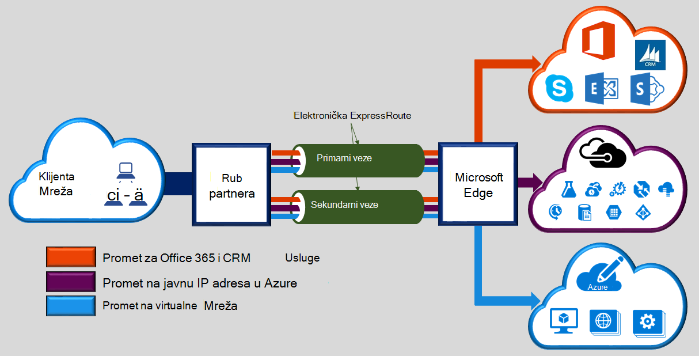
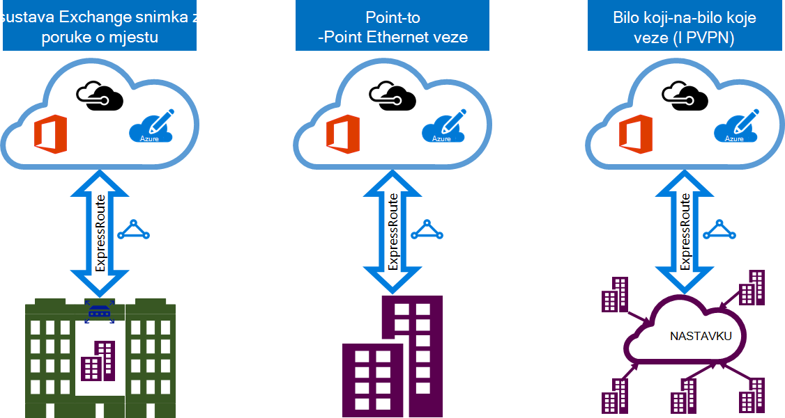

<properties 
   pageTitle="Uvod u ExpressRoute | Microsoft Azure"
   description="Ova stranica sadrži pregled ExpressRoute servisa, uključujući funkcioniranje vezu s ExpressRoute."
   documentationCenter="na"
   services="expressroute"
   authors="cherylmc"
   manager="carmonm"
   editor=""/>
<tags 
   ms.service="expressroute"
   ms.devlang="na"
   ms.topic="get-started-article" 
   ms.tgt_pltfrm="na"
   ms.workload="infrastructure-services" 
   ms.date="10/10/2016"
   ms.author="cherylmc"/>

# ExpressRoute Tehnički pregled

Microsoft Azure ExpressRoute omogućuje širenje vaše lokalne mreže Microsoft cloud putem namjenski privatne veze olakšano davatelj povezivanje. S ExpressRoute, možete uspostaviti veze s Microsoftovim servisima u oblaku, kao što je Microsoft Azure, Office 365 i CRM Online. Povezivanje može biti iz programa bilo koje-na-bilo koje mreže (VPN-a IP), point-to-point Ethernet mreže ili virtualne unakrsno-vezu putem davatelja povezivanja na funkciju zajednički mjesto. ExpressRoute veze ne otvorite putem javnog Interneta. Time se omogućuje ExpressRoute veze ponuditi dodatne pouzdanosti, brže brzine, donjem latencies i veću sigurnost od standardne veze putem Interneta.

**Ključne prednosti obuhvaćaju sljedeće:**

- Slojeva 3 veze između lokalne mreže i Microsoft Cloud putem davatelja povezivanja. Povezivanje može biti na bilo koje-na-bilo koje (IPVPN) mreži, Ethernet veze za point-to-point ili putem virtualne unakrsno-veze putem sustava exchange Ethernet.
- Povezivanje s Microsoftovim servisima u oblaku preko sve regije u području Geopolitički.
- Globalni povezivanje s Microsoftovim servisima u svim regijama s ExpressRoute premium dodatak.
- Dinamični usmjeravanje između mreže i Microsoft putem standardnih industrijskih protokola (BGP).
- Ugrađeni zalihosti svaki peering mjesto za veća pouzdanost.
- Vrijeme veze aktivnosti [SLA](https://azure.microsoft.com/support/legal/sla/).
- QoS i podršku za više klase pružanja usluge za posebne aplikacija, kao što je Skype za tvrtke.

[Najčešća pitanja vezana uz ExpressRoute](expressroute-faqs.md) dodatne pojedinosti potražite u članku.

## Kako povezati mojoj mreži Microsoftu pomoću ExpressRoute?

Možete stvoriti vezu između lokalne mreže i Microsoft cloud na tri načina:

### Suradnja na adresi oblaka exchange

Ako Suradnja nalazi u funkciji sa sustavom exchange oblaka, redoslijed možete virtualne unakrsno-veze Microsoft cloud putem davatelja zajednički mjesto Ethernet exchange. Suautorstvo mjesto možete nudi više veza sloja 2 ili upravljanih Layer 3 unakrsno-veze između preduvjete infrastrukture u funkciji zajednički mjesto i Microsoft cloud.

### Point-to-Point Ethernet veza 

Lokalni podatkovnim centrima/ureda možete povezati s Microsoft cloud kroz point-to-point Ethernet veze. Davatelji Ethernet Point-to-Point može ponuditi sloja 2 veze ili upravlja Layer 3 veze između web-mjesta i Microsoft cloud.

### Bilo koji-na-bilo koje mreža (IPVPN)

Vaš WAN možete integrirati s Microsoft cloud. IPVPN (obično MPLS VPN-a) nudi bilo koje-na-bilo koje veze između podružnicama i podatkovnim centrima. Microsoft cloud može biti povezana za vaše WAN kako bi izgledao baš kao i sve druge podružnici. WAN davatelji usluga obično nude upravljanih povezivanje Layer 3. ExpressRoute mogućnosti i značajke jednaki sve preko svih iznad modeli povezivanja s. 

Povezivanje davatelji može ponuditi modeli povezivanja s. Možete raditi s davateljem povezivanje da biste odabrali modela koji vam najviše odgovara.

## ExpressRoute značajke

ExpressRoute podržava sljedeće značajke i mogućnosti: 

### Povezivanje Layer 3

Microsoft koristi standardni dinamički usmjeravanje protokol (BGP) za razmjenu usmjerava između lokalne mreže, vaš instance Azure i Microsoft javno adrese.  Ne možemo uspostaviti više sesija BGP sa svojom mrežom za različite promet profile. Dodatne informacije pronaći ćete u članku [ExpressRoute elektronička i usmjeravanje domene](expressroute-circuit-peerings.md) .

### Zalihosti

Svaki ExpressRoute elektronička sastoji se od dvije veze na dva Microsoft Enterprise rub usmjerivača (MSEEs) davatelja povezivanje / svoje mreže ruba. Microsoft će zahtijevaju dva BGP vezu davatelja povezivanje / strani – jedan za svaki MSEE. Možda odlučite da ne želite implementirati suvišnih uređaji / Ethernet informaciju sklopova i na kraju. No povezivanje davatelji koristiti suvišnih uređaje da biste bili sigurni da vaše veze su isporučeni Microsoftu suvišnih način. Suvišne konfiguracije povezivanje Layer 3 za preduvjet je naš [SLA](https://azure.microsoft.com/support/legal/sla/) vrijedi. 

### Veza s Microsoftovim servisima u oblaku

[AZURE.INCLUDE [expressroute-office365-include](../../includes/expressroute-office365-include.md)]

ExpressRoute veza Omogući pristup sljedeći servisi:

- Servisa Microsoft Azure
- Servise sustava Microsoft Office 365
- Microsoft CRM Online services 
 
Možete posjetiti stranici [Najčešća pitanja vezana uz ExpressRoute](expressroute-faqs.md) za detaljni popis servisa podržano putem ExpressRoute.

### Povezivanje za sve regije unutar Geopolitički područja

Možete se povezati na Microsoft u našem [peering mjesta](expressroute-locations.md) te imati pristup svim regijama unutar Geopolitički područja. 

Ako, na primjer, ako povezani Microsoftu Amsterdam kroz ExpressRoute će imati pristup sve Microsoftovim servisima u oblaku smješten u Sjeverna Europa i zapadnjački Europe. Pogledajte [ExpressRoute partnera i peering mjesta](expressroute-locations.md) članak da biste saznali kako Geopolitički područja, pridruženi Microsoft cloud regije i odgovarajuće ExpressRoute peering mjesta.

### Globalni povezivanje s ExpressRoute premium dodatak

Možete omogućiti značajku ExpressRoute premium dodatak da biste proširili povezivanje preko granica Geopolitički. Ako, na primjer, ako ste povezani Microsoftu Amsterdam putem ExpressRoute, će imati pristup svim Microsoft cloud usluga koje se nalaze u svim regijama širom svijeta (Izuzeto nacionalna oblaka). Možete pristupiti servisima implementiran u Južna Amerika ili Australija na isti način kao i pristup područja Sjeverna i Zapad Europe.

### Obogaćeni povezivanje partnera zajednici

ExpressRoute sadrži sve neprestano veći zajednici davatelja usluga za povezivanje i partnerima promijeni. Možete se referirati na članak [ExpressRoute davatelji i mjesta](expressroute-locations.md) za najnovije informacije.

### Veza s nacionalna oblaka

Microsoft pristajete Izolirani oblaka okruženja za posebne Geopolitički regije i klijentima. Odnose se na stranici [davatelji ExpressRoute i mjesta](expressroute-locations.md) za popis nacionalna oblaka i davatelje usluga.

### Mogućnosti podržane propusnosti

Možete kupiti krugova ExpressRoute za širokog raspona bandwidths. Popis podržanih bandwidths navedena u nastavku. Obavezno provjerite kod davatelja usluge povezivanja da biste odredili na popisu podržanih bandwidths pružaju.

- 50 MB/s
- 100 MB/s
- 200 MB/s
- 500 MB/s
- 1 Gbps
- 2 Gbps
- 5 Gbps
- 10 Gbps

### Dinamični skaliranje propusnosti

Imate mogućnost da biste povećali propusnost elektronička ExpressRoute (na najbolji temelj trud) bez potrebe za tear prema dolje na veze. 

### Prilagodljivo naplate modela

Možete odabrati naplate modelu koji vam najviše odgovara. Odabir između naplate modelima navedena u nastavku. Odnose se na stranicu [ExpressRoute najčešća pitanja vezana uz](expressroute-faqs.md) dodatne pojedinosti. 

- **Neograničeno podataka**. ExpressRoute elektronička se naplaćuje utemeljene na mjesečnu naknadu, a sve prijenosa ulazni i izlazni podataka dolazi besplatno troška. 
- **Podatke s ograničenim prometom**. ExpressRoute elektronička se naplaćuje utemeljene na mjesečnu naknadu. Prijenos svih ulaznih podataka je besplatna. Prijenos podataka izlaznog se naplaćuje po GB prijenos podataka. Brzinu prijenosa razlikuju se po regijama.
- **ExpressRoute premium dodatak**. Dodatak je ExpressRoute premium putem elektronička ExpressRoute. Dodatak premium ExpressRoute nudi sljedeće mogućnosti: 
    - Povećana usmjeravanje ograničenja za Azure javnih i Azure privatne peering iz 4000 usmjerava na 10 000 usmjerava.
    - Globalni povezivanje za servise. Programa elektronička ExpressRoute koja je stvorena u bilo kojem regiji (bez nacionalna oblaka) će imati pristup resursima preko bilo kojeg područja svijeta. Na primjer, virtualne mreže stvorene u Europi Zapad možete pristupiti putem programa ExpressRoute elektronička dodijeljena Silicon udubljenje.
    - Povećana broj veza VNet po sklopovske ExpressRoute od 10 veća ograničenja, ovisno o propusnosti s instalacijom.

## Daljnji koraci

- Informirajte se o ExpressRoute veze i usmjeravanje domene. U odjeljku [ExpressRoute krugova i usmjeravanje domene](expressroute-circuit-peerings.md).
- Pronađite davatelja usluge. Potražite [partnera ExpressRoute i peering mjesta](expressroute-locations.md).
- Provjerite je li sve preduvjete zadovoljeni. Pogledajte [preduvjete ExpressRoute](expressroute-prerequisites.md).
- Pogledajte preduvjete za [usmjeravanje](expressroute-routing.md), [NAT](expressroute-nat.md) i [QoS](expressroute-qos.md).
- Konfiguriranje veza s ExpressRoute.
    - [Stvaranje je elektronička ExpressRoute](expressroute-howto-circuit-classic.md)
    - [Konfiguriranje usmjeravanja](expressroute-howto-routing-classic.md)
    - [Povezivanje s VNet je elektronička ExpressRoute](expressroute-howto-linkvnet-classic.md)
