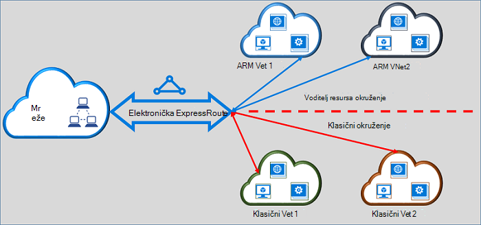

<properties
   pageTitle="Premještanje krugova ExpressRoute od klasičnog upravitelju resursa | Microsoft Azure"
   description="Ova stranica sadrži pregled što trebate znati o premošćivanja na klasični i implementaciju modelima Voditelj resursa."
   documentationCenter="na"
   services="expressroute"
   authors="ganesr"
   manager="carmonm"
   editor=""/>
<tags
   ms.service="expressroute"
   ms.devlang="na"
   ms.topic="get-started-article"
   ms.tgt_pltfrm="na"
   ms.workload="infrastructure-services"
   ms.date="10/10/2016"
   ms.author="ganesr"/>

# Premještanje ExpressRoute krugova s na klasični model implementacije Voditelj resursa

Ovaj članak sadrži pregled što to znači da biste premjestili programa Azure ExpressRoute elektronička iz na klasični model implementacije Azure Voditelj resursa.

[AZURE.INCLUDE [vpn-gateway-sm-rm](../../includes/vpn-gateway-classic-rm-include.md)]

Možete koristiti jedan elektronička ExpressRoute za povezivanje s virtualne mreže koje su uvedene u web-mjesto na klasični i u okvir za implementaciju modelima Voditelj resursa. ExpressRoute sklopovske, bez obzira na način stvaranja, sada možete povezati virtualne mreže preko i implementaciju modela.

## ExpressRoute krugova stvorene u modelu klasični implementacije

ExpressRoute krugova stvorene u modelu uvođenje klasičnog morate će se premjestiti u model implementacije resursima najprije za povezivanje na klasični i implementaciju modelima Voditelj resursa. Ne postoji povezivanje gubitka ili prekidu kada Premjesti veze. Zadržavaju se sve veze elektronička-na-virtualne mreže u modelu uvođenje klasičnog (unutar iste pretplate i unakrsno pretplate).

Po dovršetku premještanje uspješno elektronička ExpressRoute izgleda izvodi te točno onako kao elektronička se ExpressRoute koja je stvorena u model implementacije Voditelj resursa. Sad možete stvarati veze virtualne mreže u modelu implementacije Voditelj resursa.

Nakon programa ExpressRoute elektronička premještena u modelu implementacije Voditelj resursa možete upravljati životnog ciklusa elektronička ExpressRoute samo pomoću model implementacije Voditelj resursa. To znači da koje možete izvršiti operacija kao što su Dodavanje i ažuriranje i brisanje peerings ažuriranje svojstava elektronička (kao što je propusnost, SKU i naplata vrsta) i brisanje krugova samo u model implementacije Voditelj resursa. Pogledajte odjeljak ispod na krugova stvorene u model implementacije resursima dodatne informacije o upravljanju pristup i implementaciju modela.

Ne morate obuhvaćaju davatelja povezivanje da biste izvršili premještanje.

## ExpressRoute krugova stvorene u model implementacije Voditelj resursa

Možete omogućiti ExpressRoute krugova stvorene u model implementacije Voditelj resursa da bi mogao pristupiti iz modela i implementaciju. Da biste se može pristupiti iz modela i implementaciju mogu omogućiti sve elektronička ExpressRoute za pretplatu.

- ExpressRoute krugova koje su stvorene u model implementacije resursima nemaju pristup modelu uvođenje klasičnog prema zadanim postavkama.
- ExpressRoute krugova koji je premještena iz modela uvođenje klasičnog model za uvođenje upravitelj resursa se može pristupiti iz modela i implementaciju prema zadanim postavkama.
- Elektronička se ExpressRoute uvijek ima pristup model implementacije Voditelj resursa, bez obzira na to jesu li je stavka stvorena u Voditelj resursa ili uvođenje klasičnog modela. To znači da možete stvoriti veze na virtualne mreže stvorene u model implementacije resursima slijedeći upute o [tome kako povezati virtualne mreže](expressroute-howto-linkvnet-arm.md).
- Pristup modelu uvođenje klasičnog upravlja parametar **allowClassicOperations** u sklopovske ExpressRoute.

>[AZURE.IMPORTANT] Sve kvote koje su navedenih na stranici [servisa ograničenja](../azure-subscription-service-limits.md) primjenjuju. Kao primjer standardne elektronička može sadržavati najviše 10 virtualne mrežnih veza i veza na klasični i implementaciju modelima Voditelj resursa.

## Upravljanje pristupom model klasični implementacije

Možete omogućiti jedan elektronička ExpressRoute da biste se povezali virtualne mreže u oba modelima implementacije postavljanjem parametar **allowClassicOperations** elektronička ExpressRoute.

Postavljanje **allowClassicOperations** TRUE omogućuje vam da biste se povezali virtualne mrežama iz modela i implementaciju elektronička ExpressRoute. Možete se povezati s virtualne mreže u modelu uvođenje klasičnog tako da slijedite upute [za povezivanje virtualne mreže u modelu klasični implementacije](expressroute-howto-linkvnet-classic.md). Možete se povezati s virtualne mreže u modelu implementacije Voditelj resursa tako da slijedite upute [za povezivanje virtualne mreže u modelu implementacije Voditelj resursa](expressroute-howto-linkvnet-arm.md).

Postavljanje **allowClassicOperations** na FALSE blokira pristup na elektronička iz modela klasični implementacije. Međutim, ostaju prikazani sve veze virtualne mreže u modelu uvođenje klasičnog. U ovom slučaju elektronička ExpressRoute nije vidljiv u modelu klasični implementacije.

## Podržani operacije u modelu klasični implementacije

Sljedeće postupke klasični podržani su na je elektronička ExpressRoute kada **allowClassicOperations** postavljen na TRUE:

 - ExpressRoute elektronička informacije
 - Stvaranje/ažuriranje/get/brisanje virtualne mreže veze na klasični virtualne mreže
 - Stvaranje/ažuriranje/get/brisanje virtualne mreže autorizacijama vezu za povezivanje unakrsno pretplate

Nije moguće izvesti sljedeće radnje klasični kada **allowClassicOperations** postavljen na TRUE:

 - Stvaranje/ažuriranje/get/brisanje peerings obruba pristupnika Protocol (BGP) za Azure privatne, Azure javno i Microsoft peerings
 - Brisanje krugova ExpressRoute

## Komunikacija između na klasični i implementaciju modelima Voditelj resursa

Elektronička ExpressRoute ponaša se kao most između na klasični i implementaciju modelima Voditelj resursa. Promet između virtual machines u virtualne mreže u modelu uvođenje klasičnog i onima u virtualne mreže u tokova modela implementaciju web-resursima kroz ExpressRoute Ako oba virtualne mreže povezane su s istom elektronička ExpressRoute.

Zbrajanja propusnost ograničen propusnost kapacitet pristupnika virtualne mreže. Promet unesite davatelja povezivanje mreža ili mreža u tim slučajevima. Microsoft network potpuno nalaze tijek prometa između virtualne mreže.

## Pristup Azure javno i Microsoft peering resursi

Možete i dalje pristupiti resursa koji se obično može pristupiti putem Azure javno peering i Microsoft peering bez sve prekidu.  

## Što je podržano

U ovom se odjeljku opisuje što je podržano za ExpressRoute krugova:

 - Jedan elektronička ExpressRoute možete koristiti za pristup virtualne mreže koje su uvedene u na klasični i implementaciju modelima Voditelj resursa.
 - Elektronička se ExpressRoute možete premjestiti iz na klasični model implementacije Voditelj resursa. Kada je premjestite, elektronička ExpressRoute izgleda, izgleda te izvodi kao što su druge elektronička ExpressRoute koja je stvorena u model implementacije Voditelj resursa.
 - Možete premjestiti samo elektronička ExpressRoute. Elektronička veze, virtualne mreže i VPN pristupnika nije moguće premjestiti kroz ovaj postupak.
 - Nakon programa ExpressRoute elektronička premještena u modelu implementacije Voditelj resursa možete upravljati životnog ciklusa elektronička ExpressRoute samo pomoću model implementacije Voditelj resursa. To znači da koje možete izvršiti operacija kao što su Dodavanje i ažuriranje i brisanje peerings ažuriranje svojstava elektronička (kao što je propusnost, SKU i naplata vrsta) i brisanje krugova samo u model implementacije Voditelj resursa.
 - Elektronička ExpressRoute ponaša se kao most između na klasični i implementaciju modelima Voditelj resursa. Promet između virtual machines u virtualne mreže u modelu uvođenje klasičnog i onima u virtualne mreže u tokova modela implementaciju web-resursima kroz ExpressRoute Ako oba virtualne mreže povezane su s istom elektronička ExpressRoute.
 - Povezivanjem više pretplata podržava na klasični i implementaciju modelima Voditelj resursa.

## Što nije podržano

U ovom se odjeljku opisuje što nije podržano za ExpressRoute krugova:

 - Premještanje elektronička veze, pristupnika i virtualne mreže s na klasični model implementacije Voditelj resursa.
 - Upravljanje vijek trajanja je elektronička ExpressRoute iz modela klasični implementacije.
 - Na temelju uloga kontrole pristupa (RBAC) podrška za uvođenje klasičnog model. Nećete moći izvršiti RBAC kontrole na elektronička u modelu klasični implementacije. Bilo koji administrator/coadministrator pretplate možete povezati ili prekidanje veze virtualne mrežama s instalacijom.

## Konfiguracija

Slijedite upute opisane u [premjestiti je elektronička ExpressRoute od klasičnog model implementacije Voditelj resursa](expressroute-howto-move-arm.md).

## Daljnji koraci

- Informacije o tijeku rada potražite u članku [ExpressRoute elektronička dodjeljivanje tijekovi rada i elektronička stanja](expressroute-workflows.md).
- Konfiguriranje veza s ExpressRoute:

    - [Stvaranje je elektronička ExpressRoute](expressroute-howto-circuit-arm.md)
    - [Konfiguriranje usmjeravanja](expressroute-howto-routing-arm.md)
    - [Povezivanje virtualne mreže je elektronička ExpressRoute](expressroute-howto-linkvnet-arm.md)
