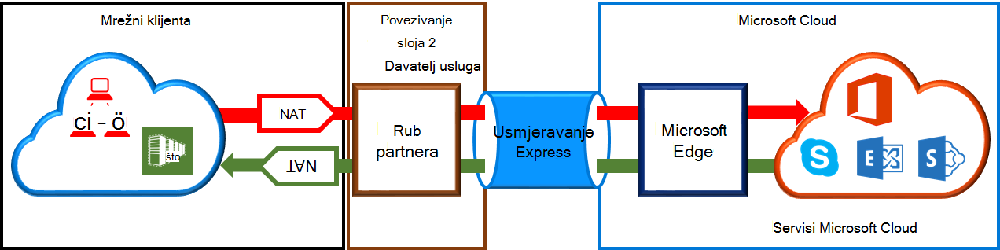

<properties
   pageTitle="Preduvjeti za NAT za ExpressRoute krugova | Microsoft Azure"
   description="Ova stranica sadrži preduvjetima za konfiguriranje i upravljanje NAT za ExpressRoute krugova."
   documentationCenter="na"
   services="expressroute"
   authors="cherylmc"
   manager="carmonm"
   editor=""/>
<tags
   ms.service="expressroute"
   ms.devlang="na"
   ms.topic="get-started-article"
   ms.tgt_pltfrm="na"
   ms.workload="infrastructure-services"
   ms.date="10/10/2016"
   ms.author="cherylmc"/>

# Preduvjeti za ExpressRoute NAT

Da biste se povezali s Microsoftovim pomoću ExpressRoute servisima u oblaku, morat ćete postaviti i upravljati NATs. Neki davatelji usluga povezivanje nude postavljanje i upravljanje NAT kao servis za upravljane. Obratite se davatelju povezivanje da biste vidjeli ako oni nude ovakva usluga. Ako nije, moraju biti preduvjeti opisan u nastavku. 

Pregledajte stranicu [ExpressRoute krugova i usmjeravanje domene](expressroute-circuit-peerings.md) da biste dobili pregled različitih usmjeravanje domena. Da biste zadovoljava javnu IP adresu preduvjete za Azure javno i Microsoft peering, preporučujemo da ste postavili NAT između mreže i Microsoft. U ovom se odjeljku nalaze detaljan opis infrastrukture NAT morate postaviti.

## Preduvjeti za NAT za Azure javno peering

Azure javno peering put omogućuje povezivanje na sve usluge u Azure na javnu IP adrese. To obuhvaća navedenih u [Najčešćim Pitanjima ExpessRoute](expressroute-faqs.md) i sve services hostira tvrtka ISV-ovi na Microsoft Azure. Povezivanje servisa Microsoft Azure na javno peering uvijek pokrene u mreži u mrežu na Microsoft. Promet namijenjene prikazivanju Microsoft Azure na javno peering mora biti SNATed valjani javno IPv4 adrese prije unesu Microsoftovoj mreži. Na slici u nastavku sadrži više razine slika kako se NAT postavile do zadovoljavaju obavezne iznad.

 

### Skup i usmjeravanje oglasa NAT IP

Osigurati da promet unos Azure javno peering put s valjani javno IPv4 adresa. Microsoft moraju imati mogućnost da biste provjerili valjanost vlasništvo nad skupna IPv4 NAT adresa protiv regionalnih usmjeravanje Internet registra (RIR) ili do Internet usmjeravanje registra (IRR). Provjera provest će se ovisno o kao broj koji se peered s i IP adrese za na NAT. Odnose se na stranicu [Zahtjevi za usmjeravanje ExpressRoute](expressroute-routing.md) informacije o usmjeravanje registries.
 
Nema ograničenja na duljinu prefiks NAT IP objavljeno kroz ovaj peering. Morate pratiti skup NAT i bili sigurni da neće starved NAT sesija.

>[AZURE.IMPORTANT] Skup NAT IP objavljeno Microsoftu mora biti objavljeno na Internetu. Tako ćete prekinuti vezu s druge Microsoftove servise.

## Preduvjeti za NAT za Microsoft peering

Microsoft peering put omogućuje povezivanje s Microsoftovim servisima u oblaku koji nisu podržani kroz Azure javno peering put. Na popisu usluga obuhvaća servisima sustava Office 365, kao što je Exchange Online, sustava SharePoint Online, Skype za tvrtke i CRM Online. Microsoft se očekuje za podršku dvosmjerni povezivanje na Microsoft peering. Promet namijenjene prikazivanju u Microsoftovim servisima u oblaku mora biti SNATed valjani javno IPv4 adrese prije unesu Microsoftovoj mreži. Promet namijenjene prikazivanju mreže s Microsoftovim servisima u oblaku mora biti SNATed prije unesu mreže. Na slici u nastavku sadrži više razine slika kako se NAT mora biti instalacijski program za Microsoft peering.
 
 

#### Promet s mrežom namijenjene prikazivanju Microsoftu

- Osigurati da promet unos Microsoft peering put s valjani javno IPv4 adresa. Microsoft moraju imati mogućnost da biste provjerili valjanost vlasnika skupna IPv4 NAT adresa protiv regionalnih usmjeravanje internet registar (RIR) ili do internet usmjeravanje registra (IRR). Provjera provest će se ovisno o kao broj koji se peered s i IP adrese za na NAT. Odnose se na stranicu [Zahtjevi za usmjeravanje ExpressRoute](expressroute-routing.md) informacije o usmjeravanje registries.

- IP adresa koji se koriste za Azure javno peering postavljanje i druge ExpressRoute krugova mora biti objavljeno Microsoftu putem BGP sesiju. Postoji bez ograničenja na duljinu prefiks NAT IP objavljeno kroz ovaj peering.

    >[AZURE.IMPORTANT] Skup NAT IP objavljeno Microsoftu mora biti objavljeno na Internetu. Tako ćete prekinuti vezu s druge Microsoftove servise.

#### Promet potječu od Microsofta namijenjene prikazivanju s mrežom

- Neke scenarije potreban je Microsoft da biste započeli veza s krajnje točke servisa smještena u vašoj mreži. Uobičajeni primjeru scenarija bi veza s poslužiteljima ADFS smješten u vašoj mreži iz sustava Office 365. U tim slučajevima, morate osipanje odgovarajuće prefiksi s mreže u programu Microsoft peering. 

- Morate SNAT promet namijenjene prikazivanju IP adresa u mreži tvrtke Microsoft. 

## Daljnji koraci

- Pogledajte preduvjete za [usmjeravanje](expressroute-routing.md) i [QoS](expressroute-qos.md).
- Informacije o tijeku rada potražite u članku [ExpressRoute elektronička dodjeljivanje tijekovi rada i elektronička stanja](expressroute-workflows.md).
- Konfiguriranje veza s ExpressRoute.

    - [Stvaranje je elektronička ExpressRoute](expressroute-howto-circuit-classic.md)
    - [Konfiguriranje usmjeravanja](expressroute-howto-routing-classic.md)
    - [Povezivanje s VNet je elektronička ExpressRoute](expressroute-howto-linkvnet-classic.md)

