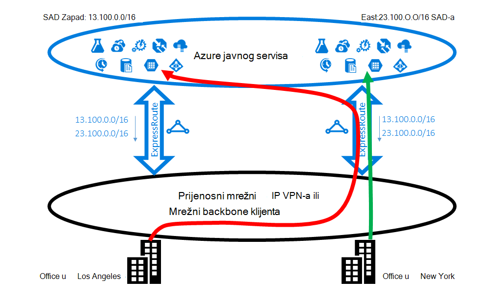
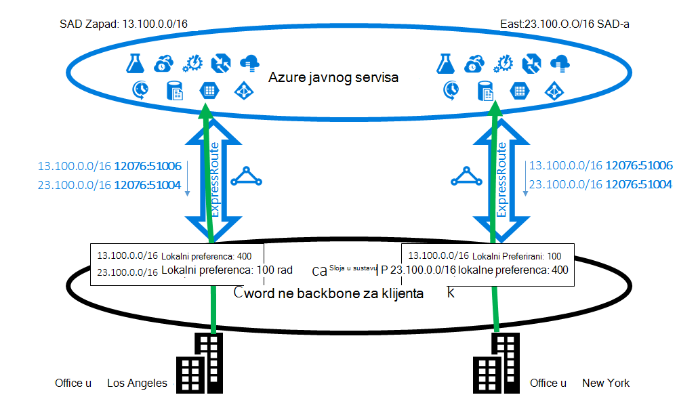
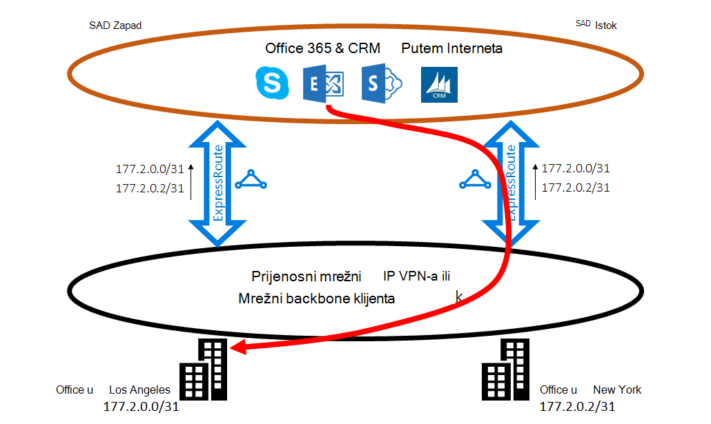
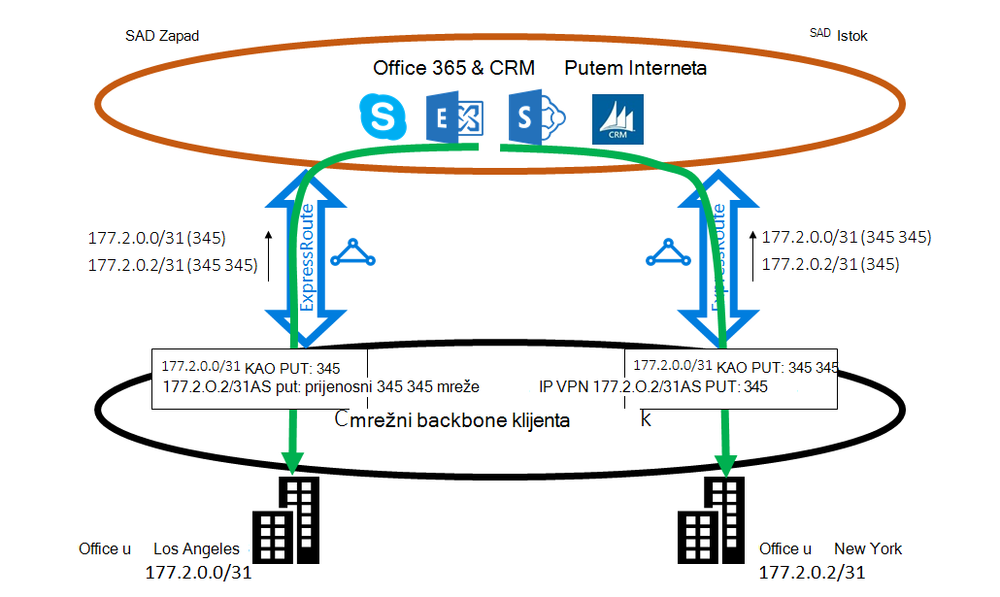

<properties
   pageTitle="Optimiziranje usmjeravanje ExpressRoute | Microsoft Azure"
   description="Ova stranica sadrži detalje o tome kako optimizirati usmjeravanje kada klijent ima više od jedne ExpressRoute krugova koji se povezuju između Microsoft i kupca corp mreže."
   documentationCenter="na"
   services="expressroute"
   authors="charwen"
   manager="carmonm"
   editor=""/>
<tags
   ms.service="expressroute"
   ms.devlang="na"
   ms.topic="get-started-article"
   ms.tgt_pltfrm="na"
   ms.workload="infrastructure-services"
   ms.date="10/10/2016"
   ms.author="charwen"/>

# Optimiziranje usmjeravanje ExpressRoute
Ako imate više ExpressRoute krugova, imate više puta da biste se povezali Microsoftu. Kao rezultat ili lošije usmjeravanje se može dogoditi – to jest, promet za svoju može potrajati više puta do dođete do Microsoft, a zatim Microsoft s mrežom. Na dulje mrežni put, viša Latencija. Latencija ima Izravni utjecaj na performanse i korisničko sučelje aplikacije. U ovom se članku će ilustrirali taj problem i objašnjava kako optimizirati usmjeravanje pomoću standardnih usmjeravanje tehnologije.

## Ili lošije usmjeravanje slučaja 1
Pogledajmo na Zatvori usmjeravanje problem po primjera. Zamislite imate dvije ureda u SAD-u programu Los Angeles i jedan u New Yorku. Vaš ureda spojeni na na širine područje mreže (WAN), koja može biti backbone mreže ili VPN IP vaš davatelj usluga. Imate dvije ExpressRoute krugova, jedan za regije zapada NAM, a druga u NAM Istok, koji spojeni na na WAN. Pogrešno, imate dva puta za povezivanje s mrežom Microsoft. Sada zamislite imate Azure implementacije (npr. Azure aplikacije servisa) u NAM regije zapada i NAM Istok. Namjeru je povezati korisnike u Los Angeles Azure NAM zapada i korisnika u New Yorku za Azure NAM Istok jer je vaš administrator servisa oglašava da korisnici u svakom office pristupiti blizini Azure usluge za optimalne sučelja. Nažalost, plan radi dobro za korisnike Istok obalna, ali ne i za korisnike jadran. Sljedeći je uzrok problema. Na svakom sklopovske ExpressRoute ćemo Oglasite vam prefiks u Azure NAM Istok (23.100.0.0/16) i prefiks u Azure NAM regije zapada (13.100.0.0/16). Ako ne znate koje prefiks je iz koje regije, niste moći njim drugačije. WAN mreže možda razmislite i prefiksa su bliže NAM Istok od NAM regije zapada i stoga usmjeravanje oba korisnici sustava office u elektronička ExpressRoute u NAM Istok. Na kraju, imat ćete mnogo tuga korisnika u sustavu office Los Angeles.

### Rješenje: korištenje BGP zajednice
Da biste optimizirali usmjeravanja za oba korisnici sustava office, morate znati koji prefiks potječe iz Azure NAM zapada i koje Azure NAM Istok. Ove informacije ne možemo kodiranje pomoću [vrijednosti BGP zajednice](expressroute-routing.md). Jedinstvena vrijednost BGP zajednice smo dodijeljen svaki Azure područje, npr., "12076:51004" za NAM Istok, "12076:51006" za regije zapada NAM. Sad kad znate koje prefiks iz koje Azure regije, možete konfigurirati koje elektronička ExpressRoute mora biti Preferirani. Budući da u BGP koristimo za razmjenu usmjeravanje informacije, koji omogućuju BGP na lokalni preferenca utjecati usmjeravanje. U našem primjeru možete dodijeliti veću vrijednost lokalne osobne postavke da biste 13.100.0.0/16 u NAM Zapad od u NAM Istok i na sličan način veću vrijednost lokalne preferenca 23.100.0.0/16 u NAM Istok od u NAM Zapad. Tu konfiguraciju će pripazite da, ako su oba putova Microsoftu dostupna, korisnicima Los Angeles će preuzeti elektronička ExpressRoute u NAM Zapad povezati Azure NAM Zapad dok korisnici u New Yorku odvesti na ExpressRoute u NAM Istok Azure NAM Istok. Usmjeravanje optimiziran je na obje strane. 

## Ili lošije usmjeravanje slučaja 2
Evo još jednog primjera gdje veze iz Microsoft potrajati više puta dosegne vašoj mreži. U ovom slučaju, koristite lokalne poslužitelje sustava Exchange i Exchange Online u [hibridnog okruženja](https://technet.microsoft.com/library/jj200581%28v=exchg.150%29.aspx). Vaš ureda spojeni na WAN. Oglašavanje prefiksi lokalne poslužitelje u obje ureda Microsoftu do dva ExpressRoute krugova. Exchange Online će započeti veze s lokalnim poslužiteljima u slučajevima kao što su Migracija poštanskih sandučića. Nažalost, veze na račun za office Los Angeles usmjeravanja da biste elektronička ExpressRoute u NAM Istok prije traversing cijeli kontinenta natrag da biste na jadran. Uzrok problema je slična prvoga. Bez sve podsjetnik mreže Microsoft ne može odrediti koje kupca prefiks je blizu NAM Istok i koja je blizu NAM Zapad. To će se dogoditi da biste odabrali pogrešnu put na račun za office u Los Angeles.

### Rješenje: korištenje prepending kao put
Postoje dva rješenja problema. Prvi je da jednostavno Oglasite vaše lokalne prefiks za office Los Angeles, 177.2.0.0/31 na sklopovske ExpressRoute u NAM regije zapada i lokalnih prefiks za office New York, 177.2.0.2/31 na sklopovske ExpressRoute u NAM Istok. Zbog toga postoji samo jedan put za Microsoft za povezivanje za svaki od vaših ureda. Postoji bez dvosmislenosti i usmjeravanje optimizacije. U ovom dizajniranje morate razmislite o strategije prebacivanje. Za slučaj da put do Microsoftu ExpressRoute prekine, morate provjerite je li Exchange Online možete i dalje se povezati s lokalnog poslužitelja. 

Drugi rješenje je da nastavite Oglasite i prefiksi na oba ExpressRoute krugova, a uz Pošaljite nam podsjetnik za koje je prefiks blizu koji će vaše ureda. Jer podržavamo prepending BGP kao put, možete konfigurirati kao put za vaše prefiks utjecati usmjeravanja. U ovom primjeru produljiti kao put za 172.2.0.0/31 u NAM Istok tako da se ne možemo će radije elektronička ExpressRoute u NAM Zapad za promet namijenjene prikazivanju na ovaj prefiks (kao što je našu mrežu će mislite da je put do ovaj prefiks kraći u za regije zapada). Na sličan način mogu produljiti kao put za 172.2.0.2/31 u NAM Zapad tako da se ne možemo ćete radije elektronička ExpressRoute u NAM Istok. Usmjeravanje optimiziran je za oba ureda. S ovim dizajnom ako jedan ExpressRoute elektronička se prekida, Exchange Online možete i dalje dosegne vam putem drugog elektronička ExpressRoute i vaše WAN. 

>[AZURE.IMPORTANT] Ne možemo uklonite privatne kao brojevi u obliku put za prefiksi primili na Microsoft Peering. Morate dodati kao brojeva u obliku put do utjecati usmjeravanja za Microsoft Peering.

>[AZURE.IMPORTANT] Dok se primjerima u nastavku navedene su za Microsoft i javni peerings, podržavamo iste mogućnosti za privatne peering. Osim toga, kao put prepending radi unutar jedne jedan ExpressRoute elektronička, koji utječe odabira primarnih i sekundarnih putova.
