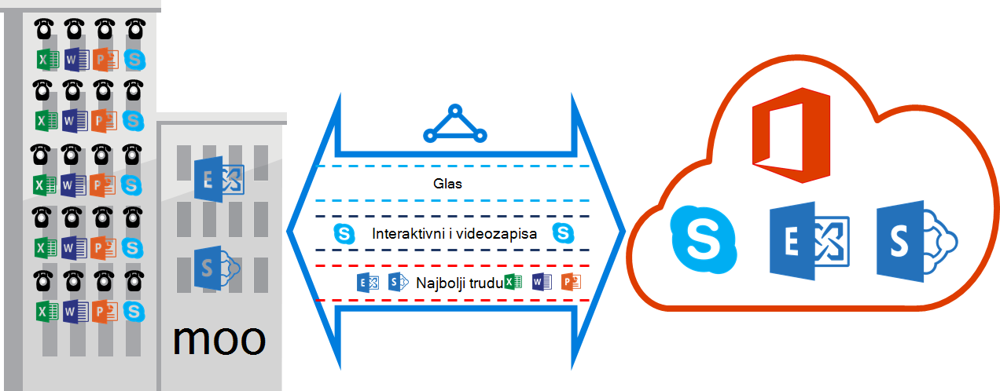

<properties
   pageTitle="QoS preduvjeti za ExpressRoute | Microsoft Azure"
   description="Ova stranica sadrži preduvjetima za konfiguriranje i upravljanje QoS za ExpressRoute krugova."
   documentationCenter="na"
   services="expressroute"
   authors="cherylmc"
   manager="carmonm"
   editor=""/>
<tags
   ms.service="expressroute"
   ms.devlang="na"
   ms.topic="get-started-article"
   ms.tgt_pltfrm="na"
   ms.workload="infrastructure-services"
   ms.date="10/10/2016"
   ms.author="cherylmc"/>

# ExpressRoute QoS preduvjeti

Skype za tvrtke sadrži različite radnih opterećenja koji zahtijevaju isporučujte prilagođena QoS pokusa. Ako planirate usluga za korištenje govorne putem ExpressRoute, trebali biste drži zahtjevima opisan u nastavku.

>[AZURE.NOTE] Preduvjeti za QoS primjenjuju se na Microsoft peering samo. DSCP vrijednosti u mrežni promet za svoju primili na Azure javno peering i Azure privatne peering vratit će se 0. 

Sljedeća tablica sadrži popis oznaka DSCP koristi Skype za tvrtke. Dodatne informacije potražite [Upravljanje QoS za Skype za tvrtke](https://technet.microsoft.com/library/gg405409.aspx) .

| **Promet klase** | **Pokusa (DSCP obilježavanje)** | **Skype za tvrtke radnih opterećenja** |
|---|---|---|
| **Glas** | EF (46) | Skype / govorni servis programa Lync |
| **Interaktivni** | AF41 (34) | Videozapis |
|   | AF21 (18) | Zajedničko korištenje aplikacije | 
| **Zadani** | AF11 (10) | Prijenos datoteka|
|   | CS0 (0) | još nešto| 

- Trebali biste klasificirati na radnih opterećenja i označavanje desnom DSCP vrijednosti. Slijedite upute navedene [u nastavku](https://technet.microsoft.com/library/gg405409.aspx) o tome kako postaviti DSCP oznake u vašoj mreži.

- Trebali biste konfigurirati i podržava više redova QoS u mreži. Govorna mora biti samostalne predmete i primanje pokusa EF naveden u RFC 3246. 

- Možete odlučiti stavljanja mehanizam, zagušenja pravila za otkrivanje i propusnosti dodijeljeni po promet predmete. No DSCP označavanje za Skype za tvrtke radnih opterećenja se moraju moraju sačuvati. Ako koristite DSCP oznake nije naveden, primjerice AF31 (26), morate dopune DSCP vrijednost 0 prije no što pošaljete paket Microsoft. Microsoft šalje samo pakete koji je označen DSCP vrijednost koja se prikazuje u gornju tablicu. 

## Daljnji koraci

- Pogledajte preduvjete za [usmjeravanje](expressroute-routing.md) i [NAT](expressroute-nat.md).
- Pogledajte na sljedećim vezama konfigurirati vezu za ExpressRoute.

    - [Stvaranje je elektronička ExpressRoute](expressroute-howto-circuit-classic.md)
    - [Konfiguriranje usmjeravanja](expressroute-howto-routing-classic.md)
    - [Povezivanje s VNet je elektronička ExpressRoute](expressroute-howto-linkvnet-classic.md)
