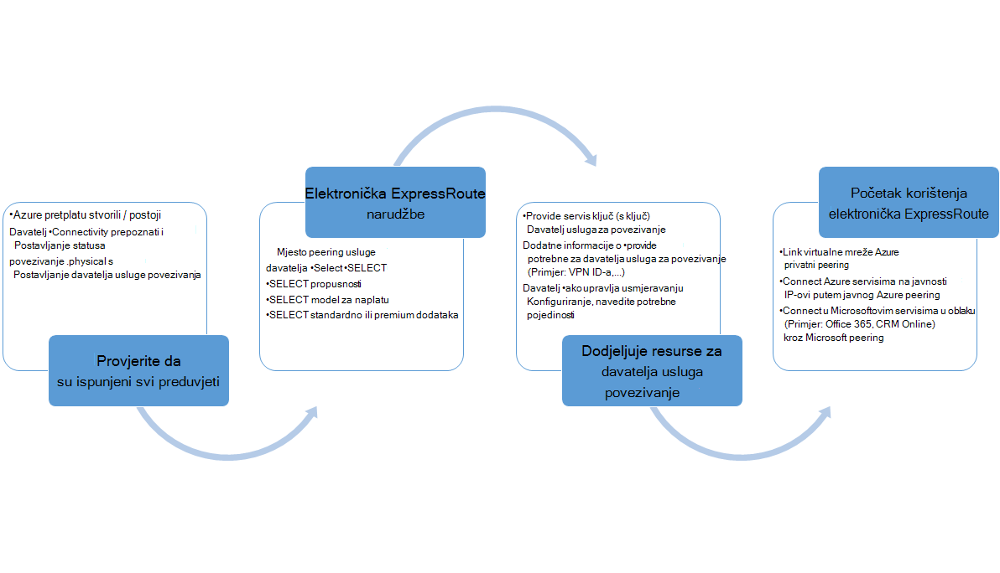
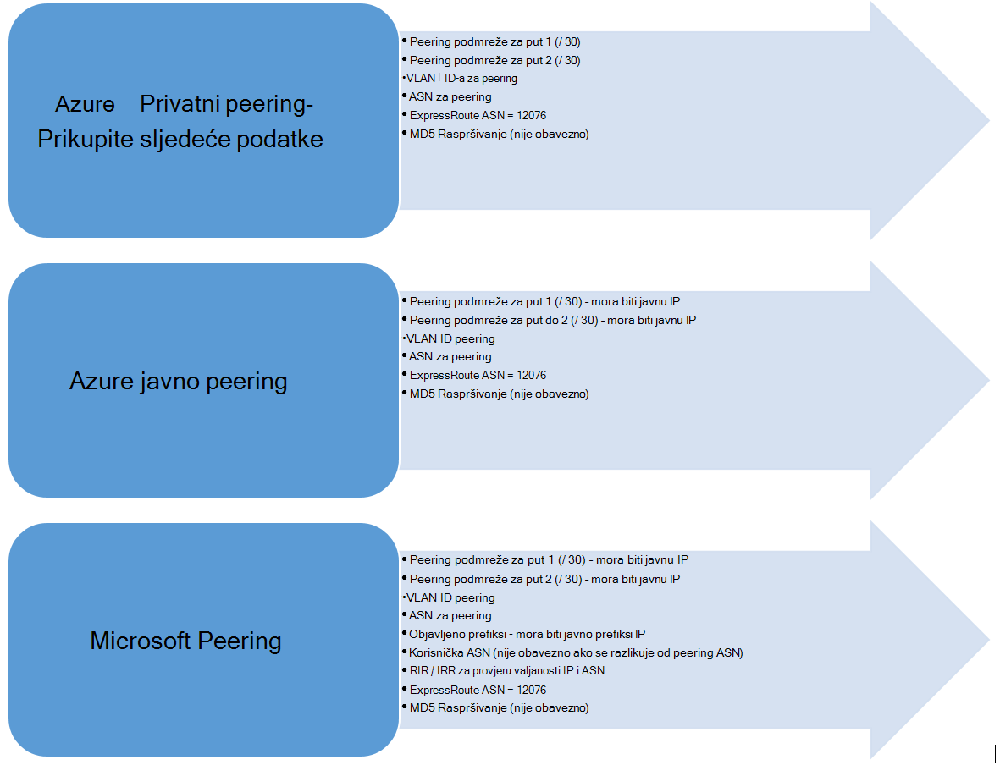

<properties
   pageTitle="Tijekovi rada za konfiguriranje programa elektronička ExpressRoute | Microsoft Azure"
   description="Ova stranica vodit će vas kroz tijekova rada za konfiguriranje elektronička ExpressRoute i peerings"
   documentationCenter="na"
   services="expressroute"
   authors="cherylmc"
   manager="carmonm"
   editor="" />
<tags
   ms.service="expressroute"
   ms.devlang="na"
   ms.topic="article" 
   ms.tgt_pltfrm="na"
   ms.workload="infrastructure-services"
   ms.date="10/10/2016"
   ms.author="cherylmc"/>

# Tijekovi rada ExpressRoute za dodjelu resursa elektronička i elektronička stanja

Ova stranica vodit će vas kroz servis dodjele resursa i usmjeravanje tijekova rada za konfiguraciju na visoku razinu.

Sljedeća slika i odgovarajuće korake prikazuju zadaci koje morate pratiti da bi se ExpressRoute elektronička dodjeli završetka do kraja. 

1. Korištenje ljuske PowerShell za konfiguriranje programa elektronička ExpressRoute. Slijedite upute u članku [Stvaranje ExpressRoute krugova](expressroute-howto-circuit-classic.md) više pojedinosti.

2. Povezivanje redoslijed davatelja usluga. Mijenja se taj postupak. Dodatne informacije o tome da redoslijed povezivanje, obratite se davatelju povezivanje.

3. Provjerite sadrži li na elektronička dodijeljeni resursi uspješno provjerom elektronička ExpressRoute dodjeljivanje stanje putem komponente PowerShell. 

4. Konfiguriranje usmjeravanje domena. Ako vaš davatelj usluga za povezivanje upravlja Layer 3 umjesto vas, oni će konfigurirati usmjeravanja za vaše elektronička. Ako vaš davatelj usluga za povezivanje samo nudi sloja 2 servisi, morate konfigurirati po smjernice opisane u [usmjeravanje preduvjeti](expressroute-routing.md) i [usmjeravanje konfiguracije](expressroute-howto-routing-classic.md) stranice usmjeravanju.

    -  Omogućivanje Azure privatne peering – omogućite ovaj peering za povezivanje s VMs / cloud services implementiran unutar virtualne mreže.
    -  Omogućivanje Azure javno peering – morate omogućiti Azure javno peering ako se želite povezati Azure usluga koje se nalaze na javnu IP adrese. Ovo je zahtjev za pristup Azure resursima ako ste odabrali da biste omogućili zadani usmjeravanja za Azure privatne peering.
    -  Omogućivanje Microsoft peering – to morate omogućiti pristup sustavu Office 365 i CRM online services. 
    
    >[AZURE.IMPORTANT] Osigurati da koristite odvojene proxy / rub da biste se povezali Microsoftu od one koju koristite za Internet. Koristite isti rub za ExpressRoute i Internet će uzrokovati asimetričnim usmjeravanje i uzrokovati kvarove povezivanje za mrežu.

    

5. Povezivanje virtualne mreže da biste ExpressRoute krugova – možete povezati virtualne mreže vaše elektronička ExpressRoute. Slijedite upute [Da biste se povezali VNets](expressroute-howto-linkvnet-arm.md) vaše elektronička. Ove VNets može biti iste pretplate Azure kao elektronička ExpressRoute ili može biti u neku drugu pretplatu.

## Elektronička ExpressRoute dodjeljivanje stanja

Svaki ExpressRoute elektronička sastoji se od dva stanja:

- Servis davatelja dodjele resursa stanja
- Status

Status predstavlja stanja za dodjelu resursa tvrtke Microsoft. Ovo svojstvo postavite na omogućeni prilikom stvaranja je elektronička Expressroute

Stanje dodjele resursa povezivanje davatelja predstavlja stanje na strani davatelja povezivanja. To može biti *NotProvisioned*, *Provisioning*ili *Provisioned*. Elektronička ExpressRoute mora biti u stanju Provisioned umjesto vas da biste mogli koristiti.

### Mogući statusi je elektronička ExpressRoute

U ovom se odjeljku navedeni više mogućih stanja za je elektronička ExpressRoute.

#### Vrijeme stvaranja

Vidjet ćete elektronička ExpressRoute u sljedeće stanju čim pokrenite cmdlet ljuske PowerShell za stvaranje elektronička ExpressRoute.

    ServiceProviderProvisioningState : NotProvisioned
    Status                           : Enabled

#### Kada je davatelj usluga za povezivanje u tijeku dodjele resursa u sklopovske

Vidjet ćete elektronička ExpressRoute u sljedeće stanju čim prenesite ključa usluge davatelj usluga za povezivanje i oni počele postupka dodjele resursa.

    ServiceProviderProvisioningState : Provisioning
    Status                           : Enabled

#### Kada davatelj usluga za povezivanje je dovršena postupak za dodjelu resursa

Vidjet ćete elektronička ExpressRoute u sljedeće stanju čim davatelja povezivanje dovrši postupka dodjele resursa.

    ServiceProviderProvisioningState : Provisioned
    Status                           : Enabled

Dodjeli i omogućeno je stanje samo na elektronička može biti u da biste mogli koristiti. Ako koristite davatelj usluga 2 sloja, možete konfigurirati usmjeravanja za vaše elektronička samo kada je u tom stanju.

#### Kada davatelj usluga za povezivanje je deprovisioning s instalacijom

Ako ste tražili davatelj usluga za deprovision elektronička ExpressRoute, vidjet ćete elektronička postaviti sljedeće stanje nakon dovršetka postupka deprovisioning davatelja usluga.

    ServiceProviderProvisioningState : NotProvisioned
    Status                           : Enabled

Možete odabrati da biste ponovno omogućiti potrebno ili pokrenite PowerShell Cmdlete da biste izbrisali s instalacijom.  

>[AZURE.IMPORTANT] Ako vam ponestane cmdleta ljuske PowerShell da biste izbrisali elektronička kada je dodjele resursa u ServiceProviderProvisioningState ili Provisioned operacija neće uspjeti. Raditi davatelja povezivanje da biste najprije deprovision elektronička ExpressRoute, a zatim izbrišite s instalacijom. Microsoft će i dalje izraditi fakturu u elektronička dok pokrenite cmdlet ljuske PowerShell da biste izbrisali s instalacijom.

## Usmjeravanje stanje sesije konfiguracija

BGP dodjeljivanje stanje obavještava ako sesiju BGP omogućena na Microsoft edge. Stanje mora biti omogućen za moći koristiti u peering.

Da biste provjerili stanje sesije BGP za Microsoft peering, osobito važno je. Osim BGP stanja za dodjelu resursa, postoji drugi stanje naziva *objavljeno javno prefiksi stanje*. Stanje oglašenu javno prefiksi mora biti u *konfiguriran* stanje i sesiju BGP da bi se gore i za usmjeravanje rad završetka do kraja. 

Ako je stanje oglašenu javno prefiks postavljeno na stanje *potrebna Provjera valjanosti* , sesiju BGP nije omogućena, kao što je oglašenu prefiksi ne odgovaraju kao broj u bilo kojem smjeru registries. 

>[AZURE.IMPORTANT] Ako stanje oglašenu javno prefiksi je u stanju *Ručna provjera valjanosti* , morate otvorite zahtjev za podršku možete s [Microsoftovoj podršci](https://portal.azure.com/?#blade/Microsoft_Azure_Support/HelpAndSupportBlade) i navedite dokaz da ste vlasnik IP adrese objavljeno duž brojem povezane Autonomna sustava.

## Daljnji koraci

- Konfiguriranje veza s ExpressRoute.

    - [Stvaranje je elektronička ExpressRoute](expressroute-howto-circuit-arm.md)
    - [Konfiguriranje usmjeravanja](expressroute-howto-routing-arm.md)
    - [Povezivanje s VNet je elektronička ExpressRoute](expressroute-howto-linkvnet-arm.md)
