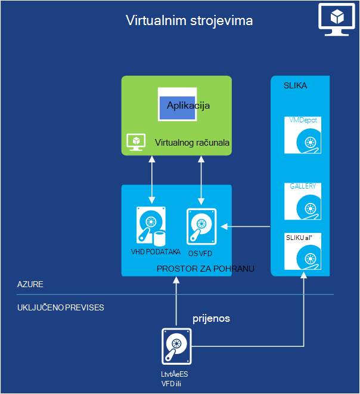
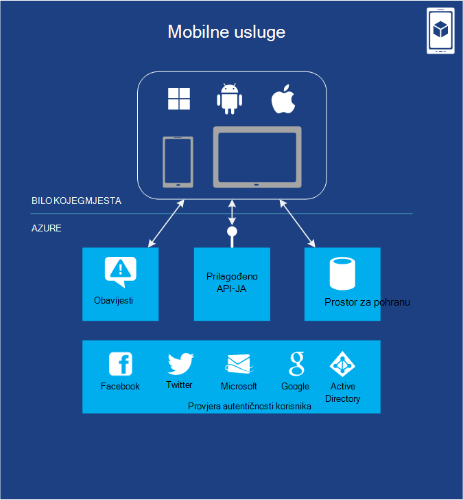
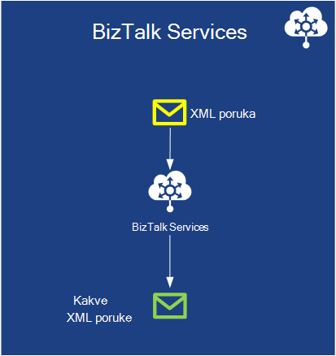
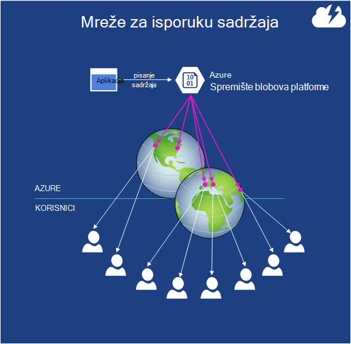

<properties
    pageTitle="Uvod u Microsoft Azure | Microsoft Azure"
    description="Novi korisnik sustava Microsoft Azure? Osnovni pregled servis nudi primjerima kako su korisne."
    services=" "
    documentationCenter=".net"
    authors="rboucher"
    manager="carolz"
    editor=""/>

<tags
    ms.service="multiple"
    ms.workload="multiple"
    ms.tgt_pltfrm="na"
    ms.devlang="na"
    ms.topic="article"
    ms.date="06/30/2015"  
    ms.author="robb"/>

# Uvod u Microsoft Azure

Microsoft Azure je Microsoftovu aplikaciju za javne spremanja.  Cilj ovog članka je vam temelj za razumijevanje osnove Azure, čak i ako ne znate ništa o oblaka računalstvo.

**Upute za ovaj članak**

Azure je rast cijelo vrijeme pa je lako se preopterećene.  Započnite s osnovnim servisima, najprije su navedene u ovom članku, a zatim prijeđite na dodatna servisa. Koji ne znači da ne možete koristiti samo dodatna servisa same, ali osnovne servise čine core aplikacije koje se izvode u Azure.

**Slanje povratnih informacija**

Važno je povratne informacije. U ovom se članku mora vam dati učinkovitih pregled Azure. Ako ne, Recite nam svoje u odjeljak Komentari pri dnu stranice. Dodijelite neki detalj na očekujete da ćete pronaći i kako unaprijediti u članku.  

## Komponente Azure

Azure grupira services u kategorijama na portalu za upravljanje i na razne Prezime kao [Što je Azure Infographic](https://azure.microsoft.com/documentation/infographics/azure/) . Portal za upravljanje je koristiti za upravljanje servisima Većina (ali ne svim) u Azure.

U ovom se članku će koristiti **različite tvrtke ili ustanove** razgovarati o servisima na temelju slične funkcije, a zatim pozivanje važne podređenu servise koji su dio veći one.  

   
 *Slika: Azure nudi Internet pristupačne aplikacije servise u Azure podatkovnim centrima.*

## Portal za upravljanje
Azure ima web-sučelja naziva [Portal za upravljanje](http://manage.windowsazure.com) administratorima omogućuje pristup i upravljati najčešće, ali ne i svih Azure značajke.  Microsoft obično izdaje novija portal korisničkog Sučelja u beta prije povlačenje starije jedan. U novijim se zove ["Azure Portal (pretpregled)"](https://portal.azure.com/).

Postoji obično dugo preklapanja kada su oba portalima aktivne. Dok core services pojavit će se u obje portalima, možda će biti dostupna u vašoj sve funkcije. Novija servise mogu se prikazati u noviji portala prvi i starijim sustavima servisima i funkcionalnosti možda postoje samo u starijim.  Poruka ovdje je koji ako ne pronađete nešto na portalu starije Provjera u novijim i obratno.

## Izračun

Osnovni što ne oblaka platformu je izvršavanje aplikacije. Svaki modela Azure računalnim ima vlastitu uloge za reprodukciju.

Možete koristiti te tehnologije zasebno ili ih spajaju ako je potrebno da biste stvorili desnog foundation aplikacije. Pristup odaberite ovisi o problema koji pokušavate riješiti.

### Azure virtualnim strojevima

   
*Slika: Azure virtualnim strojevima omogućuje potpunu kontrolu nad instance virtualnog računala u oblaku.*

Mogućnost stvaranja virtualnog računala na zahtjev, hoće li se sa standardnom slikom ili iz nešto unesete, može biti vrlo korisna. Taj se način, obično naziva infrastrukture kao Service (IaaS) je što omogućuje virtualnim računalima sustava Azure. Slika 2 prikazuje kombinaciju načinom na virtualnog računala (VM) i kako ga možete stvoriti iz programa VHD.  

Da biste stvorili na VM, odredite koji VHD koristiti i u VM veličina.  Zatim plaćate za vrijeme koje se izvodi na VM. Plaćate minute i samo dok se izvodi, iako naknadu minimalnog prostora za pohranu čuvanja VHD dostupna. Azure nudi galeriju burzovni VHDs (pod nazivom "slike"), a koje sadrže izraditi operacijski sustav za pokretanje. To obuhvaća Microsoft i partnera mogućnosti, kao što su Windows Server i Linux, SQL Server, Oracle i mnogo više. Koje možete slobodno stvaranje VHDs i slike, a zatim prenesite ih sami. Možete čak i prenijeti VHDs koji sadrže samo podatke te im pristupati s vašeg izvodi VMs.

Kad god se VHD potječe iz, persistently možete spremiti promjene koje ste napravili dok se izvodi na VM. Kada sljedeći put stvorite na VM iz tog VHD stvari obraditi tamo gdje ste stali. VHDs koje se sigurnosno virtualnim strojevima spremaju se u prostor za pohranu Azure blob-ova, koje ćemo objasniti što kasnije.  To znači da se zalihosti da biste bili sigurni da neće vaše VMs nestaju zbog pogreške hardver i disk. Također je moguće kopirati promijenjene VHD iz Azure, a zatim izvodi lokalno.

Aplikacija se izvodi u jednu ili više virtualnim strojevima, ovisno o tome kako ga prije nego što je stvorila ili ga sada stvoriti ispočetka.

Da biste riješili mnoge probleme može se koristiti takvog prilično Općenito za računalstvo u oblaku.

**Scenariji virtualnog računala**

1.  **Razvojni i testiranje** - ih može koristiti za stvaranje jeftini razvoj i testiranje platforme koja se može isključiti nakon što završite ga koristiti. Možda i stvaranje i pokretanje aplikacije koje koriste bilo kakve jezika i u bibliotekama vam se sviđa. Tim aplikacijama možete koristiti bilo koju od mogućnosti upravljanja podacima koje nudi Azure, a možete odabrati i da biste koristili SQL Server ili drugi DBMS izvodi u virtualnim računalima.
2.  **Premještanje aplikacijama Azure (Dizalica-a-shift)** – "Dizalica-a-shift" odnosi se na mnogo premještanje aplikacije kao što su koje se koriste u forklift premjestiti velike objekt.  "Podignite" na VHD iz vaše lokalne podatkovnog centra i "shift" je za Azure i pokrenite je.  Obično morat ćete učiniti neke službeni da biste uklonili međuzavisnosti drugi sustavi. Ako ima previše, možda odaberite mogućnost 3.  
3.  **Proširi vaše podatkovnog centra** – korištenje Azure VMs kao datotečni nastavak podatkovnog centra vaše lokalne sa sustavom SharePoint ili drugih aplikacija. Da biste to podržava, moguće je da biste stvorili domena sustava Windows u oblak tako da pokrenete servisa Active Directory u Azure VMs. Azure virtualne mreže (koje se spominju kasnije) možete koristiti sve lokalne mreže i mreže u Azure zajedno.

### Web-aplikacije

   
 *Slika: Azure web-aplikacije pokreće aplikaciju za web-mjesta u oblaku bez potrebe za upravljanje podlozi web-poslužitelj.*

Jedna od najčešće stvari koje osobe u oblaku se izvodi web-mjesta i web-aplikacije. Azure virtualnim strojevima vam to dopušta, ali je i dalje će ostati s odgovornost administriranje jedan ili više VMs i Temeljni operacijski sustavi. To možete učiniti uloge web services za oblaka, ali uvođenje i održavanje ih i dalje potrebno administratora.  Ako želite samo web-mjesto gdje je netko drugi vodi brigu o administratora posla za vas?

To je točno što omogućuje web-aplikacije. Ovaj model računalnim nudi upravljani web-okruženju pomoću portala za upravljanje Azure, kao i API-ji. Možete premjestiti postojeće web-mjesto aplikacije u web-aplikacije koje se ne mijenja ili možete stvoriti novu izravno u oblaku. Kada je pokrenut web-mjesto, koje možete dodati ili ukloniti instance dinamički, potrebe za oslanjanjem na Azure web-aplikacije Učitavanje zahtjeva preko njih. Azure aplikacije nudi zajedničke mogućnost web-mjesta kojima se izvodi virtualnog računala s drugim web-mjestima, i standardne mogućnost koja omogućuje web-mjesta da biste pokrenuli u vlastitom VM. Standardni mogućnost omogućuje vam povećati veličinu (računalstvo power) na instanci po potrebi.

Za razvoj web-aplikacije podržava .NET, PHP, Node.js, jezika Java i Python zajedno s bazom podataka SQL i MySQL (iz ClearDB, Microsoft partner) za relacijske prostora za pohranu. Također nudi ugrađenu podršku za nekoliko popularnih aplikacija, uključujući WordPress, Joomla i Drupal. Cilj je nude platformu najniža cijena, skalabilni i njih svim korisnicima Dopusti korisne za stvaranje web-mjesta i web-aplikacija u javnom oblaka.

**Scenariji Web Apps**

Web Apps je namijenjen je korisno za korporacije, razvojni inženjeri i agencije dizajn web. Za korporacije je jednostavno upravljati, skalabilni, Visoko siguran i vrlo dostupno rješenje za izvođenje prisutnosti web-mjesta. Kada se morate postaviti na web-mjesto, najbolje je da biste započeli Azure web-aplikacije i servise u Oblaku kada vam je potrebna je značajka koja nije dostupna. Potražite na kraju u odjeljku "Računalnim" više veza koje omogućuju vam da odaberete između mogućnosti.

### Servisi u oblaku
   
*Slika: Azure servise u Oblaku omogućuje čuvanje da biste pokrenuli iznimno skalabilni prilagođenog koda na platformi kao okruženje za servis (PaaS)*

Pretpostavimo da želite izraditi oblaka aplikacije koja podržava veći broj korisnika istodobno, ne zahtijeva puno Administracija, a nikada ne funkcionira. Možda ćete se uspostaviti dobavljaču, na primjer, koji odlučio obuhvaćaju softver kao Service (SaaS) tako verziju jednu od vaših aplikacija u oblaku. Ili možda pokretanja stvaranja aplikacije za korisničke koji očekujete da će rasti brzo. Ako ste sastavljanjem na Azure, model koji izvođenja morate koristiti?

Azure web-aplikacije omogućuje stvaranje ove vrste web-aplikacije, ali postoje neka ograničenja. Nemate Administrativni pristup, na primjer, što znači da nije moguće instalirati proizvoljne softver. Azure virtualnim strojevima pruža mnoštvo mogućnosti, uključujući Administrativni pristup i certainly možete je koristite da biste sastavili vrlo skalabilni aplikacije, ali imate rukovati brojne aspekte pouzdanosti i administracija. Što biste željeli je mogućnost koja omogućuje kontrolu morate, ali bavi i većina radi što je potrebno za pouzdanost i administracija.

To je točno što nudi Azure servise u Oblaku. Tehnologije dizajniran je to izričito za podršku prilagodljivi, pouzdanog i najniža administrator aplikacije pa ga je primjera što je pod nazivom platforme kao Service (PaaS). Da biste ga koristiti, stvorite aplikaciju pomoću tehnologije odaberete, kao što je C#, Java, PHP, Python, Node.js ili nešto drugo. Kod pa se izvršava na virtualnim računalima sustava (naziva se pojave) verziju sustava Windows Server.

No te VMs se razlikuju od onih stvaranje Azure virtualnim računalima sustava. Za jednu stvar, Azure sam upravlja ih način elemente kao što su instalacije zakrpa operacijski sustav i automatski vodoravnim novi patched slike. To podrazumijeva aplikacija bi trebalo održavanje stanje weba ili tempiranja instancama uloga; To će već biti zadržane u neku od mogućnosti upravljanja Azure podataka opisani u sljedećem odjeljku. Azure nadzire i te VMs ponovnim sve tog problema. Možete postaviti servise u oblaku da biste automatski stvorili više ili manje instance kao odgovor na zahtjev. To možete rukovati povećanom upotrebu, a zatim skaliranje ponovno tako da se ne plaćanja koliko je kada je manje korištenje.

Imate dvije uloge na raspolaganju prilikom stvaranja instance, oba se temelji na sustavu Windows Server. Glavna razlika između dviju je instance komponente web uloga da pokreće IIS, dok instance komponente ulogu suradnika ne. Obje se upravlja na isti način, međutim, te je uobičajenih za aplikacije koristiti oba parametra. Ako, na primjer, uloge instancu komponente web možda prihvaćanje zahtjeva za neke korisnike, a zatim predajte ih s instancom ulogu suradnika za obradu. Za promjenu veličine aplikacija prema gore ili prema dolje, možete zatražiti da Azure stvaranje više instanci ili uloga ili isključiti pojavljivanja. I slično virtualnim računalima sustava za Azure, vam se naplatiti samo za vrijeme svaku instancu uloga weba ili tempiranja traje.

**Oblak Services scenariji**

Servisi u oblaku su idealna podržavaju pretraživanje velikog skaliranje izgleda kada je potrebno više kontrole nad platforme od nudi Azure web-aplikacije, ali ne moraju kontrolu nad Temeljni operacijski sustav.

#### Odabir modela računalnim
Stranica [Azure web-aplikacije, servise u Oblaku i Usporedba virtualnim strojevima](./app-service-web/choose-web-site-cloud-service-vm.md) pruža detaljnije informacije o odabiru računalnim modela.

## Upravljanje podacima

Aplikacija potrebni podaci, a različitih vrsta web-aplikacije potrebno različitih vrsta podataka. Zbog toga Azure nudi nekoliko različitih načina za pohranu i upravljanje podacima. Azure nudi mnogo mogućnosti za pohranu, ali sve namijenjena je vrlo durable prostora za pohranu.  U bilo kojem od ovih mogućnosti, postoje uvijek 3 kopije vaših podataka koji se sinkroniziraju preko Azure Standard – 6 ako dopustite Azure pomoću zemlj zalihosti za sigurnosno kopiranje drugi podatkovnim centrom barem 300 milja odmah.     

### Na virtualnim računalima sustava
Mogućnost da biste pokrenuli SQL Server ili neki drugi DBMS u VM stvorili virtualnim računalima sustava s Azure već su spomenuti. Shvatite da ta mogućnost nije ograničena relacijski sustave; Također koje možete slobodno da biste pokrenuli NoSQL tehnologije kao što su MongoDB i Cassandra. Izvođenje sustav baze podataka je jednostavne it replicira što Ispričavamo se koristi za našim podatkovnim centrima – ali zahtijeva zadužen za administraciju te DBMS.  Na druge mogućnosti Azure rukuje više ili sve administracije umjesto vas.

Ponovno se sigurnosno stanje virtualnog računala i sve dodatne podatke na disku stvaranje i prijenos po blobova (koje ćemo objasniti što kasnije).  

### Baze podataka Azure SQL
   

*Slika: Baze podataka SQL Azure omogućuje uslugu upravljanih relacijske baze podataka u oblaku.*

Za relacijske prostor za pohranu, Azure sadrži značajku SQL baze podataka. Nemojte dopustiti imenovanja prevare. Time se razlikuje od standardne bazom podataka SQL nudi SQL Server koji se izvodi pri vrhu Windows Server.  

Prije se zvao SQL Azure, baze podataka SQL Azure nudi sve ključne značajke sustava relacijske baze podataka upravljanja, uključujući atomske transakcije Istodobni podataka programa access tako da više korisnika s integritetom podataka, ANSI SQL upita i poznatih model programiranja. Kao što je SQL Server, SQL baze podataka može se pristupiti pomoću Framework entitet, ADO.NET, JDBC i drugih podataka poznatih pristupiti tehnologije. Podržava većina jezika T SQL, zajedno s Alati za SQL Server kao što je SQL Server Management Studio. Bilo koja osoba upoznati s SQL Server (ili neke druge relacijske baze podataka), pomoću baze podataka SQL je jasan.

No baze podataka SQL nije samo DBMS u oblak it je PaaS servisa. I dalje upravljati podatke i tko može pristupiti, ali baze podataka SQL vodi brigu o administratora grunt posla, kao što su upravljanje infrastruktura za hardver i automatsko ažuriranje u tijeku softver za bazu podataka i operacijski sustav. Baze podataka SQL nudi visoke dostupnosti, automatskog sigurnosnog kopiranja, točke u vrijeme vratiti mogućnosti, a možete replicirati kopije svim zemljopisnim područjima.  

**Scenariji za SQL baze podataka**

Ako stvarate Azure aplikacije (pomoću bilo koje modelima računalnim) koji je potrebno relacijski prostora za pohranu, SQL baze podataka može biti dobar izbor. Aplikacija izvan oblaka možete koristiti taj servis kroz, tako da na mnogo drugim situacijama. Na primjer, podataka pohranjenih u SQL baze podataka možete pristupiti iz sustava drugi klijent, uključujući stolna računala, prijenosna računala, tablete i mobitele. I jer pruža ugrađene visoke dostupnosti kroz replikacije, pomoću SQL baze podataka može pomoći minimizirali prekid u radu.

### Tablica
  

*Slika: Azure tablice omogućuje paušalni NoSQL radi pohrane podataka.*

Ta značajka ponekad se naziva različitim uvjetima kao njegova dio veći značajku pod nazivom "Azure pohranu". Ako se prikaže "tablice", "Azure tablice" ili "za pohranu tablice", je na isti način.  

I ne zbunjuje naziv: tehnologije ne nudi relacijski prostora za pohranu. Zapravo je primjera NoSQL pristup naziva u trgovini ključa vrijednosti. Azure tablice omogućuju aplikacije spremiti svojstva različite vrste, kao što su nizovi, cijelih brojeva i datuma. Aplikacije pa možete dohvatiti grupe svojstva unosom jedinstveni ključ za tu grupu. Tijekom operacije složene kao spojeva nisu podržane, tablica nude brz pristup uneseni podaci. U kojoj se i vrlo skalabilni, s jednom tablicom moći držite slično kao terabajta podataka. I odgovarajuće njihove jednostavnosti tablice su jeftiniji za korištenje od prostora za pohranu relacijske baze podataka SQL.

**Scenariji za tablice**

Pretpostavimo da želite stvoriti Azure aplikacije koje treba brzog pristupa unijeli podatke, možda je mnogo, ali ne morate slijediti kompleksne SQL upite na te podatke. Na primjer, zamislite stvarate potrošača aplikacije koju je potrebno da biste pohranili podatke profila klijenta za svakog korisnika. Aplikacija će biti vrlo popularne morate dopustiti za veliku količinu podataka, ali ih nećete izvršiti približno s tim podacima izvan spremanje, zatim je dohvaćanje jednostavne načine. To je točno vrste scenarij u kojem Azure tablica vam odgovara.

### Blob-ova
    
*Slika: Azure blob-ova nudi nestrukturirane binarne podatke.*  

Azure blob-ova (ponovno "Blobova" i samo "za pohranu blob-ova" su isto) osmišljena je za pohranu nestrukturirane binarne podatke. Kao što su tablice, blob-ova omogućuje jeftini prostora za pohranu, a jedan blob može biti kao 1TB (jedan terabajta). Azure aplikacije možete koristiti Azure pogona, koji omogućuju blob-ova nudi stalnih prostor za pohranu za postavljena na instancu Azure datotečnog sustava Windows. Aplikacija ne vidi svakodnevne datoteka sustava Windows, ali sadržaj zapravo spremaju se u blob.

Spremište blobova platforme koristi mnoge druge Azure značajke (uključujući virtualnim strojevima), tako da ga možete certainly rukovati vaše radnih opterećenja previše.

**Scenariji za blob-ova**

Aplikaciju koja pohranjuje videozapisa, pretraživanje velikog datoteke ili druge binarne podatke možete koristiti blob-ova za jednostavne, jeftino prostora za pohranu. Blob-ova i najčešće koriste se zajedno s ostalim servisima kao što su sadržaja mreže za isporuku, koje ćemo će objasniti kasnije.  

### Uvoz / izvoz
  

*Slika: Azure uvoz / izvoz omogućuje isporuka fizički tvrdi disk ili iz Azure za skupno brže i jeftinijim podatke u uvoz i izvoz.*  

Ponekad koju želite premjestiti velike količine podataka u Azure. Koja bi dugo trajati, možda dana i koristiti mnogo propusnosti. U tim slučajevima možete koristiti Azure uvoz/izvoz, koji omogućuje isporuka Bitlocker šifrirane 3.5" SATA tvrdog diska izravno na centre za Azure podataka, gdje Microsoft će prenijeti podatke u spremište blobova platforme za vas.  Po dovršetku prijenos Microsoft dolazi pogona natrag.  Možete zatražiti da velike količine podataka iz spremišta blobova moguće je izvesti na tvrdog diska i šalje natrag putem pošte.

**Scenariji za uvoz / izvoz**

- **Prijenos velikih podataka** – svaki put kad imate velike količine podataka (terabajta) koju želite prenijeti Azure, servis za uvoz/izvoz je često vrlo brže i možda jeftinijim od prijenos putem Interneta. Kada se podaci nalaze u BLOB-ova, možete je procesa u druge oblike kao što je spremište tablica ili SQL baze podataka.

- **Oporavak podataka za arhiviraju** - uvoz/izvoz možete koristiti da bi Microsoft prijenos velikih količina podataka spremaju se u spremište blobova platforme Azure za uređaj za pohranu koje šaljete i zatim ste uređaja isporučena na mjesto po volji. Budući da to može potrajati neko vrijeme, nije dobar izbor za oporavak Izrada. Preporučuje se za arhivirane podatke koji vam ne treba brzi pristup.

### Servis datoteka
    
*Slika: Azure datoteke Services pruža SMB \\ \\server\share putove za aplikacije koji se izvodi u oblaku.*

Informacije o lokalnom zajednička velike količine prostora za pohranu datoteka dostupno putem pomoću protokola bloka poruka na poslužitelju (SMB) je u \\ \\Server\share oblik. Azure sada je servis koji vam omogućuje korištenje protokol koji je potrebno u oblaku. Programi koji se izvodi u Azure možete ga koristiti za zajedničko korištenje datoteka između VMs pomoću poznatih datotečnog sustava API-ji kao što su ReadFile i WriteFile. Osim toga, možete datoteke može pristupiti i istovremeno putem OSTALE sučelje, koje omogućuje pristup na zajedničko korištenje s lokalnim nakon i postavili virtualne mreže. Azure datoteke ugrađena je pri vrhu servisa blob tako nasljeđuje isti dostupnost, rok trajanja, skalabilnost i zemlj zalihosti ugrađenu Azure prostora za pohranu.

**Scenariji za Azure datoteke**

- **Pod prijenos postojeće aplikacije u oblak** – njegov lakše migrirati lokalnog aplikacije u oblak koje koriste zajedničke datoteke za zajedničko korištenje podataka između dijelova aplikacije. Svaki VM povezuje zajedničko korištenje datoteka i zatim ga lakše čitali i pisali datoteke kao što je želite protiv datoteku lokalnog zajedničko korištenje.

- **Postavke za zajedničko korištenje aplikacije** – uobičajeni obrazac za raspodijeljeno aplikacije je da bi konfiguracijske datoteke u središnje mjesto na kojem se može pristupiti iz mnogo različitih virtualnim strojevima. Ove konfiguracije datoteke možete pohranjene u Azure zajedničkom i čitati sve instance aplikacije. Postavke je moguće upravljati i putem sučelja OSTALE koji omogućuje diljem svijeta pristup konfiguracijskoj datoteci.

- **Dijagnostičke zajedničko korištenje** – možete spremiti i zajedničko korištenje dijagnostičke datoteke kao što su zapisnike, metrike i ispisi pad sustava. Imate te datoteke dostupne putem sučelja SMB i POSTAVITE omogućuje aplikacijama pomoću raznih alata za analizu za obradu i analiza dijagnostičkih podataka.

- **Test/razvojni/ispravljanje** – kada razvojnim inženjerima ili administratori radite na virtualnim računalima sustava u oblaku, često je potrebno skup alata ili uslužni programi. Instaliranje i distribucija te temeljenih na svakom virtualnog računala traje dulje vrijeme. S datotekama Azure razvojni inženjer ili administrator možete spremiti svoje omiljene Alati na zajedničko korištenje datoteka i povezati ih s bilo kojeg virtualnog računala.

## Povezivanje s mrežom

Azure pokreće danas mnogo podatkovnim centrima podjele širom svijeta. Kada pokrenete aplikaciju ili spremiti podatke, možete odabrati jednu ili više ovih podatkovnim centrima za korištenje. Možete povezati i te podatkovnim centrima na različite načine pomoću servisa u nastavku.

### Virtualne mreže
   

*Slika: Virtualne mreže nudi privatne mreže u oblak tako da možete različite servise razgovarati međusobno ili lokalnim resursima ako postavili VPN-lokacija veze.*  

Jedan korisne javno oblaka tako da smatra datotečni nastavak vlastite podatkovnog centra.

Budući da stvorite VMs na zahtjev, pa ih uklonite (i zaustavljanje plaćanja) kada ih se više nije potrebna, može imati računalstvo power samo kada to želite. I jer virtualnim računalima sustava Azure omogućuje stvaranje VMs pokretanje sustava SharePoint, servisa Active Directory i ostalog softvera poznatih lokalnog, takvog možete raditi s aplikacijama već imate.

Da bi sustav učinila zaista koristan, no korisnici bi trebalo biti da biste mogli tretirati te aplikacije kao da su pokrećete u vlastiti podatkovnog centra. To je točno što omogućuje Azure virtualne mreže. Korištenje uređaja pristupnik VPN, administrator možete postaviti na virtualne privatne mreže (VPN-a) između lokalne mreže i vaše VMs koje su uvedene na virtualne mreže u Azure. Jer dodijeliti vlastite IP adrese v4 oblak VMs, pojavljuju se na vlastitu mreže. Korisnici u vašoj tvrtki ili ustanovi mogu pristupiti aplikacijama te VMs sadrže kao da su pokrećete lokalno.

Dodatne informacije o planiranju i stvaranje virtualne mreže koji vam odgovara potražite u članku [Virtualne mreže](./virtual-network/virtual-networks-overview.md).

### Usmjeravanje Express

   

*Slika: ExpressRoute koristi Azure virtualne mreže, ali usmjerava veze do brže namjenski crte umjesto javnog Interneta.*  

Ako trebate više propusnosti ili sigurnost od programa Azure virtualne mreže pružaju veze, pogledajte u ExpressRoute. U nekim slučajevima ExpressRoute možete spremiti vam novca. I dalje morate virtualne mreže u Azure, ali veza između Azure i web-mjesta koristi namjenski vezu koja traju putem javnog Interneta. Da biste mogli koristiti taj servis, morat ćete imati s mreže usluga ili davatelj usluga za exchange.

Postavljanje programa ExpressRoute veze zahtijeva više vremena i planiranje pa želite započeti s web-mjesto VPN-a, a zatim prenesite vezu s ExpressRoute.

Dodatne informacije o ExpressRoute potražite u članku [ExpressRoute Tehnički pregled](./expressroute/expressroute-introduction.md).

### Upravitelj promet

   

*Slika: Azure promet Upravitelj omogućuje globalni promet usmjerili na vaše usluge na temelju Inteligentna pravila.*

Ako Azure program izvodi u više podatkovnim centrima, pomoću upravitelja promet Azure energija usmjeravanje zahtjeva za neke korisnike kroz sve instance programa. Također možete usmjeriti promet na servise nije u Azure dok god se nalazili dostupno putem Interneta.  

Azure aplikacije s korisnicima u samo jedan dio svijeta naići u samo jednom Azure podatkovnog centra. Aplikacije s korisnicima raspršeni diljem svijeta, no vjerojatno da biste pokrenuli u više podatkovnim centrima možda čak i sve. U tom slučaju drugi biti namijenjeno je problem: Kako učiniti koje energija uputiti korisnicima instanci aplikacije? U većini slučajeva, vjerojatno želite da svaki korisnik mogao pristupiti podatkovnog centra najbližeg njegove, budući da se vjerojatno omogućit će joj najbolje vrijeme za odgovor. No ako tu instancu programa prepun ili je? U ovom slučaju bi bolje usmjerite svoj zahtjev automatsko drugu podatkovnog centra. To je točno što obavlja Azure promet Upravitelj.

Vlasnik aplikacije definira pravila koja odredite kako treba s podatkovnim centrima usmjeriti zahtjeva za neke korisnike, a zatim oslanja na promet upravitelja za izvršavanje ta pravila. Ako, na primjer, korisnici obično može biti preusmjereni s najbližim podatkovnim centrom Azure, ali moguće poslati drugim kada reakcija s podatkovnim centrom njihov zadani premaši reakcija s drugim podatkovnim centrima. Za globalno raspodijeljeno aplikacije s mnogo korisnika pojavljuju ugrađene servisa za rukovanje probleme kao što su ovi koristan.

Upravitelj promet koristi direktorija naziva servisa (DNS) za usmjeravanje korisnicima krajnje točke servisa, ali dodatno promet ne otvorite putem upravitelja promet kada postane tu vezu. Zadržava se upravitelj promet na onemogućuje usko grlo koji mogu usporiti komunikacije servisa.

## Servisi za razvojne inženjere
Azure nudi brojne alate za razvojne inženjere i IT Professional stvorite i održavanje aplikacije u oblaku.  

### Azure SDK
Vratite se u 2008, prvo predizdanje verzije Azure podržane samo .NET razvoj. Danas, no možete stvoriti Azure aplikacije u vrlo koliko bilo koji jezik. Microsoft trenutno pruža SDK-ovi jezično specifične za .NET, Java, PHP, Node.js, fonetski zapis i Python. Postoji Općenito SDK Azure kojoj se navode osnovni podrška za neki jezik, kao što su C++.  

Ove SDK-ovi vam sastavljanje, uvođenje i upravljanje aplikacijama za Azure. Postanu dostupne ili [www.microsoftazure.com](https://azure.microsoft.com/downloads/) ili GitHub, a mogu se koristiti s Visual Studio i Eclipse. Azure nudi alate naredbenog retka koji razvojnim inženjerima okruženje za sve uređivača ili razvoja, uključujući alata za implementaciju aplikacija za Azure sa sustavima Linux i Macintosh.

Uz pomoć popunite Azure aplikacije, te SDK-ovi pružaju klijenta biblioteke koje olakšavaju stvaranje softver koji koristi Azure services. Na primjer, možda sastavljanje aplikacije koja čita i zapisuje Azure blob-ova ili stvorite alat koji implementira Azure aplikacije putem sučelja Azure upravljanja.

### Visual Studio Team Services

Team Services za Visual Studio je marketinške naziv pokrivaju broj usluge što pomoći za razvoj aplikacija u na Azure.

Da biste izbjegli zbrku – ne omogućuje glavnom računalu ili na webu verziju programa Visual Studio. I dalje ćete pokrenuti lokalnoj kopiji programa Visual Studio. No u njoj nalaze i mnoge druge alate koji može biti vrlo koristan.

On uključivati glavnom računalu izvorišnog sustava kontrola naziva tima Foundation servis, koji nudi kontrolu verzije i praćenje rada stavke.  Brojka možete koristiti za kontrolu verzije čak i ako biste radije koji. I može se razlikovati u izvorišnom sustavu kontrole koje koristite project. Možete stvoriti projekte neograničeno privatne tima može pristupiti s bilo kojeg mjesta na svijetu.  

Visual Studio Team Services omogućuje uslugu testiranja Učitaj. Možete izvršiti učitavanja testira stvorene u Visual Studio na VMs u oblaku. Odredite ukupan broj korisnika koje želite učitati Testiraj uz i Visual Studio Team Services se automatski određuje koliko agenata je potrebno, Okretni gore potrebna virtualnim strojevima i izvođenje testiranja Učitaj. Ako ste na MSDN pretplatnički, prikazat će se tisuće korisnika za besplatne-minuta učitavanja testiranje svaki mjesec.

Team Services za Visual Studio nudi i podrške za razvoj agilno značajke kao što su neprekinuti Integracija sastavlja, Kanban ploče i sobe virtualne tima.

**Visual Studio Team Services scenariji**

Team Services za Visual Studio je dobar izbor za tvrtke koji moraju surađivati diljem svijeta i ne već imate Infrastruktura mjestu da biste to učinili. Možete dobiti postavljanje u minutama, odaberite kontrolu izvorišnog sustava i započnite pisanja koda te izgradnju taj dan.  Alati za timsko mjesto za rasprave koordinaciji i suradnju i dodatne alate navedite analiza potrebno da biste testirali i brzo podešavanje aplikacije.

No tvrtkama ili ustanovama koje već imate lokalnim sustavom možete testirati novih projekata na Visual Studio Team Services je li učinkovitiji.   

### Aplikacija uvida

  

*Slika: Aplikacija uvida monitora performanse i korištenje uživo aplikacije weba ili uređaja.*

Kada ste objavili aplikaciju – hoće li se izvodi na mobilnim uređajima, stolna računala i web-preglednici - uvida aplikacije obavijestit će vas učinak i što korisnici rade s njima. Sačuvat će ukupan broj ruši i sporo odgovor, upozorenja vas ako brojke Unakrsna prihvatljiva pragovi i olakšavaju dijagnosticiranje probleme.

Prilikom razvoja je nova značajka namjeravate odrediti njegov uspjeh s korisnicima. Tako da pri analizi uzoraka korištenja, razumijevanje što vam najviše odgovara klijentima i poboljšati aplikacije u svakoj ciklusa razvoja.

Iako se hostira u Azure, uvida aplikacije radi širine i sve veći raspon aplikacija i uključivanje i isključivanje Azure. J2EE i ASP.NET web-mjesto možete pronaći aplikacije, kao i iOS, Android, OSX i Windows aplikacije. Telemetrijskih šalje se iz programa SDK ugrađeni aplikaciju, analizirati i prikazana u servisu aplikacije uvida u Azure.

Ako želite još naprednije analize, izvezite strujanje telemetrijskih baze podataka ili dodatka Power BI ili druge alate.

**Scenariji uvida aplikacije**

Razvijate aplikacije. Možda je web-aplikacijama ili uređaj aplikacije ili aplikaciju za uređaj s pozadinskih web.

* Precizno podesite performanse aplikacije nakon objavljivanja ili dok je u učitavanje testiranja.  Aplikacija uvida objedinjuje telemetrijskih iz svih instaliranih instanci, a predstavlja grafikoni puta odgovor, zahtjev i broji iznimku, ovisnost odgovor vremena i druge pokazatelji. To vam precizno podesite performanse pokrenite aplikaciju. Možete umetnuti kod da biste prijavili više određenih podataka ako vam je potrebna.
* Otkriti i utvrditi probleme u aplikaciji programa uživo. Možete primati upozorenja putem e-pošte ako pokazatelji Unakrsna prihvatljiva pragovi. Možete ispitati sesije određenog korisnika, primjerice da biste pogledali zahtjev za koje su uzrokovale iznimku.
* Praćenje korištenja ocijeniti uspjeh svake nove značajke. Prilikom dizajniranja novog korisnika priče namjeravate mjerenje koliko se koristi i hoće li korisnici postigli njihove očekivani ciljevima. Aplikacije uvida vam podataka o korištenju osnovne kao što su prikazi web-stranicu, a možete umetnuti kod da biste pratili korisnički doživljaj detaljno.

### Automatizacija
Nitko oznake sviđanja da bi trošili vrijeme više puta način isti ručnog procesa. Azure automatizaciju omogućuje stvaranje, nadzor, upravljanje i implementacija resursa u okruženju sustava Azure.  

Automatizacija koristi "runbooks", koji koristi Windows PowerShell tijekovi rada (nasuprot samo običan PowerShell) u odjeljku s naslovnice. Namjena Runbooks izvršiti bez interakcije s korisnikom. Tijekovi rada PowerShell omogućuje stanje skriptu spremiti na checkpoints usput. Zatim ako dođe do pogreške, ne morate pokrenuti skriptu od početka. Pokrenite ga na zadnji kontrolne točke. Time ste mnogo rad pokušaja ostvarivanja skripte rukovati svaki mogući nije uspjelo.

**Scenariji za automatizaciju**

Azure Automatizacija je dobar izbor za automatizaciju zadataka ručno, dugoročnih, podložni pogreške i često koji se ponavljaju u Azure.

### Upravljanje API-JA

Stvaranje i objavljivanje aplikacija programerskom sučelja (API-ji) na Internetu je na uobičajeni način ponudite usluge aplikacijama. Ako su tih servisa resellable (na primjer, vremenska prognoza podataka), tvrtki ili ustanovi možete omogućiti drugih trećih strana da biste pristupili tim isti servisima za naknadu. Kao što je skalirali više partnerima, obično morat ćete optimizirati i kontrolirati pristup.  Neke partnere čak i trebali podatke u neki drugi oblik.

Azure upravljanja API olakšava tvrtke ili ustanove da biste objavili API-ji za partnere, zaposlenicima i drugih proizvođača razvojnim inženjerima sigurno i na razini. Omogućuje različite krajnjoj točki API-JA i ponaša se kao proxy da biste nazvali krajnju točku stvarni tijekom pružanja usluge poput predmemoriranja, transformaciju, ograničavanje, kontrola pristupa i analize zbrajanja.

**Scenariji za upravljanje API-JA**

Recimo da vaša tvrtka ima skup uređaja koje je potrebno da biste nazvali središnje usluzi za dohvaćanje podataka – na primjer, dostave tvrtka koja ima uređaja u svakoj kamion na putu.  Certainly tvrtke će želite postaviti sustav da biste pratili vlastitu Kamioni da bi mogli pouzdano predviđanje i ažuriranje vremena isporuke. Može Saznajte koliko Kamioni ima i planiranje pravilno.  Svaki kamion ćete uređaj koji poziva natrag središnje mjesto s njegovim razmještaj i brzine podataka, a možda više.

Klijent tvrtke dostave vjerojatno će pogodnosti početak ovaj pozicioniranje.  Klijent nije ga koristiti Saznajte koliko Proizvodi imaju putovanja, gdje mogu dobiti zamrzne, koliko ih plaćanja duž određene usmjerava (Ako je u kombinaciji s ih platiti za isporuku). Ako tvrtka dostave već objedinjuje podatke, broju korisnika možda platiti za njega.  No zatim dostave tvrtke potrebno omogućuje da bi se dobilo Kupci s podacima. Kada korisnicima omogućuju pristup, oni možda neće imati kontrolirati koliko često je mu podatke. Će morati unijeti pravila o tko može pristupiti podataka koje je. Sva ta pravila promijenile ugrađeni u svoje vanjskih API-JA. Ovo je koje omogućuju upravljanje API-JA.  

## Identitet i pristup

Rad s identiteta je dio Većina aplikacija. Kada zna koje je korisnik omogućuje aplikacije odlučite kako treba interakciju s tom korisniku. Azure pruža uslugu da biste pratili identitet kao i integracija s identiteta trgovine možda već koristite.

### Active Directory

Kao što je većina imeničkim servisima Azure Active Directory sprema podatke o korisnicima i pripadaju tvrtke ili ustanove. Omogućuje korisnicima prijaviti, zatim ste ih dobili tokeni možete prezentirati aplikacije da biste dokazali svoj identitet. Omogućuje sinkronizacija korisničkih podataka sa sustavom Windows Server Active Directory izvodi lokalno u lokalnoj mreži. Dok mehanizme i oblika podataka koristi Azure Active Directory nisu jednake s onima u programu Windows Server Active Directory, prilično slični su funkcije izvodi.

Je važno je znati da Azure Active Directory namijenjen je primarno korištenje aplikacija oblaka. Može se koristiti putem aplikacije koje rade na Azure, primjerice ili na drugim platformama oblaka. Koristi se i tvrtke Microsoft vlastite oblaka aplikacija kao što su oni u sustavu Office 365. Ako želite da biste proširili vaše podatkovnog centra u oblak pomoću virtualnim računalima sustava Azure i Azure virtualne mreže, no Azure Active Directory nije odabir. Umjesto toga ćete koju želite pokrenuti Active Directory za Windows Server na virtualnim računalima sustava.

Da biste omogućili aplikacije pristup informacije koje sadrži, Azure Active Directory sadrži RESTful API naziva Azure Active Directory grafikonu. U ovom API omogućuje aplikacije koje rade na sve objekte programa access directory platforme i odnosa među njima.  Ako, na primjer, ovlašteni aplikacije koristiti taj API dodatne informacije o korisniku, grupa kojima pripada i druge informacije. Aplikacije možete vidjeti odnose između korisnika their društvenim grafikonu obavještava funkcionirali pametnije s veze između ljudi.

Drugi mogućnost ovog servisa Azure Active Directory pristup kontrola olakšava aplikacije da biste prihvatili identiteta informacije s Facebooka, Google, Windows Live ID i drugih davatelja identiteta popularne. Umjesto potrebno aplikacije da biste shvatili oblike raznih podataka i protokoli koji se koriste svaki od tih davatelja usluga, kontrola pristupa prevodi ih sve u jednom uobičajenih oblika. Omogućuje aplikacije prihvatiti prijave iz jednog ili više domena servisa Active Directory. Ako, na primjer, Dobavljač pruža SaaS aplikacije možda pomoću Azure Active Directory kontrola pristupa korisnicima u svakoj od njezinih kupci jedinstvenu prijavu u aplikaciju.

Imenički servisi su core underpinning na lokalno računalstvo. Bi trebalo biti surprising da im i važne u oblaku.

### Višestruka provjera autentičnosti
   

*Slika: Višestruke provjere autentičnosti omogućuje funkcionalnost aplikacije da biste provjerili više obrazaca identifikacijski*

Važno je uvijek sigurnost. Višestruka provjera autentičnosti (MFA) omogućuje osigurali da samo korisnici sami pristup svojim računa. MFA (poznat i kao dvostruka provjera autentičnosti ili "2FA") potreban je korisnicima omogućuje dvije od ove tri načina provjere identiteta za prijavu dodaci za korisnika i transakcije.

- Nešto znate (obično lozinka)
- Nešto što ste (pouzdani uređaj koji se ne jednostavno ponavljaju, poput telefona)
- Nešto što ste biometrija)

Stoga prilikom prijave, možete od njih i provjerili njihov identitet pomoću mobilne aplikacije, telefonski poziv ili tekstnu poruku u kombinaciji s svoju lozinku. Prema zadanim postavkama Azure Active Directory podržava korištenje lozinke kao njegov jedini način provjere autentičnosti za prijavu dodaci za korisnika. MFA zajedno s Azure AD ili prilagođenih aplikacija i direktorija možete koristiti pomoću MFA SDK. Vam može poslužiti ga zajedno s lokalnim aplikacije pomoću višestruke provjere autentičnosti poslužitelja.

**Scenariji za MFA**

Zaštita prijava osjetljive računa kao što su banke prijave i izvorni kod pristup gdje neovlašteno stavka može imati visoke financijske ili intelektualnog svojstvo cijena.   

## Mobile

Ako stvarate aplikaciju za mobilni uređaj, Azure može pridonijeti pohrane podataka u oblaku, provjeru autentičnosti korisnika i Pošalji automatske obavijesti bez potrebe za pisanje puno prilagođeni kod.

Dok certainly možete izraditi pozadinski za mobilne aplikacije pomoću virtualnim strojevima, servise u Oblaku ili web-aplikacije, želite potrošiti puno kraće pisanje osnovne komponente za servis pomoću servisa Azure na.

### Mobilne aplikacije

*Slika: Mobilne aplikacije sadrži funkcije koje se najčešće potrebnih aplikacije koje sučelja s mobilnim uređajima.*

Azure mobilne aplikacije nudi mnoge funkcije korisno koji mogu uštedjeti vrijeme prilikom stvaranje pozadinski za mobilnu aplikaciju. Omogućuje jednostavno dodjele resursa i upravljanje podataka pohranjenih u bazi podataka sustava SQL. Kod poslužiteljsko jednostavno možete koristiti mogućnosti pohrane dodatne podatke kao što su blobova ili MongoDB. Mobilne aplikacije pruža podršku za obavijesti, iako u određenim slučajevima umjesto toga koristite obavijesti koncentratora opisano kako slijedi.  Servis ima REST API-JA koji mobilne aplikacije da biste uputili poziv obaviti zadatke. Mobilne aplikacije i omogućuje provjeru autentičnosti korisnika pomoću Microsoft i servisa Active Directory i drugih davatelja identiteta poznati kao što su Facebook, Twitter i Google.   

Možete koristiti druge servise Azure kao što su Bus servisa i uloge suradnika i povezivanje s lokalnog sustava. Možete čak i zauzimaju 3 dodaci sudionika iz trgovine Azure (kao što je SendGrid za e-poštu) radi dodatne funkcionalnosti.

Biblioteka za nativni klijent za Android, iOS, HTML-JavaScript, Windows Phone i iz Windows trgovine provjerite razvoju za aplikacije za glavne mobilne platforme. REST API-JA omogućuje korištenje funkcije mobilne usluge podataka i provjere autentičnosti s aplikacijama na različitim platformama. Jedan servis za mobilne uređaje može sigurnosno više klijentskim aplikacijama tako da unesete dosljedno korisničko sučelje svim uređajima.

Budući da Azure već podržava pretraživanje velikog mjerilo, ručicu promet kao postaje češće aplikacije.  Nadzor i zapisivanje podržani su olakšavaju rješavanje problema i upravljanje performansama.

### Obavijest o koncentratora

  

*Slika: Obavijesti koncentratora nudi funkcije koje se najčešće potrebnih aplikacije koje sučelja s mobilnim uređajima.*

Dok pišete kod da biste učinili obavijesti u aplikacijama za Azure mobilne obavijesti koncentratora optimiziran je emitiranje milijune iznimno personalizirane automatske obavijesti nekoliko minuta.  Ne morate brinuti o detaljima kao što su mobilnoj mreži ili proizvođača uređaja. Usmjeriti možete osobu ili milijune korisnici s jednom API poziva.

Obavijest o koncentratora je kompatibilan s bilo kojeg pozadinskom. Mobilne aplikacije Azure, prilagođene pozadinskog u oblaku radi na bilo kojem davatelju usluga ili na lokalnim pozadinskog možete koristiti.

**Scenariji koncentrator obavijesti** Ako su pisanje mobilne utakmica gdje reproduktora snimljene uključuje, možda morati obavijesti reproduktora 2 reproduktora 1 završite svoj Uključi. Ako je to je sve što trebate napraviti, nije moguće samo pomoću mobilne aplikacije. No ako ste imali 100 000 korisnika reproducirajte vaša igra i želite poslati jedan osjetljive besplatnu ponudu svima obavijesti koncentratora je bolji odabir.

Možete poslati važnih vijesti Sportska događaja i obavijesti objava proizvoda milijune korisnika s niske latencije. Velike tvrtke možete obavijestiti zaposlenika o novog vremena osjetljive komunikacije, kao što su potencijalne klijente prodaje, pa ne morate stalno provjerite e-pošte ili drugih aplikacija radi informiranja zaposlenika. Možete poslati i one-time-lozinke potreban za višestruke provjere autentičnosti.

## Sigurnosne kopije
Svaki enterprise mora sigurnosnog kopiranja i vraćanja podataka. Možete koristiti Azure sigurnosnog kopiranja i vraćanja vaše aplikacije u oblaku ili na lokalnim poslužiteljima. Azure nudi različite mogućnosti da biste lakše ovisno o vrsti sigurnosne kopije.

### Oporavak web-mjesta

Oporavak Azure web-mjesta (prijašnjeg naziva Hyper-V oporavak Upravitelj) može vam pomoći zaštititi važne aplikacije koordinaciju replikacije i oporavak na web-mjesta. Oporavak web-mjesta nudi mogućnost zaštita aplikacija koje se temelje na Hyper-v, VMWare ili SAN vlastite sekundarnog web-mjesta, web-mjesta na hostiranje ili Azure i izbjegli troškovima i složenosti stvaranje i upravljanje sekundarne lokacije. Azure šifrira podatke i komunikaciju i imate mogućnost previše Omogućivanje šifriranja za podatke na – ostale.

Nadzire stanje servisa neprestano i omogućuje automatizaciju ravnomjerno oporavak servisa slučaju nedostupnosti web-mjesta na primarni podatkovnog centra. Virtualnim strojevima možete prenijeti orchestrated način da biste lakše vraćanje servisa brzo, čak i za složene radnih opterećenja više razina.

Oporavak web-mjesta radi s postojećeg tehnologije kao što su replike Hyper-V, centar za sustav i SQL Server uvijek na. Dodatne informacije potražite u članku [Pregled oporavak Azure web-mjesta](site-recovery/site-recovery-overview.md) .

### Azure sigurnosnog kopiranja
  

*Slika: Azure sigurnosne kopije stvara sigurnosnu kopiju podataka iz lokalne poslužitelje sustava Windows u oblak.*  

Azure stvaranje sigurnosne kopije podataka sprema s lokalnog poslužitelja sa sustavom Windows Server u oblak. Sigurnosne kopije možete upravljati izravno s alatima za sigurnosno kopiranje u Windows Server 2012, Windows Server 2012 Essentials ili 2012 centar sustava – Upravitelj zaštite podataka. Osim toga, možete koristiti specijalizirane agent za sigurnosne kopije.

Podaci sigurnije jer sigurnosne kopije šifrirane prije prijenosa i pohranjene šifrirane u Azure i zaštićen certifikat koji ste prenijeli. Servis koristi iste zaštitu redundantnih i vrlo dostupne podatke pronaći u odjeljku pohrana Azure.  Možete stvoriti sigurnosne datoteka i mapa na redovito ili odmah, pokrenut pun ili rastuće sigurnosne kopije. Kada je u oblak sigurnosnu podataka, ovlašteni korisnici jednostavno možete oporaviti sigurnosne kopije na bilo kojem poslužitelju. Također nudi pravilnika o zadržavanju gornjih podataka, sažimanje podataka i podataka za prijenos ograničavanje da bi mogao upravljati trošak za pohranu i prijenos podataka.

**Scenariji za Azure sigurnosnog kopiranja**

Ako je koju već koristite Windows Server ili centar sustava, Azure sigurnosne kopije prirodnim rješenja za stvaranje sigurnosnih kopija poslužitelje datotečnog sustava, virtualnim strojevima i baza podataka sustava SQL Server.  Funkcionira s šifrirane, kratke i sažete datoteke. Postoje određena ograničenja da bi se trebali biste [provjerite requisites stara sigurnosne kopije Azure](http://technet.microsoft.com/library/dn296608.aspx) prvi put.

## Poruka i integracija

Bez obzira na to što radi, kod često treba interakciju s drugim kod.  U nekim slučajevima koje je potrebno je samo osnovna u redu čekanja poruka. U drugim slučajevima potrebni su složenije interakcije. Azure nudi nekoliko je načina za rješavanje tih problema. Slika 5 ilustrira mogućnosti.

### Reda čekanja

*Slika: Redova Dopusti su coupling između dijelova aplikacije i olakšavaju skaliranja.*  

Stavljanje je jednostavno ideja: jednu aplikaciju smješta poruku u redu čekanja i neku drugu aplikaciju naposljetku čitati poruke. Ako aplikacija treba samo ovaj jasan servis, redove Azure možda je najbolji odabir.

Zbog načina na Azure povećala s vremenom, redovima Azure prostora za pohranu i redova Bus servisa omogućuju sličnih stavljanja servisa. Relativno tehničke papira [Azure redovima i usluge Bus redovi – usporedbi i Contrasted](http://msdn.microsoft.com/library/azure/hh767287.aspx)su obuhvaćeno razloga zašto biste htjeli koristiti jednu iznad druge.  U mnogim situacijama funkcionirat će nešto od sljedećeg.

**Scenariji reda čekanja**

Primjer uobičajene upotrebe redova danas je da biste omogućili instancu uloga web, komunikaciju s instancom uloga tempiranja unutar iste aplikacije servisa u Oblaku.

Na primjer, pretpostavimo da ste stvorili Azure aplikacije za video zajedničko korištenje. Aplikacija se sastoji od PHP kod koji se izvodi u ulozi web koji omogućuje korisnicima prijenos i gledanje videozapisa, zajedno s ulogu suradnika implementirana u C# koja se prevodi prenesene videozapis u različitim formatima.

Kada instancu komponente web uloga dobije novog videozapisa za korisnika, ga možete pohraniti videozapis u blob, a zatim slanje poruke u ulogu tempiranja putem obavještava gdje možete pronaći ovaj videozapis novi red. Na tempiranja uloga instance bilješka ne bitan koje jedan će, a zatim pročitao poruku iz reda čekanja i izvršavanje potrebnih prijevoda videozapisa u pozadini.

Strukturiranje aplikaciju na taj način omogućuje asinkronog obrada i ga i olakšava aplikacije mjerilo jer broj instanci uloga web i tempiranja uloga instance možete biti različiti neovisno. Veličina reda čekanja može poslužiti kao okidač da biste skalirali broj uloge suradnika prema gore ili dolje. Prevelika, dodajte dodatne uloge. Kada se dobiva donjem, možete smanjiti broj aktivnih uloge da biste spremili novca.  

Koristite ovaj isti uzorak između različite dijelove aplikacija čak i ako se ne koriste web- a tempiranja uloge.  Omogućuje da biste skalirali dijelova na obje strane reda čekanja prema gore ili dolje kao zahtjev i vrijeme obrade zahtijeva.

### Servis Bus
Hoće li se izvoditi u oblak podatkovnog centra, na mobilnom uređaju ili negdje drugdje, aplikacija morati raditi. Cilj Bus servisa Azure je da biste omogućili aplikacija vrlo koliko bilo kojeg mjesta razmjenu podataka.

Osim redova (ikone) ranije, Bus servis nudi i na druge načine komunikacije.

#### Prijenos Bus servisa

*Slika: Prijenos Bus servisa omogućuje komunikaciju između aplikacija na različitim stranama vatrozid.*

Servis Bus omogućuje direktnu komunikaciju putem njegove usluge preusmjeravanja omogućuje siguran način interakcije kroz vatrozid. Preusmjeravanje Bus servisa Omogućivanje aplikacije za komunikaciju putem razmjena poruka putem krajnje hostirane u oblaku, a ne lokalno.

**Scenariji za prijenos Bus servisa**

Aplikacije koje se kroz Bus servis možda Azure aplikacije ili softver koji se izvodi na neki drugi platformi oblaka. Također može biti aplikacije koje rade izvan s oblakom. Na primjer, zamislite da je Zrakoplovna koji implementira rezervacija services na računalima unutar vlastitu podatkovnog centra. Na Zrakoplovna tvrtka mora izlaganje te servise za više klijenata, uključujući kiosks za prijavu u zračne luke, WBT agent rezervacije, i možda čak i klijenata telefoni. Možda koriste Bus servisa da biste to učinili, stvaranje slobodnije povezano interakcije između različitih aplikacija.

#### Servis Bus teme i pretplate
   
 *Slika: Teme Bus servisa omogućuje više aplikacija da biste objavili poruka i druge aplikacije da biste se pretplatili primati poruke koje ispunjavaju određeni kriterij.*

Servis Bus nudi mehanizam za objavljivanje – i – pretplata pod nazivom teme i pretplate. S publish-subscribe, aplikacija poruke možete poslati na temu, dok su druge aplikacije možete stvoriti pretplate na ovoj se temi. Time se omogućuje komunikaciju jedan-prema-više skup aplikacija, a zatim da ista poruka može pročitati većem broju primatelja.

**Servis Bus teme i scenariji pretplate**

Bilo kojem trenutku postavljate gdje postoje mnogo poruka koje nisu sve važne, ali različite do sustavi potreban vam je samo da biste preslušali različiti podskupove te komunikacije, a zatim na servis Bus teme i pretplate predstavljaju dobar izbor.

### BizTalk Services
   
 *Slika: BizTalk servisa omogućuje pretvaranje XML oblika poruke u oblak.*

Ponekad morate povezati sustave koji komunikaciju putem različite oblike za razmjenu poruka. Uobičajeno tvrtke sheme drugu bazu podataka i XML poruka oblike, čak i kad uobičajenih standardna je dostupna je. Umjesto pisanje mnogo prilagođeni kod, informacije o lokalnom poslužitelju BizTalk možete koristiti da biste integrirali različite sustave.  Azure BizTalk Services pruža iste vrste servisa, ali u oblaku. Možete platiti samo koje koristite, a ne brinuti o mjerilo kao što su se promijenile na lokalni.

**BizTalk Services scenariji**

Interakcija Business-to-Business (B2B) obično zahtijevaju ovu vrstu prijevoda.  Ako, na primjer, tvrtke sastavljanje airplanes treba narudžbe dijelovi s njegovim dobavljačima različite dijelove. Neće imati više dijelova dobavljače.  Te narudžbe mora biti automatski prelasku izravno u sustavima sastavljača računala aviona u sustavima dobavljače.  Nijedan tvrtke želi promijeniti njihov temeljni sustavi i oblika poruka pa je vrlo vjerojatno tih oblika jesu li iste. BizTalk Services možete koristiti poruke, a prevođenja novi oblici oba načina. Dobavljača aviona možete obaviti posao da biste preveli ili možete različite dobavljače, ovisno o koji želi veću kontrolu i iznos prijevoda potrebne.     

## Pomoć za izračun
Azure omogućuje pomoć za servise koje je potrebno da biste pokrenuli cijelo vrijeme.  

### Raspored

   
*Slika: Azure raspored omogućuje zakazivanje zadataka u određeno vrijeme trajanja određene.*

Ponekad aplikacije samo morate pokrenuti u određeno vrijeme. Na Azure, uštedjet ćete novac uz tu vrstu aplikacije umjesto da aplikaciju samo Zadrži sa sustavom 24 x 7 čekanje podataka za obradu. Azure raspored omogućuje zakazivanje kada aplikacija izvoditi na temelju na intervala vremena ili kalendar. Pouzdanost i će provjerite je li proces pokreće čak i ako postoje pogreške centar za mreže, računalo i podatke. Koristite raspored REST API-JA za upravljanje ove akcije.

Kada se na zakazani alarma, raspored šalje HTTP ili HTTPS poruke u određene krajnje točke ili poruke se može smjestiti u redu čekanja za pohranu.  Tako morate imati aplikaciju imate pristupačnih krajnja točka ili da biste ga praćenje reda čekanja za pohranu. Zatim kada je dobiti poruku, ga akciju mogu izvršiti bilo kakve programirati je tako da.

**Scenariji za raspored**

- Ponavljajuća PRIMJERNU: kao primjer servisa možda povremeno dohvaćanje podataka iz twitter i njihovo prikupljanje podataka u pravilnim sažetak sadržaja.
- Dnevno održavanje: zapisnik obrada ili čišćenje, predstavljanja sigurnosne kopije i druge povremeno zakazivanje zadataka.
- Zadaci koji se izvode tijekom noći.
- Web aplikacije zadatke kao što su dnevni čišćenje zapisnike, izvođenja sigurnosne kopije te druge zadatke održavanja. Administrator može odabrati sigurnosno kopiranje svoj baze podataka na 1 AM svakodnevno za sljedeći 9 mjeseci, primjerice.

API rasporeda omogućuje stvaranje, ažuriranje, brisanje, prikaz i programski Upravljanje zbirkama posla i Zakazani zadaci.

## Performanse

Performanse uvijek je važno za aplikaciju. Da biste pristupili iste podatke više puta obično se aplikacije. Da biste poboljšali performanse je da biste zadržali kopiju podataka bliže aplikaciji minimiziranje vremena potrebnog za dohvaćanje ga. Azure sadrži različite servise za taj postupak.

### Azure predmemoriranja

   
 **Slika: Azure aplikaciju možete predmemoriju podataka u memoriji i čak ga podijelili preko mnogih uloga suradnika**

Pristup podacima pohranjene u bilo kojem od Azure o upravljanju podacima servisa SQL baze podataka, tablice ili blob-ova-vrlo brzo. Još brže je još pristup podacima pohranjenim u memoriji. Zbog toga čuvanja u memoriji kopiju često pristupa podacima možete poboljšati performanse aplikacije. Međuspremanje u memoriji Azure, možete koristiti da biste to učinili.

Aplikacija za servise u Oblaku možete spremiti podatke u ovom predmemorije, a zatim dohvatiti izravno bez potrebe za pristup stalnih prostor za pohranu. Predmemoriju možete održavati unutar vaše aplikacije VMs ili se nudi VMs isključivo za predmemoriranje. U svakom slučaju, mogu distribuirati predmemorije, s podacima koje sadrži Podjela preko više VMs u Azure podatkovnog centra.

Azure ima nekoliko različitih predmemorije tehnologije koje ste pomaknut tijekom vremena. Redoslijedom oni su predstavljena je zajedničke, u-ulogu, upravlja i Redis predmemoriju. Zajedničke predmemoriranje je starije tehnologije i bi trebalo stvorite novi implementacije s njim. Predmemoriju upravlja sadrži iste značajke predmemorije u ulogu, ali kao servis za upravljane izvan Portal za upravljanje Azure. Predmemoriju Redis je u pretpregledu. Implementacija Redis ima najveći broj značajki i preporučuje se prilikom pisanja novi predmemoriranja kod.

**Scenariji za Azure predmemorije**

Aplikacije koja više puta čita kataloga proizvoda možda prednosti korištenja ove vrste predmemoriranja, na primjer, od podataka mora bit će dostupan brže. Tehnologija podržava i zaključavanje da ona mogla koristiti za čitanje/pisanje, kao i podatke koji su samo za čitanje. I ASP.NET aplikacije mogu koristiti servis za pohranu podataka sesije s samo promjene konfiguracije.

### Mreže za isporuku sadržaja
   
 **Slika: Kopije blob mogu predmemorirane na web-mjesta diljem svijeta.**

Pretpostavimo da morate spremiti blob podatke koji će se pristupati korisnici diljem svijeta. Možda je videozapis najnovije Cup svijeta podudaranje, na primjer, ili ažuriranja za upravljačke programe ili popularne adresara e. Spremanje kopije podataka u većem broju Azure podatkovnim centrima će pomoći, ali ako postoje veći broj korisnika, je vjerojatno nije dovoljno. Još bolje performanse, možete koristiti Azure CDN.

Na CDN sadrži desetke web-mjesta diljem svijeta svakog sposobnost spremanja kopije Azure blob-ova. Kada prvi put pristupa korisnika u neki dio svijeta određeni blobova platforme informacije koje sadrži se kopira iz Azure podatkovnog centra u lokalno spremište CDN u tom Zemljopis. Nakon toga pristupa iz taj dio svijeta će koristiti kopiju blob predmemorirani u na CDN-ih nećete morati idite do kraja s najbližim podatkovnim centrom Azure. Rezultat je brži pristup često pristupa podacima korisnici bilo gdje u svijetu.

**Scenariji CDN**

To je zajednički koristiti CDN s Media Services za isporuku videozapise diljem svijeta. Videozapis je obično velika i zahtijeva mnogo propusnosti.  Media Services je bila riječ o bilo gdje na ovoj stranici.

## Velikih skupova podataka i velike računalnim

### HDInsight (Hadoop)
   
 **Slika: HDInsight pomaže vam obrada skupno velikog količine podataka**

Broj godina skupno analiza podataka već obavljeno na relacijskih podataka pohranjenih u podataka skladištu načinjene pomoću relacijski DBMS. Važno je ta vrsta analize tvrtke, a bit će dugo dolazi. No ako podatke koje želite analizirati je pa prevelika da relacijskim bazama podataka samo ne prepoznaje je? I pretpostavimo da nije relacijskih podataka? Možda je poslužitelj zapisnike u na podatkovnog centra, na primjer, ili povijesnim događaj podatke iz senzori ili nešto drugo. U slučajevima ovako imate što je poznato kao problem velikih skupova podataka. Potreban vam je drugi pristup.

Označile tehnologije danas za analizu velikih skupova podataka je Hadoop. Programa Apache otvorite izvorni projekt, tehnologije sprema podatke pomoću na Hadoop Distributed datoteka sustava (HDFS), a zatim omogućuje razvojnim inženjerima stvaranje MapReduce zadataka da biste analizirali podatke. HDFS širi podataka preko više poslužitelja, a zatim pokreće blokova posao MapReduce svakoga da velikih skupova podataka obraditi paralelno.

HDInsight je naziv servisa Apache Hadoop utemeljen na Azure. HDInsight omogućuje HDFS pohrane podataka na klaster i raspodijelite više VMs. Također širi logičku vrijednost posao MapReduce preko tih VMs. Samo s Hadoop lokalne podatke obrađeni lokalno u logiku i podataka radi na nalaze u istom VM- i paralelno za bolje performanse. HDInsight možete i spremiti podatke u Azure prostora za pohranu zbirke ključeva (ASV), koji koristi blob-ova.  Korištenje ASV omogućuje vam da biste spremili novac jer je izbrisati svoj klaster HDInsight kada nije u upotrebi, ali i dalje zadržali podatke u oblaku.

HDinsight podržava drugih komponenti zajednici Hadoop kao i, uključujući grozd i Svinja. Microsoft je stvorio i komponente koje olakšavaju rad s podacima koje je stvorio HDInsight pomoću klasične alatima za Poslovno obavještavanje, kao što su prilagodnik HiveODBC i Explorer podataka koje funkcioniraju s programom Excel.

### Izračunavanje (veliki računalnim) visokih performansi

Jedna od najčešće privlačne načina korištenja oblaka platformu jest da biste pokrenuli visoke performanse računalstvo (HPC) i drugim aplikacijama za "Veliki izračunati". Primjeri specijalizirane inženjerskim aplikacije da biste koristili standardni poruke prosljeđivanje sučelja (MPI), kao i so-called embarrassingly paralelno aplikacije, takve financijskog rizika modeli u komponenti.

Bit veliki izračunati izvršava kod na više računala u isto vrijeme. Na Azure, to znači izvodi mnoge virtualne machines istodobno, sve rad paralelno riješiti neki problem. Na taj način zahtijeva mobitel resursima i zakazivanje aplikacije, odnosno, raspodijelite rade ove instance. Microsoftovi besplatne HPC za komercijalni ispis druga rješenja računalni klaster možete izvesti i u Azure, snimanja prednost Azure računalnim i infrastrukturu services da biste dodali kapacitet na zahtjev na lokalni klasteru ili izvođenja veliki izračunati aplikacije u potpunosti oblaka.

Azure nudi raspon VM veličine instance s različitim konfiguracijama procesora jezgri, memorije, kapacitetu diska i druge značajke zadovoljava preduvjete različitih aplikacija. Nedavno uvedeni A8 i A9 instance rad i za mnoge izračunati intenzivno radnih opterećenja i paralelno MPI aplikacije posebno jer su velika brzina, multicore CPU-ovi i velike količine memorije. U određene konfiguracije instance iskoristiti aplikacije niske latencije i visoke propusnost mreže u oblaku koja obuhvaća udaljene Izravni memorije tehnologije pristup (RDMA) za učinkovitiji paralelno MPI aplikacija sustava.

Azure nudi veliki izračunati razvojnim inženjerima i partnerima potpunog skupa mogućnosti računalnim, usluge, arhitektura mogućnosti i Alati za razvoj. Azure podržava veliki izračunati tijekovi koje obuhvaćaju specijalizirane podataka tijekova rada, a zadatak i znakova koje mogu mijenjati veličinu na tisuće za zakazivanje zadataka za izračun jezgri.

## Medijske sadržaje

   
 **Slika: Media Services je za aplikacije koje nude videozapisima i drugim medijskim sadržajima klijenti diljem svijeta.**

Videozapis danas čine velik dio internetski promet i taj postotak bit će još veće sutra. Još pruža videozapis na webu nije jednostavno. Postoji mnogo varijable, kao što su algoritam kodiranja i razlučivost zaslona korisnika. Da bi bursts u zahtjev, kao što su subota noći šiljka kada odlučite velikim brojem ljudi ih želite gledati online film i ima videozapis.

Dani njegove popularnosti je sigurnih prijedloga da mnoge nove aplikacije stvorit će se taj videozapis korištenje. Još, sve ih morate riješiti neke iste probleme i upućivanje rješavanje tih problema na vlastitu čini svaki od njih ne odgovara. Bolje pristup je da biste stvorili platformu koja omogućuje uobičajena rješenja za mnoge aplikacije da biste koristili. I stvaranje ovoj platformi u oblaku ima nekoliko prednosti Očisti. Može biti dostupnima na temelju pay-as-you-go pa je možete učiniti varijabilnosti zahtjev koji često licem videozapisa aplikacije.

Azure Media Services rješava taj problem. Pruža skup oblaka komponente koje olakšavaju vijek za korisnici stvaraju i pokretanje aplikacija pomoću videozapisima i drugim medijskim sadržajima.

Kao što je prikazano na slici, Media Services nudi skup komponenti za aplikacije koje funkcioniraju s videozapisom i druge medijske sadržaje. Na primjer, uključuje medijskih ingest komponente da biste prenijeli videozapis u Media Services (kojoj je pohranjen u Azure blob-ova), kodiranja komponente koji podržava različite oblike audiozapisa i videozapisa, komponenta za zaštitu sadržaja koja omogućuje upravljanje digitalnim pravima, komponenta za umetanje reklame u strujanje videozapisa, komponente za strujanje i drugo. Microsoftovi partneri možete također pružaju komponente za platformu, a zatim ste Microsoft distribucija te komponente i fakturu u ime.

Aplikacije koje koriste ovoj platformi mogu se izvoditi na Azure ili neko drugo mjesto. Ako, na primjer, aplikaciji za stolna računala za kuće videozapisa radnog omogućiti njezine korisnike videozapis prenesite na Media Services, zatim obrade na različite načine. Osim toga, servis za upravljanje sadržajem oblaku sustavom Azure potrebni Media Services za obradu i distribucija videozapis. Mjestu na kojem se izvodi, i ono ne, svaka aplikacija odabire koje komponente potrebne da biste koristili, pristupanje njima putem RESTful sučelja.

Distribuiranje što daje, aplikaciju možete koristiti CDN Azure, drugi CDN ili samo poslati bitova izravno korisnicima. Međutim, dobiti postoji, videozapis stvoren pomoću Media Services možete troše različite klijenta sustava, uključujući Windows, Macintosh, HTML 5, iOS, Android, Windows Phone, Flash i Silverlight. Cilj je da biste pojednostavnili stvaranje aplikacija Moderna medijske sadržaje.

**Reference**

Za više vizualni prikaz funkcioniranje Media Services, preuzmite [Azure Media Services postera][Azure Media Services Poster].

## Trgovina

Vodiča softver kao servis je pretvorba kako ćemo stvoriti aplikacije. Također je pretvorba kako prodajemo aplikacije. Budući da SaaS aplikacije nalazi se u oblaku, smisla koji njezin potencijalnih klijenata trebao bi izgledati za rješenja na Internetu. I tu promjenu primjenjuje podatke kao i kao aplikacije. Zašto bi trebalo osobe potražite u oblak komercijalno dostupna skupove podataka? Microsoft adrese od tih opasnosti pomoću [Servisa Azure Marketplace](https://azure.microsoft.com/marketplace/).

   
 **Slika: Azure Marketplace i iz trgovine Azure omogućuju pronalaženje i kupite Azure aplikacije i komercijalne skupova podataka i ih koristiti u sklopu Azure aplikacija.**

Razlika između dviju je da Marketplace je izvan Portal za upravljanje Azure, ali u trgovini možete pristupiti iz unutar portalu. Potencijalni klijenti možete tražiti Azure aplikacije koje svojim potrebama. Klijentima možete potražiti komercijalne skupova podataka na isto tako, uključujući demografske podatke, financijskim podacima, geografske podatke i više. Kada ih pronaći nešto žele, oni mogli pristupati ili od dobavljača, izravno putem web-mjesta Marketplace ili trgovini ili u nekim slučajevima s portala za upravljanje. Aplikacije možete koristiti API pretraživanja servisa Bing putem trgovine, što im daje pristup rezultate pretraživanja web.

**Scenariji trgovina**

SendGrid je aplikacija u trgovini Azure koji omogućuje slanje e-pošte. Nudi dodatnim funkcijama koje kao pouzdan isporuke i statističkih podataka.  Koje možete kupiti ovaj aplikacije i servise vezane uz umjesto isprobajte sami možete napraviti takve infrastrukture.  

## Početak rada

Sad kad imate veliki-sliku, sljedeći je korak da biste napisali aplikacija prvog Azure. Odabir jezika, [dobiti odgovarajuće SDK](/downloads/), i otvorite ga. Oblak računalstvo je novi zadani – počnite s radom odmah.

[Azure Media Services Poster]: http://azure.microsoft.com/documentation/infographics/media-services/
