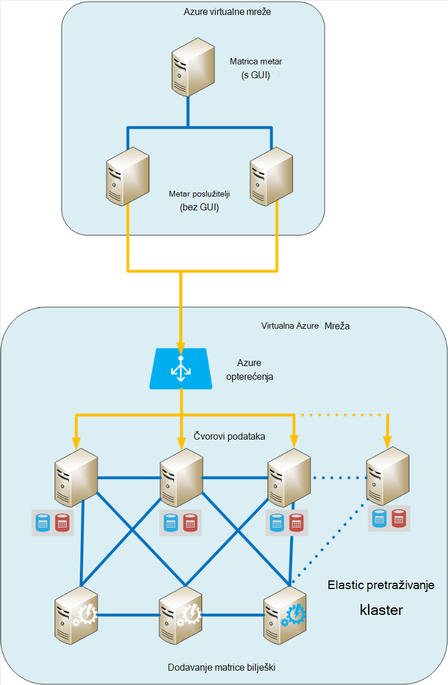
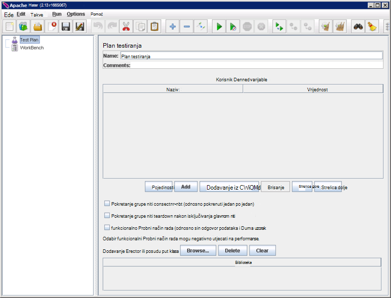
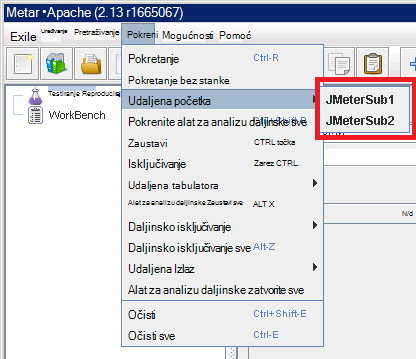
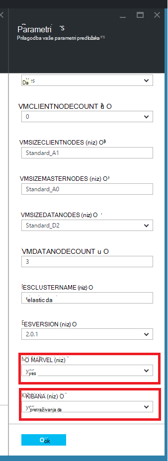
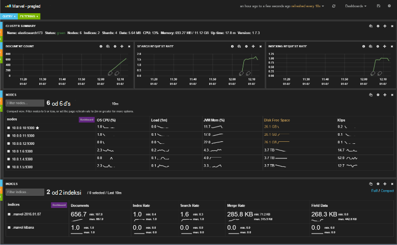
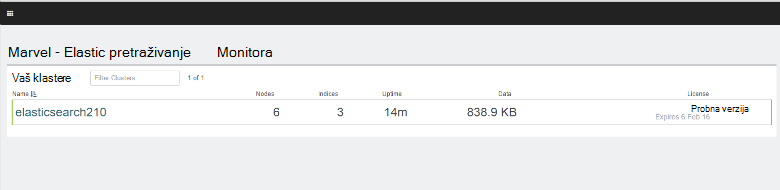
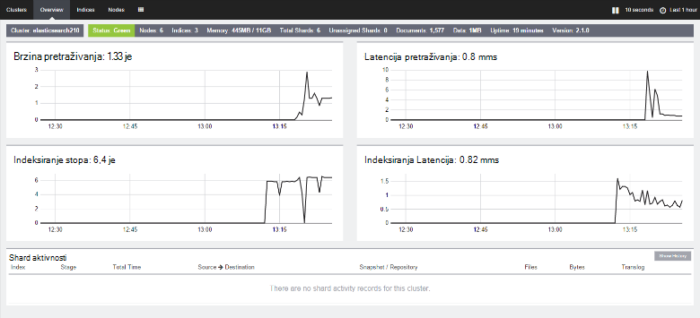

<properties
   pageTitle="Stvaranje performanse testiranje okruženje za Elasticsearch | Microsoft Azure"
   description="Upute za postavljanje okruženja za testiranje performanse sustava Elasticsearch klaster."
   services=""
   documentationCenter="na"
   authors="dragon119"
   manager="bennage"
   editor=""
   tags=""/>

<tags
   ms.service="guidance"
   ms.devlang="na"
   ms.topic="article"
   ms.tgt_pltfrm="na"
   ms.workload="na"
   ms.date="09/22/2016"
   ms.author="masashin"/>
   
# <a name="creating-a-performance-testing-environment-for-elasticsearch-on-azure"></a>Stvaranje performanse testiranje okruženje za Elasticsearch na Azure

[AZURE.INCLUDE [pnp-header](../../includes/guidance-pnp-header-include.md)]

Ovaj je članak [dio niza](guidance-elasticsearch.md). 

Ovaj dokument opisuje kako postaviti okruženje za testiranje performanse sustava Elasticsearch klaster. Tu konfiguraciju korišten za testiranje performanse podataka ingestion i upit radnih opterećenja, kao što je opisano [Tuning podataka ingestion][]performanse Elasticsearch na Azure.

Postupak testiranja performanse koristiti [Apache JMeter](http://jmeter.apache.org/)s na [standardnu postavljanje](http://jmeter-plugins.org/wiki/StandardSet/) dodaci instaliran u konfiguraciji matrica/podređeni koristeći skup namjenski VMs (nisu dio klaster Elasticsearch) posebno konfigurirali u svrhu. 

[Agent za poslužitelj programom PerfMon](http://jmeter-plugins.org/wiki/PerfMonAgent/) je bio instaliran na svakom Elasticsearch čvor. Sljedeći odjeljci sadrže upute o vraćanju okruženje za testiranje koji omogućuje vođenje vlastite performanse testiranjem JMeter. Ove upute pretpostavlja da ste već stvorili programa Elasticsearch klaster čvorovi kojih su povezani pomoću Azure virtualne mreže. 

Imajte na umu da okruženje za testiranje pokrenut će se i kao skup Azure VMs upravlja pomoću grupa jedan Azure resursa.

[Marvel](https://www.elastic.co/products/marvel) je instalirati i konfigurirati da biste omogućili Interna aspekte klaster Elasticsearch nadzire i analizirati jednostavnije. Ako statistike JMeter prikazivao Vršna ili trough performanse, informacije dostupne putem Marvel može biti neprocjenjive određivanje uzroka na prilagođavati razlikama.

Sljedeća slika prikazuje strukturu cijelog sustava. 



Imajte na umu sljedeće točke:

- Matrica JMeter VM izvodi Windows Server omogućuje GUI okruženja za konzole za JMeter. VM JMeter osnovne sadrži GUI ( *jmeter* aplikacija) da biste omogućili tester stvaranje testira, pokrenuti testove i vizualizacija rezultate. U ovom VM koordinate s poslužiteljem JMeter VMs koji zapravo Pošalji zahtjeve za koje čine testova.

- VMs podređene JMeter pokrenite Ubuntu Server (Linux), a zatim je bez GUI obavezu te VMs. Poslužitelj JMeter VMs pokrenuti poslužiteljski softver JMeter ( *jmeter poslužitelja* aplikacija) za slanje zahtjeva za klaster Elasticsearch.

- Čvorovi namjenski klijent su se, iako su namjenski osnovne čvorove.

- Broj čvorove podataka u klasteru se može razlikovati ovisno o scenariju testiraju.

- Sve čvorove u skupini Elasticsearch pokrenite Marvel da biste pridržavajte se performanse prilikom izvođenja i JMeter agenta Server da biste prikupili podatke za nadzor za kasniju analizu.

- Kada testiranje Elasticsearch 2.0.0 i novijim verzijama nešto čvorove podataka i izvodi Kibana. To je potrebna verziji Marvel koja se izvršava na Elasticsearch 2.0.0 i noviji.

## <a name="creating-an-azure-resource-group-for-the-virtual-machines"></a>Stvaranje grupe sustava Azure resursa za virtualnim strojevima

Matrica JMeter mora se moći povezati izravno u svakom čvorove u skupini Elasticsearch prikupljanje podataka o performansama. Ako se razlikuju od onih klaster Elasticsearch VNet JMeter VNet, zatim to podrazumijeva konfiguriranje svaki čvor Elasticsearch s javnu IP adresa. Ako imate problema s konfiguracijom Elasticsearch zatim razmislite o implementacije JMeter VMs u istoj VNet kao klaster Elasticsearch pomoću istoj grupi resursa, u tom slučaju možete izostaviti postupak prvog.

Prvo, [Stvorite grupu resursa](../resource-group-template-deploy-portal.md). Ovaj dokument pretpostavlja da je grupu resursa pod nazivom *JMeterPerformanceTest*. Ako želite da biste pokrenuli JMeter VMs u istoj VNet kao Elasticsearch klaster, upotrijebili te klaster umjesto stvaranja novog istoj grupi resursa.

## <a name="creating-the-jmeter-master-virtual-machine"></a>Stvaranje JMeter osnovne virtualnog računala

Sljedeći [Stvaranje Windows VM](../virtual-machines/virtual-machines-windows-hero-tutorial.md) pomoću slika *Windows Server 2008 R2 SP1* .  Preporučujemo da odaberete veličina VM s dovoljno jezgri i memorije za izvođenje testiranja performansi. Najbolje dogodit će se računalu s najmanje 2 jezgri i 3,5 GB RAM-a (A2 standardnih ili je veći).

<!-- TODO add info on why disabling diagnostics is positive --> 

Preporučujemo da onemogućite Dijagnostika. Kada stvarate na VM na portalu, to možete učiniti na plohu *Postavke* u odjeljku *nadzor* *Dijagnostika*. Ostaviti ostale postavke na njihove zadane vrijednosti.

Provjerite je li da se VM i sve pridružene resurse je stvorio uspješno [Provjera grupu resursa](../azure-portal/resource-group-portal.md#manage-resource-groups) na portalu. Resursi navedeni mora sastojati od na VM, sigurnosne grupe mreže i javnu IP adresu sve s istim nazivom i mreže sučelje i pohranu račun s nazivima koji se temelji na koji se VM.

## <a name="creating-the-jmeter-subordinate-virtual-machines"></a>Stvaranje JMeter podređene virtualnim strojevima

Sada [stvorite Linux VM](../virtual-machines/virtual-machines-linux-quick-create-portal.md) pomoću *Ubuntu Server 14.04 LTS* slike.  Kao i kod VM osnovne JMeter odaberite veličinu VM s dovoljno jezgri i memorije za izvođenje testiranja performansi. Najbolje dogodit će se računalu s najmanje 2 jezgri i barem 3,5 GB RAM-a (A2 standardnih ili je veći).

Ponovno, preporučujemo da onemogućite Dijagnostika.

Možete stvoriti proizvoljan broj podređenih VMs želji. 

## <a name="installing-jmeter-server-on-the-jmeter-subordinate-vms"></a>Instalacija JMeter server na VMs podređene JMeter

VMs podređene JMeter koristite Linux i po zadanom se ne možete povezati ih tako što ćete otvoriti na udaljene radne površine (RDP). Umjesto toga možete [koristiti PuTTY da biste otvorili prozor naredbenog retka](../virtual-machines/virtual-machines-linux-mac-create-ssh-keys.md) na svaki VM.

Kada ste povezani na neki od podređene VMs, tulumu ćemo koristiti za postavljanje JMeter.

Prvo instalirajte okruženje za izvođenje Java potrebni za pokretanje JMeter.

```bash
sudo add-apt-repository ppa:webupd8team/java
sudo apt-get update
sudo apt-get install oracle-java8-installer
```

Sada preuzmite softver JMeter pakirat kao zip datoteku.

```bash
wget http://apache.mirror.anlx.net/jmeter/binaries/apache-jmeter-2.13.zip
```

Instalacija unzip naredbu, a zatim upotrijebite da biste proširili JMeter softver. Softver se kopira u mapu pod nazivom **apache jmeter 2.13**.

```bash
sudo apt-get install unzip
unzip apache-jmeter-2.13.zip
```

Promjena u direktoriju *smeće* držanjem izvršne datoteke JMeter i provjerite programa *jmeter poslužitelj* i *jmeter* izvršna.

```bash
cd apache-jmeter-2.13/bin
chmod u+x jmeter-server
chmod u+x jmeter
```

Sada potrebna za uređivanje datoteke `jmeter.properties` koja se nalazi u trenutnoj mapi (koristite uređivač teksta koje poznajete najčešće, kao što su *smjer* ili *vim*). Pronađite sljedeće retke:

```yaml
...
client.rmi.localport=0
...
server.rmi.localport=4000
...
```

Uklonite (uklonite početne \## znakova) i izmjena te retke kao što je prikazano u nastavku, a zatim spremite datoteku i zatvorite uređivač:

```yaml
...
client.rmi.localport=4441
...
server.rmi.localport=4440
```

Pokrenite sljedeće naredbe da biste otvorili priključak 4441 dolazne TCP promet (to je priključak koji ste upravo konfigurirali *jmeter server* da biste preslušali na):

```bash
sudo iptables -A INPUT -m state --state NEW -m tcp -p tcp --dport 4441 -j ACCEPT
```

Preuzmite zip datoteku koja sadrži Standardni skup dodataka za JMeter (Ti dodaci pružaju nadzora mjerača performansi), a zatim raspakiraj datoteku u mapu **apache jmeter 2.13** . Unzipping datoteci na tom mjestu smješta na dodaci u odgovarajuću mapu.

Ako se od vas zatraži da biste zamijenili datoteku licence (za sve) upišite odgovora:

```bash
wget http://jmeter-plugins.org/downloads/file/JMeterPlugins-Standard-1.3.0.zip
unzip JMeterPlugins-Standard-1.3.0.zip
```

Korištenje `nohup` da biste pokrenuli JMeter poslužitelja u pozadini. Odgovoriti treba prikazom ID procesa i poruka o je stvorio udaljene objekta i spreman je da biste počeli primati naredbe.  Pokrenite sljedeću naredbu u direktoriju ~/apache-jmeter-2.13/bin. 

```bash
nohup jmeter-server &
```

> [AZURE.NOTE]Ako je na VM zatvaranja prekinut je program JMeter poslužitelja. Morat ćete povezati s VM i ponovno ga pokrenite ručno ponovno. Osim toga, možete konfigurirati sustav automatskih naredbu *jmeter poslužitelja* pri pokretanju dodavanjem sljedeće naredbe u `/etc/rc.local` datoteke (prije naredbe *izađite iz 0* ):

```bash
sudo -u <username> bash << eoc
cd /home/<username>/apache-jmeter-2.13/bin
nohup ./jmeter-server &
eoc
```

Zamjena `<username>` uz svoje ime za prijavu.

Će vam korisne terminal prozor ostavite otvorenim tako da možete pratiti napredak poslužitelja JMeter tijekom testiranja.

Morat ćete ponovite te korake za svaku JMeter podređene VM.

## <a name="installing-the-jmeter-server-agent-on-the-elasticsearch-nodes"></a>Instalacija agenta Server JMeter na čvorove Elasticsearch

Ovaj postupak pretpostavlja da imate pristup prijava čvorove Elasticsearch. Ako ste stvorili klaster pomoću predloška za Voditelj resursa, možete se povezati na svakom čvor putem okvira Skok VM, kao što je prikazano u odjeljku topologija Elasticsearch [Radi Elasticsearch na Azure](guidance-elasticsearch-running-on-azure.md). Možete se povezati skočni okvir kao i pomoću PuTTY. 

Iz nje, koristite *ssh* naredbu da biste se prijavili svakom čvorove u skupini Elasticsearch.

Prijavite se na neki od čvorove Elasticsearch kao administrator.  U naredbeni redak tulumu unesite sljedeće naredbe za stvaranje mape za čuvanje agenta Server JMeter i Premjesti u tu mapu:

```bash
mkdir server-agent
cd server-agent
```

Pokrenite sljedeće naredbe da biste instalirali naredbu *raspakiraj* (Ako već nije instaliran), preuzimanje softvera agenta Server JMeter i raspakirajte je:

```bash
sudo apt-get install unzip
wget http://jmeter-plugins.org/downloads/file/ServerAgent-2.2.1.zip
unzip ServerAgent-2.2.1.zip
```
 
Pokrenite sljedeću naredbu za konfiguriranje vatrozida i omogućivanje TCP promet proći kroz priključak 4444 (to je priključak koristi agenta Server JMeter):

```bash
sudo iptables -A INPUT -m state --state NEW -m tcp -p tcp --dport 4444 -j ACCEPT
```

Pokrenite sljedeću naredbu da biste započeli agenta Server JMeter u pozadini:

```bash
nohup ./startAgent.sh &
```

Agent za poslužitelj JMeter treba odgovoriti poruke koja označava da je počeo i priključuje na priključak 4444.  Pritisnite Enter da biste dobili naredbeni redak, a zatim pokrenite sljedeću naredbu.

```bash
telnet <nodename> 4444
```

Zamjena `<nodename>` s nazivom svoje čvor. (Naziv vaše čvor možete pronaći tako da pokrenete u `hostname` naredba.) Ta se naredba otvara telnet vezu s priključkom 4444 na lokalnom računalu. Koristite ovu vezu da biste provjerili agenta Server JMeter ispravno funkcioniranje.

Ako poslužitelj Agent JMeter nije pokrenut, primit ćete odgovor 

`*telnet: Unable to connect to remote host: Connection refused*.`

Ako radi Agent za JMeter poslužitelja i priključka 4444 pravilno konfigurirana, trebali biste vidjeti sljedeće odgovor:


> [AZURE.NOTE] Kada ga s prekinuli sesiju ne nudi sortiranje pristupnih.

U prekinuli sesiju upišite sljedeću naredbu:

``` 
test
```

Ako JMeter Agent za poslužitelj je konfiguriran i slušanje pravilno, trebali biste označava da je primili naredbu i odgovor s porukom *Yep*.

> [AZURE.NOTE]Možete upisati u druge naredbe da biste dobili performanse nadzor podataka. Na primjer, naredba `metric-single:cpu:idle` steći ćete trenutne proporcije vrijeme u kojem je Procesor u stanju mirovanja (to je snimka). Popis svih naredbi, posjetite stranicu [Agenta programom PerfMon Server](http://jmeter-plugins.org/wiki/PerfMonAgent/) . : Vratite se u pozivanje je on programom Perfmon poslužitelja Agent. >>

U prekinuli sesiju upišite sljedeću naredbu da biste napustiti sesiju i vratili se na tulumu naredbeni redak:

``` 
exit
```

> [AZURE.NOTE]Kao što je s na JMeter podređene VMs, ako vam se odjaviti ili ako je ovo računalo isključivanja i ponovnog pokretanja zatim agenta Server JMeter morat ćete ponovno pokrenuti ručno pomoću na `startAgent.sh` naredbe. Ako želite JMeter Agent za poslužitelj za automatsko pokretanje, dodajte naredbu na kraj na `/etc/rc.local` datoteke, prije naredbu *izađite iz 0* . 
> Zamjena `<username>` uz svoje ime za prijavu:

```bash
sudo -u <username> bash << eoc
cd /home/<username>/server-agent
nohup ./startAgent.sh &
eoc
```

Sada ili ponovite cijelog postupka za svaki čvor u skupini Elasticsearch ili možete koristiti u `scp` naredbu da biste kopirali agenta server mapa i sadržaja za svaku čvor i korištenje na `ssh` naredba pokretanje agenta Server JMeter kao što je prikazano u nastavku. e Zamijeni `<username>` korisničko ime, a `<nodename>` pod nazivom čvor mjesto na koje želite kopirati i softver (možda ćete morati da upišete lozinku kako pokrenuti svaku naredbu):

```bash
scp -r \~/server-agent <username>@<nodename>:\~
ssh <nodename> sudo iptables -A INPUT -m state --state NEW -m tcp -p tcp --dport 4444 -j ACCEPT
ssh <nodename> -n -f 'nohup \~/server-agent/startAgent.sh'
```

## <a name="installing-and-configuring-jmeter-on-the-jmeter-master-vm"></a>Instaliranje i konfiguriranje JMeter na VM osnovne JMeter

Na portalu Azure kliknite **grupa resursa**. U plohu **resursa grupa** kliknite grupu resursa koje sadrži matrice JMeter i podređene VMs.  U plohu **grupa resursa** kliknite **JMeter matrice VM**. U plohu virtualnog računala, na alatnoj traci kliknite **Poveži**. Otvorite datoteku RDP kada se zatraži web-pregledniku. Windows stvara na udaljene radne površine na vašem VM.  Unesite korisničko ime i lozinku za VM kada se to od vas zatraži.

U VM uz korištenje preglednika Internet Explorer, idite na stranicu za [Preuzimanje Java za Windows](http://www.java.com/en/download/ie_manual.jsp) . Slijedite upute da biste preuzeli i pokrenite instalacijski program Java.

U web-pregledniku idite na stranicu za [Preuzimanje JMeter Apache](http://jmeter.apache.org/download_jmeter.cgi) i preuzmite zip koji sadrže najnovije binarni. Spremite zip na određenom mjestu na vašem VM.

Otvorite web-mjesto [Dodataka JMeter Prilagođeno](http://jmeter-plugins.org/) i preuzmite u standardni skup dodataka. Spremite zip u istu mapu kao i preuzimanje JMeter u prethodnom koraku.

U programu Windows Explorer otvorite mapu koja sadrži na apache-jmeter*xxx* zip datoteke, pri čemu je *xxx* trenutnu verziju JMeter. Izdvajanje datoteka u trenutnoj mapi.

Izdvajanje datoteka u JMeterPlugins – standardna*yyy*.zip datoteke, pri čemu je *yyy* trenutnu verziju dodataka u na apache-jmeter*xxx* mapu. Na dodaci će dodajte odgovarajuću mapu za JMeter. Sigurno možete spojiti mape biblioteke i prebrisati datoteka pročitajme za i licence ako se to od vas zatraži.

Idite na apache-jmeter*xxx*/bin mapu i uređivanje u jmeter.properties datoteka pomoću Blok za pisanje.  U na `jmeter.properties` datoteke, pronađite odjeljak s natpisom *udaljene domaćini i RMI konfiguracije*.  U ovom ćete odjeljku datoteke pronađite sljedeći redak:

```yaml
remote_hosts=127.0.0.1
```

Promjena tom retku i zamijenite popis IP adresa 127.0.0.1 zarezom odvojene IP adresa ili nazivi glavnog računala za sve podređene poslužitelje JMeter. Ako, na primjer:

```yaml
remote_hosts=JMeterSub1,JMeterSub2
```

Pronađite sljedeći redak, a zatim Ukloni na `#` znakova na početku retka i promijenite vrijednost postavke client.rmi.localport iz:

```yaml
#client.rmi.localport=0
```

Da biste:

```yaml
client.rmi.localport=4440
```

Datoteku spremite i zatvorite Blok za pisanje. 

Na alatnoj traci sustava Windows kliknite **Start**, kliknite **Stavku Administrativni alati**, a zatim **Vatrozid za Windows s dodatnom sigurnošću**.  U vatrozidu za Windows s dodatnom sigurnošću prozor, u lijevom oknu desnom tipkom miša kliknite **Ulazna pravila**, a zatim kliknite **Novo pravilo**.

**Ulazna pravila čarobnjaka za novo**, na stranici **Vrste pravila** odaberite **priključak**, a zatim kliknite **Dalje**.  Na stranici protokoli i priključaka odaberite **TCP**, odaberite **određene priključke lokalne**, u tekstni okvir upišite `4440-4444`, a zatim kliknite **Dalje**.  Na stranici akcije odaberite **Dopusti veze**, a zatim kliknite **Dalje**. Na stranici profila ostavite sve mogućnosti koje su označene, a zatim kliknite **Dalje**.  Na stranici Name **naziv** tekstni okvir upišite *JMeter*, a zatim **Završi.**  Zatvorite Vatrozid za Windows s dodatnom sigurnošću prozora.

U programu Windows Explorer u na apache-jmeter -*xx*/bin mapu, dvokliknite naredbena datoteka *jmeter* sustava Windows da biste započeli s GUI. Korisničko sučelje prikazivati:



Na traci izbornika kliknite **Pokreni**, kliknite **Udaljene Start**i provjerite je li navedena su dvije podređene strojeva JMeter:



Sada ste spremni za početak testiranja performansi.

## <a name="installing-and-configuring-marvel"></a>Instaliranje i konfiguriranje Marvel

Brzi početak rada predloška Elasticsearch za Azure će instalirati i konfigurirati odgovarajuću verziju Marvel automatski ako postavite parametre MARVEL i KIBANA TRUE ("da") kada sastavljanjem skupine:



Ako dodajete Marvel postojeće klaster koji se morate ručno ponovno instalacije i postupka razlikuje se ovisno o tome koristite verziju Elasticsearch 1.7.x ili 2.x, kao što je opisano u sljedećim postupcima.

### <a name="installing-marvel-with-elasticsearch-173-or-earlier"></a>Instaliranje Marvel s Elasticsearch 1.73 ili neke starije verzije

Ako koristite Elasticsearch 1.7.3 ili neke starije verzije, izvoditi na sljedeće korake *na svakoj čvor* u skupine:

- Prijavite se na čvor i premjestite Elasticsearch osnovne mape.  Na Linux, je uobičajeni kućni direktorij `/usr/share/elasticsearch`.

-  Pokrenite sljedeću naredbu da biste preuzeli i instalirali dodatak Marvel za Elasticsearch:

```bash
sudo bin/plugin -i elasticsearch/marvel/latest
```

- Zaustavljanje i ponovno pokrenite Elasticsearch na čvor:

```bash
sudo service elasticsearch restart
```

- Da biste provjerili ispravno instaliran Marvel, otvorite web-preglednik i idite na URL `http://<server>:9200/_plugin/marvel`. Zamjena `<server>` s imenom ili IP adresu poslužitelja sve Elasticsearch u klasteru.  Provjerite je li da se pojavljuje na stranici slične onima koje je prikazano u nastavku:




### <a name="installing-marvel-with-elasticsearch-200-or-later"></a>Instaliranje Marvel s Elasticsearch 2.0.0 ili noviji

Ako koristite Elasticsearch 2.0.0 ili noviju verziju, izvršiti na sljedeće zadatke *na svakoj čvor* u klasteru:

Prijavite se na čvor i prijelaz Elasticsearch direktorija za kućne (obično `/usr/share/elasticsearch`) izvršite sljedeće naredbe da biste preuzeli i instalirali dodatak Marvel za Elasticsearch:

```bash
sudo bin/plugin install license
sudo bin/plugin install marvel-agent
```

Zaustavljanje i ponovno pokrenite Elasticsearch na čvor:

```bash
sudo service elasticsearch restart
```

U nastavku, zamijenite `<kibana-version>` s 4.2.2 Ako koristite Elasticsearch 2.0.0 ili Elasticsearch 2.0.1 ili 4.3.1 Ako koristite Elasticsearch 2.1.0 ili noviji.  Zamjena `<marvel-version>` s 2.0.0 Ako koristite Elasticsearch 2.0.0 ili Elasticsearch 2.0.1 ili 2.1.0 Ako koristite Elasticsearch 2.1.0 ili noviji.  Na sljedeće zadatke izvoditi *na jedan čvor* u klasteru:

Prijavite se na čvor i preuzmite odgovarajući sastavljanje Kibana za vašu verziju programa Elasticsearch iz [Elasticsearch preuzmite web-mjesta](https://www.elastic.co/downloads/past-releases), a zatim izdvajanje paketa:

```bash
wget https://download.elastic.co/kibana/kibana/kibana-<kibana-version>-linux-x64.tar.gz
tar xvzf kibana-<kibana-version>-linux-x64.tar.gz
```

Otvorite priključak 5601 da biste prihvatili dolazni zahtjevi za:

```bash
sudo iptables -A INPUT -m state --state NEW -m tcp -p tcp --dport 5601 -j ACCEPT
```

Premjesti u mapu config Kibana (`kibana-<kibana-version>-linux-x64/config`), urediti u `kibana.yml` datoteku, a potom Dodaj sljedeći redak. Zamjena `<server>` s imenom ili IP adresu poslužitelja Elasticsearch u klasteru:

```yaml
elasticsearch.url: "http://<server>:9200"
```

Premjesti u mapu za smeće Kibana (`kibana-<kibana-version>-linux-x64/bin`), a pokrenite sljedeću naredbu da biste integrirali dodatak za Marvel u Kibana:

```bash
sudo ./kibana plugin --install elasticsearch/marvel/<marvel-version>
```

Pokrenite Kibana:

```bash
sudo nohup ./kibana &
```

Da biste provjerili instalaciju Marvel, otvorite web-preglednik i idite na URL `http://<server>:5601/app/marvel`. Zamjena `<server>` s imenom ili IP adresu poslužitelja na kojem je Kibana.

Provjerite je li da se pojavljuje na stranici slične onima koje je prikazano u nastavku (naziv svoj klaster će vjerojatno se razlikuju od prikazano na slici).



Kliknite vezu koja odgovara svoj klaster (elasticsearch210 u gornjoj slici). Na stranici slične onima koje je prikazano u nastavku prikazivati:




[Ugađanju performansi Ingestion podataka za Elasticsearch na Azure]: guidance-elasticsearch-tuning-data-ingestion-performance.md  