<properties
   pageTitle="Implementacija uzorak JMeter JUnit za testiranje Elasticsearch performanse | Microsoft Azure"
   description="Kako koristiti uzorak JUnit da biste generirali i prijenos podataka programa Elasticsearch klaster."
   services=""
   documentationCenter="na"
   authors="dragon119"
   manager="bennage"
   editor=""
   tags=""/>

<tags
   ms.service="guidance"
   ms.devlang="na"
   ms.topic="article"
   ms.tgt_pltfrm="na"
   ms.workload="na"
   ms.date="09/22/2016"
   ms.author="masashin"/>
   
# Implementacija uzorak JMeter JUnit za testiranje Elasticsearch performansi

[AZURE.INCLUDE [pnp-header](../../includes/guidance-pnp-header-include.md)]

Ovaj je članak [dio niza](guidance-elasticsearch.md). 

U ovom dokumentu opisuje kako stvoriti i koristiti uzorak JUnit koje se mogu stvoriti i prenijeti podatke programa Elasticsearch klaster kao dio na plan testiranja JMeter. Taj se način nudi iznimno fleksibilne pristup da biste učitali testiranja koji mogu uzrokovati velike količine podataka Testiraj bez ovisno o vanjske podatkovne datoteke.

> [AZURE.NOTE] Testira Učitaj u procjeni performanse ingestion podataka opisane [Tuning podataka ingestion](guidance-elasticsearch-tuning-data-ingestion-performance.md) performanse Elasticsearch konstruirana su pomoću takvog. Detalje o kod JUnit opisana su u dokumentu.

Testiranja performanse ingestion podataka kod JUnit je razvoj pomoću Eclipse (Ožu), a ovisnosti su riješiti pomoću Maven. Postupci u nastavku opisuju postupka korak po korak za instalaciju Eclipse, konfiguriranje Maven, stvaranje JUnit test i implementacija ovaj test kao uzorak zahtjev za JUnit u JMeter test.

> [AZURE.NOTE] Detaljne informacije o strukture i konfiguriranje okruženja za testiranje potražite u članku [Stvaranje performanse testiranja okruženje za Elasticsearch na Azure][].

## Preduvjeti za instalaciju

[Okruženje za izvođenje Java](http://www.java.com/en/download/ie_manual.jsp) ćete na vašem računalu razvoj.
Također morat ćete instalirati [IDE Eclipse za razvojne inženjere Java](https://www.eclipse.org/downloads/index.php?show_instructions=TRUE).

> [AZURE.NOTE] Ako koristite osnovnu VM JMeter opisane u [stvaranju performanse testiranja okruženje za Elasticsearch na Azure][] kao razvojno okruženje, preuzmite Windows 32-bitnu verziju Eclipse instalacijski program.

## Stvaranje projekta JUnit test za testiranje Elasticsearch

Pokrenite Eclipse IDE ako već nije pokrenut, a zatim zatvorite stranicu **dobrodošlice** .  Na izborniku **datoteka** kliknite, a zatim **Java projekta**.

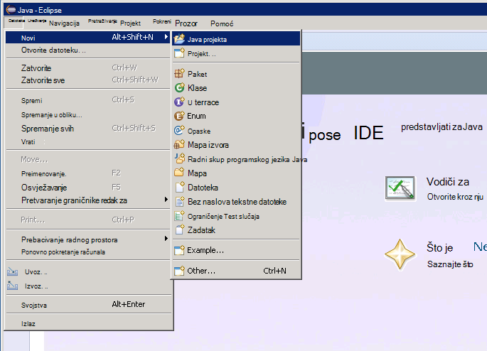

U prozoru **Novi projekt Java** unesite naziv projekta, odaberite **Koristi zadano JRE**i zatim kliknite **Završi**.

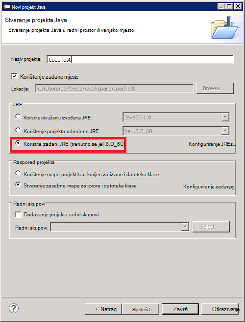

U prozoru **Programa Explorer paketa** Proširite čvor nosi projekta. Provjerite sadrži li ga u mapu pod nazivom **src** i reference na JRE koje ste naveli.

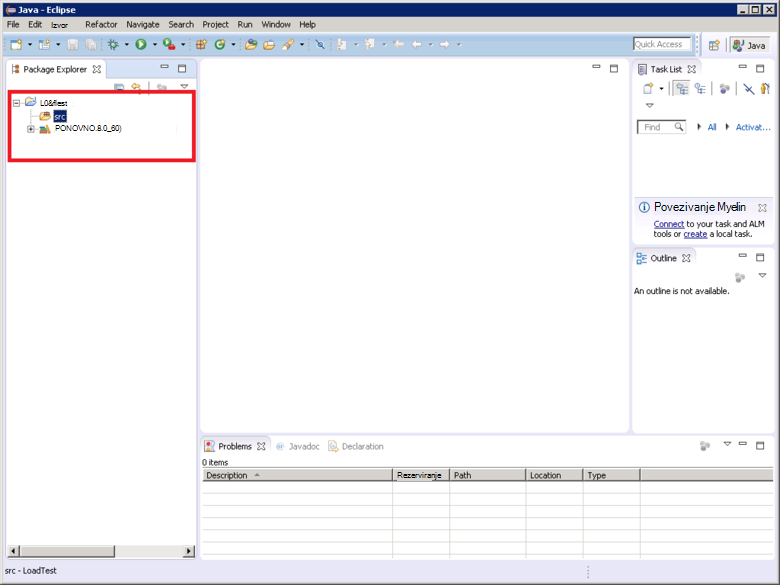

Desnom tipkom miša kliknite mapu **src** , kliknite **Novo**, a zatim **slučaj JUnit Test**.

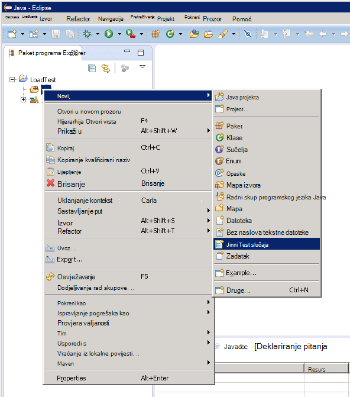

U prozor **novog slučaja Test JUnit** , odaberite **Novi Junit 4 test**, unesite naziv paketa (to može biti jednak nazivu projekta, iako po konvencija bi trebao počinjati s malim slovom) naziv test predmet i odaberite željene mogućnosti generiranje čvrstih način potrebne za testiranju. **Predmet u odjeljku test** ostavite prazno, a zatim kliknite **Završi**.

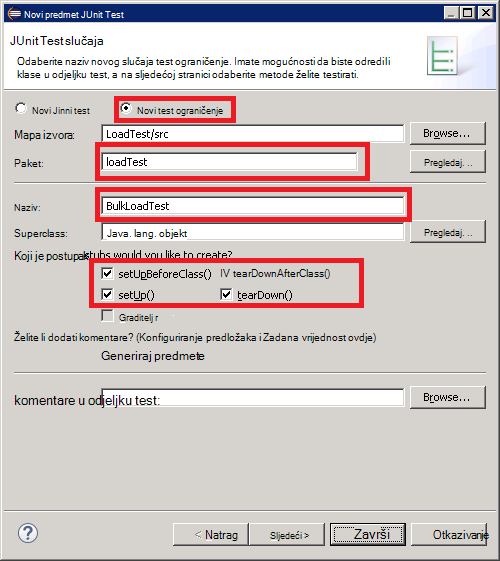

Ako se pojavi dijaloški okvir sljedeće **novog slučaja Test JUnit** , odaberite mogućnost dodavanje biblioteke JUnit 4 put Sastavi, a zatim kliknite **u redu**. 

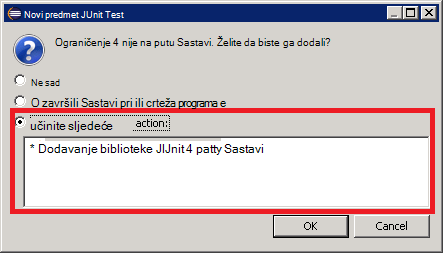

Provjerite je li skeleton kod za testiranje JUnit generira i prikazati u prozoru uređivača Java.

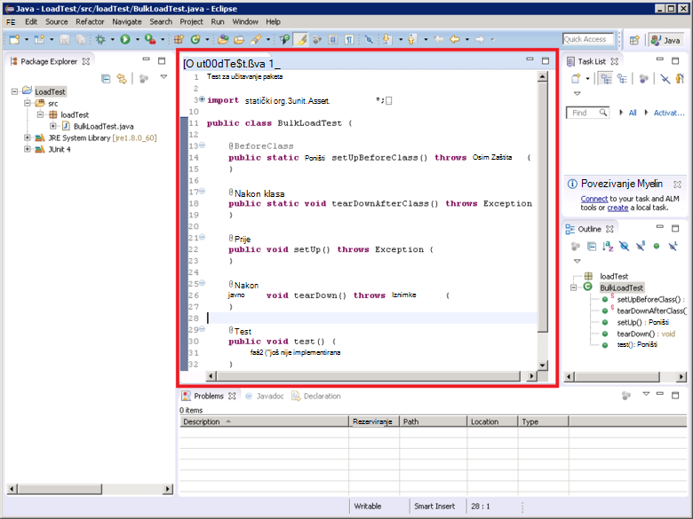

U **Paket Explorer**desnom tipkom miša kliknite čvor projekta, kliknite **Konfiguriraj**pa kliknite **Pretvori u Maven projekta**.

> [AZURE.NOTE]Pomoću Maven omogućuje vam više jednostavno upravljanje vanjske ovisnosti (kao što je biblioteka klijentski Elasticsearch Java) projekta ovisi o.

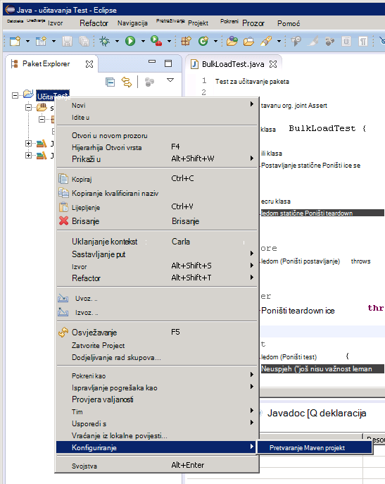

U dijaloškom okviru **Stvaranje nove POM** u padajućem popisu **pakiranje** odaberite **posudu**, a zatim kliknite **Završi**.

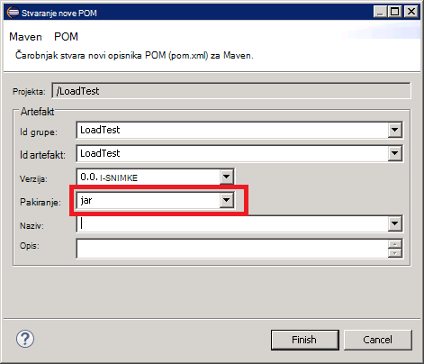

U oknu koji će se pojaviti ispod uređivaču projekta objekt model (POM) mogu se prikazati upozorenje "put Sastavi određuje okruženju izvođenja J2SE 1,5. Postoje bez JREs instaliran u radnom prostoru isključivo kompatibilna sa ovo okruženje", ovisno o tome koju verziju jezika Java je instaliran na vašem računalu razvoj. Ako imate verziju jezika Java se od verzije 1,5 sigurno možete zanemariti upozorenje.

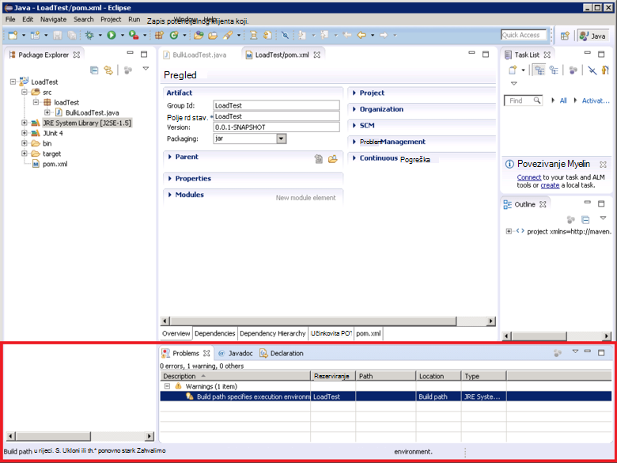

U uređivaču POM proširite **Svojstva** , a zatim kliknite **Stvori**.

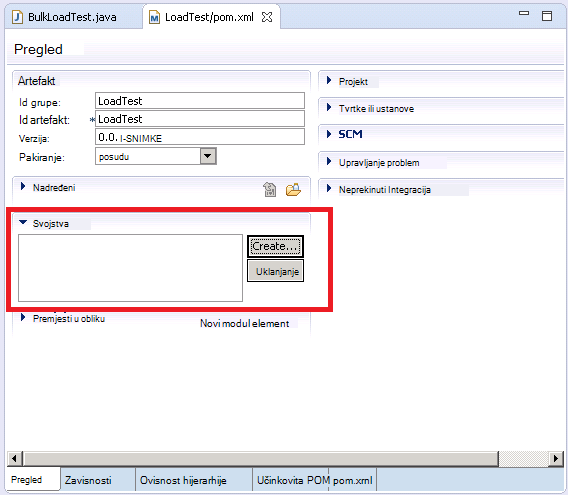

U dijaloškom okviru **Dodavanje svojstva** u okvir **naziv** upišite *es.version*, u okvir **vrijednost** upišite *1.7.2*i zatim kliknite **u redu**. Ovo je verzija klijenta biblioteke Elasticsearch Java da biste koristili (Ova verzija u budućnosti može biti zamijenila i definiranje verzije kao svojstvo POM i upućuju na to svojstvo negdje drugdje u projektu omogućuje verzija da biste brzo promijenili.)

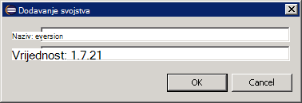

Kliknite karticu **ovisnosti** pri osnovni uređivač POM, a zatim **Dodaj** pokraj popisa **ovisnosti** .

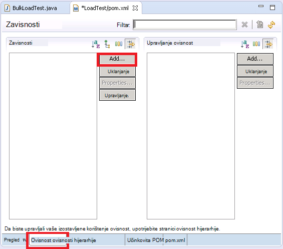

U dijaloškom okviru **Odaberite ovisnost** u okviru **Id grupe** upišite *org.elasticsearch*, u okviru **Id artefakt** upišite *elasticsearch*, u okvir upišite **verziju** * \${es.version}*, a zatim kliknite **u redu**. Informacije o biblioteci klijent Java Elasticsearch čuva se online Maven središnjem spremniku, a tu konfiguraciju automatski će preuzeti biblioteku i njezine ovisnosti kada se temelji na projektu.

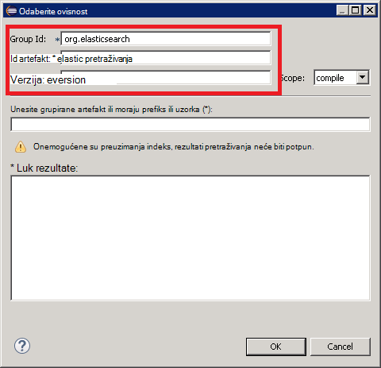

Na izborniku **datoteka** kliknite **Spremi sve**. Ova akcija će spremanje i sastavljanje projekta, preuzimanje ovisnosti određen Maven. Provjerite prikazuje li se Maven ovisnosti mape u programu Explorer paketa. Proširite tu mapu da biste pogledali posudu datoteka za podršku klijentska biblioteka Elasticsearch Java.

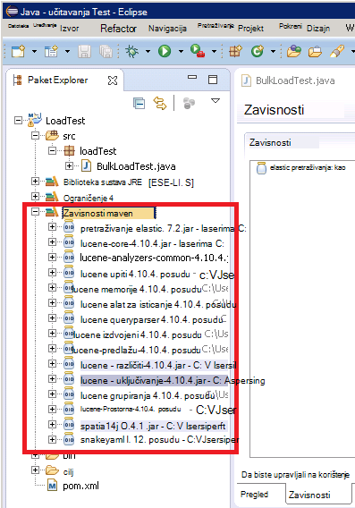

## Uvoz postojeći projekt test JUnit u Eclipse

Ovaj postupak pretpostavlja da ste preuzeli Maven projekt koji je prethodno stvorena pomoću Eclipse.

Pokrenite Eclipse IDE. Na izborniku **datoteka** kliknite **Uvezi**.

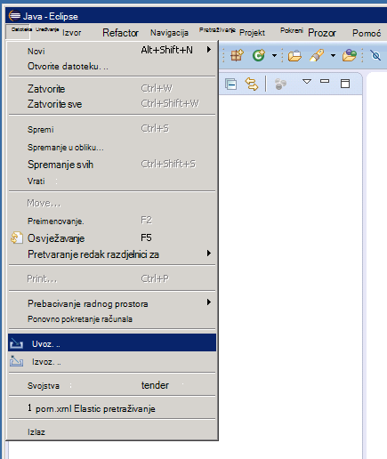

U prozoru **Odabir** proširite mapu **Maven** , kliknite **Postojeći projekt Maven**i zatim kliknite **Dalje**.

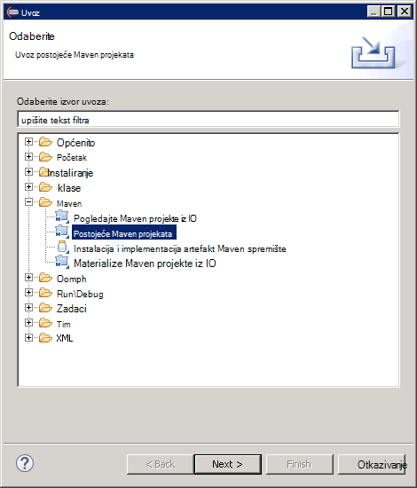

U prozoru **Maven projektima** navesti mapu držeći projekta (mapa koja sadrži datoteku pom.xml), kliknite **Odaberi sve**, a zatim kliknite **Završi**.

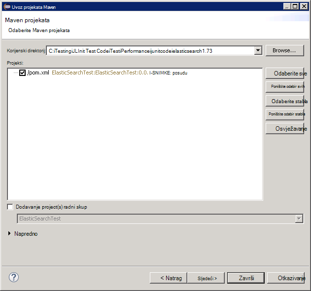

U prozoru **Programa Explorer paketa** Proširite čvor odgovara projekta. Provjerite sadrži li projekt mapu pod nazivom **src**. Ova mapa sadrži izvornog koda za testiranje JUnit. Projekt možete prevesti i implementirati slijedeći upute u nastavku.

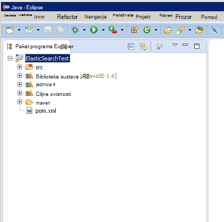

## Uvođenje JUnit test na JMeter

Taj se postupak pretpostavlja da ste stvorili projekt pod nazivom LoadTest koja sadrži klasu JUnit testa pod nazivom `BulkLoadTest.java` koji prihvaća parametre konfiguracije proslijeđen kao jedan niz Graditelj (to je mehanizam koji se očekuje JMeter).

U IDE Eclipse, u **Programu Explorer paketa**, desnom tipkom miša kliknite čvor projekta, a zatim **Izvoz**.

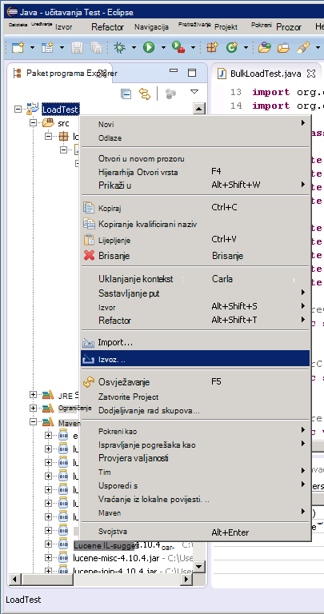

U **Čarobnjaku**na stranici **Odabir** Proširite čvor **Java** , kliknite **POSUDU datoteke**i zatim kliknite **Dalje**.

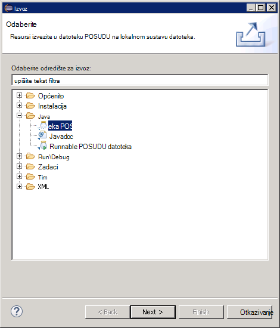

Na stranici **POSUDU specifikacija datoteka** u okviru **Odabir resursa za izvoz** proširenje projekta poništite **.project**i poništite odabir **pom.xml**. U okviru **datoteka za POSUDU** Navedite naziv datoteke i mjesto za POSUDU (ga trebali biste dobiti datotečni nastavak .jar), a zatim kliknite **Završi**.

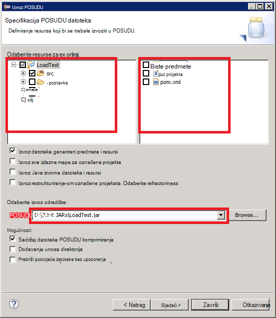

Pomoću programa Windows Explorer kopirajte datoteku POSUDU ste upravo stvorili JVM osnovne JMeter i spremite ga u apache-jmeter-2.13\\biblioteka\\junit mapa ispod mapu u kojoj ste instalirali JMeter (pogledajte postupak "Stvaranje JMeter osnovne virtualnog računala" u [stvaranju performanse testiranja okruženje za Elasticsearch na Azure](guidance-elasticsearch-creating-performance-testing-environment.md) dodatne informacije).

Vratite Eclipse, proširite prozor **Preglednika paketa** i zabilježite sve datoteke POSUDU i njihovih lokacija koje se nalaze u mapi Maven ovisnosti za projekt. Imajte na umu da prikazane na sljedećoj slici datoteke se može razlikovati ovisno o tome koju verziju Elasticsearch koristite:

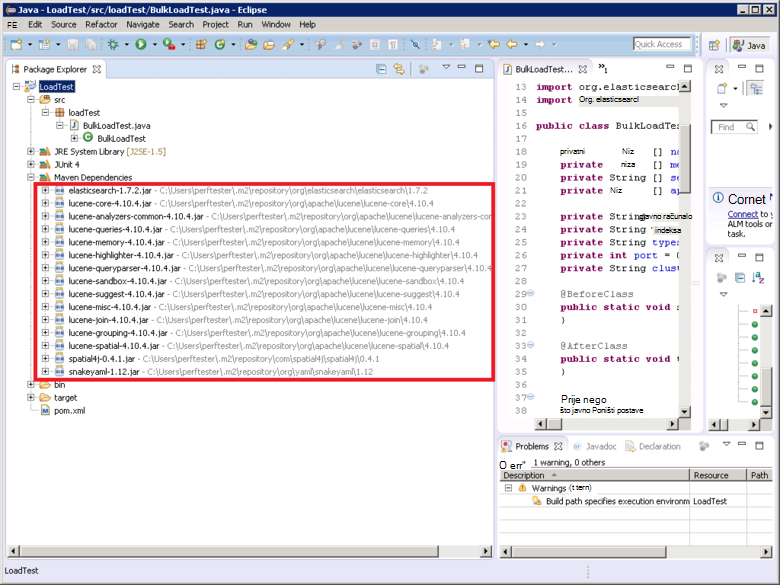

Pomoću programa Windows Explorer kopirajte svaku datoteku POSUDU referencirani u mapi Maven ovisnosti apache-jmeter-2.13\\biblioteka\\junit mapu na VM osnovne JMeter.

Ako se biblioteka\\junit mapu već sadrži starijih verzija te POSUDU datoteke, a zatim ih uklonite. Ako ih ostavite na mjestu zatim JUnit testiranja možda neće funkcionirati kao reference ne može biti rezultira pogrešnim staklenke.

Na matrici JMeter VM zaustavite JMeter ako je u tijeku.  Pokrenite JMeter.  U JMeter, desnom tipkom miša kliknite **Plan testiranja**, kliknite **Dodaj**, kliknite **niti (korisnici)**, a zatim **Niti grupe**.

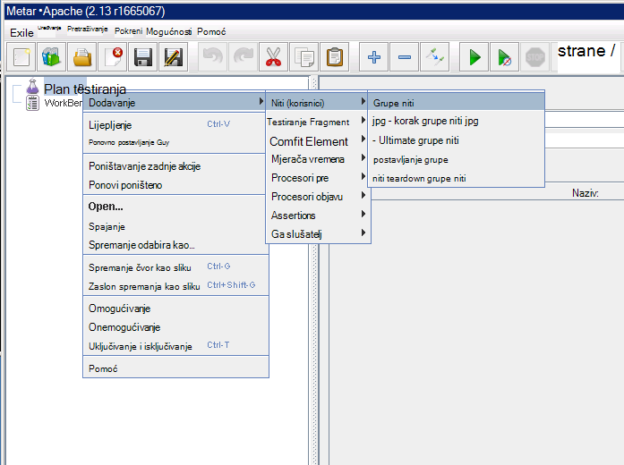

U odjeljku čvor **Plan testiranja** desnom tipkom miša kliknite **Grupu niti**, kliknite **Dodaj**, kliknite **Uzorak**, a zatim **JUnit zahtjev**.

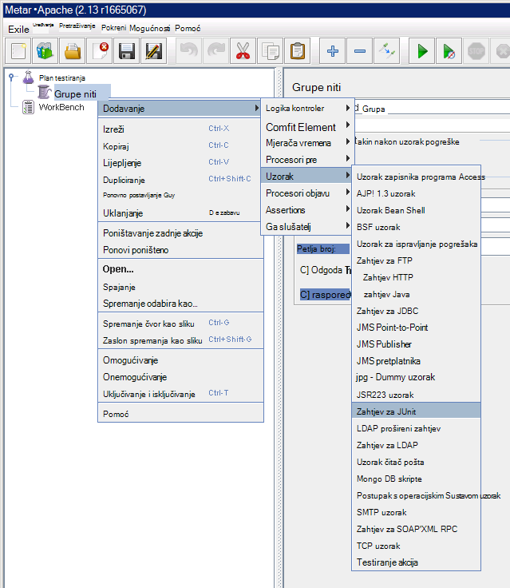

Na stranici **JUnit zahtjeva** , odaberite **pretraživanje za opaske JUnit4 (umjesto JUnit 3)**. Na padajućem popisu **NazivKlase** odaberite svoje predmete JUnit učitavanja test (će se prikazati u obrascu * &lt;paketa&gt;.&lt; klase&gt;*), u **Način za testiranje** padajući popis odaberite na JUnit testiranje način (to je način na koji se zapravo izvodi posao povezan s test i trebali biste označene s na *@test* opaske u programu project Eclipse), a zatim unesite sve vrijednosti koje će se proslijediti Graditelj u okvir **Graditelj niz naljepnice** . Detalji o prikazano na sljedećoj slici su samo Primjeri; vaš **NazivKlase** * *Probna metoda*i * *Graditelj niz natpis** će se vjerojatno razlikovati od one prikazane.

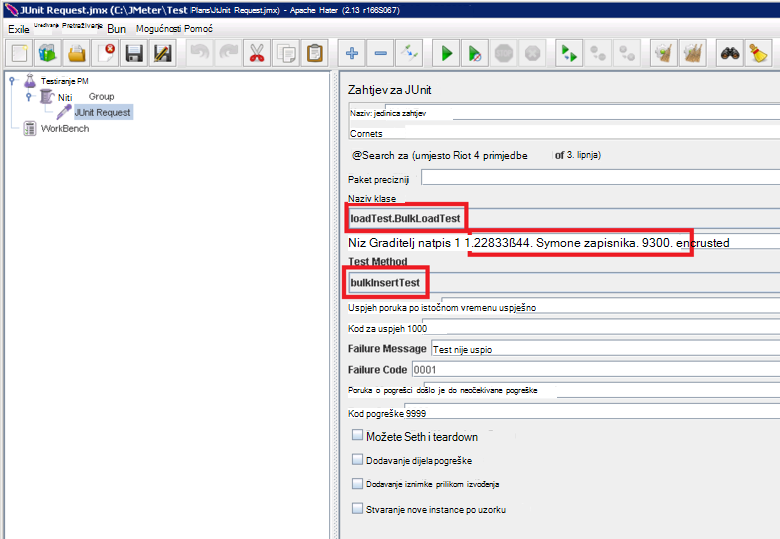

Ako svoje predmete ne pojavi na padajućem popisu **NazivKlase** , vjerojatno znači da POSUDU nije pravilno izvesti ili ne nalazi u na biblioteka\\junit mapu ili neke zavisne staklenke nedostaju na biblioteka\\junit mapu. U tom slučaju izvoz projekta iz Eclipse ponovno i provjerite je li odabrana **src** resursa, kopirajte POSUDU na biblioteka\\junit mapu, a zatim potvrdite da ste kopirali sve zavisne staklenke navedene prema Maven u mapu biblioteka.

Zatvorite JMeter. Nema potrebe da biste spremili plan testiranja.  Kopirajte POSUDU datoteku koja sadrži razred test JUnit tako da na /home/&lt;korisničko ime&gt;/apache-jmeter-2.13/lib/junit mapi na svakom VMs podređene JMeter (*&lt;korisničko ime&gt; * je naziv administratora korisnika koje ste naveli kada ste stvorili u VM potražite u članku procedure "Stvaranje JMeter podređene virtualnim strojevima" u [stvaranju performanse testiranja okruženje za Elasticsearch na Azure](guidance-elasticsearch-creating-performance-testing-environment.md) dodatne informacije.)

Kopiranje zavisne datoteke POSUDU potrebnih razred test JUnit tako da na /home/&lt;korisničko ime&gt;/apache-jmeter-2.13/lib/junit mapi na svakom VMs podređene JMeter. Provjerite jeste li prvo uklanjanje starije verzije POSUDU datoteke iz te mape.

Možete koristiti u `pscp` utility za kopiranje datoteka na računalu sa sustavom Windows Linux.

[Stvaranje performanse testiranje okruženje za Elasticsearch na Azure]: guidance-elasticsearch-creating-performance-testing-environment.md
