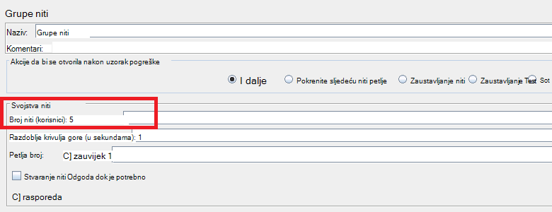
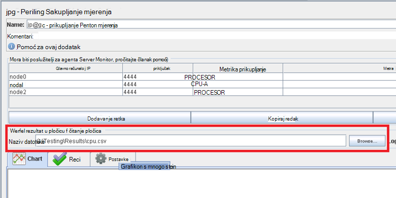
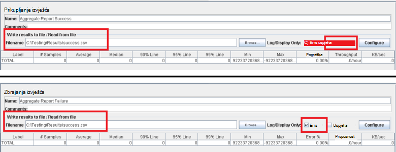
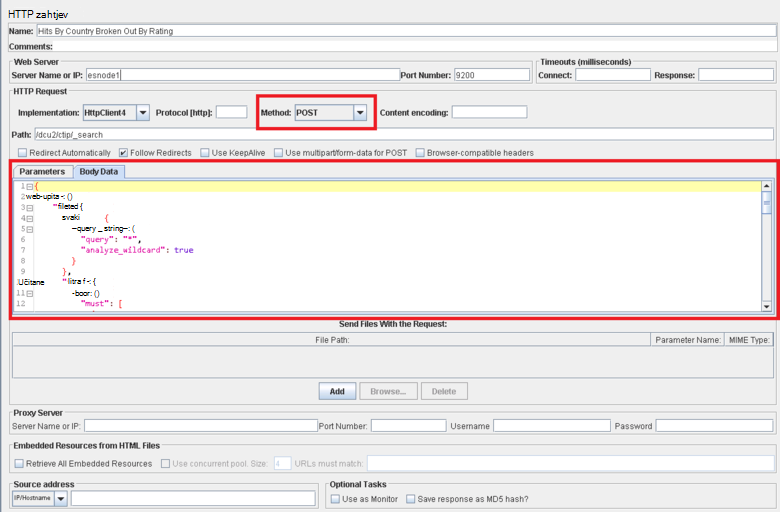

<properties
   pageTitle="Implementacijom na plan testiranja JMeter za Elasticsearch | Microsoft Azure"
   description="Pokretanje performanse testira Elasticsearch s JMeter."
   services=""
   documentationCenter="na"
   authors="dragon119"
   manager="bennage"
   editor=""
   tags=""/>

<tags
   ms.service="guidance"
   ms.devlang="na"
   ms.topic="article"
   ms.tgt_pltfrm="na"
   ms.workload="na"
   ms.date="09/22/2016"
   ms.author="masashin" />
   
# <a name="implementing-a-jmeter-test-plan-for-elasticsearch"></a>Implementacijom na plan testiranja JMeter za Elasticsearch

[AZURE.INCLUDE [pnp-header](../../includes/guidance-pnp-header-include.md)]

Ovaj je članak [dio niza](guidance-elasticsearch.md). 

Performanse testova obavljaju protiv Elasticsearch su implementirati pomoću JMeter test tarife zajedno s kod programskog jezika Java ugrađeni JUnit test za izvođenje zadatke kao što su prijenos podataka u klaster. Testiranje tarife i JUnit kod opisana su u [Tuning podataka ingestion izvedbe Elasticsearch na Azure][]i [Tuning prikupljanje podataka i performanse upita za Elasticsearch na Azure][].

Svrha ovog dokumenta je sažetak ključa sučelje koje ste dobili iz izgradnje i pokrenut ovo testiranje tarife. [Najbolje prakse JMeter](http://jmeter.apache.org/usermanual/best-practices.html) stranica na web-stranici Apache JMeter sadrži više generalizirano savjete o učinkovito korištenje JMeter.

## <a name="implementing-a-jmeter-test-plan"></a>Implementacijom na plan testiranja JMeter

Na sljedećem su popisu navedene stavke koje morate imati na umu prilikom stvaranja plana testiranja JMeter:

- Stvaranje grupe zasebnom niti za svaki test koju želite izvesti. Testiranje mogu sadržavati više koraka, uključujući kontrolera logike, trajanju, prije i nakon procesora, samplers i slušače.

- Izbjegavajte stvaranje previše niti u grupi niti. Viškom broj niti će uzrokovati JMeter uvoza s "Iz memorije" iznimke. Da biste dodali više JMeter podređene poslužitelja svaki izvodi manji broj niti od pokušati velik broj niti će se izvoditi na jednom poslužitelju JMeter bolje je.



- Da bi mu se performanse klaster, uključite dodatak [Sakupljač metriku programom Perfmon](http://jmeter-plugins.org/wiki/PerfMon/) u plan testiranja. Ovo je JMeter ga slušatelj koja je dostupna kao jedan od dodataka za standardne JMeter. Spremanje podataka o neobrađenog performansama skup datoteke u obliku vrijednosti odvojenih zarezom (CSV) i obrada ih nakon dovršetka test. Ovo je učinkovitije i nameće manje opterećuje JMeter od pokušaja obrade podatke kao što je se hvata. 



Excel možete koristiti alat tako da biste uvezli podatke i generiranje raspon grafikona za svrhe.

Imajte na umu hvatanje sljedeće informacije:

- Procesora za svaki čvor u skupini Elasticsearch.

- Čitanje broja bajtova sekundi s diska za svaki čvor.

- Ako je to moguće, postotak procesora vremena utrošenog na čekanje na/i koje je potrebno izvršiti na svakom čvor. To nije uvijek moguće za Windows VMs, ali za Linux možete stvoriti prilagođeni metrike (izvršavanja PRVE metrika) koja se pokreće sljedeće naredbe ljuske za pozivanje *vmstat* na čvor:

```Shell
sh:-c:vmstat 1 5 | awk 'BEGIN { line=0;total=0;}{line=line+1;if(line&gt;1){total=total+\$16;}}END{print total/4}'
```

Polje 16 u Izlaz iz *vmstat* sadrži procesora potrošeno vrijeme čekanja za/i. Dodatne informacije o načinu funkcioniranja a izjavu o zaštiti potražite u članku [vmstat naredbe](http://linuxcommand.org/man_pages/vmstat8.html).

- Broja bajtova šalje i prima putem mreže svaki čvor.

- Koristite zasebnom slušače zbrajanja izvješća da biste snimili performanse i učestalost uspješnih i neuspješnih operacija. Snimite neuspješnom slanju podataka različitih datoteka.



- Zadrži svakom slučaju test JMeter jednostavno omogućiti da izravno povezivanje performansi uz test određene akcije. Test slučajeva koje je potrebno složene logike, razmislite o encapsulating ovaj logike u JUnit testu i koristite uzorak zahtjev za JUnit JMeter da biste pokrenuli provjeru.

- Koristite uzorak HTTP zahtjev za izvođenje operacija HTTP, kao što su GET, objavu, STAVI ili Izbriši. Ako, na primjer, možete pokrenuti Elasticsearch pretraživanja pomoću upita objavu i daje pojedinosti upita u okvir *Tijelo podataka* :



- Radi lakšeg repeatability i ponovno korištenje parameterize testiranje JMeter test tarife. Možete koristiti skriptiranje da biste automatizirali pokretanje tarife za testiranje.

## <a name="implementing-a-junit-test"></a>Implementacijom JUnit test

Složena kod možete ugraditi u na plan testiranja JMeter tako da stvorite jedan ili više testova JUnit. JUnit test možete pisati pomoću Java integrirano razvojno okruženje (IDE) kao što je Eclipse. [Implementacija uzorak JMeter JUnit za testiranje Elasticsearch performanse][] pruža informacije o tome kako postaviti odgovarajuće platforme.

Na sljedećem su popisu navedene su najbolje postupke morate slijediti prilikom pisanja koda za testiranje JUnit:

- Pomoću klase Graditelj test prenesite Inicijalizacija parametara u test. JMeter možete koristiti Graditelj koji traje jedan niz argument. U Graditelj, raščlaniti ovaj argument u pojedine elemente kao što je prikazano tako da u sljedećem primjeru kod:

```Java
private String hostName = "";
private String indexName = "";
private String typeName = "";
private int port = 0;
private String clusterName = "";
private int itemsPerBatch = 0;

/\* JUnit test class constructor \*/
public ElasticsearchLoadTest2(String params) {
    /* params is a string containing a set of comma separated values for:
        hostName
        indexName
        typeName
        port
        clustername
        itemsPerBatch
    */

    /* Parse the parameter string into an array of string items */
    String delims = "\[ \]\*,\[ \]\*"; // comma surrounded by zero or more spaces
    String\[\] items = params.split(delims);

    /* Note: Parameter validation code omitted */

    /* Use the parameters to populate variables used by the test */
    hostName = items[0];
    indexName = items[1];
    typeName = items[2];
    port = Integer.parseInt(items[3]);
    clusterName = items[4];
    itemsPerBatch = Integer.parseInt(items[5]);

    if(itemsPerBatch == 0)
        itemsPerBatch = 1000;
}
```

- Izbjegavajte/i operacije ili druge dugotrajan postupke u Graditelj ili postavljanje test predmete, jer ih koristite svaki put kada pokrene JUnit test. (Isti test JUnit može pokrenuti mnogo tisuće vremena za svaki test performanse izvršava sa JMeter.)

- Razmislite o korištenju jednokratni instalacijski program za pokretanje skupi test slučaj.

- Ako testiranje zahtijeva velik broj ulaznih parametara, spremiti podatke o konfiguraciji test u datoteku zasebnom konfiguracije i prenesite mjesto te datoteke u na Graditelj.

- Izbjegavajte konačnog kodiranje putova datoteka u kodu test Učitaj. To može uzrokovati pogreške zbog razlike između operating systems kao što je Windows i Linux.

- Koristite assertions da biste naznačili problemi s JUnit testiranje metode tako da možete ih pratiti JMeter te ih koristiti kao metriku za tvrtke. Ako je to moguće, prenesite informacije vezane uz uzrok pogreške, kao što je prikazano u sljedećem primjeru kod podebljano:

```Java
@Test
public void bulkInsertTest() throws IOException {
    ...
    BulkResponse bulkResponse = bulkRequest.execute().actionGet();
    assertFalse(
        bulkResponse.buildFailureMessage(), bulkResponse.hasFailures());
        ...
}
```


[Running Elasticsearch on Azure]: guidance-elasticsearch-running-on-azure.md
[Ugađanju performansi Ingestion podataka za Elasticsearch na Azure]: guidance-elasticsearch-tuning-data-ingestion-performance.md
[Implementacija uzorak JMeter JUnit za testiranje Elasticsearch performansi]: guidance-elasticsearch-deploying-jmeter-junit-sampler.md
[Usklađivanje prikupljanja podataka i performanse upita za Elasticsearch na Azure]: guidance-elasticsearch-tuning-data-aggregation-and-query-performance.md
