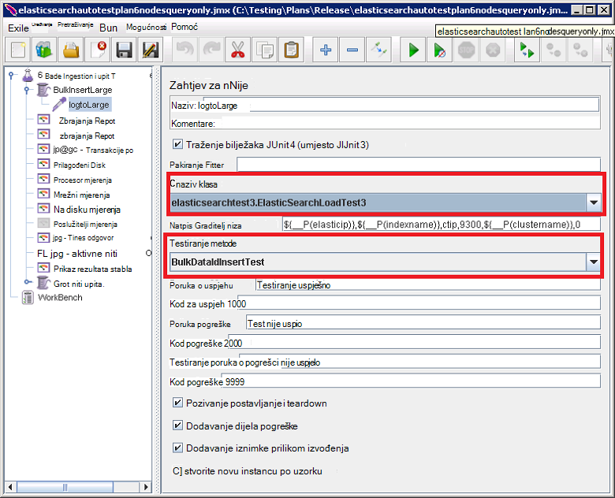

<properties
   pageTitle="Pokretanje automatskog testova performanse Elasticsearch | Microsoft Azure"
   description="Opis pokretanja performanse testira u vlastitu okruženju."
   services=""
   documentationCenter="na"
   authors="dragon119"
   manager="bennage"
   editor=""
   tags=""/>

<tags
   ms.service="guidance"
   ms.devlang="na"
   ms.topic="article"
   ms.tgt_pltfrm="na"
   ms.workload="na"
   ms.date="09/22/2016"
   ms.author="masashin"/>
   
# <a name="running-the-automated-elasticsearch-performance-tests"></a>Pokretanje automatskog Elasticsearch testova performanse

[AZURE.INCLUDE [pnp-header](../../includes/guidance-pnp-header-include.md)]

Ovaj je članak [dio niza](guidance-elasticsearch.md). 

Dokumente [Tuning podataka ingestion izvedbe Elasticsearch na Azure] i [Tuning prikupljanje podataka i performanse upita za Elasticsearch na Azure] opisuju broj performanse testova koji su pokrenuti na temelju uzorka Elasticsearch klaster.

Ove testira su postavljanje upita skriptiranih da biste omogućili da se pokreću automatiziranog način. Ovaj dokument u članku se opisuje kako ponavljanja testa u vlastitu okruženju.

## <a name="prerequisites"></a>Preduvjeti

Automatski testira potrebne sljedeće stavke:

-  Na Elasticsearch klaster.

- U JMeter okruženju postavljanje kao što je opisano dokumentom o [stvaranju performanse testiranja okruženje za Elasticsearch na Azure].

- [Python 3.5.1](https://www.python.org/downloads/release/python-351/) instalirana na matrici JMeter VM.


## <a name="how-the-tests-work"></a>Kako funkcionira testova
Testova izvode se JMeter. Poslužitelj za osnovne JMeter učitava plan testiranja i prosljeđuje skup poslužitelje podređene JMeter zapravo pokrenuti testove. Poslužitelj osnovne JMeter koordinate poslužitelje podređene JMeter i akumulira rezultate.

Navedene u sljedećim planovima za testiranje:

* [elasticsearchautotestplan3nodes.jmx](https://github.com/mspnp/azure-guidance/blob/master/ingestion-and-query-tests/templates/elasticsearchautotestplan3nodes.jmx). Ingestion test traje 3 čvor klaster.

* [elasticsearchautotestplan6nodes.jmx](https://github.com/mspnp/azure-guidance/blob/master/ingestion-and-query-tests/templates/elasticsearchautotestplan6nodes.jmx). Ingestion test traje 6 čvor klaster.

* [elasticsearchautotestplan6qnodes.jmx](https://github.com/mspnp/azure-guidance/blob/master/ingestion-and-query-tests/templates/elasticsearchautotestplan6qnodes.jmx). 6 čvor klaster traje test ingestion i upit.

* [elasticsearchautotestplan6nodesqueryonly.jmx](https://github.com/mspnp/azure-guidance/blob/master/ingestion-and-query-tests/templates/elasticsearchautotestplan6nodesqueryonly.jmx). 6 čvor klaster traje test samo za upit.


Možete ih koristiti testiranje tarife kao temelj za vlastitu scenarije ako vam je potrebna manje ili više čvorove.

Tarife za testiranje pomoću uzorak JUnit zahtjev za stvaranje i prijenos podataka za testiranje. Plan testiranja JMeter stvara i pokreće ovaj uzorak i nadzire svaki čvorove Elasticsearch za podataka o performansama.  

## <a name="building-and-deploying-the-junit-jar-and-dependencies"></a>Stvaranje i implementacija POSUDU JUnit i ovisnosti
Prije pokretanja testova performanse treba preuzeti Kompiliranje, i implementacija testova JUnit koja se nalazi u mapi performanse/junitcode. Ove testira se pozivaju na plan testiranja JMeter. Dodatne informacije potražite u članku procedure "Uvoz postojeći projekt test JUnit u Eclipse" u dokumentu [Implementacija uzorak JMeter JUnit za testiranje Elasticsearch performansi].

Postoje dvije verzije testova JUnit: 

- [Elasticsearch1.73](https://github.com/mspnp/azure-guidance/tree/master/ingestion-and-query-tests/junitcode/elasticsearch1.73). Potreban kod za izvođenje testiranja ingestion. Ove se testira pomoću Elasticsearch 1.73.

- [Elasticsearch2](https://github.com/mspnp/azure-guidance/tree/master/ingestion-and-query-tests/junitcode/elasticsearch2). Potreban kod za izvođenje testiranja upita. Ove se testira pomoću Elasticsearch 2.1 i noviji.

Kopirajte odgovarajuće datoteke arhiva (POSUDU) Java zajedno s ostalim korisnicima u ovisnosti vašeg računala JMeter. Postupak je opisan u [implementaciji uzorak JMeter JUnit za testiranje Elasticsearch performansi][]. 

> **Važno** Nakon što implementirate JUnit test, koristite JMeter za učitavanje i konfiguriranje tarife za testiranje koje upućuju na to testiranje JUnit i provjerite grupi niti BulkInsertLarge ispravnom POSUDU, naziv klase JUnit, i testirati način:
> 
> 
> 
> Spremite tarife ažurirane testiranja prije pokretanja testova.

## <a name="creating-the-test-indexes"></a>Stvaranje indeksa test
Svaki test izvodi ingestion i/ili upite odabiranja jedan indeks naveli kada se pokrene test. Stvorite indeks pomoću sheme opisane u appendices dokumentima [Tuning podataka ingestion izvedbe Elasticsearch na Azure] i [Tuning prikupljanje podataka i performanse upita za Elasticsearch na Azure] te ih konfigurirali ovisno o scenariju test (vrijednosti za dokument omogućeno/onemogućeno, više replike itd.) Imajte na umu tarife za testiranje pretpostavlja da indeks sadrži jednu vrstu pod nazivom *ctip*.

## <a name="configuring-the-test-script-parameters"></a>Konfiguriranje skripte parametara test
Kopirajte sljedeće datoteke test skripte parametar JMeter pokrenite poslužitelj:

* [run.properties](https://github.com/mspnp/azure-guidance/blob/master/ingestion-and-query-tests/run.properties). Tu datoteku navodi broj usporednih testiranja JMeter da biste koristili, trajanje test (u sekundama), IP adresu čvor (ili opterećenja klaster Elasticsearch) i naziv skupine:

  ```ini
  nthreads=3
  duration=300
  elasticip=<IP Address or DNS Name Here>
  clustername=<Cluster Name Here>
  ```
  
  Uređivanje datoteka i navedite odgovarajuće vrijednosti za testiranje i klaster.

* [upit config win.ini](https://github.com/mspnp/azure-guidance/blob/master/ingestion-and-query-tests/query-config-win.ini) i [upita, konfiguracije i nix.ini](https://github.com/mspnp/azure-guidance/blob/master/ingestion-and-query-tests/query-config-nix.ini). Ove dvije datoteke sadrže iste podatke; datoteka *osvajaju* oblikovana za nazive datoteka sustava Windows i putove i *nix* datoteke formata Linux nazivi datoteka i putove:

  ```ini
  [DEFAULT]
  debug=true #if true shows console logs.

  [RUN]
  pathreports=C:\Users\administrator1\jmeter\test-results\ #path where tests results are saved.
  jmx=C:\Users\administrator1\testplan.jmx #path to the JMeter test plan.
  machines=10.0.0.1,10.0.0.2,10.0.0.3 #IPs of the Elasticsearch data nodes separated by commas.
  reports=aggr,err,tps,waitio,cpu,network,disk,response,view #Name of the reports separated by commas.
  tests=idx1,idx2 #Elasticsearch index(es) name(s) to test, comma delimited if more than one.
  properties=run.properties #Name of the properties file.
  ```

  Uređivati ove datoteke da biste odredili mjesta rezultate testiranja naziv plan testiranja JMeter da biste pokrenuli, IP adrese čvorove podataka Elasticsearch prikupljate performanse mjernih podataka iz izvješća koja sadrži podatke neobrađenog performanse koje će se generiraju i naziv (ili naziva razdvojen zarezom) od index(es) u odjeljku test, ako je više , nakon međusobno testira će se pokrenuti. Ako je datoteka run.properties nalazi se u drugu mapu ili direktorija, navedite cijeli put datoteke.

## <a name="running-the-tests"></a>Pokretanje testova

* Kopiranje datoteke [upita test.py](https://github.com/mspnp/azure-guidance/blob/master/ingestion-and-query-tests/query-test.py) pokrenite JMeter poslužitelj u istu mapu kao i run.properties i upit config win.ini (upita-konfiguracija-nix.ini) datoteke.

* Jmeter.bat (Windows) ili jmeter.sh (Linux) provjerite jesu li na Izvršni put okruženju sustava.

* Pokrenuti skriptu upita test.py iz naredbenog retka za izvršavanje testova:

  ```cmd
  py query-test.py
  ```

* Kada testiranje dovrši, rezultati spremaju se kao što je skup odvojenih zarezom (CSV) datoteke navedene u datoteci upita-konfiguracija-win.ini (upita-konfiguracija-nix.ini) za vrijednosti. Excel možete koristiti da biste analizirali i prikažite podatke na grafikonu.


[Ugađanju performansi Ingestion podataka za Elasticsearch na Azure]: guidance-elasticsearch-tuning-data-ingestion-performance.md
[Usklađivanje prikupljanja podataka i performanse upita za Elasticsearch na Azure]: guidance-elasticsearch-tuning-data-aggregation-and-query-performance.md
[Stvaranje performanse testiranje okruženje za Elasticsearch na Azure]: guidance-elasticsearch-creating-performance-testing-environment.md
[Implementacija uzorak JMeter JUnit za testiranje Elasticsearch performansi]: guidance-elasticsearch-deploying-jmeter-junit-sampler.md
