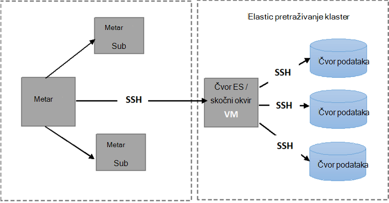

<properties
   pageTitle="Pokretanje automatskog testova otpornost Elasticsearch | Microsoft Azure"
   description="Opis pokretanja testova otpornost u vlastitu okruženju."
   services=""
   documentationCenter="na"
   authors="dragon119"
   manager="bennage"
   editor=""
   tags=""/>

<tags
   ms.service="guidance"
   ms.devlang="na"
   ms.topic="article"
   ms.tgt_pltfrm="na"
   ms.workload="na"
   ms.date="09/22/2016"
   ms.author="masashin"/>

# <a name="running-the-automated-elasticsearch-resiliency-tests"></a>Pokretanje automatskog testova otpornost Elasticsearch

[AZURE.INCLUDE [pnp-header](../../includes/guidance-pnp-header-include.md)]

Ovaj je članak [dio niza](guidance-elasticsearch.md).

[Konfiguriranje resilience]i oporavak na Elasticsearch na Azure[elasticsearch-resilience-recovery], ne možemo opisane skup testova koje su izvode na temelju uzorka klaster Elasticsearch da biste odredili koliko će se dobro sustav odgovorili neke uobičajene oblike pogreške i kako dobro je obnoviti. Testova su postavljanje upita skriptiranih da biste omogućili da se pokreću automatiziranog način. Ovaj dokument u članku se opisuje kako ponavljanja testa u vlastitu okruženju. 

Testira su sljedeće scenarije:

- **Čvor pogreške i ponovno pokretanje računala bez gubitka podataka**. Čvor podataka je zaustavljeno i ponovno pokrenuti nakon pet minuta.
Elasticsearch konfigurirano tako da ne ponovne nedostaje shards u tom intervalu tako da je bez dodatnih/i nastale u kretanje shards. Prilikom ponovnog pokretanja čvor postupka oporavka poziva na shards na tom čvor natrag u tijeku.

- **Nije uspjelo čvor bez gubitka do teškog oštećenja podataka**. Čvor podataka je zaustavljeno i brišu podatke koji se nalaze u programu Publisher do teškog oštećenja diska. Čvor zatim ponovnog pokretanja (nakon pet minuta) učinkovito djeluje kao zamjenu za izvorni čvor. Postupak za oporavak zahtijeva novog podatke koji nedostaju za ovaj čvor, a obuhvaćaju relocating shards ostaju na ostale čvorove.

- **Čvor pogreške i ponovno pokretanje računala bez gubitka podataka, ali s shard potrebna je ponovna**. Čvor podataka je zaustavljeno i shards koja je navedena su reallocated za ostale čvorove. Čvor pa ponovno pokrenuti, a zatim više potrebna je ponovna pojavljuje da biste poduzme klaster.

- **Vraćanje ažuriranja**. Svaki čvor u klasteru je zaustavljeno i ponovno pokrenuti nakon kratki interval u programu Publisher strojeva ponovo pokrenuti nakon ažuriranja za softver. Samo jedan čvor je zaustavljen u bilo kojem trenutku.
Shards su reallocated dok je čvor prema dolje.

## <a name="prerequisites"></a>Preduvjeti

Automatski testira potrebne sljedeće stavke:

- Na Elasticsearch klaster.

- U JMeter okruženju postavljanje kao što je opisano po [performanse testiranja upute]. 

- Instalirano na JMeter osnovne VM samo sljedeće dodatke.

    - Izvođenje Java 7.

    - Nodejs 4.x.x ili noviji.

    - Alati brojka naredbenog retka.

## <a name="how-the-scripts-work"></a>Kako funkcionira skripte

Testiranje skripte namijenjeni pokrenuti VM JMeter matrice. Kad odaberete test za izvođenje, skripte izvedite sljedeće slijed operacije:

1.  Započnite na plan testiranja JMeter Prosljeđivanje parametara koje ste naveli.

2.  Kopirajte skriptu koja se izvodi postupke potrebnih test za navedeni VM u klasteru. Ako ste ugrađena klaster pomoću [predloška za brzi početak rada Azure Elasticsearch](https://github.com/Azure/azure-quickstart-templates/tree/master/elasticsearch)to može biti bilo koje VM koja ima javnu IP adresa ili *Jumpbox* VM.

3.  Pokrenite skriptu na VM (ili Jumpbox).

Sljedeća slika prikazuje strukturu okruženje za testiranje i Elasticsearch klaster. Imajte na umu skripte test koristi sigurnu ljuske (SSH) za povezivanje s svaki čvor u skupini za razne operacije Elasticsearch kao što su zaustavljanje ili ponovno pokrenuti čvor.



## <a name="setting-up-the-jmeter-tests"></a>Postavljanje na JMeter testira

Prije nego što se izvodi na resilience testira trebali biste Kompiliranje i implementacija testova JUnit koja se nalazi u mapi otpornost/jmeter/testira. Ove testira se pozivaju na plan testiranja JMeter. Dodatne informacije potražite u članku procedure "Uvoz postojeći projekt test JUnit u Eclipse" u [uvođenju uzorak JMeter JUnit za testiranje Elasticsearch performansi][].

Postoje dvije verzije JUnit testova sadrži sljedeće mape:

- **Elasticsearch17.** Projekt u ovoj mapi generira datoteku Elasticsearch17.jar. Koristite ovaj POSUDU za testiranje Elasticsearch verzije 1.7.x

- **Elasticsearch20**. Projekt u ovoj mapi generira datoteku Elasticsearch20.jar. Koristite ovaj POSUDU za testiranje Elasticsearch verziju 2.0.0 i novijim verzijama

Kopirajte odgovarajuću datoteku POSUDU zajedno s ostalim korisnicima u ovisnosti vašeg računala JMeter. Postupak je opisan postupak "Implementacija testa JUnit za JMeter" u [uvođenju uzorak JMeter JUnit testiranja Elasticsearch performanse].

## <a name="configuring-vm-security-for-each-node"></a>Konfiguriranje sigurnosnih VM za svaki čvor

Testiranje skripte zahtijevaju certifikat za provjeru autentičnosti biti instalirana na svakom Elasticsearch čvor u klasteru. Time se omogućuje automatsko pokretanje bez postavljanja upita za korisničko ime i lozinku kako povezati razne VMs skripti.

Najprije prijaviti na neki od čvorove klaster Elasticsearch (ili Jumpbox VM), a zatim pokrenite sljedeću naredbu da biste generirali ključa provjere autentičnosti:

```Shell
ssh-keygen -t rsa
```

Dok ste povezani s čvor Elasticsearch (ili Jumpbox), pokrenite sljedeće naredbe za svaki čvor on Elasticsearch klaster. Zamjena `<username>` pod nazivom valjani korisnik na svakom VM i zamjena `<nodename>` s nazivom DNS-a ili IP adresu VM hosting čvor Elasticsearch.
Imajte na umu da vas će se zatražiti lozinka korisnika prilikom izvođenja te naredbe.
Dodatne informacije potražite u članku [Prijava SSH bez lozinke](http://www.linuxproblem.org/art_9.html):

```Shell
ssh <username>@<nodename> mkdir -p .ssh (
cat .ssh/id\_rsa.pub | ssh <username>*@<nodename> 'cat &gt;&gt; .ssh/authorized\_keys'
```

## <a name="downloading-and-configuring-the-test-scripts"></a>Preuzimanje i konfiguriranju skripte za testiranje

Testiranje skripte nalaze se u spremište brojka. Pomoću sljedećeg postupka možete preuzeti i konfigurirati skripte.

Na JMeter glavnog računala gdje će pokrenuti testove, otvorite prozor radne površine brojka (brojka tulumu) i Kloniraj spremište koja sadrži skripte, na sljedeći način:

```Shell
git clone https://github.com/mspnp/azure-guidance.git
```

Premjesti u mapu otpornost testova i pokrenite sljedeću naredbu da biste instalirali ovisnosti potrebni za pokretanje testova:

```Shell
npm install
```

Ako je matrica JMeter instaliran u sustavu Windows, preuzmite [Plink](http://www.chiark.greenend.org.uk/~sgtatham/putty/download.html)koji je sučelje naredbenog retka PuTTY Telnet klijentu. Kopirajte Plink izvršne datoteke u mapu otpornost – testira/biblioteka.

Ako matrica JMeter radi Linux, ne morate preuzeti Plink, ali morat ćete konfigurirati lozinku manje SSH između matricu JMeter i Elasticsearch čvor ili Jumpbox koristi slijedeći korake navedene u postupku "Konfiguriranje VM sigurnosti za svaki čvor." 

Uređivanje sljedećih parametara konfiguraciju u na `config.js` datoteke tako da odgovara okruženje za testiranje i Elasticsearch klaster. Parametara su zajednička svim testova:

| Ime | Opis | Zadana vrijednost |
| ---- | ----------- | ------------- |
| `jmeterPath` | Gdje se nalazi JMeter lokalni put. | `C:/apache-jmeter-2.13` |
| `resultsPath` | Relativna imenik gdje ste skriptu rezultat. | `results` |
| `verbose` | Označava hoće li se skripte proizvodi u načinu rada za opširno ili ne. | `true` |
| `remote` | Označava hoće li JMeter testova izvođenje lokalno ili na udaljenim poslužiteljima. | `true` |
| `cluster.clusterName` | Naziv Elasticsearch klaster. | `elasticsearch` |
| `cluster.jumpboxIp`         | IP adresa Jumpbox računala.                 |-|
| `cluster.username`          | Administrator korisnika koji ste stvorili pri implementaciji klaster. |-|
| `cluster.password`          | Lozinke za administratore korisnika.                        |-|
| `cluster.loadBalancer.ip`   | IP adrese opterećenja Elasticsearch.    |-|
| `cluster.loadBalancer.url`  | Osnovni URL raspoređivača opterećenja.                          |-|

## <a name="running-the-tests"></a>Pokretanje testova

Premjesti u mapu otpornost testova i pokrenite sljedeću naredbu:

```Shell
node app.js
```

Sljedeći izbornik prikazivati:


Unesite broj scenarija koji želite pokrenuti: `11`, `12`, `13` ili `21`. 

Nakon odabira scenarij test će se automatski pokrenuti. Rezultati spremaju se kao skup vrijednosti odvojenih zarezom (CSV) datoteka u mapi stvorene u imenik rezultate. Svaki Pokreni ima svoju mapu rezultate.
Excel možete koristiti da biste analizirali i prikažite podatke na grafikonu.

[Running Elasticsearch on Azure]: guidance-elasticsearch-running-on-azure.md
[Tuning Data Ingestion Performance for Elasticsearch on Azure]: guidance-elasticsearch-tuning-data-ingestion-performance.md
[upute za testiranja performansi]: guidance-elasticsearch-creating-performance-testing-environment.md
[JMeter guidance]: guidance-elasticsearch-implementing-jmeter.md
[Considerations for JMeter]: guidance-elasticsearch-deploying-jmeter-junit-sampler.md
[Query aggregation and performance]: guidance-elasticsearch-query-aggregation-performance.md
[elasticsearch-resilience-recovery]: guidance-elasticsearch-configuring-resilience-and-recovery.md
[Resilience and Recovery Testing]: guidance-elasticsearch-running-automated-resilience-tests.md
[Implementacija uzorak JMeter JUnit za testiranje Elasticsearch performansi]: guidance-elasticsearch-deploying-jmeter-junit-sampler.md
