<properties
   pageTitle="Usklađivanje podataka performanse zbrajanja i upita s Elasticsearch na Azure | Microsoft Azure"
   description="Sažetak prilikom optimiziranje performanse web-mjesto upita i u okvir za pretraživanje za Elasticsearch."
   services=""
   documentationCenter="na"
   authors="dragon119"
   manager="bennage"
   editor=""
   tags=""/>

<tags
   ms.service="guidance"
   ms.devlang="na"
   ms.topic="article"
   ms.tgt_pltfrm="na"
   ms.workload="na"
   ms.date="09/22/2016"
   ms.author="masashin"/>
   
# <a name="tuning-data-aggregation-and-query-performance-with-elasticsearch-on-azure"></a>Usklađivanje podataka performanse zbrajanja i upita s Elasticsearch na Azure

[AZURE.INCLUDE [pnp-header](../../includes/guidance-pnp-header-include.md)]

Ovaj je članak [dio niza](guidance-elasticsearch.md). 

Primarni razloga za korištenje Elasticsearch tako da podržava pretraživanja kroz podataka. Korisnici trebali biste moći da biste brzo pronašli informacije traže. Uz to, sustav morate omogućiti korisnicima postavljati pitanja podataka, traženje korelacija i Dođite na zaključaka koje mogu pokretati poslovnih odluka. U ovom obrada je što podataka razlikuje od informacija.

U ovom dokumentu navedene su mogućnosti koja možete imati na umu prilikom određivanja najbolji je način za optimiziranje sustava za performanse upita i pretraživanja.

Preporuke za sve performanse ovise o tome uglavnom scenarija koji se odnose na vašu situaciju količinu podataka koji su indeksiranja i brzina kojom aplikacija i korisnika upita podataka. Pažljivo testirate rezultate promjene u konfiguraciji ili indeksiranja strukture pomoću vlastite podatke i radnih opterećenja procijenite pogodnosti u nekim konkretnim scenarijima. Na kraju, ovaj dokument opisuje broj jednonitnih koji su izvesti za jednu određenu scenarij implementirati pomoću različitih konfiguracija. Prilagodite pristup za procijenite performanse vlastite sustave. Detalje o te testira opisana su u [dodatak](#appendix-the-query-and-aggregation-performance-test).

## <a name="index-and-query-performance-considerations"></a>Indeks i upit pitanja vezana uz performanse

U ovom se odjeljku opisuju neke uobičajene čimbenici koji trebali biste razmisliti o kada dizajniranje indeksi te potrebe za podršku brzo slanje upita i pretraživanje.

### <a name="storing-multiple-types-in-an-index"></a>Spremanje više vrsta u indeks

Indeks Elasticsearch mogu sadržavati više vrsta. Možda je bolje da biste izbjegli taj pristup i stvorite zaseban indeks za svaku vrstu. Imajte na umu sljedeće:

- Različite vrste može odrediti različite analyzers, a nije uvijek Očisti koji alat za analizu Elasticsearch koristite ako se izvodi upit na razini indeks, a ne na razini vrsta. Detalje potražite u članku [Izbjegavanje Preprekama vrsta](https://www.elastic.co/guide/en/elasticsearch/guide/current/mapping.html#_avoiding_type_gotchas) .

- Shards za indeksi koji sadrže više vrsta vjerojatno će biti veća od onih za indeksi koji sadrže jednu vrstu. Povećavanje a shard, više truda potreban je tako da Elasticsearch za filtriranje podataka prilikom izvršavanja upita.

- Ako postoji značajan nepodudaranje između količine podataka za vrste, informacije za jednu vrstu možete postati sparsely raspodijeliti mnogo shards smanjiti učinkovitost pretraživanja koja dohvatiti podatke.

    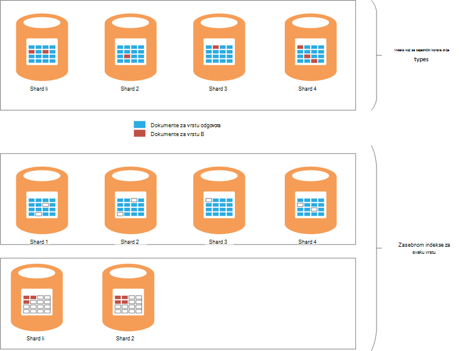

    ***Učinci dijeljenja indeksa između vrste*** 

    U gornjem dijelu dijagrama isti indeks zajednički koriste dokumenti vrste odgovora i vrsta B. Postoji mnogo više dokumenata vrstu odgovora od vrsta B. pretraživanja za vrstu neće obuhvaćaju upite sve četiri shards. U donjem dijelu dijagrama prikazuje učinak zasebnom indeksi stvaraju za svaku vrstu. U ovom slučaju pretraživanja za vrstu neće samo zahtijevaju pristup dva shards.

- Mali shards može biti više raspoređenim od velike shards olakšano Elasticsearch možete proširiti opterećenje preko čvorove.

- Različite vrste možda imaju različite zadržavanja razdoblja. Možda ćete teško arhiviranje starih podataka shards omogućio aktivni podataka.


No u nekim okolnostima zajedničko korištenje indeksa različitim vrstama može biti učinkovitog ako:

- Pretraživanja redovito obuhvaćati vrste sadrži isti indeks.

- Vrsta samo imate mali broj dokumenata svaki. Održavanje zaseban skup shards za svaku vrstu može postati vrlo indirektni u tom slučaju.


### <a name="optimizing-index-types"></a>Optimiziranje vrste indeksa

Indeks Elasticsearch sadrži kopiju izvorne JSON dokumenata koji su korišteni za popunjavanje ga. Ove informacije čuva se na [* \_izvora*](https://www.elastic.co/guide/en/elasticsearch/reference/current/mapping-source-field.html#mapping-source-field) svake stavke indeksirana polja. Ove podatke nije moguće pretraživati, ali po zadanom je vratio zahtjeva za *Početak* i *pretraživanje* . Međutim, ovo polje uključuje indirektni i zauzima prostor za pohranu, povećavajući shards i povećanje glasnoće/i izvršiti. Možete onemogućiti u * \_izvora* polja na temelju po vrsti:

```http
PUT my_index
{
  "mappings": {
    "my_type": {
      "_source": {
        "enabled": false
      }
    }
  }
}
```
Onemogućivanje ovo polje uklonit ćete mogućnost izvesti sljedeće radnje:

- Ažuriranje podataka u indeksu pomoću *Ažuriranje* API-JA.

- Izvođenje pretraživanja koje vraćaju istaknuti podataka.

- Li iz jednog Elasticsearch indeksa izravno na drugi.

- Promijenite mapiranja ili postavke analize.

- Ispravljanje pogrešaka upita pregledom izvornog dokumenta.


### <a name="reindexing-data"></a>Li podataka

Broj shards dostupne indeksa konačni određuje kapacitet indeksa. Može potrajati početne (i informirali) Procjena pri koliko shards bit će potrebno, ali uvijek trebali biste dokument ponovno indeksiranje strategije unaprijed. U mnogim slučajevima li možda svrhu zadatka kao što je rastom podataka. Možda ne želite dodijeliti velik broj shards indeksu početku radi optimizacije pretraživanja, ali dodijeliti novi shards kao proširuje količinu podataka. U drugim slučajevima li bi dobro da se izvoditi na temelju više ad-hoc ako procjene o growth glasnoću podataka jednostavno dokazuje biti točno.

> [AZURE.NOTE] Li možda neće biti potrebne za podatke koji se Brzi stari. U ovom slučaju aplikacija može stvoriti novi indeks za svaki vremensko razdoblje. Primjeri obuhvaćaju zapisnike performansi ili nadzora podataka koji se može spremiti u Osvježi indeks svakog dana.

<!-- -->

Obuhvaća li učinkovito stvaranje novog indeksa iz podataka u staru, a zatim uklanjanje stari indeks. Ako je prevelik indeks, taj postupak može potrajati i trebali biste bili sigurni da će podaci ostaju pretraživanja u tijekom tog razdoblja. Zbog toga potrebno stvoriti [pseudonim za svaki indeks](https://www.elastic.co/guide/en/elasticsearch/reference/current/indices-aliases.html), a upite potrebno dohvatiti podatke kroz ove pseudonima. Tijekom li, zadržavanje pseudonim pokažete na stari indeks, a zatim promijenite referencu novi indeks nakon dovršetka li. Taj se način je korisno za pristup podacima koji se temelji na vrijeme – koji stvara novi indeks svaki dan. Da biste pristupili trenutni podataka pomoću pseudonima prelaska u novi indeks kao što je stvoren.

### <a name="managing-mappings"></a>Upravljanje mapiranjima

Elasticsearch koristi mapiranja da biste saznali kako protumačiti podatke koji se pojavljuje u svako polje u dokumentu. Svaka vrsta ima vlastitu mapiranja koje učinkovito definira shemu za tu vrstu. Elasticsearch koristi taj podatak da biste generirali obrnuti indekse za svako polje u dokumentima u vrsti. U bilo kojem dokumentu svako polje je vrsta podataka (primjerice *niz*, *Datum*ili *Dugi*) i vrijednost. Mapiranja za indeks možete odrediti kada je stvoreno indeks, ili ih možete slučajna po Elasticsearch prilikom dodavanja nove dokumente s vrstom. Međutim, imajte na umu sljedeće:

- Mapiranja generira dinamički može uzrokovati pogreške ovisno o tome kako interpretira polja kada se dokumenti dodaju indeksa. Ako, na primjer, dokument 1 može sadržavati polja odgovora koja sadrži broj i uzroci Elasticsearch za to polje dodali mapiranje koji određuje koje je na *dugo*. Ako kasnije dokument dodaje se u kojem polju A sadrži brojčani podatak, a zatim ga neće uspjeti. U ovom slučaju polja odgovora treba vjerojatno ste je protumačiti kao niz kada prvog dokumenta koji je dodan. Određivanje ovo mapiranje stvaranja indeksa može pomoći da biste spriječili takve probleme.

- Dizajnirajte dokumente da bi se izbjeglo generiranje prenapadno velike mapiranja kao što je to možete dodati značajan indirektni prilikom izvršavanja pretraživanja, zauzeti mnogo memorije, a i zbog upita za pronalaženje podataka nije uspjelo. Prihvaćaju dosljedne konvencije imenovanja polja u dokumente koji se zajednički koristiti iste vrste. Ako, na primjer, nemojte se koristiti nazive polja, kao što su "Osobno_ime", "Ime" i "forename" u različite dokumente. Slijedite isti naziv polja u svakom dokumentu. Osim toga, ne pokušati koristiti vrijednosti kao tipke (to zajednički pristup u bazama podataka za stupac obitelji, ali mogu prouzročiti neučinkovitosti i pogreške s Elasticsearch.) Dodatne informacije potražite u članku [Mapiranja rastavljanje](https://www.elastic.co/blog/found-crash-elasticsearch#mapping-explosion).

- Da biste izbjegli Izrada primjereno pomoću *not_analyzed* . Ako, na primjer, ako dokument sadrži niz polje pod nazivom *podataka* koja sadrži vrijednost "ABC ZADANI" pa možda pokušate pokrenuti pretraživanje za sve dokumente koje odgovaraju tu vrijednost na sljedeći način:

  ```http
  GET /myindex/mydata/_search
  {
    "query" : {
      "filtered" : {
        "filter" : {
          "term" : {
            "data" : "ABC-DEF"
          }
        }
      }
    }
  }
  ```

 Međutim, ovo pretraživanje neće uspjeti da biste se vratili očekivane rezultate način u kojem je niz ABC ZADANI tokenized kad ga je indeksirati. Ga će biti učinkovito podijelite dva tokeni ABC i ZADANI, tako da spojnice. Značajka je dizajniran tako da podržava pretraživanja cijelog teksta, no ako želite da se niz da biste ga je protumačiti kao jednom stavkom atomske trebali biste onemogućiti Izrada dokument se nakon dodavanja u indeks. Možete koristiti mapiranje kao što su ova:

  ```http
  PUT /myindex
  {
    "mappings" : {
      "mydata" : {
        "properties" : {
          "data" : {
            "type" : "string",
            "index" : "not_analyzed"
          }
        }
      }
    }
  }
  ```

  Dodatne informacije potražite u članku [Pronalaženje točno vrijednosti](https://www.elastic.co/guide/en/elasticsearch/guide/current/_finding_exact_values.html#_term_filter_with_text).


### <a name="using-doc-values"></a>Pomoću vrijednosti za dokument

Broj upita i agregacije potreban je podaci se sortiraju kao dio operacije pretraživanja. Sortiranje zahtijeva moći mapiranje jedan ili više izraza popis dokumenata. Kako bi ovaj postupak, Elasticsearch svih vrijednosti za polje koristiti kao ključ sortiranja u memorije možete učitati. Ove informacije zove *fielddata*. Namjera je predmemoriranje fielddata u memoriji uključuje manje/i i možda ćete to brže od više puta čitanje iste podatke s diska. Međutim, ako polje sadrži visoke cardinality zatim spremanje na fielddata u memoriji možete zauzimaju mnogo prostora skupova, vjerojatno koje utječu na mogućnost druge Istodobni radnje ili čak i curenja uzrokuje Elasticsearch uvoza prostora za pohranu.

Kao zamjenski pristup, Elasticsearch podržava *dokument vrijednosti*. Dokument vrijednost je slična na neku stavku u memoriji fielddata osim što je pohranjen na disku i stvara kada podaci se pohranjuju u indeks (fielddata konstruirana dinamički kada se izvodi upit.) Dokument vrijednosti zauzimaju prostor skupova i tako da su korisne za upite koji sortiranje ili prikupljanje podataka preko polja koja mogu sadržavati velikog broja jedinstvene vrijednosti. Uz to, smanjeno pritiska na skupova može pridonijeti pomak performanse razlike između dohvaćanja podataka s diska i čitanju memorije. Smeća je vjerojatno će se pojaviti rjeđe i druge istovremene operacije koje koriste memorije vjerojatno manje biti effected.

Omogućite ili onemogućite dokument vrijednosti na temelju po svojstvo u indeks koristeći atribut *doc_values* , kao što je prikazano tako da u sljedećem primjeru:

```http
PUT /myindex
{
  "mappings" : {
    "mydata" : {
      "properties" : {
        "data" : {
          ...
          "doc_values": true
        }
      }
    }
  }
}
```
> [AZURE.NOTE] Dokument vrijednosti omogućena je prema zadanim postavkama s Elasticsearch verziju 2.0.0 nadalje.

Exact utjecaj vrijednostima dokument je vjerojatno će biti vrlo specifična za vlastitu scenariji podataka i upita, stoga pripremljeni vođenje performanse testiranje da biste uspostavili njihove upotrebljivost. Možete primijetiti i taj dokument vrijednosti rad s poljima obrađeno niz. Dodatne informacije potražite u članku [Dokument vrijednosti](https://www.elastic.co/guide/en/elasticsearch/guide/current/doc-values.html#doc-values).

### <a name="using-replicas-to-reduce-query-contention"></a>Korištenje replike da biste smanjili Nadmetanje upita

Uobičajeni strategije da biste uvećali performanse upita koji je da biste stvorili mnogo replike svaki indeks. Operacija za dohvaćanje podataka može biti zadovoljeni tako da dohvaća podatke s kopiju. Međutim, ovaj strategije uzrokuje može utjecati na performanse operacije ingestion podataka, tako da ga treba koristiti s pažnju na scenarija koji obuhvaćaju kombiniranim radnih opterećenja. Osim toga, ova strategije je samo pogodnost ako replike su raspodijeliti čvorove i se natječu za resurse s primarni shards koje su dio isti indeks. Imajte na umu da je moguće da biste povećali ili smanjili broj replike za indeks dinamički.

### <a name="using-the-shard-request-cache"></a>Korištenje predmemoriju shard zahtjev

Elasticsearch možete spremati u predmemoriju lokalnih podataka zatražio upite na svakom shard u memoriji. Ovaj omogućuje pretraživanja koji dohvaćaju iste podatke da biste pokrenuli brže podataka može čitati iz spremišta memorije umjesto disk. Predmemoriranja podataka na taj način stoga možete poboljšati performanse neki postupci za pretraživanje, teret smanjivanje memorije druge zadatke istovremeno izvršiti. Postoji i rizika poslužena da se podaci iz predmemorije zastario. Podatke u predmemoriji samo je nevažeći prilikom osvježavanja u shard i promjene podataka. Učestalost osvježavanja uređena vrijednost postavke *refresh_interval* indeksa.

Zahtjev za predmemoriranje za indeks je onemogućen po zadanom, no možete je omogućiti na sljedeći način:

```http
PUT /myindex/_settings
{
  "index.requests.cache.enable": true
}
```

Zahtjev za predmemoriju shard je najčešće prikladna za informacija koje ostaje relativno statične, kao što su povijesne ili prijavite podataka.

### <a name="using-client-nodes"></a>Korištenje čvorove klijenta

Svi upiti su obradili čvor najprije primi zahtjev. Ovaj čvor šalje dodatno zahtjeva za sve ostale čvorove koja sadrži shards za indeksi mu se i akumulira rezultata za vraćanje odgovor. Ako upit uključuje Zbrajanje podataka ili izvođenje složenih computations početni je čvor odgovoran za odgovarajući obrada. Ako vaš sustav ima podršku relativno mali broj složene upite, razmislite o stvaranju skup klijent čvorove da ćete Učitaj iz čvorove podataka. Nasuprot tome, ako vaš sustav ima učiniti velikog broja jednostavne upite, zatim poslati te zahtjeve usmjeriti čvorove podataka, a pomoću raspoređivača opterećenja razmještavanje zahtjeve.

### <a name="tuning-queries"></a>Usklađivanje upita

Sljedeće točke sažetak Savjeti za maksimiziranje performanse Elasticsearch upita:

- Izbjegavajte upite koji obuhvaćaju kartice koji gdje god je moguće.

- Ako isto polje se primjenjuje cijelog teksta pretraživanje te točno podudaranje, razmislite o spremanje podataka za polje u obrascima obrađeno i nonanalyzed. Izvođenje cijelog teksta pretraživati obrađeno polja i točna podudaranja s nonanalyzed polja.

- Vratiti samo podatke potrebne. Ako imate veliki dokumenti, ali aplikacije potreban je samo informacije koje sadrži podskup polja, vratite ovaj podskup s upitima umjesto cijelog dokumenata. U ovom strategije možete smanjiti propusnosti mreže klaster.

- Kad god je to moguće, pomoću filtara umjesto upita pri pretraživanju podataka. Filtar jednostavno određuje podudara li dokumenta navedeni kriterij dok upit izračunava i kako Zatvori podudaranje dokumenta je (bilježenje rezultata). Interno, vrijednosti stvorene pomoću filtra spremaju se kao bitmapu kojoj stoji da se podudaranje/ne odgovaraju svakom dokumentu, a mogu biti predmemorirane po Elasticsearch. Ako naknadno pojavljuje isti kriterij, bitmape možete biti dohvaćeni iz predmemorije i služi za brzo dohvaćanje odgovarajuće dokumente. Dodatne informacije potražite u članku [Interna operacije filtriranja](https://www.elastic.co/guide/en/elasticsearch/guide/current/_finding_exact_values.html#_internal_filter_operation).

- Pomoću filtara *booleovom* za izvođenje statične usporedbe, a samo za dinamično izračunati filtre, kao što su oni koji obuhvaćaju skriptiranje koristite *i*, *ili*i *ne* filtri ili *zemlj. –\* * filtre.

- Ako upita kombinira *booleovom* filtri *a*, *ili*, ili *ne* s *zemlj. –* * filtre, postavite na *i*/*ili*/*ne zemlj.-** filtri zadnji tako da ih rade na Najmanji mogući skup podataka.

    Isto tako, koristite *post_filter* za izvođenje operacije skupi filtar. Zadnje provest će se ti filtri.

- Zbirne funkcije umjesto pozornici koristite. Izbjegavajte izračun agregacije koje su analizirati ili koji imaju više mogućih vrijednosti.

    > **Napomena**: pozornici uklonjene Elasticsearch verzija 2.0.0.

- Koristite zbrajanja *cardinality* nego zbrajanja *value_count* osim ako aplikacije potreban je točan broj stavki koji se podudaraju. Točan broj može postati brzo zastarjelih i mnoge aplikacije samo zahtijevaju pametnije usklađivanja.

- Izbjegavajte skriptiranje. Skripte u upitima i filtrima može biti skupi, a rezultati su predmemorirani. Dugoročnih skripte može raditi pretraživanje niti beskonačno, uzrok daljnji zahtjevi za moguće je u redu. Ako puni reda, dodatno zahtjeve će biti odbijena.

## <a name="testing-and-analyzing-aggregation-and-search-performance"></a>Testiranje i analiza performanse web-mjesto zbrajanja i u okvir za pretraživanje

U ovom se odjeljku opisuju rezultate skup testova koji su izvesti izvoditi na različitim klaster i konfiguracija indeksa. Dvije vrste testira su izvodi, na sljedeći način:

- * *U *ingestion i upit* test **. Ovaj test rada s prazan indeks koji je preuzeta kao test grupnim izvođenjem masovne Umetanje operacije (svaka operacija dodali dokumente 1000). U isto vrijeme, broj upita namijenjen da biste potražili dokumente dodane tijekom prethodnih razdoblja 15 minuta i generiranje zbrajanja nisu ponavlja intervalima 5 drugog. Ovaj test obično je dopušteno izvođenje 24 sata, ponovno proizvesti efekata zahtjevne radno opterećenje comprising ingestion veliki podataka s blizu upita u stvarnom vremenu.

- **Na *samo za upit* testiranje**. Ovaj test je slična na *ingestion i upit* testiranje osim što se izostavi dio ingestion i indeks na svakom čvor je prethodno sa 100 milijuna dokumenata. Napravite skup upita provodi; element vrijeme ograničavanje dokumenata na one koji su dodani u posljednjih 15 minuta uklonjena je kao što je sada je statički podatke. Testova pokrenuli za 90 minuta, postoji manje vrijeme potrebno da biste uspostavili obrazac performanse zbog određenu količinu podataka.

---

Svaki dokument u indeksu imali na istu shemu. U ovoj su tablici prikazane su polja u shemi:

Ime                          | Vrsta         | Bilješke |
  ----------------------------- | ------------ | -------------------------------------------------------- |
  Tvrtke ili ustanove                  | Niz      | Test generira 200 jedinstveni tvrtke ili ustanove. |
  CustomField1 - CustomField5   |Niz       |To su pet niza polja koja su postavljena na prazan niz.|
  DateTimeRecievedUtc           |Vremenska oznaka    |Datum i vrijeme dodan u dokument.|
  Glavno računalo                          |Niz       |To polje postavljeno na prazan niz.|
  HttpMethod                    |Niz       |To polje postavljeno na jedan od sljedećih vrijednosti: "Objavljuju", "DOHVATI", "STAVITI".|
  HttpReferrer                  |Niz       |To polje postavljeno na prazan niz.|
  HttpRequest                   |Niz       |Ovo polje je popunjen slučajni teksta između 10 i 200 znakova.|
  HttpUserAgent                 |Niz       |To polje postavljeno na prazan niz.|
  HttpVersion                   |Niz       |To polje postavljeno na prazan niz.|
  OrganizationName              |Niz       |To polje postavljen je na iste vrijednosti kao polje tvrtke ili ustanove.|
  SourceIp                      |IP           |Ovo polje sadrži IP adresu koja označava "polazište" podatke. |
   SourceIpAreaCode              |Dugi         |To polje postavljeno na 0.|
  SourceIpAsnNr                 |Niz       |Ovo polje postavljeno na "kao\#\#\#\#\#".|
  SourceIpBase10                |Dugi         |To polje postavljen je na 500.|
  SourceIpCountryCode           |Niz       |Ovo polje sadrži pozivni broj zemlje 2 znakova. |
  SourceIpCity                  |Niz       |To polje sadrži niz prepoznavanje grad države. |
  SourceIpLatitude              |Dvaput       |Ovo polje sadrži slučajnu vrijednost.|
  SourceIpLongitude             |Dvaput       |Ovo polje sadrži slučajnu vrijednost.|
  SourceIpMetroCode             |Dugi         |To polje postavljeno na 0.|
  SourceIpPostalCode            |Niz       |To polje postavljeno na prazan niz.|
  SourceLatLong                 |Točka zemlj.   |To polje postavljeno na točku slučajni zemlj.|
  SourcePort                    |Niz       |Prikaz niza slučajni broj je popunjen to polje.|
  TargetIp                      |IP           |To je popunjen slučajni IP adresa u rasponu 0.0.100.100 i 255.9.100.100.|
  SourcedFrom                   |Niz       |To polje postavljeno na niz "MonitoringCollector".|
  TargetPort                    |Niz       |Prikaz niza slučajni broj je popunjen to polje.|
  Ocjena                        |Niz       |Polje se popunjava s jednim od 20 drugim nizom vrijednosti nasumično odabran.|
  UseHumanReadableDateTimes     |Booleove vrijednosti      |To polje postavljen na false.|
 
Upiti za sljedeće su izvoditi obliku serije iteracija testova. Imena u kurzivu koriste se za upućivanje tih upita u nastavku ovog dokumenta. Imajte na umu da se iz izostavljena je kriterij vrijeme (dokumenata koji su dodani u posljednjih 15 minuta) na *samo za upit* testove:

- Koliko dokumenata sa svake vrijednosti *ocjena* su unesene u zadnji 15 minuta (*broj tako da ocjena*)? 

- Koliko dokumente dodane u svakom razdoblju 5 minuta tijekom posljednjeg 15 minuta (*broj s vremenom*)?

- Koliko dokumenata svake vrijednosti *ocjena* dodane uz svaku državu posljednje 15 minuta (*pristupa po državi*)?

- Koje 15 tvrtkama ili ustanovama pojaviti Većina često u dokumenata koji su dodani posljednje 15 minuta (*15 vrha tvrtkama ili ustanovama*)?

- Koliko drugi tvrtkama ili ustanovama pojavljuju se u dokumenata koji su dodani posljednje 15 minuta (*tvrtkama ili ustanovama jedinstveni broj*)?

- Koliko dokumente dodane u posljednjih 15 minuta (*pristupa ukupni zbroj*)?

- Koliko različite vrijednosti *SourceIp* pojavljuju se u dokumenata koji su dodani u posljednjih 15 minuta (*Brojanje jedinstvenih IP*)?


Definicija indeksa i detalje o upiti su strukturirane u [dodatak](#appendix-the-query-and-aggregation-performance-test).

Da biste razumjeli efekata sljedeće varijable su dizajnirane testove:

- **Vrsta diska**. Testovi su izvršiti na 6 čvor skupina D4 VMs pomoću standardne prostora za pohranu (HDDs) i ponoviti na 6 čvor Klaster od DS4 VMs pomoću premium prostora za pohranu (SSDs).

- **Veličina strojno - skaliranje prema gore**. Testovi su izvršiti na 6 čvor klaster comprising DS3 VMs (koji je označen kao *small* klaster), ponavlja na klaster DS4 VMs ( *Srednje* klaster) i ponoviti ponovno na klaster DS14 strojeva ( *velike* klaster). U sljedećoj su tablici navedene ključne karakteristike svaki SKU VM:

 Klaster | VM SKU        | Broj jezgri | Broj diskova podataka | (GB) RAM-A |
---------|---------------|-----------------|----------------------|----------|
 Small   | Standardni DS3  | 4               | 8                    | 14       |
 Srednje  | Standardni DS4  | 8               | 16                   | 28       |
 Veliki   | Standardni DS14 | 16              | 32                   | 112      |

- **Klaster – skaliranje odgovor**. Testira su izvršiti na klastere DS14 VMs koja sadrži 1, 3 i 6 čvorove.

- **Broj replike indeksa**. Testira su izvršiti pomoću indeksa s replike 1 i 2.

- **Dokument vrijednosti**. Na početku testova izvršiti su s indeksom postavljanje *doc_values* postavite na *true* (Zadana vrijednost). Odabrani testira su ponavlja s *doc_values* postavite na *false*.

- **Predmemoriranje**. Testira obavljaju su s predmemoriju zahtjev shard omogućena na indeks.

- **Broj shards**. Testira su ponavljaju pomoću promjenjivi broj shards da biste odredili je li upiti učinkovitije preko indeksi koja sadrži manje, veća shards ili više, manje shards.


## <a name="performance-results---disk-type"></a>Rezultati performanse - vrsta diska

Performanse diska vrednuje je tako da pokrenete test *ingestion i upit* 6 čvor skupina VMs D4 (pomoću HDDs), a zatim na 6 čvor skupina DS4 VMs (pomoću SSDs). Konfiguracija Elasticsearch u oba klastere nije isti. Podatke je dodijeliti većem 16 diskova na svakom čvor i svaki čvor imali 14GB RAM-a dodijeliti Java virtualni stroj (JVM) radi Elasticsearch, Preostali memorije (i 14GB) je ostavljeno za operacijski sustav. Svaki test pokrenuli 24 sata. Da biste omogućili efekata povećavati količinu podataka postane vidljivu i dopustili da Stabiliziraj sustav nije odabrana tog razdoblja. U tablici u nastavku navedene rezultate, isticanje vremena odgovor za razne operacije koje obuhvaća test.

 Klaster | Operacija/upit            | Prosječna reakcija (ms) |
---------|----------------------------|----------------------------|
 D4      | Ingestion                  | 978                        |
         | Zbroj po ocjena            | 103                        |
         | Count vrijeme            | 134                        |
         | Pristupa prema državi            | 199                        |
         | Vrh 15 tvrtke ili ustanove       | 137                        |
         | Brojanje jedinstvenih tvrtke ili ustanove | 139                        |
         | Brojanje jedinstvenih IP            | 510                        |
         | Zbroj zbroja pristupa           | 89                         |
 DS4     | Ingestion                  | 511                        |
         | Zbroj po ocjena            | 187                        |
         | Count vrijeme            | 411                        |
         | Pristupa prema državi            | 402                        |
         | Vrh 15 tvrtke ili ustanove       | 307                        |
         | Brojanje jedinstvenih tvrtke ili ustanove | 320                        |
         | Brojanje jedinstvenih IP            | 841                        |
         | Zbroj zbroja pristupa           | 236                        |

Na prvi pogled izgledao da klaster DS4 izvoditi upite manje izvor od klaster D4 ponekad udvostručavanja (ili worse) vrijeme odaziva. To ne pričaju cijelu priču kroz. Na sljedeću tablicu prikazuje broj ingestion operacije obavljene tako da svaki klaster (ne zaboravite da svaka operacija učitava dokumenata 1000):

 Klaster | Count operacija ingestion |
---------|---------------------------|
 D4      | 264769                    |
 DS4     | 503157                    |

Klaster DS4 mogao učitavanje gotovo dvaput više podataka od klaster D4 tijekom testiranja. Stoga prilikom analiziranja odgovor vremena za svaki postupak, morate uzeti u obzir koliko dokumenata svaki upit sadrži pregled i vraćaju koliko dokumenata. To su dinamičkih slika kao količinu dokumenata u indeksu neprestano rast. Ne možete jednostavno dijeljenje 503137 po 264769 (broj ingestion operacije obavljene tako da svaki klaster) i rezultat pomnožite sa average reakcija za svaki upit obavlja klaster D4 da bi se dobilo složene podatke kao što je to zanemaruje količinu/i koja se istovremeno obavlja postupak ingestion. Umjesto toga, trebali biste fizičke količina podataka koje se zapisuju i čitanje s diska nastavlja test. Plan testiranja JMeter snima te podatke za svaku čvor. Sažete rezultati su:

 Klaster | Prosječna bajtova napisali/pročitano tako da svaki postupak |
---------|----------------------------------------------|
 D4      | 13471557                                     |
 DS4     | 24643470                                     |

Ove podatke prikazuje klaster DS4 mogao nastavka rješenja stopu/i približno 1.8 puta veći od klaster D4. Given da osim prirode od diskova, ostali resursi jednake, razlika mora biti zbog pomoću SSDs radije HDDs.

Da biste lakše obostrano ovaj zaključak, sljedeće grafikona prikazuje kako se/i izvršeno tijekom vremena tako da svaki klaster:

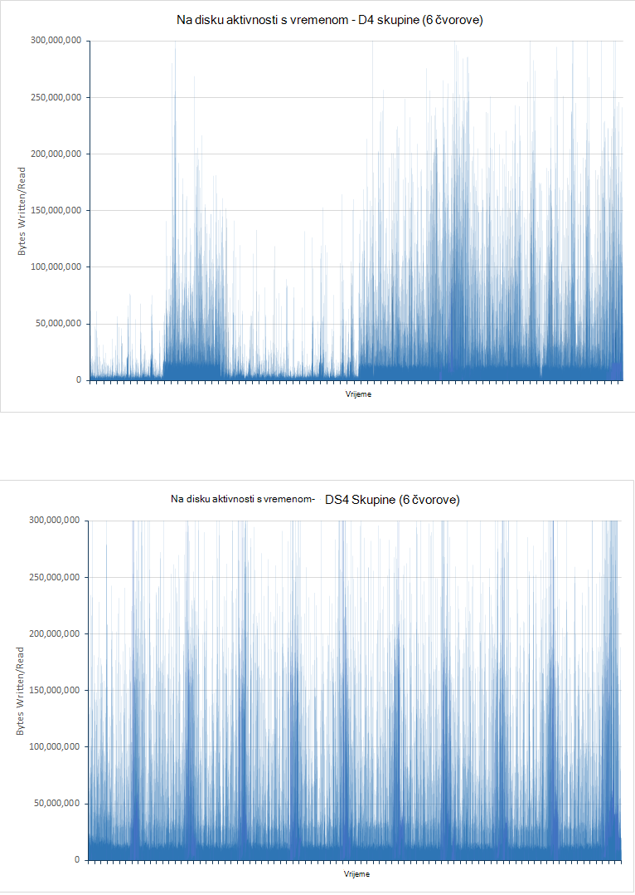

<!-- -->

***Na disku aktivnosti za klastere D4 i DS4***

Graph za klaster D4 prikazuje značajan varijacije, osobito tijekom prvog polovice test. To je vjerojatno zbog ograničavanje da biste smanjili/i stopa. Upiti su Početna faze test brzo pokretati kao malo podacima za analizu. Diskova klaster D4 vjerojatno zato biti operacijski blizu njihove ulaza i izlaza operacija po drugi kapaciteta (IOPS), iako svaki/i operacija možda neće biti vraćanje količinom podataka. Klaster DS4 podržava veće IOPS stopa i se isti stupanj ograničavanje, stope/i više običan. Za podršku ovaj teorija sljedeći par grafikona prikazuju kako Procesor je blokirao disk/i vremenom (vrijeme čekanja na disku prikazano u grafikona su proporcije vrijeme utrošeno da Procesor čekati/i):

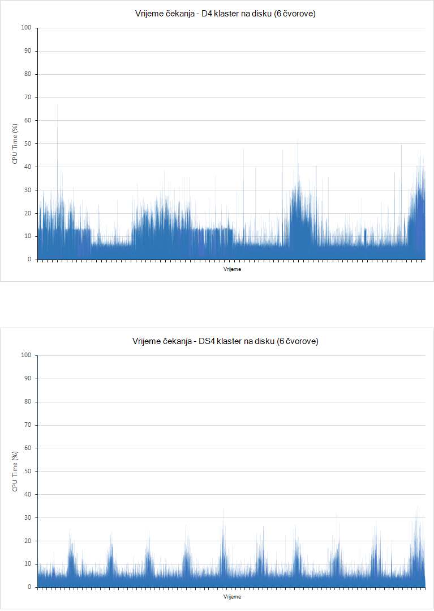

***Na disku procesora/i pričekajte vremena za klastere D4 i DS4***

Važno da biste shvatili da postoje dva razloga Izraelu za/i operacije da biste blokirali Procesor je:

- Podsustav/i nije moguće čitanje ili zapisivanje podataka ili s diska.

- Podsustav/i nije ograničio vrijeme po okruženju glavnog računala. Azure diskova implementiran putem HDDs Maksimalna propusnost 500 IOPS i SSDs imate Maksimalna propusnost 5000 IOPS.


Za klaster D4 vremenskog razdoblja potrošiti čekati/i tijekom prvog polovici odgovara test blisko okrenute način graph prikazuje/i stope. Razdoblja/niske i odgovaraju Procesor provodi blokirana je značajan vremenskog razdoblja, to znači da/i je u tijeku ograničio vrijeme. Što više podataka se dodaje klaster situacija promjene, a u drugoj polovici peaks test u/i vrijeme čekanja odgovaraju peaks u/i propusnost. Sada je prilikom izvođenja/realne i Procesor blokiran. Ponovno klaster DS4 potrošeno vrijeme čekanja za/i je mnogo više even. Svaki Vršna odgovara ekvivalentan Vršna/i performanse umjesto na trough, Ovime se podrazumijeva da postoji malo ili nimalo regulacije koje su se pojavile.

Postoji jedan faktor treba uzeti u obzir. Tijekom testa klaster D4 generira 10584 ingestion pogreške i pogreške 21 upita. Test na klasteru DS4 proizvodi bez pogrešaka.

## <a name="performance-results---scaling-up"></a>Rezultati performanse - skaliranje prema gore

Testiranje skaliranje gore izvršena tako da pokrenete testira protiv 6 čvor klastere DS3, DS4 i DS14 VMs. Budući da DS4 VM nudi dvaput kao mnoge jezgri procesora i memorije kao u DS3 i DS14 računalo ponovno doubles resursa procesora tijekom pružanja četiri puta količinu memorije nije odabrana te SKU-ove. U tablici u nastavku uspoređuje ključa aspekte svake SKU:

 SKU  | \#Jezgri procesora | Memorija (GB) | Max disk IOPS | Max propusnosti (MB/s)|
------|-------------|-------------|---------------|--------------|
 DS3  | 4           | 14          | 12,800| 128 |
 DS4  | 8           | 28          | 25,600| 256 |
 DS14 | 16          | 112         | 50.000| 512 |

Sljedeća tablica prikazuje rezultate izvršenja testova male (DS3), Srednje (DS4) i velike klastere (DS14). Svaki VM koristi SSDs na čuvanje podataka. Svaki test pokrenuli 24 sata.

U tablici izvješća broj uspješnih zahtjeva za svaku vrstu upita (pogrešaka nisu obuhvaćeni). Broj zahtjeva pokušaj za svaku vrstu upita je otprilike iste tijekom izvođenja testiranja. To je zato plan testiranja JMeter zajedno izvršava pojavu svaki upit (broj tako da ocjena, broj postavite pokazivač vrijeme, pristupa po državi, vrh 15 tvrtke ili ustanove, jedinstveni broj tvrtke ili ustanove, Brojanje jedinstvenih IP i ukupan broj pristupa) u jedna jedinica naziva *testiranje transakcije* (Ova transakcija ne ovisi o zadatak koji se izvodi operacije ingestion koja je pokrenuti zasebnom niti). Svaki iteracije plan testiranja izvodi jedan test transakcije. Broj dovršene transakcije test stoga je mjera širine reakcija najmanju upita u pojedine transakcije.

| Klaster      | Operacija/upit            | Broj zahtjeva | Prosječna reakcija (ms) |
|--------------|----------------------------|--------------------|----------------------------|
| Small (DS3)  | Ingestion                  | 207284             | 3328                       |
|              | Zbroj po ocjena            | 18444              | 268                        |
|              | Count vrijeme            | 18444              | 340                        |
|              | Pristupa prema državi            | 18445              | 404                        |
|              | Vrh 15 tvrtke ili ustanove       | 18439              | 323                        |
|              | Brojanje jedinstvenih tvrtke ili ustanove | 18437              | 338                        |
|              | Brojanje jedinstvenih IP            | 18442              | 468                        |
|              | Zbroj zbroja pristupa           | 18428              | 294   
|||||
| Srednje (DS4) | Ingestion                  | 503157             | 511                        |
|              | Zbroj po ocjena            | 6958               | 187                        |
|              | Count vrijeme            | 6958               | 411                        |
|              | Pristupa prema državi            | 6958               | 402                        |
|              | Vrh 15 tvrtke ili ustanove       | 6958               | 307                        |
|              | Brojanje jedinstvenih tvrtke ili ustanove | 6956               | 320                        |
|              | Brojanje jedinstvenih IP            | 6955               | 841                        |
|              | Zbroj zbroja pristupa           | 6958               | 236                        |
|||||
| Velike (DS14) | Ingestion                  | 502714             | 511                        |
|              | Zbroj po ocjena            | 7041               | 201                        |
|              | Count vrijeme            | 7040               | 298                        |
|              | Pristupa prema državi            | 7039               | 363                        |
|              | Vrh 15 tvrtke ili ustanove       | 7038               | 244                        |
|              | Brojanje jedinstvenih tvrtke ili ustanove | 7037               | 283                        |
|              | Brojanje jedinstvenih IP            | 7037               | 681                        |
|              | Zbroj zbroja pristupa           | 7038               | 200                        |

Ove slike prikazuju, za ovaj test performanse klaster DS4 i DS14 su razumno slično. Odgovor vremena za operacije upita za klaster DS3 izgledaju i da biste usporedili favorably prethodno, a broj upita operacije obavljene je daleko od vrijednosti za klaster DS4 i DS14. Međutim, jedan i traje istaknuti obavijest o stopu ingestion i consequent broj dokumenata koji se pretražuje. Klasteru DS3 puno više ograničeno ingestion i na kraju test baza podataka sadrži samo o 40% od dokumenata pročitati u svakom od druge dvije skupina. Ovo je možda se zbog obrada resursa, mreže i disk propusnosti za DS3 VM u usporedbi s DS4 ili DS14 VM. Given da DS4 VM je dvaput kao mnogih dostupnih resursa kao DS3 VM, a na DS14 je dvaput (četiri puta za memorije) resursa DS4 VM, jedan pitanje ostaje: Zašto se razlikuju u ingestion stope klastere DS4 i DS14 znatno manja od one koje se pojavljuje između DS3 i DS4 skupina? To može biti zbog Upotreba mreže i ograničenja propusnosti Azure VMs. Grafikoni u nastavku Prikaži ove podatke za sva tri klastere:

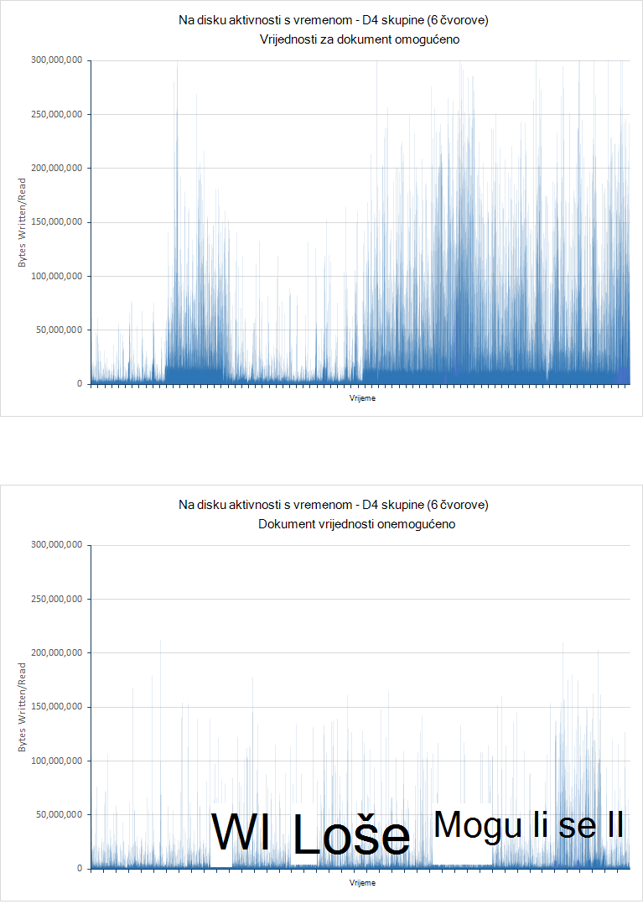

**Upotreba mreže za klastere DS3, DS4 i DS14 izvođenje testiranja ingestion i upita** 

<!-- -->

Ograničenja dostupna propusnost mreže s Azure VMs nisu objavljene može se razlikovati, ali činjenica da mreže aktivnosti čini se da ste levelled pri prosjek oko 2.75GBps za oba DS4 i DS14 testova navedeni takve ograničenje se do, a postala primarni faktor u ograničavanje propusnost. Slučaju klaster DS3 aktivnosti mreže je znatno niže da bi se na donjem performanse vjerojatnije zbog ograničenja dostupnosti drugih resursa.

Da biste izdvajanja efekata operacije ingestion i prikazuje kako se performanse upita mijenja se kao čvorove proširenja, skup samo za upit testira je izvršiti pomoću isti čvorove. Sljedeća tablica prikazuje rezultate dobiti na svakom klaster:

> [AZURE.NOTE] Ne treba usporediti performanse i broj zahtjeva izvršio upita u na *samo za upit* test s onima pokrenuti test *ingestion i upit* . To je jer su promijenjene upiti i veličini dokumenta koji je uključen razlikuje se.

| Klaster      | Operacija/upit            | Broj zahtjeva | Prosječna odgovor Ttme (ms) |
|--------------|----------------------------|--------------------|----------------------------|
| Small (DS3)  | Zbroj po ocjena            | 464                | 11758                      |
|              | Count vrijeme            | 464                | 14699                      |
|              | Pristupa prema državi            | 463                | 14075                      |
|              | Vrh 15 tvrtke ili ustanove       | 464                | 11856                      |
|              | Brojanje jedinstvenih tvrtke ili ustanove | 462                | 12314                      |
|              | Brojanje jedinstvenih IP            | 461                | 19898                      |
|              | Zbroj zbroja pristupa           | 462                | 8882  
|||||
| Srednje (DS4) | Zbroj po ocjena            | 1045               | 4489                       |
|              | Count vrijeme            | 1045               | 7292                       |
|              | Pristupa prema državi            | 1053               | 7564                       |
|              | Vrh 15 tvrtke ili ustanove       | 1055               | 5066                       |
|              | Brojanje jedinstvenih tvrtke ili ustanove | 1051               | 5231                       |
|              | Brojanje jedinstvenih IP            | 1051               | 9228                       |
|              | Zbroj zbroja pristupa           | 1051               | 2180                       |
|||||
| Velike (DS14) | Zbroj po ocjena            | 1842               | 1927                       |
|              | Count vrijeme            | 1839               | 4483                       |
|              | Pristupa prema državi            | 1838               | 4761                       |
|              | Vrh 15 tvrtke ili ustanove       | 1842               | 2117                       |
|              | Brojanje jedinstvenih tvrtke ili ustanove | 1837               | 2393                       |
|              | Brojanje jedinstvenih IP            | 1837               | 7159                       |
|              | Zbroj zbroja pristupa           | 1837               | 642                        |

Ovaj put trendova u vrijeme average odaziva preko različitih klastere je jasniji prikaz. Upotreba mreže je dobro ispod 2.75GBps ranije potrebnih DS4 i DS14 skupina (što vjerojatno saturated mreže u testova ingestion i upita), a 1.5GBps za DS3 klaster. Zapravo je bliže 200MBps u svakom slučaju, kao što je prikazano po grafova u nastavku:

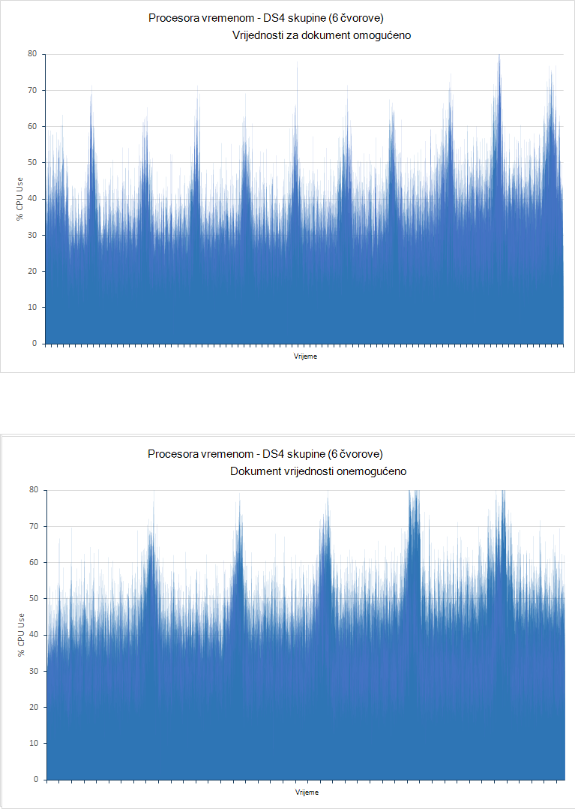

***Mrežni Upotreba za DS3, DS4 i DS14 klastere izvođenje testiranja samo za upit*** 

Ograničavanje faktor u klastere DS3 i DS4 sada izgleda procesora koji je blizu 100% za približno vremena. U na DS14 klaster Procesor korištenje izračunava prosječnu vrijednost samo veće od 80%. To je i dalje visoka, ali jasno ističu prednostima korištenja značajke više procesora jezgri dostupna. Na sljedećoj je slici prikazan uzoraka korištenja procesora za klastere DS3, DS4 i DS14.

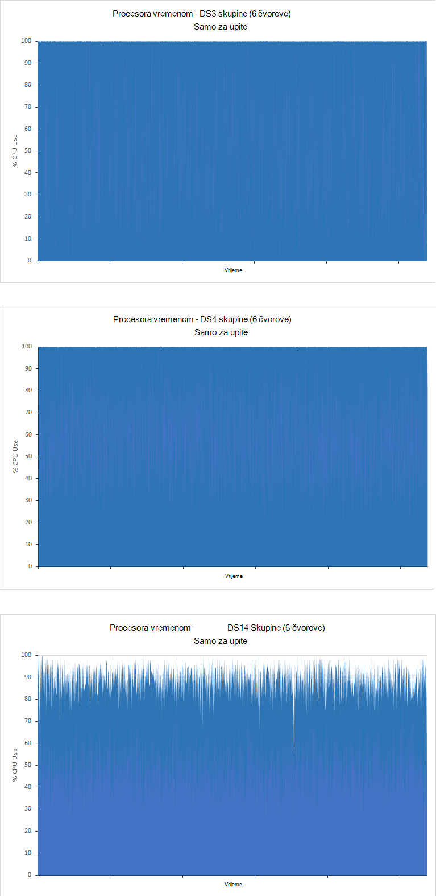

***Procesora za klastere DS3 i DS14 izvođenje testiranja samo za upit*** 

## <a name="performance-results---scaling-out"></a>Rezultati performanse - skaliranje izgleda

Da biste ilustrirali kako sustav mijenja veličinu odgovor s brojem čvorove, testovi bili pokrenuti pomoću DS14 klastere koje sadrže 1, 3 i 6 čvorove. Ovaj put, samo na *samo za upit* test je izveden, pomoću 100 milijuna dokumenata i pokretanje 90 minuta:

| Klaster | Operacija/upit            | Broj zahtjeva | Prosječna reakcija (ms) |
|---------|----------------------------|--------------------|----------------------------|
| 1 čvor  | Zbroj po ocjena            | 288                | 6216                       |
|         | Count vrijeme            | 288                | 28933                      |
|         | Pristupa prema državi            | 288                | 29455                      |
|         | Vrh 15 tvrtke ili ustanove       | 288                | 9058                       |
|         | Brojanje jedinstvenih tvrtke ili ustanove | 287                | 19916                      |
|         | Brojanje jedinstvenih IP            | 284                | 54203                      |
|         | Zbroj zbroja pristupa           | 287                | 3333                       |
|||||
| Čvorovi 3 | Zbroj po ocjena            | 1194               | 3427                       |
|         | Count vrijeme            | 1194               | 5381                       |
|         | Pristupa prema državi            | 1191               | 6840                       |
|         | Vrh 15 tvrtke ili ustanove       | 1196               | 3819                       |
|         | Brojanje jedinstvenih tvrtke ili ustanove | 1190               | 2938                       |
|         | Brojanje jedinstvenih IP            | 1189               | 12516                      |
|         | Zbroj zbroja pristupa           | 1191               | 1272                       |
|||||
| Čvorovi 6 | Zbroj po ocjena            | 1842               | 1927                       |
|         | Count vrijeme            | 1839               | 4483                       |
|         | Pristupa prema državi            | 1838               | 4761                       |
|         | Vrh 15 tvrtke ili ustanove       | 1842               | 2117                       |
|         | Brojanje jedinstvenih tvrtke ili ustanove | 1837               | 2393                       |
|         | Brojanje jedinstvenih IP            | 1837               | 7159                       |
|         | Zbroj zbroja pristupa           | 1837               | 642                        |

Broj čvorove važno je značajan u upit performanse klaster, iako u nelinearni način. 3 čvor klaster dovršava približno 4 vremena kao broj upita kao klaster jedan čvor dok klaster 6 čvor rukuje 6 vremena kao broj. Da biste objasniti ovo nonlinearity sljedeće grafikona prikazuju kako Procesor je koju troše tri skupina:

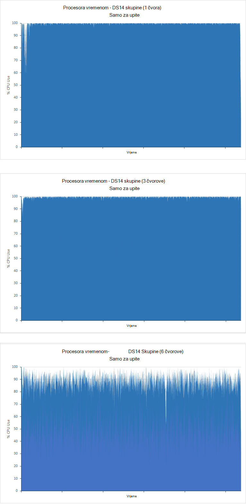

***Procesora za 1, 3 i 6 čvor klastere izvođenje testiranja samo za upit***

Skupina jedne čvor i 3 čvor su procesora povezanih dok iako je procesora visoke klasteru 6 čvor rezervnih obrada kapaciteta dostupna je. U ovom slučaju, Ostali čimbenici vjerojatno će biti ograničavanjem propusnost. To nije moguće potvrditi tako da testirate s 9 i 12 čvorove koje bi vjerojatno prikazati dodatne rezervnih obrada kapaciteta.

Podatke iz gornje tablice također prikazuje kako se razlikuju vremena average odgovor za upite. Ovo je stavka koje se najčešće Informativna ako testiranje kako mijenja veličinu sustav za određene vrste upita. Neka pretraživanja su jasno daleko učinkovitiji prilikom koje se protežu na više čvorove od ostalih. To može biti zbog omjer broj čvorove i broj dokumenata uzlaznim klaster, svaki klaster nalaze 100 milijuna dokumenata. Prilikom izvršavanja pretraživanja koje obuhvaćaju Zbrajanje podataka Elasticsearch će obraditi i međuspremnika podatke koji se dohvaćaju tijekom procesa zbrajanja u memoriji na svakom čvor. Ako postoji više čvorove, postoji manje podataka za dohvaćanje međuspremnik i obradu na svakom čvor.

## <a name="performance-results---number-of-replicas"></a>Performanse rezultati - broj replike

Testira *ingestion i upita* pokrenuli su indeksa s jednom replike. Testova su ponavlja na 6 čvor DS4 i DS14 skupina pomoću indeksa s dvije replike. Svi testovi pokrenuli 24 sata. U sljedećoj tablici prikazane složene rezultata za jedan i dvije replike:

| Klaster | Operacija/upit            | Prosječna reakcija (ms) - 1 replike | Prosječna reakcija (ms) - 2 replike | % razlike u vrijeme odaziva |
|---------|----------------------------|----------------------------------------|-----------------------------------------|-------------------------------|
| DS4     | Ingestion                  | 511                                    | 655                                     | + 28%                          |
|         | Zbroj po ocjena            | 187                                    | 168                                     | -10%                          |
|         | Count vrijeme            | 411                                    | 309                                     | -25%                          |
|         | Pristupa prema državi            | 402                                    | 562                                     | + 40%                          |
|         | Vrh 15 tvrtke ili ustanove       | 307                                    | 366                                     | + 19%                          |
|         | Brojanje jedinstvenih tvrtke ili ustanove | 320                                    | 378                                     | + 18%                          |
|         | Brojanje jedinstvenih IP            | 841                                    | 987                                     | + 17%                          |
|         | Zbroj zbroja pristupa           | 236                                    | 236                                     | + 0%                           |
||||||
| DS14    | Ingestion                  | 511                                    | 618                                     | + 21%                          |
|         | Zbroj po ocjena            | 201                                    | 275                                     | + 37%                          |
|         | Count vrijeme            | 298                                    | 466                                     | + 56%                          |
|         | Pristupa prema državi            | 363                                    | 529                                     | + 46%                          |
|         | Vrh 15 tvrtke ili ustanove       | 244                                    | 407                                     | + 67%                          |
|         | Brojanje jedinstvenih tvrtke ili ustanove | 283                                    | 403                                     | + 42%                          |
|         | Brojanje jedinstvenih IP            | 681                                    | 823                                     | + 21%                          |
|         | Zbroj zbroja pristupa           | 200                                    | 221                                     | + 11%                          |

Stopa ingestion smanjiti kao broj replike povećati. Trebali biste to očekuje kao Elasticsearch je pisanje više kopija svakom dokumentu generiranje/i dodatne disk.  Ovo prikazuje se po grafikona za klaster DS14 za indeksi s 1 i 2 replike prikazano na slici u nastavku. U slučaju indeks s 1 replike Prosječna brzina/i nije 16896573 bajtova/sekundi. Za indeks s 2 replike Prosječna brzina/i nije 33986843 bajtova/sekundi, samo putem dvaput kao broj.

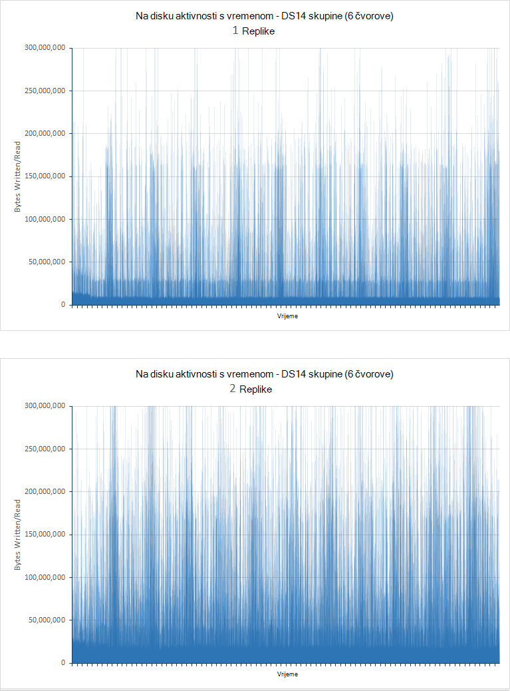

***Na disku/i tečajeve za čvorove s 1 i 2 replike izvođenje testiranja ingestion i upita***

| Klaster | Upit                      | Prosječna reakcija (ms) - 1 replike | Prosječna reakcija (ms) - 2 replike |
|---------|----------------------------|----------------------------------------|-----------------------------------------|
| DS4     | Zbroj po ocjena            | 4489                                   | 4079                                    |
|         | Count vrijeme            | 7292                                   | 6697                                    |
|         | Pristupa prema državi            | 7564                                   | 7173                                    |
|         | Vrh 15 tvrtke ili ustanove       | 5066                                   | 4650                                    |
|         | Brojanje jedinstvenih tvrtke ili ustanove | 5231                                   | 4691                                    |
|         | Brojanje jedinstvenih IP            | 9228                                   | 8752                                    |
|         | Zbroj zbroja pristupa           | 2180                                   | 1909                                    |
|||||
| DS14    | Zbroj po ocjena            | 1927                                   | 2330                                    |
|         | Count vrijeme            | 4483                                   | 4381                                    |
|         | Pristupa prema državi            | 4761                                   | 5341                                    |
|         | Vrh 15 tvrtke ili ustanove       | 2117                                   | 2560                                    |
|         | Brojanje jedinstvenih tvrtke ili ustanove | 2393                                   | 2546                                    |
|         | Brojanje jedinstvenih IP            | 7159                                   | 7048                                    |
|         | Zbroj zbroja pristupa           | 642                                    | 708                                     |

Ove Rezultati prikazuju poboljšanje Prosječno vrijeme odaziva za DS4 klaster, ali povećava za klaster DS14. Da biste lakše tumačenje te rezultate, trebali biste razmotriti i broj upita obavlja svaki test:

| Klaster | Upit                      | Broj izvršiti - 1 replike | Broj izvršiti - 2 replike |
|---------|----------------------------|------------------------------|-------------------------------|
| DS4     | Zbroj po ocjena            | 1054                         | 1141                          |
|         | Count vrijeme            | 1054                         | 1139                          |
|         | Pristupa prema državi            | 1053                         | 1138                          |
|         | Vrh 15 tvrtke ili ustanove       | 1055                         | 1141                          |
|         | Brojanje jedinstvenih tvrtke ili ustanove | 1051                         | 1136                          |
|         | Brojanje jedinstvenih IP            | 1051                         | 1135                          |
|         | Zbroj zbroja pristupa           | 1051                         | 1136                          |
|||||
| DS14    | Zbroj po ocjena            | 1842                         | 1718                          |
|         | Count vrijeme            | 1839                         | 1716                          |
|         | Pristupa prema državi            | 1838                         | 1714                          |
|         | Vrh 15 tvrtke ili ustanove       | 1842                         | 1718                          |
|         | Brojanje jedinstvenih tvrtke ili ustanove | 1837                         | 1712                          |
|         | Brojanje jedinstvenih IP            | 1837                         | 1712                          |
|         | Zbroj zbroja pristupa           | 1837                         | 1712                          |

Ove podatke prikazuje da broj upita obavlja klaster DS4 povećati ravnini s smanjenje Prosječno vrijeme odaziva, no ponovno se odnosi i na osjetilo klaster DS14 na obrnutog. Jednu značajnu faktor je da se procesora od na DS4 skupine u replike za 1 i 2 replike testova koje sadrže nejednoliko je šire. Neke čvorove exhibited blizu 100% Upotreba dok drugi imao rezervnih obrada kapaciteta. Poboljšanje performansi je najvjerojatnije povećana mogućnost obrada raspodijelite čvorove klaster. Sljedeća slika prikazuje željenu varijaciju u procesora obrade između najčešće svijetlim i intenzivnog korištenih VMs (čvorove 4 i 3):

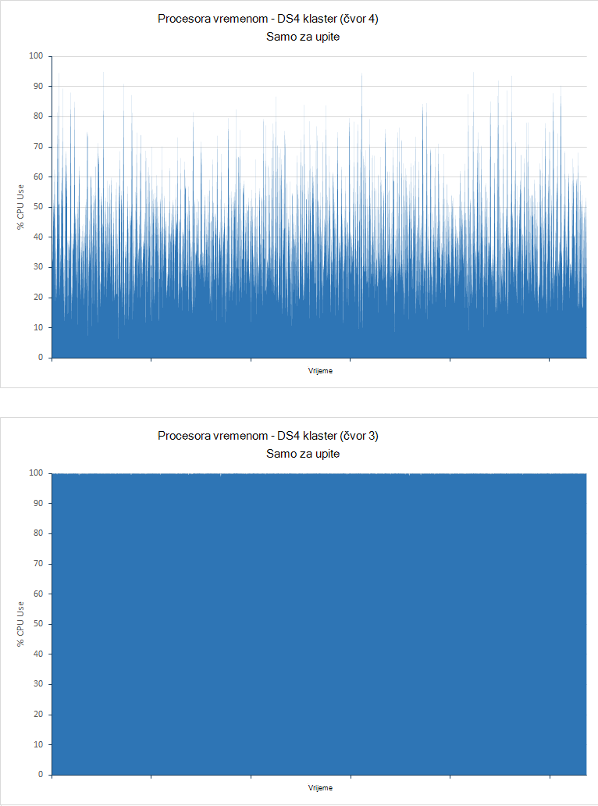

***Procesora za čvorove najmanje koristi i najčešće korištenih u skupini DS4 izvođenje testiranja samo za upit***

Za klaster DS14 to nije slučaj. Procesora za oba testira je donjem preko sve čvorove i dostupnost drugi replike postala manje od prednosti i više programa indirektni:

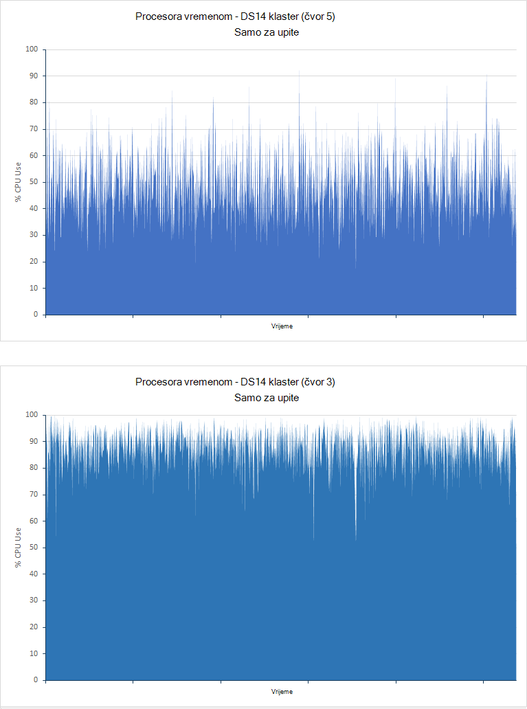

***Procesora za čvorove najmanje koristi i najčešće korištenih u skupini DS14 izvođenje testiranja samo za upit***

Ove Rezultati prikazuju treba pažljivo benchmark sustava pri odabiru hoćete li koristiti više replike. Mora uvijek imati barem jedan replike svaki indeks (osim ako ste spremni rizika od gubitka podataka ne uspije čvor), ali dodatne replike možete nametnuti teret u sustavu za mnogo koristi, ovisno o vašem radnih opterećenja i resursima hardvera u klaster.

## <a name="performance-results---doc-values"></a>Rezultati performanse - vrijednosti za dokument

Testira *ingestion i upit* su obavljaju vrijednostima dokument omogućen, što uzrokuje Elasticsearch radi pohrane podataka koji se koristi za sortiranje polja na disku. Testova ponavlja su s vrijednostima dokument onemogućen, tako da se Elasticsearch konstruirana fielddata dinamički i predmemorirani u memoriji. Svi testovi pokrenuli 24 sata. U tablici u nastavku uspoređuje odgovor vremena za testira pokrećete za klastere 6 čvorove izgrađene pomoću D4, DS4 i DS14 VMs (klaster D4 koristi običan tvrdom disku, dok DS4 i DS14 skupina koriste SSDs).

| Klaster | Operacija/upit            | Prosječna reakcija (ms) - vrijednosti za dokument omogućeno | Prosječna reakcija (ms) – dokument vrijednosti onemogućena | % razlike u vrijeme odaziva |
|---------|----------------------------|-------------------------------------------------|--------------------------------------------------|-------------------------------|
| D4      | Ingestion                  | 978                                             | 835                                              | -15%                          |
|         | Zbroj po ocjena            | 103                                             | 132                                              | + 28%                          |
|         | Count vrijeme            | 134                                             | 189                                              | + 41%                          |
|         | Pristupa prema državi            | 199                                             | 259                                              | + 30%                          |
|         | Vrh 15 tvrtke ili ustanove       | 137                                             | 184                                              | + 34%                          |
|         | Brojanje jedinstvenih tvrtke ili ustanove | 139                                             | 197                                              | + 42%                          |
|         | Brojanje jedinstvenih IP            | 510                                             | 604                                              | + 18%                          |
|         | Zbroj zbroja pristupa           | 89                                              | 134                                              | + 51%                          |
||||||
| DS4     | Ingestion                  | 511                                             | 581                                              | + 14%                          |
|         | Zbroj po ocjena            | 187                                             | 190                                              | + 2%                           |
|         | Count vrijeme            | 411                                             | 409                                              | -0,5%                         |
|         | Pristupa prema državi            | 402                                             | 414                                              | + 3%                           |
|         | Vrh 15 tvrtke ili ustanove       | 307                                             | 284                                              | -7%                           |
|         | Brojanje jedinstvenih tvrtke ili ustanove | 320                                             | 313                                              | -2%                           |
|         | Brojanje jedinstvenih IP            | 841                                             | 955                                              | + 14%                          |
|         | Zbroj zbroja pristupa           | 236                                             | 281                                              | + 19%                          |
||||||
| DS14    | Ingestion                  | 511                                             | 571                                              | + 12%                          |
|         | Zbroj po ocjena            | 201                                             | 232                                              | + 15%                          |
|         | Count vrijeme            | 298                                             | 341                                              | + 14%                          |
|         | Pristupa prema državi            | 363                                             | 457                                              | + 26%                          |
|         | Vrh 15 tvrtke ili ustanove       | 244                                             | 338                                              | + 39%                          |
|         | Brojanje jedinstvenih tvrtke ili ustanove | 283                                             | 350                                              | + 24%                          |
|         | Brojanje jedinstvenih IP            | 681                                             | 909                                              | + 33%                          |
|         | Zbroj zbroja pristupa           | 200                                             | 245                                              | + 23%                          |

Na sljedeću tablicu uspoređuje broj ingestion operacija obavlja testove:

| Klaster | Count operacija ingestion - vrijednosti za dokument omogućeno | Count operacija ingestion - dokument vrijednosti onemogućeno | % razlike u \number ingestion operacije |
|---------|----------------------------------------------|-----------------------------------------------|-----------------------------------------|
| D4      | 264769                                       | 408690                                        | + 54%                                    |
| DS4     | 503137                                       | 578237                                        | + 15%                                    |
| DS14    | 502714                                       | 586472                                        | + 17%                                    |

Poboljšani ingestion stope pojaviti vrijednostima dokumenta onemogućuje kao manje podataka ne zapisuje na disk kao što su umetati dokumenata. Bolje performanse je osobito uočljivijih s VM D4 pomoću HDDs radi pohrane podataka. U ovom slučaju reakcija za ingestion operacije i smanjiti 15% (pogledajte prve tablice u ovom odjeljku). To nije moguće zbog smanjene pritisak na HDDs koja su vjerojatno imati blizu njihove IOPS ograničenja u test s dokument vrijednosti omogućen, potražite u članku testiranje diska upišite dodatne informacije. Sljedeće grafikonu uspoređuje/i performanse D4 VMs vrijednostima dokument omogućeno (vrijednosti ostaju na disku) i dokument vrijednosti onemogućeno (vrijednosti sadrži memorije):


***Na disku aktivnosti klaster D4 vrijednostima dokumenta omogućuje i onemogućuje***

Nasuprot tome, ingestion vrijednosti za VMs pomoću SSDs prikaz small povećava se broj dokumenata, ali i povećava reakcija operacija ingestion. S jednom ili dvjema small iznimke vrijeme odaziva upita i su worse. Na SSDs vjerojatno manje imati blizu njihove IOPS ograničenja s vrijednostima za dokument omogućeno, tako da se promjene u performanse vjerojatnije zbog povećavaju obrade aktivnosti i indirektni upravljanja skupova JVM. Ovo je evident usporedbom Upotreba procesora vrijednostima dokumenta omogućuje i onemogućuje. Sljedeći grafikonu ističe ove podatke za DS4 klaster, gdje se većina Upotreba procesora premješta iz grupiranje 30-40% vrijednostima dokument omogućen za grupiranje 40% – 50% vrijednostima dokumenta onemogućuje (klaster DS14 prikazivao trend slično):


***Procesora za klaster DS4 vrijednostima dokumenta omogućuje i onemogućuje***

Da biste razlikovali efekti dokument vrijednosti na performanse upita iz podataka ingestion parova samo za upit testira su izvršiti za klastere DS4 i DS14 vrijednostima dokumenta omogućuje i onemogućuje. U dolje navedenoj tablici prikazane su rezultate tih testova:

| Klaster | Operacija/upit            | Prosječna reakcija (ms) - vrijednosti za dokument omogućeno | Prosječna reakcija (ms) – dokument vrijednosti onemogućena | % razlike u vrijeme odaziva |
|---------|----------------------------|-------------------------------------------------|--------------------------------------------------|-------------------------------|
| DS4     | Zbroj po ocjena            | 4489                                            | 3736                                             | -16%                          |
|         | Count vrijeme            | 7293                                            | 5459                                             | -25%                          |
|         | Pristupa prema državi            | 7564                                            | 5930                                             | -22%                          |
|         | Vrh 15 tvrtke ili ustanove       | 5066                                            | 3874                                             | -14%                          |
|         | Brojanje jedinstvenih tvrtke ili ustanove | 5231                                            | 4483                                             | -2%                           |
|         | Brojanje jedinstvenih IP            | 9228                                            | 9474                                             | + 3%                           |
|         | Zbroj zbroja pristupa           | 2180                                            | 1218                                             | -44%                          |
||||||
| DS14    | Zbroj po ocjena            | 1927                                            | 2144                                             | + 11%                          |
|         | Count vrijeme            | 4483                                            | 4337                                             | -3%                           |
|         | Pristupa prema državi            | 4761                                            | 4840                                             | + 2%                           |
|         | Vrh 15 tvrtke ili ustanove       | 2117                                            | 2302                                             | + 9%                           |
|         | Brojanje jedinstvenih tvrtke ili ustanove | 2393                                            | 2497                                             | + 4%                           |
|         | Brojanje jedinstvenih IP            | 7159                                            | 7639                                             | + 7%                           |
|         | Zbroj zbroja pristupa           | 642                                             | 633                                              | -1%                           |

Imajte na umu da s Elasticsearch 2.0 nadalje, dokument vrijednosti omogućena je prema zadanim postavkama. Testira prekrivajući DS4 klaster, onemogućivanje vrijednosti dokument će se pojaviti da bi se efekt pozitivne cjelokupne, dok je u obrnutog obično true za klaster DS14 (dva slučajevima gdje performanse je bolje vrijednostima dokument onemogućene su vrlo granične).

Za klaster DS4 procesora u oba slučaja nije blizu 100% trajanja oba testira koja označava da je klaster procesora vezana. Međutim, broj upita obrađuju se smanjiti 7369 5894 (20%). Imajte na umu da ako onemogućene su vrijednosti dokument Elasticsearch će dinamičko stvaranje fielddata u memoriji, i to troši procesora power. Tu konfiguraciju sadrži smanjene rata disk/i, ali povećana opterećenjem na procesora koji se izvodi blizu svoje Maksimalna mogućnosti, pa u tom slučaju upita brže vrijednostima dokumenta onemogućuje no postoje manje od njih.

U DS14 testova sa ili bez vrijednosti dokument procesora aktivnosti nije visoka, ali ne na 100%. Broj upita koji se izvode je malo iznad (približno 4%) u testira s vrijednostima za dokument omogućeno:

| Klaster | Upit                      | Broj izvršiti - vrijednosti za dokument omogućeno | Broj koji se izvode - dokument vrijednosti onemogućeno |
|---------|----------------------------|---------------------------------------|----------------------------------------|
| DS4     | Zbroj po ocjena            | 1054                                  | 845                                    |
|         | Count vrijeme            | 1054                                  | 844                                    |
|         | Pristupa prema državi            | 1053                                  | 842                                    |
|         | Vrh 15 tvrtke ili ustanove       | 1055                                  | 846                                    |
|         | Brojanje jedinstvenih tvrtke ili ustanove | 1051                                  | 839                                    |
|         | Brojanje jedinstvenih IP            | 1051                                  | 839                                    |
|         | Zbroj zbroja pristupa           | 1051                                  | 839  
|||||                                  |
| DS14    | Zbroj po ocjena            | 1772                                  | 1842                                   |
|         | Count vrijeme            | 1772                                  | 1839                                   |
|         | Pristupa prema državi            | 1770.                                  | 1838                                   |
|         | Vrh 15 tvrtke ili ustanove       | 1773                                  | 1842                                   |
|         | Brojanje jedinstvenih tvrtke ili ustanove | 1769                                  | 1837                                   |
|         | Brojanje jedinstvenih IP            | 1768                                  | 1837                                   |
|         | Zbroj zbroja pristupa           | 1769                                  | 1837                                   |

## <a name="performance-results---shard-request-cache"></a>Rezultati performanse - shard zahtjev predmemorije

Da bismo pokazali kako predmemoriranja indeksirati podatke u memoriji svaki čvor može utjecati na performanse, *upita i ingestion* test je obavljaju na na DS4 i 6 čvor klaster DS14 s indeks Predmemoriranje omogućeno - potražite u odjeljku [pomoću predmemoriju shard zahtjev za](#using-the-shard-request-cache) dodatne informacije. Rezultati su u usporedbi s onih generira tako da starije testira pomoću isti indeks, ali s indeks predmemoriranje onemogućene. U tablici u nastavku navedene rezultate. Imajte na umu da podatke sadrži je curtailed da prekrije samo prvi 90 minuta test, sada je vidljivu složene trend i nastavite test bi vjerojatno ne prinosite sve dodatne uvida:

| Klaster | Operacija/upit            | AVERAGE reakcija (ms) - indeksirati predmemorija je onemogućena | Prosječna reakcija (ms) – indeks predmemorije omogućeno | % razlike u vrijeme odaziva |
|---------|----------------------------|---------------------------------------------------|--------------------------------------------------|-------------------------------|
| DS4     | Ingestion                  | 504                                               | 3260                                             | + 547%                         |
|         | Zbroj po ocjena            | 218                                               | 273                                              | + 25%                          |
|         | Count vrijeme            | 450                                               | 314                                              | – 30%                          |
|         | Pristupa prema državi            | 447                                               | 397                                              | -11%                          |
|         | Vrh 15 tvrtke ili ustanove       | 342                                               | 317                                              | -7%                           |
|         | Brojanje jedinstvenih tvrtke ili ustanove | 370                                               | 324                                              | -12 %%                         |
|         | Brojanje jedinstvenih IP            | 760                                               | 355                                              | – % 53                          |
|         | Zbroj zbroja pristupa           | 258                                               | 291                                              | + 12%                          |
||||||
| DS14    | Ingestion                  | 503                                               | 3365                                             | + 569%                         |
|         | Zbroj po ocjena            | 234                                               | 262                                              | + 12%                          |
|         | Count vrijeme            | 357                                               | 298                                              | -17%                          |
|         | Pristupa prema državi            | 416                                               | 383                                              | -8%                           |
|         | Vrh 15 tvrtke ili ustanove       | 272                                               | 324                                              | -7%                           |
|         | Brojanje jedinstvenih tvrtke ili ustanove | 330                                               | 321                                              | -3%                           |
|         | Brojanje jedinstvenih IP            | 674                                               | 352                                              | -48%                          |
|         | Zbroj zbroja pristupa           | 227                                               | 292                                              | + 29%                          |

Ove podatke prikazuje dvije točke koji vas zanimaju:

-  Podaci ingestion stope prikazati može znatno smanjiti tako da omogućite predmemoriranje indeksa.

-  Predmemoriranje indeksa nužno nećete poboljšati reakcija svih vrsta upita, a možete imati posljedice na određene operacije zbrajanja kao što su oni obavlja upita Count po ocjena i ukupan broj pristupa.
 

Da biste shvatili Zašto sustav prikazuje taj problem, razmislite o broj upita uspješno izvodi u svakom slučaju tijekom testiranja se pokreće. U sljedećoj su tablici navedene ove podatke:

| Klaster | Operacija/upit            | Operacije/upiti count - indeks predmemorije onemogućena | Operacije/upiti count - indeks predmemorije omogućeno |
|---------|----------------------------|-------------------------------------------------|------------------------------------------------|
| DS4     | Ingestion                  | 38611                                           | 13232                                          |
|         | Zbroj po ocjena            | 524                                             | 18704                                          |
|         | Count vrijeme            | 523                                             | 18703                                          |
|         | Pristupa prema državi            | 522                                             | 18702                                          |
|         | Vrh 15 tvrtke ili ustanove       | 521                                             | 18706                                          |
|         | Brojanje jedinstvenih tvrtke ili ustanove | 521                                             | 18700                                          |
|         | Brojanje jedinstvenih IP            | 521                                             | 18699                                          |
|         | Zbroj zbroja pristupa           | 521                                             | 18701                                          |
||||                                        |
| DS14    | Ingestion                  | 38769                                           | 12835                                          |
|         | Zbroj po ocjena            | 528                                             | 19239                                          |
|         | Count vrijeme            | 528                                             | 19239                                          |
|         | Pristupa prema državi            | 528                                             | 19238                                          |
|         | Vrh 15 tvrtke ili ustanove       | 527                                             | 19240                                          |
|         | Brojanje jedinstvenih tvrtke ili ustanove | 524                                             | 19234                                          |
|         | Brojanje jedinstvenih IP            | 524                                             | 19234                                          |
|         | Zbroj zbroja pristupa           | 527                                             | 19236                                          |

Vidjet ćete da iako stopu ingestion kada predmemoriranje je omogućena je približno 1/3 koji kada predmemoriranje je onemogućena, broj upita koji se izvode povećati faktorom od 34. Više upita stvaraju suvišni disk/i i nije morati se natječu za resurse na disku. To će se dogoditi po kojima se uspoređuje/i aktivnosti za sve četiri slučajeve grafikona na slici u nastavku:

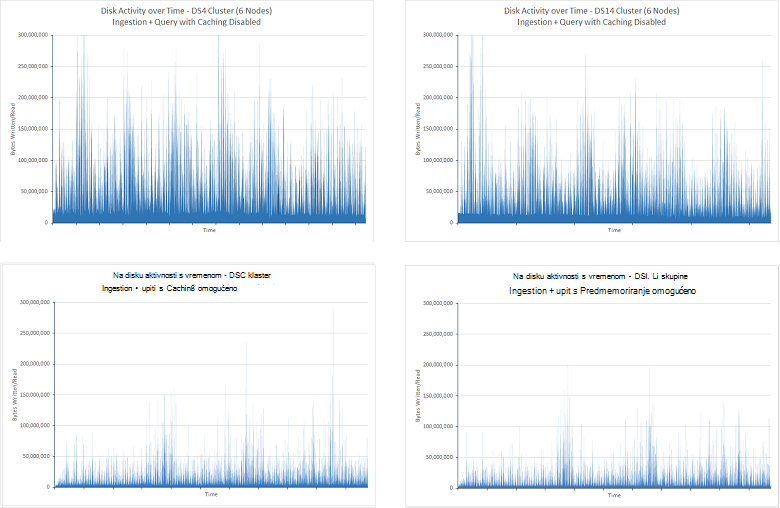

***Na disku/i aktivnosti za testiranje ingestion i upita s predmemoriranje indeks onemogućen i omogućena***

Smanjenje na disku/i namijenjena i Procesor potrošeno je kraće čekanje/i da biste dovršili. Istaknuta je tako da na sljedeći slici:

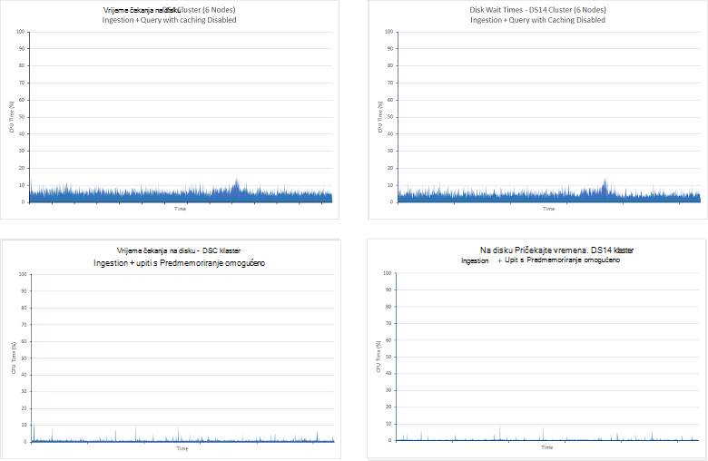

***CPU vrijeme utrošeno na čekanje na disku/i da biste dovršili testa ingestion i upita s indeks predmemoriranje onemogućeno i omogućena***

Smanjenje na disku/i namijenjena Elasticsearch nije provedu mnogo veći dio njegovo vrijeme održavanje upita iz podataka sadrži memorije. Povećava se procesora koja postaje vidljivu ako pogledate procesora za sve četiri slučajeve. Način upotrebe procesora je više osigurale trajne s Predmemoriranje omogućeno Prikaži grafova u nastavku:

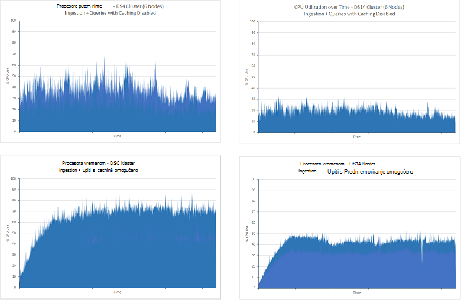

***Procesora ingestion i upit testiranje s indeks predmemoriranje onemogućeno i omogućena***

Glasnoću mreže/i u oba scenarija tijekom trajanja testova je njih svim korisnicima Dopusti slično. Testira bez predmemoriranja prikazivao postupne smanjene performanse tijekom probno razdoblje, ali više, 24 sata pokreće te testova prikazivao da ova statistike levelled na približno 2.75GBps. Na donjoj slici prikazano ove podatke za klastere DS4 (podatke za klastere DS14 je slično):

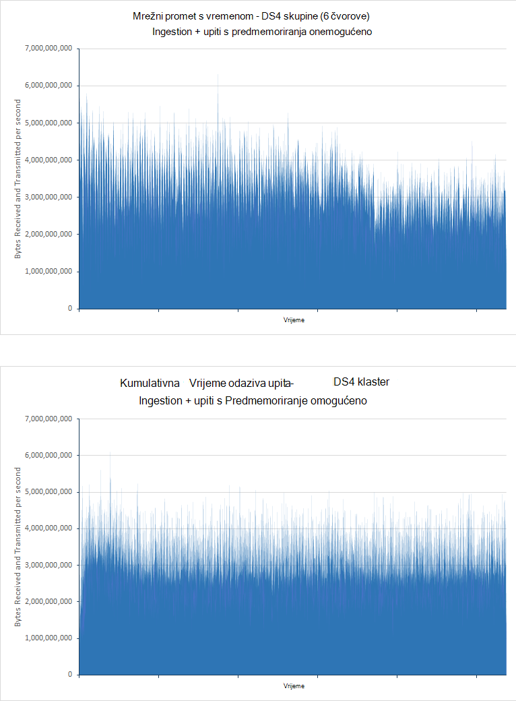

***Mrežni promet količine za testiranje ingestion i upita s indeks predmemoriranje onemogućeno i omogućena***

Kao što je opisano u testu [Skaliranje prema gore](#performance-results-scaling-up) , ograničenja za mrežne propusnosti s Azure VMs nisu objavljene i može se razlikovati, ali moderiranje razine procesora i disk aktivnosti predlaže Upotreba mreže mogu biti ograničavanje faktor u ovom scenariju.

Predmemoriranje je prirodan više prikladniji scenariji kojima promjene podataka diskovni. Da biste istaknuli utjecaj predmemoriranja u ovom scenariju na *samo za upit* testira su izvršavaju Predmemoriranje omogućeno. Rezultati se prikazuju ispod (te testira pokrenuli 90 min i indeksa u odjeljku test nalaze 100 milijuna dokumenata):

| Klaster | Upit                      | Prosječna reakcija (ms) | Broj upita koji se izvode |
|---------|----------------------------|----------------------------|-------------------------|
|         |                            | **Predmemorija onemogućena**         | **Predmemorija omogućeno**       |
| DS4     | Zbroj po ocjena            | 4489                       | 210                     |
|         | Count vrijeme            | 7292                       | 211                     |
|         | Pristupa prema državi            | 7564                       | 231                     |
|         | Vrh 15 tvrtke ili ustanove       | 5066                       | 211                     |
|         | Brojanje jedinstvenih tvrtke ili ustanove | 5231                       | 211                     |
|         | Brojanje jedinstvenih IP            | 9228                       | 218                     |
|         | Zbroj zbroja pristupa           | 2180                       | 210                     |
|         |                            |                            |                         |
| DS14    | Zbroj po ocjena            | 1927                       | 211                     |
|         | Count vrijeme            | 4483                       | 219                     |
|         | Pristupa prema državi            | 4761                       | 236                     |
|         | Vrh 15 tvrtke ili ustanove       | 2117                       | 212                     |
|         | Brojanje jedinstvenih tvrtke ili ustanove | 2393                       | 212                     |
|         | Brojanje jedinstvenih IP            | 7159                       | 220                     |
|         | Zbroj zbroja pristupa           | 642                        | 211                     |

Varijanca u performanse noncached testira je zbog razlikuju u dostupnih resursa DS4 i DS14 VMs. U oba slučaja predmemorirani testa average reakcija prekine znatno kao podatke učitavanja izravno iz memorije. To vrijedi i sudjelovanje koje vrijeme odaziva za predmemorirani DS4 i DS14 klaster testira su slične unatoč disparity noncached rezultate. Postoji i vrlo malo razlika između odgovora vremena za svaki upit unutar svaki test, svi će trajati približno 220ms. Na disku/i stope i procesora za oba klastere su nisku kao jednom svi se podaci nalaze u memoriji malo/i ili obrada potreban je. Mrežni/i stopa je slična uncached testova Potvrđivanjem tog propusnost mreže možda ograničavanje faktor u ovaj test. Sljedeće grafikoni prikazuju ove informacije o DS4 klaster. Profil klaster DS14 je slično:

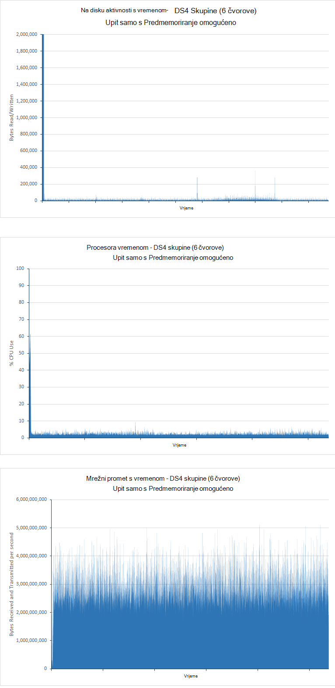

***Na disku/i, procesora i upotreba mreže za testiranje samo za upit s indeks Predmemoriranje omogućeno***

Slika u gornjoj tablici predložiti da pomoću arhitektura DS14 prikazuje mnogo koristi tijekom korištenja u DS4. Zapravo, broj uzoraka generira klaster DS14 je otprilike 5% niže DS4 klaster, ali to može biti zbog ograničenja mreže ovisno o malo tijekom vremena.

## <a name="performance-results---number-of-shards"></a>Performanse rezultati - broj shards

Svrha ovaj test je da biste odredili ima li broj shards stvorene za indeks sve sa slikom na performanse upita te indeksa.

Zasebnom testira obavljaju prethodno prikazivao shard konfiguraciju indeksa može utjecati stopa ingestion podataka. Da biste odredili performanse upita iza slične methodology, ali su ograničene 6 čvor klaster sustavom DS14 hardver obavljaju se testova. Taj se način omogućuje da biste minimizirali broju varijabli, tako da sve razlike u performansama mora biti zbog količinu shards.

Na *samo za upit* test je obavljaju na kopije isti indeks koji je konfiguriran pomoću 7, 13, 23, 37 i 61 primarni shards. Indeks nalazi 100 milijuna dokumenata i imali jedan replike udvostručavanja broj shards preko klaster. Svaki test pokrenuli za 90 minuta. Sljedeća tablica prikazuje rezultate. Prosječna odgovor vrijeme prikazuju se izvodi reakcija transakcije test JMeter koji obuhvaća potpunog skupa upita svakom iteracijom test. Pogledajte napomenu u odjeljku [Rezultati performanse - skaliranje](#performance-results-scaling-up) dodatne informacije:

| Broj shards          | Izgled shard (shards po čvor, uključujući replike) | Broj upita koji se izvode | Vrijeme odaziva Avg (ms) |
|---------------------------|----------------------------------------------------|-----------------------------|------------------------|
| 7 (uključujući replike 14) | 3-2-2-2-2-3                                        | 7461                        | 40524                  |
| 13 (26)                   | 5-4-5-4-4-4                                        | 7369                        | 41055                  |
| 23 (46)                   | 7-8-8-7-8-8                                        | 14193                       | 21283                  |
| 37 (74)                   | 13-12-12-13-12-12                                  | 13399                       | 22506                  |
| 61 (122)                  | 20-21-20-20-21-20                                  | 14743                       | 20445                  |

Te rezultate naznačili da postoji značajan razlika performanse između klaster shard 13(26) i shard klaster 23,(46), propusnost gotovo brojevima dvostruke preciznosti i operaciji pakiranja prepolovit puta odgovor. To je najvjerojatnije konfiguraciju u VMs i strukture koje koristi Elasticsearch obrade zahtjeva za pretraživanje. U redu čekanja zahtjeva za pretraživanje, a svaki zahtjev za pretraživanjem rukuje niti jedan pretraživanja. Broj niti pretraživanje stvorio je Elasticsearch čvor je funkcija broja procesora koji je dostupan na računalu koje hostira čvor. Rezultati predložiti da s 4 ili 5 shards na čvor obrada Resursi su neće se u potpunosti iskoristiti. To je podržano tako da pogledate procesora prilikom pokretanja ovaj test. Na sljedećoj je slici snimku uzeti Marvel prilikom izvođenja 13(26) shard test:

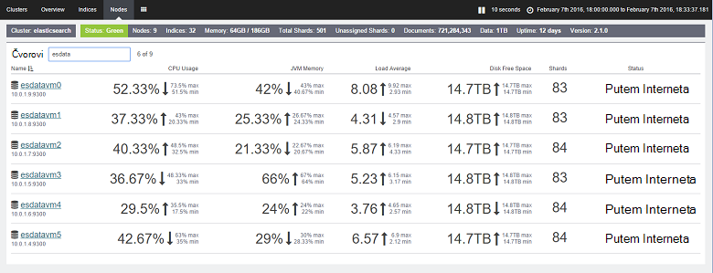

***Procesora testa samo za upit na shard klaster 7(14)***

Usporedba te iznose s onima shard testa 23(46):

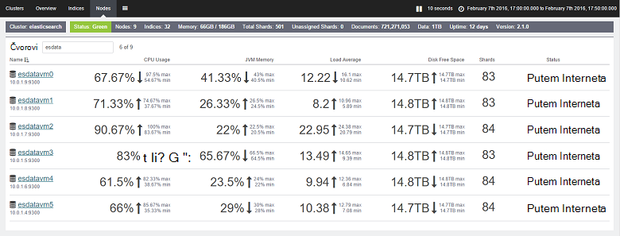

***Procesora testa samo za upit na shard klaster 23(46)***

U 23(46) shard test procesora je znatno veću. Svaki čvor sadrži shards 7 ili 8. Arhitektura DS14 nudi 16 procesora i Elasticsearch je bolje moći izrabljuje taj broj jezgri s dodatnim shards. Slika u gornjoj tablici predložiti da povećanje broja shards izvan tog trenutka mogu poboljšati performanse malo, ali potrebno pomak te iznose protiv dodatne indirektnih troškova održavanja veliku količinu shards. Ove testira ukazuju da je optimalnih broj shards po čvor pola broj jezgri procesora dostupne na svakom čvor. Međutim, imajte na umu da su te rezultate postići kada samo radi upita. Ako vaš sustav uvozi podataka, razmotrite i kako sharding može utjecati na performanse operacije ingestion podataka. 

## <a name="summary"></a>Sažetak

Elasticsearch nudi mnogo mogućnosti koje možete koristiti za strukturiranje indekse i ugađanje ih za podršku operacija veliki upita. Ovaj dokument sadrži navedene neke uobičajene konfiguracije i tehnike koje možete koristiti za ugađanje bazu podataka za potrebe upita. Međutim, trebali biste prepoznati ima li na tradeoff između optimiziranje baze podataka za brzo dohvaćanje umjesto ingestion visoku glasnoću podataka za podršku za podršku. Ponekad što je dobro za ispitivanje mogu imati detrimental utjecaj na Umetanje operacije i obrnuto. U sustavu predstavljeni kombiniranim radnih opterećenja, morate procijenite gdje se nalazi saldo i prilagođavaju sustava parametre.

Uz to, primjenjivošću kako bi drugi konfiguracije i tehnika kojima se može razlikovati zavisno o strukturu podataka i ograničenja (ili neki drugi način) hardvera sustav konstruirana na. Mnoge testova prikazani u ovom dokumentu prikazuju kako odabira hardverska platforma može utjecati na propusnost i kako neke strategije mogu biti korisni u određenim slučajevima, ali detrimental u drugim korisnicima. Točke važno je da biste razumjeli mogućnosti dostupne, a zatim izvršite pomoću vlastitim podacima da biste odredili najčešće optimalnih kombinacija stroge benchmarking.

Imajte na umu da baze podataka programa Elasticsearch nije nužno statične stavke. Vjerojatno će rasti tijekom vremena, a Strategije za strukturiranje podataka možda ćete morati redovito izmijenjenim. Ako, na primjer, možda će biti potrebno proširenja, Vremensko mjerilo ili ponovno indeksirati podatke s dodatnim shards. Kako u sustavu povećava veličini i složenosti, biti pripremljeni neprestano testirajte performanse da biste bili sigurni da se i dalje sastanak bilo koje SLA zajamčena klijentima.

## <a name="appendix-the-query-and-aggregation-performance-test"></a>Dodatak: upita i zbrajanje performanse test

U ovom dodatak opisuje performanse test izvesti protiv klaster Elasticsearch. Testovi bili pokrenuti pomoću JMeter koji se izvode na zasebnom skup VMs. Detalji o konfiguracije okruženja za testiranje je podrobnije opisan u [stvaranju performanse testiranje okruženja za Elasticsearch na Azure](guidance-elasticsearch-creating-performance-testing-environment.md). Da biste izvršili vlastite testiranja, možete stvoriti vlastiti plan testiranja JMeter ručno slijedeći upute u ovom dodatak ili koristite skripte automatiziranog test dostupna zasebno. Dodatne informacije potražite u članku [pokretanje automatskog testova Elasticsearch performanse](guidance-elasticsearch-running-automated-performance-tests.md).

Radno opterećenje upita za podatke izvesti skup upita opisan u nastavku prilikom izvođenja veliki prijenos dokumenata u isto vrijeme. Svrha ovog posla je u programu Publisher radnog okruženja gdje nove podatke neprestano se dodaje dok se izvodi pretraživanja. Upiti su strukturiran dohvatiti samo najnovije podatke iz dokumenata koji su dodani u posljednjih 15 minuta.

Svakom dokumentu spremljenom u jednom pod nazivom *idx*indeks, a imao vrstu *dokumenta*. Možete koristiti sljedeće HTTP zahtjev za stvaranje indeksa. Postavke *number_of_replicas* i *number_of_shards* različiti od vrijednosti u nastavku u mnogim testova. Uz to, za testova koji koriste fielddata umjesto vrijednosti dokument, svako svojstvo je dodavati napomene s atributom *"doc_values": false*.

**Važno**: indeks ispušteni su i ponovno stvoriti prije no što pokretanje testiranja. 

``` http
PUT /idx
{  
    "settings" : {
        "number_of_replicas": 1,
        "refresh_interval": "30s",
        "number_of_shards": "5",
        "index.translog.durability": "async"    
    },
    "doc": {
        "mappings": {
            "event": {
                "_all": {
                    "enabled": false
                },
                "_timestamp": {
                    "enabled": true,
                    "store": true,
                    "format": "date_time"
                },
                "properties": {
                    "Organization": {
                        "type": "string",
                        "index": "not_analyzed"
                    },
                    "CustomField1": {
                        "type": "string",
                        "index": "not_analyzed"
                    },
                    "CustomField2": {
                        "type": "string",
                        "index": "not_analyzed"
                    },
                    "CustomField3": {
                        "type": "string",
                        "index": "not_analyzed"
                    },
                    "CustomField4": {
                        "type": "string",
                        "index": "not_analyzed"
                    },
                    "CustomField5": {
                        "type": "string",
                        "index": "not_analyzed"
                    },
                    "DateTimeReceivedUtc": {
                        "type": "date",
                        "format": "dateOptionalTime"
                    },
                    "Host": {
                        "type": "string",
                        "index": "not_analyzed"
                    },
                    "HttpMethod": {
                        "type": "string",
                        "index": "not_analyzed"
                    },
                    "HttpReferrer": {
                        "type": "string",
                        "index": "not_analyzed"
                    },
                    "HttpRequest": {
                        "type": "string",
                        "index": "not_analyzed"
                    },
                    "HttpUserAgent": {
                        "type": "string",
                        "index": "not_analyzed"
                    },
                    "HttpVersion": {
                        "type": "string",
                        "index": "not_analyzed"
                    },
                    "OrganizationName": {
                        "type": "string",
                        "index": "not_analyzed"
                    },
                    "SourceIp": {
                        "type": "ip"
                    },
                    "SourceIpAreaCode": {
                        "type": "long"
                    },
                    "SourceIpAsnNr": {
                        "type": "string",
                        "index": "not_analyzed"
                    },
                    "SourceIpBase10": {
                        "type": "long"
                    },
                    "SourceIpCity": {
                        "type": "string",
                        "index": "not_analyzed"
                    },
                    "SourceIpCountryCode": {
                        "type": "string",
                        "index": "not_analyzed"
                    },
                    "SourceIpLatitude": {
                        "type": "double"
                    },
                    "SourceIpLongitude": {
                        "type": "double"
                    },
                    "SourceIpMetroCode": {
                        "type": "long"
                    },
                    "SourceIpPostalCode": {
                        "type": "string",
                        "index": "not_analyzed"
                    },
                    "SourceIpRegion": {
                        "type": "string",
                        "index": "not_analyzed"
                    },
                    "SourceLatLong": {
                        "type": "geo_point",
                        "doc_values": true,
                        "lat_lon": true,
                        "geohash": true
                    },
                    "SourcePort": {
                        "type": "string",
                        "index": "not_analyzed"
                    },
                    "SourcedFrom": {
                        "type": "string",
                        "index": "not_analyzed"
                    },
                    "TargetIp": {
                        "type": "ip"
                    },
                    "TargetPort": {
                        "type": "string",
                        "index": "not_analyzed"
                    },
                    "Rating": {
                        "type": "string",
                        "index": "not_analyzed"
                    },
                    "UseHumanReadableDateTimes": {
                        "type": "boolean"
                    }
                }
            }
        }
    }
}
```

Test izvesti su sljedeće upita:
* Koliko dokumenata sa svake vrijednosti ocjena su unesene u posljednjih 15 minuta?

  ```http
  GET /idx/doc/_search
  {
    "query": {
      "bool": {
        "must": [
          {
            "range": {
              "DateTimeReceivedUtc": {
                "gte": "now-15m",
                "lte": "now"
              }
            }
          }
        ],
        "must_not": [],
        "should": []
      }
    },
    "from": 0,
    "size": 0,
    "aggs": {
      "2": {
        "terms": {
          "field": "Rating",
          "size": 5,
          "order": {
            "_count": "desc"
          }
        }
      }
    }
  }
  ```

* Koliko dokumente dodane u svakom razdoblju 5 minuta tijekom posljednjeg 15 minuta?

  ```http
  GET /idx/doc/_search
  {
    "query": {
      "bool": {
        "must": [
          {
            "range": {
              "DateTimeReceivedUtc": {
                "gte": "now-15m",
                "lte": "now"
              }
            }
          }
        ],
        "must_not": [],
        "should": []
      }
    },
    "from": 0,
    "size": 0,
    "sort": [],
    "aggs": {
      "2": {
        "date_histogram": {
          "field": "DateTimeReceivedUtc",
          "interval": "5m",
          "time_zone": "America/Los_Angeles",
          "min_doc_count": 1,
          "extended_bounds": {
            "min": "now-15m",
            "max": "now"
          }
        }
      }
    }
  }
  ```

* Koliko dokumenata svake vrijednosti ocjena dodane uz svaku državu posljednje 15 minuta?

  ```HTTP
  GET /idx/doc/_search
  {
    "query": {
      "filtered": {
        "query": {
          "query_string": {
            "query": "*",
            "analyze_wildcard": true
          }
        },
        "filter": {
          "bool": {
            "must": [
              {
                "query": {
                  "query_string": {
                    "query": "*",
                    "analyze_wildcard": true
                  }
                }
              },
              {
                "range": {
                  "DateTimeReceivedUtc": {
                    "gte": "now-15m",
                    "lte": "now"
                  }
                }
              }
            ],
            "must_not": []
          }
        }
      }
    },
    "size": 0,
    "aggs": {
      "2": {
        "terms": {
          "field": "Rating",
          "size": 5,
          "order": {
            "_count": "desc"
          }
        },
        "aggs": {
          "3": {
            "terms": {
              "field": "SourceIpCountryCode",
              "size": 15,
              "order": {
                "_count": "desc"
              }
            }
          }
        }
      }
    }
  }
  ```

* Koje 15 tvrtkama ili ustanovama najčešće pojavljuju se u dokumenata koji su dodani u posljednjih 15 minuta?

  ```http
  GET /idx/doc/_search
  {
    "query": {
      "filtered": {
        "query": {
          "query_string": {
            "query": "*",
            "analyze_wildcard": true
          }
        },
        "filter": {
          "bool": {
            "must": [
              {
                "query": {
                  "query_string": {
                    "query": "*",
                    "analyze_wildcard": true
                  }
                }
              },
              {
                "range": {
                  "DateTimeReceivedUtc": {
                    "gte": "now-15m",
                    "lte": "now"
                  }
                }
              }
            ],
            "must_not": []
          }
        }
      }
    },
    "size": 0,
    "aggs": {
      "2": {
        "terms": {
          "field": "Organization",
          "size": 15,
          "order": {
            "_count": "desc"
          }
        }
      }
    }
  }
  ```

* Koliko drugi tvrtkama ili ustanovama pojavljuju se u dokumenata koji su dodani u posljednjih 15 minuta?

  ```http
  GET /idx/doc/_search
  {
    "query": {
      "filtered": {
        "query": {
          "query_string": {
            "query": "*",
            "analyze_wildcard": true
          }
        },
        "filter": {
          "bool": {
            "must": [
              {
                "query": {
                  "query_string": {
                    "query": "*",
                    "analyze_wildcard": true
                  }
                }
              },
              {
                "range": {
                  "DateTimeReceivedUtc": {
                    "gte": "now-15m",
                    "lte": "now"
                  }
                }
              }
            ],
            "must_not": []
          }
        }
      }
    },
    "size": 0,
    "aggs": {
      "2": {
        "cardinality": {
          "field": "Organization"
        }
      }
    }
  }
  ```

* Koliko dokumente dodane u posljednjih 15 minuta?

  ```http
  GET /idx/doc/_search
  {
    "query": {
      "filtered": {
        "query": {
          "query_string": {
            "query": "*",
            "analyze_wildcard": true
          }
        },
        "filter": {
          "bool": {
            "must": [
              {
                "query": {
                  "query_string": {
                    "analyze_wildcard": true,
                    "query": "*"
                  }
                }
              },
              {
                "range": {
                  "DateTimeReceivedUtc": {
                    "gte": "now-15m",
                    "lte": "now"
                  }
                }
              }
            ],
            "must_not": []
          }
        }
      }
    },
    "size": 0,
    "aggs": {}
  }
  ```

* Koliko različite vrijednosti SourceIp pojavljuju se u dokumenata koji su dodani u posljednjih 15 minuta?

  ```http
  GET /idx/doc/_search
  {
    "query": {
      "filtered": {
        "query": {
          "query_string": {
            "query": "*",
            "analyze_wildcard": true
          }
        },
        "filter": {
          "bool": {
            "must": [
              {
                "query": {
                  "query_string": {
                    "query": "*",
                    "analyze_wildcard": true
                  }
                }
              },
              {
                "range": {
                  "DateTimeReceivedUtc": {
                    "gte": "now-15m",
                    "lte": "now"
                  }
                }
              }
            ],
            "must_not": []
          }
        }
      }
    },
    "size": 0,
    "aggs": {
      "2": {
        "cardinality": {
          "field": "SourceIp"
        }
      }
    }
  }
  ```
