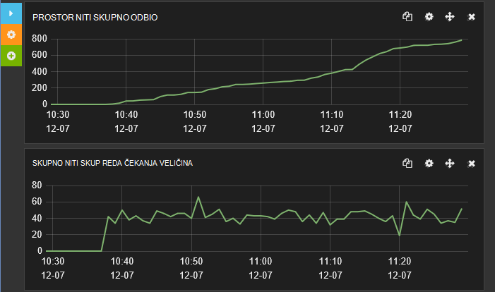

<properties
   pageTitle="Ugađanje performansi ingestion podataka za Elasticsearch na Azure | Microsoft Azure"
   description="Kako se poboljšajte performanse ingestion podataka s Elasticsearch na Azure."
   services=""
   documentationCenter="na"
   authors="dragon119"
   manager="bennage"
   editor=""
   tags=""/>

<tags
   ms.service="guidance"
   ms.devlang="na"
   ms.topic="article"
   ms.tgt_pltfrm="na"
   ms.workload="na"
   ms.date="09/22/2016"
   ms.author="masashin"/>

# <a name="tuning-data-ingestion-performance-for-elasticsearch-on-azure"></a>Ugađanju performansi ingestion podataka za Elasticsearch na Azure

[AZURE.INCLUDE [pnp-header](../../includes/guidance-pnp-header-include.md)]

Ovaj je članak [dio niza](guidance-elasticsearch.md). 

## <a name="overview"></a>Pregled

Važne aspekte prilikom stvaranja sve baza podataka za pretraživanje je odrediti najbolji način za strukturiranje sustav ingest pretraživanja podataka brzo i učinkovito. Razmatranja oko taj zahtjev tiču ne samo odabir infrastrukture na kojem je implementirati sustav, ali i razne optimizacije koje možete koristiti da biste bili sigurni da sustav možete pratiti očekivani razine influx podataka. 

Ovaj dokument opisuju mogućnosti implementaciji i konfiguraciji koja treba imati na umu za implementaciju sustava Elasticsearch klaster koje očekuje visoke rata ingestion podataka. Pružanje pune podataka opisne svrhe, ovaj dokument prikazuje rezultate benchmarking različitih konfiguracija pomoću radno opterećenje ingestion jednostavne podatke koji visoku glasnoću. Detalje o povećavaju opisana su u [dodatak](#appendix-the-bulk-load-data-ingestion-performance-test) pri kraju ovog dokumenta.

Svrha na jednonitnih je ne da biste generirali apsolutne performanse slika za pokretanje Elasticsearch ili čak i preporučujemo da određene topologije, ali umjesto da biste ilustrirali metode koje možete koristiti za assessing performanse, čvorove podataka za promjenu veličine i implementaciju klastere koje možete odgovaraju potrebama performanse. 

Kada vlastite sustavi za promjenu veličine, važno je da biste testirali performanse temeljito na temelju vlastite radnih opterećenja. Prikupite telemetrijskih koji omogućuje vam da biste dobili informacije o konfiguraciji optimalnih hardvera da biste koristili i vodoravnog skaliranja čimbenici koji razmotrite. Točnije, trebali biste:

- Razmislite o cjelokupne veličine opseg šalju, a ne samo broj stavki u svaki zahtjev za umetanje skupno. Manji broj velike skupno stavke u svaki zahtjev može biti više optimalnih od većeg broja, ovisno o resurs koji je dostupan da obradi svaki zahtjev za potvrdu.

Možete nadzirati efekata promjenjivih zahtjev za umetanje skupno pomoću [Marvel](https://www.elastic.co/products/marvel), pomoću *readbytes*/*/writebytes* i mjerača s [JMeter](https://jmeter.apache.org/)te operacijski sustav alate kao što su *iostat* i *vmstat* na Ubuntu. 

- Vođenje testiranje performanse i prikupite telemetrijskih obrada mjere procesora i/i vrijeme čekanja, Latencija disk, propusnost i vremena za odgovor. Ove informacije može pridonijeti prepoznavanje potencijalne grla i procijenite troškove i prednosti korištenja premium prostora za pohranu. Nose na umu da upotreba procesora i disk možda neće biti čak i u sve čvorove ovisno o tome kako u shards i replike koje su raspodijeliti klaster (neke čvorove može sadržavati više shards od ostalih).

- Razmislite o kako broj istovremeni zahtjevi za svoje radno opterećenje će raspodijeliti klaster i procijenite utjecaj korištenja različiti broj čvorove učiniti ovog posla.

- Razmislite o kako možda Povećaj radnih opterećenja kao proširuje tvrtke. Procijenite utjecaj growth na troškove VMs i pohranu koriste čvorove.

- Prepoznaje da koristite klaster s većim brojem čvorove s pravilnim diskova možda više najekonomičniji ako scenariju zahtijeva velik broj zahtjeva i infrastrukture disk održava propusnost koji zadovoljava vaše servisa razine (SLA). Međutim, povećava broj čvorove može uzrokovati indirektni u obliku dodatne komunikacije među čvor i sinkronizacije.

- Razumijevanje veći broj jezgri po čvor može generirati više promet na disku tijekom obrade više dokumenata. U ovom slučaju Izmjerite disk Upotreba ocijeniti li podsustavu/i možda će biti usko grlo i odrediti prednosti korištenja premium prostor za pohranu.

- Testirajte i analizirati na gubitke s većim brojem čvorove s manje jezgri nasuprot manje čvorove s više jezgri. Imajte na umu da povećanje broja replike pretvara zahtjeva na klaster te može biti potrebno da biste dodali čvorove.

- Preporučujemo da pomoću efemerni diskova možda će biti potrebno da morate indeksi češće oporaviti.

- Korištenje jedinica mjere za pohranu ocijeniti kapaciteta i u odjeljku Upotreba prostora za pohranu. Ako, na primjer, u našem scenariju smo pohranjuju 1,5 milijarde dokumenata pomoću 350GB prostora za pohranu.

- Izmjerite prijenosom datoteka za vaše radnih opterećenja, a zatim razmislite o koliki je vjerojatnost da biste dobili Ukupno/i stopa prijenos ograničenje za svaki račun zadani prostor za pohranu u koju ste stvorili virtualne diskova.

## <a name="node-and-index-design"></a>Dizajn čvora i indeksa

U sustavu mora podržavati ingestion veliki podataka, zamolite na sljedeća pitanja:

- **Ti podaci brzo premještanja ili relativno statične?** Više dinamične podatke, na veći održavanja indirektni za Elasticsearch. Ako je replicirati podatke, svaki replike se održava sinkronizirano. Brzo premještanje podataka koja sadrži samo na ograničeno vrijeme upotrebljivosti ili koji se jednostavno rekonstruirana mogu koristiti potpuno onemogućivanje replikacije. Ta mogućnost opisan u odjeljku [Usklađivanje veliki podataka ingestion.](#tuning-large-scale-data-ingestion)

- **Kako ažuran učinite tražite podatke pronađu pretraživanjem biti?** Da biste zadržali performanse, Elasticsearch buffers koliko podataka u memoriji kao može. To znači da nije sve promjene odmah dostupan za zahtjeva za pretraživanje. Postupak Elasticsearch koristi održati promjene i neka bude vidljivo je opisano u [Upućivanje stalni promjene](https://www.elastic.co/guide/en/elasticsearch/guide/current/translog.html#translog). 

    Stopa Podaci postaju vidljivi uređena u *Osvježavanje\_interval* postavljanje odgovarajuće indeksa. Prema zadanim postavkama, taj interval je postavljen na 1 sekunde. Nije svaka situacije zauzima osvježavanja to brzo pojavljivati. Ako, na primjer, indeksi podaci iz zapisnika za snimanje možda morati cope s brz i neprekinutog influx informacije o koje treba brzo ingested, ali ne zahtijeva informacije biti odmah dostupna za slanje upita. U ovom slučaju, razmislite o smanjivanju učestalost osvježavanja. Ta značajka i opisane u odjeljku [Usklađivanje veliki podataka ingestion.](#tuning-large-scale-data-ingestion)

- **Koliko će se brzo je vjerojatno radi povećanja podataka?** Indeks kapaciteta određen broj shards navedeni stvaranja indeksa. Da biste dopustili rasta, navedite odgovarajuće broj shards (zadano je pet). Ako indeks prethodno stvorili na jedan čvor, sve pet shards će se nalaziti na tom čvor, ali kao količinu podataka rastom dodatne čvorove možete dodati i Elasticsearch će dinamički raspodijelite shards čvorove. No svaki shard ima programa indirektni. Sva pretraživanja u indeks će upit sve shards pa Stvaranje velikog broja shards za malu količinu podataka može usporiti retrievals podataka (izbjegli scenarij [Kagillion shards](https://www.elastic.co/guide/en/elasticsearch/guide/current/kagillion-shards.html) ).

    Neke radnih opterećenja (kao što su zapisivanje) mogli biste stvoriti novi indeks svakog dana, a ako primijetite da je broj shards zadovoljava količinu podataka, trebali biste ga promijenite prije stvaranja sljedeći indeksa (postojeće indekse neće imati utjecaja). Ako postojeće podatke morate raspodijelite više shards, zatim jednu mogućnost je ponovno indeksirati podatke. Stvorite novi indeks u konfiguraciji odgovarajuće i kopirajte podatke u nju. Taj postupak može biti proziran aplikacijama pomoću [pseudonima indeksa](https://www.elastic.co/guide/en/elasticsearch/reference/current/indices-aliases.html).

- **Podataka mora biti particije između korisnika u scenariju s multitenancy?** Možete stvoriti zaseban indekse za svakog korisnika, ali to može biti skupi ako svaki korisnik ima samo srednju količinu podataka. Umjesto toga, razmislite o stvaranju [zajedničkog indekse](https://www.elastic.co/guide/en/elasticsearch/guide/current/shared-index.html) i pomoću [pseudonima na temelju filtara](https://www.elastic.co/guide/en/elasticsearch/guide/current/faking-it.html) usmjerite zahtjevi za podataka po korisniku. Da bi podaci za korisnika zajedno u istom shard, zamijeniti zadanu usmjeravanje konfiguraciju za indeks i usmjeravanje podataka na temelju ispunjavaju određene identifikacijski korisnika.

- **Se podaci dugi ili short-lived?** Ako koristite skup Azure VMs za implementaciju sustava Elasticsearch klaster, možete spremiti efemerni podataka na disku lokalnog resursa sustava umjesto priložene pogon.
Pomoću VM SKU koji se koristi u SSD za disk resursa možete poboljšati performanse/i. Međutim, ostaju na disku resursa podatke privremeni i mogu se izgubiti ako na VM pokreće (u odjeljku kada će podatke na privremene pogon biti izgubljene za [Razumijevanje privremene pogon na Microsoft Azure virtualnim strojevima](http://blogs.msdn.com/b/mast/archive/2013/12/07/understanding-the-temporary-drive-on-windows-azure-virtual-machines.aspx) više pojedinosti). Ako morate zadržati podataka između ponovnog pokretanja, stvorite diskova podataka držite ove informacije i priložite u VM.

- **Kako aktivni su podaci?** Azure VHDs podliježe ograničavanje ako količinu aktivnosti za čitanje/pisanje premašuje navedeni parametri (trenutno 500 ulaza i izlaza operacije sekundi (IOPS) na disku dodana standardne VM sloju i 5000 IOPS za pohranu Premium disk). 

    Da biste smanjili mogućnost ograničavanje i poboljšati performanse/i, razmislite o stvaranju više diskova podatke za svaku VM i konfiguriranje Elasticsearch pruga podataka preko tih diskova kao što je opisano [na disku i datoteku sistemske preduvjete](guidance-elasticsearch-running-on-azure.md#disk-and-file-system-requirements).

    Odaberite hardverske konfiguracije koji olakšava da biste minimizirali broj diska/i operacija čitanja ako osigurate dovoljno memorije dostupna predmemorije često pristupiti podacima. To je opisano u odjeljku [preduvjeti memorije](guidance-elasticsearch-running-on-azure.md#memory-requirements) radi Elasticsearch na Azure.

- **Koje vrste radno opterećenje svaki čvor morat ćete podržava?** Elasticsearch koristi onemogućite memorije s podacima predmemorije (u obrazac predmemoriju sustava datoteka) i skupova JVM kao što je opisano u odjeljku [preduvjeti memorije](guidance-elasticsearch-running-on-azure.md#memory-requirements) radi Elasticsearch na Azure. 

    Količinu memorije broj jezgri procesora i količinu diskova dostupna je postavio SKU virtualnog računala. Dodatne informacije potražite u članku [Virtualnim strojevima cijene](http://azure.microsoft.com/pricing/details/virtual-machines/) Azure web-mjesta.

### <a name="virtual-machine-options"></a>Mogućnosti virtualnog računala

Možete Dodjela VMs u Azure pomoću nekoliko različitih SKU-ove. Dostupna je VM Azure resursi ovise o SKU odabran. Svaki SKU nudi različite kombinacije jezgri, memorije i prostora za pohranu. Morate odaberite odgovarajuću veličinu VM koji će obrađivati očekivani radno opterećenje, ali koje se dokazuje učinkovit.
Početak s konfiguracijom koji će zadovoljavaju preduvjeti za trenutni (izvođenje benchmarking da biste testirali, kao što je opisano u nastavku ovog dokumenta). Klaster možete kasnije skaliranje dodavanjem više VMs radi Elasticsearch čvorove.

[Veličina za virtualnim strojevima](../virtual-machines/virtual-machines-linux-sizes.md) na web-mjestu Azure dokumenti različite mogućnosti i SKU-ove dostupne za VMs.

Veličina i resursima VM ulozi koja će izvoditi čvorove sustavom u VM moraju se podudarati.

Za čvor podataka:

- Dodijeliti do 30 GB ili 50% dostupna RAM memorije u Java heap, ovisno o tome što je donjoj. Ostavite ostatak operacijski sustav da biste koristili za predmemoriranje datoteke. Ako koristite Linux, možete odrediti količinu memorije želite dodijeliti skupova Java tako da postavite na ES\_SKUPOVA\_varijablu okruženja veličinu prije pokretanja Elasticsearch. Osim toga, ako koristite Windows ili Linux, možete stipulate memorije s parametrima *Xmx* i *Xms* prilikom pokretanja Elasticsearch.

    Ovisno o radno opterećenje, manje velike VMs možda neće biti stvarni, performanse kao što su korištenje veći broj umjereno veličine VMs. Trebali biste provesti testova koji mjere tradeoffs između dodatni mrežni promet i održavanje uvrštene nasuprot troškovi povećava broj jezgri dostupne i Nadmetanje smanjene disk na svakom čvor.

- Korištenje premium prostora za pohranu za spremanje Elasticsearch podataka. To se spominju u više detalja u odjeljku [Mogućnosti pohrane](#storage-options) .

- Korištenje više diskova iste veličine i pruga podatke na svim tih diskova. SKU vaše VMs određuje najveći je broj diskova podataka koje možete priložiti. Dodatne informacije potražite u članku [sistemski preduvjeti za Disk i datoteke](guidance-elasticsearch-running-on-azure.md#disk-and-file-system-requirements).

- Koristite SKU procesora više core s najmanje 2 jezgri kapaciteta 4 ili više. 

Za klijent čvor:

- Dodijeliti prostora za pohranu na disku za Elasticsearch podatke, namjenski klijenti pohrane podataka na disku.

- Provjerite je li dovoljno memorije dostupne za rukovanje radnih opterećenja. Zahtjevi za umetanje skupno su za čitanje u memoriju prije podataka koji se šalje na razne čvorove podataka, a rezultate zbrajanja i upitima akumuliraju u memoriji prije nego što se vraćaju klijentske aplikacije. Benchmark vlastite radnih opterećenja i nadzirati korištenje memorije pomoću alata kao što su Marvel ili [JVM informacije](https://www.elastic.co/guide/en/elasticsearch/guide/current/_monitoring_individual_nodes.html#_jvm_section) vraća pomoću *čvor/stat* API-JA (`GET _nodes/stats`) da biste procijenite optimalnih preduvjeti.  Posebno praćenje u *skupova\_koristi\_posto* mjerenja za svaki čvor i ciljem da biste zadržali veličinu skupova ispod 75% dostupnog prostora.

- Provjerite jesu li dovoljno jezgri procesora moći primati i obrada glasnoće očekivani zahtjeva za li.
Zahtjevi za u redu čekanja primitku prije no što obrada i glasnoću stavki koje možete u redu čekanja je funkcija broja procesora jezgri na svakom čvor. Možete nadzirati duljine reda čekanja pomoću podataka [Threadpool informacije](https://www.elastic.co/guide/en/elasticsearch/guide/current/_monitoring_individual_nodes.html#_threadpool_section) vraća pomoću čvor/stat API-JA. 

    Ako broj *odbijena* na red upućuje su se odbio zahtjeva, označava početak klaster usko grlo. To možda je došlo do propusnosti procesora, ali može biti zbog Ostali čimbenici kao što je Nedostatak memorije ili sporo/i, pa ti podaci zajedno s ostalih statističkih podataka da biste odredili uzrok.

    Čvorovi klijent možda ili možda neće biti potrebno, ovisno o vašem radnih opterećenja. Radnih opterećenja ingestion podataka obično ne prednosti korištenja namjenski klijenata, dok neki pretraživanja i agregacije pokretati brže. Budite spremni na benchmark vlastite scenarijima.

    Klijent čvorove prvenstveno korisne su za aplikacije koje koriste prijenosa klijent API-JA za povezivanje s klaster. Možete koristiti i API klijent čvor, čime se dinamički namjenski klijent za aplikaciju, koristi resurse okruženja glavnog računala. Ako aplikacija koristite klijent API čvor, zatim je možda neće biti potrebni za svoj klaster sadrži čvorove konfiguriranog namjenski klijenta. 
    
    Međutim, imajte na umu da čvor stvoren pomoću čvor API klijent jednostavno prva liga član klaster i kao sudjeluje u chatter mreže s ostale čvorove. Često pokretanje i zaustavljanje čvorove klijenta možete stvoriti nepotrebne Šum preko čitava grupa.

Za osnovne čvor:

- Dodijeliti prostora za pohranu na disku za Elasticsearch podatke, namjenski osnovne čvorove pohrane podataka na disku.

- Preduvjeti za procesora mora biti najmanje.

- Preduvjeti za memorije ovisi o veličini klaster. Podaci o stanju Klaster se zadržavaju u memoriji. Mali klastere memorija potreban je minimalna, ali za veliki, Visoko aktivni klaster gdje indeksi se stvaraju često i shards kretanje, količinu informacije o stanju može rasti znatno. Praćenje veličina skupova JVM da biste odredili treba li vam da biste dodali više memorije.

> [AZURE.NOTE]Pouzdanost klaster uvijek stvorili više osnovne čvorove da biste i konfiguriranje preostale čvorove da biste izbjegli nastanka pojavljivanja na početnog Podijeli. Najbolje treba neparan broj osnovne čvorove. U ovoj se temi je podrobnije opisan u [Konfiguriranje resilience][]i oporavak na Elasticsearch na Azure.

### <a name="storage-options"></a>Mogućnosti pohrane

Nema više mogućnosti pohrane dostupnih na VMs Azure s različitim gubitke utjecaja cijena; performanse, dostupnost i oporavak koje treba uzeti u obzir pažljivo.

Imajte na umu da će pohranjivati Elasticsearch podataka na diskova namjenski podataka.  To će pomoći smanjiti Nadmetanje s operacijskim sustavom i bili sigurni da velike količine/Elasticsearch i ne ometati funkcija operacijskog sustava za/i resurse.

Azure diskova podliježe ograničenih performansi. Ako pronađete klaster prolazi kroz periodičku bursts aktivnosti pa/i zahtjevi za može biti ograničio vrijeme. Da biste spriječili to, podesite dizajn da biste saldo veličina dokumenta u Elasticsearch protiv količinu zahtjeve, vjerojatno ga primila svakom disku.

Standardni prostora za pohranu na temelju podržavaju zahtjev za Maksimalna brzina od 500 IOPS dok diskova premium prostora za pohranu na temelju rade do 5000 IOPS, ovisno o veličini diskova podataka. Premium pohranu diskova su dostupne samo za seriju VMs DS i Oznaka. Maksimalna disk IOPS po veličini VM potražite [veličine za virtualnim strojevima u Azure](../virtual-machines/virtual-machines-linux-sizes.md). Performanse premium pohrane ovisi o veličina VM zajedno s diska veličina dodijeljeni. Dodatne informacije potražite u članku [prostora za pohranu Premium: visokih performansi prostor za pohranu radnih opterećenja virtualnog računala Azure](../storage/storage-premium-storage.md).

**Stalni podataka diskova**

Stalni podataka diskova su VHDs koje se sigurnosno po Azure prostor za pohranu. Ako na VM mora se ponovno stvoriti nakon neuspješne glavna, postojeće VHDs mogu jednostavno priložiti novi VM. VHDs moguće stvoriti na temelju standardne prostora za pohranu (koji se vrti media) ili premium prostora za pohranu (SSDs). Ako želite koristiti SSDs, morate stvoriti VMs pomoću niza DS ili bolje. DS strojeva trošak jednaki ekvivalentan VMs D niz, ali se naplaćuju vrlo za korištenje premium prostora za pohranu.

U slučajevima gdje je dovoljno za podršku očekivani radno opterećenje brzinu Maksimalna prijenosa po disk, razmislite o svakom stvaranju više diskova podataka i dopustite Elasticsearch [pruga podataka preko tih diskova](guidance-elasticsearch-running-on-azure.md#disk-and-file-system-requirements)ili implementirati razinu sustava [Podjela RAID 0 pomoću virtualne diskova](../virtual-machines/virtual-machines-linux-configure-raid.md).

> [AZURE.NOTE]Prikazano RAID 0 je osobito korisni za izglađivanje out/i efekata sučelje unutar Microsoft *spiky* radnih opterećenja koji stvaraju Česti bursts aktivnosti.

Korištenje premium lokalno suvišnih (ili lokalno suvišnih za low-end ili radnih opterećenja značajke pitanja i odgovora) za pohranu za račun za pohranu držanjem diskova; replikaciju preko geographies i zonama nije potrebna za Elasticsearch visoke dostupnosti. 

**Efemerni diskova**

Pomoću stalni diskova na temelju SSDs zahtijeva stvaranje VMs koji podržavaju pohranu premium. To je cijena patentnim. Korištenje lokalni disk efemerni veličini Elasticsearch podataka može biti troškova učinkovitih rješenja za umjereno veličine čvorove potrebno do približno 800 GB prostora za pohranu. Standardna D niz VMs su efemerni diskova implementirati pomoću SSDs koji omogućuju znatno veću performanse i koliko donjem latencije od običnih diskova

Prilikom korištenja Elasticsearch, performanse mogu biti jednake korištenje prostora za pohranu premium bez povećavanja trošak – potražite u odjeljku [adresiranja na probleme s diskom Latencija](#addressing-disk-latency-issues) dodatne informacije.

Veličina u VM ograničenjima količinu prostora efemerni pohrane u kao što je opisano u unosu u blog [Očekivanja performanse D niz](https://azure.microsoft.com/blog/d-series-performance-expectations/).

Primjerice, standardno\_D1 VM nudi 50GB prostora za pohranu efemerni, Standard\_D2 VM sadrži 100GB prostora za pohranu na efemerni i Standard\_D14 VM nudi 800GB prostora na efemerni. Za klastere koje čvorove samo zahtijeva ovo količinu prostora, D niz VM pomoću efemerni prostora za pohranu mogu biti stvarni trošak.

Morate uskladiti veću propusnost dostupno u sklopu efemerni prostora za pohranu na temelju vremena i troškove uvrštene u oporaviti podatke kada ponovno pokrenite računalo. Sadržaj efemerni diska izgubit će se ako se na VM Premjesti u drugi poslužitelj, ako se ažurira na glavno računalo ili na računalo koje hostira iskustvo kvara hardvera. Ako podaci sam imaju ograničeni vrijeme upotrebljivosti ovaj gubitka podataka može biti tolerable. Za longer-lived podataka, možda ćete moći ponovno stvaranje indeksa ili oporavak podataka koji nedostaju iz sigurnosne kopije. Moguće je da biste minimizirali potencijal gubitka pomoću replike ostaju na druge VMs.

> [AZURE.NOTE]Nemojte koristiti **jedan** VM veličini ključnih radnog podataka. Ako čvor ne uspije, svi podaci nije dostupna. Ključne informacije biti sigurni da su podaci replicirati na barem jedan čvor.

**Azure datoteke**

[Servis za Azure datoteka](http://blogs.msdn.com/b/windowsazurestorage/archive/2014/05/12/introducing-microsoft-azure-file-service.aspx) omogućuje pristupa zajedničku datoteku pomoću Azure prostora za pohranu. Možete stvoriti zajedničke datoteke koju zatim možete postaviti na Azure VMs. Više VMs možete dostupnosti isti zajedničko korištenje datoteka, što im pristupiti s istim podacima.

Radi boljih performansi ne preporučuje se da koristite zajedničke datoteke za čuvanje podataka Elasticsearch koje morate zajednički koristiti s čvorove, diskova uobičajeni podaci su više prikladniji u tu svrhu. Zajedničke datoteke može se koristiti za stvaranje Elasticsearch [sjene replike indeksi](https://www.elastic.co/guide/en/elasticsearch/reference/current/indices-shadow-replicas.html). Međutim, ta je značajka trenutno eksperimentalne i ne implementiraju u okruženju proizvodnje trenutno. Zbog toga, sjena indeksi ne uzimaju daljnje u ovom uputama.

**Mogućnosti za mrežu**

Azure implementira zajedničke mrežne shemu. VMs korištenja isti hardver nosači za se natječu za mrežni resursi. Stoga dostupna propusnost mreže može se razlikovati ovisno o doba dana i na dnevnu ciklusa rada koji se izvode na VMs zajedničko korištenje iste fizičke mrežne infrastrukture. Imate mali kontrolu nad sljedećih čimbenika. Je važno je znati da je vjerojatno mijenjaju tijekom vremena, stoga sukladno tome postaviti očekivanja korisnika vezana uz performanse mreže.

## <a name="scaling-up-nodes-to-support-large-scale-data-ingestion"></a>Promjena veličine gore čvorove za podršku ingestion veliki podataka

Sastavljanje Elasticsearch klastere pomoću razumno moderiranje hardver i zatim proširenja ili skalirali izgleda kao rastom količinu podataka te daju veći broj zahtjeva. S Azure, koje skaliranje kopirane pokretanjem većih i više skupi VMs ili koje možete skaliranje iz pomoću dodatnih manje i jeftinijim VMs. 

Može izvršiti i kombinacije oba strategije. Postoji bez one-size-fits-all rješenja za sve scenarije, tako da bi mu se najbolji način za sve navedene situaciju, morate biti pripremljeni Izrada niz performanse testira.

U ovom se odjeljku se bavi pristup skaliranje gore, skaliranja izlaz opisan u odjeljku [skaliranja odgovor: zaključaka](#scaling-out-conclusions).
U ovom se odjeljku opisuju rezultate niz jednonitnih koji su izvesti uspoređuje sa skupom Elasticsearch klastere koje sadrže VMs različitim veličinama. Skupina su onu koja je označena kao mali, Srednje i velike. U sljedećoj su tablici navedene resurse dodijeliti VMs u svakom klaster.

| Klaster | VM SKU      | Broj jezgri | Broj diskova podataka | RAM-A  |
|---------|-------------|-----------------|----------------------|------|
| Small   | Standardni D2 | 2               | 4                    | 7GB  |
| Srednje  | Standardni D3 | 4               | 8                    | 14GB |
| Veliki   | Standardni D4 | 8               | 16                   | 28GB |

Svaki Elasticsearch klaster sadržavao 3 čvorove podataka. Čvorovi tih podataka rukovanja zahtjeva za klijenta, kao i obrada podataka za rukovanje. Čvorovi zasebnom klijent nisu korišteni jer oni nudi mnogo koristi za scenarij ingestion podataka koji koriste testove. Klaster sadržavala i tri osnovne čvorove, od kojih je odabrali, Elasticsearch koordiniranje klaster.

Testova su izvršiti pomoću Elasticsearch 1.7.3. Testova su prethodno izvršiti na klastere pokrenut Ubuntu Linux 14.0.4 i ponavljaju pomoću Windows Server 2012. Detalje o radno opterećenje obavlja testova opisana su u [dodatak](#appendix-the-bulk-load-data-ingestion-performance-test).

### <a name="data-ingestion-performance--ubuntu-linux-1404"></a>Performanse ingestion podataka – Ubuntu Linux 14.0.4

U sljedećoj su tablici navedene cjelokupan rezultate izvršenja testira dva sata za svaki konfiguraciju:

| Konfiguracija | Ogledna count | Prosječna reakcija (ms) | Propusnost (operacije na s) |
|---------------|--------------|----------------------------|---------------------------|
| Small         | 67057        | 636                        | 9,3                       |
| Srednje        | 123482       | 692                        | 17.2                      |
| Veliki         | 197085       | 839                        | 27.4                      |

Propusnost i broj uzoraka obrađuju za tri konfiguracije su u djelomičnog omjer 1:2:3. Međutim, dostupne memorije, jezgri procesora i diskova resursi imati omjer 1:2:4. Pogađa je biti vrijedi istražuje detalje najniže razine performanse čvorove u skupini ocijeniti Zašto se to može biti slučaj. U ovom se informacije mogu pomoći da biste utvrdili postoje li ograničenja za skaliranje prema gore i možda je bolji treba uzeti u obzir skaliranje izgleda. 

### <a name="determining-limiting-factors-network-utilization"></a>Određivanje ograničavanjem čimbenike: mreže Upotreba

Elasticsearch ovisi o imate li dovoljno propusnost mreže za podršku influx zahtjevi klijenta, kao i informacije o sinkronizaciji koji se piše između čvorovi u klasteru. Kao Istaknuto ranije, umanjenom sposobnosti kontrolu nad dostupnost propusnosti, a to ovisi o raznim čimbenicima kao što je s podatkovnim centrom koristi i trenutno opterećenje mreže druge VMs isti mrežne infrastrukture za zajedničko korištenje. Međutim, ga vrijedi i dalje Provjera aktivnost mreže za svaki klaster da biste provjerili nije li količinu promet viškom. Grafikon sustava prikazuje usporedbu mrežni promet primio čvor 2 u svakoj od klastere (količine za ostale čvorove svaki klaster je slično).


Prosječna bajtova primljenih u sekundi za čvor 2 u svakom klaster konfiguraciji tijekom razdoblja dva sata su na sljedeći način:

| Konfiguracija | Prosječan broj bajtova/sec |
|---------------|--------------------------------------|
| Small         | 3993640.3                            |
| Srednje        | 7311689.9                            |
| Veliki         | 11893874.2                           |

Testova su obavljaju dok je sustav izvodi u **steady stanju**. U slučajevima gdje indeksirati rebalancing ili oporavak čvor u tijeku, prijenos podataka između čvorove držanjem primarnog i replike shards moguće je generirati značajan mrežni promet. Efekti postupak više su opisane u dokumentu [Konfiguriranje resilience i oporavak na Elasticsearch na Azure][].

### <a name="determining-limiting-factors-cpu-utilization"></a>Određivanje ograničavanje čimbenike: procesora

Stopa rukuje zahtjeva za barem djelomično uređena kapaciteta dostupna obrada. Elasticsearch prihvaća skupno zahtjevi za umetanje na skupno Umetanje red. Svaki čvor ima skup masovno Umetanje redova određen broj procesora koji se dostupna. Prema zadanim postavkama, postoji jedan red za svaki procesor i svakom redu čekanja mogu sadržavati do 50 preostala zahtjeva prije nego što će se pokrenuti da biste je odbijena. 

Aplikacija pošalje zahtjeve brzinom koji uzrokuju reda čekanja za overspill. Broj stavki u svakom redu čekanja u bilo kojem trenutku će biti funkciju Brzina kojom zahtjeva je poslao klijentske aplikacije i brzina kojom dohvaćeni i obradili Elasticsearch te iste zahtjeve. Zbog toga jedan važne statistike zabilježene opasnosti stopu pogreške sažeta u tablici u nastavku.

| Konfiguracija | Ukupna uzorka | Broj pogreške  | Stopa pogrešaka |
|---------------|---------------|--------------|------------|
| Small         | 67057         | 0            | 0,00%      |
| Srednje        | 123483        | 1            | 0.0008%    |
| Veliki         | 200702        | 3617         | 1.8%      |

Svaki od tih pogrešaka je uzrok sljedeću iznimku Java:

```
org.elasticsearch.action.support.replication.TransportShardReplicationOperationAction$PrimaryPhase$1@75a30c1b]; ]
[219]: index [systembase], type [logs], id [AVEAioKb2TRSNcPa_8YG], message [RemoteTransportException[[esdatavm2][inet[/10.0.1.5:9300]][indices:data/write/bulk[s]]]; nested: EsRejectedExecutionException[rejected execution (queue capacity 50)
```

Povećava broj redovima i/ili duljinu svakom redu čekanja mogu smanjiti broj pogreške, no taj se način možete samo cope s bursts kratki trajanje. Na taj način prilikom pokretanja osigurale trajne niz podataka ingestion zadatke jednostavno odgađanje točke u kojoj se pogreške počele koje su se pojavile. Osim toga, ta promjena će poboljšati propusnost i vjerojatno ugroziti vremenom odaziva u klijentskim aplikacijama kao što je zahtjevi će se u redu čekanja za više prije obrade.

Struktura indeks zadani 5 shards s rezultatima (10 shards u svim), 1 replike u modest neravnoteži u učitavanja između čvorove klasteru, dva čvorove će sadržavati tri shards dok drugi čvor će sadržavati četiri. Busiest čvor je najvjerojatnije stavke koje se najčešće ograničava propusnost koja se nalazi zašto je odabran čvor u svakom slučaju. 

Sljedeći skup grafikoni prikazuju procesora za busiest čvor u svakom klaster.


Za male, Srednje i velike klastere, Prosječno procesora za ove čvorove je 75.01% 64.93%. i 64.64%. Rijetko ne Upotreba zapravo klik na 100%, a Upotreba izostavlja kao veličine čvorove i na dostupne procesora power dostupna povećava. Stoga je vjerojatno neće biti faktor ograničavanje performanse velikih klaster power procesora.

### <a name="determining-limiting-factors-memory"></a>Određivanje ograničavanje čimbenike: memorije

Korištenje memorije je drugi važne aspekte koji mogu utjecati na performanse. Za testova, Elasticsearch je dodijeliti 50% dostupnom memorijom. Ovo je ravnini s [navedenih preporuke](https://www.elastic.co/guide/en/elasticsearch/guide/current/heap-sizing.html#_give_half_your_memory_to_lucene). Testova su pokrenutom u JVM je nadzirati aktivnosti zbirke suvišno smeća (oznaka Nedostatak memorije skupova). U svakom slučaju, veličina skupa je stabilan i na JVM exhibited niskog smeća zbirke aktivnosti. Snimka zaslona koja se nalazi ispod prikazuje snimke Marvel, isticanje tipku JVM Statistika na kratko dok test je pokrenut na velike klaster.


***JVM memorije i smeća zbirke aktivnost velike klaster.***

### <a name="determining-limiting-factors-disk-io-rrates"></a>Određivanje ograničavanje čimbenike: rRates/i na disku

Preostali fizičke značajku na strani poslužitelja koji mogu ograničiti performanse su performanse diska podsustav/i. Grafikon sustava uspoređuje aktivnosti disk pomoću bajtova sastavljene za busiest čvorove u svakom klaster.

 

Sljedeća tablica prikazuje Prosječno bajtova napisali sekundi za čvor 2 u svakom klaster konfiguraciji tijekom razdoblja dva sata:

| Konfiguracija | Prosječan broj zapisan bajtova/sec |
|---------------|-------------------------------------|
| Small         | 25502361.94                         |
| Srednje        | 48856124.5                          |
| Veliki         | 88137675.46                         |

Količinu podataka napisali povećava broj zahtjeve obrađuje klaster, ali stope/i su unutar ograničenja prostora za pohranu na Azure (stvorena pomoću Azure prostora za pohranu možete podržavaju na osigurale trajne stope 10s 100s MB/s, ovisno o tome koristi standardni prikaz ili Premium prostora za pohranu). Provjera količinu vremena utrošenog na čekanje na disku/i pomaže u članku se objašnjava zašto je propusnost diska i ispod theoretical maksimum. Grafikoni i tablice u nastavku Prikaži te statistike za istu tri čvorove:

> [AZURE.NOTE]Vrijeme čekanja na disku mjeri se prateći postotak procesora vremena tijekom kojeg procesora koji se blokiraju čekanje/i operacije da biste dovršili.


| Konfiguracija | Prosječna disk Pričekajte vrijeme procesora (%) |
|---------------|--------------------------------|
| Small         | 21.04                          |
| Srednje        | 14.48                          |
| Veliki         | 15.84                          |

Ove podatke označava da je značajan proporcije procesora vremena (između gotovo 16% i 21%) utrošiti Čekanje na disku/i da biste dovršili. To je ograničavanje mogućnost Elasticsearch obradi zahtjeve i pohrane podataka.

Tijekom testa pokrenuli, velike klaster umetnuli više od **pet sto milijuna dokumenata**. Dopuštanje test da biste nastavili prikazivao da vrijeme čekanja povećati znatno kada baza podataka sadrži više od šest stotinu milijuna dokumenata. Razloga za takvo ponašanje nisu potpuno ne imaju, ali zbog disk Fragmentacija uzrokuje Latencija povećana disk. 

Povećavajući veličinu klaster preko više čvorove predlažemo da ćete efekata takvo ponašanje. U ekstremne slučajevima možda će biti potrebno defragmentirati disk koji se prikazuje viškom/i vremena. Međutim, defragmenting velike diska može potrajati dosta vremena (vjerojatno više od 48 sati za pogon VHD 2TB) i jednostavno ponovnog formatiranja pogon i dopuštanje Elasticsearch se može oporaviti podatke koji nedostaju iz replike shards može biti više učinkovit način.

### <a name="addressing-disk-latency-issues"></a>Adresiranje Latencija na probleme s diskom

Testova su prethodno izvršiti pomoću VMs konfiguriran pomoću standardnih diskova. Standardni disk temelje se na koji se vrti medijskih sadržaja, a kao rezultat podložni rotational Latencija i druge grla koje možete ograničiti/i stope. Azure i omogućuje pohranu premium u kojem su diskova stvoren pomoću uređaja SSD. Te uređaje imate bez rotational Latencija i kao rezultat mora sadržavati poboljšane/i brzine. 

U tablici u nastavku uspoređuju rezultate zamjenjuju standardni diskova premium diskova velike klasteru (standardni VMs D4 velike klasteru su zamijenjene standardni DS4 VMs; broj jezgri, memorije i diskova je na isti način u oba slučaja, samo razliku da se DS4 VMs koristi SSDs).

| Konfiguracija    | Ogledna count | Prosječna reakcija (ms) | Propusnost (operacije na s) |
|------------------|--------------|----------------------------|---------------------------|
| Veliki - Standard | 197085       | 839                        | 27.4                      |
| Veliki - Premium  | 255985       | 581                        | 35.6                      |

Vrijeme odaziva su primjetnog bolje rezultira mnogo bliže je prosječna propusnost za 4 x koji small klaster. To je više ravnini s dostupni na standardni DS4 VM resursi. Prosječna procesora na busiest čvor u skupini (čvor 1 u ovom slučaju) povećati kao što je utrošeno kraće čekanje/i da biste dovršili:


Smanjenje vrijeme čekanja disk postaje vidljivu kada razmotrite sljedeće grafikonu koji pokazuje da za busiest čvor ovaj statistike prekine oko % 1 u:


Postoji cijena platiti za tog poboljšanja. Broj pogreške ingestion povećati faktorom od 10 da biste 35797 (12.3%). Ponovno većinu tih pogrešaka su rezultat skupno Umetanje prelijevanja red. Given da hardver sada se čini da se izvodi blizu kapaciteta, možda će biti potrebno da biste dodali više čvorove ili da biste ponovno throttle rata skupno umeće da biste smanjili količinu pogreške. Te probleme se spominju kasnije u ovom dokumentu.

### <a name="testing-with-ephemeral-storage"></a>Testiranje s efemerni prostora za pohranu

Iste testove su ponavlja na klaster D4 VMs pomoću efemerni prostor za pohranu. Efemerni prostora za pohranu na D4 VMs se implementira kao jedan 400GB SSD. Broj uzoraka obrađuju, vrijeme odaziva i propusnost su sve slično je slika potrebnom za klaster na temelju DS14 VMs premium prostor za pohranu.

| Konfiguracija                     | Ogledna count | Prosječna reakcija (ms) | Propusnost (operacije na s) |
|-----------------------------------|--------------|----------------------------|---------------------------|
| Veliki - Premium                   | 255985       | 581                        | 35.6                      |
| LARGE – standardna (Efemerni disk) | 255626       | 585                        | 35.5                      |

Stopa pogrešaka i je slično (33862 pogrešaka iz 289488 zahtjeva za Ukupno – 11,7%).

Sljedeće grafikona prikazuju na procesora i disk Pričekajte Statistika za busiest čvor u skupini (čvor 2 ovaj put):


! [] (media/guidance-elasticsearch/data-ingestion-image13.png

U ovom slučaju samostalno rječnikom performanse, pomoću efemerni prostor za pohranu nije smatra se više učinkovit rješenje od korištenja premium prostora za pohranu.

### <a name="data-ingestion-performance--windows-server-2012"></a>Performanse ingestion podataka – Windows Server 2012

Iste testove su ponavljaju pomoću skupa Elasticsearch klastere čvorovi izvodi Windows Server 2012. Svrha ove testira je da biste odredili što efekata, ako postoje, odabir operacijski sustav možda imaju na performanse klaster.

Da biste ilustrirali skalabilnost Elasticsearch u sustavu Windows, Sljedeća tablica prikazuje propusnost i odgovora puta postići za male, Srednje i velike klaster konfiguracije. Imajte na umu da te testira su sve izvršavaju Elasticsearch konfiguriran za korištenje SSD efemerni prostora za pohranu, kao što je testova s Ubuntu imali prikazano je li na disku Latencija vjerojatno će biti ključnih faktor u postizanje maksimalne performanse:

| Konfiguracija | Ogledna count | Prosječna reakcija (ms) | Propusnost (operacije na s) |
|---------------|--------------|----------------------------|---------------------------|
| Small         | 90295        | 476                        | kao 12.5                      |
| Srednje        | 169243       | 508                        | 23.5                      |
| Veliki         | 257115       | 613                        | 35.6                      |

Ovi rezultati pokazuju kako mijenja veličinu Elasticsearch s veličina VM i dostupnih resursa u sustavu Windows.

U tablicama u nastavku uspoređuju rezultate za velike klaster na Ubuntu i Windows:

| Operacijski sustav | Ogledna count | Prosječna reakcija (ms) | Propusnost (operacije na s) | Pogreška stopa (%) |
|------------------|--------------|----------------------------|---------------------------|----------------|
| Ubuntu           | 255626       | 585                        | 35.5                      | 11,7           |
| Windows          | 257115       | 613                        | 35.6                      | 7,2            |

Propusnost je dosljedne s velikim klastere Ubuntu Premda je vrijeme odaziva malo iznad. To može biti bi za donjem brzinu pogreške (brže uspješno operacije prijavljenih pogrešaka, pa ste donjem reakcija).

Procesora prijavili pomoću alata za nadzor Windows nije marginally veća od Ubuntu. Međutim, trebali biste tretirati Izravni usporedbe mjere kao što su svim operacijskim sustavima s ekstremne Oprez način drugi operacijski sustavi izvješća te statistike. Uz to, informacije na disku Latencija pomoću procesora vremena utrošenog čekanje/i nije dostupna na isti način kao i za Ubuntu. Važno je da je procesora visoka, je koji označava koje vrijeme utrošeno na čekanju za/i niskog:


### <a name="scaling-up-conclusions"></a>Promjena veličine: zaključaka

Performanse Elasticsearch za dobro definirati klaster je vjerojatno će biti ekvivalent u sustavu Windows i Ubuntu i da ga ljestvice gore u uzorak slično kao i operacijskim sustavima. Za najbolje performanse, **koristite premium prostora za pohranu za čuvanje Elasticsearch podataka**.

## <a name="scaling-out-clusters-to-support-large-scale-data-ingestion"></a>Promjena veličine izgleda klastere za podršku ingestion veliki podataka

Promjena veličine izgleda je završnih pristup skaliranje imaju u prethodnom odjeljku. Bitna značajka Elasticsearch je ugrađeno vodoravni skalabilnost ugrađen u softver. Povećanje veličine klaster je jednostavno relevantnim dodavanja više čvorove. Ne morate izvršiti sve ručne operacije da biste ponovno Raspodijeli indeksa ili shards kao zadaci upravlja automatski, iako je broj konfiguracija mogućnosti dostupne da možete koristiti utjecati ovaj postupak. 

Dodavanje više čvorove omogućuje da biste poboljšali performanse širenjem opterećenje preko više strojeva. Prilikom dodavanja više čvorove, možda ćete morati razmislite o li podataka da biste povećali broj shards dostupna. Ovaj postupak da biste određenoj mjeri možete preempt stvaranjem indeksa koji imaju više shards od prethodno su dostupne čvorove. Dodatno je netko dodao čvorove na shards možete raspodijeliti.

Osim izvršava prednost vodoravni skalabilnost od Elasticsearch, postoje drugi razlozi za implementaciju indeksi koji imaju više shards od čvorove. Svaki shard je implementirana kao zasebne podatke strukture ( [Lucene](https://lucene.apache.org/) indeksa), a ima vlastiti interni mehanizme za održavanje dosljednosti i obrađuju istodobnosti. Stvaranje više shards pomaže da biste povećali parallelism unutar čvor web-mjesta i poboljšati performanse. 

Međutim, održavanje performanse dok skaliranje ujednačavanje act. Dodatne čvorove i shards sadrži klaster, za sinkronizaciju posla obavlja klaster možete smanjiti propusnost potreban je više truda. Za sve navedene radno opterećenje postoji optimalnih konfiguracije koji Maksimizira ingestion performanse dok minimiziranje indirektnih troškova održavanja. Tu konfiguraciju ovisi o intenzivnog prirode povećavaju i klaster; Konkretno, na glasnoća, veličine i sadržaja dokumenata, učestalost pojavljivanja ingestion i hardveru na kojem se izvodi u sustavu.  

U ovom se odjeljku ukratko se prikazuju rezultati istrage u klastere namijenjen za podršku radno opterećenje koristi testira performanse prethodno opisane za promjenu veličine. Isti test izvršena na klastere s VMs velike tekućeg VM veličina (standardni D4 s 8 jezgri procesora, diskova 16 podataka i 28GB RAM-a) na temelju Ubuntu Linux 14.0.4, ali konfiguriran s različiti broj čvorove i shards. Rezultati su namijenjen biti potpuni kao one se odnose samo na jedan scenarij u određenim, ali mogu poslužiti kao dobru početnu točku za analizu vodoravni skalabilnost od vašeg klastere, i generiranje brojeva za optimalne omjer shards za čvorove koje najbolje odgovaraju s vlastitim potrebama.

### <a name="baseline-results--3-nodes"></a>Osnovne rezultate – 3 čvorove

Da biste dobili osnovne slici, performanse test ingestion podataka pokretala protiv 3 čvor klaster s 5 shards i 1 replike. To je zadana za Elasticsearch indeksa. U ovoj konfiguraciji Elasticsearch distribuira 2 primarni shards 2 čvorove i preostale primarni shard pohranjuju se na treći čvor. U tablici u nastavku navedene su propusnost pomoću masovnog ingestion operacije sekundi i broj dokumenata koji su uspješno pohraniti test.

> [AZURE.NOTE] U tablicama na koje slijede u ovoj sekciji raspodjele primarni shards raspoređene su kao broj za svaki čvor odvojene crtice. Na primjer, 3 čvor izgleda 5 shard opisan je 2-2-1. Izgled shards replike nije uključen. Oni će slijediti shemu slično kao primarni shards.

| Konfiguracija | Broj dokumenata | Propusnost (operacije na s)   | Izgled shard |
|---------------|----------------|-----------------------------|--------------|
| 5 shards      | 200560412      | 27.86                       | 2-2-1        |

### <a name="6-node-results"></a>6 čvor rezultata

Test ponavlja se na 6 čvor klaster. Svrha ove testira je da biste pokušali provjerili preciznije efekata spremanje više od jedne shard na čvor.

| Konfiguracija | Broj dokumenata | Propusnost (operacije na s)   | Izgled shard |
|---------------|----------------|-----------------------------|--------------|
| 4 shards      | 227360412      | 31.58                       | 1-1-0-1-1-0  |
| 7 shards      | 268013252      | 37.22                       | 2-1-1-1-1-1  |
| 10 shards     | 258065854      | 35.84                       | 1-2-2-2-1-2  |
| 11 shards     | 279788157      | 38.86                       | 2-2-2-1-2-2  |
| 12 shards     | 257628504      | 35.78                       | 2-2-2-2-2-2  |
| 13 shards     | 300126822      | 41.68                       | 2-2-2-2-2-3  |

Ove rezultati će se pojaviti da biste naznačili trendova za sljedeće:

* Dodatne shards po čvor poboljšava propusnost. S malim brojem shards po čvor stvoriti za te testira ovaj phenomenon očekivao, razloga ranije.

* Neparan broj shards daje bolje performanse od paran broj. Razlozi *za ovu su manje Očisti, no možda algoritam usmjeravanja koja koristi Elasticsearch je li bolje moći raspodijelite podatke shards u tom slučaju oni mogu dovesti do više čak i učitavanje po čvor* .

Da biste testirali te hipotezu nekoliko daljnje Provjera su izvršiti s većim brojem shards. Na Savjet iz Elasticsearch ga je ipak za korištenje Primbroj shards za svaki test te daju pametnije distribucija neparnim brojevima u pitanju raspona.

| Konfiguracija | Broj dokumenata | Propusnost (operacije na s)   | Izgled shard      |
|---------------|----------------|-----------------------------|-------------------|
| 23 shards     | 312844185      | 43.45                       | 4-4-4-3-4-4       |
| 31 shards     | 309930777      | 43.05                       | 5-5-5-5-6-5       |
| 43 shards     | 316357076      | 43.94                       | 8-7-7-7-7-7       |
| 61 shards     | 305072556      | 42.37                       | 10-11-10-10-10-10 |
| 91 shards     | 291073519      | 40.43                       | 15-15-16-15-15-15 |
| 119 shards    | 273596325      | 38.00                       | 20-20-20-20-20-19 |

Te rezultate predloženih da tipping točke nije dostigao pri shards oko 23. Iza zareza, povećanje broja shards zbog small smanjene performanse performanse (propusnost za 43 shards je vjerojatno je značajkom).

### <a name="9-node-results"></a>Rezultati 9 čvor

Testova su ponavljaju pomoću Klaster od 9 čvorove ponovno korištenjem značajke prime broj shards.

| Konfiguracija | Broj dokumenata | Propusnost (operacije na s)   | Izgled shard               |
|---------------|----------------|-----------------------------|----------------------------|
| 17 shards     | 325165364      | 45.16                       | 2-2-2-2-2-2-2-2-1          |
| 19 shards     | 331272619      | 46.01                       | 2-2-2-2-2-2-2-2-3          |
| 29 shards     | 349682551      | 48.57                       | 3-3-3-4-3-3-3-4-3          |
| 37 shards     | 352764546      | 49.00                       | 4-4-4-4-4-4-4-4-5          |
| 47 shards     | 343684074      | 47.73                       | 5-5-5-6-5-5-5-6-5          |
| 89 shards     | 336248667      | 46.70                       | 10-10-10-10-10-10-10-10-9  |
| 181 shards    | 297919131      | 41.38                       | 20-20-20-20-20-20-20-20-21 |

Te rezultate prikazivao slične uzorak s tipping točkom oko 37 shards.

### <a name="scaling-out-conclusions"></a>Skaliranja izlaz: zaključaka

Pomoću Grube ekstrapolaciju rezultate testova 6 čvor i 9 čvor naznačio da, za taj scenarij određene idealna broj shards Maksimiziranje performanse je 4n +/-1, pri čemu je n broj čvorove. U ovom *možda* će biti funkcija broj masovno Umetanje niti dostupna, koji shodno ovisi o broju jezgri procesora rationale se na sljedeći način (pogledajte [Višestruki dokument uzoraka](https://www.elastic.co/guide/en/elasticsearch/guide/current/distrib-multi-doc.html#distrib-multi-doc) detalje):

- Svaki zahtjev za umetanje skupno poslao klijentska aplikacija je primio jedan podatkovni čvor.

- Čvor podataka stvara novi zahtjev za umetanje skupno za svaki primarni shard utječe izvorni zahtjev i prosljeđuje ostale čvorove, paralelno.

- Kao što je napisan svaki primarni shard drugi zahtjev šalje se svaki replike za tu shard. Primarni shard čeka zahtjev šalje replike da biste dovršili prije dovršetka.

Elasticsearch se prema zadanim postavkama stvara masovno Umetanje niti za svaki dostupna core procesora u VM. U slučaju VMs D4 koristi ovaj test, svaki CPU nalaze 8 jezgri, pa umetnite 8 skupno niti stvorene. Indeks koji se koristi rastezati 4 (u jednom slučaju 5) primarni shards na svakom čvor, ali su se pojavile i 4 (5) replike na svakom čvor. Umetanje podataka u tim shards i replike nije zauzimaju do 8 niti na svakom čvor po zahtjev, koji se podudaraju broj koji su dostupni. Povećavanje ili smanjivanje broja shards može uzrokovati usporedno izvršavanje zadataka neučinkovitosti niti ostaju vjerojatno slobodnih ili u redu čekanja zahtjeva. Međutim, bez daljnje početak to je samo teorija i nije moguće biti potpuni.

Testova prikazanom i jednu točku druge važne. U ovom scenariju povećanje broja čvorove možete poboljšati propusnost ingestion podataka, ali rezultate ne moraju nužno biti mjerilo Linearno. Provođenju testova daljnje s 12 i 15 čvor klastere prikazati točke na koji skaliranje izvan unosi malo dodatnu pogodnost. Ako taj broj čvorove nudi Nedovoljno prostora za pohranu, možda će biti potrebno vratite se na skaliranje gore strategije i početi koristiti više ili veća diskova premium prostora za pohranu na temelju.

> [AZURE.IMPORTANT] Kao uz formulu koja će se uvijek funkcionirati za svaku klaster uzimaju 4n proporcija +/-1. Ako imate manje ili više procesora jezgri dostupna, konfiguracije optimalnih shard mogu se razlikovati. Na findings temelje se na određene radno opterećenje koje samo jeste li ingestion podataka. Za radnih opterećenja koji obuhvaćaju upite i agregacije rezultate može biti vrlo raznih.

> Osim toga, radno opterećenje za ingestion podataka koristi se u jednom indeksa. U većini slučajeva podaci su vjerojatno će se dodijeliti većem više indeksi oni mogu dovesti do razne uzorke ili korištenja resursa.

> Važne točke ovu vježbu je razumjeti način umjesto dobili rezultate. Trebali biste pripremiti za izvođenje vlastite skalabilnost rizika koji se temelji na vlastitu radnih opterećenja da biste dobili informacije koje se najčešće odnosi se na vašem scenariju.

## <a name="tuning-large-scale-data-ingestion"></a>Usklađivanje ingestion veliki podataka

Elasticsearch je vrlo konfigurirati, s mnogo skretnice i postavke koje možete koristiti radi optimiziranja performansi za određene korištenje slučajeva i scenarijima. U ovom se odjeljku opisuju nekoliko uobičajenih primjera. Imajte na umu da fleksibilnosti u kojoj se navode Elasticsearch u ovom odnosu u sklopu upozorenje, vrlo je jednostavno detune Elasticsearch i lošiji donošenje performansi. Kada usklađivanje, samo napraviti promjena odjednom, a uvijek mjerenje učinke promjena da biste bili sigurni da se ne nalaze detrimental sa sustavom.

### <a name="optimizing-resources-for-indexing-operations"></a>Optimiziranje resursi za indeksiranje operacije

Sljedeći popis sadrži opis neke točke razmotrite kada ugađanje programa Elasticsearch klaster za podršku ingestion veliki podataka. Prve dvije stavke najčešće su odmah očite utjecaj na performanse dok su ostatak granične, ovisno o tome povećavaju:

*  Novi dokumenti koji su dodani u indeks samo postaju vidljivi pretraživanjima prilikom osvježavanja indeksa. Osvježavanje indeksa je operaciju skupi tako da ga je izvesti samo povremeno umjesto kao svaki dokument stvara se. Interval osvježavanja zadani je 1 sekunde. Ako još niste koristili masovne operacije, razmislite o privremeno onemogućiti osvježavanja indeksa. Postavljanje indeksa *Osvježavanje\_interval* -1.

    ```http
    PUT /my_busy_index
    {
        "settings" : {
            "refresh_interval": -1
        }
    }
    ```

    Ručno pokretanje osvježavanja pomoću u [* \_osvježavanje*](https://www.elastic.co/guide/en/elasticsearch/reference/current/indices-refresh.html) API na kraju postupka da bi bio vidljiv podatke. Dodatne informacije potražite u članku [Korištenje indeksiranje skupno](https://www.elastic.co/guide/en/elasticsearch/reference/current/indices-update-settings.html#bulk) . Dodatne informacije o [posljedice Promjena intervala osvježavanja na ingestion podataka](#the-impact-of-changing-the-index-refresh-interval-on-data-ingestion-performance) opisane su kasnije.

* Ako je replicirati indeksa, svaki radnju indeksiranja (dokument stvaranje, ažuriranje i brisanje) se ponavlja na shards replike onako kako se pojavljuju u primarni shard. Razmislite o onemogućivanje replikacije tijekom operacije uvoza skupno, a zatim ponovno omogućili je kada se uvoz dovrši:

    ```http
    PUT /my_busy_index
    {
        "settings" : {
            "number_of_replicas": 0
        }
    }
    ```

    Kada ponovno omogućili replikacije Elasticsearch izvodi bajt za bajt mreže prijenos podataka iz indeksa svaki replike. Ovo je učinkovitiji od ponavljanje indeksiranja postupka dokument tako da dokument na svakom čvor. Rizik je da podaci mogu biti izgubljene od ne uspije primarni čvor prilikom izvođenja Masovni uvoz, ali oporavak jednostavno možda pitanje ponovno pokretanje uvoz. [Utjecaj replikacije na performanse ingestion podataka](#the-impact-of-replicas-on-data-ingestion-performance) je podrobnije opisan u nastavku.

* Elasticsearch pokušava saldo dostupnih između onog koji je potreban za slanje upita i onog koji je potreban za ingesting podataka resursa. Zbog toga ga throttle podataka ingestion performansi (regulacije događaje zabilježene su u zapisniku Elasticsearch). Da biste spriječili velikog broja segmenata indeksa iz istodobno stvorili koje je potrebno spajanje i spremanje na disk, postupak koji možete monopolize resursi namijenjen je to ograničenje. Ako vaš sustav trenutno ne izvodi upite, možete onemogućiti ograničavanje ingestion podataka. To dopustite indeksiranje poboljšajte performanse. Možete onemogućiti ograničavanje za čitava grupa na sljedeći način:

    ```http
    PUT /_cluster/settings
    {
        "transient" : {
            "indices.store.throttle.type": "none"
        }
    }
    ```

    Vrsta ograničenja klaster ponovno postaviti *"Spajanje"* kada ingestion dovrši. Također imajte na umu da onemogućivanje ograničavanje mogu dovesti do nestabilnosti u skupini, pa bili sigurni da imate postupke na mjesto na kojem se možete vratiti skupine prema potrebi.

* Elasticsearch zadržava proporcije skupova memorije za indeksiranje operacije, ostatak najčešće koriste upita i pretraživanja. Svrha ove međuspremnika je da biste smanjili broj operacija/i diska, s ciljem izvođenje zapisivanja manje, veća od više, manje zapisivanja. Zadani proporcije skupova memorije je 10%. Ako su indeksiranje veliku količinu podataka tu vrijednost možda je dovoljno. Za sustave koji podržavaju visoku glasnoću podataka ingestion dopustite do 512MB memorije za svaku aktivni shard u čvor. Na primjer, ako su pokrenuti Elasticsearch na VMs D4 (28GB RAM-a), a dodijeljena 50% dostupnom memorijom JVM (14GB), zatim 1.4GB bit će dostupan za korištenje indeksiranjem operacije. Ako čvor sadrži 3 aktivni shards, zatim tu konfiguraciju je vjerojatno potrebne. Međutim, ako čvor sadrži više shards od ovog, razmislite o povećanju vrijednosti u *indices.memory.index\_međuspremnik\_veličina* parametar u konfiguracijskoj datoteci elasticsearch.yml. Dodatne informacije potražite u članku [Pitanja vezana uz performanse Elasticsearch indeksiranje](https://www.elastic.co/blog/performance-considerations-elasticsearch-indexing).

    Dodjeljivanje veća od 512MB po aktivni shard će najvjerojatnije nećete poboljšati performanse indeksiranja i zapravo može biti detrimental kao manje memorije dostupna je za izvođenje druge zadatke. Također imajte na umu da dodjeljivanje više skupova prostora za indeks međuspremnika uklanja memorije za ostalih operacija kao što su pretraživanje i Zbrajanje podataka i može se usporiti performanse operacije upita.

* Elasticsearch ograničava broj niti (Zadana vrijednost je 8), a koje možete istodobno izvršavanje operacija indeksiranja u na shard. Ako čvor sadrži samo mali broj shards, zatim razmislite o povećanju na *indeks\_istodobnosti* postavka za indeks koji podložni velik broj indeksiranje operacije ili cilj masovno Umetanje, na sljedeći način:

    ```http
    PUT /my_busy_index
    {
        "settings" : {
            "index_concurrency": 20
        }
    }
    ```

* Ako izvodite velik broj operacija indeksiranja i skupnom kratki određenog vremenskog razdoblja, možete povećati broj *indeks* i *skupno* niti dostupne u niti i proširivanje veličinu *masovno Umetanje* reda čekanja za svaki čvor podataka. Tako ćete omogućiti zahtjevi da biste se u redu čekanja umjesto se odbacuju. Dodatne informacije potražite u članku [Niti skup](https://www.elastic.co/guide/en/elasticsearch/reference/current/modules-threadpool.html). Ako još niste koristili osigurale trajne visoke razine ingestion podataka, ne preporučuje se da povećava broj usporednih skupno. Umjesto toga stvorili dodatne čvorove i pomoću sharding indeksiranja opterećenje raspodijelite te čvorove. Osim toga, razmislite o serije Umetanje masovnog slanja serijskog spajanja umjesto paralelno kao što je to će poslužiti kao prirodnim regulacije mehanizam koji možete smanjiti vjerojatno pogreške zbog skupnog Umetanje prelijevanja red.

### <a name="the-impact-of-changing-the-index-refresh-interval-on-data-ingestion-performance"></a>Interval na performanse ingestion podataka osvježavanja posljedice promjena indeksa

Interval osvježavanja određuje Brzina kojom postaje vidljivo na upite i agregacije ingested podataka, ali često korištenih osvježavanja može utjecati na performanse operacije ingestion podataka. Interval osvježavanja zadani je 1 sekunde. Možete onemogućiti potpuno osvježavanje, no možda nije odgovarajuće za svoje radno opterećenje. Možete isprobati različite intervalima korištenja probne verzije i uspostavljanje mjesto sweet koje salda ingestion performansi na temelju potreba za prezentaciju informacija u tijeku.

Kao primjer učinak na performanse test ingestion podataka je ponoviti na programa Elasticsearch klaster koji se sastoji od 7 shards dodijeliti većem čvorove 3 podataka. Indeks je prodao jedan replike. Svaki čvor podataka temelji na D4 VM (28GB RAM-a, 8 jezgri procesora) pomoću SSD sigurnosno efemerni prostor za pohranu na čuvanje podataka. Svaki test pokrenuli za 1 sat.

U ovaj test osvježavanja postavljeno je na zadanu vrijednost od 1 sekunde. Sljedeća tablica prikazuje propusnost i odgovora vremena za ovaj test u usporedbi s zasebnom Pokreni gdje je osvježavanja Smanji svakih 30 sekundi.

| Osvježavanje stopa | Ogledna count | Prosječna reakcija – uspješno operacije (ms) | Propusnost – uspješno operacije (operacije na s) |
|--------------|--------------|----------------------------------------------------|---------------------------------------------------|
| 1 sekunde     | 93755        | 460                                                | 26.0                                              |
| 30 sekundi   | 117758       | 365                                                | 32.7                                              |

U ovaj test ispuštanje osvježavanja rezultirala poboljšanje 18% u propusnost i smanjenje 21% Prosječno vrijeme odaziva. Sljedeće grafova stvaraju korištenjem Marvel prikazuju primarni razlog ove razlike. Slika u nastavku pokazuju aktivnosti spajanje indeksa kojih je došlo u interval osvježavanja postavite na 1 sekunde i 30 sekundi. 

Indeks spajanja se izvode da biste spriječili postaje prevelika brojne broj indeksa u memoriji segmenata. 1 sekunde interval osvježavanja generira velikog broja small segmenti koje će se često spajati dok interval osvježavanja 30 sekundi stvara manje velike segmente koji se mogu spojiti više optimalnog.


***Aktivnost spajanje indeksa za indeks osvježavanja od 1 sekunde***


***Aktivnost spajanje indeksa za indeks osvježavanja od 30 sekundi***

### <a name="the-impact-of-replicas-on-data-ingestion-performance"></a>Utjecaj replike na performanse ingestion podataka

Replike su najvažnije značajke sve prebacuju klaster te bez korištenja vam rizik od gubitka podataka ne uspije čvor. Međutim, replike povećati diska i mreže/i izvršava i ne smije biti detrimental da biste Brzina kojom je ingested podataka. Razloga ranije, možda će biti korisno za privremeno onemogućivanje replike trajanja operacija prijenos velikih podataka.

Podaci ingestion performanse testira su ponavljaju pomoću tri konfiguracije:

* Pomoću klaster bez replike.

* Pomoću klaster 1 replike.

* Korištenje klaster s 2 replike.

U svakom slučaju, klaster nalazi 7 shards dodijeliti većem 3 čvorove i pokrenuli na VMs konfigurirati kao što je opisano u prethodni skup testira. Indeks test koristi interval osvježavanja od 30 sekundi.

U sljedećoj su tablici navedene vremena odaziva i propusnost svaki test svrhu usporedbe:

| Konfiguracija | Ogledna count | Prosječna reakcija – uspješno operacije (ms) | Propusnost – uspješno operacije (operacije na s) | Pogreške Ingestion podataka |
|---------------|--------------|----------------------------------------------------|---------------------------------------------------|--------------------------|
| 0 replike    | 215451       | 200                                                | 59.8                                              | 0                        |
| 1 replike     | 117758       | 365                                                | 32.7                                              | 0                        |
| 2 replike    | 94218        | 453                                                | 26.1                                              | 194262                   |


Odbijanje performanse kao broj povećava replike nije potvrđen, ali trebali biste primijetiti i veliku količinu podataka ingestion pogrešaka u trećem test. Poruke koje generira te pogreške naznačio da su zbog prelijevanja reda čekanja za masovno Umetanje uzrokuju zahtjevi za biti odbijene. Ove odbijanja došlo je do vrlo brzo, koji je zašto je velik broj.

> [AZURE.NOTE] Rezultati treći testa istaknite važnost pomoću programa Inteligentna pokušaj strategije kada dođe do pogreške tranzitne kao što su ova – ponovno isključiti za kratko dopustili masovno Umetanje reda čekanja za praznite prije reattempting da biste ponovili skupno umetnuti operacija.

Sljedeći skupovi grafikona usporedite vrijeme odaziva tijekom testova. U svakom slučaju prvi grafikon prikazuje cjelokupni puta odgovor, dok drugi grafikon Zumira na vrijeme odaziva najbrže operacija (Imajte na umu skale prvi grafikonu je deset puta koji drugi). Vidjet ćete kako mijenja se profil puta odgovor preko tri testova.

Većina postupaka s bez replike snimljene između 75ms i 750ms najbrže odgovorom vremena oko 25ms:


S 1 replike najčešće popunjena radu reakcija je u rasponu 125ms i 1250ms. Najbrži odgovore trajalo približno 75ms iako došlo je do manje te brzi odgovore od 0 replike velikim slovom. Postoje i znatno više odgovora koji traje znatno dulje od najčešćih slučajeva čini 1250ms:


S 2 replike najčešće popunjena odgovor vremenski raspon je 200ms i 1500ms, ali postoje znatno manje Rezultati ispod najmanji raspon od u 1 replike test. Međutim, uzorak rezultata iznad gornju granicu bilo vrlo slična 1 replike test. To je najvjerojatnije efekata masovno Umetanje reda čekanja prelijevanja (Prekoračenje Duljina reda čekanja zahtjeva za 50). Dodatni radi što je potrebno da biste zadržali 2 replike uzrokuje reda čekanja prelijevanje češće, onemogućuje ingestion operacije onemogućite puta viškom odgovor. Operacije su odbijena brzo umjesto poduzimanja duže vrijeme, vjerojatno uzrokuje vremensko ograničenje iznimke ili koje utječu na odziv klijentske aplikacije (to je svrha mehanizam reda čekanja za umetanje skupno):


Pomoću Marvel, možete vidjeti učinak broj replike na reda čekanja za skupno indeksa. Na slici u nastavku prikazuje podatke iz Marvel koje prikazuje kako umetnuti skupno popunjen tijekom testiranja. Prosječna reda čekanja je duljina oko 40 zahtjeve, ali periodičku bursts uzrokovati da biste višak i zahtjeve su odbijena kao rezultat:



***Skupno veličina reda čekanja indeksa i broj zahtjeva odbijena s 2 replike.***

Trebali biste to usporedite s na slici u nastavku koji prikazuje rezultate za jednu replike. Modul Elasticsearch mogao dovoljno brzo obrade zahtjeva za da biste zadržali na Prosječna Duljina reda čekanja pri oko 25, a ne trenutku jeste li Duljina reda čekanja biti dulji od 50 zahtjeve tako da je odbijena rad.


***Skupno veličina reda čekanja indeksa i broj zahtjeva odbijena s 1 replike.***

## <a name="best-practices-for-clients-sending-data-to-elasticsearch"></a>Najbolje prakse za klijente slanja podataka Elasticsearch

Mnoge aspekte performanse se brinuti ne samo interno u sustavu, ali s kako će se u sustav koji koriste klijentske aplikacije. Elasticsearch nudi brojne značajke koje možete iskoristiti ingestion proces podataka; Generiranje odredišnih stilova za dokumente, analiziranja dokumenta pa čak i korištenje skriptiranje za pretvaranje podataka, kao što je pohranjena su neki primjeri. Međutim, ove funkcije sve dodati opterećenje modul Elasticsearch, a zatim u mnogim slučajevima može izvoditi učinkovitije klijentske aplikacije prije prijenosa. 

> [AZURE.NOTE] Ovaj popis najbolje prakse uglavnom se bavi ingesting nove podatke radije izmjenom postojećih podataka već pohranjena u indeks. Ingestion radnih opterećenja izvršavaju tijekom operacije po Elasticsearch, dodavanja dok izmjene podataka se ne izvode kao Izbriši/pridruživanje operacije. To je zato dokumenata u indeks su immutable, pa izmjenu dokumenta obuhvaća cijeli dokument zamjenjuje novu verziju. Izvršava STAVITI HTTP zahtjev za pisanje preko postojećeg dokumenta ili koristite Elasticsearch *Ažuriranje* API abstracts upita radi dohvaćanja postojećeg dokumenta, spaja promjene i izvodi STAVI za spremanje novog dokumenta.

Uz to, imajte na umu implementacijom sljedeće prakse primjereno:

* Onemogućivanje analizu teksta za indeks polja koja ne moraju se analizirati. Analiza uključuje dodavanje tokena tekst da biste omogućili upite koje možete potražiti određene uvjete. Međutim, ga može procesora ćete morati usko zadatka, pa se selektivno. Ako koristite Elasticsearch za pohranu podaci iz zapisnika, možda je korisno tokenize poruke detaljni zapis da biste omogućili složena pretraživanja. Druga polja, kao što su onih koje sadrže kodovi pogreške ili identifikatore treba vjerojatno neće biti tokenized (koliko se često su vjerojatno da biste zatražili detalje o svim porukama čije kod pogreške sadrži na '3' za example?) sljedeći kod onemogućuje analizu za *ime* i *hostip* polja u okviru vrsta *zapisnika* *systembase* indeksa.

    ```http
    PUT /systembase
    {
        "settings" : {
            ...
        },
        "logs" : {
            ...
            "name": {
                "type": "string",
                "index" : "not_analyzed"
            },
            "hostip": {
                "type": "string",
                "index" : "not_analyzed"
            },
            ...
        }
    }
    ```

* Onemogućite polje *_all* kazalo i ako nije obavezno. U * \_sve* polja ulančava vrijednosti polja u dokumentu radi analize i indeksiranja. Je korisno za izvođenje upita koji možete Usporedi s bilo koje polje u dokumentu. Ako klijenti se očekuje da Usporedi s imenovani polja, zatim Omogućivanje * \_sve* jednostavno uključuje indirektni procesora i prostora za pohranu. Sljedeći primjer pokazuje kako onemogućiti u * \_sve* polja za tu vrstu *zapisnike* u indeksu *systembase* .

    ```http
    PUT /systembase
    {
        "settings" : {
            ...
        },
        "logs" : {
            "_all": {
                "enabled" : false
            },
            ...,
        ...
        }
    }
    ```

    Imajte na umu da možete stvoriti selektivno verziju * \_sve* koja sadrži samo podaci iz određenih polja. Dodatne informacije potražite u članku [Disabling u \_sva polja](https://www.elastic.co/guide/en/elasticsearch/reference/current/mapping-all-field.html#disabling-all-field).

* Izbjegavajte dinamički mapiranja u indeksa. Dinamični mapiranje je napredne značajke, ali dodavanje novih polja postojeći indeks, morate imati koordinaciju promjene strukture indeks preko čvorove te privremeno mogu prouzročiti indeksa može zaključati. Dinamični mapiranje također može dovesti do programa rastavljanje u broj polja i consequent količinu Metapodaci indeksa ako ne želite koristiti pažljivo. U nizu, rezultat u preduvjeti povećana prostora za pohranu i/i, za ingesting podataka i prilikom izvršavanja upita. Obje te probleme će utjecati na performanse. Razmislite o onemogućivanje dinamički mapiranje i izričito definirali vaše strukture indeksa. Dodatne informacije potražite u članku [Dinamički mapiranje polja](https://www.elastic.co/guide/en/elasticsearch/reference/current/dynamic-field-mapping.html#dynamic-field-mapping).

* Objašnjenje kako uskladiti radno opterećenje zadovoljavati sukobu preduvjete. Uvijek razmotrite ingestion podataka mogu imati značajan utjecaj na performanse druge istovremene operacije, kao što su korisnicima izvođenje upita. Ingestion podataka mogu se primjenjivati iznenadno bursts, a ako sustav pokušava zauzeti sve podatke odmah stiže u influx može uzrokovati stope upita za usporavanje na redovito. Elasticsearch pokuša da biste spriječili tom slučaju podataka po regulating Brzina kojom ćete obradi zahtjeve ingestion kroz skupno Umetanje reda čekanja (pogledajte odjeljak [Determining ograničavanje čimbenika – procesora](#determining-limiting-factors-cpu-utilization) za daljnje informacije), ali ovaj mehanizam zaista smatrati ne uspije. Ako kodu aplikacije ne pripremiti za rukovanje odbio zahtjeve rizikom gubitak podataka. Umjesto toga, preporučujemo da koristite uzorak kao što je [utemeljen na red učitavanja Levelling](https://msdn.microsoft.com/library/dn589783.aspx) da biste odredili stopa podataka prenosi Elasticsearch.

* Svoj klaster provjerite ima li dovoljno resursa za rukovanje radno opterećenje, osobito ako indeksi konfiguriranih s više replike.

* Korištenje skupno umetnuti API-JA za prijenos velikih serije dokumenata. Veličina skupno zahtjeve pravilno. Ponekad veći serije nisu bolje performanse, a može uzrokovati Elasticsearch niti i drugih resursa koji će postati preopterećene što drugi istovremene operacije. Dokumente u grupe za umetanje skupno drže u memoriji pri coordinating čvor dok se provodi operacija. Fizičkoj veličini svaku seriju je važnija od broj dokumenata. Postoji nijedno teško i brzo pravilo kao što je čine veličina idealne grupe, iako Elasticsearch dokumentaciju preporučuje korištenje između 5 MB i 15 MB kao početni točka za vlastitu istrage. Vođenje performanse testiranje radi optimalnog obradu veličinu vlastite scenariji i radno opterećenje mix.

* Pripazite da zahtjevi za umetanje masovno se raspodijeliti čvorove umjesto usmjereni na jedan čvor. Koja usmjeruje sve zahtjeve za jedan čvor mogu prouzročiti memorije pojedinačno kao zahtjev Umetanje skupno obrade je spremljena u memoriji u čvor. Ga, možete povećati latenciju mreže kao zahtjeva za vas preusmjerava u ostale čvorove.

* Elasticsearch koristi kvorum koji se sastoji od Većina čvorove primarni i replike prilikom pisanja podataka. Operacija pisanja je dovršena dok se kvorum izvješća uspjeh. Taj se način omogućuje da biste bili sigurni da je podataka ne zapisuje ako većinom čvorove nisu dostupne zbog događaj za particija (Pogreška) mreže. Korištenje kvorum može usporiti performanse operacije pisanja. Utemeljen na kvorum pisanje možete onemogućiti tako da postavite parametar *dosljednost* na *jedan* prilikom pisanja podataka. Sljedeći primjer dodaje novi dokument, ali dovršava čim pisanja primarni shard je dovršena.

    ```http
    PUT /my_index/my_data/104?consistency=one
    {
        "name": "Bert",
        "age": 23
    }
    ```

    Imajte na umu da s asinkronog replikacije onemogućivanje utemeljen na kvorum pisanje može dovesti do nedosljednosti između primarni shard i svih na replike.

* Prilikom korištenja quorums Elasticsearch će pričekati ako nema dovoljno čvorove dostupnih prije određivanje da se operacija pisanja treba otkazan jer kvorum se ne može otvoriti. To razdoblje čekanja ovisi o parametra upita vremenskog ograničenja (Zadana vrijednost je 1 minute). Tu postavku možete izmijeniti pomoću parametra upita vremenskog ograničenja. U primjeru u nastavku stvara novi dokument, a čeka najviše 5 sekundi da se na kvorum odgovoriti prije otkazivanja:

    ```http
    PUT /my_index/my_data/104?timeout=5s
    {
        "name": "Sid",
        "age": 27
    }
    ```

    Elasticsearch omogućuje vam korištenje vlastitu verziju brojeva [koje generira vanjsko](https://www.elastic.co/guide/en/elasticsearch/reference/current/docs-index_.html#_version_types).

* Razmislite o onemogućivanju u * \_izvora* polje indeksa. Ovo polje sadrži kopiju izvornog dokumenta JSON koja se koristila kada je dokument spremljen. Spremanje ovo polje uključuje troškove dodatni prostor za pohranu i disk/i. Međutim, ovi troškovi možda granične ovisno o strukturi dokumenta, a i Imajte na umu da taj onemogućivanje u * \_izvora* polje onemogućuje klijent moći izvesti sljedeće radnje:

    * Korištenje API ažuriranje izmjenu dokumenta.
    * Izvođenje na Let isticanje prilikom pokretanja upita.
    * Li podaci.
    * Ispravljanje pogrešaka upiti i agregacije pregledom izvornog dokumenta.

    U sljedećem primjeru onemogućuje u * \_izvora* polja za tu vrstu *zapisnike* u indeksu *systembase* .

  ```http
  PUT /systembase
  {
        "settings" : {
            ...
        },
        "logs" : {
            "_source": {
                "enabled": false
            },
            ...,
        ...
        }
  }
  ```

## <a name="general-guidelines-for-conducting-data-ingestion-performance-testing-with-elasticsearch"></a>Općenite smjernice za vođenje podataka ingestion performanse testiranjem Elasticsearch

Sljedeće točke istaknute su neke od stavki koje morate imati na umu prilikom pokretanja performanse testira Elasticsearch i analiza rezultata.

* Testiranje performanse je nužno dugotrajan i skup. Barem prikupljanje statističkih podataka koji mjere prijenosom datoteka na disku i mreže, procesora, vrijeme čekanja procesora i Latencija disk (Ako je moguće). To ponudit će vam brzo povratnih informacija na vaše trud test s dobar povrat ulaganja.

* Korištenje bilo koje mogućnosti skriptiranja nudi vaš učitavanja testiranje alat za prikupljanje metriku koja inače možda nisu dostupne. Na primjer, Linux ima brojne statistiku o izvedbi pouzdanog koje možete prikupiti pomoću uslužni programi kao što su *vmstat* i *iostat*. Skriptiranje s JMeter možete koristiti da biste snimili te podatke kao dio plan testiranja.

* Inženjering performanse je uglavnom o analiza statistike utemeljene na pouzdanog i kontrolirani podataka. Zaustavite na više razine metriku koja steći potrebna uvide. Educirajte se s podacima i provjerite performanse inženjerska postupka ops razvojni s petlje brzo povratne informacije. Uvijek pogledate statistiku Usporedba trendova i prethodnog rezultata/konfiguracije. Time redovito će generirati podatke koje će razumijete je kontrolirani vaše radnih opterećenja i koje će moći procijenite Efekti promjene u konfiguraciji i implementaciju.

* Praćenje klaster i čvor performanse dok testiranje da biste dobili dodatne uvide pomoću alata kao što je Marvel. JMeter mogu vrijediti za snimanje sirovim podacima za analizu kasnije, ali pomoću Marvel može vam dati u stvarnom vremenu dojam kako će se performanse faring i mogući uzroci problemčiće i usporiti izbornike. Osim toga, mnogo alate za testiranje učitavanja ne nudi vidljivosti za unutarnji metriku Elasticsearch. Koristite i usporedite indeksiranja propusnost stope, broji segmenta pisma, smeća prikupljanje (GC) Statistika i ograničavanje vremena dostupne u indeks. Ponovite ovaj analizu redovito.

* Usporedite učitavanja test alat Statistika s Statistika čvor u Marvel (na disku i mrežne promet, procesora procesora, memorije i niti skup korištenje) da biste shvatili uzorak korelacije između slika dojavi infrastrukturu i određene Elasticsearch Statistika.

* Pravilu razmotrite *jedan shard jedan čvor* kao osnovu za testiranje performanse i procijenite aplikacije troškove dodavanjem čvorove. Međutim, ne ovise o potpuno extrapolating performanse na temelju mali broj čvorove i shards. Troškove sinkronizacije i komunikaciju u klasteru može imati nepredviđeni efekata većeg broja čvorove i shards.

* Pogledajte dodijeljeni shard preko čvorove da biste usporedili statistike. Neke čvorove će imati manje replike i shards koja će se neravnoteži Upotreba resursa.

* Ako izvodite učitavanja testiranje povećati broj niti koje koristi alat za test za slanje da klaster dok dođe do pogreške. Za testiranje otkrili propusnost, razmislite o održavanje razinu zaštite test ispod očekivani Vršna Učitaj. Ako je stopa pogrešaka prelazi na ceiling, pogreške će uzrokovati trošak resursa pozadinskog zbog mogućnost oporavka. U tim situacijama propusnost inevitably smanjili.

* U programu Publisher na način na koji sustav reacts neočekivano velike neprekidnog rada aktivnosti, uzmite u obzir pokretanje testova koji generiranje stopu pogreške koji prelazi na očekivani Vršna Učitaj. To će vam propusnost slika ne samo pomoću kapaciteta, ali i trošak mogućnost oporavka.

* Procijenite performanse profila pomoću broj dokumenata i koša za dokumente svoje radno opterećenje uzoraka slijedeći. Preporučujemo da kako se dodaju se više dokumenata, profila performanse može promijeniti.

* Imajte na umu SLA za IOPS i prijenos stope ograničenja za pohranu koji koristite. Prostor za pohranu za različite vrste (SSD, koji se vrti media) imaju različite prijenosom datoteka.

* Imajte na umu da performanse procesora možete ispustite ne samo zbog disku i mrežne aktivnosti, ali jer pozadinskog aplikacije mogu koristiti mehanizme zaključavanje i komunikaciju s raspodijeljeno obrade koji mogu uzrokovati underutilization procesora.

* Pokrenite performanse testira barem dva sata (ne nekoliko minuta). Indeksiranje može utjecati na performanse na način koji se možda neće biti vidljiva odmah. Ako, na primjer, JVM smeća zbirke Statistika i indeksiranja spajanja možete promijeniti performanse profila tijekom vremena.

* Razmislite o kako indeks osvježavanja možda propusnost ingestion podataka za veliki utjecaj i ograničavanje s klaster.

## <a name="summary"></a>Sažetak

Je važno je znati kako skaliranje rješenje kao količine podataka i broj povećava zahtjeva za. Elasticsearch sustavom Azure omogućuje okomitim i vodoravnim skaliranja. Mogu se izvoditi na veći VMs s više resursa, a koje možete raspodijeliti programa Elasticsearch klaster putem mreže VMs. Raspon mogućnosti može biti zbunjujuće. Je li više učinkovit implementaciju klaster na velikom broju small VMs, na klaster s malim brojem velike VMs ili negdje u sredini? Osim toga, koliko shards treba svaki indeks sadržavati i koji su u tradeoffs vezane uz ingestion podataka i performanse upita? Na način kojim shards su raspodijeliti čvorove mogu imati značajan utjecaj na propusnost ingestion podataka. Pomoću više shards možete smanjiti količinu internog Nadmetanje koji se pojavljuje unutar na shard, ali morate uskladiti ova pogodnost s indirektnog koji pomoću mnogo shards možete nametnuti na klaster. Da biste učinkovito odgovorili ta pitanja, potrebno je pripremiti za testiranje sustava da biste odredili najprikladnije strategije.

Za radnih opterećenja ingestion podataka, performanse diska/i podsustav je ključnih faktor. Pomoću SSDs možete povećati propusnost smanjivanjem Latencija disk operacije pisanja. Ako ne trebate veliku količina prostora na disku na čvor, preporučujemo da koristite standardne VMs s efemerni pohranom umjesto više skupi VMs koji podržavaju pohranu premium.

## <a name="appendix-the-bulk-load-data-ingestion-performance-test"></a>Dodatak: skupno učitavanja podataka ingestion performanse test

U ovom dodatak opisuje performanse test izvesti protiv klaster Elasticsearch. Testovi bili pokrenuti pomoću JMeter koji se izvode na zasebnom skup VMs. Detalji o konfiguracije okruženja za testiranje je podrobnije opisan u [stvaranju performanse testiranje okruženja za Elasticsearch na Azure][]. Da biste izvršili vlastite testiranja, možete stvoriti vlastiti plan testiranja JMeter ručno ili koristite skripte automatiziranog test dostupna zasebno. Potražite u članku [pokretanje automatskog testova Elasticsearch performanse][] za dodatne informacije.

Radno opterećenje za ingestion podataka izvodi veliki prijenos dokumenata pomoću masovnog Umetanje API-JA. Svrha ovaj indeks je u programu Publisher spremište primanje podaci iz zapisnika koji predstavlja Sistemski događaji za naknadna pretraživanja i analize. Svakom dokumentu spremljenom u jednom pod nazivom *systembase*indeks, a imali vrsta *zapisnika*. Sve dokumente ima istu shemu fixed opisan u sljedećoj tablici:

| Polje         | Vrsta podataka            | Primjer                           |
|---------------|---------------------|-----------------------------------|
| @timestamp    | Datum i vrijeme            | 2013 – 12-11T08:01:45.000Z          |
| ime          | niz              | checkout.Payment                  |
| poruka       | niz              | Dolazne poruke zahtjev          |
| severityCode  | cijeli broj             | 1                                 |
| težinu      | niz              | Info                              |
| Naziv glavnog računala      | niz              | sixshot                           |
| hostip        | niz (ip adresa) | 10.0.0.4                          |
| PID           | INT                 | 123                               |
| tid           | INT                 | 4325                              |
| ID programa         | niz (uuid)       | {00000000-0000-0000-000000000000} |
| appName       | niz              | mytestapp                         |
| appVersion    | niz              | 0.1.0.1234                        |
| Vrsta          | INT                 | 5                                 |
| Podvrsta       | INT                 | 1                                 |
| correlationId | GUID                | {00000000-0000-0000-000000000000} |
| os            | niz              | Linux                             |
| osVersion     | niz              | 4.1.1                             |
| Parametri    | [ ]                | {ključ:, a vrijednost ključa:}             |

Zahtjev za sljedeće možete koristiti za stvaranje indeksa. Na *broj\_od\_replike*, *Osvježavanje\_interval*, i *broj\_od\_shards* postavke različiti od vrijednosti u nastavku u mnogim testova.

> [AZURE.IMPORTANT] Indeks ispušteni su i ponovno stvoriti prije svake cilja Testiraj.

```http
PUT /systembase
{
    "settings" : {
        "number_of_replicas": 1,
        "refresh_interval": "30s",
        "number_of_shards": "5"
    },
    "logs" : {
        "properties" : {
            "@timestamp": {
            "type": "date",
            "index" : "not_analyzed"
            },
            "name": {
                "type": "string",
                "index" : "not_analyzed"
            },
            "message": {
                "type": "string",
                "index" : "not_analyzed"
            },
            "severityCode": {
                "type": "integer",
                "index" : "not_analyzed"
            },
            "severity": {
                "type": "string",
                "index" : "not_analyzed"
            },
            "hostname": {
                "type": "string",
                "index" : "not_analyzed"
            },
            "hostip": {
                "type": "string",
                "index" : "not_analyzed"
            },
            "pid": {
                "type": "integer",
                "index" : "not_analyzed"
            },
            "tid": {
                "type": "integer",
                "index" : "not_analyzed"
            },
            "appId": {
                "type": "string",
                "index" : "not_analyzed"
            },
            "appName": {
                "type": "string",
                "index" : "not_analyzed"
            },
            "appVersion": {
                "type": "integer",
                "index" : "not_analyzed"
            },
            "type": {
                "type": "integer",
                "index" : "not_analyzed"
            },
            "subtype": {
                "type": "integer",
                "index" : "not_analyzed"
            },
            "correlationId": {
                "type": "string",
                "index" : "not_analyzed"
            },
            "os": {
                "type": "string",
                "index" : "not_analyzed"
            },
            "osVersion": {
                "type": "string",
                "index" : "not_analyzed"
            },
            "parameters": {
                "type": "string",     
                "index" : "not_analyzed"
            }
        }
    }
}
```

Grupe za umetanje svaki skupno sadržavao 1000 dokumenata. Svakom dokumentu je generirana ovisno o kombinaciji slučajne vrijednosti za *severityCode*, *naziv glavnog računala*, *hostip*, *pid*, *tid*, *appName*, *appVersion*, *Vrsta*, *podvrsta*i *correlationId* polja i izravnim odabranog dijela teksta iz fiksni skup termina za polja *naziv*, *poruke*, *težinu*, *os*, *osVersion*, *parametre*, *data1*i *data2* . Broj instanci aplikacije klijenta za prijenos podataka potrebno je pažljivo odabrati Maksimiziranje uspješno ulaznu glasnoću. Testira je dva sata da biste omogućili klaster podmiriti i smanjivanje utjecaja sve privremene problemčiće u rezultatima cjelokupan. U ovaj put neke testovi preneseni dokumenti gotovo milijarde 1,5.

Podaci generirana dinamički pomoću prilagođenih uzorak JUnit zahtjev koji je dodan grupi niti u na plan testiranja JMeter. Kod JUnit stvorena pomoću predloška za slučaj test JUnit u Eclipse IDE.

> [AZURE.NOTE] Informacije o stvaranju JUnit test za JMeter potražite u članku [Implementacija uzorak JMeter JUnit za testiranje Elasticsearch performansi][].

Sljedeći isječak prikazuje šifru Java za testiranje Elasticsearch 1.7.3. Imajte na umu predmete test JUnit u ovom primjeru zove *ElasticsearchLoadTest2*:

```java
/* Java */
package elasticsearchtest2;

    import static org.junit.Assert.*;

    import org.junit.*;

    import java.util.*;

    import java.io.*;

    import org.elasticsearch.action.bulk.*;
    import org.elasticsearch.common.transport.*;
    import org.elasticsearch.client.transport.*;
    import org.elasticsearch.common.settings.*;
    import org.elasticsearch.common.xcontent.*;

    public class ElasticsearchLoadTest2 {

        private String [] names={"checkout","order","search","payment"};
        private String [] messages={"Incoming request from code","incoming operation succeeded with code","Operation completed time","transaction performed"};
        private String [] severity={"info","warning","transaction","verbose"};
        private String [] apps={"4D24BD62-20BF-4D74-B6DC-31313ABADB82","5D24BD62-20BF-4D74-B6DC-31313ABADB82","6D24BD62-20BF-4D74-B6DC-31313ABADB82","7D24BD62-20BF-4D74-B6DC-31313ABADB82"};

        private String hostname = "";
        private String indexstr = "";
        private String typestr = "";
        private int port = 0;
        private int itemsPerInsert = 0;
        private String clustername = "";
        private static Random rand=new Random();

        @Before
        public void setUp() throws Exception {
        }

        public ElasticsearchLoadTest2(String paras) {
        \* Paras is a string containing a set of comma separated values for:
            hostname
            indexstr
            typestr
            port
            clustername
            node
            itemsPerInsert
        */

            // Note: No checking/validation is performed

            String delims = "[ ]*,[ ]*"; // comma surrounded by zero or more spaces
            String[] items = paras.split(delims);

            hostname = items[0];
            indexstr = items[1];
            typestr = items[2];
            port = Integer.parseInt(items[3]);
            clustername = items[4];
            itemsPerInsert = Integer.parseInt(items[5]);

            if (itemsPerInsert == 0)
                itemsPerInsert = 1000;
            }

        @After
        public void tearDown() throws Exception {
        }

        @Test
        public void BulkBigInsertTest() throws IOException {

            Settings settings = ImmutableSettings.settingsBuilder().put("cluster.name", clustername).build();

            TransportClient client;
            client = new TransportClient(settings);

            try {
                client.addTransportAddress(new InetSocketTransportAddress(hostname, port));
                BulkRequestBuilder bulkRequest = client.prepareBulk();
                Random random = new Random();
                char[] exmarks = new char[12000];
                Arrays.fill(exmarks, 'x');
                String dataString = new String(exmarks);

                for(int i=1; i &lt; itemsPerInsert; i++){
                    random.nextInt(10);
                    int host=random.nextInt(20);

                    bulkRequest.add(client.prepareIndex(indexstr, typestr).setSource(XContentFactory.jsonBuilder().startObject()
                        .field("@timestamp", new Date())
                        .field("name", names[random.nextInt(names.length)])
                        .field("message", messages[random.nextInt(messages.length)])
                        .field("severityCode", random.nextInt(10))
                        .field("severity", severity[random.nextInt(severity.length)])
                        .field("hostname", "Hostname"+host)
                        .field("hostip", "10.1.0."+host)
                        .field("pid",random.nextInt(10))
                        .field("tid",random.nextInt(10))
                        .field("appId", apps[random.nextInt(apps.length)])
                        .field("appName", "application" + host)
                        .field("appVersion", random.nextInt(5))
                        .field("type", random.nextInt(6))
                        .field("subtype", random.nextInt(6))
                        .field("correlationId", UUID.randomUUID().toString())
                        .field("os", "linux")
                        .field("osVersion", "14.1.5")
                        .field("parameters", "{key:value,key:value}")
                        .field("data1",dataString)
                        .field("data2",dataString)
                    .endObject()));
                }

                BulkResponse bulkResponse = bulkRequest.execute().actionGet();
                assertFalse(bulkResponse.hasFailures());
            }
            finally {
                client.close();
            }
        }

        @Test
        public void BulkDataInsertTest() throws IOException {
            Settings settings = ImmutableSettings.settingsBuilder().put("cluster.name", clustername).build();

            TransportClient client;
            client = new TransportClient(settings);

            try {
                client.addTransportAddress(new InetSocketTransportAddress(hostname, port));
                BulkRequestBuilder bulkRequest = client.prepareBulk();

                for(int i=1; i&lt; itemsPerInsert; i++){
                    rand.nextInt(10);
                    int host=rand.nextInt(20);

                    bulkRequest.add(client.prepareIndex(indexstr, typestr).setSource(XContentFactory.jsonBuilder().startObject()
                        .field("@timestamp", new Date())
                        .field("name", names[rand.nextInt(names.length)])
                        .field("message", messages[rand.nextInt(messages.length)])
                        .field("severityCode", rand.nextInt(10))
                        .field("severity", severity[rand.nextInt(severity.length)])
                        .field("hostname", "Hostname" + host)
                        .field("hostip", "10.1.0."+host)
                        .field("pid",rand.nextInt(10))
                        .field("tid",rand.nextInt(10))
                        .field("appId", apps[rand.nextInt(apps.length)])
                        .field("appName", "application"+host)
                        .field("appVersion", rand.nextInt(5))
                        .field("type", rand.nextInt(6))
                        .field("subtype", rand.nextInt(6))
                        .field("correlationId", UUID.randomUUID().toString())
                        .field("os", "linux")
                        .field("osVersion", "14.1.5")
                        .field("parameters", "{key:value,key:value}")
                    .endObject()));
                }

                BulkResponse bulkResponse = bulkRequest.execute().actionGet();
                assertFalse(bulkResponse.hasFailures());
            }
            finally {
                client.close();
            }
        }
    }
```

Privatni *niza* polja *imena*, *poruke*, *težinu*i *aplikacije* sadrži mali skup vrijednosti koje su odabrane stavke iz nasumično. Preostali stavke podataka za svaki dokument generiraju tijekom rada.

Graditelj koja vas vodi parametra *niza* je pozvati iz JMeter, a vrijednosti proslijeđena u nizu su navedene kao dio konfiguracije uzorak JUnit zahtjev. Za ovaj test JUnit parametra *niza* se očekuje da sadrže sljedeće informacije:

* **Naziv glavnog računala**. To je naziv ili IP adresa Azure opterećenja. Raspoređivača opterećenja pokušava zahtjev raspodijelite čvorove podataka u klasteru. Ako ne koristite raspoređivača opterećenja možete navesti adresu čvora u klasteru, ali sve zahtjeve za preusmjeravat će se može uzrokovati u njoj postanete usko grlo čvor i koje.

* **Indexstr**. To je naziv indeksa koji se dodaje podataka generira JUnit test. Ako ste stvorili indeks prethodno opisan, ta vrijednost mora biti *systembase*.

* **Typestr**. Ovo je vrsta u indeksu pohrane podataka. Ako ste stvorili indeks prethodno opisan, ta vrijednost mora biti *zapisnika*.

* **Priključak**. Ovo je priključak za povezivanje s na glavnom računalu. U većini slučajeva to mora biti postavljena na 9300 (priključak koristi Elasticsearch da biste preslušali za klijentski API zahtjeve, priključak 9200 koristi se samo HTTP zahtjeva za).

* **Clustername**. To je naziv klaster Elasticsearch koji sadrže indeks.

* **ItemsPerInsert**. To je numerički parametar koji označava broj dokumenata da biste dodali u grupe za umetanje svaki skupno. Zadana veličina obradu je 1000.

Navedite podatke za niz Graditelj na stranici JUnit zahtjev za konfiguriranje uzorak JUnit u JMeter. Na sljedećoj je slici prikazan primjer:


Metode *BulkInsertTest* i *BigBulkInsertTest* izvođenje stvarni posao generiranje i prijenos podataka. Obje metode vrlo su slične. Povezivanje s klaster Elasticsearch i stvaranje grupe za dokumenata (kao što je određen parametar *ItemsPerInsert* Graditelj niz). Dokumenti dodaju se u indeks pomoću masovnog API Elasticsearch. Razlika između dvije metode je izostavljaju se na prijenos u način *BulkInsertTest* niza polja *data1* i *data2* u svakom dokumentu, ali su unesena vrijednost niza 12000 znakova u način *BigBulkInsertTest* . Imajte na umu da odaberete koju od ovih metoda da biste pokrenuli pomoću okvira za *Probna metoda* na stranicu u zahtjev za JUnit JMeter (istaknuta na prethodni slici).

> [AZURE.NOTE] Ogledni kod navedene u nastavku koristi prijenosa klijentska biblioteka Elasticsearch 1.7.3. Ako koristite Elasticsearch 2.0.0 ili noviju verziju, morate koristiti u odgovarajuću biblioteku za verziju odabran. Dodatne informacije o biblioteci prijenosa klijent Elasticsearch 2.0.0 potražite u članku stranici [Prijenosa klijenta](https://www.elastic.co/guide/en/elasticsearch/client/java-api/2.0/transport-client.html) na web-mjestu Elasticsearch.

[Konfiguriranje Resilience i oporavak na Elasticsearch na Azure]: guidance-elasticsearch-configuring-resilience-and-recovery.md
[Stvaranje performanse testiranje okruženje za Elasticsearch na Azure]: guidance-elasticsearch-creating-performance-testing-environment.md
[Pokretanje testova automatiziranog Elasticsearch performansi]: guidance-elasticsearch-running-automated-performance-tests.md
[Implementacija uzorak JMeter JUnit za testiranje Elasticsearch performansi]: guidance-elasticsearch-deploying-jmeter-junit-sampler.md
