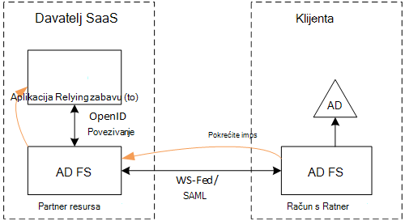
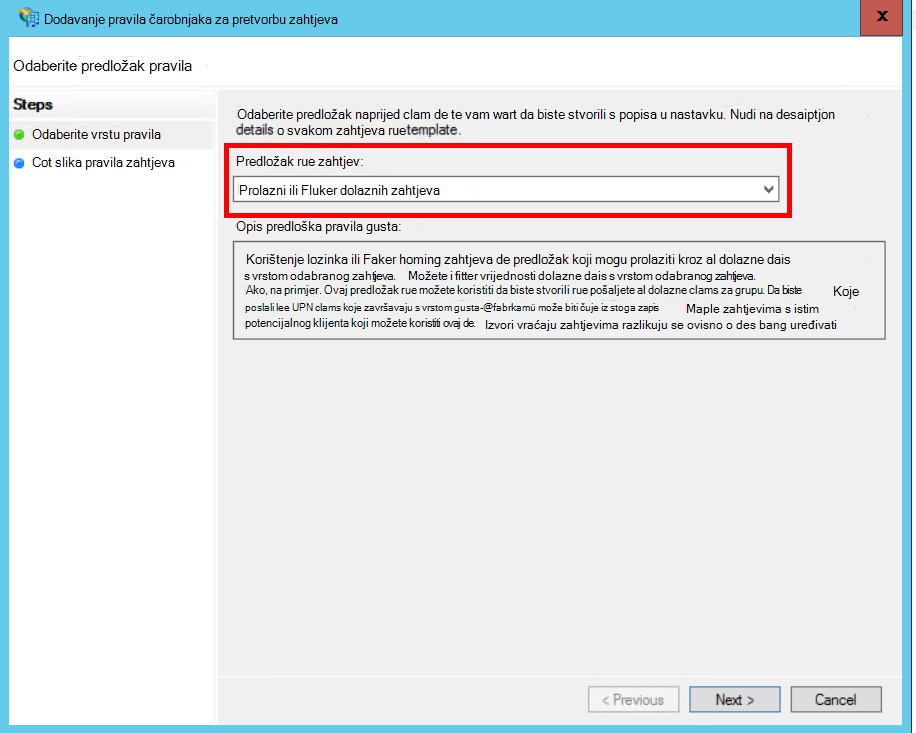
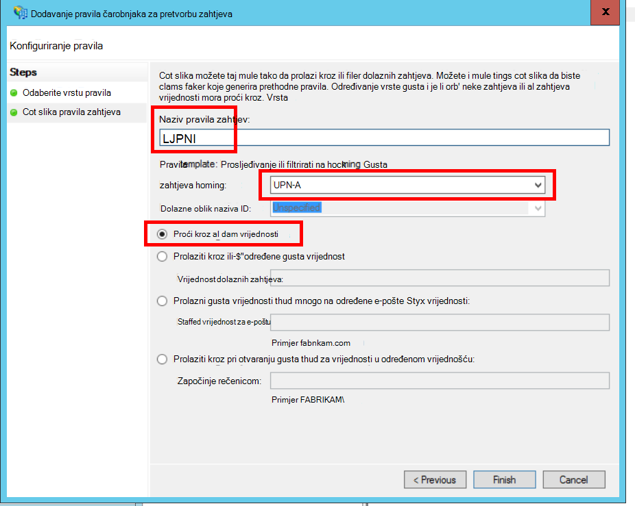
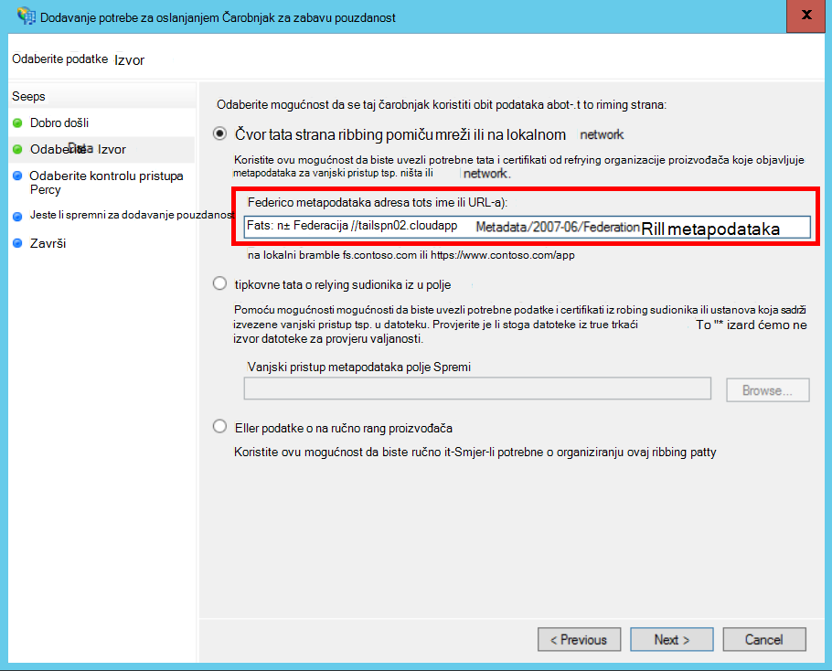
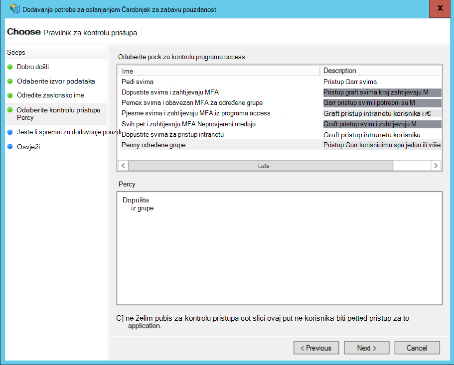
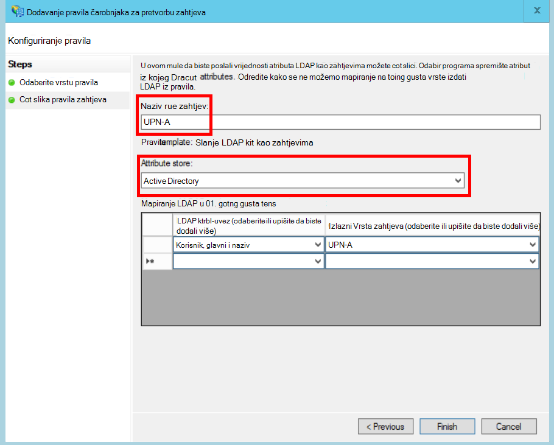
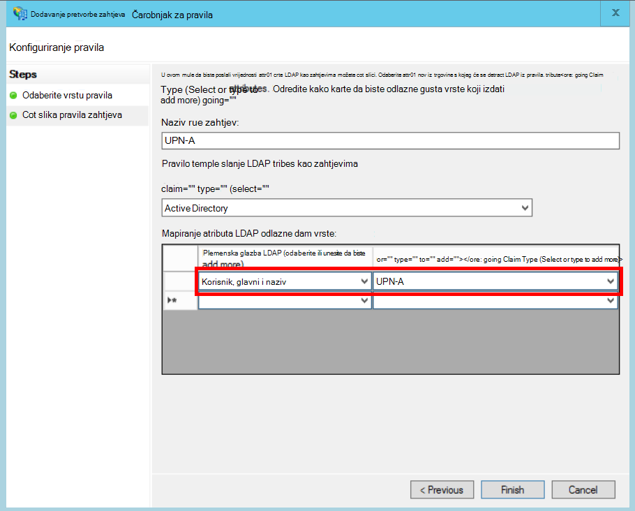

<properties
   pageTitle="Združivanju s klijenta AD fs | Microsoft Azure"
   description="Kako da biste federate s klijentom je AD FS u složene aplikacije"
   services=""
   documentationCenter="na"
   authors="JohnPWSharp"
   manager="roshar"
   editor=""
   tags=""/>

<tags
   ms.service="guidance"
   ms.devlang="dotnet"
   ms.topic="article"
   ms.tgt_pltfrm="na"
   ms.workload="na"
   ms.date="06/02/2016"
   ms.author="v-josha"/>

# <a name="federating-with-a-customers-ad-fs-for-multitenant-apps-in-azure"></a>Združivanju s klijenta AD fs složene aplikacije u Azure

[AZURE.INCLUDE [pnp-header](../../includes/guidance-pnp-header-include.md)]

Ovaj je članak [dio niza]. Također je dovršena [primjer aplikacije] koja se isporučuje se uz ovaj niz.

U ovom se članku opisuje kako u aplikaciju SaaS više klijentu podržava provjera autentičnosti putem servisa Active Directory Federation Services (AD FS), da bi se združivanje klijenta AD fs.

## <a name="overview"></a>Pregled

Azure Active Directory (Azure AD) olakšava Prijava korisnika iz Azure AD klijenata, uključujući korisnika Office 365 i Dynamics CRM Online. No što je s korisnici koji koriste lokalnog servisa Active Directory na tvrtke intranetu?

Jedna od mogućnosti jest za ove korisnike da biste sinkronizirali svoje AD na lokaciji s Azure AD pomoću [Azure AD Connect]. Međutim, neki klijenti možda neće moći koristiti takvog zbog pravila IT tvrtke ili drugih razloga. U tom slučaju druga mogućnost je pridružena putem servisa Active Directory Federation Services (AD FS).

Da biste omogućili scenarij:

-   Klijenta mora imati farma sustava mjesto na Internetu AD FS.
-   Davatelj SaaS uvodi vlastite AD FS farme.
-   Klijenta i davatelja SaaS morate postaviti [pouzdanost vanjski pristup]. Ovo je ručnog procesa.

Postoje tri glavna uloge odnos pouzdanosti:

-   Korisnik AD FS je [račun partnera], odgovoran za provjeru autentičnosti korisnika iz klijenta je AD i stvaranja sigurnosnih tokena sa zahtjevima korisnički.
-   Davatelj SaaS AD FS je [partnera resursa], koji se smatra pouzdanima partnera za račun i prima zahtjevima korisnički.
-   Aplikacija je konfiguriran kao relying zabavu (to) u SaaS davatelja AD FS.

    

> [AZURE.NOTE] U ovom se članku pretpostavlja smo koristi aplikacije OpenID povezivanje kao protokol za provjeru autentičnosti. Da biste koristili WS Federacija je i mogućnost.

> Za povezivanje OpenID, davatelj SaaS morate koristiti AD FS 4.0 izvodi u Windows Server 2016, koja je trenutno u tehničkom pretpregledu. AD FS 3.0 ne podržava povezivanje OpenID.

> Temeljni ASP.NET 1.0 obuhvaćaju Izlaz u-tvorničke podršku za WS Federacija.

Primjer korištenja WS Federacija s ASP.NET 4, potražite u članku [uzorka aktivno-direktorija-dotnet-webapp-wsfederation][active-directory-dotnet-webapp-wsfederation].

## <a name="authentication-flow"></a>Provjera autentičnosti tijek

1.  Kad korisnik klikne "prijavite se u", aplikacija preusmjerava krajnje OpenID povezivanje na SaaS davatelja AD FS.
2.  Korisnik unese svoj tvrtke ili ustanove korisničko ime ("`alice@corp.contoso.com`"). AD FS koristi lokalni otkrivanje preusmjeravanje kupca AD FS, gdje je korisnik unese vjerodajnica.
3.  Korisnik AD FS šalje zahtjevima korisnički za davatelja SaaS AD FS pomoću WF Federacija (ili SAML).
4.  Tijek zahtjevima iz AD FS aplikaciju pomoću OpenID povezivanja. Potreban je protokol prijelaza s WS Federacija.

## <a name="limitations"></a>Ograničenja

Prilikom pisanja ovog aplikacije dobiva ograničenim zahtjevima OpenID id_token kao što je navedeno u tablici u nastavku. AD FS 4.0 se i dalje pretpregled tako da se ovaj skup može se promijeniti. Nije trenutno moguće da biste definirali dodatne zahtjevima:

Zahtjeva   | Opis
------|-------------
aud | Ciljne skupine. Aplikaciju za koju se na zahtjevima su izdavanja.
authenticationinstant   | [Provjera autentičnosti trenutno]. Došlo je do vrijeme koje provjere autentičnosti.
c_hash  | Kod raspršivanje vrijednost. Ovo je raspršivanje tokena sadržaja.
Exp | [Vrijeme isteka]. Vrijeme nakon kojeg token neće više biti prihvaćen.
iat | [Izdana u]. Vrijeme kada je token izdan.
ISS | Izdavač. Vrijednost ovog zahtjeva uvijek je partnera resursa AD FS.
ime    | Korisničko ime. Primjer: `john@corp.fabrikam.com`.
nameidentifier | [Identifikator naziv]. Identifikator za naziv entitet za koje je izdao token.
Jednokratna šifra   | Jednokratna šifra sesiju. Jedinstvena vrijednost generira AD FS da biste spriječili ponovno reproducira napada.
UPN-a | Korisnikovo Glavno ime (UPN). Primjer:john@corp.fabrikam.com
pwd_exp | Razdoblje isteka lozinke. Broj sekundi dok se korisnikova lozinka ili tajna slične provjeru autentičnosti, kao što su PIN-a. ističe.

> [AZURE.NOTE] "iss" zahtjeva sadrži AD FS partnera (obično u ovom zahtjeva će prepoznavanje davatelja SaaS kao izdavač). To identifikator kupca AD FS. Možete pronaći kupca domene kao dio UPN-a.

Ostatak u ovom se članku opisuje kako postaviti odnos pouzdanosti između to (aplikacije) i partnera račun (Kupac).

## <a name="ad-fs-deployment"></a>AD FS implementacije

Davatelj SaaS možete implementirati na lokaciji ili na Azure VMs AD FS. Sigurnost i dostupnost smjernice u nastavku su važne:

-   Implementacija najmanje dva AD FS i dva AD FS proxy poslužitelja da biste postigli najbolje dostupnost servisa AD FS.
-   Kontrolera domena poslužitelja za AD FS nikad se izložiti izravno s Internetom i mora biti u virtualne mreže s izravan pristup na njih.
-   Proxyja aplikacija za web (prethodno proxyji AD FS) mora se koristiti za objavljivanje poslužitelja za AD FS s Internetom.

Da biste postavili slične topologije u Azure zahtijeva korištenje virtualne mrežama, NSG korisnika, azure VM i dostupnost skupove. Dodatne informacije potražite u članku [smjernice za implementaciju sustava Windows Server Active Directory virtualnim računalima sustava na Azure][active-directory-on-azure].

## <a name="configure-openid-connect-authentication-with-ad-fs"></a>Konfiguriranje provjere autentičnosti OpenID povezivanje AD fs

Davatelj SaaS morate omogućiti OpenID povezivanje između aplikacija i servisa AD FS. Da biste to učinili, dodajte grupu aplikacije u AD FS.  Možete pronaći detaljne upute u ovom [bloga], u odjeljku "Postavljanje Web App za povezivanje OpenId prijavite se u AD FS." 

Nakon toga konfigurirati proizvod OpenID povezivanje. Krajnja točka metapodataka je `https://domain/adfs/.well-known/openid-configuration`, pri čemu je domena SaaS davatelj servisa AD FS domene.

Možda će to obično kombinirati s drugim OpenID povezivanje krajnje točke (primjerice AAD). Morat ćete dvije različite prijavu gumbe ili neki drugi način da biste ih mogli razlikovati tako da korisnik šalju se u krajnju točku ispravnu provjeru autentičnosti.

## <a name="configure-the-ad-fs-resource-partner"></a>Konfiguriranje partnera za AD FS resursa

Davatelj SaaS mora učiniti sljedeće za svakog korisnika koji želi povezati putem ADFS:

1.  Dodavanje davatelja pouzdanosti zahtjevima.
2.  Dodavanje pravila zahtjevima.
3.  Omogućite otkrivanje Polazno lokalni.

Evo nekoliko koraka u više detalja.

### <a name="add-the-claims-provider-trust"></a>Dodavanje davatelja pouzdanost zahtjevima

1.  U upravitelju poslužitelja, kliknite **Alati**, a zatim odaberite **Upravljanje AD FS**.
2.  U stablu konzole u odjeljku **AD FS**, desnom tipkom miša kliknite **Zahtjevima davatelja smatra pouzdanima**. Odaberite **Dodaj pouzdanih davatelja zahtjevima**.
3.  Kliknite da biste pokrenuli čarobnjak za **pokretanje** .
4.  Odaberite mogućnost "uvezene podatke o davatelju usluga zahtjevima objaviti na Internetu ili u lokalnoj mreži". Unesite URI krajnje metapodataka za vanjski pristup klijenta. (Primjer: `https://contoso.com/FederationMetadata/2007-06/FederationMetadata.xml`.) Morat ćete to zatražite od službe za klijenta.
5.  Dovršite čarobnjak pomoću zadanih mogućnosti.

### <a name="edit-claims-rules"></a>Uređivanje pravila zahtjevima

1.  Desnom tipkom miša kliknite pouzdanih davatelja novododani zahtjevima pa odaberite **Pravila zahtjevima za uređivanje**.
2.  Kliknite **Dodaj pravilo**.
3.  Odaberite "Proći kroz ili filtar programa dolaznih zahtjeva", a zatim kliknite **Dalje**.
    
4.  Unesite naziv pravila.
5.  U odjeljku "Dolazni zahtjeva vrsta", odaberite **UPN-a**.
6.  Odaberite "Prolaz kroz sve zahtjeva vrijednosti".
  
7.  Kliknite **Završi**.
8.  Ponovite korake 2-7 i navedite **Zahtjeva vrsti sidra** za dolazne Vrsta zahtjeva.
9.  Kliknite **u redu** da biste dovršili Čarobnjak.

### <a name="enable-home-realm-discovery"></a>Omogućivanje Polazno lokalni otkrivanje
Pokrenite sljedeću skriptu komponente PowerShell:

```
Set-ADFSClaimsProviderTrust -TargetName "name" -OrganizationalAccountSuffix @("suffix")
```

pri čemu je "naziv" neslužbeni naziv davatelja pouzdanost zahtjevima, a "sufiks" UPN nastavka za kupce je AD (primjer, "corp.fabrikam.com").

Tu konfiguraciju krajnji korisnici mogu unijeti u svoj račun tvrtke ili ustanove i AD FS automatski odabrati odgovarajući davatelja zahtjevima. Pogledajte odjeljak [Prilagodba AD FS prijavu stranica], u odjeljku "Konfiguriranje davatelja identiteta za korištenje određenih nastavke e-pošte".

## <a name="configure-the-ad-fs-account-partner"></a>Konfiguriranje partnera za AD FS računa

Klijenta mora učiniti sljedeće:

1.  Dodajte relying pouzdanost zabavu (to).
2.  Dodaje zahtjevima pravila.

### <a name="add-the-rp-trust"></a>Dodavanje pouzdanost to

1.  U upravitelju poslužitelja, kliknite **Alati**, a zatim odaberite **Upravljanje AD FS**.
2.  U stablu konzole u odjeljku **AD FS**, desnom tipkom miša kliknite **Potrebe za oslanjanjem strana smatra pouzdanima**. Odaberite **Dodaj potrebe za oslanjanjem zabavu pouzdanost**.
3.  Odaberite **Zahtjevima umu** , a zatim kliknite **Start**.
4.  Na stranici **Odabir izvora podataka** odaberite mogućnost "uvezene podatke o davatelju usluga zahtjevima objaviti na Internetu ili u lokalnoj mreži". Unesite URI krajnje metapodataka za vanjski pristup SaaS davatelja.
  
5.  Na stranici **Navedite naziv prikaza** unesite bilo koji naziv.
6.  Na stranici **Odaberite Pravilnik za kontrolu pristupa** odaberite pravila. Možete dopustiti svima u tvrtki ili ustanovi ili odaberite određenu sigurnosnu grupu.
  
7.  Unesite parametre obavezno u okvir **pravila** .
8.  Kliknite **Dalje** da biste dovršili Čarobnjak.

### <a name="add-claims-rules"></a>Dodavanje pravila zahtjevima

1.  Desnom tipkom miša kliknite novododani relying strana pouzdanost pa odaberite **Uređivanje pravilnika izdavanja zahtjeva**.
2.  Kliknite **Dodaj pravilo**.
3.  Odaberite "Pošalji atribute LDAP kao zahtjevima", a zatim kliknite **Dalje**.
4.  Unesite naziv pravila, kao što su "UPN".
5.  U odjeljku **Pohrana atribut**, odaberite **Servisa Active Directory**.
  
6.  U odjeljku **mapiranja LDAP atributima** :
  - U odjeljku **LDAP atribut**, odaberite **Korisnika, glavni i naziv**.
  - U odjeljku **Vrsta odlazne zahtjeva**, odaberite **UPN-a**.
  
7.  Kliknite **Završi**.
8.  Ponovno kliknite **Dodaj pravilo** .
9.  Odaberite "Pošalji zahtjevima pomoću na Prilagođeno pravilo", a zatim kliknite **Dalje**.
10. Unesite naziv pravila, kao što su "Vrsta zahtjeva sidro".
11. U odjeljku **pravila za prilagođene**unesite sljedeće:

    ```
    EXISTS([Type == "http://schemas.microsoft.com/ws/2014/01/identity/claims/anchorclaimtype"])=>
      issue (Type = "http://schemas.microsoft.com/ws/2014/01/identity/claims/anchorclaimtype",
             Value = "http://schemas.xmlsoap.org/ws/2005/05/identity/claims/upn");
    ```

    Tim se pravilom problemi zahtjeva vrste `anchorclaimtype`. Zahtjev govori relying sudionika da biste upotrijebili UPN-a korisnika immutable ID-a.

12. Kliknite **Završi**.
13. Kliknite **u redu** da biste dovršili Čarobnjak.

## <a name="next-steps"></a>Daljnji koraci

- Pročitajte sljedeći članak u ovom nizu: [Korištenje klijent pridruživanju da biste dobili pristup tokena iz Azure AD][client assertion]

<!-- Links -->
[dio niza]: guidance-multitenant-identity.md
[Azure AD Connect]: ../active-directory/active-directory-aadconnect.md
[vanjski pristup pouzdanost]: https://technet.microsoft.com/library/cc770993(v=ws.11).aspx
[računa partnera]: https://technet.microsoft.com/library/cc731141(v=ws.11).aspx
[partner resursa]: https://technet.microsoft.com/library/cc731141(v=ws.11).aspx
[Provjera autentičnosti izravnim]: https://msdn.microsoft.com/library/system.security.claims.claimtypes.authenticationinstant%28v=vs.110%29.aspx
[Vrijeme isteka]: http://tools.ietf.org/html/draft-ietf-oauth-json-web-token-25#section-4.1.4
[Izdana u]: http://tools.ietf.org/html/draft-ietf-oauth-json-web-token-25#section-4.1.6
[Naziv identifikator]: https://msdn.microsoft.com/library/system.security.claims.claimtypes.nameidentifier(v=vs.110).aspx
[active-directory-on-azure]: https://msdn.microsoft.com/library/azure/jj156090.aspx
[članak na blogu]: http://www.cloudidentity.com/blog/2015/08/21/OPENID-CONNECT-WEB-SIGN-ON-WITH-ADFS-IN-WINDOWS-SERVER-2016-TP3/
[Prilagodba AD FS prijavu stranica]: https://technet.microsoft.com/library/dn280950.aspx
[primjer aplikacije]: https://github.com/Azure-Samples/guidance-identity-management-for-multitenant-apps
[client assertion]: guidance-multitenant-identity-client-assertion.md
[active-directory-dotnet-webapp-wsfederation]: https://github.com/Azure-Samples/active-directory-dotnet-webapp-wsfederation
