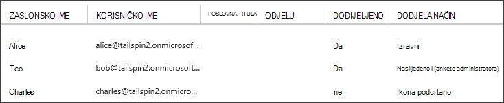

<properties
   pageTitle="Uloge aplikacije | Microsoft Azure"
   description="Kako izvesti autorizacije pomoću aplikacije uloge"
   services=""
   documentationCenter="na"
   authors="MikeWasson"
   manager="roshar"
   editor=""
   tags=""/>

<tags
   ms.service="guidance"
   ms.devlang="dotnet"
   ms.topic="article"
   ms.tgt_pltfrm="na"
   ms.workload="na"
   ms.date="02/16/2016"
   ms.author="mwasson"/>

#  <a name="application-roles-in-multitenant-applications"></a>Uloge aplikacije u složene aplikacije

[AZURE.INCLUDE [pnp-header](../../includes/guidance-pnp-header-include.md)]

Ovaj je članak [dio niza]. Također je dovršena [primjer aplikacije] koja se isporučuje se uz ovaj niz.

Uloge aplikacije koriste se za dodjeljivanje dozvola korisnicima. Na primjer, [Ankete Tailspin] [ Tailspin] računala definira sljedeće uloge:

- Administrator. Možete izvršiti sve operacije CRUD na bilo kojem upitnik koji pripada taj klijent.
- Alat za stvaranje. Možete stvoriti nove ankete.
- Čitač. Možete čitati sve ankete koji pripadaju taj klijent.

Vidjet ćete da uloge konačni se prevede dozvole tijekom [autorizacije]. No prvo pitanje se opisuje kako dodijeliti i Upravljanje ulogama. Ne možemo prepoznati tri glavna mogućnosti:

-   [Uloge aplikacije za Azure AD](#roles-using-azure-ad-app-roles)
-   [Azure AD sigurnosne grupe](#roles-using-azure-ad-security-groups)
-   [Uloga upravitelja za aplikacije](#roles-using-an-application-role-manager).

## <a name="roles-using-azure-ad-app-roles"></a>Uloge pomoću Azure AD aplikacije uloga

To je pristup koji se koristi u aplikaciji Tailspin ankete.

Na taj se način u SaaS davatelja definira uloge aplikacije tako da ih dodate programski manifest. Nakon klijenta registrira, administrator klijenta AD direktorij dodjeljuje korisnicima uloge. Prilikom prijave, dodijeljena uloga korisnika se šalju u obliku zahtjevima.

> [AZURE.NOTE] Ako je korisnik odabrao ima Azure AD Premium, administrator mogu dodijeliti sigurnosne grupe u ulogu i članove grupe će naslijediti ulogu aplikacije. Ovo je praktičan način da biste upravljali ulogama, jer vlasnik grupe ne morate biti administrator AD

Prednosti takvog:

-   Jednostavan model programiranja.
-   Uloge su specifične za aplikaciju. Uloga zahtjevima za jednu aplikaciju ne šalju se u neku drugu aplikaciju.
-   Ako je korisnik odabrao uklanja aplikacije iz svoje klijentu za AD, uloge nestaje.
-   Aplikacija ne morate sve dodatne dozvole servisa Active Directory, osim u korisničkom profilu za čitanje.

Nedostaci:

- Korisnici bez Azure AD Premium ne možete dodijeliti uloge sigurnosne grupe. Za ove korisnike sve dodjele korisnik mora poduzeti administrator servisa Active Directory.
- Ako imate pozadinski web API, razlikuje se od web-aplikaciju, dodjele uloga za web-aplikacije se ne odnose na webu API-JA. Dodatne rasprave od tog trenutka, potražite u članku [Zaštita s pozadinskom web-API-JA].

### <a name="implementation"></a>Implementacija

**Definiranje uloge.** Davatelj SaaS deklarira uloge aplikacije u [manifestu aplikacije]. Na primjer, Evo manifesta unosa za aplikaciju ankete:

```
"appRoles": [
  {
    "allowedMemberTypes": [
      "User"
    ],
    "description": "Creators can create Surveys",
    "displayName": "SurveyCreator",
    "id": "1b4f816e-5eaf-48b9-8613-7923830595ad",
    "isEnabled": true,
    "value": "SurveyCreator"
  },
  {
    "allowedMemberTypes": [
      "User"
    ],
    "description": "Administrators can manage the Surveys in their tenant",
    "displayName": "SurveyAdmin",
    "id": "c20e145e-5459-4a6c-a074-b942bbd4cfe1",
    "isEnabled": true,
    "value": "SurveyAdmin"
  }
],
```

Na `value` svojstvo se pojavljuje u zahtjeva uloge. U `id` je svojstvo Jedinstveni identifikator za definirani ulogu. Uvijek generiranje novu vrijednost GUID za `id`.

**Dodjela korisnika**. Kad novog klijenta registrira, aplikacija je registrirana u klijentu za AD klijenta. Sada administrator AD za taj klijent možete dodijeliti korisnicima uloge.

> [AZURE.NOTE] Kao što je naznačeno ranije, klijentima pomoću Azure AD Premium možete dodijeliti sigurnosne grupe uloga.

Sljedeće snimka zaslona s portala za Azure prikazuje tri korisnika. Alice je izravno dodijeljena uloga. Teo nasljeđuju uloga kao član sigurnosne grupe pod nazivom "Ankete administrator", koji je dodijeljen uloge. Bilo koja uloga nije dodijeljena Charles.



> [AZURE.NOTE] Osim toga, aplikacija možete dodijeliti uloge programski pomoću API Azure AD grafikonu.  Međutim, zahtijeva aplikacije da biste dobili dozvolu za zapisivanje za direktorij AD klijenta. Aplikaciju pomoću tih dozvola napraviti mnogo mischief &mdash; kupca smatrati pouzdanom aplikacija ne mess gore njihove direktorija. Mnogi korisnici možda neće vam licencirati da biste dodijelili ovom razinu pristupa.

**Dobiti ulogu zahtjevima**. Prilikom prijave, aplikacija dobiva korisnika dodijeljena uloga u zahtjeva s vrstom `http://schemas.microsoft.com/ws/2008/06/identity/claims/role`.  

Korisnik može imati više uloga ili bez uloga. U kodu autorizacije ne pretpostavlja da korisnik ima točno jednu ulogu zahtjeva. Umjesto toga, pisanje koda koji provjerava je li vrijednost određenog zahtjeva prezentacija:

```csharp
if (context.User.HasClaim(ClaimTypes.Role, "Admin")) { ... }
```

## <a name="roles-using-azure-ad-security-groups"></a>Uloge pomoću Azure AD sigurnosne grupe

U taj se način uloge prikazane su kao AD sigurnosne grupe. Aplikacija dodjeljuje dozvole korisnika na temelju njihove članstva u grupi sigurnost.

Prednosti:

-   Za korisnike koji imaju Azure AD Premium, taj se način omogućuje kupac da biste koristili sigurnosne grupe da biste upravljali dodjele uloga.

Nedostatke:

- Složenosti. Jer svaki klijent šalje zahtjevima za drugu grupu, aplikaciju morate pratio koji sigurnosnih grupa koje odgovaraju koje uloge aplikacije za svaki klijent.
- Ako je korisnik odabrao uklanja aplikacije iz svoje klijentu za AD, sigurnosne grupe ostaju u direktoriju njihove AD.

### <a name="implementation"></a>Implementacija

U programski manifest postavite na `groupMembershipClaims` svojstvo "SecurityGroup". To je potrebno da biste zahtjevima za članstvo grupe s AAD.

```
{
   // ...
   "groupMembershipClaims": "SecurityGroup",
}
```

Kad novog klijenta registrira, aplikacija upućuje klijenta za stvaranje sigurnosne grupe uloga potrebno aplikacija. Klijent zatim mora unijeti objekta grupe ID-a u aplikaciju. Aplikacija sprema ih u tablici koja mapira ID-ove grupe uloga aplikacije, po klijentu.

> [AZURE.NOTE] Osim toga, aplikaciju mogli stvoriti grupe programski pomoću API Azure AD grafikonu.  To će biti manje podložni pogreške. Međutim, bit će potrebno aplikacije da biste dobili "za čitanje i pisanje sve grupe" dozvole za klijenta AD direktorija. Mnogi korisnici možda neće vam licencirati da biste dodijelili ovom razinu pristupa.

Prilikom prijave:

1.  Aplikacija prima grupe korisnika kao zahtjevima. Vrijednost svakog zahtjeva je Identifikator objekta grupe.
2.  Azure AD ograničava broj grupe koje se šalju u token. Ako broj grupa premašuje ograničenje, Azure AD šalje posebno "pokrivenosti" Preuzmi. Ako postoji taj zahtjev, aplikacija mora upita API Azure AD grafikonu da biste sve grupe kojoj pripada taj korisnik. Detalje potražite u članku [autorizacije u oblak aplikacije koje se koriste AD grupe], u odjeljku pod naslovom "Grupe zahtjeva pokrivenost".
3.  Aplikacija traži objekt ID-a na vlastitu bazu podataka da biste pronašli uloge da biste korisniku dodijelili odgovarajuće aplikacije.
4.  Aplikacija dodaje vrijednost prilagođene zahtjeva Glavno ime korisnika koji izražava ulogu aplikacije. Na primjer: `survey_role` = "SurveyAdmin".

Pravila za provjeru autentičnosti trebali biste koristiti zahtjeva prilagođene uloge zahtjeva nije grupi.

## <a name="roles-using-an-application-role-manager"></a>Uloge pomoću programa Upravitelj aplikacija uloga

Na taj se način aplikacije uloge nisu spremljene u Azure AD uopće. Umjesto toga, aplikacija sprema dodjele uloga za svakog korisnika u vlastitom DB &mdash; , na primjer, pomoću klase **RoleManager** u ASP.NET identitet.

Prednosti:

-   Aplikacija sadrži potpunu kontrolu nad uloge i dodjele korisnika.

Nedostaci:

- Složenije, teže da biste zadržali.
- Ne možete koristiti AD sigurnosne grupe da biste upravljali dodjele uloga.
- Sprema korisničkih podataka u bazu podataka za aplikaciju, gdje ga pronaći sinkronizirani s imenikom servisa AD na klijentu, kao što je korisnici su dodani ili uklonjeni.   

Nema više postojećih primjeri za taj se način. Na primjer, potražite u članku [Stvaranje ASP.NET MVC aplikacije pomoću provjere autentičnosti i SQL DB i implementacija aplikacije servisa za Azure].

## <a name="next-steps"></a>Daljnji koraci

- Pročitajte sljedeći članak u ovom nizu: [autorizacija uloga i resursa u složene aplikacije][autorizacije]

<!-- Links -->
[Tailspin]: guidance-multitenant-identity-tailspin.md
[dio niza]: guidance-multitenant-identity.md
[autorizacija]: guidance-multitenant-identity-authorize.md
[Zaštita pozadinskog web API-JA]: guidance-multitenant-identity-web-api.md
[Stvaranje aplikacije ASP.NET MVC pomoću provjere autentičnosti i SQL DB i implementacija aplikacije servisa za Azure]: ../app-service-web/web-sites-dotnet-deploy-aspnet-mvc-app-membership-oauth-sql-database.md
[programski manifest]: ../active-directory/active-directory-application-manifest.md
[primjer aplikacije]: https://github.com/Azure-Samples/guidance-identity-management-for-multitenant-apps
