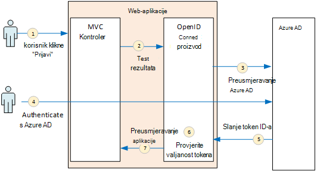
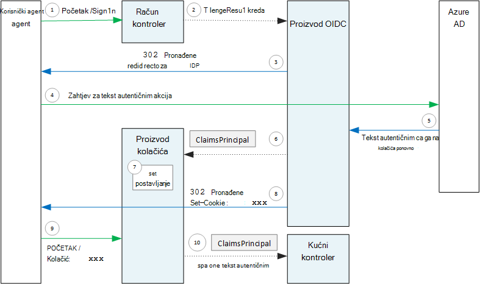

<properties
   pageTitle="Provjera autentičnosti u složene aplikacije | Microsoft Azure"
   description="Kako mogu složene aplikacije provjere autentičnosti korisnika iz Azure AD"
   services=""
   documentationCenter="na"
   authors="MikeWasson"
   manager="roshar"
   editor=""
   tags=""/>

<tags
   ms.service="guidance"
   ms.devlang="dotnet"
   ms.topic="article"
   ms.tgt_pltfrm="na"
   ms.workload="na"
   ms.date="05/23/2016"
   ms.author="mwasson"/>

# <a name="authentication-in-multitenant-apps-using-azure-ad-and-openid-connect"></a>Provjera autentičnosti u složene aplikacije pomoću Azure AD i povezivanje OpenID

[AZURE.INCLUDE [pnp-header](../../includes/guidance-pnp-header-include.md)]

Ovaj je članak [dio niza](guidance-multitenant-identity.md). Također je dovršena [primjer aplikacije] koja se isporučuje se uz ovaj niz.

U ovom se članku opisuje kako možete složene aplikacije provjere autentičnosti korisnika iz Azure Active Directory (Azure AD), pomoću povezivanje OpenID (OIDC) za provjeru autentičnosti.

## <a name="overview"></a>Pregled

Aplikacija ASP.NET osnovne 1.0 je naš [implementaciju referencu](guidance-multitenant-identity-tailspin.md) . Aplikacija koristi ugrađene OpenID povezivanje proizvod da biste izvršili provjeru autentičnosti tijek OIDC. Sljedeći dijagram prikazuje što se događa kada korisnik potpiše, visoke razine.



1.  Korisnik klikne gumb "Prijava" u aplikaciji. Ova akcija upravlja se MVC kontroler.
2.  Kontrolerom MVC vraća **ChallengeResult** akcija.
3.  Na proizvod intercepts **ChallengeResult** i stvara 302 odgovor koji se stranica za prijavu u Azure AD preusmjerava korisnika.
4.  Korisnik se autentificira servisa s Azure AD.
5.  Azure AD šalje se token ID-a aplikacije.
6.  Na proizvod Provjeri valjanost token ID-a. Sada je sada autentičnost korisnika u aplikaciji.
7.  Na proizvod preusmjerava korisnika natrag u aplikaciji.

## <a name="register-the-app-with-azure-ad"></a>Registracija aplikacije s Azure AD

Da biste omogućili OpenID povezivanje, davatelja SaaS registrira aplikacije unutar vlastite Azure AD klijenta.

Da biste registrirali aplikaciju, slijedite korake u [Integriranje aplikacija pomoću servisa Azure Active Directory](../active-directory/active-directory-integrating-applications.md), u odjeljku [Dodavanje aplikacije](../active-directory/active-directory-integrating-applications.md#adding-an-application).

Na stranici **Konfiguracija** :

-   Imajte na umu ID klijenta
-   U odjeljku **aplikacija je više klijent**, odaberite **da**.
-   Postavite **URL ADRESE za odgovor** na URL-a gdje Azure AD će poslati odgovor provjere autentičnosti. Možete koristiti osnovni URL aplikacije.
  - Napomena: Put URL-a može biti bilo što, pod uvjetom da naziv glavnog računala odgovara distribuiranih aplikacije.
  - Možete postaviti više odgovora URL-ova. Tijekom razvoja, možete koristiti na `localhost` adresa za pokretanje aplikacije lokalno.
-   Generiranje klijent tajna: u odjeljku **tipke**, kliknite na padajućem izborniku koji se piše **Odaberite trajanje** , a zatim odaberite godina 1 ili 2. Kada kliknete **Spremi**, tipku će biti vidljivi. Provjerite da biste kopirali vrijednosti, jer on nije prikazana ponovno prilikom učitavanja stranice konfiguracije.

## <a name="configure-the-auth-middleware"></a>Konfiguriranje provjere autentičnosti proizvod

U ovom se odjeljku opisuje kako konfigurirati proizvod provjere autentičnosti u ASP.NET osnovne 1.0 za složene provjeru autentičnosti s OpenID povezivanje.

U svojoj učionici pokretanje dodali proizvod OpenID povezivanje:

```csharp
app.UseOpenIdConnectAuthentication(options =>
{
    options.AutomaticAuthenticate = true;
    options.AutomaticChallenge = true;
    options.ClientId = [client ID];
    options.Authority = "https://login.microsoftonline.com/common/";
    options.CallbackPath = [callback path];
    options.PostLogoutRedirectUri = [application URI];
    options.SignInScheme = CookieAuthenticationDefaults.AuthenticationScheme;
    options.TokenValidationParameters = new TokenValidationParameters
    {
        ValidateIssuer = false
    };
    options.Events = [event callbacks];
});
```

> [AZURE.NOTE] Potražite u članku [Startup.cs](https://github.com/Azure-Samples/guidance-identity-management-for-multitenant-apps/blob/master/src/Tailspin.Surveys.Web/Startup.cs).

Dodatne informacije o početnu klasu potražite u članku [Pokretanje aplikacije](https://docs.asp.net/en/latest/fundamentals/startup.html) u dokumentaciji ASP.NET osnovne 1.0.

Postavite sljedeće mogućnosti proizvod:

- **ClientId**. Aplikacije klijenta ID koji ste dobili kada aplikacija registrira u Azure AD.
- **Za izdavanje certifikata**. Složene aplikacije, postavite to na `https://login.microsoftonline.com/common/`. To je URL za Azure AD uobičajenih krajnju točku, koja omogućuje korisnicima iz bilo kojeg Azure AD klijenta za prijavu. Dodatne informacije o krajnju točku uobičajenih potražite u članku [Ovaj članak na blogu](http://www.cloudidentity.com/blog/2014/08/26/the-common-endpoint-walks-like-a-tenant-talks-like-a-tenant-but-is-not-a-tenant/).
- U **TokenValidationParameters**postavite **ValidateIssuer** false. To znači da aplikaciju bit će odgovoran za provjeru valjanosti izdavača vrijednost u token ID-a. (Na proizvod još uvijek Provjeri valjanost token sam.) Dodatne informacije o provjeri valjanosti izdavač potražite u članku [Provjera valjanosti izdavač](guidance-multitenant-identity-claims.md#issuer-validation).
- **CallbackPath**. Skup to jednako put URL odgovor koji ste registrirali Azure AD. Na primjer, ako je URL odgovor `http://contoso.com/aadsignin`, mora biti **CallbackPath** `aadsignin`. Ako ne postavite tu mogućnost, zadana vrijednost je `signin-oidc`.
- **PostLogoutRedirectUri**. Navedite URL za preusmjeravanje korisnika nakon Odjava. Trebali biste stranicu koja omogućuje zahtjeva za anonimni &mdash; obično na početnu stranicu.
- **SignInScheme**. To postavljena na `CookieAuthenticationDefaults.AuthenticationScheme`. Tu postavku, to znači da nakon provjere autentičnosti korisnika zahtjevima korisnički pohranjuju lokalno u kolačić. U ovom kolačića je kako korisnika ostaje prijavljenog tijekom sesiju u pregledniku.
- **Događaji.** Događaj pozive; u odjeljku [događaji provjere autentičnosti](#authentication-events).

Dodati i provjera autentičnosti kolačića proizvod kanal. Ovaj proizvod je zadužen za pisanje zahtjevima korisnički da biste kolačića, a zatim čitanja kolačić tijekom opterećenje sljedeće stranice.

```csharp
app.UseCookieAuthentication(options =>
{
    options.AutomaticAuthenticate = true;
    options.AutomaticChallenge = true;
    options.AccessDeniedPath = "/Home/Forbidden";
});
```

## <a name="initiate-the-authentication-flow"></a>Pokretanje tijeka provjere autentičnosti

Da biste pokrenuli tijek provjere autentičnosti u ASP.NET MVC, vraćanje **ChallengeResult** s na contoller:

```csharp
[AllowAnonymous]
public IActionResult SignIn()
{
    return new ChallengeResult(
        OpenIdConnectDefaults.AuthenticationScheme,
        new AuthenticationProperties
        {
            IsPersistent = true,
            RedirectUri = Url.Action("SignInCallback", "Account")
        });
}
```

Zbog toga proizvod da biste se vratili 302 odgovor (pronađeno) koji se preusmjerava krajnja točka za provjeru autentičnosti.

## <a name="user-login-sessions"></a>Sesije Prijava korisnika

Kao što je rečeno, kada korisnik najprije se prijavi, proizvod provjera autentičnosti kolačića piše zahtjevima korisnički da biste kolačić. Nakon toga HTTP zahtjeva su autentičnost tako da pročitate kolačić.

Prema zadanim postavkama kolačića proizvod piše [kolačića sesije][session-cookie], koji se dobije izbrisane jednom korisniku zatvara web-pregledniku. Kada sljedeći put korisnika sljedeće posjete web-mjestu će morati ponovno se prijavite. Međutim, ako **IsPersistent** postavite na true u **ChallengeResult**, na proizvod piše kolačić stalni da korisnik ostaje prijavljenog nakon zatvaranja preglednika. Možete konfigurirati isteka kolačića; potražite u odjeljku [Mogućnosti kolačića Controlling][cookie-options]. Stalni kolačići su praktičnije za korisnika, no možda prikladna za neke aplikacije (izgovorite, bankovne aplikacije) mjesto na kojem želite da se prijavite se u svakom korisniku.

## <a name="about-the-openid-connect-middleware"></a>O proizvod OpenID povezivanje

Povezivanje OpenID proizvod u ASP.NET skriva većinu protokol pojedinosti. Ova sekcija sadrži neke bilješke o implementaciji, koji mogu biti korisni za razumijevanje tijek protokol.

Najprije provjerimo tijek provjera autentičnosti pomoću platforme ASP.NET (zanemarujući detalje o tijeku protokol OIDC između aplikacija i Azure AD). Sljedeći dijagram prikazuje postupak.



U ovaj dijagram postoje dvije MVC kontrolera. Kontrolerom račun rukuje zahtjevima za prijavu, a kontrolerom Polazno služi prema gore na početnu stranicu.

Ovdje je postupak provjere autentičnosti:

1. Korisnik klikne gumb "Prijava", a preglednik šalje zahtjevom GET. Na primjer: `GET /Account/SignIn/`.
2. Vraća kontroler računa na `ChallengeResult`.
3. Proizvod OIDC vraća HTTP 302 odgovor, preusmjeravanja Azure AD.
4. Web-pregledniku šalje zahtjev za provjeru autentičnosti Azure AD
5. Korisnikove prijave u Azure AD i Azure AD šalje natrag odgovor za provjeru autentičnosti.
6. Proizvod OIDC stvara glavni zahtjevima i prosljeđuje provjera autentičnosti kolačića proizvod.
7. Proizvod kolačića serializes zahtjevima glavnicu i postavlja kolačić.
8. Proizvod OIDC preusmjerava aplikacije povratnog URL.
10. Web-pregledniku slijedi preusmjeravanje slanja kolačić zahtjev.
11. Proizvod kolačića deserializes kolačića u zahtjevima koji je glavni i postavlja `HttpContext.User` jednako glavnicu zahtjevima. Zahtjev je usmjerena na MVC kontrolerom.

### <a name="authentication-ticket"></a>Provjera autentičnosti karata

Ako provjera autentičnosti ne uspije, proizvod OIDC stvara karata provjere autentičnosti koja sadrži glavnicu zahtjevima koja sadrži zahtjevima za korisnika. Možete pristupiti karata unutar **AuthenticationValidated** ili **TicketReceived** događaj.

> [AZURE.NOTE] Dok tijek cijelu provjere autentičnosti ne završi, `HttpContext.User` i dalje se anonimni glavnica, _ne_ sadrži korisnika čija je autentičnost provjerena. Anonimni glavnicu sadrži zbirku programa prazan zahtjevima. Nakon provjere autentičnosti dovršava i deserializes proizvod kolačića preusmjeravanja aplikacije kolačić za provjeru autentičnosti i skupove `HttpContext.User` na glavni zahtjevima koji predstavlja korisnika čija je autentičnost provjerena.

### <a name="authentication-events"></a>Provjera autentičnosti događaja

Tijekom provjere autentičnosti proizvod OpenID povezivanje podiže niz događaja:

- **RedirectToAuthenticationEndpoint**. Pozvati desno na proizvod preusmjerava krajnja točka za provjeru autentičnosti. Koristite ovaj događaj da biste izmijenili preusmjeravanje URL-a; na primjer, da biste dodali zahtjev parametara. U odjeljku [Dodavanje upit za administratore pristanak](guidance-multitenant-identity-signup.md#adding-the-admin-consent-prompt) na primjer.

- **AuthorizationResponseReceived**. Naziva nakon što u proizvod primi odgovor provjere autentičnosti davatelja identiteta (IDP), ali prije na proizvod Provjeri valjanost odgovor.  

- **AuthorizationCodeReceived**. Naziva kod autorizacije.

- **TokenResponseReceived**. Naziva nakon na proizvod dohvaća programa access tokena iz na IDP. Odnosi se samo na tijek kod za autorizaciju.

- **AuthenticationValidated**. Naziva kada na proizvod Provjeri valjanost token ID-a. U ovom trenutku aplikacija ima skup provjerene zahtjevima o korisniku. Koristite ovaj događaj za izvođenje dodatne provjere valjanosti na na zahtjevima ili pretvaranje zahtjevima. Potražite u članku [Rad s zahtjevima](guidance-multitenant-identity-claims.md).

- **UserInformationReceived**. Naziva ako na proizvod s krajnje informacije korisnika dohvaća korisničkog profila. Odnosi se samo na tijek kod autorizacije i samo ako `GetClaimsFromUserInfoEndpoint = true` u odjeljku mogućnosti proizvod.

- **TicketReceived**. Naziva po dovršetku provjere autentičnosti. Ovo je zadnji događaj, pod pretpostavkom uspješnog autentičnosti. Kada se ovaj događaj rukuje, je korisnik prijavljen u aplikaciju.

- **AuthenticationFailed**. Naziva ne uspije provjera autentičnosti. Koristite ovaj događaj za rukovanje neuspjele provjere autentičnosti &mdash; , na primjer, ako preusmjeravanja na stranicu pogreške.

Da biste pozive za te događaje, postavite mogućnost **događaja** na na proizvod. Postoje dva načina deklarirati rukovatelja događajima: u ravnini s lambdas ili u razredu koja je izvedena iz **OpenIdConnectEvents**.

U ravnini s lambdas:

```csharp
app.UseOpenIdConnectAuthentication(options =>
{
    // Other options not shown.

    options.Events = new OpenIdConnectEvents
    {
        OnTicketReceived = (context) =>
        {
             // Handle event
             return Task.FromResult(0);
        },
        // other events
    }
});
```

Dijelovima koji potječu od **OpenIdConnectEvents**:

```csharp
public class SurveyAuthenticationEvents : OpenIdConnectEvents
{
    public override Task TicketReceived(TicketReceivedContext context)
    {
        // Handle event
        return base.TicketReceived(context);
    }
    // other events
}

// In Startup.cs:
app.UseOpenIdConnectAuthentication(options =>
{
    // Other options not shown.

    options.Events = new SurveyAuthenticationEvents();
});
```

Drugi način preporučuje se da ako vaše pozive događaj znatno logiku, pa ih ne Zagušenje početnu klasu. Naš referenca implementaciji koristi takvog; potražite u članku [SurveyAuthenticationEvents.cs](https://github.com/Azure-Samples/guidance-identity-management-for-multitenant-apps/blob/master/src/Tailspin.Surveys.Web/Security/SurveyAuthenticationEvents.cs).

### <a name="openid-connect-endpoints"></a>OpenID povezivanje krajnje točke

Azure AD podržava [Povezivanje otkrivanje OpenID](https://openid.net/specs/openid-connect-discovery-1_0.html), kojemu davatelja identiteta (IDP) vraća JSON metapodataka dokumenta iz [poznati krajnjoj točki](https://openid.net/specs/openid-connect-discovery-1_0.html#ProviderConfig). Dokument metapodataka sadrži podatke kao što su:

-   URL krajnja točka za autorizaciju. Ovo je koju aplikaciju preusmjerava provjere autentičnosti korisnika.
-   URL adresa "prekid sesije" krajnje točke, gdje aplikaciju odlazak Odjava korisnika.
-   URL adresa da biste dobili potpisnog tipke, koji koristi klijent za provjeru valjanosti tokena OIDC koje dohvaća iz na IDP.

Prema zadanim postavkama, proizvod OIDC ne zna ovaj metapodataka za dohvaćanje. Postavljanje mogućnosti **za izdavanje certifikata** u na proizvod, a na proizvod konstrukata URL-a za metapodatke. (Možete nadjačati URL metapodataka tako da postavite mogućnost **MetadataAddress** .)

### <a name="openid-connect-flows"></a>OpenID povezivanje tokova.

Proizvod OIDC po zadanom koristi hibridnog tijek sa način odgovor objavu obrasca.

-   _Tijek hibridnog_ znači klijent možete dobiti token za ID-a i pripadnog koda autorizacije u istoj round-trip na poslužitelj za autorizaciju.
-   _Obrasca objavite način odaz_ znači poslužitelj autorizacije koristi zahtjev HTTP objavljuju da biste poslali ID-a kod token i autorizacije aplikaciju. Vrijednosti su obrasca urlencoded (vrsta sadržaja = "aplikacija/x-www-form-urlencoded").

Kada proizvod OIDC preusmjerava krajnja točka za provjeru autentičnosti, preusmjeravanje URL-a sadrži sve parametre niza upita potrebne OIDC. Za hibridno tijek:

-   client_id. Tu vrijednost postavljena na mogućnost **ClientId**
-   opseg = "openid profil", što znači da je zahtjev za OIDC i želimo profila korisnika.
-   response_type = "kod id_token". Određuje hibridnog toka.
-   response_mode = "form_post". Određuje odgovor objavu obrasca.

Da biste naveli drugi tijek, postavite svojstvo **ResponseType** na izborniku Mogućnosti. Ako, na primjer:

```csharp
app.UseOpenIdConnectAuthentication(options =>
{
    options.ResponseType = "code"; // Authorization code flow

    // Other options
}
```

## <a name="next-steps"></a>Daljnji koraci

- Pročitajte sljedeći članak u ovom nizu: [Rad s identitete utemeljene na zahtjevima u složene aplikacije][claims]


[claims]: guidance-multitenant-identity-claims.md
[cookie-options]: https://docs.asp.net/en/latest/security/authentication/cookie.html#controlling-cookie-options
[session-cookie]: https://en.wikipedia.org/wiki/HTTP_cookie#Session_cookie
[primjer aplikacije]: https://github.com/Azure-Samples/guidance-identity-management-for-multitenant-apps
