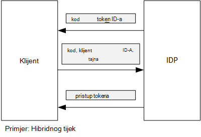

<properties
   pageTitle="Da biste dobili pristup tokena iz Azure AD pomoću klijent pridruživanju | Microsoft Azure"
   description="Kako koristiti klijent pridruživanju da biste dobili pristup tokena iz Azure AD."
   services=""
   documentationCenter="na"
   authors="MikeWasson"
   manager="roshar"
   editor=""
   tags=""/>

<tags
   ms.service="guidance"
   ms.devlang="dotnet"
   ms.topic="article"
   ms.tgt_pltfrm="na"
   ms.workload="na"
   ms.date="05/23/2016"
   ms.author="mwasson"/>

# <a name="using-client-assertion-to-get-access-tokens-from-azure-ad"></a>Da biste dobili pristup tokena iz Azure AD pomoću pridruživanju klijenta

[AZURE.INCLUDE [pnp-header](../../includes/guidance-pnp-header-include.md)]

Ovaj je članak [dio niza]. Također je dovršena [primjer aplikacije] koja se isporučuje se uz ovaj niz.

## <a name="background"></a>Pozadine

Kada koristite tijek autorizacije kod ili hibridnog tijek u OpenID povezivanje, klijent što je autorizacije kod za token za pristup. Tijekom ovaj korak klijent ima radi provjere autentičnosti na poslužitelju.



Jedan od načina provjere autentičnosti klijent je pomoću klijenta tajna. To su kako [Ankete Tailspin] [ Surveys] po zadanom je konfiguriran aplikacije.

Evo primjera zahtjeva za razmjenu putem klijentskog programa za IDP, zahtijeva token za pristup. Napomena u `client_secret` parametar.

```
POST https://login.microsoftonline.com/b9bd2162xxx/oauth2/token HTTP/1.1
Content-Type: application/x-www-form-urlencoded

resource=https://tailspin.onmicrosoft.com/surveys.webapi
  &client_id=87df91dc-63de-4765-8701-b59cc8bd9e11
  &client_secret=i3Bf12Dn...
  &grant_type=authorization_code
  &code=PG8wJG6Y...
```

Na tajna je samo niz, da biste imali da biste bili sigurni da ne osipanje vrijednost. Najbolje je da biste zadržali tajna klijent iz izvora kontrole. Kada implementirati Azure pohranjuju u tajna [postavka app][configure-web-app].

Međutim, svatko tko ima pristup Azure pretplate možete pogledati postavki aplikacije. Nadalje, postoji uvijek temptation provjerite tajne u kontrolu izvora (npr., u skriptama implementacije), ih zajednički koristiti putem e-pošte i tako dalje.

Radi dodatne sigurnosti umjesto klijent tajna možete koristiti [pridruživanju klijenta] . Klijent s pridruživanju klijent koristi X.509 certifikat da biste dokazali tokena zahtjev dolazi iz klijentskog programa. Klijentski certifikat je instaliran na web-poslužitelj. Općenito govoreći, ona će biti lakše ograničiti pristup certifikat od osigurava da nitko ne slučajno otkriva klijent tajna. Dodatne informacije o konfiguriranju potvrde u web-aplikaciji potražite u članku [Korištenje potvrde u aplikacijama za Azure web-mjesta][using-certs-in-websites]

Evo tokena zahtjev korištenjem pridruživanju klijent:

```
POST https://login.microsoftonline.com/b9bd2162xxx/oauth2/token HTTP/1.1
Content-Type: application/x-www-form-urlencoded

resource=https://tailspin.onmicrosoft.com/surveys.webapi
  &client_id=87df91dc-63de-4765-8701-b59cc8bd9e11
  &client_assertion_type=urn:ietf:params:oauth:client-assertion-type:jwt-bearer
  &client_assertion=eyJhbGci...
  &grant_type=authorization_code
  &code= PG8wJG6Y...
```

Primijetit ćete da se `client_secret` parametar se više ne koristi. Umjesto toga u `client_assertion` parametar sadrži JWT token koji je potpisan pomoću certifikata klijenta. Na `client_assertion_type` parametar određuje vrstu pridruživanju &mdash; u ovom slučaju, JWT token. Poslužitelj Provjeri valjanost JWT token. Ako JWT token nije valjan, zahtjev za tokena vraća pogrešku.

> [AZURE.NOTE] X.509 certifikate nisu jedini obrazac pridruživanju klijenta; ne možemo fokus na njemu ovdje jer je to podržava Azure AD.

## <a name="using-client-assertion-in-the-surveys-application"></a>Pomoću pridruživanju klijenta u aplikaciji ankete

U ovom se odjeljku objašnjava konfiguriranje Tailspin ankete aplikacije da biste koristili pridruživanju klijenta. U sljedećim koracima generirat će samopotpisani certifikat koji je prikladan za razvoj, ali ne i za korištenje proizvodnje.

1. Pokrenuti skriptu PowerShell [/Scripts/Setup-KeyVault.ps1] [ Setup-KeyVault] na sljedeći način:

    ```
    .\Setup-KeyVault.ps -Subject [subject]
    ```

    Za na `Subject` parametar, unesite ime, kao što su "surveysapp". Skripta generira samopotpisani certifikat, a sprema u spremištu certifikata "trenutnog korisnika/osobno".

2. Izlaz iz skripte je JSON fragment. Dodajte to programski manifest web-aplikacije na sljedeći način:

    1. Prijava na [portal za upravljanje Azure] [ azure-management-portal] i otiđite do Azure AD direktorija.

    2. Kliknite **aplikacije**.

    3. Odaberite aplikaciju za ankete.

    4.  Kliknite **Upravljanje manifesta** i odaberite **Preuzimanje manifesta**.

    5.  Otvorite manifesta JSON datoteku u uređivaču teksta. Zalijepite Izlaz iz skripte u na `keyCredentials` svojstvo. Trebao bi izgledati otprilike ovako:

        ```    
        "keyCredentials": [
            {
              "type": "AsymmetricX509Cert",
              "usage": "Verify",
              "keyId": "29d4f7db-0539-455e-b708-....",
              "customKeyIdentifier": "ZEPpP/+KJe2fVDBNaPNOTDoJMac=",
              "value": "MIIDAjCCAeqgAwIBAgIQFxeRiU59eL.....
            }
          ],
         ```

    6.  Da biste spremili promjene u datoteku JSON.

    7.  Vratite se na portal. Kliknite **Upravljanje manifesta** > **Prijenos manifesta** i prijenos datoteka JSON.

3. Pokrenite sljedeću naredbu da biste dobili otisak prsta potvrde.

    ```
    certutil -store -user my [subject]
    ```

    gdje `[subject]` je vrijednost koju ste naveli za predmet u skriptu PowerShell. Na otisak prsta nalazi se u odjeljku "Certifikata Hash(sha1)". Uklanjanje razmaka između heksadecimalnu vrijednost broja.

4. Ažurirajte vaše tajne aplikacije. U pregledniku rješenja, desnom tipkom miša kliknite projekt Tailspin.Surveys.Web i odaberite **Upravljanje tajne korisnika**. Dodavanje unosa za "Asymmetric" u odjeljku "AzureAd", kao što je prikazano u nastavku:

    ```
    {
      "AzureAd": {
        "ClientId": "[Surveys application client ID]",
        // "ClientSecret": "[client secret]",  << Delete this entry
        "PostLogoutRedirectUri": "https://localhost:44300/",
        "WebApiResourceId": "[App ID URI of your Survey.WebAPI application]",
        // new:
        "Asymmetric": {
          "CertificateThumbprint": "[certificate thumbprint]",  // Example: "105b2ff3bc842c53582661716db1b7cdc6b43ec9"
          "StoreName": "My",
          "StoreLocation": "CurrentUser",
          "ValidationRequired": "false"
        }
      },
      "Redis": {
        "Configuration": "[Redis connection string]"
      }
    }
    ```

    Morate postaviti `ValidationRequired` na false, jer nije bio traje po korijenski CA za izdavanje certifikata. U proizvodnje, pomoću certifikata koji je potpisao CA za izdavanje certifikata i postavljanje `ValidationRequired` na true.

    I izbrisati stavku `ClientSecret`jer ona nije potrebna s pridruživanju klijenta.

5. U Startup.cs, pronađite šifru koja registrira u `ICredentialService`. Uklonite redak koji koristi `CertificateCredentialService`, i komentar izgleda u retku koji koristi `ClientCredentialService`:

    ```csharp
    // Uncomment this:
    services.AddSingleton<ICredentialService, CertificateCredentialService>();
    // Comment out this:
    //services.AddSingleton<ICredentialService, ClientCredentialService>();
    ```

Prilikom izvođenja web-aplikaciji čita certifikat iz spremišta certifikata. Certifikat mora biti instaliran na istom računalu kao web-aplikaciji.

## <a name="next-steps"></a>Daljnji koraci

- Pročitajte sljedeći članak u ovom nizu: [Pomoću sigurnog Azure ključ da biste zaštitili tajne aplikacije][key vault]


<!-- Links -->
[configure-web-app]: ../app-service-web/web-sites-configure.md
[azure-management-portal]: https://manage.windowsazure.com
[pridruživanju klijenta]: https://tools.ietf.org/html/rfc7521
[key vault]: guidance-multitenant-identity-keyvault.md
[Setup-KeyVault]: https://github.com/Azure-Samples/guidance-identity-management-for-multitenant-apps/blob/master/scripts/Setup-KeyVault.ps1
[Surveys]: guidance-multitenant-identity-tailspin.md
[using-certs-in-websites]: https://azure.microsoft.com/blog/using-certificates-in-azure-websites-applications/
[dio niza]: guidance-multitenant-identity.md
[primjer aplikacije]: https://github.com/Azure-Samples/guidance-identity-management-for-multitenant-apps
