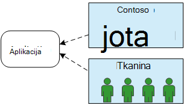
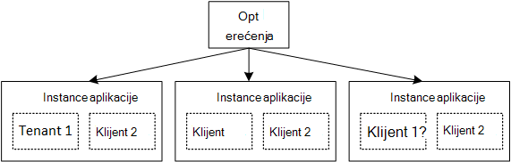

<properties
   pageTitle="Upravljanje identitetom za složene aplikacije | Microsoft Azure"
   description="Uvod u upravljanje identitetom u složene aplikacije"
   services=""
   documentationCenter="na"
   authors="MikeWasson"
   manager="roshar"
   editor=""
   tags=""/>

<tags
   ms.service="guidance"
   ms.devlang="dotnet"
   ms.topic="article"
   ms.tgt_pltfrm="na"
   ms.workload="na"
   ms.date="06/02/2016"
   ms.author="mwasson"/>

# Uvod u upravljanje identitetom za složene aplikacije Microsoft Azure

[AZURE.INCLUDE [pnp-header](../../includes/guidance-pnp-header-include.md)]

Ovaj je članak [dio niza]. Također je dovršena [primjer aplikacije] koja se isporučuje se uz ovaj niz.

Recimo da pišete enterprise SaaS aplikacije koji će se nalaziti u oblaku. Naravno, aplikacija će imati korisnika:

No ti korisnici pripadaju tvrtke ili ustanove:

Primjer: Tailspin prodaje pretplate na njezinoj aplikaciji SaaS. Contoso i Fabrikam prijavite se za aplikaciju. Kada Alice (`alice@contoso`) znakove u aplikaciju biste trebali znati je li Alice dio Contoso.

- Alice _trebali_ biste moći pristupiti podacima tvrtke Contoso.
- Alice _ne moraju_ imati pristup podacima Fabrikam.

Ovaj vodič će vam pokazati kako upravljanja identitetima korisnika u složene aplikacije pomoću [Servisa Azure Active Directory] [ AzureAD] (Azure AD) za rukovanje prijave i provjeru autentičnosti.

## Što je multitenancy?

_Klijent_ je grupe korisnika. U aplikaciji za SaaS klijentu je pretplatnika ili korisniku aplikacije. _Multitenancy_ je programa arhitektura gdje više klijenata za zajedničko korištenje istoj instanci fizičke aplikacije. Iako klijenata za omogućivanje zajedničkog korištenja fizičkih resursa (primjerice VMs ili prostora za pohranu), svaki klijent dohvaća logičke vlastito aplikacije.

Obično aplikacije podatke koje zajednički koriste među korisnicima unutar klijent, ali ne i s drugim korisnicima.

Usporedite ovu arhitektura s jednog klijenta arhitektura, gdje svaki klijent ima namjenski fizičke instance. U arhitekturu jednog klijenta dodajte klijenata tako da adrese e gore novih instanci aplikacije.

### Promjena veličine multitenancy i vodoravno

Da biste postigli skale u oblaku, nije zajednička da biste dodali više fizičke instance. To se naziva _Vodoravno skaliranje_ ili _Mijenjanje veličine odgovor_. Razmislite o web-aplikacijama. Za rukovanje više promet, možete dodati više poslužitelja VMs i njihovo iza raspoređivača opterećenja. Svaki VM pokreće zasebna fizičke instanca web-aplikacije.

Zahtjev za sve moguće usmjeriti sve instance. Zajednički sustav funkcionira kao logička instancu. Možete tear prema dolje na VM ili Okretni gore novi VM, bez utjecaja na korisnike. U toj arhitekturi svaku instancu fizičke je više klijenta i skaliranje dodavanjem više instanci. Ako funkcionira jednu instancu, trebali biste utječe bilo koji klijent.

## Identitet u složene aplikacije

U aplikaciji za složene morate uzeti u obzir korisnika u kontekstu drugih korisnika.

**Provjera autentičnosti**

- Korisnicima se prijaviti u aplikaciju s vjerodajnicama svoje tvrtke ili ustanove. Ne morate stvoriti nove korisničke profile za aplikaciju.
- Korisnici u tvrtki ili ustanovi isti su dio istom klijentu.
- Prilikom prijave, aplikacija zna koji klijent korisnik pripada.

**Autorizacija**

- Kada dopuštanja korisničke akcije (izgovorite, pregled resursa), aplikaciju morate preuzeti na račun korisnika klijentu.
- Korisnici mogu dodijeliti uloge u aplikaciji, kao što su "Administrator" ili "Standardnog korisnika". Trebali biste dodjele uloga upravlja klijenta ne davatelj SaaS.

**Primjer.** Alice, Zaposlenik pri Contoso, vodi na aplikaciju u svoj preglednik i klikne gumb "Prijava u". Ona se preusmjerava na zaslonu za prijavu koje ona unosi svoj tvrtke vjerodajnica (korisničko ime i lozinka). Sada je Ana prijavili u aplikaciju kao `alice@contoso.com`. Aplikacija zna i je li Alice administrator za ovu aplikaciju. Budući da je administrator, Ana možete vidjeti popis svih resursa koji pripadaju Contoso. Međutim, ona neće se prikazivati resursi Fabrikam, jer je administrator samo unutar svoj klijent.

U uputama, ne možemo ćete pogledajte posebno pomoću Azure AD za upravljanje identitetom.

- Pretpostavimo da je korisnik odabrao pohranjuje svojim korisničkim profilima u Azure AD (uključujući klijenata za Office 365 i Dynamics CRM)
- Korisnici s na lokaciji Active Directory (AD) mogli koristiti [Azure AD Connect] [ ADConnect] da biste sinkronizirali svoje AD na lokaciji s Azure AD.

Ako klijent s AD na lokaciji nije moguće koristiti Azure AD Connect (zbog pravila IT tvrtke ili drugih razloga), SaaS davatelja možete združivanje s klijentom je AD putem servisa Active Directory Federation Services (AD FS). Ova mogućnost je opisano u [Federating klijenta AD fs].

Ovaj vodič razmislite o ostalih aspekata multitenancy kao što su particija podataka, konfiguracije po klijentu, itd.

## Daljnji koraci

- Pročitajte sljedeći članak u ovom nizu: [aplikacija o alatu Tailspin ankete][tailpin]

<!-- Links -->
[ADConnect]: ../active-directory/active-directory-aadconnect.md
[AzureAD]: https://azure.microsoft.com/documentation/services/active-directory/
[dio niza]: guidance-multitenant-identity.md
[Združivanju s klijenta AD fs]: guidance-multitenant-identity-adfs.md
[primjer aplikacije]: https://github.com/Azure-Samples/guidance-identity-management-for-multitenant-apps
[tailpin]: guidance-multitenant-identity-tailspin.md
