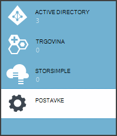
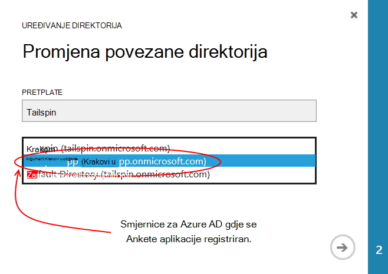
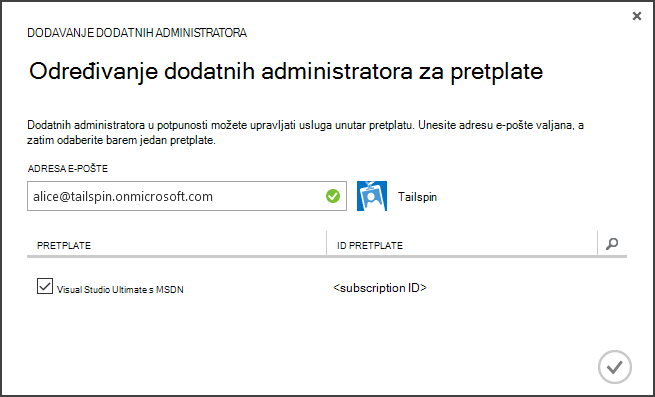
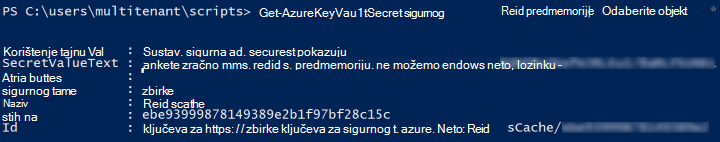

<properties
   pageTitle="Pomoću tipke sigurnog da biste zaštitili tajne aplikacije | Microsoft Azure"
   description="Kako pomoću servisa sigurnog ključ za pohranu tajne aplikacije"
   services=""
   documentationCenter="na"
   authors="MikeWasson"
   manager="roshar"
   editor=""
   tags=""/>

<tags
   ms.service="guidance"
   ms.devlang="dotnet"
   ms.topic="article"
   ms.tgt_pltfrm="na"
   ms.workload="na"
   ms.date="02/16/2016"
   ms.author="mwasson"/>

# <a name="using-azure-key-vault-to-protect-application-secrets"></a>Pomoću sigurnog Azure ključ da biste zaštitili tajne aplikacije

[AZURE.INCLUDE [pnp-header](../../includes/guidance-pnp-header-include.md)]

Ovaj je članak [dio niza]. Također je dovršena [primjer aplikacije] koja se isporučuje se uz ovaj niz.

## <a name="overview"></a>Pregled

Zajednička su postavke aplikacije koje su osjetljive i mora biti zaštićene, kao što je:

- Nizu za povezivanje baze podataka
- Lozinke
- Šifrirana tipke

Kao sigurnost praksa, nikad pohranite te tajne u izvor kontrole. Previše jednostavno im osipanje &mdash; čak i ako je vaš spremištu kod izvora privatno. I to je nije gotovo tajne iz opće javno. Na veću projektima, možda želite ograničiti koje razvojnim inženjerima i operatora možete pristupiti tajne radnog. (Postavke za testiranje ili razvoj okruženja se razlikuju).

Sigurnije mogućnosti će spremiti te tajne u [Azure ključ sigurnog][KeyVault]. Ključ sigurnog je servis oblaka hostira za upravljanje šifriranja tipke i druge tajne. U ovom se članku objašnjava koristite sigurnog ključ za pohranu konfiguracijske postavke koje aplikacije.

U [Upitnicima Tailspin] [ Surveys] aplikacije, su sljedeće postavke tajnu:

- Niz za povezivanje baze podataka.
- Niz za povezivanje Redis.
- Tajna klijenta za web-aplikaciju.

Da biste spremili tajne konfiguraciju u sigurnog ključ, aplikacija ankete implementira prilagođena konfiguracija davatelja koji spojnica u ASP.NET osnovne 1.0 [Konfiguracija sustava][configuration]. Prilagođeni davatelja čita konfiguracijske postavke iz zbirke ključeva ključa prilikom pokretanja.

Aplikacija ankete učitava konfiguracijske postavke iz sljedećih mjesta:

- Datoteka appsettings.json
- [Spremanje tajne korisnika] [ user-secrets] (razvojno okruženje samo za testiranje)
- Okruženja za hosting (postavki aplikacije u Azure web-aplikacijama)
- Ključni zbirke ključeva

Svaki od tih nadjačavanja na prethodni slajd pa sve postavke pohranjene u ključ sigurnog prednost.

> [AZURE.NOTE] Prema zadanim postavkama davatelj podataka za konfiguraciju sigurnog ključ je onemogućen. Nije potreban za pokretanje aplikacije lokalno. Je želite omogućiti radnog implementacije.

> Davatelj ključ sigurnog trenutno nije podržano za .NET Core, jer je potrebno [Microsoft.Azure.KeyVault] [ Microsoft.Azure.KeyVault] paketa.

Prilikom pokretanja aplikacije čita postavke svakog davatelja registrirani konfiguraciju i ih koristi za popunjavanje svakako upisani mogućnosti objekta. (Dodatne informacije potražite u članku [korištenjem mogućnosti i konfiguracija objekata][options].)

## <a name="implementation"></a>Implementacija

[KeyVaultConfigurationProvider] [ KeyVaultConfigurationProvider] predmete je davatelj usluga za konfiguraciju, koji se priključuje u ASP.NET osnovne 1.0 [Konfiguracija sustava][configuration].

Da biste koristili u `KeyVaultConfigurationProvider`, poziva na `AddKeyVaultSecrets` metoda kućni broj u predmete prilikom pokretanja:

```csharp
    var builder = new ConfigurationBuilder()
        .SetBasePath(appEnv.ApplicationBasePath)
        .AddJsonFile("appsettings.json");

    if (env.IsDevelopment())
    {
        builder.AddUserSecrets();
    }
    builder.AddEnvironmentVariables();
    var config = builder.Build();

    // Add key vault configuration:
    builder.AddKeyVaultSecrets(config["AzureAd:ClientId"],
        config["KeyVault:Name"],
        config["AzureAd:Asymmetric:CertificateThumbprint"],
        Convert.ToBoolean(config["AzureAd:Asymmetric:ValidationRequired"]),
        loggerFactory);
```

Primijetit ćete da `KeyVaultConfigurationProvider` zahtijeva neke postavke konfiguracije koje treba pohraniti na jedan od drugih izvora konfiguracije.

Prilikom pokretanja aplikacije `KeyVaultConfigurationProvider` zbraja sve tajne u ključa zbirke ključeva. Za svaki tajna traži oznake pod nazivom "ConfigKey". Vrijednost oznake je naziv postavke konfiguracije.

> [AZURE.NOTE] [Oznaka] [ key-tags] su neobavezno metapodaci spremljene pomoću ključa. Oznake koriste se ovdje jer nazive ne smije sadržavati dvotočku (:).

```csharp
var kvClient = new KeyVaultClient(GetTokenAsync);
var secretsResponseList = await kvClient.GetSecretsAsync(_vault, MaxSecrets, token);
foreach (var secretItem in secretsResponseList.Value)
{
    //The actual config key is stored in a tag with the Key "ConfigKey"
    // because ':' is not supported in a shared secret name by Key Vault.
    if (secretItem.Tags != null && secretItem.Tags.ContainsKey(ConfigKey))
    {
        var secret = await kvClient.GetSecretAsync(secretItem.Id, token);
        Data.Add(secret.Tags[ConfigKey], secret.Value);
    }
}
```

> [AZURE.NOTE] Potražite u članku [KeyVaultConfigurationProvider.cs].

## <a name="setting-up-key-vault-in-the-surveys-app"></a>Postavljanje ključ sigurnog u aplikaciji ankete

Preduvjeti:

- Instalacija [Azure cmdleti za upravljanje resursima][azure-rm-cmdlets].
- Konfiguriranje aplikacije ankete, kao što je opisano u [pokretanje aplikacije ankete][readme].

Više razine korake:

1. Postavljanje administrator u klijentu.
2. Postavite potvrdu klijenta.
3. Stvaranje ključa zbirke ključeva.
4. Dodajte konfiguracijske postavke vašeg ključa sigurnog.
5. Uklonite kod koji omogućuje ključa zbirke ključeva.
6. Ažurirajte tajne korisnika aplikacije.

### <a name="set-up-an-admin-user"></a>Postavljanje administrator

> [AZURE.NOTE] Da biste stvorili ključa sigurnog, morate koristiti korisnički račun koji možete upravljati Azure pretplatu. Osim toga, bilo koju aplikaciju koja autorizirali čitati iz ključa sigurnog mora registrirati u istom klijentu kao taj račun.

U ovom ćete koraku koje će provjerite, možete stvoriti ključa sigurnog dok prijavljeni kao korisnik s klijentu gdje je registrirana aplikaciju ankete.

Najprije, promijenite direktorija povezanog s pretplatom na Azure.

1. Prijavite se na [portal za upravljanje Azure][azure-management-portal]

2. Kliknite **Postavke**.

    

3. Odaberite pretplatu Azure.

4. Kliknite **Uređivanje direktorija** pri dnu portalu.

    

5. U "Promijeniti pridružene direktorij", odaberite klijenta Azure AD gdje je registrirana aplikacije ankete,

    

6. Kliknite strelicu, a zatim ispunite dijaloški okvir.

Stvaranje administrator u klijentu za Azure AD gdje je registrirana aplikacije ankete.

1. Prijava na [portal za upravljanje Azure][azure-management-portal].

2. Odaberite klijenta Azure AD gdje je registrirana vaša aplikacija.

3. Kliknite **korisnici** > **Dodavanje korisnika**.

4. U dijaloškom okviru **Dodavanje korisnika** korisniku dodijeliti uloga globalnog administratora.

Dodavanje korisnika administrator zajednički administrator za pretplatu Azure.

1. Prijava na [portal za upravljanje Azure][azure-management-portal].

2. Kliknite **Postavke** i odaberite Azure pretplatu.

3. Kliknite **Administratori**

4. Kliknite **Dodaj** pri dnu portalu.

5. Unesite adresu e-pošte korisnika administrator koji ste prethodno stvorili.

6. Potvrdite okvir za pretplatu.

7. Kliknite gumb kvačicu da biste dovršili dijaloški okvir.




### <a name="set-up-a-client-certificate"></a>Postavljanje potvrdu klijenta

1. Pokrenuti skriptu PowerShell [/Scripts/Setup-KeyVault.ps1] [ Setup-KeyVault] na sljedeći način:
    ```
    .\Setup-KeyVault.ps1 -Subject <<subject>>
    ```
    Za na `Subject` parametar, unesite ime, kao što su "surveysapp". Skripta generira samopotpisani certifikat, a sprema u spremištu certifikata "trenutnog korisnika/osobno".

2. Izlaz iz skripte je JSON fragment. Dodajte to programski manifest web-aplikacije na sljedeći način:

    1. Prijava na [portal za upravljanje Azure] [ azure-management-portal] i otiđite do Azure AD direktorija.

    2. Kliknite **aplikacije**.

    3. Odaberite aplikaciju za ankete.

    4.  Kliknite **Upravljanje manifesta** i odaberite **Preuzimanje manifesta**.

    5.  Otvorite manifesta JSON datoteku u uređivaču teksta. Zalijepite Izlaz iz skripte u na `keyCredentials` svojstvo. Trebao bi izgledati otprilike ovako:
    ```
            "keyCredentials": [
                {
                  "type": "AsymmetricX509Cert",
                  "usage": "Verify",
                  "keyId": "29d4f7db-0539-455e-b708-....",
                  "customKeyIdentifier": "ZEPpP/+KJe2fVDBNaPNOTDoJMac=",
                  "value": "MIIDAjCCAeqgAwIBAgIQFxeRiU59eL.....
                }
              ],
    ```          
    6.  Da biste spremili promjene u datoteku JSON.

    7.  Vratite se na portal. Kliknite **Upravljanje manifesta** > **Prijenos manifesta** i prijenos datoteka JSON.

3. Dodajte isti fragment JSON programski manifest API-JA (Surveys.WebAPI) web-mjesta.

4. Pokrenite sljedeću naredbu da biste dobili otisak prsta potvrde.
    ```
    certutil -store -user my [subject]
    ```
    gdje `[subject]` je vrijednost koju ste naveli za predmet u skriptu PowerShell. Na otisak prsta nalazi se u odjeljku "Certifikata Hash(sha1)". Uklanjanje razmaka između heksadecimalnu vrijednost broja.

Na otisak prsta će koristiti kasnije.

### <a name="create-a-key-vault"></a>Stvaranje ključa zbirke ključeva

1. Pokrenuti skriptu PowerShell [/Scripts/Setup-KeyVault.ps1] [ Setup-KeyVault] na sljedeći način:

    ```
    .\Setup-KeyVault.ps1 -KeyVaultName <<key vault name>> -ResourceGroupName <<resource group name>> -Location <<location>>
    ```

    Kada se pojavi upit za vjerodajnice, prijavite se kao korisnik Azure AD koji ste stvorili ranije. Skripta stvara novu grupu resursa i novi ključ sigurnog u toj grupi resursa.

    Napomena: parametra-mjesta, koristite sljedeću naredbu komponente PowerShell da biste dobili popis valjanih područja:

    ```
    Get-AzureRmResourceProvider -ProviderNamespace "microsoft.keyvault" | Where-Object { $_.ResourceTypes.ResourceTypeName -eq "vaults" } | Select-Object -ExpandProperty Locations
    ```

2. Ponovno pokrenite SetupKeyVault.ps pomoću sljedećih parametara:

    ```
    .\Setup-KeyVault.ps1 -KeyVaultName <<key vault name>> -ApplicationIds @("<<web app client ID>>", "<<web API client ID>>")
    ```

    gdje

    - Ključni sigurnog naziv = naziv koji ste dodijelili ključa sigurnog u prethodnom koraku.
    - web-aplikacije ID klijenta = ID klijenta za web-aplikaciju ankete.
    - web-ID klijenta api = ID klijenta za aplikaciju Surveys.WebAPI.

    Primjer:
    ```
    .\Setup-KeyVault.ps1 -KeyVaultName tailspinkv -ApplicationIds @("f84df9d1-91cc-4603-b662-302db51f1031", "8871a4c2-2a23-4650-8b46-0625ff3928a6")
    ```

    > [AZURE.NOTE] Možete dobiti klijent ID-a za [portal za upravljanje Azure][azure-management-portal]. Odaberite Azure AD klijent, odaberite aplikaciju i kliknite **Konfiguriraj**.

    Ova skripta neadministratorskog web app i API web dohvatiti tajne iz vaše ključa zbirke ključeva. Potražite u članku [Početak rada s Azure ključ sigurnog] [ authorize-app] dodatne informacije.

### <a name="add-configuration-settings-to-your-key-vault"></a>Dodavanje konfiguracijske postavke vašeg ključa sigurnog

1. Pokrenite SetupKeyVault.ps na sljedeći način:

    ```
    .\Setup-KeyVault.ps1 -KeyVaultName <<key vault name> -KeyName RedisCache -KeyValue "<<Redis DNS name>>.redis.cache.windows.net,password=<<Redis access key>>,ssl=true" -ConfigName "Redis:Configuration"
    ```
    gdje

    - Ključni sigurnog naziv = naziv koji ste dodijelili ključa sigurnog u prethodnom koraku.
    - Redis DNS naziv = naziv u DNS-a vaše Redis predmemorije instance.
    - Tipka za pristup redis = tipkovni prečac za vaše instancu predmemorije Redis.

    Ta se naredba dodaje u tajna vaše ključa sigurnog. Na tajna je naziv/vrijednost par plus oznake:

    -   Naziv ključa ne koristi aplikacija, ali mora biti jedinstvena u sigurnog ključ.
    -   Vrijednost je vrijednost argumenta mogućnost konfiguracija, u ovom slučaju Redis niz za povezivanje.
    -   oznake "ConfigKey" sadrži naziv ključ konfiguracije.

2. Sada je poželjno testirati li uspješno pohranjene tajne za ključne zbirke ključeva. Pokrenite sljedeću naredbu komponente PowerShell:

    ```
    Get-AzureKeyVaultSecret <<key vault name>> RedisCache | Select-Object *
    ```
    Izlaz trebao pokazati tajnu vrijednost plus neke metapodatke:

    

3. Pokrenite SetupKeyVault.ps ponovno da biste dodali niz za povezivanje baze podataka:

    ```
    .\Setup-KeyVault.ps1 -KeyVaultName <<key vault name> -KeyName ConnectionString -KeyValue <<DB connection string>> -ConfigName "Data:SurveysConnectionString"
    ```

    gdje `<<DB connection string>>` vrijednost niza za povezivanje baze podataka.

    Za testiranje s lokalnom bazom podataka, kopirajte niz za povezivanje iz datoteke Tailspin.Surveys.Web/appsettings.json. Ako to učinite, provjerite je li da biste promijenili dvostruki obrnutu kosu crtu ('\\\\') u jednom obrnutu kosu crtu. Dvostruki obrnutu kosu crtu je prespojni znak u datoteci JSON.

    Primjer:

    ```
    .\Setup-KeyVault.ps1 -KeyVaultName mykeyvault -KeyName ConnectionString -KeyValue "Server=(localdb)\MSSQLLocalDB;Database=Tailspin.SurveysDB;Trusted_Connection=True;MultipleActiveResultSets=true" -ConfigName "Data:SurveysConnectionString"
    ```

### <a name="uncomment-the-code-that-enables-key-vault"></a>Uklonite kod koji omogućuje sigurnog ključ

1. Otvorite Tailspin.Surveys rješenje.

2. U [Tailspin.Surveys.Web/Startup.cs][web-startup], pronađite sljedeće blokova Šifra i uklonite ga.

    ```csharp
    //#if DNX451
    //            _configuration = builder.Build();
    //            builder.AddKeyVaultSecrets(_configuration["AzureAd:ClientId"],
    //                _configuration["KeyVault:Name"],
    //                _configuration["AzureAd:Asymmetric:CertificateThumbprint"],
    //                Convert.ToBoolean(_configuration["AzureAd:Asymmetric:ValidationRequired"]),
    //                loggerFactory);
    //#endif
    ```

3. U [Tailspin.Surveys.WebAPI/Startup.cs][web-api-startup], pronađite sljedeće blokova Šifra i uklonite ga.

    ```csharp
    //#if DNX451
    //            var config = builder.Build();
    //            builder.AddKeyVaultSecrets(config["AzureAd:ClientId"],
    //                config["KeyVault:Name"],
    //                config["AzureAd:Asymmetric:CertificateThumbprint"],
    //                Convert.ToBoolean(config["AzureAd:Asymmetric:ValidationRequired"]),
    //                loggerFactory);
    //#endif
    ```

4. U [Tailspin.Surveys.Web/Startup.cs][web-startup], pronađite šifru koja registrira u `ICredentialService`. Uklonite redak koji koristi `CertificateCredentialService`, i komentar izgleda u retku koji koristi `ClientCredentialService`:

    ```csharp
    // Uncomment this:
    services.AddSingleton<ICredentialService, CertificateCredentialService>();
    // Comment out this:
    //services.AddSingleton<ICredentialService, ClientCredentialService>();
    ```

    Ta promjena omogućuje web-aplikaciju da biste koristili [klijent pridruživanju] [ client-assertion] da biste dobili OAuth pristupna tokena. S pridruživanju klijent, ne morate je tajna OAuth klijenta. Osim toga, koje ste pohranili tajna klijenta na ključa zbirke ključeva. Međutim, ključa sigurnog i pridruživanju klijent koristiti klijent certifikata, tako da bude Ako omogućite ključa sigurnog preporučuje da biste omogućili kao i pridruživanju klijenta.

### <a name="update-the-user-secrets"></a>Ažuriranje tajne korisnika

U pregledniku rješenja, desnom tipkom miša kliknite projekt Tailspin.Surveys.Web i odaberite **Upravljanje tajne korisnika**. U datoteci secrets.json, izbrišite postojeće JSON i zalijepite na sljedećim mjestima:

    ```
    {
      "AzureAd": {
        "ClientId": "[Surveys web app client ID]",
        "PostLogoutRedirectUri": "https://localhost:44300/",
        "WebApiResourceId": "[App ID URI of your Surveys.WebAPI application]",
        "Asymmetric": {
          "CertificateThumbprint": "[certificate thumbprint. Example: 105b2ff3bc842c53582661716db1b7cdc6b43ec9]",
          "StoreName": "My",
          "StoreLocation": "CurrentUser",
          "ValidationRequired": "false"
        }
      },
      "KeyVault": {
        "Name": "[key vault name]"
      }
    }
    ```

Unosi u [uglatim zagradama] zamijenite odgovarajuće vrijednosti.

- `AzureAd:ClientId`ID klijenta: aplikaciju ankete.
- `AzureAd:WebApiResourceId`: Aplikacije ID URI koji ste naveli kada ste stvorili Surveys.WebAPI aplikacije u Azure AD.
- `Asymmetric:CertificateThumbprint`: Otisak prsta na certifikatu koju ste dobili prethodno, prilikom stvaranja certifikat klijenta.
- `KeyVault:Name`: Naziv vaše ključa zbirke ključeva.

> [AZURE.NOTE] `Asymmetric:ValidationRequired`je false jer certifikat koji ste prethodno stvorili nije potpisao na korijenska ustanova za izdavanje certifikata (CA). U proizvodnje, pomoću certifikata koji je potpisao korijenski CA i postavljanje `ValidationRequired` na true.

Spremite datoteku ažurirane secrets.json.

Nakon toga u pregledniku rješenja, desnom tipkom miša kliknite projekt Tailspin.Surveys.WebApi i odaberite **Upravljanje tajne korisnika**. Brisanje postojeće JSON i zalijepite sljedeće:

```
{
  "AzureAd": {
    "ClientId": "[Surveys.WebAPI client ID]",
    "WebApiResourceId": "https://tailspin5.onmicrosoft.com/surveys.webapi",
    "Asymmetric": {
      "CertificateThumbprint": "[certificate thumbprint]",
      "StoreName": "My",
      "StoreLocation": "CurrentUser",
      "ValidationRequired": "false"
    }
  },
  "KeyVault": {
    "Name": "[key vault name]"
  }
}
```

Zamijeni stavke u [uglatim zagradama], a zatim spremite datoteku secrets.json.

> [AZURE.NOTE] Web-API provjerite je li koristiti ID klijenta za aplikaciju Surveys.WebAPI, ne aplikacije ankete.


<!-- Links -->
[authorize-app]: ../key-vault/key-vault-get-started.md/#authorize
[azure-management-portal]: https://manage.windowsazure.com/
[azure-rm-cmdlets]: https://msdn.microsoft.com/library/mt125356.aspx
[client-assertion]: guidance-multitenant-identity-client-assertion.md
[configuration]: https://docs.asp.net/en/latest/fundamentals/configuration.html
[KeyVault]: https://azure.microsoft.com/services/key-vault/
[KeyVaultConfigurationProvider]: https://github.com/Azure-Samples/guidance-identity-management-for-multitenant-apps/blob/master/src/Tailspin.Surveys.Configuration.KeyVault/KeyVaultConfigurationProvider.cs
[key-tags]: https://msdn.microsoft.com/library/azure/dn903623.aspx#BKMK_Keytags
[Microsoft.Azure.KeyVault]: https://www.nuget.org/packages/Microsoft.Azure.KeyVault/
[options]: https://docs.asp.net/en/latest/fundamentals/configuration.html#using-options-and-configuration-objects
[readme]: https://github.com/Azure-Samples/guidance-identity-management-for-multitenant-apps/blob/master/docs/running-the-app.md
[Setup-KeyVault]: https://github.com/Azure-Samples/guidance-identity-management-for-multitenant-apps/blob/master/scripts/Setup-KeyVault.ps1
[Surveys]: guidance-multitenant-identity-tailspin.md
[user-secrets]: http://go.microsoft.com/fwlink/?LinkID=532709
[web-startup]: https://github.com/Azure-Samples/guidance-identity-management-for-multitenant-apps/blob/master/src/Tailspin.Surveys.Web/Startup.cs
[web-api-startup]: https://github.com/Azure-Samples/guidance-identity-management-for-multitenant-apps/blob/master/src/Tailspin.Surveys.WebAPI/Startup.cs
[dio niza]: guidance-multitenant-identity.md
[KeyVaultConfigurationProvider.cs]: https://github.com/Azure-Samples/guidance-identity-management-for-multitenant-apps/blob/master/src/Tailspin.Surveys.Configuration.KeyVault/KeyVaultConfigurationProvider.cs
[primjer aplikacije]: https://github.com/Azure-Samples/guidance-identity-management-for-multitenant-apps
