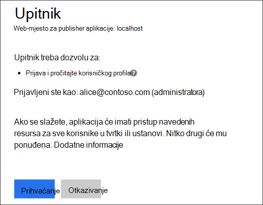
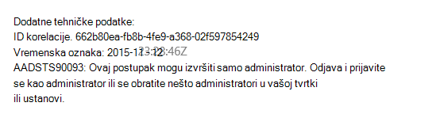
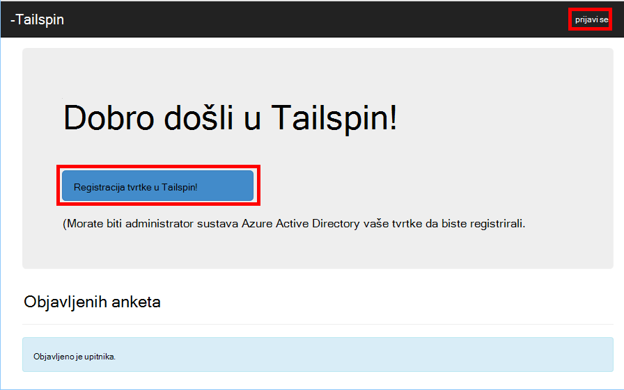
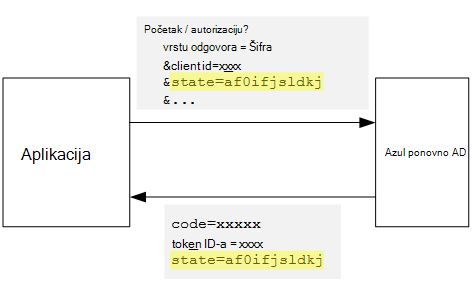
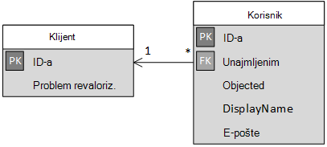

<properties
   pageTitle="Prijava i smjernice za uhodavanje u složene aplikacije | Microsoft Azure"
   description="Kako onboard klijenata u složene aplikacije"
   services=""
   documentationCenter="na"
   authors="MikeWasson"
   manager="roshar"
   editor=""
   tags=""/>

<tags
   ms.service="guidance"
   ms.devlang="dotnet"
   ms.topic="article"
   ms.tgt_pltfrm="na"
   ms.workload="na"
   ms.date="05/23/2016"
   ms.author="mwasson"/>

# <a name="sign-up-and-tenant-onboarding-in-a-multitenant-application"></a>Prijava i smjernice za uhodavanje u složene aplikacije

[AZURE.INCLUDE [pnp-header](../../includes/guidance-pnp-header-include.md)]

Ovaj je članak [dio niza]. Također je dovršena [primjer aplikacije] koja se isporučuje se uz ovaj niz.

U ovom se članku opisuje kako implementirati na _registracije_ procesa u aplikaciji za više korisnika, koji omogućuje kupac registrirati svoje tvrtke ili ustanove za svoju aplikaciju.
Postoji nekoliko razloga za implementaciju registracije procesa:

-   Dopusti administrator AD za pristanak na kupca cijelu tvrtku ili ustanovu da biste koristili aplikaciju.
-   Prikupljanje plaćanja kreditnom karticom ili druge informacije o klijentu.
-   Izvođenje bilo koje postavljanje jednokratni klijentu potrebne za svoju aplikaciju.

## <a name="admin-consent-and-azure-ad-permissions"></a>Dozvole za administratore i dozvole za Azure AD

Da bi se provjeru autentičnosti Azure AD, aplikacija treba pristup korisnikove mape. Barem aplikacija mora dozvolu za čitanje na korisnikovu profilu. Prilikom prve prijave, Azure AD prikazuje pristanak stranicu koja sadrži popis Tražena dozvole. Tako da kliknete **Prihvati**, korisnik daje dozvolu za aplikaciju.

Prema zadanim postavkama, moguć je pristanak na temelju po korisniku. Svaki korisnik koji se prijavi vidi stranici pristanak. Međutim, Azure AD podržava _administratorske dozvole_, koji omogućuje administrator AD pristanak za cijelu tvrtku ili ustanovu.

Kada se koristi tijek pristanak administrator, stranici pristanak stoji da je administrator AD dodjelu dozvole ime cijeli klijent:



Kada administrator klikne **Prihvati**, drugim korisnicima u istom klijentu mogu se prijaviti u i Azure AD će preskočiti pristanak zaslona.

Samo administrator AD možete dodijeliti administratorske dozvole, jer se dodjeljuje dozvole ime cijelu tvrtku ili ustanovu. Ako je koji nisu administratori pokuša autentičnost tokove administratorske dozvole, Azure AD prikazuje pogreška:



Ako aplikacija zahtijeva dodatne dozvole u trenutku kasnije, kupca morat ćete ponovno prijaviti i pristanak ažurirane dozvola.  

## <a name="implementing-tenant-sign-up"></a>Implementacijom klijentu za prijavu

Za [Ankete Tailspin] [ Tailspin] aplikacije, definirali nekoliko preduvjeti za postupak prijave:

-   Klijent morate se prijaviti prije nego što se korisnici mogli prijaviti.
-   Prijava koristi tijek pristanak za administratore.
-   Prijava dodaje korisnika klijentu aplikacije baze podataka.
-   Nakon klijentom registrira, aplikacija prikazuje na stranici za uhodavanje.

U ovom ćete odjeljku ćemo vas provesti kroz naš implementaciju postupka prijave.
Važno je da biste razumjeli te "Registracija" i "Prijava" je pojam u aplikaciji. Tijekom provjere autentičnosti tijeka Azure AD ne čini znati je li korisnik procesu registracije. Je prema gore na aplikaciju za praćenje kontekstu.

Kada anonimni korisnik posjeti aplikacije ankete, korisnik je prikazana dva gumba, jedan za prijavu i jedan "Registracija tvrtke" (Prijava).



Ovi gumbi pozivanje akcije u predmete [AccountController] .

Na `SignIn` akcija vraća na **ChallegeResult**, čime će se proizvod OpenID povezivanje da biste preusmjerili krajnja točka za provjeru autentičnosti. To je zadani način za pokretanje provjere autentičnosti u ASP.NET osnovne 1.0.  

```csharp
[AllowAnonymous]
public IActionResult SignIn()
{
    return new ChallengeResult(
        OpenIdConnectDefaults.AuthenticationScheme,
        new AuthenticationProperties
        {
            IsPersistent = true,
            RedirectUri = Url.Action("SignInCallback", "Account")
        });
}
```

Sada Usporedi s `SignUp` akcija:

```csharp
[AllowAnonymous]
public IActionResult SignUp()
{
    // Workaround for https://github.com/aspnet/Security/issues/546
    HttpContext.Items.Add("signup", "true");

    var state = new Dictionary<string, string> { { "signup", "true" }};
    return new ChallengeResult(
        OpenIdConnectDefaults.AuthenticationScheme,
        new AuthenticationProperties(state)
        {
            RedirectUri = Url.Action(nameof(SignUpCallback), "Account")
        });
}
```

Kao što su `SignIn`, `SignUp` akcija i vraća na `ChallengeResult`. No ovaj put dodat ćemo neku informaciju stanja da biste na `AuthenticationProperties` u na `ChallengeResult`:

-   Prijava: Booleova zastavice koja označava da je korisnik počeo postupka prijave.

Informacije o stanju u `AuthenticationProperties` dodaje [Stanje] parametar OpenID povezivanje koji se zaokružiti trips tijekom tijek provjere autentičnosti.



Kada korisnik potvrđuje u Azure AD pa prosljeđuje natrag u aplikaciji, karata provjere autentičnosti sadrži stanje. Ne možemo pomoću ovog fact provjerite je li vrijednost "Prijava" Nastavi preko cijele provjere autentičnosti tijek.

## <a name="adding-the-admin-consent-prompt"></a>Dodavanje upita pristanak za administratore

U Azure AD pristanak tijek administrator aktivira dodavanjem "pitanje" parametra niza upita u zahtjev za provjeru autentičnosti:

```
/authorize?prompt=admin_consent&...
```

Aplikacija ankete dodaje upita tijekom na `RedirectToAuthenticationEndpoint` događaj. Ovaj događaj naziva desno prije nego što se preusmjerava na proizvod krajnja točka za provjeru autentičnosti.

```csharp
public override Task RedirectToAuthenticationEndpoint(RedirectContext context)
{
    if (context.IsSigningUp())
    {
        context.ProtocolMessage.Prompt = "admin_consent";
    }

    _logger.RedirectToIdentityProvider();
    return Task.FromResult(0);
}
```

> [AZURE.NOTE] Potražite u članku [SurveyAuthenticationEvents.cs].

Postavljanje` ProtocolMessage.Prompt` govori proizvod da biste dodali parametar "pitanje" zahtjev za provjeru autentičnosti.

Imajte na umu da se upit samo potrebne prilikom registracije. Uobičajeni prijava smije sadržavati ga. Da biste razlikovali ih, ne možemo potražite na `signup` vrijednost u stanju provjere autentičnosti. Proširenje metodu sljedeće provjerava ovaj uvjet:

```csharp
internal static bool IsSigningUp(this BaseControlContext context)
{
    Guard.ArgumentNotNull(context, nameof(context));

    string signupValue;
    object obj;
    // Check the HTTP context and convert to string
    if (context.HttpContext.Items.TryGetValue("signup", out obj))
    {
        signupValue = (string)obj;
    }
    else
    {
        // It's not in the HTTP context, so check the authentication ticket.  If it's not there, we aren't signing up.
        if ((context.AuthenticationTicket == null) ||
            (!context.AuthenticationTicket.Properties.Items.TryGetValue("signup", out signupValue)))
        {
            return false;
        }
    }

    // We have found the value, so see if it's valid
    bool isSigningUp;
    if (!bool.TryParse(signupValue, out isSigningUp))
    {
        // The value for signup is not a valid boolean, throw                
        throw new InvalidOperationException($"'{signupValue}' is an invalid boolean value");
    }

    return isSigningUp;
}
```

> [AZURE.NOTE] Potražite u članku [BaseControlContextExtensions.cs].

> [AZURE.NOTE] Napomena: Kod obuhvaća zaobilazno rješenje za poznatih problema u ASP.NET osnovne 1.0 RC1. U na `RedirectToAuthenticationEndpoint` događaj, ne postoji način da biste dobili svojstva provjere autentičnosti koja sadrži stanje "Prijava". Kao zaobilazno rješenje, na `AccountController.SignUp` način stavlja i stanje "Prijava" u na `HttpContext`. To funkcionira jer `RedirectToAuthenticationEndpoint` će se dogoditi prije preusmjeravanja, pa ćemo i dalje imati isti `HttpContext`.

## <a name="registering-a-tenant"></a>Registracija klijenta

Aplikacija ankete sprema neke informacije o svakom klijenta i korisnika u bazi podataka za aplikacije.



U tablici klijentu IssuerValue je vrijednost izdavač zahtjeva za klijenta. Za Azure AD, to je `https://sts.windows.net/<tentantID>` i daje jedinstvene vrijednosti po klijentu.

Kada novi klijent registrira, aplikacija ankete piše klijentu zapisa u bazu podataka. To se događa unutar na `AuthenticationValidated` događaj. (Nemojte učiniti ga prije događaja, jer token ID-a ne nastavlja se još, tako da ne smatrate li vrijednosti zahtjeva. U odjeljku [Provjera autentičnosti].

Evo odgovarajuću šifru iz aplikacije ankete:

```csharp
public override async Task AuthenticationValidated(AuthenticationValidatedContext context)
{
    var principal = context.AuthenticationTicket.Principal;
    var userId = principal.GetObjectIdentifierValue();
    var tenantManager = context.HttpContext.RequestServices.GetService<TenantManager>();
    var userManager = context.HttpContext.RequestServices.GetService<UserManager>();
    var issuerValue = principal.GetIssuerValue();
    _logger.AuthenticationValidated(userId, issuerValue);

    // Normalize the claims first.
    NormalizeClaims(principal);
    var tenant = await tenantManager.FindByIssuerValueAsync(issuerValue)
        .ConfigureAwait(false);

    if (context.IsSigningUp())
    {
        // Originally, we were checking to see if the tenant was non-null, however, this would not allow
        // permission changes to the application in AAD since a re-consent may be required.  Now we just don't
        // try to recreate the tenant.
        if (tenant == null)
        {
            tenant = await SignUpTenantAsync(context, tenantManager)
                .ConfigureAwait(false);
        }

        // In this case, we need to go ahead and set up the user signing us up.
        await CreateOrUpdateUserAsync(context.AuthenticationTicket, userManager, tenant)
            .ConfigureAwait(false);
    }
    else
    {
        if (tenant == null)
        {
            _logger.UnregisteredUserSignInAttempted(userId, issuerValue);
            throw new SecurityTokenValidationException($"Tenant {issuerValue} is not registered");
        }

        await CreateOrUpdateUserAsync(context.AuthenticationTicket, userManager, tenant)
            .ConfigureAwait(false);
    }
}
```

> [AZURE.NOTE] Potražite u članku [SurveyAuthenticationEvents.cs].

Kod čini sljedeće:

1.  Provjera je li vrijednost izdavača na klijentu već u bazi podataka. Ako klijent sadrži niste prijavljeni, `FindByIssuerValueAsync` vraća vrijednost null.
2.  Ako je registracija korisnika:
  1.    Dodavanje klijenta u bazu podataka (`SignUpTenantAsync`).
  2.    Dodavanje korisnika čija je autentičnost provjerena u bazu podataka (`CreateOrUpdateUserAsync`).
3.  U suprotnom ispunite uobičajenim tijekom za prijavu:
  1.    Ako na klijentu izdavač nije pronađen u bazi podataka, znači da nije registriran na klijentu i klijent mora registrirati. U tom slučaju vratiti iznimku uzrokuju provjeru autentičnosti nije uspjela.
  2.    U suprotnom, stvorite zapis baze podataka za tog korisnika ako ne postoji jedan već (`CreateOrUpdateUserAsync`).

Evo [SignUpTenantAsync] način koji se dodaje na klijentu s bazom podataka.

```csharp
private async Task<Tenant> SignUpTenantAsync(BaseControlContext context, TenantManager tenantManager)
{
    Guard.ArgumentNotNull(context, nameof(context));
    Guard.ArgumentNotNull(tenantManager, nameof(tenantManager));

    var principal = context.AuthenticationTicket.Principal;
    var issuerValue = principal.GetIssuerValue();
    var tenant = new Tenant
    {
        IssuerValue = issuerValue,
        Created = DateTimeOffset.UtcNow
    };

    try
    {
        await tenantManager.CreateAsync(tenant)
            .ConfigureAwait(false);
    }
    catch(Exception ex)
    {
        _logger.SignUpTenantFailed(principal.GetObjectIdentifierValue(), issuerValue, ex);
        throw;
    }

    return tenant;
}
```

Ovo je sažetak cijeli tijek prijave u aplikaciji ankete:

1.  Korisnik klikne gumb **Potpiši gore** .
2.  Na `AccountController.SignUp` akcija vraća rezultat challege.  Stanje provjere autentičnosti sadrži vrijednost "Prijava".
3.  U na `RedirectToAuthenticationEndpoint` događaj, dodavanje u `admin_consent` upit.
4.  Proizvod OpenID povezivanje preusmjerava Azure AD i potvrđuje korisnika.
5.  U na `AuthenticationValidated` događaj, potražite "Prijava" stanje.
6.  Dodavanje klijenta u bazu podataka.

## <a name="next-steps"></a>Daljnji koraci

- Pročitajte sljedeći članak u ovom nizu: [aplikacija ulogama u složene aplikacije][app roles]


<!-- Links -->
[app roles]: guidance-multitenant-identity-app-roles.md
[Tailspin]: guidance-multitenant-identity-tailspin.md
[dio niza]: guidance-multitenant-identity.md
[AccountController]: https://github.com/Azure-Samples/guidance-identity-management-for-multitenant-apps/blob/master/src/Tailspin.Surveys.Web/Controllers/AccountController.cs
[Stanje]: http://openid.net/specs/openid-connect-core-1_0.html#AuthRequest
[SurveyAuthenticationEvents.cs]: https://github.com/Azure-Samples/guidance-identity-management-for-multitenant-apps/blob/master/src/Tailspin.Surveys.Web/Security/SurveyAuthenticationEvents.cs
[BaseControlContextExtensions.cs]: https://github.com/Azure-Samples/guidance-identity-management-for-multitenant-apps/blob/master/src/Tailspin.Surveys.Web/Security/BaseControlContextExtensions.cs
[Provjera autentičnosti]: guidance-multitenant-identity-authenticate.md
[SignUpTenantAsync]: https://github.com/Azure-Samples/guidance-identity-management-for-multitenant-apps/blob/master/src/Tailspin.Surveys.Web/Security/SurveyAuthenticationEvents.cs
[primjer aplikacije]: https://github.com/Azure-Samples/guidance-identity-management-for-multitenant-apps
