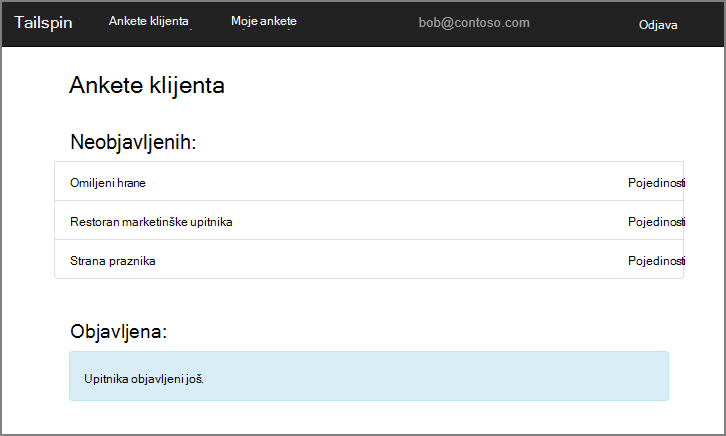

<properties
   pageTitle="O aplikaciji ankete Tailspin | Microsoft Azure"
   description="Pregled aplikacija za tailspin ankete"
   services=""
   documentationCenter="na"
   authors="MikeWasson"
   manager="roshar"
   editor=""
   tags=""/>

<tags
   ms.service="guidance"
   ms.devlang="dotnet"
   ms.topic="article"
   ms.tgt_pltfrm="na"
   ms.workload="na"
   ms.date="05/23/2016"
   ms.author="mwasson"/>

# O aplikaciji Tailspin ankete

[AZURE.INCLUDE [pnp-header](../../includes/guidance-pnp-header-include.md)]

Ovaj je članak [dio niza]. Također je dovršena [primjer aplikacije] koja se isporučuje se uz ovaj niz.

Tailspin je izmišljeni tvrtku koja je razvoj SaaS aplikacije pod nazivom ankete. Ova aplikacija omogućuje tvrtke i ustanove za stvaranje i objavljivanje online ankete.

- Tvrtki ili ustanovi registrirati za aplikaciju.
- Kada se registrirali tvrtke ili ustanove, korisnici mogu se prijaviti u aplikaciju pomoću vjerodajnica za tvrtke ili ustanove.
- Korisnici mogu stvaranje, uređivanje i objavljivanje ankete.

> [AZURE.NOTE] Početak rada s aplikacijom, potražite u članku [pokretanje aplikacije ankete].

## Korisnici mogu stvaranje, uređivanje i prikaz ankete

Korisnik sustava čija je autentičnost provjerena možete pregledavati ankete koje on je stvorio ili je prava suradnika da biste i stvaranje nove ankete. Obratite pozornost na to da je korisnik prijavljen pomoću svoj identitet tvrtke ili ustanove, `bob@contoso.com`.

Snimka zaslona prikazuje stranice Uređivanje upitnika:

Korisnici mogu vidjeti i sve ankete stvorili drugi korisnici u istom klijentu.

## Vlasnici upitnik možete pozvati suradnika

Kada korisnik stvara upitnik, on može Pozovite druge korisnike da se suradnika na upitnik. Suradnici možete uređivanje upitnik, ali ne možete izbrisati ili ga objavite.  

Korisnik može dodati suradnici s drugim korisnicima, koji omogućuje unakrsno klijentu zajedničkog korištenja resursa. U ovom snimka Teo (`bob@contoso.com`) dodaje Alice (`alice@fabrikam.com`) kao suradnika u upitnik stvorenog Teo.

Kada se Alice prijavi, Ana vidi upitnik koji se nalazi u odjeljku "Ankete I mogu pridonijeti".

Imajte na umu da se Alice u svoju klijent, a ne kao gost Contoso klijenta. Alice sadrži suradničke dozvole samo za tu anketu &mdash; ona ne možete prikazati druge ankete iz klijenta Contoso.

## Arhitektura

Aplikacija ankete sastoji se od web-sučelja i pozadinskog za API na webu. Obje se implementirati pomoću [platforme ASP.NET osnovne 1.0].

Web-aplikacija koristi Azure Active Directory (Azure AD) za provjeru autentičnosti korisnika. Web-aplikaciju poziva i Azure AD da biste dobili OAuth 2 pristupna tokena za Web API. Pristupna tokena predmemoriraju u predmemoriji Redis Azure. Predmemoriju omogućuje više instanci da biste zajednički koristili isti tokena predmemorije (npr., u farmu poslužitelja).

## Daljnji koraci

- Pročitajte sljedeći članak u ovom nizu: [Provjera autentičnosti u složene aplikacije pomoću servisa Azure Active Directory i povezivanje OpenID][authentication]

<!-- Links -->

[authentication]: guidance-multitenant-identity-authenticate.md
[dio niza]: guidance-multitenant-identity.md
[Pokretanje aplikacije ankete]: https://github.com/Azure-Samples/guidance-identity-management-for-multitenant-apps/blob/master/docs/running-the-app.md
[Temeljni ASP.NET 1.0]: https://docs.asp.net/en/latest/
[primjer aplikacije]: https://github.com/Azure-Samples/guidance-identity-management-for-multitenant-apps
