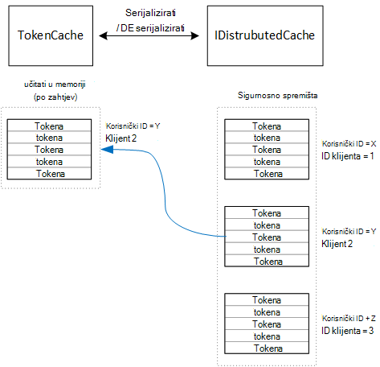

<properties
   pageTitle="Predmemoriranje pristup tokena u složene aplikacije | Microsoft Azure"
   description="Predmemoriranje tokeni access koristi za pozivanje pozadinskog Web API"
   services=""
   documentationCenter="na"
   authors="MikeWasson"
   manager="roshar"
   editor=""
   tags=""/>

<tags
   ms.service="guidance"
   ms.devlang="dotnet"
   ms.topic="article"
   ms.tgt_pltfrm="na"
   ms.workload="na"
   ms.date="02/16/2016"
   ms.author="mwasson"/>


# <a name="caching-access-tokens-in-a-multitenant-application"></a>Predmemoriranje tokena programa access u složene aplikacije

[AZURE.INCLUDE [pnp-header](../../includes/guidance-pnp-header-include.md)]

Ovaj je članak [dio niza]. Također je dovršena [primjer aplikacije] koja se isporučuje se uz ovaj niz.

To je relativno skupi da biste pristupili programa OAuth tokena, jer je potrebno HTTP zahtjev za krajnju točku tokena. Dakle, dobro je predmemorije tokeni kad god je moguće. [Provjera autentičnosti biblioteke imenika Azure AD] [ ADAL] (ADAL) automatski sprema tokeni dobivenog Azure AD, uključujući tokeni osvježavanja.

ADAL pruža zadane tokena predmemorije implementacije. Međutim, ovaj tokena predmemorije namijenjen nativni klijent aplikacije, a je _nije_ prikladna za web-aplikacije:

-   Je statičnog instancu, a ne niti sigurni.
-   Ga ne skaliranje velikom broju korisnika, jer tokena iz svih korisnika idu u istom rječnika.
-   Ne mogu koristiti u web-poslužiteljima u farmi.

Umjesto toga, trebali biste implementirati prilagođeni predmemorije tokena rezultat s ADAL `TokenCache` predmete ali je prikladna za okruženju poslužitelja i njihovi poželjno razine odvajanja tokeni za različite korisnike.

Na `TokenCache` spremišta klasa rječnik tokena, indeksirati izdavača, resursa, ID klijenta i korisnika. Prilagođeni tokena predmemorije trebate upisati ovaj rječnik sigurnosnom Store, kao što su Redis predmemoriju.

U aplikaciji Tailspin ankete u `DistributedTokenCache` predmete implementira tokena predmemoriju. Ova implementacija koristi [IDistributedCache] [ distributed-cache] apstrakcije iz ASP.NET osnovne 1.0. Na taj način, sve `IDistributedCache` implementaciju mogu se koristiti kao sigurnosnom trgovine.

-   Prema zadanim postavkama aplikaciju ankete koristi Redis predmemoriju.
-   Za jednokratni web-poslužitelj, možete koristiti ASP.NET osnovne 1.0 [predmemorije u memoriji][in-memory-cache]. (To je također dobar izbor za pokretanje aplikacije lokalno tijekom razvoja.)

> [AZURE.NOTE] Trenutno predmemoriju Redis nije podržana za .NET Core.

`DistributedTokenCache`sprema predmemoriju podatke kao parove ključa vrijednosti u spremištu sigurnosnom. Ključno je korisnički ID i ID klijenta, pa spremište sigurnosnom sadrži zasebnom predmemorije podatke za svaku jedinstveni kombinaciju korisnika/klijent.



U sigurnosnom spremište particije je korisnik. Za svaki zahtjev HTTP čitanje iz spremišta sigurnosnom i učitava u tokeni za tog korisnika na `TokenCache` rječnik. Ako Redis koristi se kao spremište sigurnosnom svaku instancu server u farmi poslužitelja čitanja/pisanja u istom predmemoriju i taj se način mijenja veličinu na mnogo korisnika.

## <a name="encrypting-cached-tokens"></a>Šifriranje predmemorirani tokena

Tokeni su povjerljive podatke jer su dopustiti pristup korisničke resursi. (Nadalje, za razliku od korisničke lozinke ne možete jednostavno spremiti raspršivanje tokena.) Stoga je važnosti da biste zaštitili tokena iz se ugrožena. Predmemoriju Redis sigurnosno je zaštićena lozinkom, ali nije moguće ako netko dohvaća lozinke, sve predmemorirane pristup tokeni dobiti. Zbog toga u `DistributedTokenCache` šifrira sve što je zapisuju u trgovini sigurnosnom. Šifriranje obavlja ASP.NET osnovne 1.0 [Zaštita podataka] pomoću[ data-protection] API-ji.

> [AZURE.NOTE] Ako pokrenete za Azure web-mjesta, ključeve za šifriranje su sigurnosnu kopiju na mreži prostora za pohranu i sinkronizira se na svim računalima (potražite u članku [Upravljanje ključevima][key-management]). Po zadanom, ključeve nisu šifrirane kada se pokrene u Azure web-mjesta, ali možete [omogućiti šifriranje pomoću X.509 certifikat][x509-cert-encryption].


## <a name="distributedtokencache-implementation"></a>Implementacija DistributedTokenCache

[DistributedTokenCache] [ DistributedTokenCache] predmete izvedena iz ADAL [TokenCache] [ tokencache-class] predmete.

U Graditelj, u `DistributedTokenCache` predmete stvara ključ za trenutnog korisnika i učitava predmemoriju iz trgovine sigurnosnom:

```csharp
public DistributedTokenCache(
    ClaimsPrincipal claimsPrincipal,
    IDistributedCache distributedCache,
    ILoggerFactory loggerFactory,
    IDataProtectionProvider dataProtectionProvider)
    : base()
{
    _claimsPrincipal = claimsPrincipal;
    _cacheKey = BuildCacheKey(_claimsPrincipal);
    _distributedCache = distributedCache;
    _logger = loggerFactory.CreateLogger<DistributedTokenCache>();
    _protector = dataProtectionProvider.CreateProtector(typeof(DistributedTokenCache).FullName);
    AfterAccess = AfterAccessNotification;
    LoadFromCache();
}
```

Tipku nastaje spajanjem korisnički ID i ID klijenta. Oboje od sljedećeg uzimaju se iz zahtjevima koji se nalaze u korisnikovoj `ClaimsPrincipal`:

```csharp
private static string BuildCacheKey(ClaimsPrincipal claimsPrincipal)
{
    string clientId = claimsPrincipal.FindFirstValue("aud", true);
    return string.Format(
        "UserId:{0}::ClientId:{1}",
        claimsPrincipal.GetObjectIdentifierValue(),
        clientId);
}
```

Da biste učitali podatke predmemorije, pročitajte serijaliziranog blob iz sigurnosne kopije i poziv `TokenCache.Deserialize` da biste pretvorili blob-om u predmemoriju podatke.

```csharp
private void LoadFromCache()
{
    byte[] cacheData = _distributedCache.Get(_cacheKey);
    if (cacheData != null)
    {
        this.Deserialize(_protector.Unprotect(cacheData));
    }
}
```

Kad god ADAL pristup predmemorije, aktivira se `AfterAccess` događaj. Ako nije promijenio predmemoriju podatke, na `HasStateChanged` svojstvo je true. U tom slučaju ažuriranje sigurnosnom pohrane da bi se promjena primijenila, a zatim postavite `HasStateChanged` na false.

```csharp
public void AfterAccessNotification(TokenCacheNotificationArgs args)
{
    if (this.HasStateChanged)
    {
        try
        {
            if (this.Count > 0)
            {
                _distributedCache.Set(_cacheKey, _protector.Protect(this.Serialize()));
            }
            else
            {
                // There are no tokens for this user/client, so remove the item from the cache.
                _distributedCache.Remove(_cacheKey);
            }
            this.HasStateChanged = false;
        }
        catch (Exception exp)
        {
            _logger.WriteToCacheFailed(exp);
            throw;
        }
    }
}
```

TokenCache šalje dva događaja:

- `BeforeWrite`. Naziva neposredno prije ADAL zapisivanja u predmemoriju. To možete koristiti za implementaciju istodobnosti strategije
- `BeforeAccess`. Naziva neposredno prije ADAL čita iz predmemorije. Ovdje možete ponovno učitajte predmemoriju na najnoviju verziju.

U našem slučaju smo odlučili ne rukovanje ove dvije događajima.

- Za istodobnosti, zadnje pisanje ima prednost. Razlog tokeni pohranjuju neovisno za svakog korisnika + klijenta, pa sukob bi samo dogoditi korisniku imali dva istodobna Istodobni prijava je u redu.
- Za čitanje, ne možemo učitati predmemoriju na svaki zahtjev. Zahtjevi za su kratkog lived. Ako predmemoriju izmijenio dobiti u tom vremenu, zahtjev za sljedeći će obraditi novu vrijednost.

## <a name="next-steps"></a>Daljnji koraci

- Pročitajte sljedeći članak u ovom nizu: [Federating klijenta AD fs složene aplikacije u Azure][adfs]

<!-- links -->
[ADAL]: https://msdn.microsoft.com/library/azure/jj573266.aspx
[adfs]: guidance-multitenant-identity-adfs.md
[data-protection]: https://docs.asp.net/en/latest/security/data-protection/index.html
[distributed-cache]: https://docs.asp.net/en/latest/fundamentals/distributed-cache.html
[DistributedTokenCache]: https://github.com/Azure-Samples/guidance-identity-management-for-multitenant-apps/blob/master/src/Tailspin.Surveys.TokenStorage/DistributedTokenCache.cs
[key-management]: https://docs.asp.net/en/latest/security/data-protection/configuration/default-settings.html
[in-memory-cache]: https://docs.asp.net/en/latest/fundamentals/caching.html
[tokencache-class]: https://msdn.microsoft.com/library/azure/microsoft.identitymodel.clients.activedirectory.tokencache.aspx
[x509-cert-encryption]: https://docs.asp.net/en/latest/security/data-protection/implementation/key-encryption-at-rest.html#x-509-certificate
[dio niza]: guidance-multitenant-identity.md
[primjer aplikacije]: https://github.com/Azure-Samples/guidance-identity-management-for-multitenant-apps
