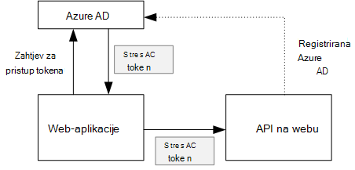
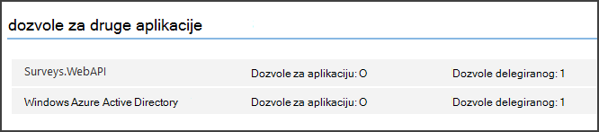

<properties
   pageTitle="Zaštita pozadinskog web API-JA u aplikaciji za složene | Microsoft Azure"
   description="Kako sigurne pozadinskog web API-JA"
   services=""
   documentationCenter="na"
   authors="MikeWasson"
   manager="roshar"
   editor=""
   tags=""/>

<tags
   ms.service="guidance"
   ms.devlang="dotnet"
   ms.topic="article"
   ms.tgt_pltfrm="na"
   ms.workload="na"
   ms.date="06/02/2016"
   ms.author="mwasson"/>

# <a name="securing-a-backend-web-api-in-a-multitenant-application"></a>Zaštita s pozadinskom API na webu u složene aplikacije

[AZURE.INCLUDE [pnp-header](../../includes/guidance-pnp-header-include.md)]

Ovaj je članak [dio niza]. Također je dovršena [primjer aplikacije] koja se isporučuje se uz ovaj niz.

Aplikacija [Ankete Tailspin] koristi pozadinskog web API-JA za upravljanje CRUD operacije na ankete. Ako, na primjer, kad korisnik klikne "Moje ankete", web-aplikaciji pošalje HTTP zahtjev API na webu:

```
GET /users/{userId}/surveys
```

Web API vraća JSON objekta:

```
{
  "Published":[],
  "Own":[
    {"Id":1,"Title":"Survey 1"},
    {"Id":3,"Title":"Survey 3"},
    ],
  "Contribute": [{"Id":8,"Title":"My survey"}]
}
```

API na webu ne dopuštaju zahtjeva za anonimni tako da web-aplikaciji morate provjere autentičnosti pomoću tokeni nošenja OAuth 2.

> [AZURE.NOTE] Ovo je scenarij poslužitelja poslužitelj. Aplikacija provjerite sve AJAX poziva na API putem klijentskog programa preglednika.

Postoje dva glavna pristupi:

- Identitet korisnika uz prijenos ovlasti. Web-aplikaciju potvrđuje s identitet korisnika.
- Identitet aplikacije. Web-aplikaciju potvrđuje njegov ID klijenta pomoću OAuth2 klijent vjerodajnica tijek.

Aplikacija Tailspin implementira identitet ovlaštenog korisnika. Evo glavne razlike:

**Identitet korisnika ovlaštenog**

- Token nošenja poslane na webu API sadrži identitet korisnika.
- Na webu API čini autorizacije odluka utemeljenih na identitet korisnika.
- Web-aplikaciju mora obradu 403 pogrešaka (zabranjeno) s weba API-JA, ako korisnik nije ovlašten za izvođenje akcije.
- Obično web-aplikacije i dalje čini neke autorizacije odluke koje utječu na korisničko Sučelje, kao što je prikaz ili skrivanje elemente korisničkog Sučelja).
- Web API može se koristiti potencijalno nepouzdanog klijenti, kao što su JavaScript aplikacije ili aplikaciju za nativni klijent.

**Identitet aplikacije**

- API na webu se podaci o korisniku.
- API na webu ne može izvršiti sve autorizacije identitet korisnika na temelju. Sve odluke autorizacije stvaraju se pomoću web-aplikacije.  
- Web API nije moguće koristiti nepouzdanih klijent (JavaScript ili aplikaciju za nativni klijent).
- Taj se način možda će ponešto jednostavniji implementaciju, zato što je bez logike autorizacije Web API.

U svakom pristup web-aplikaciju morate dobiti token programa access koja je vjerodajnica potrebne da biste uputili poziv na API na webu.

- Za identitet korisnika ovlaštenog token mora potjecati iz IDP možete izdavanja tokena ime korisnika.

- Vjerodajnice za klijenta, aplikacija možda token zatražite od službe za IDP ili hostira vlastitu tokena poslužitelja. (Ali ne pisanje tokena poslužitelja od nule, koristiti dobro provjeriti framework kao što su [IdentityServer3].) Ako uspješnoj Azure AD ga je preporučuje da biste token za pristup s Azure AD, čak i tokove klijent vjerodajnica.

Ostatak u ovom se članku pretpostavlja aplikacija je provjera autentičnosti s Azure AD.



## <a name="register-the-web-api-in-azure-ad"></a>Registrirajte se API na webu u Azure AD

Azure AD za izdavanje nošenja token za API web-mjesto, morate konfigurirati neke stvari u Azure AD.

1. [Registriranje web API-JA u Azure AD].

2. Dodavanje ID klijenta web-aplikacije programski manifest API na webu u na `knownClientApplications` svojstvo. U odjeljku [Ažuriranje računala manifesti].

3. [Dati dozvolu za web aplikacije poziva na API na webu].

  Na portalu za upravljanje Azure možete postaviti dvije vrste dozvola: "Aplikacije dozvole" za identitet aplikacije (klijent vjerodajnica tijek) ili "Dodijeliti dozvole" za identitet ovlaštenog korisnika.

  

## <a name="getting-an-access-token"></a>Početak token za pristup

Prije pozivanja web API web-aplikaciju programa access tokena s dohvaća Azure AD. U aplikaciji za .NET koristite [Azure AD provjera autentičnosti biblioteke (ADAL) za .NET][ADAL].

U tijeku kod autorizacije OAuth 2, aplikacija što je autorizacije kod za token za pristup. Sljedeći kod koristi ADAL da biste dobili token za pristup. Kod zove tijekom na `AuthorizationCodeReceived` događaj.

```csharp
// The OpenID Connect middleware sends this event when it gets the authorization code.   
public override async Task AuthorizationCodeReceived(AuthorizationCodeReceivedContext context)
{
    string authorizationCode = context.ProtocolMessage.Code;
    string authority = "https://login.microsoftonline.com/" + tenantID
    string resourceID = "https://tailspin.onmicrosoft.com/surveys.webapi" // App ID URI
    ClientCredential credential = new ClientCredential(clientId, clientSecret);

    AuthenticationContext authContext = new AuthenticationContext(authority, tokenCache);
    AuthenticationResult authResult = await authContext.AcquireTokenByAuthorizationCodeAsync(
        authorizationCode, new Uri(redirectUri), credential, resourceID);

    // If successful, the token is in authResult.AccessToken
}
```

Slijedi nekoliko različitih parametre koje su vam potrebne:

- `authority`. Izvedeno iz prefiksa ID klijenta traje Prijava korisnika. (Nije ID klijenta davatelja SaaS)  
- `authorizationCode`. Provjera autentičnosti kod koju ste dobili natrag od na IDP.
- `clientId`. ID-a web-aplikacije klijenta.
- `clientSecret`. Web-aplikaciji tajna klijenta.
- `redirectUri`. Preusmjeravanje URI koju ste postavili za OpenID povezati. To je mjesto na IDP natrag poziva s token.
- `resourceID`. Aplikacija ID URI API-JA, web-mjesta koji ste stvorili kada registrirate za API na webu u Azure AD
- `tokenCache`. Objekt predmemorira tokeni programa access. Potražite u članku [Token predmemoriranje].

Ako `AcquireTokenByAuthorizationCodeAsync` uspješnog ADAL predmemorira token. Noviju verziju, možete dobiti tokena iz predmemorije tako da nazovete AcquireTokenSilentAsync:

```csharp
AuthenticationContext authContext = new AuthenticationContext(authority, tokenCache);
var result = await authContext.AcquireTokenSilentAsync(resourceID, credential, new UserIdentifier(userId, UserIdentifierType.UniqueId));
```

gdje `userId` je objekt ID korisnika koji se nalazi u na `http://schemas.microsoft.com/identity/claims/objectidentifier` zahtjeva.

## <a name="using-the-access-token-to-call-the-web-api"></a>Pomoću token za pristup webu API-JA

Nakon što dodate token, pošaljite ga u zaglavlju autorizacije zahtjeva za HTTP API na webu.

```
Authorization: Bearer xxxxxxxxxx
```

Sljedeću metodu proširenje iz aplikacije ankete postavlja zaglavlje autorizacije na HTTP zahtjev, pomoću **HttpClient** predmete.

```csharp
public static async Task<HttpResponseMessage> SendRequestWithBearerTokenAsync(this HttpClient httpClient, HttpMethod method, string path, object requestBody, string accessToken, CancellationToken ct)
{
    var request = new HttpRequestMessage(method, path);
    if (requestBody != null)
    {
        var json = JsonConvert.SerializeObject(requestBody, Formatting.None);
        var content = new StringContent(json, Encoding.UTF8, "application/json");
        request.Content = content;
    }

    request.Headers.Authorization = new AuthenticationHeaderValue("Bearer", accessToken);
    request.Headers.Accept.Add(new MediaTypeWithQualityHeaderValue("application/json"));

    var response = await httpClient.SendAsync(request, ct);
    return response;
}
```

> [AZURE.NOTE] Potražite u članku [HttpClientExtensions.cs].

## <a name="authenticating-in-the-web-api"></a>Provjera autentičnosti na web-mjestu API-JA

Na webu API ima za provjeru autentičnosti token nošenja. U ASP.NET osnovne 1.0, možete koristiti [Microsoft.AspNet.Authentication.JwtBearer] [ JwtBearer] paketa. Paket sadrži proizvod koji omogućuje aplikacije prima povezivanje OpenID tokeni nošenja.

Zabilježiti na proizvod na vašem web-mjestu API `Startup` predmete.

```csharp
app.UseJwtBearerAuthentication(options =>
{
    options.Audience = "[app ID URI]";
    options.Authority = "https://login.microsoftonline.com/common/";
    options.TokenValidationParameters = new TokenValidationParameters
    {
        //Instead of validating against a fixed set of known issuers, we perform custom multi-tenant validation logic
        ValidateIssuer = false,
    };
    options.Events = new SurveysJwtBearerEvents();
});
```

> [AZURE.NOTE] Potražite u članku [Startup.cs].

- **Ciljne skupine**. Postavite tako da aplikacije ID URL-a za API-JA, web-mjesto koje ste napravili kad je na webu API registriran Azure AD.
- **Za izdavanje certifikata**. Složene aplikacije, postavite to na `https://login.microsoftonline.com/common/`.
- **TokenValidationParameters**. Za složene aplikacije, postavite **ValidateIssuer** FALSE. To znači da aplikacija će provjeriti izdavač.
- **Događaji koje** je klasa koja je izvedena iz **JwtBearerEvents**.

### <a name="issuer-validation"></a>Provjera valjanosti izdavač

Provjerite valjanost tokena izdavač **JwtBearerEvents.ValidatedToken** događaj. Izdavač se šalje u zahtjeva "iss".

U aplikaciji ankete na webu API-JA ne rukovati [klijentu za prijavu]. Stoga je samo provjerava Ako izdavač je već u bazi podataka za aplikacije. Ako nije, ona throws iznimku, čime će se provjeru autentičnosti nije uspjela.

```csharp
public override async Task ValidatedToken(ValidatedTokenContext context)
{
    var principal = context.AuthenticationTicket.Principal;
    var tenantManager = context.HttpContext.RequestServices.GetService<TenantManager>();
    var userManager = context.HttpContext.RequestServices.GetService<UserManager>();
    var issuerValue = principal.GetIssuerValue();
    var tenant = await tenantManager.FindByIssuerValueAsync(issuerValue);

    if (tenant == null)
    {
        // the caller was not from a trusted issuer - throw to block the authentication flow
        throw new SecurityTokenValidationException();
    }
}
```

> [AZURE.NOTE] Potražite u članku [SurveysJwtBearerEvents.cs].

Da biste učinili [zahtjevima transformaciju]možete koristiti i **ValidatedToken** događaj. Imajte na umu da se na zahtjevima potječu izravno iz Azure AD pa ako web-aplikaciji jeste li sve transformacije zahtjevima, one ne odražavaju se token nošenja prima API na webu.

## <a name="authorization"></a>Autorizacija

Opća rasprava autorizacije potražite u članku [autorizacija uloga i resursa][Authorization]. 

Proizvod JwtBearer rukuje autorizacije odgovore. Ako, na primjer, da biste ograničili kontroler akcija korisnicima čija je autentičnost provjerena, koristite atrribute **[ovlasti]** i odredite **JwtBearerDefaults.AuthenticationScheme** kao shemu provjere autentičnosti:

```csharp
[Authorize(ActiveAuthenticationSchemes = JwtBearerDefaults.AuthenticationScheme)]
```

To vraća kod 401 stanja ako je autentičnost korisnika.

Da biste ograničili kontroler akcija authorizaton pravila, navedite naziv pravila u atributu **[ovlasti]** :

```csharp
[Authorize(Policy = PolicyNames.RequireSurveyCreator)]
```

To vraća kod 401 stanja ako je autentičnost korisnika i 403 ako korisnik je autentičnost provjerena, ali nemate ovlasti. Registrirajte se pravila prilikom pokretanja:

```csharp
public void ConfigureServices(IServiceCollection services)
{
    services.AddAuthorization(options =>
    {
        options.AddPolicy(PolicyNames.RequireSurveyCreator,
            policy =>
            {
                policy.AddRequirements(new SurveyCreatorRequirement());
                policy.AddAuthenticationSchemes(JwtBearerDefaults.AuthenticationScheme);
            });
    });
}
```

## <a name="next-steps"></a>Daljnji koraci

- Pročitajte sljedeći članak u ovom nizu: [Međuspremanje pristup tokena u složene aplikacije][token cache]

<!-- links -->
[ADAL]: https://msdn.microsoft.com/library/azure/jj573266.aspx
[JwtBearer]: https://www.nuget.org/packages/Microsoft.AspNet.Authentication.JwtBearer
[dio niza]: guidance-multitenant-identity.md
[Tailspin ankete]: guidance-multitenant-identity-tailspin.md
[IdentityServer3]: https://github.com/IdentityServer/IdentityServer3
[Registrirajte se API na webu u Azure AD]: https://github.com/Azure-Samples/guidance-identity-management-for-multitenant-apps/blob/master/docs/running-the-app.md#register-the-surveys-web-api
[Ažuriranje aplikacije manifesti]: https://github.com/Azure-Samples/guidance-identity-management-for-multitenant-apps/blob/master/docs/running-the-app.md#update-the-application-manifests
[Dati dozvolu za web aplikacije poziva na API na webu]: https://github.com/Azure-Samples/guidance-identity-management-for-multitenant-apps/blob/master/docs/running-the-app.md#give-the-web-app-permissions-to-call-the-web-api
[Predmemoriranje tokena]: guidance-multitenant-identity-token-cache.md
[HttpClientExtensions.cs]: https://github.com/Azure-Samples/guidance-identity-management-for-multitenant-apps/blob/master/src/Tailspin.Surveys.Common/HttpClientExtensions.cs
[Startup.CS]: https://github.com/Azure-Samples/guidance-identity-management-for-multitenant-apps/blob/master/src/Tailspin.Surveys.WebAPI/Startup.cs
[klijent prijave]: guidance-multitenant-identity-signup.md
[SurveysJwtBearerEvents.cs]: https://github.com/Azure-Samples/guidance-identity-management-for-multitenant-apps/blob/master/src/Tailspin.Surveys.WebAPI/SurveyJwtBearerEvents.cs
[Pretvorba zahtjevima]: guidance-multitenant-identity-claims.md#claims-transformations
[Authorization]: guidance-multitenant-identity-authorize.md
[primjer aplikacije]: https://github.com/Azure-Samples/guidance-identity-management-for-multitenant-apps
[token cache]: guidance-multitenant-identity-token-cache.md
