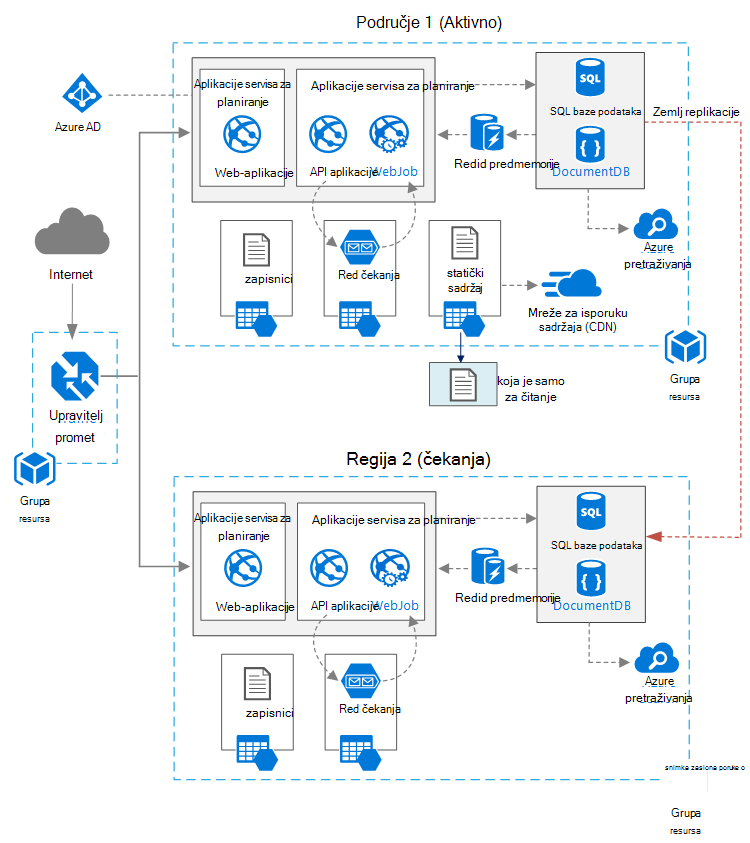

<properties
   pageTitle="Web-aplikacija s visoke dostupnosti | Arhitektura Azure referenca | Microsoft Azure"
   description="Visoke dostupnosti koji se izvodi u Microsoft Azure, preporučuje se arhitektura za web-aplikaciju."
   services="app-service,app-service\web,sql-database" 
   documentationCenter="na"
   authors="MikeWasson"
   manager="roshar"
   editor=""
   tags=""/>

<tags
   ms.service="guidance"
   ms.devlang="na"
   ms.topic="article"
   ms.tgt_pltfrm="na"
   ms.workload="na"
   ms.date="06/27/2016"
   ms.author="mwasson"/>

# <a name="azure-reference-architecture-web-application-with-high-availability"></a>Arhitektura Azure referenca: web-aplikacija s visoke dostupnosti

[AZURE.INCLUDE [pnp-RA-branding](../../includes/guidance-pnp-header-include.md)]

U ovom se članku prikazuje preporučene arhitektura za web-aplikaciju s visoke dostupnosti sustavom Microsoft Azure. Arhitektura sastavlja [arhitektura Azure referenca: poboljšanje skalabilnost u web-aplikaciji][guidance-web-apps-scalability].

## <a name="architecture-diagram"></a>Arhitektura dijagrama



U ovom arhitektura sastavlja na ono koje je prikazano u [Improving skalabilnost u web-aplikaciji][guidance-web-apps-scalability]. Glavne razlike su:

- **Primarnih i sekundarnih područja**. U ovom arhitektura koristi dva područja da biste postigli veća dostupnost. Aplikacija je implementiran na svakom područja. Tijekom uobičajenih postupaka mrežni promet usmjeravanja primarni regiju. No ako koji postane dostupan, promet usmjeravanja sekundarne regiju. Detalje o prebacivanje potražite u članku [Upravljanje prebacivanje](#managing-failover-and-failback).

- **Azure Upravitelj promet**. [Upravitelj promet] [ traffic-manager] usmjerava zahtjevi za primarni regiju. Ako aplikacije koje se izvode to područje postane dostupan, Upravitelj promet neće uspjeti putem sekundarne regiju. 

- **Zemlj replikacije** baze podataka SQL i DocumentDB.

## <a name="recommendations"></a>Preporuke

### <a name="regional-pairing"></a>Regionalne uparivanja

Svako područje Azure uparen je s drugog područja unutar iste Zemljopis. Općenito govoreći, odaberite područja s istom regionalne par (na primjer, Istočni sad 2 i središnje SAD-a). Prednosti time obuhvaćaju sljedeće:

- Ako postoji širok prekida, oporavak barem jedan područja iz svaki par je prioritet.
- Ažuriranja planiranog Azure sustava su poslednjeg područja upareni sekvencijalno, da biste minimizirali moguće isključiti.
- U većini slučajeva parove se nalaziti unutar iste Zemljopis da bi odgovarao potrebama residency podataka.

Međutim, provjerite je li da obje regije podržavaju sve potrebne za svoju aplikaciju servise za Azure. Pogledajte [Services po regijama][services-by-region]. Dodatne informacije o regionalnim parove potražite u članku [tvrtke continuity i Izrada oporavak (BCDR): Uparena područja Azure][regional-pairs].

### <a name="resource-groups"></a>Grupa resursa

Razmislite o postavljanju primarni regija, sekundarne regija i promet upravitelja [grupe resursa]u zasebnom[resource groups]. Omogućuje upravljanje resursima implementiran na svaku regiju kao jednu zbirku &mdash; možete uvesti ih zasebno, brisanje uvođenje i tako dalje. 

### <a name="traffic-manager"></a>Upravitelj promet

**Usmjeravanje.** Upravitelj promet podržava nekoliko [usmjeravanje algoritama][tm-routing]. Scenarija opisane u ovom članku, korištenje _Prioritet_ usmjeravanja (prije se zvao _Prebacivanje_ usmjeravanje). Uz tu postavku, promet Upravitelj šalje sve zahtjeve za primarni regiju, osim ako krajnja točka za to područje postane nedostupan. U tom trenutku ga automatski ne uspijeva putem sekundarne regiju. Potražite u članku [Konfiguriranje prebacivanje usmjeravanje način][tm-configure-failover].

**Probni stanja.** Upravitelj promet koristi programa probni HTTP (ili HTTPS) Praćenje Dostupnost svaki krajnjoj točki. Na probni daje promet Upravitelj računanja/Neuspjelo test za neuspjeh putem sekundarne područje. Radi slanjem zahtjeva za navedeni put URL-a. Ako je dobiti odgovor koji nisu 200 unutar vremenskog ograničenja razdoblja, na probni neće uspjeti. Nakon četiri neuspjelih zahtjeva promet Upravitelj označava krajnju točku su smanjene značajke i ne uspije iznad druge krajnjoj točki. Detalje potražite u članku [Upravitelj promet krajnjoj točki nadzor i prebacivanje][tm-monitoring].

Preporučenim načinom rada stvaranje krajnje točke stanja probni koju javlja stanje aplikacije te koristite ovaj krajnja točka za probni stanja. Krajnja točka treba provjeriti ključnih ovisnosti kao što su aplikacije servisa za aplikacije, reda čekanja za pohranu i SQL baze podataka. U suprotnom se probni možda izvješće "dobar" krajnje točke kada ključnih dijelove aplikacija su zapravo ne uspijeva. 

Da biste provjerili donjem prioritet servisa nepotrebnih s druge strane, probni stanja. Ako, na primjer, ako funkcionira servis za e-pošte, aplikacija možete prebacite nekog drugog davatelja usluge ili samo kasnije slati e-poštu. Aplikacija vjerojatno bi trebalo uspjeti putem u tom slučaju. Dodatne informacije potražite u članku [Nadzor uzorak krajnja točka za stanje][health-endpoint-monitoring-pattern].
  
### <a name="sql-database"></a>SQL baze podataka

Koristite [Active replikacije zemlj] [ sql-replication] da biste stvorili čitljiv sekundarni u nekoj drugoj regiji. Možete imati do četiri čitljiv secondaries. Ako primarni bazu podataka ne uspije, ili jednostavno treba poduzeti izvanmrežni način rada, možete prebacivanje u neku od svojih sekundarne baza podataka. Aktivni replikacije zemlj moguće je konfigurirati za sve baze podataka u bilo kojem elastic baze podataka.

### <a name="documentdb"></a>DocumentDB

DocumentDB podržava zemlj replikacije preko područja. Određenu regiju je označen kao snimanje i na druge su samo za čitanje replike. 

Ako postoji regionalne prekida, možete se neće ispočetka tako da odaberete drugoj regiji biti područja za unos. Tako da ne morate ažurirati klijent konfiguraciju nakon na prebacivanje klijent DocumentDB SDK automatski šalje pisati zahtjeva za trenutno područje za unos. Dodatne informacije potražite u odjeljku [Podaci za raspodjelu globalno s DocumentDB][docdb-geo]. 

> [AZURE.NOTE] Sve se replike pripadaju istoj grupi resursa.

### <a name="storage"></a>Prostor za pohranu

Prostor za pohranu Azure, koristite [pristup za čitanje zemlj suvišnih prostora za pohranu] [ ra-grs] (RA GRS). S RA GRS prostora za pohranu podataka je replicirati na sekundarnom regija. Imate pristup samo za čitanje podatke u području sekundarne putem zasebne krajnjoj točki. Ako postoji regionalne prekida ili Izrada, tim za pohranu Azure mogu odrediti da biste izvršili u prebacivanje zemlj sekundarne područje. Nema potrebne za ovu prebacivanje akcije klijenta.

Za pohranu u redu čekanja, stvorite sigurnosnu kopiju reda čekanja u području sekundarne. Tijekom prebacivanje, aplikaciju možete koristiti sigurnosne kopije reda čekanja dok primarni regija ponovo postane dostupna. Na taj način aplikaciju možete i dalje obraditi nove zahtjeve. 

## <a name="availability-considerations"></a>Razmatranja dostupnosti

Više područja arhitektura unijeti veća dostupnost od implementacija jedno područje. Ako regionalne nedostupnosti utječe primarni regija, možete uspjeti putem sekundarne regiju. U ovom arhitektura mogu pomoći ne uspijete pojedinačne podsustav aplikacije.  
     
Postoji nekoliko općenitih pristupa postizanja visoke dostupnosti svim centrima podataka:      
- Aktivno/pasivni s tipkovni čekanja. Promet odlazak određenu regiju tijekom Čekanje na čekanja. Aplikacija je distribuiranih i pokrenuta u području sekundarne. Možda počinju manji broj instanci u centru za sekundarne podatkovne i zatim Skaliraj izgleda prema potrebi. 

- Aktivno/pasivni s Hladna čekanja. U isti, ali aplikacija je implementirana dok potrebnog za prebacivanje. Takvog troškove manje da biste pokrenuli, ali obično imati više pritisnutu tijekom pogreške. 

- Aktivno/aktivno. Obje regije aktivna, a zahtjevi za rasporediti između njih opterećenje. Ako jednog podatkovnog centra postane dostupan, koristi se iz rotacije. 

U ovom se članku usredotočuje se na aktivno/pasivni s tipkovni stanja čekanja pomoću [Upravitelja promet Azure] [ traffic-manager] za usmjeravanje prometa u područje. 

### <a name="traffic-manager"></a>Upravitelj promet

Upravitelj promet neće uspjeti automatski iznad ako je primarni područje postane nedostupan. Kada upravitelj promet ne uspije iznad, postoji neko vrijeme kada klijenti ne može pristupiti aplikaciji, što može biti nekoliko minuta. Dva čimbenika utječe na ukupno trajanje:

- Probni stanja morate otkriva primarni podatkovnog centra u je postao dostupan.

- DNS poslužitelji morate ažurirati predmemorirani DNS zapise za IP adresu, a to ovisi o na DNS vrijeme važenja (TTL). Zadani TTL je 300 sekundi (5 minuta), ali možete konfigurirati tu vrijednost pri stvaranju profila Upravitelja promet.

Detalje potražite u članku [O nadzor promet Upravitelj][tm-monitoring]. 

Voditelj promet je moguće pogreška točke u sustavu. Ako servis ne uspije, klijenti ne može pristupiti aplikaciji tijekom na nedostupnost. Pregled [Upravitelja promet SLA][tm-sla], i odrediti hoće li pomoću upravitelja promet samostalno zadovoljava vaše tvrtke preduvjete za visoke dostupnosti. Ako nije, razmislite o dodavanju drugo rješenje za upravljanje promet kao u failback. Ako servisa Azure promet Upravitelj ne uspije, promijenite CNAME zapisa u DNS-a na druge promet servis za upravljanje. (Ovaj korak moraju izvršiti ručno, i aplikacije više neće biti dostupna dok se ne prenose promjene DNS-a) 

### <a name="sql-database"></a>SQL baze podataka

Oporavak točke cilj (RPO) i Procijenjena oporavku (UMETNI) za baze podataka SQL opisani su [ovdje][sql-rpo]. 

### <a name="storage"></a>Prostor za pohranu

Prostor za pohranu RA GRS nudi durable prostora za pohranu, ali je važno je znati što se može dogoditi prilikom do prekida: 

- Ako dođe do prekida za pohranu, bit će neko vrijeme kada nemate pisanje pristup podacima. Možete se i dalje čitati iz sekundarne krajnje točke tijekom se prekida.

- Ako regionalne prekida ili Izrada utječe na primarno mjesto i s podacima nije moguće oporaviti, tim za pohranu Azure može odrediti da biste izvršili u prebacivanje zemlj sekundarne područje. 

- Podataka replikaciju sekundarnu područje provodi asinkrono. Dakle, ako je izveden prebacivanje zemlj., gubitka podataka moguće je, ako iz primarnog regija nije moguće oporaviti podatke.

- Tranzitne pogreške, kao što su prekida mreže će pokrenuti prebacivanje za pohranu. Dizajniranje aplikacije da biste se prebacuju za tranzitne pogreške. Moguće mitigations:

    - Čitanje iz sekundarne.

    - Privremeno prijeđite na drugi račun za pohranu za novi unos operacije (Ako, na primjer, u redu čekanja poruke). 

    - Kopirajte podatke iz sekundarne na drugi račun za pohranu.

    - Navedite sa smanjenom funkcionalnošću sve dok ponovno ne uspije sustav.

Dodatne informacije potražite u članku [što učiniti ako je nestalo prostora za pohranu Azure][storage-outage].

## <a name="managing-failover-and-failback"></a>Upravljanje prebacivanje i failback

### <a name="traffic-manager"></a>Upravitelj promet

Upravitelj promet neće uspjeti automatski iznad ako je primarni područje postane nedostupan. Po zadanom je automatski neće natrag, kada primarni regija ponovo postane dostupna.

No preporučujemo izvođenje ručno failback umjesto da automatski ne uspijeva natrag. Prije nego što ne uspijeva natrag, provjerite jesu li sve aplikacije podsustava dobar. U suprotnom, možete stvoriti situaciji gdje aplikacije natrag i naprijed Zrcali između centre za podatke. 

Da biste spriječili automatsko failback, ručno smanjite prioritet područja za primarni nakon prebacivanje događaj. Ako, na primjer, pretpostavimo da područje primarni je prioritet 1, a sekundarne prioritet 2. Nakon prebacivanje, postavite primarni regija prioritet 3, da biste spriječili automatsko failback. Kada ste spremni za povratak, vratiti prioritet 1.

Sljedeće naredbe ažurirajte prioritet.

**PowerShell** 

```bat
$endpoint = Get-AzureRmTrafficManagerEndpoint -Name <endpoint> -ProfileName <profile> -ResourceGroupName <resource-group> -Type AzureEndpoints
$endpoint.Priority = 3
Set-AzureRmTrafficManagerEndpoint -TrafficManagerEndpoint $endpoint
```

Dodatne informacije potražite u članku [Cmdleti za Azure promet Upravitelj][tm-ps].

**Azure EŽA**

```bat
azure network traffic-manager endpoint set --name <endpoint> --profile-name <profile> --resource-group <resource-group> --type AzureEndpoints --priority 3
```    

### <a name="sql-database"></a>SQL baze podataka

Ako primarnom bazom podataka ne uspije, izvršiti ručno prebacivanje na sekundarnom bazu podataka. Pročitajte članak [Vraćanje baze podataka SQL Azure ili prebacivanje na sekundarni][sql-failover]. Dok ne preko sekundarne baze podataka ostaje samo za čitanje. 


<!-- links -->

[azure-sql-db]: https://azure.microsoft.com/en-us/documentation/services/sql-database/
[docdb-geo]: ../documentdb/documentdb-distribute-data-globally.md
[guidance-web-apps-scalability]: guidance-web-apps-scalability.md
[health-endpoint-monitoring-pattern]: https://msdn.microsoft.com/library/dn589789.aspx
[ra-grs]: ../storage/storage-redundancy.md#read-access-geo-redundant-storage
[regional-pairs]: ../best-practices-availability-paired-regions.md
[resource groups]: ../resource-group-overview.md
[services-by-region]: https://azure.microsoft.com/en-us/regions/#services
[sql-failover]: ../sql-database/sql-database-disaster-recovery.md
[sql-replication]: ../sql-database/sql-database-geo-replication-overview.md
[sql-rpo]: ../sql-database/sql-database-business-continuity.md#sql-database-business-continuity-features
[storage-outage]: ../storage/storage-disaster-recovery-guidance.md
[tm-configure-failover]: ../traffic-manager/traffic-manager-configure-failover-routing-method.md
[tm-monitoring]: ../traffic-manager/traffic-manager-monitoring.md
[tm-ps]: https://msdn.microsoft.com/en-us/library/mt125941.aspx
[tm-routing]: ../traffic-manager/traffic-manager-routing-methods.md
[tm-sla]: https://azure.microsoft.com/en-us/support/legal/sla/traffic-manager/v1_0/
[traffic-manager]: https://azure.microsoft.com/en-us/services/traffic-manager/
