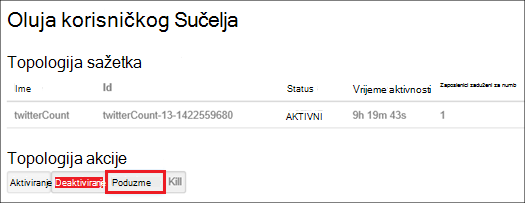

<properties
    pageTitle="Upravljanje Hadoop klastere u HDInsight s .NET SDK | Microsoft Azure"
    description="Upute za izvođenje administrativnih zadataka za klastere Hadoop u HDInsight pomoću HDInsight .NET SDK."
    services="hdinsight"
    editor="cgronlun"
    manager="jhubbard"
    tags="azure-portal"
    authors="mumian"
    documentationCenter=""/>

<tags
    ms.service="hdinsight"
    ms.workload="big-data"
    ms.tgt_pltfrm="na"
    ms.devlang="na"
    ms.topic="article"
    ms.date="09/02/2016"
    ms.author="jgao"/>

# Upravljanje Hadoop klastere u HDInsight pomoću .NET SDK

[AZURE.INCLUDE [selector](../../includes/hdinsight-portal-management-selector.md)]

Informirajte se o upravljanju klastere HDInsight pomoću [HDInsight.NET SDK-a](https://msdn.microsoft.com/library/mt271028.aspx).

**Preduvjeti**

Prije nego počnete u ovom se članku, morate imati sljedeće:

- **Mogući Azure pretplate**. Pogledajte [Početak Azure besplatnu probnu verziju](https://azure.microsoft.com/documentation/videos/get-azure-free-trial-for-testing-hadoop-in-hdinsight/).

##Povezivanje sa servisom Azure HDInsight

Potrebno je sljedeće Nuget paketa:

    Install-Package Microsoft.Rest.ClientRuntime.Azure.Authentication -Pre
    Install-Package Microsoft.Azure.Management.ResourceManager -Pre
    Install-Package Microsoft.Azure.Management.HDInsight

Sljedećim primjerom koda prikazuje kako se povezati sa Azure prije HDInsight klastere možete upravljati u odjeljku pretplate Azure.

    using System;
    using Microsoft.Azure;
    using Microsoft.Azure.Management.HDInsight;
    using Microsoft.Azure.Management.HDInsight.Models;
    using Microsoft.Azure.Management.ResourceManager;
    using Microsoft.IdentityModel.Clients.ActiveDirectory;
    using Microsoft.Rest;
    using Microsoft.Rest.Azure.Authentication;

    namespace HDInsightManagement
    {
        class Program
        {
            private static HDInsightManagementClient _hdiManagementClient;
            // Replace with your AAD tenant ID if necessary
            private const string TenantId = UserTokenProvider.CommonTenantId; 
            private const string SubscriptionId = "<Your Azure Subscription ID>";
            // This is the GUID for the PowerShell client. Used for interactive logins in this example.
            private const string ClientId = "1950a258-227b-4e31-a9cf-717495945fc2";

            static void Main(string[] args)
            {
                // Authenticate and get a token
                var authToken = Authenticate(TenantId, ClientId, SubscriptionId);
                // Flag subscription for HDInsight, if it isn't already.
                EnableHDInsight(authToken);
                // Get an HDInsight management client
                _hdiManagementClient = new HDInsightManagementClient(authToken);

                // insert code here

                System.Console.WriteLine("Press ENTER to continue");
                System.Console.ReadLine();
            }

            /// 

            /// Authenticate to an Azure subscription and retrieve an authentication token
            /// 

            /// <param name="TenantId">The AAD tenant ID</param>
            /// <param name="ClientId">The AAD client ID</param>
            /// <param name="SubscriptionId">The Azure subscription ID</param>
            /// <returns></returns>
            static TokenCloudCredentials Authenticate(string TenantId, string ClientId, string SubscriptionId)
            {
                var authContext = new AuthenticationContext("https://login.microsoftonline.com/" + TenantId);
                var tokenAuthResult = authContext.AcquireToken("https://management.core.windows.net/", 
                    ClientId, 
                    new Uri("urn:ietf:wg:oauth:2.0:oob"), 
                    PromptBehavior.Always, 
                    UserIdentifier.AnyUser);
                return new TokenCloudCredentials(SubscriptionId, tokenAuthResult.AccessToken);
            }
            /// 

            /// Marks your subscription as one that can use HDInsight, if it has not already been marked as such.
            /// 

            /// <remarks>This is essentially a one-time action; if you have already done something with HDInsight
            /// on your subscription, then this isn't needed at all and will do nothing.</remarks>
            /// <param name="authToken">An authentication token for your Azure subscription</param>
            static void EnableHDInsight(TokenCloudCredentials authToken)
            {
                // Create a client for the Resource manager and set the subscription ID
                var resourceManagementClient = new ResourceManagementClient(new TokenCredentials(authToken.Token));
                resourceManagementClient.SubscriptionId = SubscriptionId;
                // Register the HDInsight provider
                var rpResult = resourceManagementClient.Providers.Register("Microsoft.HDInsight");
            }
        }
    }

Upit će vidjeti pri pokretanju programa.  Ako ne želite da biste vidjeli upit, potražite u članku [Stvaranje koji nije interaktivan provjere autentičnosti .NET HDInsight aplikacije](hdinsight-create-non-interactive-authentication-dotnet-applications.md).

##Stvaranje klastere

Potražite u članku [Stvaranje Linux sustavom klastere u HDInsight pomoću .NET SDK](hdinsight-hadoop-create-linux-clusters-dotnet-sdk.md)

##Popis klastere

Sljedeći isječak koda navedeni klastere i neka svojstva:

    var results = _hdiManagementClient.Clusters.List();
    foreach (var name in results.Clusters) {
        Console.WriteLine("Cluster Name: " + name.Name);
        Console.WriteLine("\t Cluster type: " + name.Properties.ClusterDefinition.ClusterType);
        Console.WriteLine("\t Cluster location: " + name.Location);
        Console.WriteLine("\t Cluster version: " + name.Properties.ClusterVersion);
    }

##Brisanje klastere

Pomoću sljedećih koda da biste izbrisali klaster sinkronizirano ili asinkrono: 

    _hdiManagementClient.Clusters.Delete("<Resource Group Name>", "<Cluster Name>");
    _hdiManagementClient.Clusters.DeleteAsync("<Resource Group Name>", "<Cluster Name>");
            
##Promjena veličine klastere
Klaster skaliranje značajka omogućuje vam da biste promijenili broj radnih čvorove koristi klaster koja se izvodi u Azure HDInsight bez potrebe da biste ponovno stvorili klaster.

>[AZURE.NOTE] Samo klaster s HDInsight verziju 3.1.3 ili noviji podržava. Ako niste sigurni verzije svoj klaster, možete provjeriti svojstva stranice.  Pogledajte [popis i prikaz klastere](hdinsight-administer-use-portal-linux.md#list-and-show-clusters).

Utjecaj promjene samog broja čvorove podatke za svaku vrstu klaster podržava HDInsight:

- Hadoop

    Jednostavno možete povećati broj radnih čvorove klasteru Hadoop sa sustavom bez koje utječu na sve zadatke na čekanju ili izvodi. Novi zadaci također mogu poslati tijekom postupka. Pogreške u operaciji skaliranja rukuje obavljanje tako da se klaster uvijek lijevo u funkcionalno stanje.

    Kada je Hadoop klaster neproporcionalno prema dolje tako da smanjite broj čvorove podataka, neke usluge u klasteru ponovno pokrenete. Zbog toga sve pokrenute i zadatke koji čekaju poslove uvoza nakon dovršetka postupka skaliranja. Možete, međutim, pošaljite poslove nakon dovršetka postupka.

- HBase

    Jednostavno možete dodati ili ukloniti čvorove za svoj klaster HBase dok se izvodi. Regionalnih poslužitelji se automatski raspoređen u roku od dovršetka postupka skaliranja nekoliko minuta. Međutim, regionalne poslužitelja možete i ručno saldo zapisivanje u headnode klaster i pokretanjem sljedeće naredbe iz prozor naredbenog retka:

        >pushd %HBASE_HOME%\bin
        >hbase shell
        >balancer

- Oluja

    Jednostavno možete dodati ili ukloniti čvorove podataka za svoj klaster oluja dok se izvodi. No uspješnom dovršetku postupka skaliranja, morat ćete poduzme topologije.

    Rebalancing je moguće napraviti na dva načina:

    * Oluja web korisničkog Sučelja
    * Alat za sučelja naredbenog retka (EŽA)

    Potražite u [dokumentaciji Apache oluja](http://storm.apache.org/documentation/Understanding-the-parallelism-of-a-Storm-topology.html) više pojedinosti.

    Oluja web korisničkog Sučelja je dostupan na klasteru HDInsight:

    

    Evo primjera kako pomoću naredbe EŽA poduzme oluja topologija:

        ## Reconfigure the topology "mytopology" to use 5 worker processes,
        ## the spout "blue-spout" to use 3 executors, and
        ## the bolt "yellow-bolt" to use 10 executors

        $ storm rebalance mytopology -n 5 -e blue-spout=3 -e yellow-bolt=10

Sljedeći isječak koda pokazuje kako promijeniti veličinu klaster sinkronizirano ili asinkrono:

    _hdiManagementClient.Clusters.Resize("<Resource Group Name>", "<Cluster Name>", <New Size>);   
    _hdiManagementClient.Clusters.ResizeAsync("<Resource Group Name>", "<Cluster Name>", <New Size>);   
    

##Pristup GRANT/revoke

HDInsight klastere imati sljedeće HTTP web-usluge (Svi od tih servisa imaju RESTful krajnje točke):

- ODBC
- JDBC
- Ambari
- Oozie
- Templeton

Prema zadanim postavkama tih servisa imaju pristup. Koje možete revoke/grant programa access. Da biste opozvali:

    var httpParams = new HttpSettingsParameters
    {
        HttpUserEnabled = false,
        HttpUsername = "admin",
        HttpPassword = "*******",
    };
    _hdiManagementClient.Clusters.ConfigureHttpSettings("<Resource Group Name>, <Cluster Name>, httpParams);

Da biste dodijelili:

    var httpParams = new HttpSettingsParameters
    {
        HttpUserEnabled = enable,
        HttpUsername = "admin",
        HttpPassword = "*******",
    };
    _hdiManagementClient.Clusters.ConfigureHttpSettings("<Resource Group Name>, <Cluster Name>, httpParams);

>[AZURE.NOTE] Po date/opozivanje programa access, će vratiti klaster korisničko ime i lozinku.

To se može i učiniti putem portala sustava. U odjeljku [Administriranje HDInsight pomoću portala za Azure][hdinsight-admin-portal].

##Ažurirajte korisničke vjerodajnice za HTTP

Nije isti postupak kao [Grant/revoke HTTP pristup](#grant/revoke-access). Ako klaster je dodijeljen pristup HTTP, ga morate najprije opoziv.  A zatim dopustiti pristup s nove korisničke vjerodajnice za HTTP.

##Pronalaženje zadani račun za pohranu

Sljedeći isječak koda pokazuje kako doći do zadani naziv računa za pohranu i ključ računa zadani prostor za pohranu za klaster.

    var results = _hdiManagementClient.Clusters.GetClusterConfigurations(<Resource Group Name>, <Cluster Name>, "core-site");
    foreach (var key in results.Configuration.Keys)
    {
        Console.WriteLine(String.Format("{0} => {1}", key, results.Configuration[key]));
    }

##Slanje poslova

**Da biste poslali MapReduce poslove**

Potražite u članku [pokretanje Hadoop MapReduce uzoraka u HDInsight](hdinsight-hadoop-run-samples-linux.md).

**Da biste poslali grozd poslova** 

Potražite u članku [pokretanje vrste Hive upita pomoću .NET SDK-a](hdinsight-hadoop-use-hive-dotnet-sdk.md).

**Da biste poslali Svinja poslove**

Potražite u članku [pokretanje Svinja zadatke pomoću .NET SDK-a](hdinsight-hadoop-use-pig-dotnet-sdk.md).

**Da biste poslali Sqoop poslove**

[Korištenje Sqoop sa servisa HDInsight](hdinsight-hadoop-use-sqoop-dotnet-sdk.md)potražite u članku.

**Da biste poslali Oozie poslove**

Potražite u članku [Korištenje Oozie s Hadoop definiranje i pokrenuti tijek rada u HDInsight](hdinsight-use-oozie-linux-mac.md).

##Prijenos podataka u spremište blobova platforme Azure
Potražite u članku [prijenos podataka HDInsight][hdinsight-upload-data].

## Vidi također
* [HDInsight .NET SDK referentnu dokumentaciju](https://msdn.microsoft.com/library/mt271028.aspx)
* [Administriranje HDInsight pomoću portala za Azure][hdinsight-admin-portal]
* [Administriranje HDInsight pomoću sučelja naredbenog retka][hdinsight-admin-cli]
* [Stvaranje klastere HDInsight][hdinsight-provision]
* [Prijenos podataka HDInsight][hdinsight-upload-data]
* [Početak rada sa servisom Azure HDInsight][hdinsight-get-started]

[azure-purchase-options]: http://azure.microsoft.com/pricing/purchase-options/
[azure-member-offers]: http://azure.microsoft.com/pricing/member-offers/
[azure-free-trial]: http://azure.microsoft.com/pricing/free-trial/

[hdinsight-get-started]: hdinsight-hadoop-linux-tutorial-get-started.md
[hdinsight-provision]: hdinsight-provision-clusters.md
[hdinsight-provision-custom-options]: hdinsight-provision-clusters.md#configuration
[hdinsight-submit-jobs]: hdinsight-submit-hadoop-jobs-programmatically.md

[hdinsight-admin-cli]: hdinsight-administer-use-command-line.md
[hdinsight-admin-portal]: hdinsight-administer-use-portal-linux.md
[hdinsight-storage]: hdinsight-hadoop-use-blob-storage.md
[hdinsight-use-hive]: hdinsight-use-hive.md
[hdinsight-use-mapreduce]: hdinsight-use-mapreduce.md
[hdinsight-upload-data]: hdinsight-upload-data.md
[hdinsight-flight]: hdinsight-analyze-flight-delay-data.md

