<properties
    pageTitle="Upravljanje Hadoop klastere u HDInsight pomoću portala za Azure | Microsoft Azure"
    description="Saznajte kako administriranje servisa HDInsight. Stvaranje programa HDInsight klaster, otvorite interaktivne konzolu za JavaScript i otvorite konzolu za Hadoop."
    services="hdinsight"
    documentationCenter=""
    tags="azure-portal"
    authors="mumian"
    manager="jhubbard"
    editor="cgronlun"/>

<tags
    ms.service="hdinsight"
    ms.workload="big-data"
    ms.tgt_pltfrm="na"
    ms.devlang="na"
    ms.topic="article"
    ms.date="09/14/2016"
    ms.author="jgao"/>

# Upravljanje Hadoop klastere u HDInsight pomoću portala za Azure

[AZURE.INCLUDE [selector](../../includes/hdinsight-portal-management-selector.md)]

Pomoću [portala za Azure][azure-portal], možete stvoriti Hadoop klastere u Azure HDInsight, promijeniti Hadoop korisničke lozinke i omogućivanje protokola udaljene radne površine (RDP) da biste mogli pristupati konzolu za Hadoop na klaster.

Informacije u ovom članku odnosi se samo na klastere utemeljen na prozor HDInsight. Informacije o upravljanju sustavom Linux klastere, kliknite birač tabulatora iznad.

Klikajte birač tabulatora dodatne informacije o stvaranju klastere Hadoop u HDInsight pomoću drugih alata. 

**Preduvjeti**

Prije nego počnete u ovom se članku, morate imati sljedeće:

- **Mogući Azure pretplate**. Pogledajte [Početak Azure besplatnu probnu verziju](https://azure.microsoft.com/documentation/videos/get-azure-free-trial-for-testing-hadoop-in-hdinsight/).
- **Račun za azure pohranu** – programa HDInsight klaster koristi programa spremnik spremište blobova platforme Azure kao zadani datotečni sustav. Dodatne informacije o kako spremište blobova platforme Azure nudi objedinjenog doživljaj klastere servisa HDInsight potražite u članku [Korištenje blobova platforme Azure s HDInsight](hdinsight-hadoop-use-blob-storage.md). Detalje o stvaranju račun za Azure prostora za pohranu potražite [u](../storage/storage-create-storage-account.md)članku Stvaranje računa za pohranu.

##Otvorite Portal sustava

1. Prijavite se u [https://portal.azure.com](https://portal.azure.com).
2. Kada otvorite portal sustava, možete učiniti sljedeće:

    - Kliknite **Novo** na lijevom izborniku da biste stvorili novi klaster:
    
        
    - Na lijevom izborniku kliknite **Klastere HDInsight** .
    
        

    Ako **HDInsight** ne prikazuje na lijevom izborniku, kliknite **Pregledaj**. 

    

##Stvaranje klastere

Pomoću portala za stvaranje upute potražite u članku [Stvaranje HDInsight klastere](hdinsight-provision-clusters.md#create-using-the-preview-portal).

HDInsight funkcionira s širokog raspona Hadoop komponente. Na popisu komponente provjeriti i podržanim koje potražite u članku [koju verziju sustava Hadoop se Azure HDInsight](hdinsight-component-versioning.md). Moguće je prilagoditi HDInsight pomoću neke od sljedećih mogućnosti:

- Skripta akcijom pokretanje prilagođene skripte koje možete prilagoditi klaster da biste promijenili klaster konfiguraciju ili da biste instalirali prilagođene komponente kao što su Giraph ili Solr. Dodatne informacije potražite u članku [Prilagodba HDInsight klaster pomoću skripte akcije](hdinsight-hadoop-customize-cluster.md).
- Korištenje parametara prilagodbe klaster u HDInsight .NET SDK ili Azure PowerShell tijekom stvaranja klaster. Promjene konfiguracije zadržavaju se zatim kroz vijek klaster i reimages čvor klaster koji platforme Azure povremeno izvodi za održavanje ne utječe. Dodatne informacije o korištenju parametara za prilagodbu klaster potražite u članku [Stvaranje HDInsight klastere](hdinsight-provision-clusters.md).
- Neke nativni Java komponente, kao što su Mahout i kaskadnog, mogu se izvoditi na klaster kao POSUDU datoteke. Te se datoteke POSUDU možete distribuirati u spremište blobova platforme Azure i slati za klastere HDInsight putem mehanizme za predavanje posla Hadoop. Dodatne informacije potražite u članku [Slanje Hadoop programski zadaci](hdinsight-submit-hadoop-jobs-programmatically.md).

    >[AZURE.NOTE] Ako imate problema implementacije POSUDU datoteka za klastere HDInsight ili pozivanja POSUDU datoteka na HDInsight klastere, obratite se [Microsoftovoj službi za podršku](https://azure.microsoft.com/support/options/).

    > Kaskadno HDInsight ne podržava, a ne ispunjava uvjete za Microsoft Support. Popis podržanih komponente, potražite u članku [što je novo u verzijama klaster nudi HDInsight?](hdinsight-component-versioning.md).

Instalacija softvera prilagođene na klasteru pomoću udaljene radne površine nije podržana. Izbjegavajte pohranu svih datoteka na pogonima čvora glavni onako kako će biti izgubljeni ako je potrebno ponovno stvoriti skupina. Preporučujemo da pohranjivanje datoteka na spremište blobova platforme Azure. Spremište blobova platforme je stalni.

##Popis i prikaz klastere

1. Prijavite se u [https://portal.azure.com](https://portal.azure.com).
2. Na lijevom izborniku kliknite **Klastere HDInsight** .
3. Kliknite naziv klaster. Ako je popis klaster dugo, možete koristiti filtra pri vrhu stranice.
4. Dvokliknite klaster s popisa da biste prikazali detalje.

    **Izbornik i osnove**:

    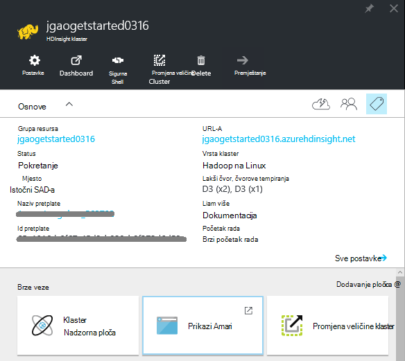
    
    - Da biste prilagodili izbornik, desnom tipkom miša kliknite bilo gdje na izborniku, a zatim **Prilagodi**.
    - **Postavke** i **Sve**: prikazuje plohu **Postavke** za klaster, koji vam omogućuje pristup konfiguracije detaljne informacije o klaster.
    - **Nadzorna ploča**, **Klaster nadzorne ploče** i **URL: to su svi načini pristupa nadzorne ploče klaster, što je Ambari Web za klastere sustavom Linux. - **Sigurne ljuske **: prikazuje upute za povezivanje s klaster putem sigurne ljuske (SSH) veze.
    - **Promjena veličine klaster**: omogućuje vam da biste promijenili broj radnih čvorove za ovaj klaster.
    - **Brisanje**: briše klaster.
    - **Brzi početak rada ()**: prikazuje informacije koje će vam olakšati početak rada s HDInsight.
    - **Korisnici ()**: omogućuje postavljanje dozvola za _Upravljanje portala_ ovom klasteru za druge korisnike u sklopu Azure pretplate.
    
        > [AZURE.IMPORTANT] U ovom _samo_ utječe pristup i dozvole za ovaj klaster na portalu za Azure i ne utječe na koji možete povezati s ili slanje poslove klaster HDInsight.
    - **Oznake ()**: oznake omogućuje postavljanje parove ključa vrijednosti da biste odredili prilagođene taksonomiju oblak servisa. Na primjer, možda stvaranje ključ naziva __projekta__, a zatim pomoću zajednička vrijednost za sve servise povezane s određeni projekt.
    - **Prikazi Ambari**: veze Ambari web-mjestu.
    
    > [AZURE.IMPORTANT] Da biste upravljali usluga koje nudi HDInsight klaster, morate koristiti Ambari Web ili Ambari REST API-JA. Dodatne informacije o korištenju Ambari potražite u članku [Upravljanje HDInsight klastere pomoću Ambari](hdinsight-hadoop-manage-ambari.md).

    **Korištenje**:
    
    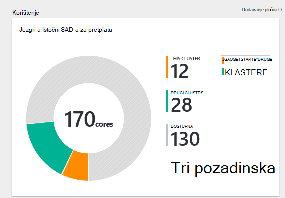
    
5. Kliknite **Postavke**.

    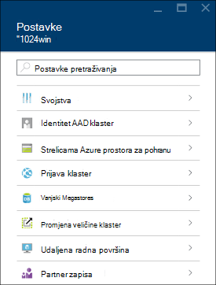

    - **Svojstva**: Prikaz svojstava klaster.
    - **Identitet AAD klaster**: 
    - **Tipke za pohranu Azure**: prikaz zadani račun za pohranu i njegova ključa. Račun za pohranu je konfiguracije tijekom procesa stvaranja klaster.
    - **Prijava klaster**: promjena klaster HTTP korisničko ime i lozinku.
    - **Vanjski Metastores**: prikaz metastores grozd i Oozie. Na metastores moguće je konfigurirati samo tijekom procesa stvaranja klaster.
    - **Promjena veličine klaster**: povećanje i smanjenje broja klaster tempiranja čvorove.
    - **Udaljena radna površina**: Omogućivanje i onemogućivanje pristupa udaljene radne površine (RDP) i konfiguriranje RDP korisničko ime.  RDP korisničko ime mora biti razlikuje od HTTP korisničko ime.
    - **Partner zapisa**:
    
    > [AZURE.NOTE] Ovo je popis generički dostupne postavke; ne sve će postojati za sve vrste klaster.

6. Kliknite **Svojstva**:

    Svojstva navodi sljedeće:
    
    - **Naziv glavnog računala**: klaster naziv.
    - **Klaster URL-a**.
    - **Status**: obuhvaćaju prekinuta, prihvaćen, ClusterStorageProvisioned, AzureVMConfiguration, HDInsightConfiguration, radu, pokrenut, pogreška, brisanje, brišu, prekoračili vremensko ograničenje, DeleteQueued, DeleteTimedout, DeleteError, PatchQueued, CertRolloverQueued, ResizeQueued, ClusterCustomization
    - **Regija**: Azure mjesto. Popis podržanih Azure mjesta, potražite u članku okvir **regija** padajućeg popisa na [HDInsight cijene](https://azure.microsoft.com/pricing/details/hdinsight/).
    - **Stvorili podataka**.
    - **Operacijski sustav**: **Windows** ili **Linux**.
    - **Vrsta**: Hadoop, HBase, oluja, povećati. 
    - **Verzija**. Pogledajte [HDInsight verzije](hdinsight-component-versioning.md)
    - **Pretplate**: naziv pretplate.
    - **ID pretplate**.
    - **Primarni izvor podataka**. Spremište blobova platforme Azure račun koristiti kao zadani Hadoop datotečni sustav.
    - **Čvorovi tempiranja cijene sloju**.
    - **Lakši čvor cijene sloju**.

##Brisanje klastere

Brisanje klaster neće se izbrisati zadani račun za pohranu ili sve poslovne kontakte povezane prostora za pohranu. Ponovno stvorite klaster pomoću iste račune za pohranu i iste metastores.

1. Prijava na [Portal][azure-portal].
2. Kliknite **Pregledaj sve** na lijevom izborniku kliknite **HDInsight klastere**, kliknite svoje ime klaster.
3. Na gornjoj izborniku kliknite **Izbriši** , a zatim slijedite upute.

Vidi također [Pauziraj/isključi klastere](#pauseshut-down-clusters).

##Promjena veličine klastere
Klaster skaliranje značajka omogućuje vam da biste promijenili broj radnih čvorove koristi klaster koja se izvodi u Azure HDInsight bez potrebe da biste ponovno stvorili klaster.

>[AZURE.NOTE] Samo klaster s HDInsight verziju 3.1.3 ili noviji podržava. Ako niste sigurni verzije svoj klaster, možete provjeriti svojstva stranice.  Pogledajte [popis i prikaz klastere](#list-and-show-clusters).

Utjecaj promjene samog broja čvorove podatke za svaku vrstu klaster podržava HDInsight:

- Hadoop

    Jednostavno možete povećati broj radnih čvorove klasteru Hadoop sa sustavom bez koje utječu na sve zadatke na čekanju ili izvodi. Novi zadaci također mogu poslati tijekom postupka. Pogreške u operaciji skaliranja rukuje obavljanje tako da se klaster uvijek lijevo u funkcionalno stanje.

    Kada je Hadoop klaster neproporcionalno prema dolje tako da smanjite broj čvorove podataka, neke usluge u klasteru ponovno pokrenete. Zbog toga sve pokrenute i zadatke koji čekaju poslove uvoza nakon dovršetka postupka skaliranja. Možete, međutim, pošaljite poslove nakon dovršetka postupka.

- HBase

    Jednostavno možete dodati ili ukloniti čvorove za svoj klaster HBase dok se izvodi. Regionalne poslužitelji se automatski raspoređen u roku od dovršetka postupka skaliranja nekoliko minuta. Međutim, regionalne poslužitelja možete i ručno saldo zapisivanje u headnode klaster i pokretanjem sljedeće naredbe iz prozor naredbenog retka:

        >pushd %HBASE_HOME%\bin
        >hbase shell
        >balancer

    Dodatne informacije o korištenju ljuske HBase potražite u članku]
- Oluja

    Jednostavno možete dodati ili ukloniti čvorove podataka za svoj klaster oluja dok se izvodi. No uspješnom dovršetku postupka skaliranja, morat ćete poduzme topologije.

    Rebalancing je moguće napraviti na dva načina:

    * Oluja web korisničkog Sučelja
    * Alat za sučelja naredbenog retka (EŽA)

    Potražite u [dokumentaciji Apache oluja](http://storm.apache.org/documentation/Understanding-the-parallelism-of-a-Storm-topology.html) više pojedinosti.

    Oluja web korisničkog Sučelja je dostupan na klasteru HDInsight:

    

    Evo primjera kako pomoću naredbe EŽA poduzme oluja topologija:

        ## Reconfigure the topology "mytopology" to use 5 worker processes,
        ## the spout "blue-spout" to use 3 executors, and
        ## the bolt "yellow-bolt" to use 10 executors

        $ storm rebalance mytopology -n 5 -e blue-spout=3 -e yellow-bolt=10

**Da biste skalirali klastere**

1. Prijava na [Portal][azure-portal].
2. Kliknite **Pregledaj sve** na lijevom izborniku kliknite **HDInsight klastere**, kliknite svoje ime klaster.
3. Na gornjoj izborniku kliknite **Postavke** , a zatim **Klaster mjerilo**.
4. Unesite **broj radnih čvorove**. Ograničenja broja čvora klaster razlikuje se među Azure pretplate. Obratite se podršci za naplatu da biste povećali ograničenje.  Podaci o troškovima odražavaju se promjene broj čvorove.

    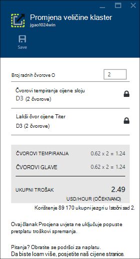

##Zaustavi/isključi klastere

Većinu zadataka Hadoop su obrade koje su samo povremeno pokrenuli. Za većinu klastere Hadoop, postoje velike točke vrijeme u kojem Klaster se koristi za obradu. S HDInsight, vaši podaci se pohranjuju u Azure prostor za pohranu, da biste mogli sigurno izbrisati klaster kada se ne koristi.
Također se naplatiti klaster programa HDInsight čak i ako se ne koristi. Budući da su naknade za klaster više puta veći od naknade za pohranu, je li bolje Ekonomske da biste izbrisali klastere kada se ne nalaze u upotrebi.

Možete programirati postupka na više načina:

- Korisnik tvorničke Azure podataka. Potražite [Azure HDInsight povezane servisa](../data-factory/data-factory-compute-linked-services.md) i [Pretvaranje i analizirati pomoću tvorničke podataka Azure](../data-factory/data-factory-data-transformation-activities.md) HDInsight povezani servisi na zahtjev i koja se sama definirani.
- Koristite Azure PowerShell.  Potražite [podatke o kašnjenju leta analiza](hdinsight-analyze-flight-delay-data.md).
- Koristite Azure EŽA. Potražite u članku [Upravljanje HDInsight klastere pomoću Azure EŽA](hdinsight-administer-use-command-line.md).
- Pomoću HDInsight .NET SDK. Potražite u članku [Slanje Hadoop zadatke](hdinsight-submit-hadoop-jobs-programmatically.md).

Cijene informacije potražite u članku [HDInsight cijene](https://azure.microsoft.com/pricing/details/hdinsight/). Da biste izbrisali klaster s portala, potražite u članku [Brisanje klastere](#delete-clusters)

##Korisničko ime promjena klaster

Za HDInsight klaster može imati dvije korisničke račune. HDInsight klaster korisnički račun se stvara tijekom procesa stvaranja. Možete stvoriti i RDP korisnički račun za pristup klaster putem RDP. Potražite u članku [Omogućivanje udaljene radne površine](#connect-to-hdinsight-clusters-by-using-rdp).

**Da biste promijenili HDInsight klaster korisničko ime i lozinku**

1. Prijava na [Portal][azure-portal].
2. Kliknite **Pregledaj sve** na lijevom izborniku kliknite **HDInsight klastere**, kliknite svoje ime klaster.
3. Na gornjoj izborniku kliknite **Postavke** , a zatim **Klaster prijava**.
4. Ako je omogućio **klaster prijava** kliknite **Onemogući**, a zatim kliknite **Omogući** prije no što promijenite korisničko ime i lozinku...
4. Promjena **Klaster korisničko ime** i/ili **Lozinku za prijavu klaster**, a zatim kliknite **Spremi**.

    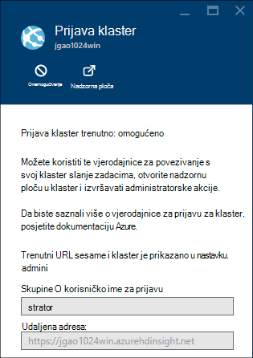

##Pristup GRANT/revoke

HDInsight klastere imati sljedeće HTTP web-usluge (Svi od tih servisa imaju RESTful krajnje točke):

- ODBC
- JDBC
- Ambari
- Oozie
- Templeton

Prema zadanim postavkama tih servisa imaju pristup. Koje možete revoke/grant programa access s portala za Azure.

>[AZURE.NOTE] Po date/opozivanje programa access, će vratiti klaster korisničko ime i lozinku.

**Da biste grant/revoke HTTP web services access**

1. Prijava na [Portal][azure-portal].
2. Kliknite **Pregledaj sve** na lijevom izborniku kliknite **HDInsight klastere**, kliknite svoje ime klaster.
3. Na gornjoj izborniku kliknite **Postavke** , a zatim **Klaster prijava**.
4. Ako je omogućio **klaster prijava** kliknite **Onemogući**, a zatim kliknite **Omogući** prije no što promijenite korisničko ime i lozinku...
6. **Korisničko ime za prijavu klaster** i **Lozinka za prijavu klaster**, unesite novo korisničko ime i lozinka (odnosno) za klaster.
7. Kliknite **SPREMI**.

    

##Pronalaženje zadani račun za pohranu

Svaki klaster HDInsight ima zadani račun za pohranu. Zadani račun za pohranu i njegov tipke za klaster pojavit će se u odjeljku **Postavke**/**Svojstva**/**Tipke Azure prostora za pohranu**. Pogledajte [popis i prikaz klastere](#list-and-show-clusters).

    
##Traženje grupa resursa 

U načinu Voditelj resursa Azure stvara se svaki HDInsight klaster s grupom Azure resursa. Prikazuje grupi Azure resursa koji pripada klaster:

- Na popisu klaster ima stupac **Grupu resursa** .
- Klaster **ključna** pločicu.  

Pogledajte [popis i prikaz klastere](#list-and-show-clusters).
   
##Otvorene konzole HDInsight upita

Konzola za HDInsight upita obuhvaća sljedeće značajke:

- **Prvi koraci u galeriji**: pomoću galerije, potražite u članku [Naučite Hadoop pomoću galerije Azure HDInsight početak rada](hdinsight-learn-hadoop-use-sample-gallery.md).
- **Vrste Hive uređivač**: GUI odgovora web-sučelja za slanje grozd zadatke.  Potražite u članku [pokretanje vrste Hive upita pomoću konzole za upit](hdinsight-hadoop-use-hive-query-console.md).

    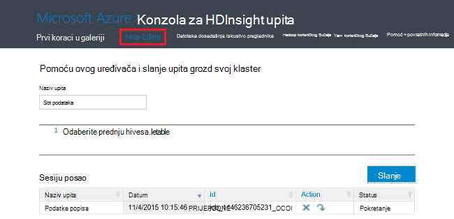

- **Povijest zadatka**: poslovi Monitor Hadoop.  

    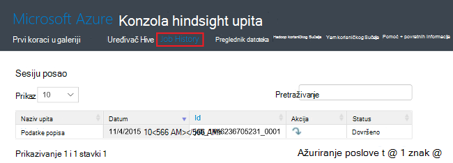

    Kliknite **Naziv upita** da biste prikazali detalje svojstva zadatka, **Upit posla**, uključujući i ** posao izlaz. Možete preuzeti i upite i izlaz za vaše radne stanice.

- **Preglednik datoteka**: pregled zadani račun za pohranu i računi povezani prostora za pohranu.

    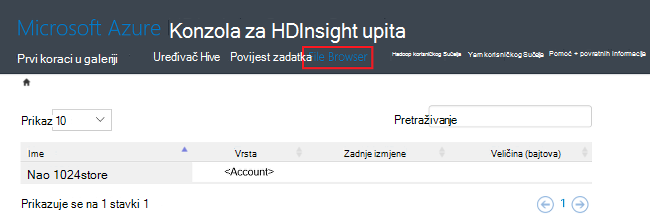

    Na snimku zaslona, u **<Account>** vrsta označava stavka je račun za Azure prostora za pohranu.  Kliknite ime da biste pregledali datoteke.
    
- **Hadoop korisničkog Sučelja**.

    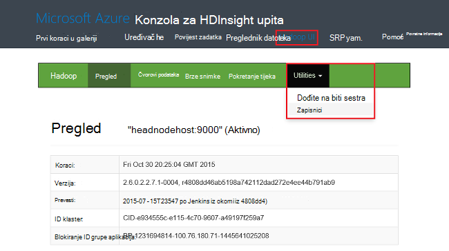
    
    Iz **Hadoop korisničkog Sučelja*, možete pregledavati datoteke i zapisnicima. 

- **Yarn korisničkog Sučelja**.

    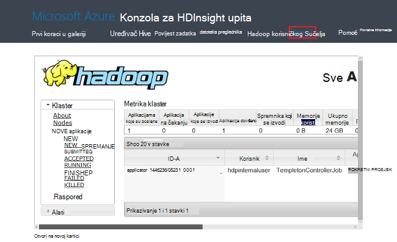

##Pokretanje grozd upita

Da biste pokrenuli grozd poslove s portala, kliknite **Vrste Hive Editor** na konzoli za HDInsight upita. Potražite u članku [Konzola za otvaranje HDInsight upita](#open-hdinsight-query-console).

##Praćenje zadataka

Praćenje zadataka na portalu, kliknite **Dosadašnje iskustvo** na konzoli za HDInsight upita. Potražite u članku [Konzola za otvaranje HDInsight upita](#open-hdinsight-query-console).

##Pregledavanje datoteka

Da biste pregledali datoteke spremljene u zadani račun za pohranu i računi povezani prostora za pohranu, kliknite **Datoteka preglednika** na konzoli za HDInsight upita. Potražite u članku [Konzola za otvaranje HDInsight upita](#open-hdinsight-query-console).

Možete koristiti i uslužni **Pregledaj datotečnom sustavu** s **Korisničkim Sučeljem Hadoop** na konzoli za HDInsight.  Potražite u članku [Konzola za otvaranje HDInsight upita](#open-hdinsight-query-console).

##Nadzor korištenja klaster

U odjeljku __Korištenje__ klaster plohu HDInsight prikazuje informacije o broj jezgri dostupne u pretplatu za korištenje s HDInsight, kao i broj jezgri dodijeliti ovaj klaster te način na koji se dodijeliti za čvorove u ovoj grupi. Pogledajte [popis i prikaz klastere](#list-and-show-clusters).

> [AZURE.IMPORTANT] Da biste pratili usluga koje nudi HDInsight klaster, morate koristiti Ambari Web ili Ambari REST API-JA. Dodatne informacije o korištenju Ambari potražite u članku [Upravljanje HDInsight klastere pomoću Ambari](hdinsight-hadoop-manage-ambari.md)

##Otvorite Hadoop korisničkog Sučelja

Praćenje klaster, pronađite datotečni sustav i zapisnicima, kliknite **Hadoop korisničkog Sučelja** konzole za HDInsight upita. Potražite u članku [Konzola za otvaranje HDInsight upita](#open-hdinsight-query-console).

##Otvorite Yarn korisničkog Sučelja

Da biste koristili Yarn korisničko sučelje, kliknite **Yarn korisničko Sučelje** na konzoli za HDInsight upita. Potražite u članku [Konzola za otvaranje HDInsight upita](#open-hdinsight-query-console).

##Povezivanje s klastere pomoću RDP

Vjerodajnice za klaster koju ste naveli pri njegova stvaranja dati pristup servisima na klaster, ali ne samu klaster putem udaljene radne površine. Možete uključiti udaljene radne površine pristup prilikom Dodjela klaster ili nakon klaster je dodijeljena. Upute o omogućivanju udaljene radne površine na stvaranje potražite u članku [Stvaranje HDInsight klaster](hdinsight-provision-clusters.md).

**Da biste omogućili udaljene radne površine**

1. Prijava na [Portal][azure-portal].
2. Kliknite **Pregledaj sve** na lijevom izborniku kliknite **HDInsight klastere**, kliknite svoje ime klaster.
3. Na gornjoj izborniku kliknite **Postavke** , a zatim kliknite **Udaljene radne površine**.
4. Unesite **Istekne na**, **Udaljene radne površine korisničko ime** i **Lozinku za udaljene radne površine**, a zatim kliknite **Omogući**.

    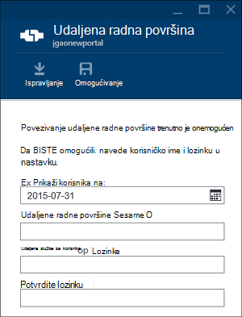

    Zadane vrijednosti za istekne na je tjedan dana.
> [AZURE.NOTE] Da biste omogućili udaljene radne površine na klaster možete koristiti i HDInsight .NET SDK. Upotrijebite metodu **EnableRdp** na klijentski objekt HDInsight na sljedeći način: **klijenta. EnableRdp (clustername, mjesto, "rdpuser", "rdppassword", DateTime.Now.AddDays(6))**. Isto tako, da biste onemogućili udaljene radne površine na klaster, možete koristiti **klijenta. DisableRdp (clustername, mjesto)**. Dodatne informacije o ove metode potražite u članku [Referenca za SDK .NET HDInsight](http://go.microsoft.com/fwlink/?LinkId=529017). To je moguće primijeniti samo na HDInsight klastere sustavom Windows.

**Da biste se povezali s klaster pomoću RDP**

1. Prijava na [Portal][azure-portal].
2. Kliknite **Pregledaj sve** na lijevom izborniku kliknite **HDInsight klastere**, kliknite svoje ime klaster.
3. Na gornjoj izborniku kliknite **Postavke** , a zatim kliknite **Udaljene radne površine**.
4. Kliknite **Poveži** i slijedite upute. Ako je povezivanje Onemogući, potrebno je omogućiti najprije. Upotrebljava li korisničko udaljene radne površine korisničko ime i lozinku.  Ne možete koristiti korisničke vjerodajnice za klaster.

##Otvorite naredbeni redak Hadoop

Za povezivanje s klaster putem udaljene radne površine i korištenje naredbenog retka Hadoop, morate najprije ste omogućili pristup udaljene radne površine klaster opisan u prethodnom odjeljku.

**Da biste otvorili Hadoop naredbenog retka**

1. Povezivanje s klaster putem udaljene radne površine.
8. Na radnoj površini dvokliknite **Hadoop naredbenog retka**.

    ![HDI. HadoopCommandLine][image-hadoopcommandline]

    Dodatne informacije o Hadoop naredbe potražite u članku [Referenca Hadoop naredbe](http://hadoop.apache.org/docs/current/hadoop-project-dist/hadoop-common/CommandsManual.html).

Snimka zaslona prethodne naziv mape ima broj verzije Hadoop ugrađen. Broj verzije možete promijeniti ovisno o verziji komponente Hadoop instalirano klaster. Varijable okruženja Hadoop možete koristiti da biste se pozvali na te mape. Ako, na primjer:

    cd %hadoop_home%
    cd %hive_home%
    cd %hbase_home%
    cd %pig_home%
    cd %sqoop_home%
    cd %hcatalog_home%
    
##Daljnji koraci
U ovom se članku ste naučili kako stvoriti programa klaster HDInsight pomoću portala i kako da biste otvorili alat naredbenog retka Hadoop. Dodatne informacije potražite u sljedećim člancima:

* [Administriranje HDInsight pomoću Azure komponente PowerShell](hdinsight-administer-use-powershell.md)
* [Administriranje HDInsight pomoću Azure EŽA](hdinsight-administer-use-command-line.md)
* [Stvaranje klastere HDInsight](hdinsight-provision-clusters.md)
* [Programski slanje Hadoop poslove](hdinsight-submit-hadoop-jobs-programmatically.md)
* [Početak rada s Azure HDInsight](hdinsight-hadoop-linux-tutorial-get-started.md)
* [Koju verziju sustava Hadoop je Azure HDInsight?](hdinsight-component-versioning.md)

[azure-portal]: https://portal.azure.com
[image-hadoopcommandline]: ./media/hdinsight-administer-use-management-portal/hdinsight-hadoop-command-line.png "Hadoop naredbenog retka"
