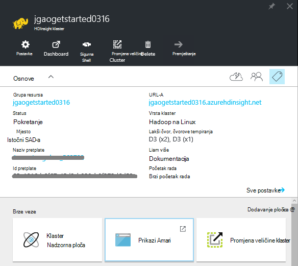
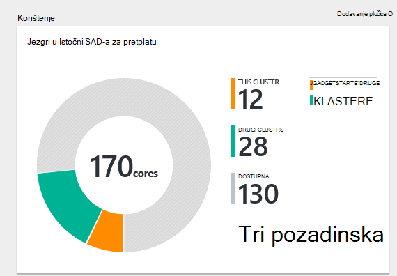
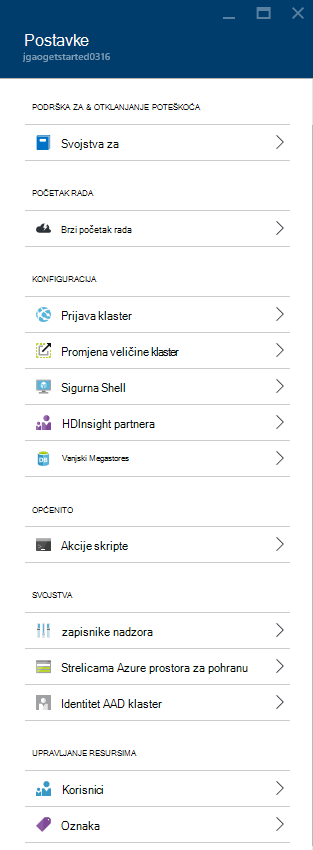
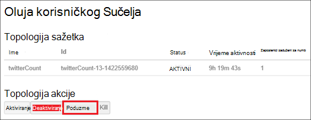
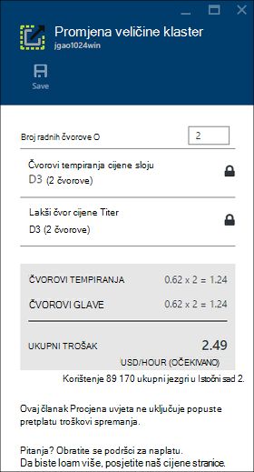
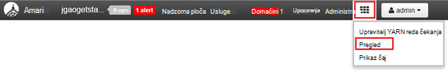

<properties
    pageTitle="Upravljanje sustavom Linux Hadoop klastere u HDInsight pomoću portala za Azure | Microsoft Azure"
    description="Saznajte kako stvarati i upravljati sustavom Linux HDInsight klastere pomoću portala za Azure."
    services="hdinsight"
    documentationCenter=""
    authors="mumian"
    manager="jhubbard"
    editor="cgronlun"
    tags="azure-portal"/>

<tags
    ms.service="hdinsight"
    ms.workload="big-data"
    ms.tgt_pltfrm="na"
    ms.devlang="na"
    ms.topic="article"
    ms.date="08/10/2016"
    ms.author="jgao"/>

#Upravljanje Hadoop klastere u HDInsight pomoću portala za Azure

[AZURE.INCLUDE [selector](../../includes/hdinsight-portal-management-selector.md)]

Pomoću [portala za Azure][azure-portal], možete upravljati sustavom Linux klastere u Azure HDInsight. Dodatne informacije o stvaranju klastere Hadoop u HDInsight pomoću drugih alata pomoću birač tabulatora. 

**Preduvjeti**

Prije nego počnete u ovom se članku, morate imati sljedeće:

- **Mogući Azure pretplate**. Pogledajte [Početak Azure besplatnu probnu verziju](https://azure.microsoft.com/documentation/videos/get-azure-free-trial-for-testing-hadoop-in-hdinsight/).

##Otvorite Portal sustava

1. Prijavite se u [https://portal.azure.com](https://portal.azure.com).
2. Kada otvorite portal sustava, možete učiniti sljedeće:

    - Kliknite **Novo** na lijevom izborniku da biste stvorili novi klaster:
    
        
    - Kliknite **Klastere HDInsight** na lijevom izborniku popis postojeće skupina
    
        

        Ako **HDInsight** ne prikazuje na lijevom izborniku, kliknite **Pregledaj**, a zatim kliknite **Klastere HDInsight**.

        

##Stvaranje klastere

[AZURE.INCLUDE [delete-cluster-warning](../../includes/hdinsight-delete-cluster-warning.md)]

HDInsight funkcionira s širokog raspona Hadoop komponente. Na popisu komponente provjeriti i podržanim koje potražite u članku [koju verziju sustava Hadoop se Azure HDInsight](hdinsight-component-versioning.md). Stvaranje informacije Općenito klaster potražite u članku [Stvaranje Hadoop klastere u HDInsight](hdinsight-hadoop-provision-linux-clusters.md). 

##Popis i prikaz klastere

1. Prijavite se u [https://portal.azure.com](https://portal.azure.com).
2. Kliknite **Klastere HDInsight** na lijevom izborniku popis postojeće skupina.
3. Kliknite naziv klaster. Ako je popis klaster dugo, možete koristiti filtra pri vrhu stranice.
4. Dvokliknite klaster s popisa da biste prikazali detalje.

    **Izbornik i osnove**:

    
    
    - **Postavke** i **Sve**: prikazuje plohu **Postavke** za klaster, koji vam omogućuje pristup konfiguracije detaljne informacije o klaster.
    - **Nadzorna ploča**, **Klaster nadzorne ploče** i ** URL: to su svi načini pristupa nadzorne ploče klaster, što je Ambari Web za klastere sustavom Linux.
    - **Sigurne ljuske**: prikazuje upute za povezivanje s klaster putem sigurne ljuske (SSH) veze.
    - **Promjena veličine klaster**: omogućuje vam da biste promijenili broj radnih čvorove za ovaj klaster.
    - **Brisanje**: briše klaster.
    - **Brzi početak rada ()**: prikazuje informacije koje će vam olakšati početak rada s HDInsight.
    - **Korisnici ()**: omogućuje postavljanje dozvola za _Upravljanje portala_ ovom klasteru za druge korisnike u sklopu Azure pretplate.
    
        > [AZURE.IMPORTANT] U ovom _samo_ utječe pristup i dozvole za ovaj klaster na portalu za Azure i ne utječe na koji možete povezati s ili slanje poslove klaster HDInsight.
    - **Oznake ()**: oznake omogućuje postavljanje parove ključa vrijednosti da biste odredili prilagođene taksonomiju oblak servisa. Na primjer, možda stvaranje ključ naziva __projekta__, a zatim pomoću zajednička vrijednost za sve servise povezane s određeni projekt.
    - **Prikazi Ambari**: veze Ambari web-mjestu.
    
    > [AZURE.IMPORTANT] Da biste upravljali usluga koje nudi HDInsight klaster, morate koristiti Ambari Web ili Ambari REST API-JA. Dodatne informacije o korištenju Ambari potražite u članku [Upravljanje HDInsight klastere pomoću Ambari](hdinsight-hadoop-manage-ambari.md).

    **Korištenje**:
    
    
    
5. Kliknite **Postavke**.

    

    - **Zapisnike nadzora**:
    - **Brzi početak rada**: prikazuje informacije koje će vam olakšati početak rada s HDInsight.
    - **Promjena veličine klaster**: povećanje i smanjenje broja klaster tempiranja čvorove.
    - **Sigurne ljuske**: prikazuje upute za povezivanje s klaster putem sigurne ljuske (SSH) veze.
    - **HDInsight partnera**: Dodavanje i uklanjanje trenutnog HDInsight partnera.
    - **Vanjski Metastores**: prikaz metastores grozd i Oozie. Na metastores moguće je konfigurirati samo tijekom procesa stvaranja klaster.
    - **Akcije skripte**: pokretanje tulum skripte na klaster.
    - **Svojstva**: Prikaz svojstava klaster.
    - **Tipke za pohranu Azure**: prikaz zadani račun za pohranu i njegova ključa. Račun za pohranu je konfiguracije tijekom procesa stvaranja klaster.
    - **Identitet AAD klaster**: 
    - **Korisnici**: omogućuje postavljanje dozvola za _Upravljanje portala_ ovom klasteru za druge korisnike u sklopu Azure pretplate.
    - **Oznaka**: oznake omogućuje postavljanje parove ključa vrijednosti da biste odredili prilagođene taksonomiju oblak servisa. Na primjer, možda stvaranje ključ naziva __projekta__, a zatim pomoću zajednička vrijednost za sve servise povezane s određeni projekt.
    
    > [AZURE.NOTE] Ovo je popis generički dostupne postavke; ne sve će postojati za sve vrste klaster.

6. Kliknite **Svojstva**:

    Svojstva su:
    
    - **Naziv glavnog računala**: klaster naziv.
    - **Klaster URL-a**.
    - **Status**: obuhvaćaju prekinuta, prihvaćen, ClusterStorageProvisioned, AzureVMConfiguration, HDInsightConfiguration, radu, pokrenut, pogreška, brisanje, brišu, prekoračili vremensko ograničenje, DeleteQueued, DeleteTimedout, DeleteError, PatchQueued, CertRolloverQueued, ResizeQueued, ClusterCustomization
    - **Regija**: Azure mjesto. Popis podržanih Azure mjesta, potražite u članku okvir **regija** padajućeg popisa na [HDInsight cijene](https://azure.microsoft.com/pricing/details/hdinsight/).
    - **Stvorili podataka**.
    - **Operacijski sustav**: **Windows** ili **Linux**.
    - **Vrsta**: Hadoop, HBase, oluja, povećati. 
    - **Verzija**. Pogledajte [HDInsight verzije](hdinsight-component-versioning.md)
    - **Pretplate**: naziv pretplate.
    - **ID pretplate**.
    - **Zadani izvor podataka**: zadani klaster datotečni sustav.
    - **Čvorovi tempiranja cijene sloju**.
    - **Lakši čvor cijene sloju**.

##Brisanje klastere

Brisanje klaster neće se izbrisati zadani račun za pohranu ili sve poslovne kontakte povezane prostora za pohranu. Ponovno stvorite klaster pomoću iste račune za pohranu i iste metastores. Preporučuje se da biste koristili novi spremnik Blob zadani kada ponovno stvorite klaster.

1. Prijava na [Portal][azure-portal].
2. Kliknite **Pregledaj sve** na lijevom izborniku kliknite **HDInsight klastere**, kliknite svoje ime klaster.
3. Na gornjoj izborniku kliknite **Izbriši** , a zatim slijedite upute.

Vidi također [Pauziraj/isključi klastere](#pauseshut-down-clusters).

##Promjena veličine klastere
Klaster skaliranje značajka omogućuje vam da biste promijenili broj radnih čvorove koristi klaster koja se izvodi u Azure HDInsight bez potrebe da biste ponovno stvorili klaster.

>[AZURE.NOTE] Samo klaster s HDInsight verziju 3.1.3 ili noviji podržava. Ako niste sigurni verzije svoj klaster, možete provjeriti svojstva stranice.  Pogledajte [popis i prikaz klastere](#list-and-show-clusters).

Utjecaj promjene samog broja čvorove podatke za svaku vrstu klaster podržava HDInsight:

- Hadoop

    Jednostavno možete povećati broj radnih čvorove klasteru Hadoop sa sustavom bez koje utječu na sve zadatke na čekanju ili izvodi. Novi zadaci također mogu poslati tijekom postupka. Pogreške u operaciji skaliranja rukuje obavljanje tako da se klaster uvijek lijevo u funkcionalno stanje.

    Kada je Hadoop klaster neproporcionalno prema dolje tako da smanjite broj čvorove podataka, neke usluge u klasteru ponovno pokrenete. Zbog toga sve pokrenute i zadatke koji čekaju poslove uvoza nakon dovršetka postupka skaliranja. Možete, međutim, pošaljite poslove nakon dovršetka postupka.

- HBase

    Jednostavno možete dodati ili ukloniti čvorove za svoj klaster HBase dok se izvodi. Regionalne poslužitelji se automatski raspoređen u roku od dovršetka postupka skaliranja nekoliko minuta. Međutim, regionalne poslužitelja možete i ručno saldo zapisivanje u headnode klaster i pokretanjem sljedeće naredbe iz prozor naredbenog retka:

        >pushd %HBASE_HOME%\bin
        >hbase shell
        >balancer

    Dodatne informacije o korištenju ljuske HBase potražite u članku]
- Oluja

    Jednostavno možete dodati ili ukloniti čvorove podataka za svoj klaster oluja dok se izvodi. No uspješnom dovršetku postupka skaliranja, morat ćete poduzme topologije.

    Rebalancing je moguće napraviti na dva načina:

    * Oluja web korisničkog Sučelja
    * Alat za sučelja naredbenog retka (EŽA)

    Potražite u [dokumentaciji Apache oluja](http://storm.apache.org/documentation/Understanding-the-parallelism-of-a-Storm-topology.html) više pojedinosti.

    Oluja web korisničkog Sučelja je dostupan na klasteru HDInsight:

    

    Evo primjera kako pomoću naredbe EŽA poduzme oluja topologija:

        ## Reconfigure the topology "mytopology" to use 5 worker processes,
        ## the spout "blue-spout" to use 3 executors, and
        ## the bolt "yellow-bolt" to use 10 executors

        $ storm rebalance mytopology -n 5 -e blue-spout=3 -e yellow-bolt=10

**Da biste skalirali klastere**

1. Prijava na [Portal][azure-portal].
2. Kliknite **Pregledaj sve** na lijevom izborniku kliknite **HDInsight klastere**, kliknite svoje ime klaster.
3. Na gornjoj izborniku kliknite **Postavke** , a zatim **Klaster mjerilo**.
4. Unesite **broj radnih čvorove**. Ograničenja broja čvora klaster razlikuje se među Azure pretplate. Obratite se podršci za naplatu da biste povećali ograničenje.  Podaci o troškovima odražavaju se promjene broj čvorove.

    

##Zaustavi/isključi klastere

Većinu zadataka Hadoop su obrade koje su samo povremeno pokrenuli. Za većinu klastere Hadoop, postoje velike točke vrijeme u kojem Klaster se koristi za obradu. S HDInsight, vaši podaci se pohranjuju u Azure prostor za pohranu, da biste mogli sigurno izbrisati klaster kada se ne koristi.
Također se naplatiti klaster programa HDInsight čak i ako se ne koristi. Budući da su naknade za klaster više puta veći od naknade za pohranu, je li bolje Ekonomske da biste izbrisali klastere kada se ne nalaze u upotrebi.

Možete programirati postupka na više načina:

- Korisnik tvorničke Azure podataka. Potražite u članku [Stvaranje osvježavati sustavom Linux Hadoop klaster u HDInsight pomoću tvorničke Azure podataka](hdinsight-hadoop-create-linux-clusters-adf.md) za stvaranje na zahtjev HDInsight povezani servisi.
- Koristite Azure PowerShell.  Potražite [podatke o kašnjenju leta analiza](hdinsight-analyze-flight-delay-data.md).
- Koristite Azure EŽA. Potražite u članku [Upravljanje HDInsight klastere pomoću Azure EŽA](hdinsight-administer-use-command-line.md).
- Pomoću HDInsight .NET SDK. Potražite u članku [Slanje Hadoop zadatke](hdinsight-submit-hadoop-jobs-programmatically.md).

Cijene informacije potražite u članku [HDInsight cijene](https://azure.microsoft.com/pricing/details/hdinsight/). Da biste izbrisali klaster s portala, potražite u članku [Brisanje klastere](#delete-clusters)

##Promjena lozinke

Za HDInsight klaster može imati dvije korisničke račune. U HDInsight (poznatog skupine korisnički račun HTTP korisnički račun) i korisnički račun SSH stvaraju tijekom procesa stvaranja. Možete na webu Ambari korisničkog Sučelja da biste promijenili korisničko ime za klaster korisnički račun i lozinku, a akcija skriptu da biste promijenili SSH korisnički račun

###Promjena lozinke korisničkog klaster

Korisničko Sučelje Web Ambari možete koristiti da biste promijenili klaster korisničku lozinku. Da biste se prijavili u Ambari, morate koristiti postojeće klaster korisničko ime i lozinku.

> [AZURE.NOTE] Ako promijenite lozinku korisničkog (administratorskog) klaster, to može uzrokovati skripte akcije pokrenuli u odnosu na ovom klasteru uvoza. Ako imate radnje postojanog skripte te čvorove tempiranja cilj, te možda neće uspjeti kada dodate čvorove klaster kroz promjena veličine operacije. Dodatne informacije o akcije skripte potražite u članku [Prilagodba HDInsight klastere pomoću skripte akcije](hdinsight-hadoop-customize-cluster-linux.md).

1. Prijavite se na korisničko Sučelje Web Ambari pomoću korisničke vjerodajnice za HDInsight klaster. Korisničko ime zadani je **administrator**. URL je **https://&lt;HDInsight klaster naziv > azurehdinsight.net**.
2. Kliknite **Administracija** na vrhu izborniku, a zatim kliknite "Upravljanje Ambari". 
3. Na lijevom izborniku kliknite **korisnicima**.
4. Kliknite **administrator**.
5. Kliknite **Promijeni lozinku**.

Ambari potom Promijeni lozinku na sve čvorove u klasteru.

###Promjena lozinke korisničkog SSH

1. Sljedeće uređivaču teksta, spremite kao datoteku pod nazivom __changepassword.sh__.

    > [AZURE.IMPORTANT] Morate koristiti uređivač koji koristi LF kao završetak crte. Ako se uređivač koristi riječ o CRLF, zatim skriptu neće funkcionirati.
    
        #! /bin/bash
        USER=$1
        PASS=$2

        usermod --password $(echo $PASS | openssl passwd -1 -stdin) $USER

2. Prenesite datoteku na mjesto za pohranu koje se može pristupiti iz servisa HDInsight pomoću HTTP ili HTTPS adrese. Ako, na primjer, javnu datoteku pohranite kao što je OneDrive ili blobova platforme Azure prostora za pohranu. Spremite URI (HTTP ili HTTPS adresa,) datoteku, kao što je to je potrebno u sljedećem koraku.

3. Na portalu Azure odaberite svoj klaster HDInsight, a zatim odaberite __sve postavke__. Plohu __Postavke__ odaberite __Akcije skripte__.

4. Plohu __Akcije skripte__ odaberite __Pošalji nove__. Kada se pojavi plohu __akcija slanja skripte__ , unesite sljedeće podatke.

  	| Polje | Vrijednost |
  	| ----- | ----- |
  	| Ime | Promjena ssh lozinke |
  	| Tulum skripte URI-JA | URI changepassword.sh datoteku |
  	| Čvorovi (glave tempiranja, Nimbus, nadzornik, Zookeeper, itd.) | ✓ za sve vrste čvor koji se na popisu |
  	| Parametri | Unesite korisničko ime SSH, a zatim s novom lozinkom. Treba li jedan razmak između korisničko ime i lozinku.
  	| Zadržava ovu akciju skripte... | To polje ostavite poništen.

5. Odaberite __Stvori__ da biste primijenili skriptu. Kada se dovrši skriptu, moći povezati klaster SSH pomoću nove lozinke.

##Pristup GRANT/revoke

HDInsight klastere imati sljedeće HTTP web-usluge (Svi od tih servisa imaju RESTful krajnje točke):

- ODBC
- JDBC
- Ambari
- Oozie
- Templeton

Prema zadanim postavkama tih servisa imaju pristup. Koje možete revoke/dopuštanje pristupa pomoću [EŽA Azure](hdinsight-administer-use-command-line.md#enabledisable-http-access-for-a-cluster) i [Azure PowerShell](hdinsight-administer-use-powershell.md#grantrevoke-access).

##Pronalaženje ID pretplate

**Da biste pronašli pretplate Azure ID-a**

1. Prijava na [Portal][azure-portal].
2. Na lijevom izborniku kliknite **Pregledaj sve** , a zatim kliknite **pretplate**. Pretplate sadrži naziv i ID-a.

Svaki klaster je vezan uz pretplatu na Azure. ID pretplate prikazuje se na klaster **ključna** pločica. Pogledajte [popis i prikaz klastere](#list-and-show-clusters).

##Traženje grupa resursa 

U načinu ARM svaki HDInsight klaster stvara se s grupom Azure resursa. Prikazuje grupi Azure resursa koji pripada klaster:

- Na popisu klaster ima stupac **Grupu resursa** .
- Klaster **ključna** pločicu.  

Pogledajte [popis i prikaz klastere](#list-and-show-clusters).

##Pronalaženje zadani račun za pohranu

Svaki klaster HDInsight ima zadani račun za pohranu. Zadani račun za pohranu i njegov tipke za klaster pojavit će se u odjeljku **Postavke**/**Svojstva**/**Tipke Azure prostora za pohranu**. Pogledajte [popis i prikaz klastere](#list-and-show-clusters).

##Pokretanje grozd upita

Ne možete pokrenuti posao grozd izravno na portalu Azure, ali možete koristiti prikaz vrste Hive na korisničko Sučelje Web Ambari.

**Da biste pokrenuli grozd upita pomoću prikaza vrste Hive Ambari**

1. Prijavite se na korisničko Sučelje Web Ambari pomoću korisničke vjerodajnice za HDInsight klaster. Korisničko ime defaut je **administrator**. URL je **https://&lt;HDInsight klaster naziv > azurehdinsight.net**.
2. Otvorite prikaz vrste Hive kao što je prikazano u sljedećim snimku zaslona:  

    
3. Na gornjoj izborniku kliknite **upit** .
4. Unesite grozd upita u **Uređivaču upita**, a zatim kliknite **izvrši**.

##Praćenje zadataka

Potražite u članku [Upravljanje HDInsight klastere pomoću korisničkog Sučelja Web Ambari](hdinsight-hadoop-manage-ambari.md#monitoring).

##Pregledavanje datoteka

Pomoću portala za Azure, možete pregledavati sadržaj spremnik zadani.

1. Prijavite se u [https://portal.azure.com](https://portal.azure.com).
2. Kliknite **Klastere HDInsight** na lijevom izborniku popis postojeće skupina.
3. Kliknite naziv klaster. Ako je popis klaster dugo, možete koristiti filtra pri vrhu stranice.
4. Kliknite **Postavke**.
5. **Postavke** plohu, kliknite **Tipke Azure prostora za pohranu**.
6. Kliknite zadani naziv računa za pohranu.
7. Kliknite pločicu **blob-ova** .
8. Kliknite zadani naziv kontejner.

##Nadzor korištenja klaster

U odjeljku __Korištenje__ klaster plohu HDInsight prikazuje informacije o broj jezgri dostupne u pretplatu za korištenje s HDInsight, kao i broj jezgri dodijeliti ovaj klaster te način na koji se dodijeliti za čvorove u ovoj grupi. Pogledajte [popis i prikaz klastere](#list-and-show-clusters).

> [AZURE.IMPORTANT] Da biste pratili usluga koje nudi HDInsight klaster, morate koristiti Ambari Web ili Ambari REST API-JA. Dodatne informacije o korištenju Ambari potražite u članku [Upravljanje HDInsight klastere pomoću Ambari](hdinsight-hadoop-manage-ambari.md)

##Povezivanje s klaster

Potražite u članku [Korištenje grozd s Hadoop u HDInsight s SSH](hdinsight-hadoop-use-hive-ssh.md#ssh).
    
##Daljnji koraci
U ovom se članku ste naučili kako stvoriti programa klaster HDInsight pomoću portala i kako da biste otvorili alat naredbenog retka Hadoop. Dodatne informacije potražite u sljedećim člancima:

* [Administriranje HDInsight pomoću Azure komponente PowerShell](hdinsight-administer-use-powershell.md)
* [Administriranje HDInsight pomoću Azure EŽA](hdinsight-administer-use-command-line.md)
* [Stvaranje klastere HDInsight](hdinsight-provision-clusters.md)
* [Korištenje grozd u HDInsight](hdinsight-use-hive.md)
* [Korištenje Svinja u HDInsight](hdinsight-use-pig.md)
* [Korištenje Sqoop u HDInsight](hdinsight-use-sqoop.md)
* [Početak rada s Azure HDInsight](hdinsight-hadoop-linux-tutorial-get-started.md)
* [Koju verziju sustava Hadoop je Azure HDInsight?](hdinsight-component-versioning.md)

[azure-portal]: https://portal.azure.com
[image-hadoopcommandline]: ./media/hdinsight-administer-use-portal-linux/hdinsight-hadoop-command-line.png "Hadoop naredbenog retka"
