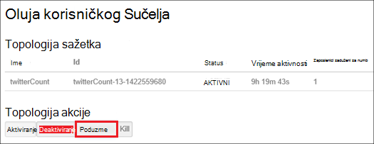

<properties
    pageTitle="Upravljanje Hadoop klastere u HDInsight sa servisom PowerShell | Microsoft Azure"
    description="Upute za izvođenje administrativnih zadataka za klastere Hadoop u HDInsight pomoću komponente PowerShell Azure."
    services="hdinsight"
    editor="cgronlun"
    manager="jhubbard"
    tags="azure-portal"
    authors="mumian"
    documentationCenter=""/>

<tags
    ms.service="hdinsight"
    ms.workload="big-data"
    ms.tgt_pltfrm="na"
    ms.devlang="na"
    ms.topic="article"
    ms.date="08/10/2016"
    ms.author="jgao"/>

# Upravljanje Hadoop klastere u HDInsight pomoću ljuske PowerShell za Azure

[AZURE.INCLUDE [selector](../../includes/hdinsight-portal-management-selector.md)]

Azure PowerShell je Napredna okruženje za skriptiranje koje možete koristiti za upravljanje i automatizirati implementacije i upravljanja vaše radnih opterećenja servisu Azure. U ovom se članku će Saznajte kako upravljati Hadoop klastere u Azure HDInsight pomoću lokalne konzole za Azure PowerShell pomoću komponente Windows PowerShell. Na popisu cmdleta ljuske PowerShell servisa HDInsight potražite u članku [Referenca za cmdlet HDInsight][hdinsight-powershell-reference].

**Preduvjeti**

Prije nego počnete u ovom se članku, morate imati sljedeće:

- **Mogući Azure pretplate**. Pogledajte [Početak Azure besplatnu probnu verziju](https://azure.microsoft.com/documentation/videos/get-azure-free-trial-for-testing-hadoop-in-hdinsight/).

##Instaliranje modula Azure PowerShell

[AZURE.INCLUDE [upgrade-powershell](../../includes/hdinsight-use-latest-powershell.md)]

Ako ste instalirali Azure PowerShell verzije 0.9 x, morate ga deinstalirati prije instalacije novijom verzijom.

Da biste provjerili verziju instaliranih PowerShell:

    Get-Module *azure*
    
Da biste deinstalirali stariju verziju, pokrenite programi i značajke na upravljačkoj ploči. 

##Stvaranje klastere

Potražite u članku [Stvaranje Linux sustavom klastere u HDInsight pomoću komponente PowerShell Azure](hdinsight-hadoop-create-linux-clusters-azure-powershell.md)

##Popis klastere
Da biste dobili popis svih klastere u trenutne pretplate, koristite sljedeću naredbu:

    Get-AzureRmHDInsightCluster

##Prikaži klaster

Da biste prikazali detalje o određenim klaster trenutne pretplate, koristite sljedeću naredbu:

    Get-AzureRmHDInsightCluster -ClusterName <Cluster Name>

##Brisanje klastere

Da biste izbrisali klaster, koristite sljedeću naredbu:

    Remove-AzureRmHDInsightCluster -ClusterName <Cluster Name>

Možete i izbrisati klaster uklanjanjem resursa grupu koja sadrži klaster. Uzmite u obzir, izbrisat će se svi resursi u grupi, uključujući zadani račun za pohranu.

    Remove-AzureRmResourceGroup -Name <Resource Group Name>
            
##Promjena veličine klastere
Klaster skaliranje značajka omogućuje vam da biste promijenili broj radnih čvorove koristi klaster koja se izvodi u Azure HDInsight bez potrebe da biste ponovno stvorili klaster.

>[AZURE.NOTE] Samo klaster s HDInsight verziju 3.1.3 ili noviji podržava. Ako niste sigurni verzije svoj klaster, možete provjeriti svojstva stranice.  Pogledajte [popis i prikaz klastere](hdinsight-administer-use-portal-linux.md#list-and-show-clusters).

Utjecaj promjene samog broja čvorove podatke za svaku vrstu klaster podržava HDInsight:

- Hadoop

    Jednostavno možete povećati broj radnih čvorove klasteru Hadoop sa sustavom bez koje utječu na sve zadatke na čekanju ili izvodi. Novi zadaci također mogu poslati tijekom postupka. Pogreške u operaciji skaliranja rukuje obavljanje tako da se klaster uvijek lijevo u funkcionalno stanje.

    Kada je Hadoop klaster neproporcionalno prema dolje tako da smanjite broj čvorove podataka, neke usluge u klasteru ponovno pokrenete. Zbog toga sve pokrenute i zadatke koji čekaju poslove uvoza nakon dovršetka postupka skaliranja. Možete, međutim, pošaljite poslove nakon dovršetka postupka.

- HBase

    Jednostavno možete dodati ili ukloniti čvorove za svoj klaster HBase dok se izvodi. Regionalnih poslužitelji se automatski raspoređen u roku od dovršetka postupka skaliranja nekoliko minuta. Međutim, regionalne poslužitelja možete i ručno saldo prijave u headnode klaster i pokretanjem sljedeće naredbe iz prozor naredbenog retka:

        >pushd %HBASE_HOME%\bin
        >hbase shell
        >balancer

- Oluja

    Jednostavno možete dodati ili ukloniti čvorove podataka za svoj klaster oluja dok se izvodi. No uspješnom dovršetku postupka skaliranja, morat ćete poduzme topologije.

    Rebalancing je moguće napraviti na dva načina:

    * Oluja web korisničkog Sučelja
    * Alat za sučelja naredbenog retka (EŽA)

    Potražite u [dokumentaciji Apache oluja](http://storm.apache.org/documentation/Understanding-the-parallelism-of-a-Storm-topology.html) više pojedinosti.

    Oluja web korisničkog Sučelja je dostupan na klasteru HDInsight:

    

    Evo primjera kako pomoću naredbe EŽA poduzme oluja topologija:

        ## Reconfigure the topology "mytopology" to use 5 worker processes,
        ## the spout "blue-spout" to use 3 executors, and
        ## the bolt "yellow-bolt" to use 10 executors

        $ storm rebalance mytopology -n 5 -e blue-spout=3 -e yellow-bolt=10

Da biste promijenili klaster Hadoop pomoću komponente PowerShell Azure, na klijentskom računalu pokrenite sljedeću naredbu:

    Set-AzureRmHDInsightClusterSize -ClusterName <Cluster Name> -TargetInstanceCount <NewSize>
    

##Pristup GRANT/revoke

HDInsight klastere imati sljedeće HTTP web-usluge (Svi od tih servisa imaju RESTful krajnje točke):

- ODBC
- JDBC
- Ambari
- Oozie
- Templeton

Prema zadanim postavkama tih servisa imaju pristup. Koje možete revoke/grant programa access. Da biste opozvali:

    Revoke-AzureRmHDInsightHttpServicesAccess -ClusterName <Cluster Name>

Da biste dodijelili:

    $clusterName = "<HDInsight Cluster Name>"

    # Credential option 1
    $hadoopUserName = "admin"
    $hadoopUserPassword = "<Enter the Password>"
    $hadoopUserPW = ConvertTo-SecureString -String $hadoopUserPassword -AsPlainText -Force
    $credential = New-Object System.Management.Automation.PSCredential($hadoopUserName,$hadoopUserPW)

    # Credential option 2
    #$credential = Get-Credential -Message "Enter the HTTP username and password:" -UserName "admin"
    
    Grant-AzureRmHDInsightHttpServicesAccess -ClusterName $clusterName -HttpCredential $credential

>[AZURE.NOTE] Po date/opozivanje programa access, će vratiti klaster korisničko ime i lozinku.

To se može i učiniti putem portala sustava. U odjeljku [Administriranje HDInsight pomoću portala za Azure][hdinsight-admin-portal].

##Ažurirajte korisničke vjerodajnice za HTTP

Nije isti postupak kao [Grant/revoke HTTP pristup](#grant/revoke-access). Ako klaster je dodijeljen pristup HTTP, ga morate najprije opoziv.  A zatim dopustiti pristup s nove korisničke vjerodajnice za HTTP.

##Pronalaženje zadani račun za pohranu

Sljedeću skriptu komponente Powershell pokazuje kako doći do zadani naziv računa za pohranu i ključ računa zadani prostor za pohranu za klaster.

    $clusterName = "<HDInsight Cluster Name>"
    
    $cluster = Get-AzureRmHDInsightCluster -ClusterName $clusterName
    $resourceGroupName = $cluster.ResourceGroup
    $defaultStorageAccountName = ($cluster.DefaultStorageAccount).Replace(".blob.core.windows.net", "")
    $defaultBlobContainerName = $cluster.DefaultStorageContainer
    $defaultStorageAccountKey = (Get-AzureRmStorageAccountKey -ResourceGroupName $resourceGroupName -Name $defaultStorageAccountName)[0].Value
    $defaultStorageAccountContext = New-AzureStorageContext -StorageAccountName $defaultStorageAccountName -StorageAccountKey $defaultStorageAccountKey 

##Traženje grupa resursa

U načinu resursima svaki HDInsight klaster pripada grupi Azure resursa.  Da biste pronašli grupu resursa:

    $clusterName = "<HDInsight Cluster Name>"
    
    $cluster = Get-AzureRmHDInsightCluster -ClusterName $clusterName
    $resourceGroupName = $cluster.ResourceGroup

##Slanje poslova

**Da biste poslali MapReduce poslove**

Potražite u članku [pokretanje Hadoop MapReduce uzoraka u HDInsight utemeljen na sustavu Windows](hdinsight-run-samples.md).

**Da biste poslali grozd poslova** 

Potražite u članku [pokretanje vrste Hive upita pomoću komponente PowerShell](hdinsight-hadoop-use-hive-powershell.md).

**Da biste poslali Svinja poslove**

Potražite u članku [pokretanje Svinja zadatke pomoću komponente PowerShell](hdinsight-hadoop-use-pig-powershell.md).

**Da biste poslali Sqoop poslove**

[Korištenje Sqoop sa servisa HDInsight](hdinsight-use-sqoop.md)potražite u članku.

**Da biste poslali Oozie poslove**

Potražite u članku [Korištenje Oozie s Hadoop definiranje i pokrenuti tijek rada u HDInsight](hdinsight-use-oozie.md).

##Prijenos podataka u spremište blobova platforme Azure
Potražite u članku [prijenos podataka HDInsight][hdinsight-upload-data].

## Vidi također
* [HDInsight cmdlet referentnu dokumentaciju][hdinsight-powershell-reference]
* [Administriranje HDInsight pomoću portala za Azure][hdinsight-admin-portal]
* [Administriranje HDInsight pomoću sučelja naredbenog retka][hdinsight-admin-cli]
* [Stvaranje klastere HDInsight][hdinsight-provision]
* [Prijenos podataka HDInsight][hdinsight-upload-data]
* [Programski slanje Hadoop poslove][hdinsight-submit-jobs]
* [Početak rada sa servisom Azure HDInsight][hdinsight-get-started]

[azure-purchase-options]: http://azure.microsoft.com/pricing/purchase-options/
[azure-member-offers]: http://azure.microsoft.com/pricing/member-offers/
[azure-free-trial]: http://azure.microsoft.com/pricing/free-trial/

[hdinsight-get-started]: hdinsight-hadoop-linux-tutorial-get-started.md
[hdinsight-provision]: hdinsight-provision-clusters.md
[hdinsight-provision-custom-options]: hdinsight-provision-clusters.md#configuration
[hdinsight-submit-jobs]: hdinsight-submit-hadoop-jobs-programmatically.md

[hdinsight-admin-cli]: hdinsight-administer-use-command-line.md
[hdinsight-admin-portal]: hdinsight-administer-use-management-portal.md
[hdinsight-storage]: hdinsight-hadoop-use-blob-storage.md
[hdinsight-use-hive]: hdinsight-use-hive.md
[hdinsight-use-mapreduce]: hdinsight-use-mapreduce.md
[hdinsight-upload-data]: hdinsight-upload-data.md
[hdinsight-flight]: hdinsight-analyze-flight-delay-data.md

[hdinsight-powershell-reference]: https://msdn.microsoft.com/library/dn858087.aspx

[powershell-install-configure]: powershell-install-configure.md

[image-hdi-ps-provision]: ./media/hdinsight-administer-use-powershell/HDI.PS.Provision.png
