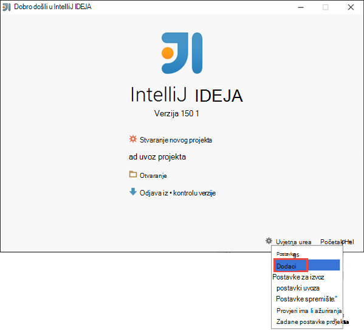
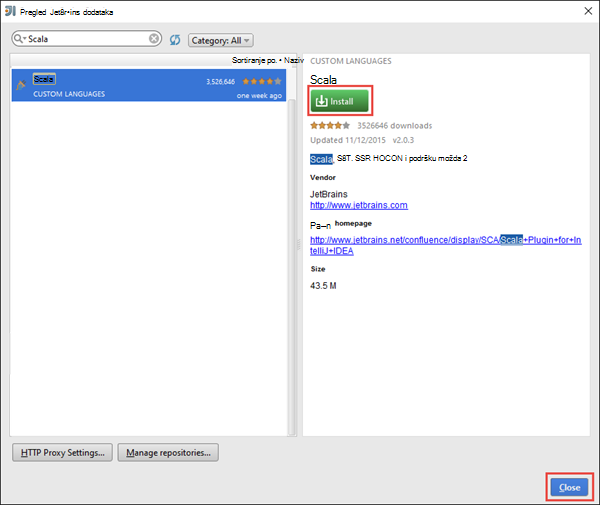
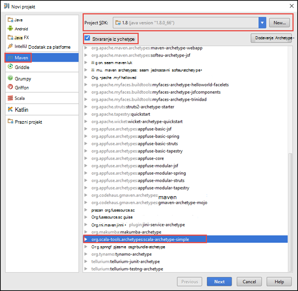
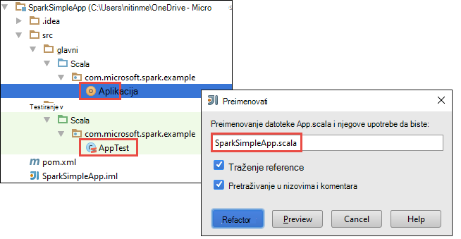
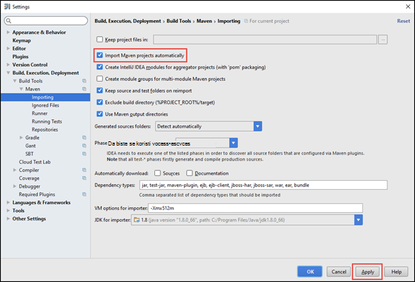
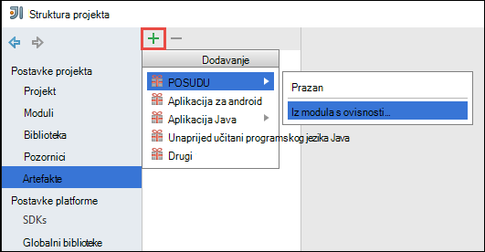
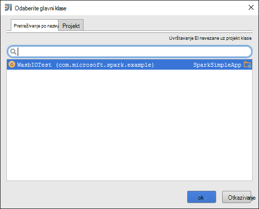
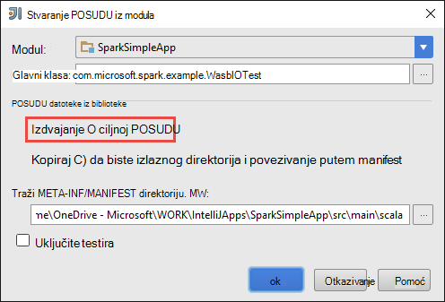
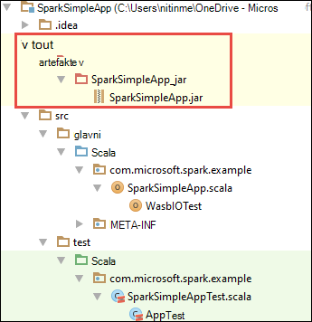

<properties
    pageTitle="Stvaranje samostalne scala aplikacije da biste pokrenuli za klastere HDInsight Spark | Microsoft Azure"
    description="Saznajte kako stvoriti samostalne Spark aplikacije da biste pokrenuli za klastere HDInsight Spark."
    services="hdinsight"
    documentationCenter=""
    authors="nitinme"
    manager="jhubbard"
    editor="cgronlun"
    tags="azure-portal"/>

<tags
    ms.service="hdinsight"
    ms.workload="big-data"
    ms.tgt_pltfrm="na"
    ms.devlang="na"
    ms.topic="article"
    ms.date="10/28/2016"
    ms.author="nitinme"/>

# Stvaranje samostalnog Scala aplikacije pokrenuti Apache Spark klaster na HDInsight Linux

Ovaj članak sadrži detaljne upute za programiranje samostalne Spark aplikacije pisane Scala Maven pomoću IntelliJ IDEJA. U članku koristi Apache Maven kao sustav Sastavi i započinje s postojećeg archetype za Maven za Scala nudi IntelliJ IDEJA.  Pri s više razine, stvaranje na Scala aplikacije IntelliJ IDEJA će obuhvaćaju sljedeće korake:

* Koristite Maven kao sustav Sastavi.
* Ažurirajte datoteku projekta Object Model (POM) da biste riješili Spark modul ovisnosti.
* Upišite svoju aplikaciju Scala.
* Generiranje posudu datoteke koje se mogu poslati klastere HDInsight Spark.
* Pokrenite aplikaciju na Spark klaster pomoću Livije.

>[AZURE.NOTE] HDInsight sadrži i alat za dodatak IntelliJ IDEJA da biste olakšali postupak stvaranja i slanja aplikacije programa HDInsight Spark klaster na Linux. Dodatne informacije potražite u članku [Korištenje HDInsight Alati dodatak za IntelliJ IDEJA za stvaranje i slanje Spark aplikacije](hdinsight-apache-spark-intellij-tool-plugin.md).

**Preduvjeti**

* Azure pretplate. Pogledajte [Početak Azure besplatnu probnu verziju](https://azure.microsoft.com/documentation/videos/get-azure-free-trial-for-testing-hadoop-in-hdinsight/).
* Klaster Apache Spark na HDInsight Linux. Upute potražite u članku [Stvaranje Spark Apache klastere u Azure HDInsight](hdinsight-apache-spark-jupyter-spark-sql.md).
* Oracle Java Development kit. Možete ga instalirati s [ovdje](http://www.oracle.com/technetwork/java/javase/downloads/jdk8-downloads-2133151.html).
* Na Java IDE. U ovom se članku koristi IntelliJ IDEJA 15.0.1. Možete ga instalirati s [ovdje](https://www.jetbrains.com/idea/download/).

## Instalirajte dodatak za Scala za IntelliJ IDEJA

Ako instalacija IntelliJ IDEJA ne jeste li ne pitaj za omogućivanje Scala dodatak, pokrenite IntelliJ IDEJA i proći kroz sljedeće korake da biste instalirali dodatak:

1. Pokretanje IntelliJ IDEJA i na zaslonu dobrodošlice kliknite **Konfiguriraj** , a zatim kliknite **Dodaci**.

    

2. Na sljedećem zaslonu kliknite **dodatak za instaliranje JetBrains** u donjem lijevom kutu. U dijaloškom okviru **Pregledaj JetBrains dodaci** koji se otvara pronađite Scala i kliknite **Instaliraj**.

    

3. Kada uspješno instalira dodatak, kliknite **gumb ponovno pokrenite IntelliJ IDEJA** da biste ponovno pokrenuli u IDE.

## Stvaranje samostalne Scala projekta

1. Pokrenite IntelliJ IDEJA i stvaranje novog projekta. U novi projekt dijaloškom okviru provjerite sljedeće mogućnosti, a zatim kliknite **Dalje**.

    

    * Odaberite **Maven** kao vrsta projekta.
    * Navedite **projekta SDK**. Kliknite Novo, a zatim otvorite Instalacijski imenik Java obično `C:\Program Files\Java\jdk1.8.0_66`.
    * Odaberite mogućnost **Stvori iz archetype** .
    * Na popisu archetypes odaberite **org.scala-tools.archetypes:scala-archetype – jednostavno**. To će stvoriti strukturu desnom direktorija i preuzeti potrebnu zadanu ovisnosti pisati Scala program.

2. Unesite odgovarajuće vrijednosti za **GroupId**, **ArtifactId**i **verziju**. Kliknite **Dalje**.

3. U sljedećem dijaloškom okviru koju navedete Maven osnovne mape i ostale postavke za korisnika, prihvatite zadane postavke, a zatim kliknite **Dalje**.

4. U dijaloškom okviru posljednje Navedite naziv projekta i mjesto, a zatim kliknite **Završi**.

5. Izbrišite datoteku **MySpec.Scala** na **src\test\scala\com\microsoft\spark\example**. Za aplikaciju ne morate to.

6. Ako je potrebno, preimenovati zadane izvora i testiranje datoteke. U lijevom oknu IDEJA IntelliJ dođite do **src\main\scala\com.microsoft.spark.example**. Desnom tipkom miša kliknite **App.scala**, kliknite **Refactor**, kliknite Preimenuj datoteku, a u dijaloškom okviru unesite novi naziv za aplikaciju pa **Refactor**.

      

7. U sljedećim koracima će se ažurirati pom.xml da biste definirali ovisnosti Spark Scala aplikacije. Za te ovisnosti da biste preuzeli i rješava automatski morate konfigurirati Maven sukladno tome.

    

    1. Na izborniku **datoteka** kliknite **Postavke**.
    2. U dijaloškom okviru **Postavke** dođite do **stvaranja, izvođenja, implementaciju** > **Alati za sastavljanje** > **Maven** > **Uvoz**.
    3. Odaberite mogućnost za **Maven uvoz projekata automatski**.
    4. Kliknite **Primijeni**, a zatim kliknite **u redu**.

8. Ažurirajte Scala izvornu datoteku da biste uključili kodu aplikacije. Otvaranje i zamijeniti postojeći uzorak koda sljedeći kod i spremite željene promjene. Kod čita podatke iz HVAC.csv (dostupno na sve HDInsight Spark klastere), dohvaća retke koji imaju samo jednu znamenku u stupcu šesti i zapisuje izlaz **/HVACOut** u kontejneru za zadani prostor za pohranu za klaster.

        package com.microsoft.spark.example

        import org.apache.spark.SparkConf
        import org.apache.spark.SparkContext

        /**
          * Test IO to wasb
          */
        object WasbIOTest {
          def main (arg: Array[String]): Unit = {
            val conf = new SparkConf().setAppName("WASBIOTest")
            val sc = new SparkContext(conf)

            val rdd = sc.textFile("wasbs:///HdiSamples/HdiSamples/SensorSampleData/hvac/HVAC.csv")

            //find the rows which have only one digit in the 7th column in the CSV
            val rdd1 = rdd.filter(s => s.split(",")(6).length() == 1)

            rdd1.saveAsTextFile("wasbs:///HVACout")
          }
        }

9. Ažurirajte na pom.xml.

    1.  Unutar `<project>\<properties>` dodajte sljedeće:

            <scala.version>2.10.4</scala.version>
            <scala.compat.version>2.10.4</scala.compat.version>
            <scala.binary.version>2.10</scala.binary.version>

    2. Unutar `<project>\<dependencies>` dodajte sljedeće:

            <dependency>
              <groupId>org.apache.spark</groupId>
              <artifactId>spark-core_${scala.binary.version}</artifactId>
              <version>1.4.1</version>
            </dependency>

    Spremiti promjene na pom.xml.

10. Stvaranje datoteke .jar. IntelliJ IDEJA omogućuje stvaranje POSUDU kao artefakt projekta. Izvršite sljedeće korake.

    1. Na izborniku **datoteka** kliknite **Struktura projekta**.
    2. U dijaloškom okviru **Strukturu projekta** kliknite **artefakte** , a zatim kliknite znak plus. Iz skočnog dijaloškog okvira kliknite **POSUDU**, a zatim **iz modula s ovisnosti**.

        

    3. U dijaloškom okviru **Stvaranje POSUDU iz modula** kliknite tri točke ( ) na temelju **Osnovna klasa**.

    4. U dijaloškom okviru **Odaberite Osnovna klasa** odaberite klasa koja se po zadanim postavkama, a zatim kliknite **u redu**.

        

    5. U dijaloškom okviru **Stvaranje POSUDU iz modula** provjerite je li odabrana mogućnost da biste **izdvojili ciljnoj POSUDU** , a zatim **u redu**. Time ste stvorili jedan POSUDU s sve ovisnosti.

        

    6. Na kartici raspored izlaz popis staklenke koji su dio paketa Maven projekta. Možete odabrati i izbrisati one na kojem aplikacija Scala ima nije Izravni ovisnosti. Za aplikaciju ne možemo stvarate ovdje, možete ukloniti sve osim posljednjeg nešto (**SparkSimpleApp Kompiliranje izlaz**). Odaberite staklenke da biste izbrisali i zatim kliknite ikonu **Izbriši** .

        

        Provjerite **nadograđuju provjerite** je li odabran okvir, koji omogućuje čitanje posudu nastaje svaki put projekta je ugrađen ili ažurirati. Kliknite **Primijeni** , a zatim **u redu**.

    7. Na traci izbornika kliknite **Sastavi**, a zatim **Učiniti projektu**. Možete kliknuti i **Sastavljanje artefakte** da biste stvorili posudu. U odjeljku **\out\artifacts**stvara se posudu izlaz.

        

## Pokrenite aplikaciju na Spark klaster

Da biste pokrenuli aplikaciju na klaster, morate učiniti sljedeće:

* **Kopiranje posudu aplikacije za Azure spremišta blobova** pridružene klaster. [**AzCopy**](../storage/storage-use-azcopy.md), uslužni program naredbenog retka, možete koristiti da biste to učinili. Postoji mnogo drugih klijenata koje možete koristiti za prijenos podataka. Možete pronaći dodatne informacije o ih na [prijenos podataka za Hadoop poslove u HDInsight](hdinsight-upload-data.md).

* **Korištenje Livije daljinski slanje na zadatak aplikacije** klaster Spark. Spark klastere na HDInsight obuhvaća Livije koji se izlaže krajnje točke OSTALE daljinski slanje Spark zadatke. Dodatne informacije potražite u članku [Slanje Spark poslove daljinski pomoću Livije s klastere Spark na HDInsight](hdinsight-apache-spark-livy-rest-interface.md).

## Vidi također

* [Pregled: Apache Spark na Azure HDInsight](hdinsight-apache-spark-overview.md)

### Scenariji

* [Spark bi: izvođenje analiza interaktivnih podataka pomoću Spark u HDInsight s alatima za Poslovno obavještavanje](hdinsight-apache-spark-use-bi-tools.md)

* [Spark s strojnog učenja: korištenje Spark u HDInsight za analizu sastavnih temperatura pomoću HVAC podataka](hdinsight-apache-spark-ipython-notebook-machine-learning.md)

* [Spark s strojnog učenja: korištenje Spark u HDInsight za predviđanje rezultata provjere za hranu](hdinsight-apache-spark-machine-learning-mllib-ipython.md)

* [Spark strujeće: Korištenje Spark u HDInsight za izgradnju u stvarnom vremenu strujanje aplikacije](hdinsight-apache-spark-eventhub-streaming.md)

* [Web-mjesto zapisnika analize pomoću Spark u HDInsight](hdinsight-apache-spark-custom-library-website-log-analysis.md)

### Stvaranje i pokretanje aplikacija

* [Pokretanje zadataka na Spark klaster pomoću Livije](hdinsight-apache-spark-livy-rest-interface.md)

### Alati i proširenja

* [Korištenje servisa HDInsight dodatak Alati za IntelliJ IDEJA za stvaranje i slanje Spark Scala aplikacije](hdinsight-apache-spark-intellij-tool-plugin.md)

* [Korištenje servisa HDInsight dodatak Alati za IntelliJ IDEJA za ispravljanje pogrešaka aplikacije Spark daljinski](hdinsight-apache-spark-intellij-tool-plugin-debug-jobs-remotely.md)

* [Koristite Zeppelin bilježnice s Spark klaster na HDInsight](hdinsight-apache-spark-use-zeppelin-notebook.md)

* [Dostupno za Jupyter bilježnicu u skupini Spark za HDInsight jezgre](hdinsight-apache-spark-jupyter-notebook-kernels.md)

* [Korištenje vanjskih paketa s bilježnicama Jupyter](hdinsight-apache-spark-jupyter-notebook-use-external-packages.md)

* [Na računalo instalirati Jupyter i povezati se HDInsight Spark klaster](hdinsight-apache-spark-jupyter-notebook-install-locally.md)

### Upravljanje resursima

* [Upravljanje resursima za klaster Apache Spark u Azure HDInsight](hdinsight-apache-spark-resource-manager.md)

* [Praćenje i ispravljanje pogrešaka zadataka izvodi na programa klaster Apache Spark u HDInsight](hdinsight-apache-spark-job-debugging.md)
