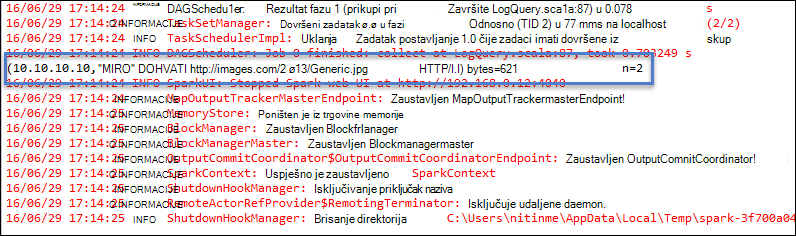

 <properties
    pageTitle="Stvaranje aplikacija Spark Scala pomoću alata za HDInsight u Azure komplet alata za Eclipse | Microsoft Azure"
    description="Saznajte kako stvoriti samostalne Spark aplikacije da biste pokrenuli za klastere HDInsight Spark."
    services="hdinsight"
    documentationCenter=""
    authors="nitinme"
    manager="jhubbard"
    editor="cgronlun"
    tags="azure-portal"/>

<tags
    ms.service="hdinsight"
    ms.workload="big-data"
    ms.tgt_pltfrm="na"
    ms.devlang="na"
    ms.topic="article"
    ms.date="08/30/2016"
    ms.author="nitinme"/>

# Pomoću alata za HDInsight u Azure komplet alata za Eclipse da biste stvorili Spark aplikacije za HDInsight Spark Linux klaster

Ovaj članak sadrži detaljne upute za programiranje aplikacije Spark pisane Scala i slanje da bi se HDInsight Spark skupine pomoću alata za HDInsight u Azure komplet alata za Eclipse. Pomoću alata u nekoliko različitih načina:

* Za razvoj i slanje Scala Spark aplikaciju na programa HDInsight Spark klaster
* Da biste pristupili klaster resursa Azure HDInsight Spark
* Da biste razviti i izvodi lokalno Scala Spark aplikacije

>[AZURE.IMPORTANT] Ovaj alat se može koristiti za stvaranje i slanje aplikacije koje su samo za programa HDInsight Spark klaster na Linux.

##Preduvjeti

* Azure pretplate. Pogledajte [Početak Azure besplatnu probnu verziju](https://azure.microsoft.com/documentation/videos/get-azure-free-trial-for-testing-hadoop-in-hdinsight/).

* Klaster Apache Spark na HDInsight Linux. Upute potražite u članku [Stvaranje Spark Apache klastere u Azure HDInsight](hdinsight-apache-spark-jupyter-spark-sql.md).

* Oracle Java Development kit 7 i 8 verzije. 
    * **Java SDK 7** koristi se za Kompiliranje Spark projekte kao skupina HDInsight podržava Java verzije 7. Java SDK 7 možete preuzeti iz [ovdje](http://www.oracle.com/technetwork/java/javase/downloads/jdk7-downloads-1880260.html).
    * **Java SDK 8** koristi se za vrijeme izvođenja Eclipse IDE. Preuzmite ga iz [ovdje](http://www.oracle.com/technetwork/java/javase/downloads/jdk8-downloads-2133151.html).

* Eclipse IDE. U ovom se članku koristi Eclipse Neon. Možete ga instalirati s [ovdje](https://www.eclipse.org/downloads/).

* IDE Scala za Eclipse. 
    * **Ako imate instaliran IDE za Eclipse**, možete dodati dodatak za Scala IDE tako da biste **lakše** -> **Instalirati novi softver**i dodavanje [http://download.scala-ide.org/sdk/lithium/e44/scala211/stable/site](http://download.scala-ide.org/sdk/lithium/e44/scala211/stable/site) kao izvor da biste preuzeli dodatak Scala za Eclipse. 
    * **Ako nemate instaliran IDE za Eclipse**, možete instalirati Scala IDE izravno iz [ovdje](http://scala-ide.org/download/sdk.html). Možete preuzeti .zip datoteke iz ove veze, izdvojite ga, dođite do mape u **/eclipse** i izvedite **eclipse.exe** datoteke iz nje.
    
    >[AZURE.NOTE] Koraci u ovom dokumentu temelje se na Eclipse IDE pomoću Scala dodatak je instaliran.

* Spark SDK. Preuzmite ga iz [ovdje](http://go.microsoft.com/fwlink/?LinkID=723585&clcid=0x409).

* Instalirajte [https://www.eclipse.org/efxclipse/install.html](https://www.eclipse.org/efxclipse/install.html)clipse e (fx).

## Instalacija alata za HDInsight u Azure komplet alata za Eclipse

HDInsight alata za Eclipse nije dostupan kao dio komplet alata za Azure za Eclipse. Upute za instaliranje alata za Azure potražite u članku [Instaliranje alata za Azure za Eclipse](../azure-toolkit-for-eclipse-installation.md).

## Prijavite se u pretplatu za Azure

1. Pokrenite Eclipse IDE i otvorite Eksplorer za Azure. Na izborniku **prozor** s IDE kliknite **Pokaži prikaz** pa **druge**. U dijaloškom okviru proširite **Azure**, kliknite **Azure Explorer**i kliknite **u redu**.

    

2. Desnom tipkom miša kliknite čvor **Azure** u programu **Azure Explorer**, a zatim kliknite **Upravljanje pretplatama**.

3. U dijaloškom okviru **Upravljanje pretplate** kliknite **Prijava** , a zatim unesite vjerodajnice za Azure.

    

4. Kada ste prijavljeni, dijaloški okvir **Upravljanje pretplatama** popise povezane s vjerodajnicama Azure pretplate. Kliknite **Zatvori** u dijaloškom okviru.

5. Na kartici Azure Explorer proširite **HDInsight** da biste vidjeli klastere HDInsight Spark u odjeljku pretplate.

    

6. Dodatno možete proširiti čvor naziva klaster da biste vidjeli resursa (primjerice pohranu računi) pridružene klaster.

    

## Postavljanje Spark Scala projekta za programa HDInsight Spark klaster

1. Iz radnog prostora Eclipse IDE kliknite **datoteka**, kliknite **Novo**, a zatim kliknite **projekt**. 

2. U čarobnjaku za **Novi projekt** proširite **HDInsight**, odaberite **Spark na HDInsight (Scala)**i zatim kliknite **Dalje**.

    

3. U dijaloškom okviru **Novi projekt Scala HDInsight** unesite/odabir vrijednosti kao što je prikazano na slici u nastavku, a zatim kliknite **Dalje**.

    

    * Unesite naziv za projekt.
    * U okviru **JRE** provjerite **koristi okruženju izvođenja JRE** postavljen na **JavaSE 1.7**.
    * Provjerite je li Spark SDK postavljen na mjesto na kojem ste preuzeli SDK-a. Veza na mjesto za preuzimanje je sve obuhvaćeno [preduvjeti](#prerequisites) u ovoj temi. SDK možete preuzeti i iz vezu uključeni u ovom dijaloškom okviru kao što je prikazano u gornjoj slici.    

4. U sljedećem dijaloškom okviru kliknite karticu **Biblioteka** , a zatim dvokliknite **Biblioteka sustava JRE [JavaSE 1.7]**.

    

5. U dijaloškom okviru **Uredi biblioteku** provjerite je li **Okruženje za izvršavanje** postavljena na **JavaSE-1.7(jdk1.7.0_79)**. Ako nije dostupan kao mogućnost, slijedite korake u nastavku.

    1. Odaberite mogućnost **Zamjenski JRE** te je li dostupna **JavaSE-1.7(jdk1.7.0_79)** .
    2. Ako nije, kliknite gumb **Instaliran JREs** .

          

    3. U dijaloškom okviru **Instalirani JREs** kliknite **Dodaj**.

            

    4. U dijaloškom okviru **JRE vrsta** , odaberite **Standardnu VM**, a zatim **Dalje**

            

    5. U dijaloškom okviru **Definicija JRE** direktorija, kliknite i pomaknite se do mjesta za instalaciju JDK 7 i odaberite mapu za **jdk1.7.0_79**.

            

    6. Kliknite **Završi**. U dijaloškom okviru **Instalirani JREs** odaberite novododani JRE, a zatim kliknite **u redu**.

           

    7. Novododani JRE mora biti navedena **Izvođenja**okruženju. Kliknite **Završi**.

           

6. Na kartici **Biblioteka** dvokliknite **Spremnik biblioteke Scala [2.11.8]**. U dijaloškom okviru **Uredi biblioteku** odaberite **Fixed biblioteke Scala spremnik: 2.10.6**. 

    

    Dok ne zatvorite dijaloški okvir Postavke projekta, kliknite **Završi** .

## Stvaranje aplikacije Scala za HDInsight Spark klaster

1. U već otvoren IDE Eclipse iz **Paketa Explorer**proširenje projekta koji ste prethodno stvorili, desnom tipkom miša kliknite **src**, pokažite na **Novo**, a zatim **druge**.

2. U dijaloškom okviru **Odaberite čarobnjak** proširite **Scala čarobnjaci**, kliknite **Scala objekt**i zatim kliknite **Dalje**.

    

3. U dijaloškom okviru **Stvaranje nove datoteke** unesite naziv za objekt, a zatim kliknite **Završi**.

    

4. Zalijepite sljedeći kod u uređivaču teksta.

        import org.apache.spark.SparkConf
        import org.apache.spark.SparkContext
    
        object MyClusterApp{
          def main (arg: Array[String]): Unit = {
            val conf = new SparkConf().setAppName("MyClusterApp")
            val sc = new SparkContext(conf)
        
            val rdd = sc.textFile("wasbs:///HdiSamples/HdiSamples/SensorSampleData/hvac/HVAC.csv")
        
            //find the rows which have only one digit in the 7th column in the CSV
            val rdd1 =  rdd.filter(s => s.split(",")(6).length() == 1)
        
            rdd1.saveAsTextFile("wasbs:///HVACOut")
          }     
        }

5. Pokrenite aplikaciju na programa klaster HDInsight Spark.

    1. Iz **Paketa Explorer**desnom tipkom miša kliknite naziv projekta, a zatim **Pošalji Spark aplikaciju za HDInsight**.      

    2. U dijaloškom okviru **Slanje Spark** sadrže sljedeće vrijednosti.

        * Za **Naziv klaster**, odaberite klaster HDInsight Spark na kojem želite li pokrenuti aplikaciju.

        * Morate birati artefakt projekta Eclipse ili odaberite neku s tvrdog diska.

        * Na temelju tekstni okvir **Naziv klase glavne** unesite naziv objekta koji ste naveli u kodu (pogledajte slici u nastavku).

            

        * Jer kod aplikacije u ovom primjeru zahtijevaju bilo koji argument naredbenog retka ili referencu staklenke ili datoteke, tekstne okvire preostale možete ostavite praznim.

        * Kliknite **Pošalji**.

    3. Na kartici **Slanje Spark** trebala prikazuje napredak. Aplikaciju možete isključiti tako da kliknete crveni gumb u prozoru za "Slanje Spark". Možete pogledati i zapisnika za određenu aplikaciju klikom na ikonu globusa (označena plavi okvir na slici).

        

    U sljedećem odjeljku, Saznajte kako pristupiti posao izlaz pomoću alata za HDInsight u Azure komplet alata za Eclipse.

## Pristup i upravljanje klastere HDInsight Spark pomoću alata za HDInsight u Azure komplet alata za Eclipse

Možete izvršiti razne operacije pomoću alata za HDInsight.

### Pristup spremnik za pohranu za klaster

1. Iz programa Explorer Azure Proširite čvor korijenske **HDInsight** da biste vidjeli popis HDInsight Spark klastere koje su dostupne.

3. Proširite naziv klaster da biste vidjeli račun za pohranu i spremnik zadani prostor za pohranu za klaster.

    

4. Kliknite naziv spremnik za pohranu pridružene klaster. U desnom oknu, trebali biste vidjeti u mapu pod nazivom **HVACOut**. Prikazat će se dvokliknite da biste otvorili mapu, a **dio –*** datoteke. Otvorite neku od tih datoteka da biste vidjeli Izlaz iz aplikacije.

### Pristup povijesti poslužitelju Spark

1. Iz **Azure Explorer**desnom tipkom miša kliknite naziv Spark klaster, a zatim odaberite **Otvori Spark povijest korisničkog Sučelja**. Kada se to od vas zatraži, unesite administratorske vjerodajnice za klaster. Morate ste naveli te prilikom dodjele resursa klaster.

2. Na nadzornoj ploči Spark povijest poslužitelja možete potražiti aplikaciju koju samo dovršeni izvodi pomoću naziv aplikacije. U gore navedeni kod postaviti pomoću aplikacije naziv `val conf = new SparkConf().setAppName("MyClusterApp")`. Dakle, naziv aplikacije Spark je **MyClusterApp**.

### Pokretanje Ambari portala

Iz **Azure Explorer**desnom tipkom miša kliknite naziv Spark klaster, a zatim odaberite **Otvori klaster Portal za upravljanje (Ambari)**. Kada se to od vas zatraži, unesite administratorske vjerodajnice za klaster. Morate ste naveli te prilikom dodjele resursa klaster.

### Upravljanje pretplatama Azure

Prema zadanim postavkama, Alati za HDInsight u Azure komplet alata za Eclipse popis klastere Spark iz svih Azure pretplata. Ako je potrebno, možete odrediti pretplate za koji želite da biste pristupili klaster. Iz **Azure Explorer**desnom tipkom miša kliknite čvor korijenske **Azure** , a zatim **Upravljanje pretplatama**. U dijaloškom okviru poništite potvrdne okvire protiv pretplatu u koju želite pristupiti, a zatim kliknite **Zatvori**. Možete kliknuti i **Odjava** ako želite da biste se odjavili iz pretplate Azure.

## Lokalno pokretanje aplikacije za Spark Scala

Možete koristiti alate za HDInsight u Azure komplet alata za Eclipse za pokretanje aplikacije Spark Scala lokalno na vaše radne stanice. Obično takve aplikacije nije potreban pristup klaster resurse kao što je spremnik za pohranu i možete se pokrenuti i testirati lokalno.

### Preduvjeta

Prilikom pokretanja lokalnog računala Spark Scala na računalu sa sustavom Windows, mogla bi vam se iznimku kao što je opisano u [SPARK 2356](https://issues.apache.org/jira/browse/SPARK-2356) koji se pojavljuje zbog nedostaje **WinUtils.exe** na s operacijskim Sustavom Windows. Da biste zaobišli tu pogrešku, morate [preuzeti izvršnu datoteku na tom mjestu](http://public-repo-1.hortonworks.com/hdp-win-alpha/winutils.exe) na mjesto kao što je **C:\WinUtils\bin**. Zatim morate dodati varijable okruženja **HADOOP_HOME** i postavite vrijednost varijable **C\WinUtils**.

### Pokretanje lokalnog Spark Scala aplikacije  

1. Pokrenite Eclipse i stvaranje novog projekta. U novi projekt dijaloškom okviru provjerite sljedeće mogućnosti, a zatim kliknite **Dalje**.

    

    * U lijevom oknu odaberite **HDInsight**.
    * U desnom oknu odaberite **Spark na HDInsight lokalne pokrenuti uzorka (Scala)**.
    * Kliknite **Dalje**.

2. Da biste prikazali Detalji o projektu, slijedite korake od 3 do 6 kao što je prikazano u prethodnom odjeljku [postaviti Spark Scala projekt aplikacije za programa klaster HDInsight Spark](#set-up-a-spark-scala-application-project-for-an-hdinsight-spark cluster).

3. Predložak dodaje ogledni kod (**LogQuery**) u mapi **src** koje možete pokrenuti lokalno na vašem računalu.

    

4.  Desnom tipkom miša kliknite aplikaciju **LogQuery** , pokažite na **Pokreni kao**, a zatim **1 Scala aplikacije**. Prikazat će se izlazni ovako na kartici **konzole** pri dnu.

    

## Povratne informacije i poznati problemi

Trenutno pregledavate Spark proizvodi izravno nije podržan, a Radimo na koji.

Ako imate sve prijedloge ili povratne informacije ili Ako naiđete na probleme prilikom korištenja tog alata, slobodno ispustite nam poruku e-pošte na hdivstool na microsoft točka com.

## Vidi također

* [Pregled: Apache Spark na Azure HDInsight](hdinsight-apache-spark-overview.md)

### Scenariji

* [Spark bi: izvođenje analiza interaktivnih podataka pomoću Spark u HDInsight s alatima za Poslovno obavještavanje](hdinsight-apache-spark-use-bi-tools.md)

* [Spark s strojnog učenja: korištenje Spark u HDInsight za analizu sastavnih temperatura pomoću HVAC podataka](hdinsight-apache-spark-ipython-notebook-machine-learning.md)

* [Spark s strojnog učenja: korištenje Spark u HDInsight za predviđanje rezultata provjere za hranu](hdinsight-apache-spark-machine-learning-mllib-ipython.md)

* [Spark strujeće: Korištenje Spark u HDInsight za izgradnju u stvarnom vremenu strujanje aplikacije](hdinsight-apache-spark-eventhub-streaming.md)

* [Web-mjesto zapisnika analize pomoću Spark u HDInsight](hdinsight-apache-spark-custom-library-website-log-analysis.md)

### Stvaranje i pokretanje aplikacija

* [Stvaranje samostalne aplikacije pomoću Scala](hdinsight-apache-spark-create-standalone-application.md)

* [Pokretanje zadataka na Spark klaster pomoću Livije](hdinsight-apache-spark-livy-rest-interface.md)

### Alati i proširenja

* [Pomoću alata za HDInsight u Azure komplet alata za IntelliJ za stvaranje i slanje Spark Scala aplikacije](hdinsight-apache-spark-intellij-tool-plugin.md)

* [Korištenje alata za HDInsight u Azure komplet alata za IntelliJ za ispravljanje pogrešaka daljinski povećati aplikacije](hdinsight-apache-spark-intellij-tool-plugin-debug-jobs-remotely.md)

* [Koristite Zeppelin bilježnice s Spark klaster na HDInsight](hdinsight-apache-spark-use-zeppelin-notebook.md)

* [Dostupno za Jupyter bilježnicu u skupini Spark za HDInsight jezgre](hdinsight-apache-spark-jupyter-notebook-kernels.md)

* [Korištenje vanjskih paketa s bilježnicama Jupyter](hdinsight-apache-spark-jupyter-notebook-use-external-packages.md)

* [Na računalo instalirati Jupyter i povezati se HDInsight Spark klaster](hdinsight-apache-spark-jupyter-notebook-install-locally.md)

### Upravljanje resursima

* [Upravljanje resursima za klaster Apache Spark u Azure HDInsight](hdinsight-apache-spark-resource-manager.md)

* [Praćenje i ispravljanje pogrešaka zadataka izvodi na programa klaster Apache Spark u HDInsight](hdinsight-apache-spark-job-debugging.md)
