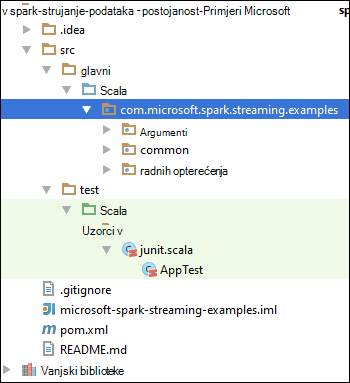

<properties 
    pageTitle="Obrada strujanja podataka pomoću koncentratora događaj Azure pomoću Apache Spark u HDInsight | Microsoft Azure" 
    description="Detaljne upute za slanje podataka strujanje Azure događaj koncentrator, a zatim primaju događaje u Spark aplikaciji scala" 
    services="hdinsight" 
    documentationCenter="" 
    authors="nitinme" 
    manager="jhubbard" 
    editor="cgronlun"
    tags="azure-portal"/>

<tags 
    ms.service="hdinsight" 
    ms.workload="big-data" 
    ms.tgt_pltfrm="na" 
    ms.devlang="na" 
    ms.topic="article" 
    ms.date="09/30/2016" 
    ms.author="nitinme"/>

# Spark strujeće: Obrade događaja iz koncentratora događaj Azure s Apache Spark klaster na HDInsight Linux

Spark strujanje proširuje core Spark API-JA za izgradnju prilagodljivi, visokom propusnošću, pogreške strujanje obrada aplikacije. Podaci mogu biti ingested iz više izvora. U ovom članku koristimo Azure događaj koncentratora za ingest podataka. Događaj koncentratora je sustav iznimno skalabilni ingestion te intake mogu milijune događaja u sekundi. 

U ovom ćete praktičnom vodiču ćete saznati kako stvoriti koncentrator za događaj programa Azure ingest poruka u aplikaciji konzole u Java koncentratora za događaj i njihovo dohvaćanje paralelno pomoću Spark aplikacije pisane Scala. Ove aplikacije troši podatke strujanjem putem koncentratora za događaj i usmjerava na različitim izlaze (blobova platforme Azure prostora za pohranu, grozd tablici, a SQL).

> [AZURE.NOTE] Slijedite upute u ovom članku, morate koristiti obje verzije Azure portal. Da biste stvorili koncentratora za događaj će koristiti [Azure klasični portal](https://manage.windowsazure.com). Da biste radili s HDInsight Spark klaster, koristit će [Azure Portal](https://portal.azure.com/).  

**Preduvjeti:**

Morate imati sljedeće:

- Azure pretplate. Pogledajte [Početak Azure besplatnu probnu verziju](https://azure.microsoft.com/documentation/videos/get-azure-free-trial-for-testing-hadoop-in-hdinsight/).
- Programa Apache Spark klaster. Upute potražite u članku [Stvaranje Spark Apache klastere u Azure HDInsight](hdinsight-apache-spark-jupyter-spark-sql.md).
- Oracle Java Development kit. Možete ga instalirati s [ovdje](http://www.oracle.com/technetwork/java/javase/downloads/jdk8-downloads-2133151.html).
- Na Java IDE. U ovom se članku koristi IntelliJ IDEJA 15.0.1. Možete ga instalirati s [ovdje](https://www.jetbrains.com/idea/download/).
- Microsoft JDBC upravljački program za SQL Server v4.1 ili noviji. Potrebna je za zapisivanje događaja podataka u bazu podataka sustava SQL Server. Možete ga instalirati s [ovdje](https://msdn.microsoft.com/sqlserver/aa937724.aspx).
- Baze podataka Azure SQL. Upute potražite u članku [Stvaranje baze podataka SQL u minutama](../sql-database/sql-database-get-started.md).

## Čemu služi rješenje?

To je tok strujanje rješenja:

1. Stvaranje koncentrator događaj za Azure koja će primiti strujanje događaja.

2. Pokretanje lokalnog samostalnu aplikaciju koja generira događaja, a zatim ih je gura središtu Azure događaj. Primjer aplikacije koji to je objavljeno na [https://github.com/hdinsight/spark-streaming-data-persistence-examples](https://github.com/hdinsight/spark-streaming-data-persistence-examples).

2. Pokretanje strujanje aplikacije na Spark klaster koji čita strujanje događaje iz koncentratora Azure događaja, a zatim ih je gura različitih mjesta (blobova platforme Azure, grozd tablici, a SQL baze podataka). 

## Stvaranje koncentrator Azure događaja

1. S [Portala za Azure](https://manage.windowsazure.com), odaberite **NOVO** > **Bus servisa** > **Događaj koncentrator** > **Stvoriti prilagođene**.

2. Na zaslonu **Dodaj novi događaj koncentrator** unesite **Naziv događaja koncentrator**, odaberite **područje** koncentrator, stvaranje i stvorite novi prostor za naziv ili odaberite postojeći. Kliknite **strelicu** da biste nastavili.

    ![stranica čarobnjaka za 1] (./media/hdinsight-apache-spark-eventhub-streaming/hdispark.streaming.create.event.hub.png "Stvaranje koncentratora za Azure događaja")

    > [AZURE.NOTE] Odaberite na isto **mjesto** kao svoj klaster Apache Spark u HDInsight da biste smanjili Latencija i troškove.

3. Na zaslonu za **Konfiguriranje koncentrator događaj** unesite vrijednosti **particija count** i **Zadržavanja poruku** , a zatim kvačicu. U ovom primjeru pomoću particija broja 10 i poruka zadržavanja 1. Budući da tu vrijednost će zatrebate kasnije Imajte na umu count particije.

    ![stranica čarobnjaka za 2] (./media/hdinsight-apache-spark-eventhub-streaming/hdispark.streaming.create.event.hub2.png "Navedite particija veličina i zadržavanja dana za događaj koncentratora")

4. Kliknite središtu događaj koji ste stvorili, kliknite **Konfiguriraj**i stvaranje dva pristup pravila za koncentratora za događaj.

    <table>
    <tr><th>Ime</th><th>Dozvole</th></tr>
    <tr><td>mysendpolicy</td><td>Pošalji</td></tr>
    <tr><td>myreceivepolicy</td><td>Slušanje</td></tr>
    </table>

    Kada stvorite dozvole, odaberite ikonu **Spremi** pri dnu stranice. Time ste stvorili zajednički pristup pravila koja će se koristiti za slanje (**mysendpolicy**) i (**myreceivepolicy**) preslušavanje koncentratora za događaj.

    ![pravila] (./media/hdinsight-apache-spark-eventhub-streaming/hdispark.streaming.event.hub.policies.png "Stvaranje događaja koncentrator pravila")

    
5. Na istoj stranici uzeti u obzir tipki pravila za dva skupa pravila. Spremanje ove tipke jer će se koristiti kasnije.

    ![strelicama pravila] (./media/hdinsight-apache-spark-eventhub-streaming/hdispark.streaming.event.hub.policy.keys.png "Spremanje tipke pravila")

6. Na stranici **nadzorne ploče** kliknite **Informacije o vezi** od dna za dohvat i spremanje nizu za povezivanje za događaj koncentrator pomoću dva skupa pravila.

    ![strelicama pravila] (./media/hdinsight-apache-spark-eventhub-streaming/hdispark.streaming.event.hub.policy.connection.strings.png "Spremanje nizove veze pravila")

## Korištenje Scala aplikacije za slanje poruka koncentrator događaja

U ovom odjeljku koristite samostalnu lokalni Scala aplikaciju za slanje strujanje događaja koncentrator događaj Azure koju ste stvorili u prethodnom koraku. Ova aplikacija je dostupan na GitHub na [https://github.com/hdinsight/eventhubs-sample-event-producer](https://github.com/hdinsight/eventhubs-sample-event-producer). Ovdje se pretpostavlja već forked ovo GitHub spremište.

1. Otvorite aplikaciju, **EventhubsSampleEventProducer**u IntelliJ IDEJA.
    
2. Stvaranje projekta. Na izborniku **Sastavljanje** kliknite **Učiniti projektu**. U odjeljku **\out\artifacts**stvara se posudu izlaz.

>[AZURE.TIP] Da biste izravno iz spremišta GitHub stvorite projekt možete koristiti i mogućnost dostupna u IntelliJ IDEJA. Da biste naučili kako koristiti taj pristup, poslužite se uputama u sljedećem odjeljku upute. Imajte na umu da mnogo koraka opisanih u sljedećem odjeljku neće biti odgovarajuće Scala aplikacije koje ste stvorili u ovom ćete koraku. Ako, na primjer:

> * Nećete imati da biste ažurirali POM da biste dodali verziju Spark. To je zato što je bez ovisnosti na Spark za stvaranje ove aplikacije
> * Ne morat ćete dodati neke staklenke ovisnost biblioteku projekta. To je zato te staklenke nisu potrebni za taj projekt.

## Ažuriranje Scala strujanje aplikacije za primanje događaje

Primjer Scala aplikacije za primanje događaja i usmjeravanje različite odredišta dostupna je na [https://github.com/hdinsight/spark-streaming-data-persistence-examples](https://github.com/hdinsight/spark-streaming-data-persistence-examples). Slijedite korake u nastavku možete ažurirati aplikaciju i stvoriti posudu izlaz.

1. Pokretanje IntelliJ IDEJA i kartica Umetanje odaberite **Odjava iz verzije kontrole** , a zatim kliknite **brojka**.
        
    

2. U dijaloškom okviru **Spremište Kloniraj** Navedite URL spremište brojka Kloniraj iz, navedite direktorij na Kloniraj za, a zatim kliknite **Kloniraj**.

    

    
3. Dok se projekt potpuno klonirana, slijedite upute. Pritisnite **Alt + 1** da biste otvorili **Prikaz projekta**. Trebali biste otprilike ovako.

    
    
4. Provjerite je li kod aplikacije prikupljaju se s Java8. Da biste osigurali, kliknite **datoteka**, kliknite **Struktura projekta**, a zatim na kartici **projekt** , provjerite je li razina jezika projekta postavljeno na **8 - Lambdas, primjedbe vrsta, itd.**.

    

5. Otvorite **pom.xml** i provjerite je li verzija Spark točni. U odjeljku <properties> čvor, potražite sljedeće isječka i provjerite je li verzija Spark.

        <scala.version>2.10.4</scala.version>
        <scala.compat.version>2.10.4</scala.compat.version>
        <scala.binary.version>2.10</scala.binary.version>
        <spark.version>1.6.2</spark.version>
    
5. Aplikacija traži dva ovisnost staklenke učinite sljedeće:

    * **Posudu EventHub tekstnog okvira**. Ovo je obavezan za Spark primati poruke iz centra za događaj. Da biste koristili ovu posudu, ažurirajte **pom.xml** da biste dodali sljedećeg pod `<dependencies>`.

            <dependency>
              <groupId>com.microsoft.azure</groupId>
              <artifactId>spark-streaming-eventhubs_2.10</artifactId>
              <version>1.6.0</version>
            </dependency> 

    * **JDBC upravljački program posudu**. Potrebna je za pisanje poruke koje ste primili iz centra za događaj u bazu podataka Azure SQL. Možete preuzeti v4.1 ili noviji posudu datoteke iz [ovdje](https://msdn.microsoft.com/sqlserver/aa937724.aspx). Dodavanje reference u ovom posudu u biblioteci projekta. Poduzmite sljedeće korake:

        1. Iz prozora IntelliJ IDEJA koje se aplikacija otvori, kliknite **datoteka**, kliknite **Struktura projekta**, a zatim **biblioteke**. 
        
        2. Kliknite ikonu Dodaj () kliknite **Java**, a zatim prijeđite na mjesto gdje ste preuzeli posudu JDBC upravljački program. Slijedite upute da biste dodali posudu datoteka u biblioteku projekta.

            ![Dodavanje nedostaju ovisnosti] (./media/hdinsight-apache-spark-eventhub-streaming/add-missing-dependency-jars.png "Dodavanje nedostaju ovisnosti staklenke")

        3. Kliknite **Primijeni**.

6. Stvaranje posudu Izlazna datoteka. Izvršite sljedeće korake.
    1. U dijaloškom okviru **Strukturu projekta** kliknite **artefakte** , a zatim kliknite znak plus. Iz skočnog dijaloškog okvira kliknite **POSUDU**, a zatim **iz modula s ovisnosti**.

        

    1. U dijaloškom okviru **Stvaranje POSUDU iz modula** kliknite tri točke () na temelju **Osnovna klasa**.

    1. U dijaloškom okviru **Odaberite Osnovna klasa** odaberite neku od dostupnih klase, a zatim kliknite **u redu**.

        

    1. U dijaloškom okviru **Stvaranje POSUDU iz modula** provjerite je li odabrana mogućnost da biste **izdvojili ciljnoj POSUDU** , a zatim **u redu**. Time ste stvorili jedan POSUDU s sve ovisnosti.

        

    1. Na kartici **Raspored izlaz** popis staklenke koji su dio paketa Maven projekta. Možete odabrati i izbrisati one na kojem aplikacija Scala ima nije Izravni ovisnosti. Za aplikaciju ne možemo stvarate ovdje, možete ukloniti sve osim posljednjeg nešto (**microsoft-spark-strujanje-Primjeri Kompiliranje izlaz**). Odaberite staklenke da biste izbrisali i zatim kliknite ikonu **Izbriši** ().

        

        Provjerite **nadograđuju provjerite** je li odabran okvir, koji omogućuje čitanje posudu nastaje svaki put projekta je ugrađen ili ažurirati. Kliknite **Primijeni** , a zatim **u redu**.

    1. Na kartici **Izgled izlaz** , desno na dnu okvira **Dostupne elementi** imate posudu SQL JDBC koji koju ste prethodno dodali u biblioteku projekta. Ne morate dodati na karticu **Izgled izlaz** . Desnom tipkom miša kliknite datoteku posudu, a zatim kliknite **Izdvoji u izlaz korijen**.

          

        Na kartici **Raspored izlaz** trebala izgledati ovako.

             

        U dijaloškom okviru **Strukturu projekta** kliknite **Primijeni** , a zatim kliknite **u redu**. 

    1. Na traci izbornika kliknite **Sastavi**, a zatim **Učiniti projektu**. Možete kliknuti i **Sastavljanje artefakte** da biste stvorili posudu. U odjeljku **\out\artifacts**stvara se posudu izlaz.

        

## Pokretanje aplikacije na Spark klaster pomoću Livije

Koristit ćemo Livije daljinski pokrenuti aplikaciju strujanje Spark klaster. Detaljne raspravu o korištenju Livije s klaster HDInsight Spark potražite u članku [zadataka pošalji daljinski programa Apache Spark klaster na Azure HDInsight](hdinsight-apache-spark-livy-rest-interface.md). Prije no što počnete izvodi remote zadatke na događaje strujanje postoji pomoću Spark na nekoliko stvari koje treba učiniti:

1. Pokrenite lokalne samostalnu aplikaciju za generiranje događaja i šalju koncentrator za događaj. Da biste to učinili, koristite sljedeću naredbu:

        java -cp EventhubsSampleEventProducer.jar com.microsoft.eventhubs.client.example.EventhubsClientDriver --eventhubs-namespace "mysbnamespace" --eventhubs-name "myeventhub" --policy-name "mysendpolicy" --policy-key "<policy key>" --message-length 32 --thread-count 32 --message-count -1

2. Spremište blobova platforme Azure pridružene klaster kopirajte strujanje posudu (**microsoft-spark-strujanje-examples.jar**). Ovime posudu pristupačnim Livije. [**AzCopy**](../storage/storage-use-azcopy.md), uslužni program naredbenog retka, možete koristiti da biste to učinili. Postoji mnogo drugim klijentima možete koristiti za prijenos podataka. Možete pronaći dodatne informacije o ih na [prijenos podataka za Hadoop poslove u HDInsight](hdinsight-upload-data.md).

3. Instalirajte ZAKRETANJA na računalu na kojem se pokreće te aplikacije iz. Koristimo ZAKRETANJA pozvati Livije krajnjih točaka za daljinsko pokrenuti zadatke.

### Pokretanje aplikacije za primanje događaje u programa Azure spremište blobova platforme kao tekst

Otvorite naredbeni redak, idite u direktorij koje ste instalirali ZAKRETANJA i pokrenite sljedeću naredbu (Zamijeni korisničkog imena i lozinke i klaster naziv):

    curl -k --user "admin:mypassword1!" -v -H "Content-Type: application/json" -X POST --data @C:\Temp\inputBlob.txt "https://mysparkcluster.azurehdinsight.net/livy/batches"

Parametara u datoteci **inputBlob.txt** se definira na sljedeći način:

    { "file":"wasbs:///example/jars/microsoft-spark-streaming-examples.jar", "className":"com.microsoft.spark.streaming.examples.workloads.EventhubsEventCount", "args":["--eventhubs-namespace", "mysbnamespace", "--eventhubs-name", "myeventhub", "--policy-name", "myreceivepolicy", "--policy-key", "<put-your-key-here>", "--consumer-group", "$default", "--partition-count", 10, "--batch-interval-in-seconds", 20, "--checkpoint-directory", "/EventCheckpoint", "--event-count-folder", "/EventCount/EventCount10"], "numExecutors":20, "executorMemory":"1G", "executorCores":1, "driverMemory":"2G" }

Javite nam znao o čemu se parametara u ulazne datoteke:

* **datoteka** je put do datoteke posudu aplikacije na račun Azure prostora za pohranu koji je povezan s klaster.
* **NazivKlase** je naziv klase u posudu.
* **argumente** je na popisu argumenata potrebnih klase
* **numExecutors** je broj jezgri koristi Spark da biste pokrenuli aplikaciju strujanje. To uvijek mora biti najmanje dvaput broj particije koncentratora za događaj.
* **executorMemory**, **executorCores** **driverMemory** su parametri koji se koristi za dodjeljivanje potrebni resursi strujanje aplikacije.

>[AZURE.NOTE] Nije potrebno stvarati mape Izlazna (EventCheckpoint, EventCount/EventCount10) koji se koriste kao parametara. Strujanje aplikacije ih za vas stvara.
    
Kada pokrenete naredbu, trebali biste vidjeti na Izlaz kao što je sljedeća:

    < HTTP/1.1 201 Created
    < Content-Type: application/json; charset=UTF-8
    < Location: /18
    < Server: Microsoft-IIS/8.5
    < X-Powered-By: ARR/2.5
    < X-Powered-By: ASP.NET
    < Date: Tue, 01 Dec 2015 05:39:10 GMT
    < Content-Length: 37
    <
    {"id":1,"state":"starting","log":[]}* Connection #0 to host mysparkcluster.azurehdinsight.net left intact

Zabilježite ID grupe u zadnji redak izlaz (u ovom primjeru je "1"). Da biste provjerili uspješno pokreće aplikaciju, možete pogledati računa Azure prostora za pohranu pridružene klaster, a trebali biste vidjeti mapu **/EventCount/EventCount10** na njemu stvorena. Ova mapa mora sadržavati blob-ova koji opisuje broj događaja koji se obrađuju unutar vremenskog razdoblja naveden za parametar **obradu interval u sekundama**.

Aplikacija će i dalje da biste pokrenuli dok je Ukloni. Da biste to učinili, koristite sljedeću naredbu:

    curl -k --user "admin:mypassword1!" -v -X DELETE "https://mysparkcluster.azurehdinsight.net/livy/batches/1"

### Pokretanje aplikacije za primanje događaje u programa Azure spremište blobova platforme kao JSON

Otvorite naredbeni redak, idite u direktorij koje ste instalirali ZAKRETANJA i pokrenite sljedeću naredbu (Zamijeni korisničkog imena i lozinke i klaster naziv):

    curl -k --user "admin:mypassword1!" -v -H "Content-Type: application/json" -X POST --data @C:\Temp\inputJSON.txt "https://mysparkcluster.azurehdinsight.net/livy/batches"

Parametara u datoteci **inputJSON.txt** se definira na sljedeći način:

    { "file":"wasbs:///example/jars/microsoft-spark-streaming-examples.jar", "className":"com.microsoft.spark.streaming.examples.workloads.EventhubsToAzureBlobAsJSON", "args":["--eventhubs-namespace", "mysbnamespace", "--eventhubs-name", "myeventhub", "--policy-name", "myreceivepolicy", "--policy-key", "<put-your-key-here>", "--consumer-group", "$default", "--partition-count", 10, "--batch-interval-in-seconds", 20, "--checkpoint-directory", "/EventCheckpoint", "--event-count-folder", "/EventCount/EventCount10", "--event-store-folder", "/EventStore10"], "numExecutors":20, "executorMemory":"1G", "executorCores":1, "driverMemory":"2G" }

Parametri su slične koju ste naveli u rezultatu tekst u prethodnom koraku. Ponovno ne morate stvarati mape Izlazna (EventCheckpoint, EventCount/EventCount10) koji se koriste kao parametara. Strujanje aplikacije ih za vas stvara.

 Kada pokrenete naredbu, možete pogledati računa Azure prostora za pohranu pridružene klaster i trebali biste vidjeti mapu **/EventStore10** na njemu stvorena. Otvaranje bilo koju datoteku na mjestu s **dio –** , a trebali biste vidjeti događaje obuhvaćene JSON OSNOVNI oblik.

### Pokretanje aplikacije za primanje događaje u tablicu vrste Hive

Da biste pokrenuli aplikaciju koja strujanja događaje u tablicu vrste Hive morate neke dodatne komponente. To su:

* datanucleus-api-jdo-3.2.6.jar
* datanucleus rdbms 3.2.9.jar
* datanucleus core 3.2.10.jar
* Grozd site.xml

Datoteka **.jar** dostupne su na svoj klaster HDInsight Spark na `/usr/hdp/current/spark-client/lib`. **Grozd site.xml** dostupna je na `/usr/hdp/current/spark-client/conf`.

[WinScp](http://winscp.net/eng/download.php) možete koristiti da biste kopirali putem te datoteke iz skupine s vašim lokalnim računalom. Zatim možete koristiti alate za te datoteke kopirajte putem računa za pohranu pridružene klaster. Dodatne informacije o tome kako prenijeti datoteke na račun za pohranu potražite u članku [prijenos podataka za Hadoop poslove u HDInsight](hdinsight-upload-data.md).

Nakon što ste kopirali nad datotekama na račun servisa Azure prostora za pohranu, otvorite naredbeni redak, idite u direktorij koje ste instalirali ZAKRETANJA i pokrenite sljedeću naredbu (Zamijeni korisničkog imena i lozinke i klaster naziv):

    curl -k --user "admin:mypassword1!" -v -H "Content-Type: application/json" -X POST --data @C:\Temp\inputHive.txt "https://mysparkcluster.azurehdinsight.net/livy/batches"

Parametara u datoteci **inputHive.txt** se definira na sljedeći način:

    { "file":"wasbs:///example/jars/microsoft-spark-streaming-examples.jar", "className":"com.microsoft.spark.streaming.examples.workloads.EventhubsToHiveTable", "args":["--eventhubs-namespace", "mysbnamespace", "--eventhubs-name", "myeventhub", "--policy-name", "myreceivepolicy", "--policy-key", "<put-your-key-here>", "--consumer-group", "$default", "--partition-count", 10, "--batch-interval-in-seconds", 20, "--checkpoint-directory", "/EventCheckpoint", "--event-count-folder", "/EventCount/EventCount10", "--event-hive-table", "EventHiveTable10" ], "jars":["wasbs:///example/jars/datanucleus-api-jdo-3.2.6.jar", "wasbs:///example/jars/datanucleus-rdbms-3.2.9.jar", "wasbs:///example/jars/datanucleus-core-3.2.10.jar"], "files":["wasbs:///example/jars/hive-site.xml"], "numExecutors":20, "executorMemory":"1G", "executorCores":1, "driverMemory":"2G" }

Parametri su slične koju ste naveli u rezultatu tekst u prethodnim koracima. Ponovno, ne morate stvoriti izlazne mape (EventCheckpoint, EventCount/EventCount10) ili izlaz tablicu vrste Hive (EventHiveTable10) koji se koriste kao parametara. Strujanje aplikacije ih za vas stvara. Imajte na umu da se mogućnost **staklenke** i **datoteka** sadrži putova datoteka .jar i grozd-site.xml koju ste kopirali putem računa za pohranu.

Da biste provjerili tablicu vrste hive uspješno je stvorena, možete ga SSH u klaster i pokretanje upita grozd. Upute potražite u članku [Korištenje vrste Hive s Hadoop u HDInsight s SSH](hdinsight-hadoop-use-hive-ssh.md). Kada ste povezani pomoću SSH, možete pokrenite sljedeću naredbu da biste provjerili je li stvoriti tablicu vrste Hive, **EventHiveTable10**.

    show tables;

Trebali biste vidjeti na Izlaz sličnu ovoj:

    OK
    eventhivetable10
    hivesampletable

Možete i pokrenuti upita s ODABIRANJEM da biste pogledali sadržaj tablice.

    SELECT * FROM eventhivetable10 LIMIT 10;

Trebali biste vidjeti na Izlaz kao što je sljedeća:

    ZN90apUSQODDTx7n6Toh6jDbuPngqT4c
    sor2M7xsFwmaRW8W8NDwMneFNMrOVkW1
    o2HcsU735ejSi2bGEcbUSB4btCFmI1lW
    TLuibq4rbj0T9st9eEzIWJwNGtMWYoYS
    HKCpPlWFWAJILwR69MAq863nCWYzDEw6
    Mvx0GQOPYvPR7ezBEpIHYKTKiEhYammQ
    85dRppSBSbZgThLr1s0GMgKqynDUqudr
    5LAWkNqorLj3ZN9a2mfWr9rZqeXKN4pF
    ulf9wSFNjD7BZXCyunozecov9QpEIYmJ
    vWzM3nvOja8DhYcwn0n5eTfOItZ966pa
    Time taken: 4.434 seconds, Fetched: 10 row(s)

### Pokretanje aplikacije za primanje događaje u tablicu baze podataka Azure SQL

Prije pokretanja ovaj korak, provjerite je li baze podataka Azure SQL stvara. Trebat će vrijednosti za naziv baze podataka, naziv poslužitelja baze podataka i administratorske vjerodajnice za bazu podataka kao parametri. Nije potrebno kroz stvaranje tablica baze podataka. Strujanje aplikacije koji stvara za vas.

Otvorite naredbeni redak, idite u direktorij koje ste instalirali ZAKRETANJA i pokrenite sljedeću naredbu:

    curl -k --user "admin:mypassword1!" -v -H "Content-Type: application/json" -X POST --data @C:\Temp\inputSQL.txt "https://mysparkcluster.azurehdinsight.net/livy/batches"

Parametara u datoteci **inputSQL.txt** se definira na sljedeći način:

    { "file":"wasbs:///example/jars/microsoft-spark-streaming-examples.jar", "className":"com.microsoft.spark.streaming.examples.workloads.EventhubsToAzureSQLTable", "args":["--eventhubs-namespace", "mysbnamespace", "--eventhubs-name", "myeventhub", "--policy-name", "myreceivepolicy", "--policy-key", "<put-your-key-here>", "--consumer-group", "$default", "--partition-count", 10, "--batch-interval-in-seconds", 20, "--checkpoint-directory", "/EventCheckpoint", "--event-count-folder", "/EventCount/EventCount10", "--sql-server-fqdn", "<database-server-name>.database.windows.net", "--sql-database-name", "mysparkdatabase", "--database-username", "sparkdbadmin", "--database-password", "<put-password-here>", "--event-sql-table", "EventContent" ], "numExecutors":20, "executorMemory":"1G", "executorCores":1, "driverMemory":"2G" }

Da biste provjerili uspješno pokreće aplikaciju, možete se povezati s bazom podataka Azure SQL pomoću SQL Server Management Studio. Upute o tome kako to učiniti potražite u članku [Povezivanje s bazom podataka SQL s SQL Server Management Studio](../sql-database/sql-database-connect-query-ssms.md). Kada ste povezani s bazom podataka, možete se kretati **EventContent** tablicu koja je stvorena aplikacija strujanje. Možete pokrenuti brzog upita za dohvaćanje podataka iz tablice. Pokrenite sljedeći upit:

    SELECT * FROM EventCount

Trebali biste vidjeti izlaz sličnu ovoj:

    00046b0f-2552-4980-9c3f-8bba5647c8ee
    000b7530-12f9-4081-8e19-90acd26f9c0c
    000bc521-9c1b-4a42-ab08-dc1893b83f3b
    00123a2a-e00d-496a-9104-108920955718
    0017c68f-7a4e-452d-97ad-5cb1fe5ba81b
    001KsmqL2gfu5ZcuQuTqTxQvVyGCqPp9
    001vIZgOStka4DXtud0e3tX7XbfMnZrN
    00220586-3e1a-4d2d-a89b-05c5892e541a
    0029e309-9e54-4e1b-84be-cd04e6fce5ec
    003333cf-874f-4045-9da3-9f98c2b4ea49
    0043c07e-8d73-420a-9af7-1fcb94575356
    004a11a9-0c2c-4bc0-a7d5-2e0ebd947ab9

    
## Vidi također

* [Pregled: Apache Spark na Azure HDInsight](hdinsight-apache-spark-overview.md)

### Scenariji

* [Spark bi: izvođenje analiza interaktivnih podataka pomoću Spark u HDInsight s alatima za Poslovno obavještavanje](hdinsight-apache-spark-use-bi-tools.md)

* [Spark s strojnog učenja: korištenje Spark u HDInsight za analizu sastavnih temperatura pomoću HVAC podataka](hdinsight-apache-spark-ipython-notebook-machine-learning.md)

* [Spark s strojnog učenja: korištenje Spark u HDInsight za predviđanje rezultata provjere za hranu](hdinsight-apache-spark-machine-learning-mllib-ipython.md)

* [Web-mjesto zapisnika analize pomoću Spark u HDInsight](hdinsight-apache-spark-custom-library-website-log-analysis.md)

### Stvaranje i pokretanje aplikacija

* [Stvaranje samostalne aplikacije pomoću Scala](hdinsight-apache-spark-create-standalone-application.md)

* [Pokretanje zadataka na Spark klaster pomoću Livije](hdinsight-apache-spark-livy-rest-interface.md)

### Alati i proširenja

* [Korištenje servisa HDInsight dodatak Alati za IntelliJ IDEJA za stvaranje i slanje Spark Scala aplikacije](hdinsight-apache-spark-intellij-tool-plugin.md)

* [Korištenje servisa HDInsight dodatak Alati za IntelliJ IDEJA za ispravljanje pogrešaka aplikacije Spark daljinski](hdinsight-apache-spark-intellij-tool-plugin-debug-jobs-remotely.md)

* [Koristite Zeppelin bilježnice s Spark klaster na HDInsight](hdinsight-apache-spark-use-zeppelin-notebook.md)

* [Dostupno za Jupyter bilježnicu u skupini Spark za HDInsight jezgre](hdinsight-apache-spark-jupyter-notebook-kernels.md)

* [Korištenje vanjskih paketa s bilježnicama Jupyter](hdinsight-apache-spark-jupyter-notebook-use-external-packages.md)

* [Na računalo instalirati Jupyter i povezati se HDInsight Spark klaster](hdinsight-apache-spark-jupyter-notebook-install-locally.md)

### Upravljanje resursima

* [Upravljanje resursima za klaster Apache Spark u Azure HDInsight](hdinsight-apache-spark-resource-manager.md)

* [Praćenje i ispravljanje pogrešaka zadataka izvodi na programa klaster Apache Spark u HDInsight](hdinsight-apache-spark-job-debugging.md)

[hdinsight-versions]: hdinsight-component-versioning.md
[hdinsight-upload-data]: hdinsight-upload-data.md
[hdinsight-storage]: hdinsight-hadoop-use-blob-storage.md

[azure-purchase-options]: http://azure.microsoft.com/pricing/purchase-options/
[azure-member-offers]: http://azure.microsoft.com/pricing/member-offers/
[azure-free-trial]: http://azure.microsoft.com/pricing/free-trial/
[azure-management-portal]: https://manage.windowsazure.com/
[azure-create-storageaccount]: ../storage-create-storage-account/ 
