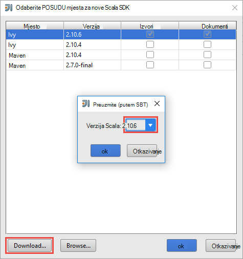
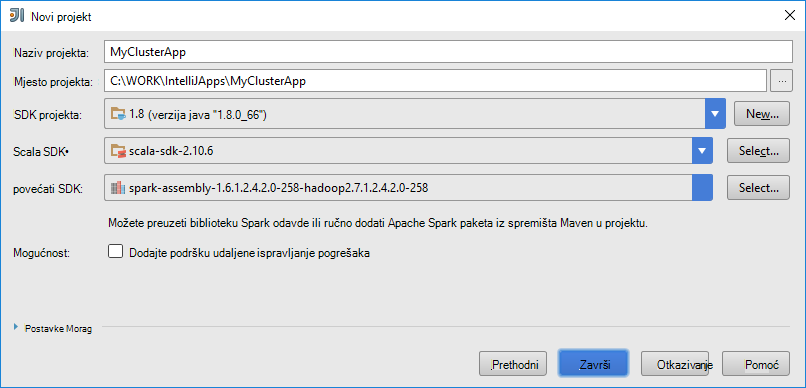
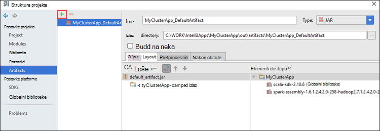
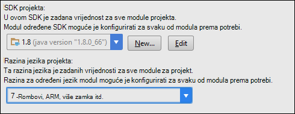
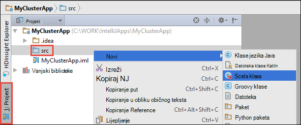

 <properties
    pageTitle="Pomoću alata za HDInsight u Azure komplet alata za IntelliJ za daljinsko ispravljanje pogrešaka aplikacije koje rade na klastere HDInsight Spark | Microsoft Azure"
    description="Saznajte kako pomoću alata za HDInsight u Azure komplet alata za IntelliJ za daljinsko ispravljanje pogrešaka aplikacije koje rade na klastere HDInsight Spark."
    services="hdinsight"
    documentationCenter=""
    authors="nitinme"
    manager="jhubbard"
    editor="cgronlun"
    tags="azure-portal"/>

<tags
    ms.service="hdinsight"
    ms.workload="big-data"
    ms.tgt_pltfrm="na"
    ms.devlang="na"
    ms.topic="article"
    ms.date="09/09/2016"
    ms.author="nitinme"/>

# Pomoću alata za HDInsight u Azure komplet alata za IntelliJ za ispravljanje pogrešaka aplikacije Spark daljinski na HDInsight Spark Linux klaster

Ovaj članak sadrži detaljne upute o tome kako pomoću alata za HDInsight u Azure komplet alata za IntelliJ za slanje posla Spark na HDInsight Spark klaster, a zatim ispraviti pogreške daljinski na stolnom računalu. Da biste to učinili, morate poduzeti sljedeće korake više razine:

1. Stvaranje web-mjesto ili točke na mjestu Azure virtualne mreže. U ovom dokumentu pretpostavlja da koristite web-mjesto mreže.

2. Stvaranje Spark klaster u Azure HDInsight koja je dio virtualne mreže za Azure web-mjesto.

3. Provjerite je li veze između web-mjesto headnode klaster i u okvir za radnu površinu.

4. Stvaranje aplikacije Scala u IntelliJ IDEJA i konfigurirajte je za daljinsko uklanjanje programskih pogrešaka.

5. Pokreni, a aplikacija za ispravljanje pogrešaka.

##Preduvjeti

* Azure pretplate. Pogledajte [Početak Azure besplatnu probnu verziju](https://azure.microsoft.com/documentation/videos/get-azure-free-trial-for-testing-hadoop-in-hdinsight/).

* Klaster Apache Spark na HDInsight Linux. Upute potražite u članku [Stvaranje Spark Apache klastere u Azure HDInsight](hdinsight-apache-spark-jupyter-spark-sql.md).
 
* Oracle Java Development kit. Možete ga instalirati s [ovdje](http://www.oracle.com/technetwork/java/javase/downloads/jdk8-downloads-2133151.html).
 
* IntelliJ IDEJA. U ovom se članku koristi verzija 15.0.1. Možete ga instalirati s [ovdje](https://www.jetbrains.com/idea/download/).
 
* Alati za HDInsight u Azure komplet alata za IntelliJ. Alati za HDInsight za IntelliJ dostupni su kao dio komplet alata za Azure za IntelliJ. Upute za instaliranje alata za Azure potražite u članku [Instaliranje alata za Azure za IntelliJ](../azure-toolkit-for-intellij-installation.md).

* Prijava na pretplatu za Azure IntelliJ IDEJA. Slijedite upute [u nastavku](hdinsight-apache-spark-intellij-tool-plugin.md#log-into-your-azure-subscription).
 
* Prilikom pokretanja aplikacije Spark Scala za daljinsko uklanjanje programskih pogrešaka na računalu sa sustavom Windows, mogla bi vam se iznimku kao što je opisano u [SPARK 2356](https://issues.apache.org/jira/browse/SPARK-2356) koji se pojavljuje zbog nedostaje WinUtils.exe u sustavu Windows. Da biste zaobišli tu pogrešku, morate [preuzeti izvršnu datoteku na tom mjestu](http://public-repo-1.hortonworks.com/hdp-win-alpha/winutils.exe) na mjesto kao što je **C:\WinUtils\bin**. Zatim morate dodati varijable okruženja **HADOOP_HOME** i postavite vrijednost varijable **C\WinUtils**.

## Korak 1: Stvaranje Azure virtualne mreže

Slijedite upute iz na ispod veze da biste stvorili Azure virtualne mreže i provjerite veze između radne površine i Azure virtualne mreže.

* [Stvaranje na VNet s vezom za VPN-a web-mjesto pomoću portala za Azure](../vpn-gateway/vpn-gateway-howto-site-to-site-resource-manager-portal.md)
* [Stvaranje na VNet s web-mjesto VPN veza pomoću komponente PowerShell](../vpn-gateway/vpn-gateway-create-site-to-site-rm-powershell.md)
* [Konfiguriranje veze točke web virtualne mreže pomoću komponente PowerShell](../vpn-gateway/vpn-gateway-howto-point-to-site-rm-ps.md)

## Korak 2: Stvaranje programa HDInsight Spark klaster

Stvarajte i programa klaster Apache Spark na Azure HDInsight koja je dio Azure virtualne mreže koju ste stvorili. Koristite informacije dostupne na [utemeljen na stvaranje Linux klastere u HDInsight](hdinsight-hadoop-provision-linux-clusters.md). Kao dio neobavezno konfiguracije, odaberite Azure virtualne mreže koju ste stvorili u prethodnom koraku.

## Korak 3: Potvrda veze između web-mjesto headnode klaster i u okvir za radnu površinu

1. Pronađite IP adresu na headnode. Otvorite Ambari korisničkog Sučelja za klaster. Iz plohu klaster kliknite **nadzorna ploča**.

    

2. Korisničko Sučelje Ambari, u gornjem desnom kutu kliknite **domaćini**.

    

3. Trebali biste vidjeti popis headnodes, tempiranja čvorove i zookeeper čvorove. U headnodes ste **hn*** prefiks. Kliknite prvi headnode.

    

4. Pri dnu stranice koja se otvara u okviru **Sažetak** kopirajte IP adresu na headnode i naziv glavnog računala.

    

5. Obuhvaćaju IP adresa i naziv glavnog računala na headnode **hosts** datoteka na računalu na mjesto na koje želite da biste pokrenuli i daljinsko ispravljanje pogrešaka Spark zadatke. To će vam omogućiti za komunikaciju s headnode pomoću IP adresu, kao i na naziv glavnog računala.

    1. Otvaranje u blok za pisanje s dodatnim dozvole. Na izborniku Datoteka kliknite **Otvori** , a zatim pronađite mjesto u datoteci Hosts. Na računalu sa sustavom Windows je `C:\Windows\System32\Drivers\etc\hosts`.

    2. Dodajte sljedeće u datoteku **glavnog računala** .

            # For headnode0
            192.xxx.xx.xx hn0-nitinp
            192.xxx.xx.xx hn0-nitinp.lhwwghjkpqejawpqbwcdyp3.gx.internal.cloudapp.net

            # For headnode1
            192.xxx.xx.xx hn1-nitinp
            192.xxx.xx.xx hn1-nitinp.lhwwghjkpqejawpqbwcdyp3.gx.internal.cloudapp.net

5. S računala na kojem ste povezani s mrežom virtualne Azure koji koriste klaster HDInsight Provjerite možete li ping oba na headnodes pomoću IP adresu, kao i na naziv glavnog računala.

6. SSH u headnode klaster slijedeći upute na [povezivanje programa klaster HDInsight pomoću SSH](hdinsight-hadoop-linux-use-ssh-windows.md#connect-to-a-linux-based-hdinsight-cluster). Iz headnode klaster pomoću naredbe ping IP adresu na stolnom računalu. Trebali biste testirati povezivost i IP adrese dodijeljene računala, jedan za mrežnu vezu, a drugi za Azure virtualne mreže računalo povezano s.

7. Ponovite korake za na druge headnode kao i. 

## Korak 4: Stvaranje aplikacije Spark Scala pomoću alata za HDInsight u Azure komplet alata za IntelliJ i konfigurirati za daljinsko uklanjanje programskih pogrešaka

1. Pokrenite IntelliJ IDEJA i stvaranje novog projekta. U novi projekt dijaloškom okviru provjerite sljedeće mogućnosti, a zatim kliknite **Dalje**.

    

    * U lijevom oknu odaberite **HDInsight**.
    * U desnom oknu odaberite **Spark na HDInsight (Scala)**.
    * Kliknite **Dalje**.

2. U sljedećem prozoru navedite Detalji o projektu.

    * Navedite naziv projekta i mjesto projekta.
    * Za **Projekt SDK**, provjerite je li pružaju verziju jezika Java veći od 7.
    * Za **Scala SDK**, kliknite **Stvori**, kliknite **Preuzmi**i zatim odaberite željenu verziju Scala da biste koristili. **Provjerite ne koriste verziju 2.11.x**. Ovaj primjer koristi verzija **2.10.6**.

        

    * **Spark SDK**, preuzimanje i korištenje SDK iz [ovdje](http://go.microsoft.com/fwlink/?LinkID=723585&clcid=0x409). Možete zanemariti to i upotrijebite [Spark Maven spremište](http://mvnrepository.com/search?q=spark) , no ponovno provjerite je li instaliran za razvoj aplikacija Spark spremište desnom maven. (Na primjer, morate da biste bili sigurni da imate instaliran ako koristite Spark strujanje; dio Spark strujanje I ponovno provjerite je li koriste spremište označena kao Scala 2.10 – ne koristi spremište označena kao Scala 2.11.)

        

    * Kliknite **Završi**.

3. Spark project automatski stvori artefakt umjesto vas. Da biste vidjeli artefakt, slijedite ove korake.

    1. Na izborniku **datoteka** kliknite **Struktura projekta**.
    2. U dijaloškom okviru **Strukturu projekta** kliknite **artefakte** da biste vidjeli artefakt zadani koja je stvorena.

        

    Možete i stvoriti vlastiti artefakt bly klikom na u **+** , istaknutom ikonom u gornjoj slici.

4. U dijaloškom okviru **Strukturu u programu Project** kliknite **projekt**. Ako je **SDK projekta** postavljeno na 1.8, provjerite je li **Razina jezika projekta** postavljen na **7 – Rombovi, ARM, više zamka itd**.

    

4. Dodavanje biblioteka u projekt. Da biste dodali u biblioteku, desnom tipkom miša kliknite naziv projekta u stablu projekta, a zatim **Otvori modul postavke**. U dijaloškom okviru **Strukturu projekta** u lijevom oknu kliknite **biblioteke**, kliknite (+) simbola, a zatim **Iz Maven**. 

     

    U dijaloškom okviru **Preuzimanje biblioteke Maven spremištu** potražite i dodajte sljedeće biblioteke.

    * `org.scalatest:scalatest_2.10:2.2.1`
    * `org.apache.hadoop:hadoop-azure:2.7.1`

5. Kopiraj `yarn-site.xml` i `core-site.xml` iz headnode klaster i dodati u projekt. Koristite sljedeće naredbe za kopiranje datoteka. Da biste pokrenuli na sljedeći način možete koristiti [Cygwin](https://cygwin.com/install.html) `scp` naredbama za kopiranje datoteka iz headnodes klaster.

        scp <ssh user name>@<headnode IP address or host name>://etc/hadoop/conf/core-site.xml .

    Budući da već dodali smo klaster headnode IP adresa i hostnames fonta hosts datoteka na radnoj površini, koristimo **pronađenim** naredbi na sljedeći način.

        scp sshuser@hn0-nitinp:/etc/hadoop/conf/core-site.xml .
        scp sshuser@hn0-nitinp:/etc/hadoop/conf/yarn-site.xml .

    Dodavanje datoteke u projekt tako da ih na primjer kopirate u mapi **/src** u stablu sustava project `<your project directory>\src`.

6. Ažuriranje na `core-site.xml` da bi se sljedeće promjene.

    1. `core-site.xml`obuhvaća šifrirane ključ za račun za pohranu koji je povezan s klaster. U na `core-site.xml` da ste dodali u projekt, zamijenite šifrirani ključ ključa za stvarni pohranu povezanu s računom zadani prostor za pohranu. Potražite u članku [Upravljanje tipke za pristup za pohranu](../storage/storage-create-storage-account.md#manage-your-storage-account).

            <property>
                <name>fs.azure.account.key.hdistoragecentral.blob.core.windows.net</name>
                <value>access-key-associated-with-the-account</value>
            </property>

    2. Uklanjanje sljedeće stavke iz na `core-site.xml`.

            <property>
                <name>fs.azure.account.keyprovider.hdistoragecentral.blob.core.windows.net</name>
                <value>org.apache.hadoop.fs.azure.ShellDecryptionKeyProvider</value>
            </property>

            <property>
                <name>fs.azure.shellkeyprovider.script</name>
                <value>/usr/lib/python2.7/dist-packages/hdinsight_common/decrypt.sh</value>
            </property>

            <property>
                <name>net.topology.script.file.name</name>
                <value>/etc/hadoop/conf/topology_script.py</value>
            </property>

    3. Spremite datoteku.

7. Dodajte predmet glavne aplikacije. Iz **Programa Project Explorer**desnom tipkom miša kliknite **src**, pokažite na **Novo**, a zatim kliknite **Predmet Scala**.

    

8. U dijaloškom okviru **Stvaranje nove klase Scala** Navedite naziv, **vrstu** odaberite **objekt**, a zatim **u redu**.

    

9. U na `MyClusterAppMain.scala` datoteka, zalijepite sljedeći kod. Kod stvara sustava Spark kontekst i pokreće je `executeJob` način iz na `SparkSample` objekt.

        import org.apache.spark.{SparkConf, SparkContext}

        object SparkSampleMain {
          def main (arg: Array[String]): Unit = {
            val conf = new SparkConf().setAppName("SparkSample")
                                      .set("spark.hadoop.validateOutputSpecs", "false")
            val sc = new SparkContext(conf)
        
            SparkSample.executeJob(sc,
                                   "wasbs:///HdiSamples/HdiSamples/SensorSampleData/hvac/HVAC.csv",
                                   "wasbs:///HVACOut")
          }
        }

10. Ponovite korake od 8 i 9 iznad da biste dodali novi objekt Scala pod nazivom `SparkSample`. Da biste klase dodajte sljedeći kod. Kod čita podatke iz HVAC.csv (dostupno na sve HDInsight Spark klastere), dohvaća retke koji imaju samo jednu znamenku u sedmoj stupcu u CSV i zapisuje izlaz **/HVACOut** u kontejneru za zadani prostor za pohranu za klaster.

        import org.apache.spark.SparkContext
    
        object SparkSample {
          def executeJob (sc: SparkContext, input: String, output: String): Unit = {
            val rdd = sc.textFile(input)
        
            //find the rows which have only one digit in the 7th column in the CSV
            val rdd1 =  rdd.filter(s => s.split(",")(6).length() == 1)
        
            val s = sc.parallelize(rdd.take(5)).cartesian(rdd).count()
            println(s)
        
            rdd1.saveAsTextFile(output)
            //rdd1.collect().foreach(println)
          }
        
        }

11. Ponovite korake 8 i 9 iznad da biste dodali novu klase pod nazivom `RemoteClusterDebugging`. Klase implementira framework test Spark koji se koristi za ispravljanje pogrešaka aplikacije. Dodati sljedeći kod da biste na `RemoteClusterDebugging` predmete.

        import org.apache.spark.{SparkConf, SparkContext}
        import org.scalatest.FunSuite
        
        class RemoteClusterDebugging extends FunSuite {
        
          test("Remote run") {
            val conf = new SparkConf().setAppName("SparkSample")
                                      .setMaster("yarn-client")
                                      .set("spark.yarn.am.extraJavaOptions", "-Dhdp.version=2.4")
                                      .set("spark.yarn.jar", "wasbs:///hdp/apps/2.4.2.0-258/spark-assembly-1.6.1.2.4.2.0-258-hadoop2.7.1.2.4.2.0-258.jar")
                                      .setJars(Seq("""C:\WORK\IntelliJApps\MyClusterApp\out\artifacts\MyClusterApp_DefaultArtifact\default_artifact.jar"""))
                                      .set("spark.hadoop.validateOutputSpecs", "false")
            val sc = new SparkContext(conf)
        
            SparkSample.executeJob(sc,
              "wasbs:///HdiSamples/HdiSamples/SensorSampleData/hvac/HVAC.csv",
              "wasbs:///HVACOut")
          }
        }

    Dvije važne stvari koje ovdje Imajte na umu:
    
    * Za `.set("spark.yarn.jar", "wasbs:///hdp/apps/2.4.2.0-258/spark-assembly-1.6.1.2.4.2.0-258-hadoop2.7.1.2.4.2.0-258.jar")`, provjerite je li u sklopu Spark POSUDU dostupna je na klaster prostor za pohranu na navedenom parametru path.
    * Za `setJars`, navedite mjesto na kojem će se stvoriti posudu artefakt. Obično je `<Your IntelliJ project directory>\out\<project name>_DefaultArtifact\default_artifact.jar`. 

11. U na `RemoteClusterDebugging` klase, desnom tipkom miša kliknite na `test` ključnoj riječi i odaberite **Stvaranje RemoteClusterDebugging konfiguracije**.

    

12. U dijaloškom okviru navedite naziv za konfiguraciju pa odaberite **vrstu Test** nazivu **Test**. Ostavite sve druge vrijednosti kao zadani, kliknite **Primijeni**, a zatim **u redu**.

    

13. Prikazat će se odmah **Pokrenuti udaljenu** konfiguracije padajućeg izbornika na traci izbornika. 

    

## Korak 5: Pokretanje aplikacije u načinu rada za ispravljanje pogrešaka

1. U projektu IntelliJ IDEJA, otvorite `SparkSample.scala` i stvaranje točku prekida pokraj "val rdd1". Na skočnom izborniku za stvaranje na točku prekida, odaberite **redak u executeJob (opis funkcije)**.

    

2. Kliknite gumb **Za ispravljanje pogrešaka pokrenuti** uz konfiguraciju **Udaljene pokrenuti** padajućeg pokretanja aplikacije.

    

3. Kada program izvođenja dosegne na točku prekida, trebali biste vidjeti kartica **Alat za ispravljanje pogrešaka** u dnu okna.

    

4. Kliknite na (**+**) ikonu da biste dodali na sat kao što je prikazano na slici u nastavku. 

    

    Ovdje jer je aplikacija prekinuta prije varijable `rdd1` stvoren, pomoću ovog pogledajte možemo vidjeti što su prvih 5 redaka u varijablu `rdd`. Pritisnite **ENTER**.

    

    Što vidite u gornjoj slici je da tijekom izvođenja nije upit terrabytes podataka i ispravljanje pogrešaka kako napreduje vašeg računala. Ako, na primjer, u ispisu prikazati u gornjoj slici, vidjet ćete da je prvi redak izlaza zaglavlja. Ovisno o tome, možete izmijeniti kodu aplikacije da biste preskočili redak zaglavlja po potrebi.

5. Sada možete kliknuti i ikonu **Programa nastavi** da biste nastavili s pokretanja aplikacije.

    

6. Ako aplikacija uspješno završi, trebali biste vidjeti na Izlaz ovako.

    

 

## Vidi također

* [Pregled: Apache Spark na Azure HDInsight](hdinsight-apache-spark-overview.md)

### Scenariji

* [Spark bi: izvođenje analiza interaktivnih podataka pomoću Spark u HDInsight s alatima za Poslovno obavještavanje](hdinsight-apache-spark-use-bi-tools.md)

* [Spark s strojnog učenja: korištenje Spark u HDInsight za analizu sastavnih temperatura pomoću HVAC podataka](hdinsight-apache-spark-ipython-notebook-machine-learning.md)

* [Spark s strojnog učenja: korištenje Spark u HDInsight za predviđanje rezultata provjere za hranu](hdinsight-apache-spark-machine-learning-mllib-ipython.md)

* [Spark strujeće: Korištenje Spark u HDInsight za izgradnju u stvarnom vremenu strujanje aplikacije](hdinsight-apache-spark-eventhub-streaming.md)

* [Web-mjesto zapisnika analize pomoću Spark u HDInsight](hdinsight-apache-spark-custom-library-website-log-analysis.md)

### Stvaranje i pokretanje aplikacija

* [Stvaranje samostalne aplikacije pomoću Scala](hdinsight-apache-spark-create-standalone-application.md)

* [Pokretanje zadataka na Spark klaster pomoću Livije](hdinsight-apache-spark-livy-rest-interface.md)

### Alati i proširenja

* [Pomoću alata za HDInsight u Azure komplet alata za IntelliJ za stvaranje i slanje Spark Scala aplikacije](hdinsight-apache-spark-intellij-tool-plugin.md)

* [Pomoću alata za HDInsight u Azure komplet alata za Eclipse da biste stvorili Spark aplikacije](hdinsight-apache-spark-eclipse-tool-plugin.md)

* [Koristite Zeppelin bilježnice s Spark klaster na HDInsight](hdinsight-apache-spark-use-zeppelin-notebook.md)

* [Dostupno za Jupyter bilježnicu u skupini Spark za HDInsight jezgre](hdinsight-apache-spark-jupyter-notebook-kernels.md)

* [Korištenje vanjskih paketa s bilježnicama Jupyter](hdinsight-apache-spark-jupyter-notebook-use-external-packages.md)

* [Na računalo instalirati Jupyter i povezati se HDInsight Spark klaster](hdinsight-apache-spark-jupyter-notebook-install-locally.md)

### Upravljanje resursima

* [Upravljanje resursima za klaster Apache Spark u Azure HDInsight](hdinsight-apache-spark-resource-manager.md)

* [Praćenje i ispravljanje pogrešaka zadataka izvodi na programa klaster Apache Spark u HDInsight](hdinsight-apache-spark-job-debugging.md)
