 <properties
    pageTitle="Stvaranje aplikacija Spark Scala pomoću alata za HDInsight u Azure komplet alata za IntelliJ | Microsoft Azure"
    description="Saznajte kako stvoriti samostalne Spark aplikacije da biste pokrenuli za klastere HDInsight Spark."
    services="hdinsight"
    documentationCenter=""
    authors="nitinme"
    manager="jhubbard"
    editor="cgronlun"
    tags="azure-portal"/>

<tags
    ms.service="hdinsight"
    ms.workload="big-data"
    ms.tgt_pltfrm="na"
    ms.devlang="na"
    ms.topic="article"
    ms.date="09/09/2016"
    ms.author="nitinme"/>

# Pomoću alata za HDInsight u Azure komplet alata za IntelliJ da biste stvorili Spark aplikacije za HDInsight Spark Linux klaster

Ovaj članak sadrži detaljne upute za programiranje aplikacije Spark pisane Scala i slanje da bi se HDInsight Spark skupine pomoću alata za HDInsight u Azure komplet alata za IntelliJ.  Pomoću alata u nekoliko različitih načina:

* Za razvoj i slanje Scala Spark aplikaciju na programa HDInsight Spark klaster
* Da biste pristupili klaster resursa Azure HDInsight Spark
* Da biste razviti i izvodi lokalno Scala Spark aplikacije

Možete početi pratiti u video [ovdje](https://mix.office.com/watch/1nqkqjt5xonza) za početak.

>[AZURE.IMPORTANT] Ovaj alat se može koristiti za stvaranje i slanje aplikacije koje su samo za programa HDInsight Spark klaster na Linux.

##Preduvjeti

* Azure pretplate. Pogledajte [Početak Azure besplatnu probnu verziju](https://azure.microsoft.com/documentation/videos/get-azure-free-trial-for-testing-hadoop-in-hdinsight/).

* Klaster Apache Spark na HDInsight Linux. Upute potražite u članku [Stvaranje Spark Apache klastere u Azure HDInsight](hdinsight-apache-spark-jupyter-spark-sql.md).

* Oracle Java Development kit. Možete ga instalirati s [ovdje](http://www.oracle.com/technetwork/java/javase/downloads/jdk8-downloads-2133151.html).

* IntelliJ IDEJA. U ovom se članku koristi verzija 15.0.1. Možete ga instalirati s [ovdje](https://www.jetbrains.com/idea/download/).

## Instalacija alata za HDInsight u Azure komplet alata za IntelliJ

HDInsight alata za IntelliJ nije dostupan kao dio komplet alata za Azure za IntelliJ. Upute za instaliranje alata za Azure potražite u članku [Instaliranje alata za Azure za IntelliJ](../azure-toolkit-for-intellij-installation.md).

## Prijavite se u pretplatu za Azure

1. Pokrenite IntelliJ IDE i otvorite Eksplorer za Azure. Na izborniku **Pogled** na IDE kliknite **Alat za Windows** , a zatim kliknite **Azure Explorer**.

    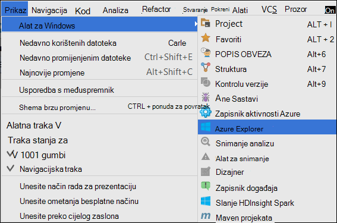

2. Desnom tipkom miša kliknite čvor **Azure** u programu **Azure Explorer**, a zatim kliknite **Upravljanje pretplatama**.

3. U dijaloškom okviru **Upravljanje pretplate** kliknite **Prijava** , a zatim unesite vjerodajnice za Azure.

    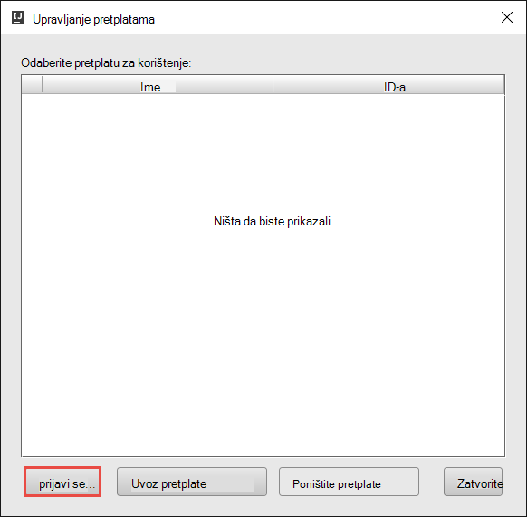

4. Kada ste prijavljeni, dijaloški okvir **Upravljanje pretplatama** popise povezane s vjerodajnicama Azure pretplate. Kliknite **Zatvori** u dijaloškom okviru.

5. Na kartici **Azure Explorer** proširite **HDInsight** da biste vidjeli klastere HDInsight Spark u odjeljku pretplate.

    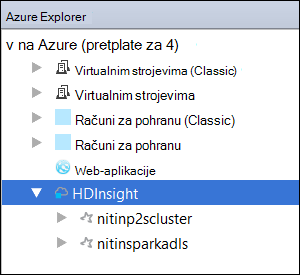

6. Dodatno možete proširiti čvor naziva klaster da biste vidjeli resursa (primjerice pohranu računi) pridružene klaster.

    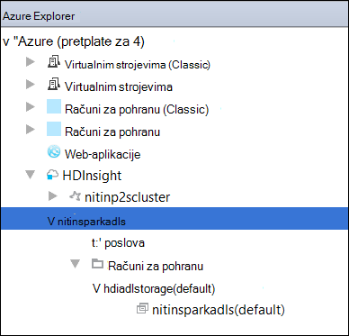

## Pokretanje aplikacije za Spark Scala na programa HDInsight Spark klaster

1. Pokrenite IntelliJ IDEJA i stvaranje novog projekta. U novi projekt dijaloškom okviru provjerite sljedeće mogućnosti, a zatim kliknite **Dalje**.

    

    * U lijevom oknu odaberite **HDInsight**.
    * U desnom oknu odaberite **Spark na HDInsight (Scala)**.
    * Kliknite **Dalje**.

2. U sljedećem prozoru navedite Detalji o projektu.

    * Navedite naziv projekta i mjesto projekta.
    * Za **Projekt SDK**, provjerite je li pružaju verziju jezika Java veći od 7.
    * Za **Scala SDK**, kliknite **Stvori**, kliknite **Preuzmi**i zatim odaberite željenu verziju Scala da biste koristili. **Provjerite ne koriste verziju 2.11.x**. Ovaj primjer koristi verzija **2.10.6**.

        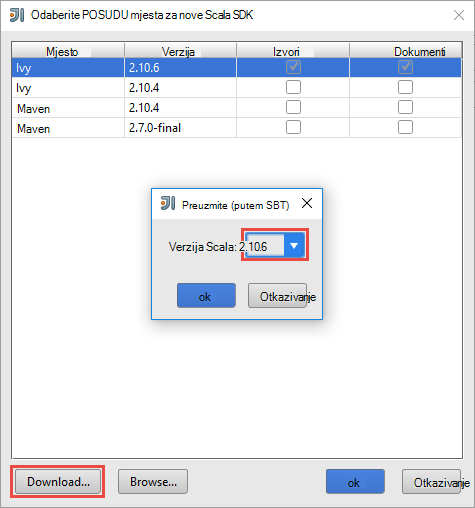

    * **Spark SDK**, preuzimanje i korištenje SDK iz [ovdje](http://go.microsoft.com/fwlink/?LinkID=723585&clcid=0x409). Možete zanemariti to i upotrijebite [Spark Maven spremište](http://mvnrepository.com/search?q=spark) , no ponovno provjerite je li instaliran za razvoj aplikacija Spark spremište desnom maven. (Na primjer, morate da biste bili sigurni da imate instaliran ako koristite Spark strujanje; dio Spark strujanje I ponovno provjerite je li koriste spremište označena kao Scala 2.10 – ne koristi spremište označena kao Scala 2.11.)

        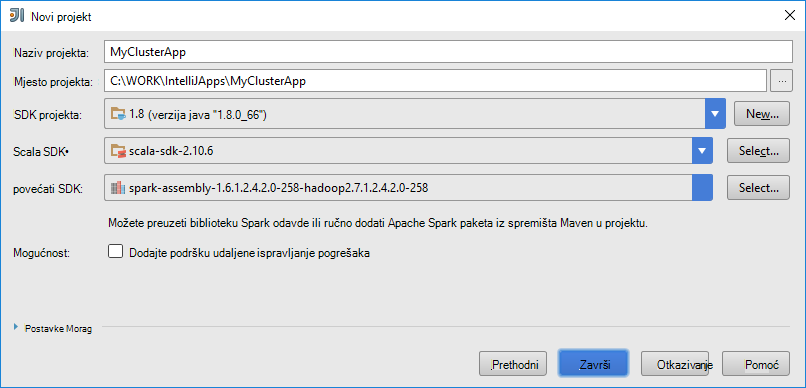

    * Kliknite **Završi**.

3. Spark project automatski stvori artefakt umjesto vas. Da biste vidjeli artefakt, slijedite ove korake.

    1. Na izborniku **datoteka** kliknite **Struktura projekta**.
    2. U dijaloškom okviru **Strukturu projekta** kliknite **artefakte** da biste vidjeli artefakt zadani koja je stvorena.

        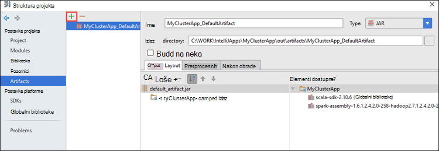

    Možete i stvoriti vlastiti artefakt bly klikom na u **+** , istaknutom ikonom u gornjoj slici.

4. U dijaloškom okviru **Strukturu u programu Project** kliknite **projekt**. Ako je **SDK projekta** postavljeno na 1.8, provjerite je li **Razina jezika projekta** postavljen na **7 – Rombovi, ARM, više zamka itd**.

    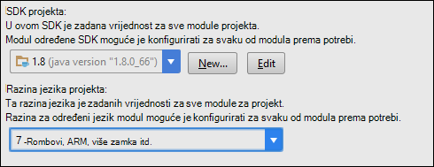

5. Dodavanje izvornog koda vašeg računala.

    1. Iz **Programa Project Explorer**desnom tipkom miša kliknite **src**, pokažite na **Novo**, a zatim kliknite **Predmet Scala**.

        

    2. U dijaloškom okviru **Stvaranje nove klase Scala** Navedite naziv, **vrstu** odaberite **objekt**, a zatim **u redu**.

        

    3. U datoteci **MyClusterApp.scala** zalijepite sljedeći kod. Kod čita podatke iz HVAC.csv (dostupno na sve HDInsight Spark klastere), dohvaća retke koji imaju samo jednu znamenku u sedmoj stupcu u CSV i zapisuje izlaz **/HVACOut** u kontejneru za zadani prostor za pohranu za klaster.

            import org.apache.spark.SparkConf
            import org.apache.spark.SparkContext

            object MyClusterApp{
              def main (arg: Array[String]): Unit = {
                val conf = new SparkConf().setAppName("MyClusterApp")
                val sc = new SparkContext(conf)

                val rdd = sc.textFile("wasbs:///HdiSamples/HdiSamples/SensorSampleData/hvac/HVAC.csv")

                //find the rows which have only one digit in the 7th column in the CSV
                val rdd1 =  rdd.filter(s => s.split(",")(6).length() == 1)

                rdd1.saveAsTextFile("wasbs:///HVACOut")
              }

            }

5. Pokrenite aplikaciju na programa klaster HDInsight Spark.

    1. Iz **Programa Project Explorer**desnom tipkom miša kliknite naziv projekta, a zatim **Pošalji Spark aplikaciju za HDInsight**.

        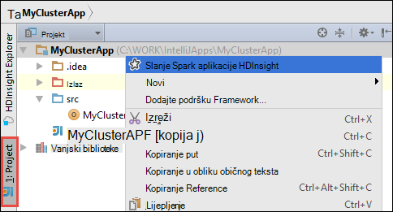

    2. Zatražit će se da unesete vjerodajnice Azure pretplate. U dijaloškom okviru **Slanje Spark** sadrže sljedeće vrijednosti.

        * Za **klastere Spark (samo za Linux)**, odaberite klaster HDInsight Spark na kojem želite li pokrenuti aplikaciju.

        * Morate birati artefakt IntelliJ projekta ili odaberite neku s tvrdog diska.

        * Protiv tekstni okvir **Naziv klase glavne** kliknite tri točke ( ), odaberite glavni klase u kodu izvora aplikacije pa kliknite **u redu**.

            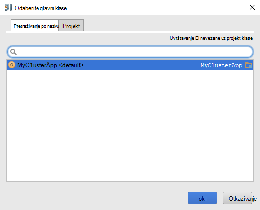

        * Jer kod aplikacije u ovom primjeru zahtijevaju bilo koji argument naredbenog retka ili referencu staklenke ili datoteke, tekstne okvire preostale možete ostavite praznim.

        * Nakon unošenja sve unose, dijaloški okvir trebali biste otprilike ovako.

            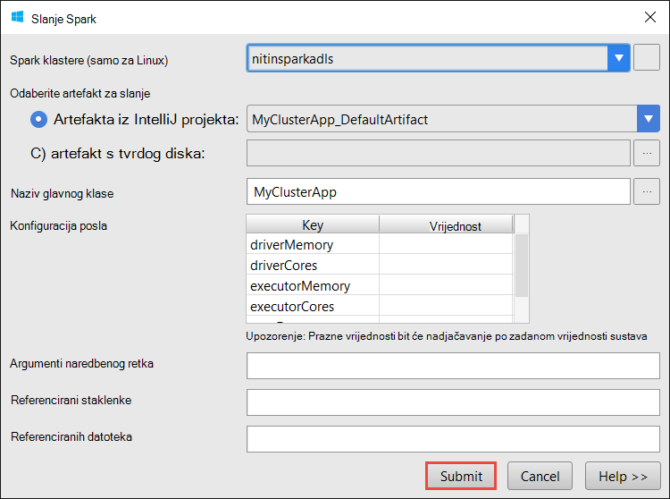

        * Kliknite **Pošalji**.

    3. Na kartici **Slanje Spark** pri dnu prozora trebala prikazuje napredak. Aplikaciju možete isključiti i tako da kliknete crveni gumb u prozoru za "Slanje Spark".

        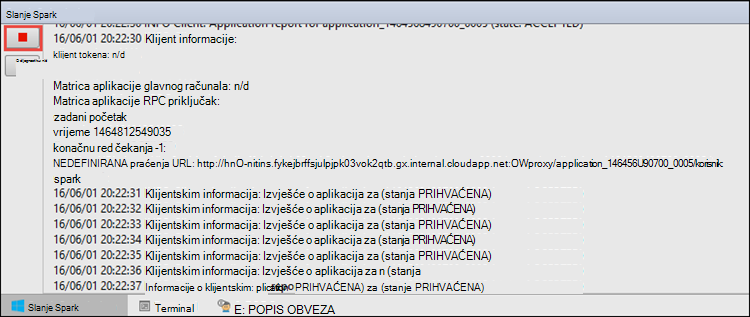

    U sljedećem odjeljku, Saznajte kako pristupiti posao izlaz pomoću alata za HDInsight u Azure komplet alata za IntelliJ.

## Pristup i upravljanje klastere HDInsight Spark pomoću alata za HDInsight u Azure komplet alata za IntelliJ

Možete izvršiti razne operacije pomoću alata za HDInsight koji su dio Azure komplet alata za IntelliJ.

### Pristup prikazu posao izravno iz alata za HDInsight

1. Iz programa **Azure Explorer**proširite **HDInsight**, proširite naziv klaster Spark pa kliknite **Zadaci**.

2. U desnom oknu kartice **Spark posao prikaz** prikazuje sve programe koji su pokrenuti na klaster. Kliknite naziv aplikacije za koji želite da biste vidjeli dodatne detalje.

    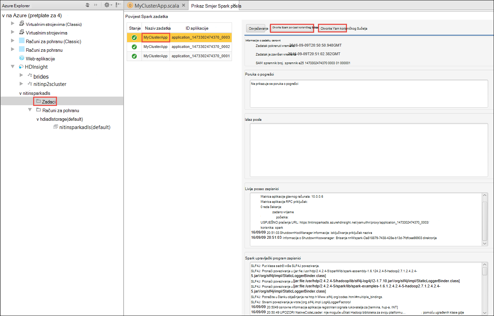

3. Okvire uz **Poruku o pogrešci**, **Izlazna posla**, **Livije posao zapisnika**i **Zapisnika Spark upravljački program** se unose koji se temelje na aplikaciji odaberete.

4. **Korisničko Sučelje povijest Spark** i **YARN korisničkog Sučelja** (na razini aplikacije) možete otvoriti i klikom na gumbe odgovarajući pri vrhu zaslona.

### Pristup povijesti poslužitelju Spark

1. Iz **Azure Explorer**proširite **HDInsight**, desnom tipkom miša kliknite naziv Spark klaster, a zatim odaberite **Otvori Spark povijest korisničkog Sučelja**. Kada se to od vas zatraži, unesite administratorske vjerodajnice za klaster. Morate ste naveli te prilikom dodjele resursa klaster.

2. Na nadzornoj ploči Spark povijest poslužitelja možete potražiti aplikaciju koju samo dovršeni izvodi pomoću naziv aplikacije. U gore navedeni kod postaviti pomoću aplikacije naziv `val conf = new SparkConf().setAppName("MyClusterApp")`. Dakle, naziv aplikacije Spark je **MyClusterApp**.

### Pokretanje Ambari portala

Iz programa **Azure Explorer**proširite **HDInsight**, desnom tipkom miša kliknite naziv Spark klaster, a zatim odaberite **Otvori klaster Portal za upravljanje (Ambari)**. Kada se to od vas zatraži, unesite administratorske vjerodajnice za klaster. Morate ste naveli te prilikom dodjele resursa klaster.

### Upravljanje Azure pretplatama

Prema zadanim postavkama, Alati za HDInsight popis klastere Spark iz svih Azure pretplata. Ako je potrebno, možete odrediti pretplate za koji želite da biste pristupili klaster. Iz **Azure Explorer**desnom tipkom miša kliknite čvor korijenske **Azure** , a zatim **Upravljanje pretplatama**. U dijaloškom okviru poništite potvrdne okvire protiv pretplatu u koju želite pristupiti, a zatim kliknite **Zatvori**. Možete kliknuti i **Odjava** ako želite da biste se odjavili iz pretplate Azure.

## Lokalno pokretanje aplikacije za Spark Scala

Možete koristiti alate za HDInsight u Azure komplet alata za IntelliJ za pokretanje aplikacije Spark Scala lokalno na vaše radne stanice. Obično takve aplikacije nije potreban pristup klaster resurse kao što je spremnik za pohranu i možete se pokrenuti i testirati lokalno.

### Preduvjeta

Prilikom pokretanja lokalnog računala Spark Scala na računalu sa sustavom Windows, mogla bi vam se iznimku kao što je opisano u [SPARK 2356](https://issues.apache.org/jira/browse/SPARK-2356) koji se pojavljuje zbog nedostaje WinUtils.exe u sustavu Windows. Da biste zaobišli tu pogrešku, morate [preuzeti izvršnu datoteku na tom mjestu](http://public-repo-1.hortonworks.com/hdp-win-alpha/winutils.exe) na mjesto kao što je **C:\WinUtils\bin**. Zatim morate dodati varijable okruženja **HADOOP_HOME** i postavite vrijednost varijable **C\WinUtils**.

### Pokretanje lokalnog Spark Scala aplikacije  

1. Pokrenite IntelliJ IDEJA i stvaranje novog projekta. U novi projekt dijaloškom okviru provjerite sljedeće mogućnosti, a zatim kliknite **Dalje**.

    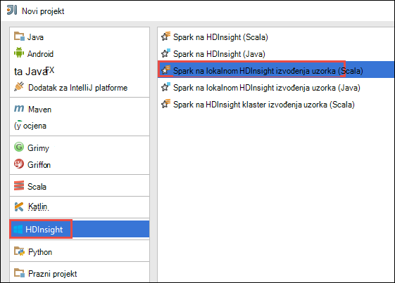

    * U lijevom oknu odaberite **HDInsight**.
    * U desnom oknu odaberite **Spark na HDInsight lokalne pokrenuti uzorka (Scala)**.
    * Kliknite **Dalje**.

2. U sljedećem prozoru navedite Detalji o projektu.

    * Navedite naziv projekta i mjesto projekta.
    * Za **Projekt SDK**, provjerite je li pružaju verziju jezika Java veći od 7.
    * Za **Scala SDK**, kliknite **Stvori**, kliknite **Preuzmi**i zatim odaberite željenu verziju Scala da biste koristili. **Provjerite ne koriste verziju 2.11.x**. Ovaj primjer koristi verzija **2.10.6**.

        

    * **Spark SDK**, preuzimanje i korištenje SDK iz [ovdje](http://go.microsoft.com/fwlink/?LinkID=723585&clcid=0x409). Možete zanemariti to i upotrijebite [Spark Maven spremište](http://mvnrepository.com/search?q=spark) , no ponovno provjerite je li instaliran za razvoj aplikacija Spark spremište desnom maven. (Na primjer, morate da biste bili sigurni da imate instaliran ako koristite Spark strujanje; dio Spark strujanje I ponovno provjerite je li koriste spremište označena kao Scala 2.10 – ne koristi spremište označena kao Scala 2.11.)

        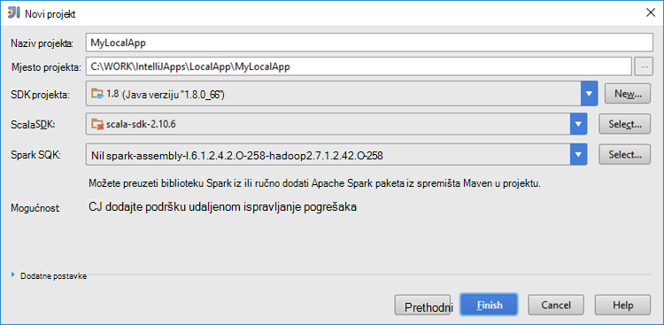

    * Kliknite **Završi**.

3. Predložak dodaje ogledni kod (**LogQuery**) u mapi **src** koje možete pokrenuti lokalno na vašem računalu.

    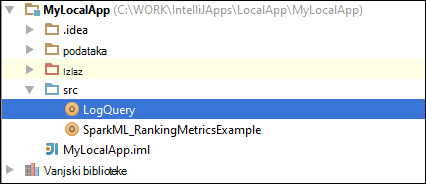

4.  Desnom tipkom miša kliknite **LogQuery** aplikacije, a zatim kliknite **"Pokreni 'LogQuery'"**. Prikazat će se izlazni ovako na kartici **pokrenuti** pri dnu.

    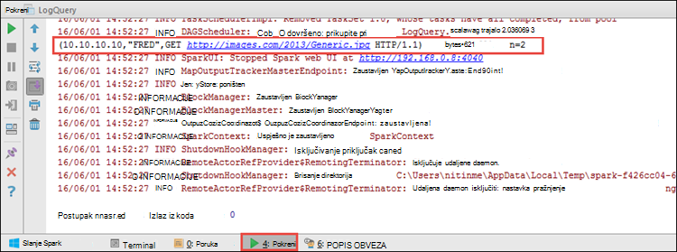

## Pretvaranje postojeće aplikacije IntelliJ IDEJA pomoću alata za HDInsight u Azure komplet alata za IntelliJ

Možete i pretvoriti svoje postojeće Spark Scala aplikacije stvorene u IntelliJ IDEJA nisu kompatibilne s alatima za HDInsight u Azure komplet alata za IntelliJ. To će vam omogućiti da biste koristili alat za slanje aplikacije programa klaster HDInsight Spark. To možete učiniti pomoću sljedećih koraka:

1. Za postojeće Scala za Spark appliction stvorena pomoću IntelliJ IDEJA, otvorite datoteku povezane .iml.
2. Na korijenskoj razini vidjet ćete **Modul** element ovako:

        <module org.jetbrains.idea.maven.project.MavenProjectsManager.isMavenModule="true" type="JAVA_MODULE" version="4">

3. Uređivanje elementa koji želite dodati `UniqueKey="HDInsightTool"` tako da se element **Modul** izgleda ovako:

        <module org.jetbrains.idea.maven.project.MavenProjectsManager.isMavenModule="true" type="JAVA_MODULE" version="4" UniqueKey="HDInsightTool">

4. Spremite promjene. Aplikacija sada bi trebala biti kompatibilne s alatima za HDInsight u Azure komplet alata za IntelliJ. To možete testirati tako da desnom tipkom miša na naziv projekta u programu Project Explorer. Na skočnom izborniku treba sada imate mogućnost **Slanja aplikacije Spark HDInsight**.

## Otklanjanje poteškoća

### "Koristite veći skupova" Pogreška u lokalne pokretanje

U Spark 1.6, ako koristite 32-bitni Java SDK-a tijekom lokalne Pokreni, koji se mogu pojaviti sljedeće pogreške:

    Exception in thread "main" java.lang.IllegalArgumentException: System memory 259522560 must be at least 4.718592E8. Please use a larger heap size.
        at org.apache.spark.memory.UnifiedMemoryManager$.getMaxMemory(UnifiedMemoryManager.scala:193)
        at org.apache.spark.memory.UnifiedMemoryManager$.apply(UnifiedMemoryManager.scala:175)
        at org.apache.spark.SparkEnv$.create(SparkEnv.scala:354)
        at org.apache.spark.SparkEnv$.createDriverEnv(SparkEnv.scala:193)
        at org.apache.spark.SparkContext.createSparkEnv(SparkContext.scala:288)
        at org.apache.spark.SparkContext.<init>(SparkContext.scala:457)
        at LogQuery$.main(LogQuery.scala:53)
        at LogQuery.main(LogQuery.scala)
        at sun.reflect.NativeMethodAccessorImpl.invoke0(Native Method)
        at sun.reflect.NativeMethodAccessorImpl.invoke(NativeMethodAccessorImpl.java:57)
        at sun.reflect.DelegatingMethodAccessorImpl.invoke(DelegatingMethodAccessorImpl.java:43)
        at java.lang.reflect.Method.invoke(Method.java:606)
        at com.intellij.rt.execution.application.AppMain.main(AppMain.java:144)

To je zato Veličina skupa nije dovoljna za Spark da biste pokrenuli, jer Spark zahtijeva barem 471MB (možete dobiti dodatne detalje [SPARK 12081](https://issues.apache.org/jira/browse/SPARK-12081) po želji). Jedan jednostavno rješenje jest korištenje 64-bitni Java SDK-a. Postavke JVM u IntelliJ možete promijeniti i tako da dodate sljedeće mogućnosti:

    -Xms128m -Xmx512m -XX:MaxPermSize=300m -ea

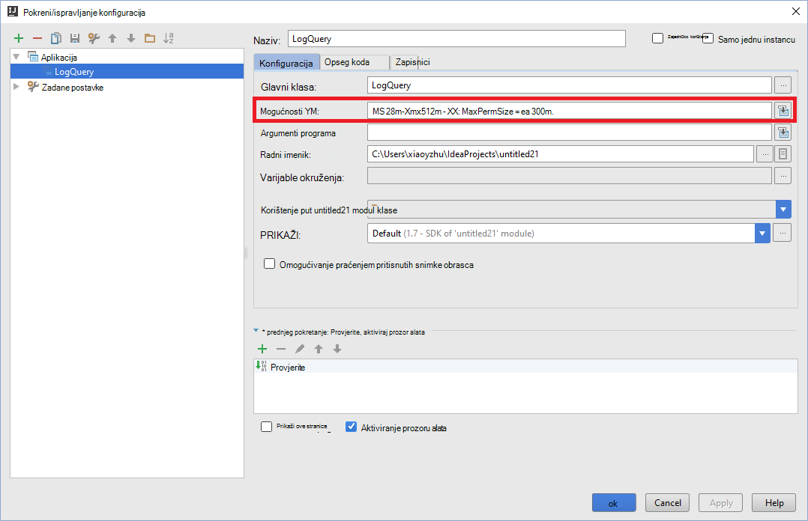

## Povratne informacije i poznati problemi

Trenutno pregledavate Spark proizvodi izravno nije podržan, a Radimo na koji.

Ako imate prijedloge ili feedbacks ili Ako naiđete na probleme prilikom korištenja tog alata, slobodno ispustite nam poruku e-pošte na hdivstool na microsoft točka com.

## Vidi također

* [Pregled: Apache Spark na Azure HDInsight](hdinsight-apache-spark-overview.md)

### Scenariji

* [Spark bi: izvođenje analiza interaktivnih podataka pomoću Spark u HDInsight s alatima za Poslovno obavještavanje](hdinsight-apache-spark-use-bi-tools.md)

* [Spark s strojnog učenja: korištenje Spark u HDInsight za analizu sastavnih temperatura pomoću HVAC podataka](hdinsight-apache-spark-ipython-notebook-machine-learning.md)

* [Spark s strojnog učenja: korištenje Spark u HDInsight za predviđanje rezultata provjere za hranu](hdinsight-apache-spark-machine-learning-mllib-ipython.md)

* [Spark strujeće: Korištenje Spark u HDInsight za izgradnju u stvarnom vremenu strujanje aplikacije](hdinsight-apache-spark-eventhub-streaming.md)

* [Web-mjesto zapisnika analize pomoću Spark u HDInsight](hdinsight-apache-spark-custom-library-website-log-analysis.md)

### Stvaranje i pokretanje aplikacija

* [Stvaranje samostalne aplikacije pomoću Scala](hdinsight-apache-spark-create-standalone-application.md)

* [Pokretanje zadataka na Spark klaster pomoću Livije](hdinsight-apache-spark-livy-rest-interface.md)

### Alati i proširenja

* [Korištenje alata za HDInsight u Azure komplet alata za IntelliJ za ispravljanje pogrešaka daljinski povećati aplikacije](hdinsight-apache-spark-intellij-tool-plugin-debug-jobs-remotely.md)

* [Pomoću alata za HDInsight u Azure komplet alata za Eclipse da biste stvorili Spark aplikacije](hdinsight-apache-spark-eclipse-tool-plugin.md)

* [Koristite Zeppelin bilježnice s Spark klaster na HDInsight](hdinsight-apache-spark-use-zeppelin-notebook.md)

* [Dostupno za Jupyter bilježnicu u skupini Spark za HDInsight jezgre](hdinsight-apache-spark-jupyter-notebook-kernels.md)

* [Korištenje vanjskih paketa s bilježnicama Jupyter](hdinsight-apache-spark-jupyter-notebook-use-external-packages.md)

* [Na računalo instalirati Jupyter i povezati se HDInsight Spark klaster](hdinsight-apache-spark-jupyter-notebook-install-locally.md)

### Upravljanje resursima

* [Upravljanje resursima za klaster Apache Spark u Azure HDInsight](hdinsight-apache-spark-resource-manager.md)

* [Praćenje i ispravljanje pogrešaka zadataka izvodi na programa klaster Apache Spark u HDInsight](hdinsight-apache-spark-job-debugging.md)
