<properties 
    pageTitle="Praćenje i ispravljanje pogrešaka zadataka izvodi na Apache Spark skupine u HDInsight | Microsoft Azure" 
    description="Korištenje YARN korisničkog Sučelja, Spark korisničkog Sučelja i poslužitelja Spark povijest praćenja i ispravljanja pogrešaka zadataka koji se izvode na Spark klaster u Azure HDInsight" 
    services="hdinsight" 
    documentationCenter="" 
    authors="nitinme" 
    manager="jhubbard" 
    editor="cgronlun"
    tags="azure-portal"/>

<tags 
    ms.service="hdinsight" 
    ms.workload="big-data" 
    ms.tgt_pltfrm="na" 
    ms.devlang="na" 
    ms.topic="article" 
    ms.date="08/25/2016" 
    ms.author="nitinme"/>

# Praćenje i ispravljanje pogrešaka poslove sustavom Apache Spark klaster u HDInsight Linux

U ovom članku će Saznajte kako praćenja i ispravljanja pogrešaka Spark zadataka pomoću korisničkog Sučelja YARN, Spark korisničkog Sučelja i povijest poslužitelja Spark. Za ovaj članak ne možemo počet će Spark posla pomoću bilježnicu koja je dostupna klaster Spark **učenje na računalu: predvidljivu analizi Hrana provjere podataka pomoću MLLib**. Koristite dolje navedene korake da biste pratili aplikacije koje ste poslali pomoću bilo koje druge pristup kao i, ako, na primjer, **spark slanje**.

##Preduvjeti

Morate imati sljedeće:

- Azure pretplate. Pogledajte [Početak Azure besplatnu probnu verziju](https://azure.microsoft.com/documentation/videos/get-azure-free-trial-for-testing-hadoop-in-hdinsight/).
- Klaster Apache Spark na HDInsight Linux. Upute potražite u članku [Stvaranje Spark Apache klastere u Azure HDInsight](hdinsight-apache-spark-jupyter-spark-sql.md).
- Trebali biste ste pokrenuli izvodi bilježnicu, **[učenje na računalu: predvidljivu analizi Hrana provjere podataka pomoću MLLib](hdinsight-apache-spark-machine-learning-mllib-ipython.md)**. Upute za izvođenje ovu bilježnicu, slijedite vezu.  

## Praćenje aplikacija u korisničkom Sučelju YARN

1. Pokrenite YARN korisničkog Sučelja. Iz plohu klaster kliknite **Nadzorna ploča klaster**, a zatim **YARN**.

    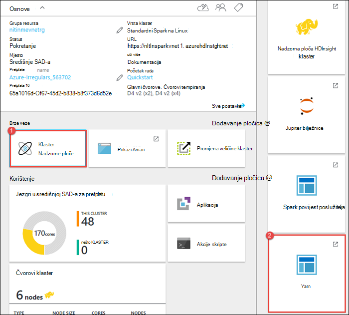

    >[AZURE.TIP] Osim toga, možete pokrenuti i korisničkog Sučelja YARN iz Ambari korisničkog Sučelja. Da biste pokrenuli Ambari korisničko Sučelje, iz plohu klaster kliknite **Nadzorna ploča klaster**, a zatim **Nadzorne ploče klaster HDInsight**. Iz korisničkog Sučelja Ambari kliknite **YARN**, kliknite **Brze veze**, kliknite Upravitelj aktivni resursa, a zatim **ResourceManager korisničkog Sučelja**.  

3. Budući da se pokreće posao Spark putem Jupyter bilježnice, aplikacija ima naziv **remotesparkmagics** (to je naziv za sve programe koji su pokrenuti s bilježnicama). Kliknite ID aplikacije na temelju naziva aplikacije da biste saznali više o posao. Time se pokreće prikazu aplikacije.

    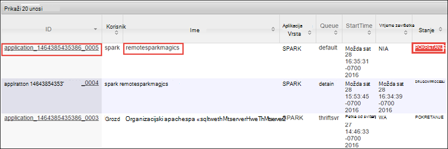

    Za takve aplikacije koji su pokrenuti iz bilježnice Jupyter status uvijek je **POKRENUT** dok ne zatvorite bilježnice.

4. U prikazu aplikacije moguće je dubinski analizirati se Saznajte spremnika vezane uz aplikacije i zapisnika (stdout na stderr). Korisničko Sučelje Spark možete pokrenuti i tako da kliknete na povezivanje odgovara **Praćenja URL**, kao što je prikazano u nastavku. 

    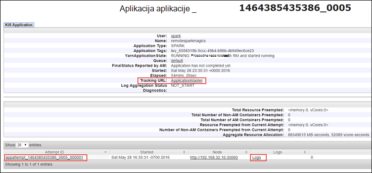

## Praćenje aplikacija u korisničkom Sučelju Spark

U korisničkom Sučelju Spark moguće je dubinski analizirati u Spark zadatke koji su spawned aplikacija koju ste započeli ranije.

1. Da biste pokrenuli Spark korisničko Sučelje, u prikazu aplikacije kliknite vezu prema **Praćenja URL**, kao što je prikazano u snimke zaslona iznad. Vidjet ćete sve Spark zadatke koji su pokrenuti aplikacija izvodi u bilježnici Jupyter.

    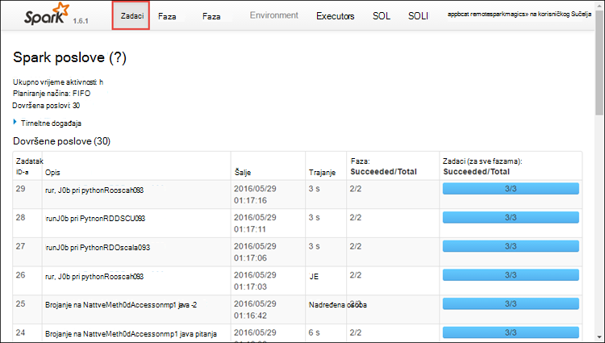

2. Kliknite karticu **Executors** da biste vidjeli informacije o obrada i prostora za pohranu za svaku executor. Također možete dohvatiti stog poziva klikom na vezu **Niti ispis** .

    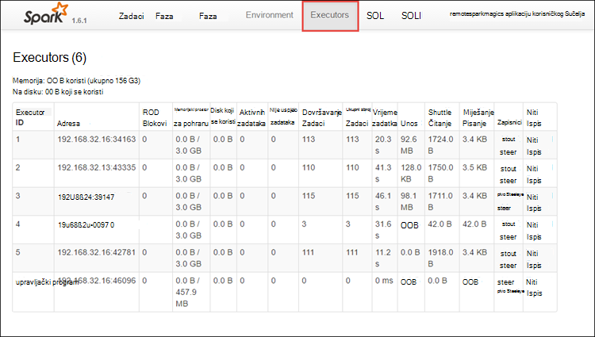
 
3. Kliknite karticu **faze** da biste vidjeli faze povezan s aplikacijom.

    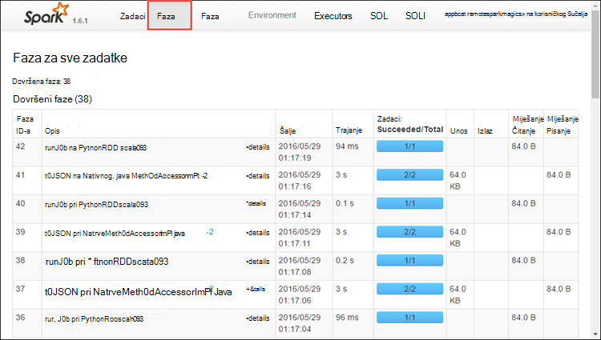

    Svakoj fazi može imati više zadataka za koje možete pogledati statistiku izvođenja, poput što je prikazano ispod.

    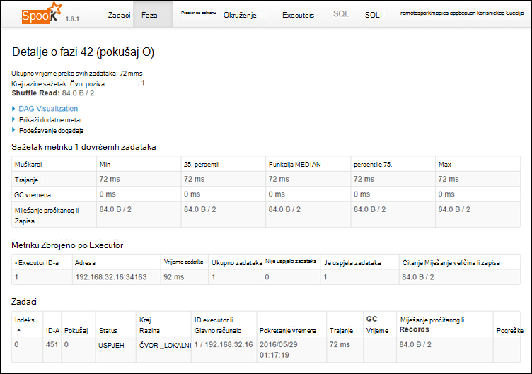 

4. Na stranici Detalji o fazi možete pokrenuti DAG vizualizaciju. Proširivanje **Vizualizacije DAG** veze pri vrhu stranice, kao što je prikazano u nastavku.

    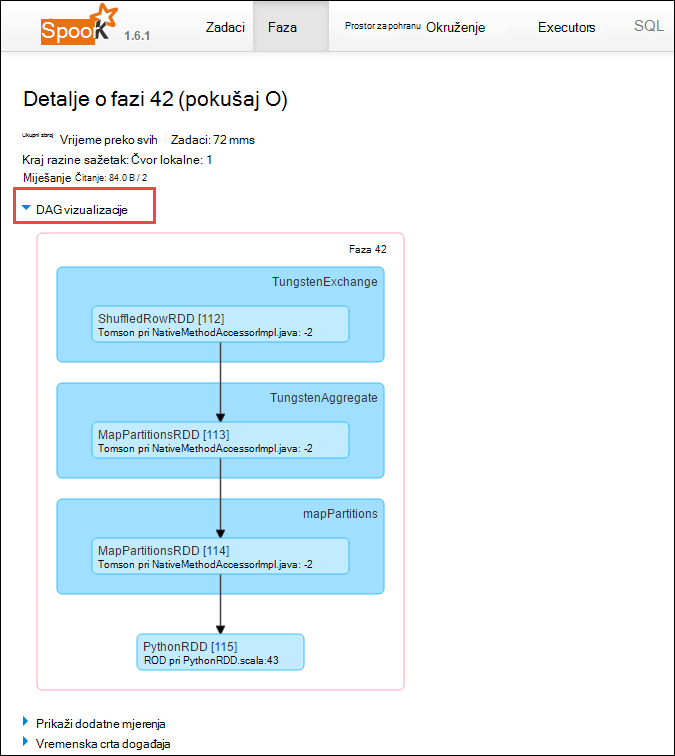

    DAG ili izravno Aclyic grafikonu predstavlja različite faze u aplikaciji. Svaki okvir plava u grafikonu predstavlja Spark operacija pozvati iz aplikacije.

5. Na stranici Detalji o fazi možete pokrenuti i prikaz vremenske trake aplikacije. Proširite vezu **Vremenska crta događaja** pri vrhu stranice, kao što je prikazano u nastavku.

    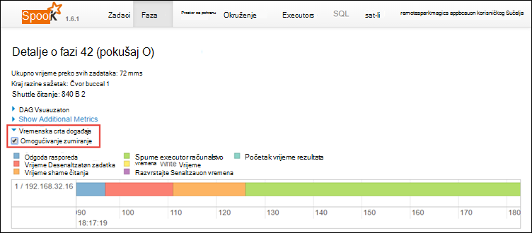

    Prikazat će se Spark događaje u obrascu vremenske crte. Prikaz vremenske trake dostupna tri razine preko zadataka, unutar posla, a zatim u okviru faze. Na gornjoj slici pohranjuju u prikazu vremenske crte za dani fazu.

    >[AZURE.TIP] Ako ste odabrali potvrdni okvir **Omogući zumiranje** , možete se pomicati lijevo i desno u prikazu vremenske crte.

6. Druge kartice u korisničkom Sučelju Spark navedite korisne informacije o instancu Spark.

    * Kartica za pohranu – ako se aplikacija programa RDDs možete pronaći informacije o onima na kartici prostora za pohranu.
    * Kartica okruženju – Ta kartica omogućuje mnogo korisne informacije o vašoj instanci Spark kao što su u 
        * Scala verzija
        * Zapisnik događaja direktorij povezan s klaster
        * Broj jezgri executor za aplikaciju
        * Itd.

## Pronalaženje informacija o dovršene zadatke pomoću poslužitelja za povijest Spark

Nakon dovršetka posla podatke o poslu je ista i na poslužitelju Spark povijest.

1. Da biste pokrenuli povijest poslužiteljem Spark iz plohu klaster kliknite **Nadzorna ploča klaster**, a zatim **Spark povijest poslužitelja**.

    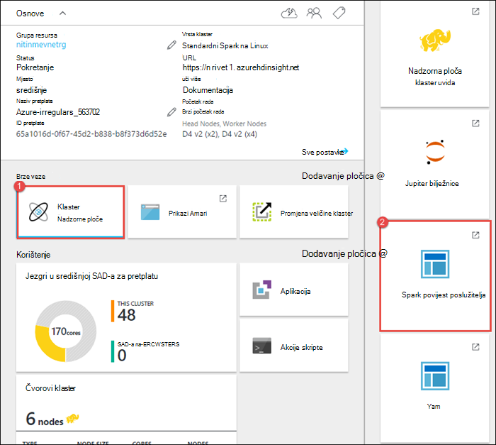

    >[AZURE.TIP] Osim toga, možete pokrenuti i Spark povijest poslužitelja korisničko Sučelje iz Ambari korisničkog Sučelja. Da biste pokrenuli Ambari korisničko Sučelje, iz plohu klaster kliknite **Nadzorna ploča klaster**, a zatim **Nadzorne ploče klaster HDInsight**. Iz korisničkog Sučelja Ambari kliknite **Spark**, kliknite **Brze veze**, a zatim **Spark povijest poslužitelja Sučelja**.

2. Vidjet ćete dovršene aplikacije na popisu. Kliknite aplikaciju ID koji će se kroz razine naniže u aplikaciju za dodatne informacije.

    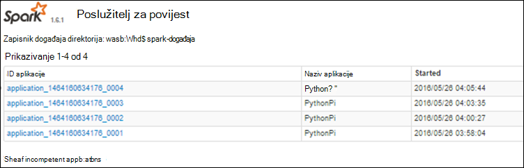
    

## Vidi također

* [Pregled: Apache Spark na Azure HDInsight](hdinsight-apache-spark-overview.md)

### Scenariji

* [Spark bi: izvođenje analiza interaktivnih podataka pomoću Spark u HDInsight s alatima za Poslovno obavještavanje](hdinsight-apache-spark-use-bi-tools.md)

* [Spark s strojnog učenja: korištenje Spark u HDInsight za analizu sastavnih temperatura pomoću HVAC podataka](hdinsight-apache-spark-ipython-notebook-machine-learning.md)

* [Spark s strojnog učenja: korištenje Spark u HDInsight za predviđanje rezultata provjere za hranu](hdinsight-apache-spark-machine-learning-mllib-ipython.md)

* [Spark strujeće: Korištenje Spark u HDInsight za izgradnju u stvarnom vremenu strujanje aplikacije](hdinsight-apache-spark-eventhub-streaming.md)

* [Web-mjesto zapisnika analize pomoću Spark u HDInsight](hdinsight-apache-spark-custom-library-website-log-analysis.md)

### Stvaranje i pokretanje aplikacija

* [Stvaranje samostalne aplikacije pomoću Scala](hdinsight-apache-spark-create-standalone-application.md)

* [Pokretanje zadataka na Spark klaster pomoću Livije](hdinsight-apache-spark-livy-rest-interface.md)

### Alati i proširenja

* [Korištenje servisa HDInsight dodatak Alati za IntelliJ IDEJA za stvaranje i slanje Spark Scala aplikacije](hdinsight-apache-spark-intellij-tool-plugin.md)

* [Korištenje servisa HDInsight dodatak Alati za IntelliJ IDEJA za ispravljanje pogrešaka aplikacije Spark daljinski](hdinsight-apache-spark-intellij-tool-plugin-debug-jobs-remotely.md)

* [Koristite Zeppelin bilježnice s Spark klaster na HDInsight](hdinsight-apache-spark-use-zeppelin-notebook.md)

* [Dostupno za Jupyter bilježnicu u skupini Spark za HDInsight jezgre](hdinsight-apache-spark-jupyter-notebook-kernels.md)

* [Korištenje vanjskih paketa s bilježnicama Jupyter](hdinsight-apache-spark-jupyter-notebook-use-external-packages.md)

* [Na računalo instalirati Jupyter i povezati se HDInsight Spark klaster](hdinsight-apache-spark-jupyter-notebook-install-locally.md)

### Upravljanje resursima

* [Upravljanje resursima za klaster Apache Spark u Azure HDInsight](hdinsight-apache-spark-resource-manager.md)
