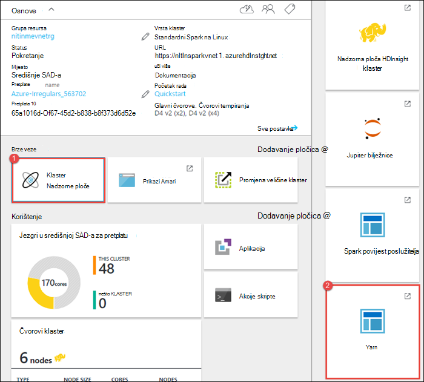
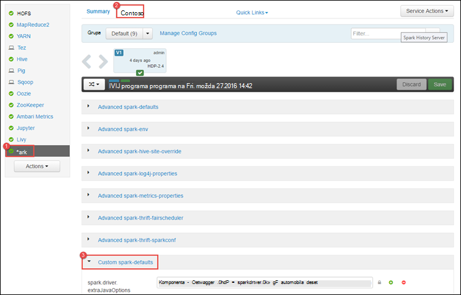
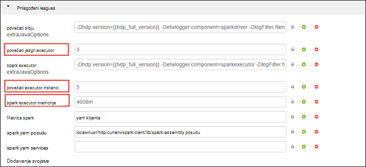
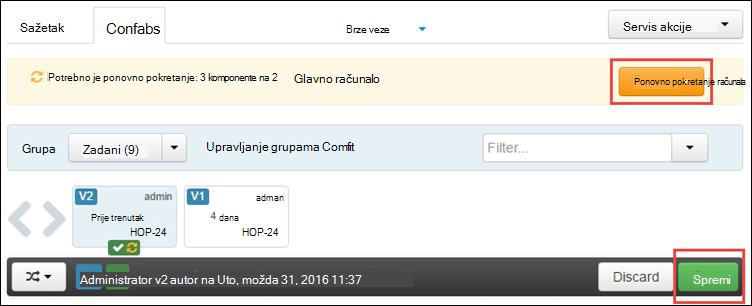
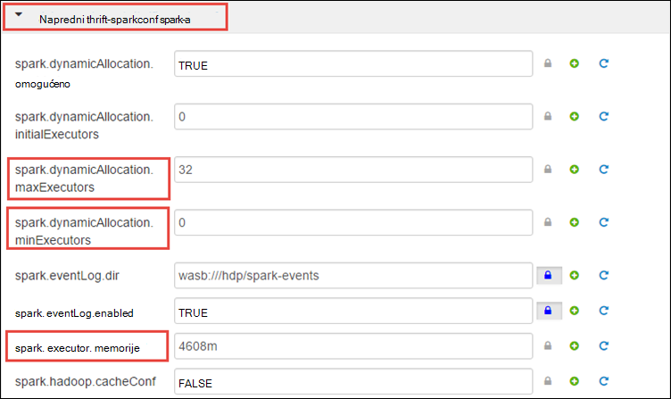
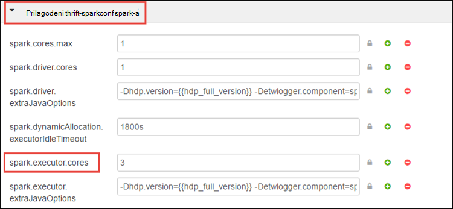
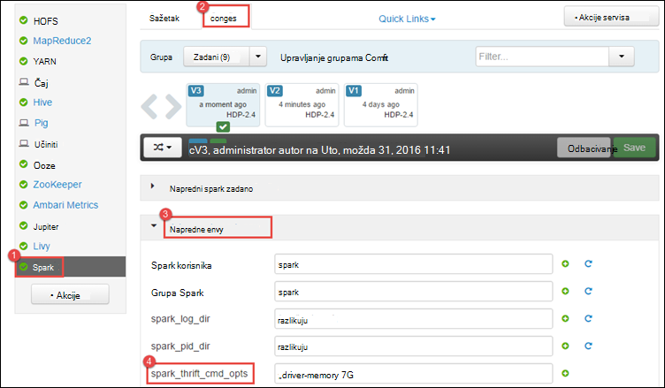
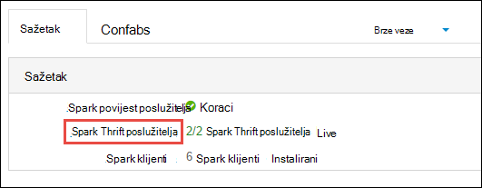
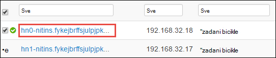
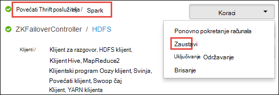

<properties 
    pageTitle="Korištenje upravitelja resursa za dodjelu resursa za klaster Apache Spark u HDInsight | Microsoft Azure" 
    description="Saznajte kako pomoću upravitelja resursima za klastere Spark na HDInsight za bolje performanse." 
    services="hdinsight" 
    documentationCenter="" 
    authors="nitinme" 
    manager="jhubbard" 
    editor="cgronlun"
    tags="azure-portal"/>

<tags 
    ms.service="hdinsight" 
    ms.workload="big-data" 
    ms.tgt_pltfrm="na" 
    ms.devlang="na" 
    ms.topic="article" 
    ms.date="08/25/2016" 
    ms.author="nitinme"/>

# Upravljanje resursima za klaster Apache Spark na HDInsight Linux

U ovom članku ćete saznati kako pristupiti sučelja kao što je korisničko Sučelje Ambari na korisničko Sučelje YARN i povijest poslužitelja Spark pridružene svoj klaster Spark. Također ćete naučiti kako podesite konfiguraciju klaster postigli optimalne performanse.

**Preduvjeti:**

Morate imati sljedeće:

- Azure pretplate. Pogledajte [Početak Azure besplatnu probnu verziju](https://azure.microsoft.com/documentation/videos/get-azure-free-trial-for-testing-hadoop-in-hdinsight/).
- Klaster Apache Spark na HDInsight Linux. Upute potražite u članku [Stvaranje Spark Apache klastere u Azure HDInsight](hdinsight-apache-spark-jupyter-spark-sql.md).

## Kako pokrenuti korisničko Sučelje Web Ambari?

1. S [Portala za Azure](https://portal.azure.com/), iz startboard, kliknite pločicu za svoj klaster Spark (Ako ste ga prikvačiti na startboard). Možete se kretati svoj klaster u odjeljku **Pregledaj sve** > **Klastere HDInsight**. 
 
2. Klaster plohu Spark kliknite **nadzorne ploče**. Kada se to od vas zatraži, unesite administratorske vjerodajnice za klaster Spark.

    ![Pokretanje Ambari] (./media/hdinsight-apache-spark-resource-manager/hdispark.cluster.launch.dashboard.png "Pokretanje Upravitelja resursa")

3. To treba pokrenite korisničko Sučelje Web Ambari, kao što je prikazano u nastavku.

    ![Ambari Web korisničkog Sučelja] (./media/hdinsight-apache-spark-resource-manager/ambari-web-ui.png "Ambari Web korisničkog Sučelja")   

## Kako pokrenuti povijest poslužitelja Spark?

1. S [Portala za Azure](https://portal.azure.com/), iz startboard, kliknite pločicu za svoj klaster Spark (Ako ste ga prikvačiti na startboard).

2. Plohu klaster u odjeljku **Brze veze**kliknite **Klaster nadzorne ploče**. U plohu **Klaster nadzorne ploče** kliknite **Spark povijest poslužitelja**.

    ![Spark povijest poslužitelja] (./media/hdinsight-apache-spark-resource-manager/launch-history-server.png "Spark povijest poslužitelja")

    Kada se to od vas zatraži, unesite administratorske vjerodajnice za klaster Spark.

## Kako pokrenuti korisničkog Sučelja Yarn?

Korisničko Sučelje YARN možete koristiti za praćenje aplikacije koje su trenutno pokrenute na Spark klaster. 

1. Iz plohu klaster kliknite **Nadzorna ploča klaster**, a zatim **YARN**.

    

    >[AZURE.TIP] Osim toga, možete pokrenuti i korisničkog Sučelja YARN iz Ambari korisničkog Sučelja. Da biste pokrenuli Ambari korisničko Sučelje, iz plohu klaster kliknite **Nadzorna ploča klaster**, a zatim **Nadzorne ploče klaster HDInsight**. Iz korisničkog Sučelja Ambari kliknite **YARN**, kliknite **Brze veze**, kliknite Upravitelj aktivni resursa, a zatim **ResourceManager korisničkog Sučelja**.

## Što je konfiguriranje najbolju klaster da biste pokrenuli Spark aplikacije?

Tri ključne parametre koje je moguće koristiti za konfiguraciju Spark ovisno o preduvjeti za aplikaciju su `spark.executor.instances`, `spark.executor.cores`, i `spark.executor.memory`. U Executor je postupak pokretanja Spark aplikacije. Pokreće se čvor tempiranja i odgovoran za izvršavanje zadataka za aplikaciju. Zadani broj executors i veličine executor za svaki Klaster se izračunava na temelju broja radnih čvorove i čvor veličine radnih. Ove se pohranjuju u `spark-defaults.conf` na čvorove glavni klaster. 

Tri konfiguracijske parametre možete konfigurirati na razini klaster (za sve programe koji se izvode na klaster) ili možete navesti za kao i sve pojedinačne aplikacije.

### Promjena parametara pomoću Ambari korisničkog Sučelja

1. Iz korisničkog Sučelja Ambari kliknite **Spark**, kliknite **Configs**, a zatim **spark zadane Prilagođeno**.

    

2. Zadane su vrijednosti dobro imati 4 Spark aplikacije istodobno izvoditi na klaster. Možete promjene ove vrijednosti putem korisničkog sučelja kao što je prikazano u nastavku.

    

3. Kliknite **Spremi** da biste spremili promjene konfiguracije. Pri vrhu stranice, zatražit će se da biste ponovno pokrenuli sve zahvaćene servise. Kliknite **ponovno pokrenite**.

    

### Promjena parametara za aplikacije koje se izvode u bilježnici Jupyter

Za aplikacije koji se izvodi u bilježnici Jupyter, možete koristiti u `%%configure` poseban da bi se promjene konfiguracije. Najbolje takve promjene morate napraviti na početku aplikacije, prije nego što pokrenete na prvu ćeliju kod. Na taj način Livije sesiju, kada se stvaraju se primjenjuje konfiguracije. Ako želite promijeniti konfiguraciju kasnije fazi u aplikaciji, morate koristiti u `-f` parametar. Međutim, uz to izgubit će se sve tijeku u aplikaciji.

Isječak u nastavku prikazuje kako promijeniti konfiguraciju za aplikacije koje se izvode u Jupyter.

    %%configure 
    {"executorMemory": "3072M", "executorCores": 4, “numExecutors”:10}

Konfiguracija parametara mora proslijediti u kao niz JSON i mora biti u sljedećem retku nakon poseban, kao što je prikazano u primjeru stupac. 

### Promjena parametara za aplikaciju poslane pomoću spark – slanje

Primjer kako promijeniti konfiguracijske parametre za grupe za aplikaciju koja je poslana pomoću naredbe je `spark-submit`.

    spark-submit --class <the application class to execute> --executor-memory 3072M --executor-cores 4 –-num-executors 10 <location of application jar file> <application parameters>

### Promjena parametara za aplikaciju poslane pomoću zakretanja

Naredbe je primjera kako promijeniti konfiguracijske parametre za grupe za aplikaciju koja je poslana pomoću pomoću zakretanja.

    curl -k -v -H 'Content-Type: application/json' -X POST -d '{"file":"<location of application jar file>", "className":"<the application class to execute>", "args":[<application parameters>], "numExecutors":10, "executorMemory":"2G", "executorCores":5' localhost:8998/batches

### Kako promijeniti parametara na poslužitelju Thrift Spark?

Poslužitelj Thrift Spark omogućuje pristup JDBC/ODBC Spark klaster i služi za servis Spark SQL upita. Alati kao što su Power BI, Tableau itd. pomoću ODBC protokol možete komunicirati s Spark Thrift poslužitelja za izvršavanje Spark SQL upita kao Spark aplikacija. Pri stvaranju Spark klaster dvije instance poslužitelja Thrift Spark pokrenute, jednu u svaki glavni čvor. Svaki Spark Thrift poslužitelj je vidljiv kao Spark aplikacije u korisničkom Sučelju YARN. 

Spark Thrift poslužitelj koristi dodijeljeni dinamičke executor Spark i zato na `spark.executor.instances` ne koristi. Umjesto toga, Spark Thrift Server koristi `spark.dynamicAllocation.minExecutors` i `spark.dynamicAllocation.maxExecutors` za određivanje broja executor. Konfiguriranje parametre `spark.executor.cores` i `spark.executor.memory` koristi se za promjenu veličine executor. Možete promijeniti parametara kao što je prikazano u nastavku.

* Proširite kategoriju **Napredno spark-thrift-sparkconf** da biste ažurirali parametre `spark.dynamicAllocation.minExecutors`, `spark.dynamicAllocation.maxExecutors`, i `spark.executor.memory`.

     

* Proširite kategoriju **Prilagođeno spark-thrift-sparkconf** da biste ažurirali parametar `spark.executor.cores`.

    

### Kako promijeniti memorije upravljački program Thrift poslužitelja Spark?

Memorije upravljački program Spark Thrift poslužitelj je konfiguriran za 25% veličine glavni čvor RAM-a, naveden je veći od 14GB RAM-a za ukupnu količinu čvor glavni. Možete koristiti Ambari korisničko Sučelje za promjenu upravljački program konfiguracije memorije, kao što je prikazano u nastavku.

* Iz korisničkog Sučelja Ambari kliknite **Spark**, **Configs**proširite **spark env za napredno**, a zatim unesite vrijednost za **spark_thrift_cmd_opts**.

    

## Ne koristim BI s Spark klaster. Kako ponovno iskoristite resursa?

Budući da koristimo Spark dinamički dodijeljeni, samo resurse koji su potrošena thrift poslužitelj su resursi za matrice dva aplikacije. Da biste oslobodili ove resurse morate zaustaviti poslužitelja Thrift servise klaster.

1. Korisničko Sučelje Ambari, u lijevom oknu kliknite **Spark**.

2. Na sljedećoj stranici kliknite **Spark Thrift poslužiteljima**.

    

3. Trebali biste vidjeti dva headnodes na kojemu je pokrenut Spark Thrift poslužitelj. Kliknite jednu od na headnodes.

    

4. Na sljedećoj stranici navodi sve servise koji su pokrenuti na toj headnode. Na popisu kliknite gumb padajućeg izbornika pokraj Spark Thrift poslužitelja, a zatim **Zaustavi**.

    

5. Ponovite korake na na druge headnode kao i.

## Svoje bilježnice Jupyter su pokrenuti na očekivani način. Kako ponovno servis?

1. Pokrenite Ambari Web korisničkog Sučelja kao što je prikazano gore. U lijevom navigacijskom oknu kliknite **Jupyter**, kliknite **Servis akcije**, a zatim **Ponovno pokrenite sve**. To će pokrenuti servis Jupyter na sve headnodes.

    ![Ponovno pokrenite Jupyter] (./media/hdinsight-apache-spark-resource-manager/restart-jupyter.png "Ponovno pokrenite Jupyter")

    

## Vidi također

* [Pregled: Apache Spark na Azure HDInsight](hdinsight-apache-spark-overview.md)

### Scenariji

* [Spark bi: izvođenje analiza interaktivnih podataka pomoću Spark u HDInsight s alatima za Poslovno obavještavanje](hdinsight-apache-spark-use-bi-tools.md)

* [Spark s strojnog učenja: korištenje Spark u HDInsight za analizu sastavnih temperatura pomoću HVAC podataka](hdinsight-apache-spark-ipython-notebook-machine-learning.md)

* [Spark s strojnog učenja: korištenje Spark u HDInsight za predviđanje rezultata provjere za hranu](hdinsight-apache-spark-machine-learning-mllib-ipython.md)

* [Spark strujeće: Korištenje Spark u HDInsight za izgradnju u stvarnom vremenu strujanje aplikacije](hdinsight-apache-spark-eventhub-streaming.md)

* [Web-mjesto zapisnika analize pomoću Spark u HDInsight](hdinsight-apache-spark-custom-library-website-log-analysis.md)

### Stvaranje i pokretanje aplikacija

* [Stvaranje samostalne aplikacije pomoću Scala](hdinsight-apache-spark-create-standalone-application.md)

* [Pokretanje zadataka na Spark klaster pomoću Livije](hdinsight-apache-spark-livy-rest-interface.md)

### Alati i proširenja

* [Korištenje servisa HDInsight dodatak Alati za IntelliJ IDEJA za stvaranje i slanje Spark Scala aplikacije](hdinsight-apache-spark-intellij-tool-plugin.md)

* [Korištenje servisa HDInsight dodatak Alati za IntelliJ IDEJA za ispravljanje pogrešaka aplikacije Spark daljinski](hdinsight-apache-spark-intellij-tool-plugin-debug-jobs-remotely.md)

* [Koristite Zeppelin bilježnice s Spark klaster na HDInsight](hdinsight-apache-spark-use-zeppelin-notebook.md)

* [Dostupno za Jupyter bilježnicu u skupini Spark za HDInsight jezgre](hdinsight-apache-spark-jupyter-notebook-kernels.md)

* [Korištenje vanjskih paketa s bilježnicama Jupyter](hdinsight-apache-spark-jupyter-notebook-use-external-packages.md)

* [Na računalo instalirati Jupyter i povezati se HDInsight Spark klaster](hdinsight-apache-spark-jupyter-notebook-install-locally.md)

### Upravljanje resursima

* [Praćenje i ispravljanje pogrešaka zadataka izvodi na programa klaster Apache Spark u HDInsight](hdinsight-apache-spark-job-debugging.md)

[hdinsight-versions]: hdinsight-component-versioning.md
[hdinsight-upload-data]: hdinsight-upload-data.md
[hdinsight-storage]: hdinsight-hadoop-use-blob-storage.md

[azure-purchase-options]: http://azure.microsoft.com/pricing/purchase-options/
[azure-member-offers]: http://azure.microsoft.com/pricing/member-offers/
[azure-free-trial]: http://azure.microsoft.com/pricing/free-trial/
[azure-management-portal]: https://manage.windowsazure.com/
[azure-create-storageaccount]: storage-create-storage-account.md 
