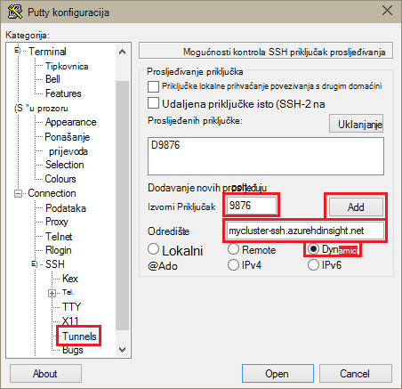
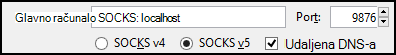
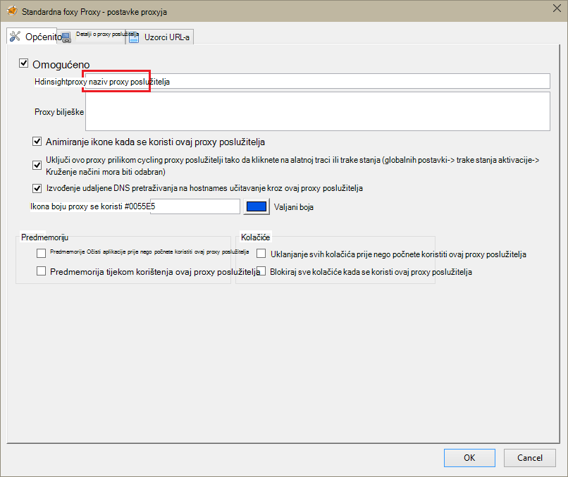
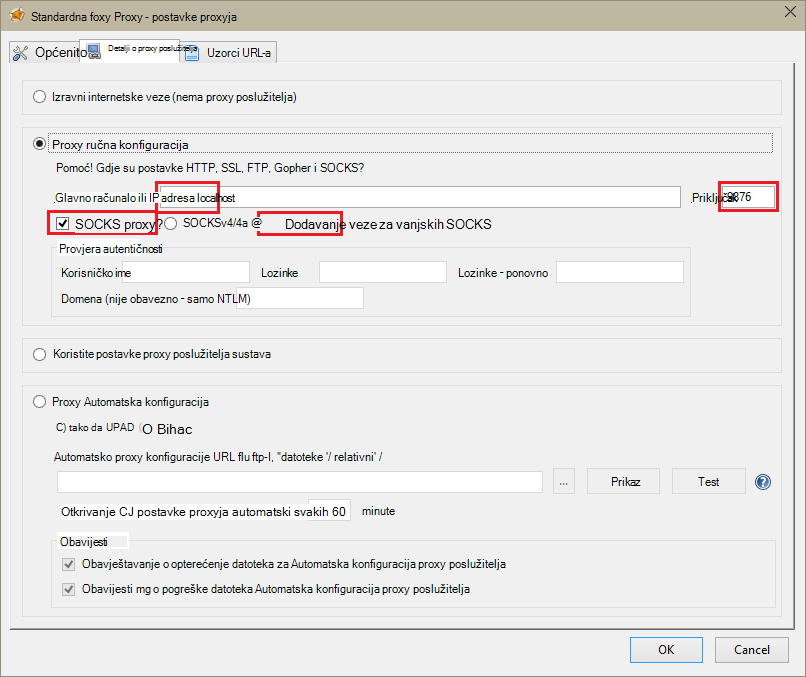
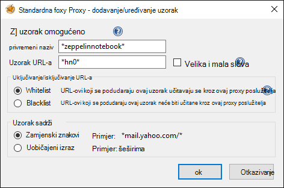
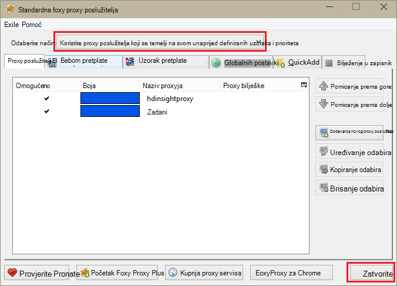

<properties 
    pageTitle="Kliknite pločicu bilježnice Zeppelin za Apache Spark klaster HDInsight Linux | Microsoft Azure" 
    description="Detaljne upute za instalaciju i korištenje Zeppelin bilježnice sa klastere Spark na HDInsight Linux." 
    services="hdinsight" 
    documentationCenter="" 
    authors="nitinme" 
    manager="jhubbard" 
    editor="cgronlun"/>

<tags 
    ms.service="hdinsight" 
    ms.workload="big-data" 
    ms.tgt_pltfrm="na" 
    ms.devlang="na" 
    ms.topic="article" 
    ms.date="10/28/2016" 
    ms.author="nitinme"/>

# Kliknite pločicu Zeppelin bilježnice za Apache Spark klaster HDInsight Linux

Saznajte kako instalirati Zeppelin bilježnice na klastere Apache Spark te kako koristiti Zeppelin bilježnice da biste pokrenuli Spark zadatke.

> [AZURE.IMPORTANT] Zasad su dostupni po zadanom klastere Spark Zeppelin bilježnice. Ne morate izričito instalirajte ih na Spark klaster više. Dodatne informacije potražite u člancima, [Korištenje Zeppelin bilježnica s Apache Spark skupine na HDInsight Linux](hdinsight-apache-spark-zeppelin-notebook.md). 

**Preduvjeti:**

* Prije početka ovog praktičnog vodiča, morate imati pretplatu na Azure. Pogledajte [Početak Azure besplatnu probnu verziju](https://azure.microsoft.com/documentation/videos/get-azure-free-trial-for-testing-hadoop-in-hdinsight/).
* Programa Apache Spark klaster. Upute potražite u članku [Stvaranje Spark Apache klastere u Azure HDInsight](hdinsight-apache-spark-jupyter-spark-sql.md).
* Klijent za SSH. Distribucija Linux i Unix ili Macintosh OS X na `ssh` naredba navedeni su s operacijskim sustavom. Za Windows, preporučujemo da [PuTTY](http://www.chiark.greenend.org.uk/~sgtatham/putty/download.html)

    > [AZURE.NOTE] Ako želite koristiti klijent za SSH osim `ssh` ili PuTTY, potražite u dokumentaciji za vaš klijent za uspostavljanje programa tunelom SSH.

* Web-pregledniku koji mogu konfigurirati da biste koristili SOCKS proxy

* __(neobavezno)__: dodatak kao što su [FoxyProxy](http://getfoxyproxy.org/,) možete primijeniti pravila koja usmjeravanje samo određenim zahtjevima putem na tunelom.

    > [AZURE.WARNING] Bez dodatak kao što su FoxyProxy, sve zahtjeve za stvoren pomoću preglednika možda usmjerena kroz na tunelom. To može uzrokovati sporije učitavanja web-stranice u pregledniku.

## Kliknite pločicu Zeppelin Spark klaster

Zeppelin možete instalirati na Spark klaster pomoću skripte akcije. Prilagođene skripte koristi akcija skriptu da biste instalirali komponente na klasteru koje nisu dostupne prema zadanim postavkama. Prilagođene skripte možete koristiti da biste instalirali Zeppelin s portala za Azure pomoću HDInsight .NET SDK ili pomoću komponente PowerShell Azure. Možete koristiti skriptu da biste instalirali Zeppelin ili kao dio klaster stvaranja ili nakon klaster s radom. Veze u sljedećim odjeljcima pružaju upute o tome. 

### Pomoću portala za Azure

Upute o korištenju Azure Portal za pokretanje akcije skriptu da biste instalirali Zeppelin potražite u članku [Prilagodba HDInsight klastere pomoću skripte akcije](hdinsight-hadoop-customize-cluster-linux.md#use-a-script-action-from-the-azure-portal). Upute u tom članku morate učiniti nekoliko promjene.

* Morate koristiti skriptu da biste instalirali Zeppelin. Prilagođene skripte da biste instalirali Zeppelin na Spark klaster na HDInsight je dostupan od sljedećih veza:
    * Za klastere Spark 1.6.0-`https://hdiconfigactions.blob.core.windows.net/linuxincubatorzeppelinv01/install-zeppelin-spark160-v01.sh`
    * Za klastere Spark 1.5.2-`https://hdiconfigactions.blob.core.windows.net/linuxincubatorzeppelinv01/install-zeppelin-spark151-v01.sh`

* Akcija skripte mora se izvoditi samo na na headnode.

* Skripta moraju parametre. 

### Korištenje servisa HDInsight .NET SDK

Upute o korištenju servisa HDInsight .NET SDK za pokretanje akcije skriptu da biste instalirali Zeppelin potražite u članku [Prilagodba HDInsight klastere pomoću skripte akcije](hdinsight-hadoop-customize-cluster-linux.md#use-a-script-action-from-the-hdinsight-net-sdk). Upute u tom članku morate učiniti nekoliko promjene.

* Morate koristiti skriptu da biste instalirali Zeppelin. Prilagođene skripte da biste instalirali Zeppelin na Spark klaster na HDInsight je dostupan od sljedećih veza:
    * Za klastere Spark 1.6.0-`https://hdiconfigactions.blob.core.windows.net/linuxincubatorzeppelinv01/install-zeppelin-spark160-v01.sh`
    * Za klastere Spark 1.5.2-`https://hdiconfigactions.blob.core.windows.net/linuxincubatorzeppelinv01/install-zeppelin-spark151-v01.sh`

* Skripta moraju parametre. 

* Postavite vrstu klaster stvarate na Spark.

### Pomoću Azure komponente PowerShell

Koristite sljedeće komponente PowerShell isječak da biste stvorili Spark klaster na HDInsight Linux s Zeppelin instaliran. Ovisno o tome koju verziju Spark klaster imate morate ažurirati PowerShell isječak u nastavku da biste dodali vezu na odgovarajuće prilagođene skripte. 

* Za klastere Spark 1.6.0-`https://hdiconfigactions.blob.core.windows.net/linuxincubatorzeppelinv01/install-zeppelin-spark160-v01.sh`
* Za klastere Spark 1.5.2-`https://hdiconfigactions.blob.core.windows.net/linuxincubatorzeppelinv01/install-zeppelin-spark151-v01.sh`

[AZURE.INCLUDE [upgrade-powershell](../../includes/hdinsight-use-latest-powershell.md)]

    Login-AzureRMAccount
    
    # PROVIDE VALUES FOR THE VARIABLES
    $clusterAdminUsername="admin"
    $clusterAdminPassword="<<password>>"
    $clusterSshUsername="adminssh"
    $clusterSshPassword="<<password>>"
    $clusterName="<<clustername>>"
    $clusterContainerName=$clusterName
    $resourceGroupName="<<resourceGroupName>>"
    $location="<<region>>"
    $storage1Name="<<storagename>>"
    $storage1Key="<<storagekey>>"
    $subscriptionId="<<subscriptionId>>"
    
    Select-AzureRmSubscription -SubscriptionId $subscriptionId
    
    $passwordAsSecureString=ConvertTo-SecureString $clusterAdminPassword -AsPlainText -Force
    $clusterCredential=New-Object System.Management.Automation.PSCredential ($clusterAdminUsername, $passwordAsSecureString)
    $passwordAsSecureString=ConvertTo-SecureString $clusterSshPassword -AsPlainText -Force
    $clusterSshCredential=New-Object System.Management.Automation.PSCredential ($clusterSshUsername, $passwordAsSecureString)
    
    $azureHDInsightConfigs= New-AzureRmHDInsightClusterConfig -ClusterType Spark
    $azureHDInsightConfigs.DefaultStorageAccountKey = $storage1Key
    $azureHDInsightConfigs.DefaultStorageAccountName = "$storage1Name.blob.core.windows.net"
    
    Add-AzureRMHDInsightScriptAction -Config $azureHDInsightConfigs -Name "Install Zeppelin" -NodeType HeadNode -Parameters "void" -Uri "https://hdiconfigactions.blob.core.windows.net/linuxincubatorzeppelinv01/install-zeppelin-spark151-v01.sh"
    
    New-AzureRMHDInsightCluster -Config $azureHDInsightConfigs -OSType Linux -HeadNodeSize "Standard_D12" -WorkerNodeSize "Standard_D12" -ClusterSizeInNodes 2 -Location $location -ResourceGroupName $resourceGroupName -ClusterName $clusterName -HttpCredential $clusterCredential -DefaultStorageContainer $clusterContainerName -SshCredential $clusterSshCredential -Version "3.3"
 
## Postavljanje SSH tuneliranje da biste pristupili Zeppelin bilježnice

SSH tunnels ćete koristiti za pristup bilježnicama Zeppelin sustavom klaster Spark na HDInsight Linux. Koraci u nastavku sadrži upute za stvaranje programa tunelom SSH pomoću ssh naredbenog retka (Linux) i PuTTY (Windows).

### Stvaranje tunelom pomoću naredbe za SSH (Linux)

Koristite sljedeću naredbu da biste stvorili programa SSH Tunel pomoću na `ssh` naredbe. Zamjena __korisničko ime__ s korisnikom SSH za svoj klaster HDInsight i zamijeni __CLUSTERNAME__ pod nazivom svoj klaster HDInsight

    ssh -C2qTnNf -D 9876 USERNAME@CLUSTERNAME-ssh.azurehdinsight.net

Time ste stvorili veze koja usmjerava promet na lokalni priključak 9876 klaster putem SSH. Su sljedeće mogućnosti:

* **D 9876** - lokalnog priključka koji će usmjeravanje prometa u tunelom.

* **C** - komprimirati sve podatke, budući da je promet web uglavnom tekst.

* **2** – prisilno SSH pokušati protokol verzija 2 samo.

* **pitanja** - Tihi način rada.

* **T** - Onemogući pomoćni tty dodijeljeni, jer smo prosljeđujete samo priključak.

* **n** - sprječavanje čitanja STDIN, jer smo prosljeđujete samo priključak.

* **N** - izvršavanje udaljene naredbe, jer smo prosljeđujete samo priključak.

* **f** - izvoditi u pozadini.

Ako ste konfigurirali klaster pomoću ključa SSH, morat ćete koristi u `-i` parametar i navedite put do privatni ključ SSH.

Nakon naredba završi, promet poslana s priključkom 9876 na lokalnom računalu će biti proslijeđene putem Secure Sockets Layer (SSL) da biste klaster glavni čvor i čini se da postoji potiče.

### Stvaranje tunelom pomoću PuTTY (Windows)

Poduzmite sljedeće korake da biste stvorili programa tunelom SSH pomoću PuTTY.

1. Otvorite PuTTY pa unesite podatke za povezivanje. Ako niste upoznati s PuTTY, potražite u članku [Korištenje SSH sa sustavom Linux Hadoop na HDInsight iz sustava Windows](hdinsight-hadoop-linux-use-ssh-windows.md) da biste saznali kako ga koristiti uz HDInsight.

2. U odjeljku **kategorija** na lijevoj strani dijaloškog okvira proširivanje **veza**, proširite **SSH**, a zatim odaberite **Tunnels**.

3. Na obrascu **Mogućnosti kontroliranje prosljeđivanje priključka SSH** navedite sljedeće podatke:

    * **Izvorni Priključak** - priključak na klijentskom računalu koju želite proslijediti. Na primjer, **9876**.

    * **Odredište** - u SSH adrese za klaster sustavom Linux HDInsight. Na primjer, **mycluster ssh.azurehdinsight.net**.

    * **Dinamični** - omogućuje dinamički SOCKS proxy usmjeravanja.

    

4. Kliknite **Dodaj** da biste dodali postavke, a zatim kliknite **Otvori** da biste otvorili vezu s SSH.

5. Kada se to od vas zatraži, prijavite se na poslužitelj. To će uspostaviti sesiju SSH i omogućite na tunelom.

### Korištenje tunelom iz preglednika

> [AZURE.NOTE] Koraci u ovom odjeljku pomoću preglednika FireFox, kao što je besplatno sustavima Linux, Unix, Macintosh OS X i Windows. Kao i; surađivati drugim Moderna preglednicima kao što je Google Chrome, Microsoft Edge ili Apple Safari Međutim, dodatak FoxyProxy koji se koriste u nekoliko koraka možda neće biti dostupan za sve preglednike.

1. Konfiguriranje web-pregledniku da biste upotrijebili **localhost:9876** **SOCKS v5** proxy poslužitelj. Evo što postavke Firefox izgledati. Ako ste koristili drugi priključak od 9876, promijenili priključak onome koji ste koristili:

    

    > [AZURE.NOTE] Odabir **Udaljene DNS** će riješiti zahtjeva za upravljanje pravima na informacije (DNS-Domain Name System) pomoću klaster HDInsight. Ako nije odabrana, DNS će se lokalno razriješiti.

2. Provjerite da promet usmjeruje kroz na tunelom po vising web-mjestu kao što su [http://www.whatismyip.com/](http://www.whatismyip.com/) za postavke proxyja omogućuje i onemogućuje u pregledniku Firefox. Dok su postavke omogućena, IP adresa će se na računalu u podatkovnim centrom za Microsoft Azure.

### Proširenja preglednika

Dok radi konfiguriranja preglednika da biste koristili u tunelom, obično ne želite da biste usmjerili sav promet putem na tunelom. Preglednik nastavcima kao što su [FoxyProxy](http://getfoxyproxy.org/) podržava uzoraka URL zahtjeva za (FoxyProxy standardno ili Plus samo), tako da se zahtjevi za određenih URL-ova će biti poslana putem na tunelom.

Ako ste instalirali FoxyProxy Standardno, poduzmite sljedeće korake da biste konfigurirajte ga tako da samo preusmjerava promet za HDInsight pokazivač na tunelom.

1. Proširenje FoxyProxy otvaranje u pregledniku. Na primjer, u pregledniku Firefox, odaberite ikonu FoxyProxy pored polja adresa.

    

2. Odaberite **Dodavanje novog Proxy**, odaberite karticu **Općenito** , a zatim unesite naziv proxy **HDInsightProxy**.

    

3. Odaberite karticu **Detalji proxy poslužitelja** , a zatim popunite sljedeća polja:

    * **Glavno računalo ili IP adresa** – to je localhost, jer smo koriste se tunelom SSH na lokalnom računalu.

    * **Priključak** – to je priključak koji se koristi za tunelom SSH.

    * **SOCKS proxy** – to odaberite da biste omogućili preglednika da biste koristili u tunelom kao proxy poslužitelj.

    * **SOCKS v5** – to odaberite da biste postavili obavezno verziju za proxy poslužitelj.

    

4. Odaberite karticu **Uzoraka URL-a** , a zatim **Dodajte brojeve**. Koristite sljedeće da biste definirali uzorak, a zatim kliknite **u redu**:

    * **Uzorak naziv** - **zeppelinnotebook** – to je samo neslužbeni naziv za uzorak.

    * **URL-a uzorak** - **\*hn0** * – to definira uzorak koji odgovara na interni potpuno kvalificirani naziv domene krajnje točke gdje se nalaze bilježnice Zeppelin. Jer Zeppelin bilježnica dostupne su samo na headnode0 klaster te krajnju točku obično `http://hn0-<string>.internal.cloudapp.net`, pomoću uzorak * *hn0** želite biti sigurni krajnju točku Zeppelin se preusmjerava na zahtjev.

        

4. Kliknite **u redu** da biste dodali proxy poslužitelj i zatvorite **Postavke proxyja**.

5. Pri vrhu dijaloškog okvira FoxyProxy promijenite **Odaberite način** za **Korištenje proxyji na temelju njihove unaprijed definiranih uzoraka i Prioriteti**, a zatim kliknite **Zatvori**.

    

Kada slijedite korake u nastavku, samo zahtjeve za URL-ovi koje sadrže niz __hn0__ će usmjerena preko tunelom SSL. 

## Pristupiti bilježnici Zeppelin

Nakon što dodate SSH tuneliranje instalaciju, možete koristiti sljedeće korake da biste pristupili Zeppelin bilježnice na klaster Spark slijedeći korake u nastavku. U ovom odjeljku, vidjet ćete kako pokrenuti % sql naredbe grozd %.

1. U web-pregledniku otvorite krajnju točku sljedeće:

        http://hn0-myspar:9995

    * **hn0** označava headnode0
    * **myspar** je prvih šest slova naziva klaster Spark.
    * **9995** je priključak gdje se može pristupiti Zeppelin bilježnice.

2. Stvaranje nove bilježnice. U oknu zaglavlje, kliknite **bilježnicu**, a zatim **Stvoriti novu bilješku**.

    ![Stvaranje nove bilježnice Zeppelin] (./media/hdinsight-apache-spark-use-zeppelin-notebook/hdispark.createnewnote.png "Stvaranje nove bilježnice Zeppelin")

    Na istoj stranici, pod naslovom **bilježnice** trebali biste vidjeti Nova bilježnica pod nazivom počevši od **XXXXXXXXX bilješke**. Kliknite Nova bilježnica.

3. Na web-stranici za novu bilježnicu, kliknite naslov, a ako želite promijeniti naziv bilježnice. Pritisnite ENTER da biste spremili promjene naziva. Osim toga, provjerite je li zaglavlje bilježnice prikazuje status **povezan** u gornjem desnom kutu.

    ![Status Zeppelin bilježnice] (./media/hdinsight-apache-spark-use-zeppelin-notebook/hdispark.newnote.connected.png "Status Zeppelin bilježnice")

### Pokretanje SQL naredbe

4. Učitavanje ogledne podatke u privremenu tablicu. Kada stvorite Spark klaster u HDInsight, oglednu datoteku podataka **hvac.csv**se kopira račun povezan prostora za pohranu u odjeljku **\HdiSamples\SensorSampleData\hvac**.

    U prazan odlomak koji je stvoren po zadanom u novu bilježnicu, zalijepite sljedeći isječak.

        // Create an RDD using the default Spark context, sc
        val hvacText = sc.textFile("wasbs:///HdiSamples/HdiSamples/SensorSampleData/hvac/HVAC.csv")
        
        // Define a schema
        case class Hvac(date: String, time: String, targettemp: Integer, actualtemp: Integer, buildingID: String)
        
        // Map the values in the .csv file to the schema
        val hvac = hvacText.map(s => s.split(",")).filter(s => s(0) != "Date").map(
            s => Hvac(s(0), 
                    s(1),
                    s(2).toInt,
                    s(3).toInt,
                    s(6)
            )
        ).toDF()
        
        // Register as a temporary table called "hvac"
        hvac.registerTempTable("hvac")
        
    Pritisnite **SHIFT + ENTER** ili kliknite gumb **Reproduciraj** za odlomak da biste pokrenuli u isječak. Status u desnom kutu odlomka trebali biste tijek iz SPREMNA na ČEKANJU IZVODI u DOVRŠENO. Rezultat prikazuje pri dnu isti odlomak. Snimku zaslona izgleda ovako:

    ![Stvaranje privremene tablice pomoću sirovim podacima] (./media/hdinsight-apache-spark-use-zeppelin-notebook/hdispark.note.loaddDataintotable.png "Stvaranje privremene tablice sa sirovim podacima")

    Možete unijeti i naslova svakog odlomka. Iz desnom kutu kliknite ikonu **Postavke** , a zatim kliknite **Prikaži naslov**.

5. Sada možete pokrenuti Spark SQL naredbe u tablici **hvac** . Zalijepite sljedeći upit novog odlomka. Upit dohvaća sastavnih ID-a i razlika između cilj i stvarne temperature pri svakom na navedeni datum. Pritisnite **SHIFT + ENTER**.

        %sql
        select buildingID, (targettemp - actualtemp) as temp_diff, date 
        from hvac
        where date = "6/1/13" 

    **% Sql** naredbe na početku govori bilježnicu koju ćete koristiti tumačenja Spark SQL. Možete pogledati definirani interpreters na kartici **tumačenja** u zaglavlju bilježnice.

    Sljedeća slika prikazuje izlaz.

    ![Pokrenite Spark SQL naredbi pomoću bilježnice] (./media/hdinsight-apache-spark-use-zeppelin-notebook/hdispark.note.sparksqlquery1.png "Pokrenite Spark SQL naredbi pomoću bilježnice")

     Kliknite Mogućnosti prikaza (istaknute pravokutnik) da biste se prebacivali između različitih nikakva jamstva za istu izlaz. Kliknite **Postavke** za odabir koje consitutes ključ i vrijednosti u izlaz. Snimke zaslona iznad **buildingID** kao koristi tipku i prosjek **temp_diff** kao vrijednost.

    
6. Možete i pokrenuti Spark SQL naredbe pomoću varijabli u upitu. Sljedeći isječak pokazuje kako da biste definirali varijable **Temp**u upit s mogućim vrijednostima koje želite poslati upit s. Kada prvi put pokrenete upit, padajući automatski je popunjen vrijednosti koju ste naveli za varijablu.

        %sql
        select buildingID, date, targettemp, (targettemp - actualtemp) as temp_diff
        from hvac
        where targettemp > "${Temp = 65,65|75|85}" 

    Zalijepite ovu isječak novog odlomka, a zatim pritisnite **SHIFT + ENTER**. Sljedeća slika prikazuje izlaz.

    ![Pokrenite Spark SQL naredbi pomoću bilježnice] (./media/hdinsight-apache-spark-use-zeppelin-notebook/hdispark.note.sparksqlquery2.png "Pokrenite Spark SQL naredbi pomoću bilježnice")

    Za sljedeće upite, možete odabrati novu vrijednost s padajućeg popisa i ponovno pokrenite upit. Kliknite **Postavke** za odabir koje consitutes ključ i vrijednosti u izlaz. Snimke zaslona iznad koristi **buildingID** kao ključ, prosjek **temp_diff** kao vrijednost i **targettemp** kao grupu.

7. Ponovno pokrenite tumačenja Spark SQL da biste izašli iz aplikacije. Kliknite karticu **tumačenja** pri vrhu, a za tumačenja Spark, kliknite **ponovno pokrenite**.

    ![Ponovno pokrenite Zeppelin intepreter] (./media/hdinsight-apache-spark-use-zeppelin-notebook/hdispark.zeppelin.restart.interpreter.png "Ponovno pokrenite Zeppelin intepreter")

### Pokretanje naredbe grozd

1. Iz bilježnice Zeppelin kliknite gumb **tumačenja** .

    ![Ažuriranje vrste Hive tumačenja] (./media/hdinsight-apache-spark-use-zeppelin-notebook/zeppelin-update-hive-interpreter-1.png "Ažuriranje vrste Hive tumačenja")

2. Za tumačenja **grozd** kliknite **Uređivanje**.

    ![Ažuriranje vrste Hive tumačenja] (./media/hdinsight-apache-spark-use-zeppelin-notebook/zeppelin-update-hive-interpreter-2.png "Ažuriranje vrste Hive tumačenja")

    Ažurirajte sljedeća svojstva.

    * Postavite **default.password** lozinku koju ste naveli za administratore korisnika prilikom stvaranja klaster HDInsight Spark.
    * Postavite **default.url** `jdbc:hive2://<spark_cluster_name>.azurehdinsight.net:443/default;ssl=true?hive.server2.transport.mode=http;hive.server2.thrift.http.path=/hive2`. Zamjena ** \<spark_cluster_name >** pod nazivom svoj klaster Spark.
    * Postavite **default.user** naziv administrator korisnika koje ste naveli prilikom stvaranja klaster. Na primjer, *administrator*.

3. Kliknite **Spremi** , a kada se to od vas zatraži da biste ponovno pokrenuli tumačenja grozd, kliknite **u redu**.

4. Stvaranje nove bilježnice i pokrenite sljedeću naredbu da biste dobili popis svih tablica grozd klaster.

        %hive
        SHOW TABLES

    Po zadanom je klaster HDInsight ima ogledne tablice pod nazivom **hivesampletable** da bi se trebali biste vidjeti sljedeće izlaz.

    ![Vrste Hive izlaz] (./media/hdinsight-apache-spark-use-zeppelin-notebook/zeppelin-update-hive-interpreter-3.png "Vrste Hive izlaz")

5. Pokrenite sljedeću naredbu da biste dobili popis zapisa u tablici.

        %hive
        SELECT * FROM hivesampletable LIMIT 5

    Trebali biste programa izlaz ovako.

    ![Vrste Hive izlaz] (./media/hdinsight-apache-spark-use-zeppelin-notebook/zeppelin-update-hive-interpreter-4.png "Vrste Hive izlaz")

## Vidi također

* [Pregled: Apache Spark na Azure HDInsight](hdinsight-apache-spark-overview.md)

### Scenariji

* [Spark bi: izvođenje analiza interaktivnih podataka pomoću Spark u HDInsight s alatima za Poslovno obavještavanje](hdinsight-apache-spark-use-bi-tools.md)

* [Spark s strojnog učenja: korištenje Spark u HDInsight za analizu sastavnih temperatura pomoću HVAC podataka](hdinsight-apache-spark-ipython-notebook-machine-learning.md)

* [Spark s strojnog učenja: korištenje Spark u HDInsight za predviđanje rezultata provjere za hranu](hdinsight-apache-spark-machine-learning-mllib-ipython.md)

* [Spark strujeće: Korištenje Spark u HDInsight za izgradnju u stvarnom vremenu strujanje aplikacije](hdinsight-apache-spark-eventhub-streaming.md)

* [Web-mjesto zapisnika analize pomoću Spark u HDInsight](hdinsight-apache-spark-custom-library-website-log-analysis.md)

### Stvaranje i pokretanje aplikacija

* [Stvaranje samostalne aplikacije pomoću Scala](hdinsight-apache-spark-create-standalone-application.md)

* [Pokretanje zadataka na Spark klaster pomoću Livije](hdinsight-apache-spark-livy-rest-interface.md)

### Alati i proširenja

* [Korištenje servisa HDInsight dodatak Alati za IntelliJ IDEJA za stvaranje i slanje Spark Scala aplikacije](hdinsight-apache-spark-intellij-tool-plugin.md)

* [Korištenje servisa HDInsight dodatak Alati za IntelliJ IDEJA za ispravljanje pogrešaka aplikacije Spark daljinski](hdinsight-apache-spark-intellij-tool-plugin-debug-jobs-remotely.md)

* [Dostupno za Jupyter bilježnicu u skupini Spark za HDInsight jezgre](hdinsight-apache-spark-jupyter-notebook-kernels.md)

* [Korištenje vanjskih paketa s bilježnicama Jupyter](hdinsight-apache-spark-jupyter-notebook-use-external-packages.md)

* [Na računalo instalirati Jupyter i povezati se HDInsight Spark klaster](hdinsight-apache-spark-jupyter-notebook-install-locally.md)

### Upravljanje resursima

* [Upravljanje resursima za klaster Apache Spark u Azure HDInsight](hdinsight-apache-spark-resource-manager.md)

* [Praćenje i ispravljanje pogrešaka zadataka izvodi na programa klaster Apache Spark u HDInsight](hdinsight-apache-spark-job-debugging.md)

[hdinsight-versions]: hdinsight-component-versioning.md
[hdinsight-upload-data]: hdinsight-upload-data.md
[hdinsight-storage]: hdinsight-hadoop-use-blob-storage.md

[azure-purchase-options]: http://azure.microsoft.com/pricing/purchase-options/
[azure-member-offers]: http://azure.microsoft.com/pricing/member-offers/
[azure-free-trial]: http://azure.microsoft.com/pricing/free-trial/
[azure-management-portal]: https://manage.windowsazure.com/
[azure-create-storageaccount]: storage-create-storage-account.md 

