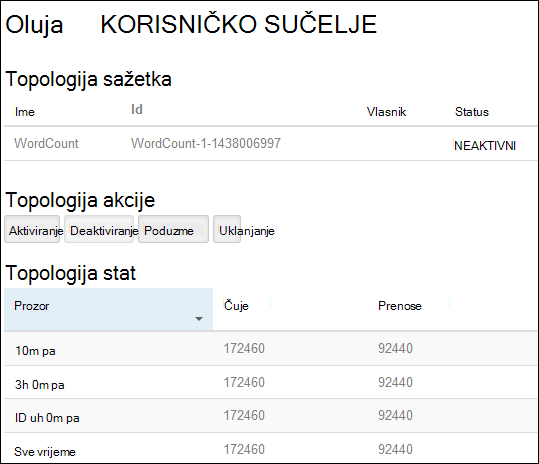
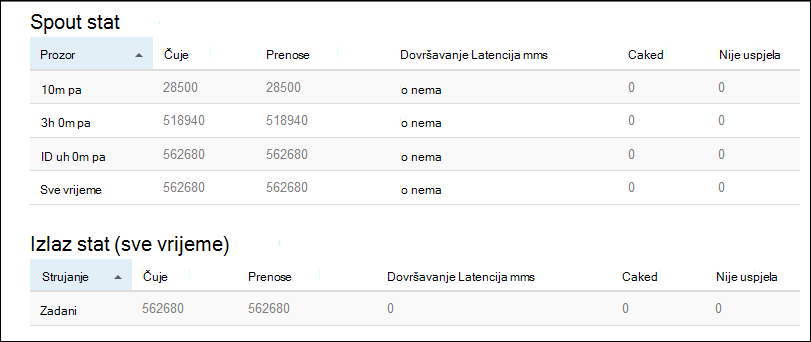

<properties
    pageTitle="Praktični vodič Apache oluja: početak rada sa sustavom Linux oluja na HDInsight | Microsoft Azure"
    description="Početak rada s velikih skupova podataka analize pomoću oluja Apache i uzorke oluja Starter na sustavom Linux HDInsight. Saznajte kako koristiti oluja postupak podatke u stvarnom vremenu."
    keywords="Apache oluja, apache oluja vodič, analize velikih skupova podataka, oluja starter"
    services="hdinsight"
    documentationCenter=""
    authors="Blackmist"
    manager="jhubbard"
    editor="cgronlun"/>

<tags
   ms.service="hdinsight"
   ms.devlang="java"
   ms.topic="get-started-article"
   ms.tgt_pltfrm="na"
   ms.workload="big-data"
   ms.date="10/12/2016"
   ms.author="larryfr"/>

# Praktični vodič Apache oluja: početak rada s oluja Starter uzorka za analizu velikih skupova podataka na HDInsight

Apache oluja je sustav prilagodljivi, pogreške, raspodijeljeno, u stvarnom vremenu izračuni za obradu strujanja podataka. S oluja na Azure HDInsight, možete stvoriti na oblaku oluja klaster koja izvršava analize velikih skupova podataka u stvarnom vremenu.

> [AZURE.NOTE] Koraci u ovom članku stvorite sustavom Linux HDInsight klaster. Upute za stvaranje oluja sa sustavom Windows na klaster servisa HDInsight potražite u članku [Apache oluja Praktični vodič: početak rada s uzorak oluja Starter pomoću analize podataka na HDInsight](hdinsight-apache-storm-tutorial-get-started.md)

## Preduvjeti

[AZURE.INCLUDE [delete-cluster-warning](../../includes/hdinsight-delete-cluster-warning.md)]

Morate imati sljedeće za uspješan dovršetak ovog praktičnog vodiča Apache oluja:

- **Mogući Azure pretplate**. Pogledajte [Početak Azure besplatnu probnu verziju](https://azure.microsoft.com/documentation/videos/get-azure-free-trial-for-testing-hadoop-in-hdinsight/).

- **Poznavanje s SSH i Pronađenim**. Dodatne informacije o korištenju SSH i Pronađenim sa servisa HDInsight potražite u sljedećim člancima:

    - **Linux, Unix ili OS X klijenata**: potražite u članku [Korištenje SSH s operacijskim sustavom Linux Hadoop na HDInsight Linux, OS X ili Unix](hdinsight-hadoop-linux-use-ssh-unix.md)

    - **Klijenti za Windows**: potražite u članku [Korištenje SSH sa sustavom Linux Hadoop na HDInsight iz sustava Windows](hdinsight-hadoop-linux-use-ssh-windows.md)

### Preduvjeti za kontrolu pristupa

[AZURE.INCLUDE [access-control](../../includes/hdinsight-access-control-requirements.md)]

## Stvaranje oluja klaster

U ovom ćete odjeljku stvorite HDInsight klaster verziju 3,2 (oluja verzije 0.9.3) pomoću predloška Azure Voditelj resursa. Informacije o verzijama HDInsight i njihovih SLA potražite u članku [HDInsight komponente verzijama](hdinsight-component-versioning.md). Drugi načini stvaranja klaster potražite u članku [Stvaranje HDInsight klastere](hdinsight-hadoop-provision-linux-clusters.md).

1. Kliknite na sljedećoj slici da biste otvorili predložak na portalu za Azure.         

    
    
    Predložak nalazi se u spremniku javno blob, *https://hditutorialdata.blob.core.windows.net/armtemplates/create-linux-based-storm-cluster-in-hdinsight.json*. 
   
2. Iz plohu parametara unesite sljedeće:

    - **ClusterName**: Unesite naziv klaster Hadoop koje ćete stvoriti.
    - **Klaster korisničko ime i lozinku**: ime za prijavu zadani je administrator.
    - **SSH korisničko ime i lozinku**.
    
    Zapišite ove vrijednosti.  Morate ih kasnije u ovom praktičnom vodiču.

    > [AZURE.NOTE] SSH koristi se za daljinski pristup klaster HDInsight pomoću programa naredbenog retka. Korisničko ime i lozinku koje koristite se koristi pri povezivanju s klaster kroz SSH. Osim toga, SSH korisničko ime mora biti jedinstvena, kao što je stvara korisnički račun na sve čvorove klaster HDInsight. Sljedeće su neke od naziva računa rezervirana za usluge na klaster, a ne može koristiti kao SSH korisničko ime:
    >
    > Korijenska, hdiuser, oluja, hbase, ubuntu, zookeeper, hdfs, yarn, mapred, hbase, grozd, oozie, falcon, sqoop, administrator, tez, hcat, hdinsight zookeeper.

    > Dodatne informacije o korištenju SSH sa servisa HDInsight potražite u nekom od sljedećih članaka:

    > * [Korištenje SSH sa sustavom Linux Hadoop na HDInsight Linux, Unix ili OS X](hdinsight-hadoop-linux-use-ssh-unix.md)
    > * [Korištenje SSH sa sustavom Linux Hadoop na HDInsight iz sustava Windows](hdinsight-hadoop-linux-use-ssh-windows.md)

    
3. kliknite **u redu** da biste spremili parametre.

4. iz plohu **implementacije Prilagođeno** kliknite **grupu resursa** padajući okvir, a zatim **Novo** da biste stvorili novu grupu resursa. Grupa resursa je spremnik koje grupira klaster, račun zavisne prostora za pohranu i ostale povezane resursa.

5. kliknite **pravne uvjete**, a zatim kliknite **Stvori**.

6. kliknite **Stvori**. Prikazat će se novi pločicu pod naslovom Submitting uvođenje predloška implementacije. Potrebno je oko oko 20 minuta da biste stvorili klaster i SQL baze podataka.

##Pokretanje uzorka oluja Starter na HDInsight

Primjeri [oluja starter](https://github.com/apache/storm/tree/master/examples/storm-starter) nalaze se na klasteru HDInsight. Primjer WordCount će se pokrenuti u sljedećim koracima.

1. Povezivanje s klaster HDInsight pomoću SSH:

        ssh USERNAME@CLUSTERNAME-ssh.azurehdinsight.net
        
    Ako ste koristili lozinku radi zaštite SSH korisnički račun, morat ćete unijeti. Ako ste koristili javni ključ, možda ćete morati koristiti u `-i` parametar da biste odredili koji se podudaraju privatni ključ. Na primjer, `ssh -i ~/.ssh/id_rsa USERNAME@CLUSTERNAME-ssh.azurehdinsight.net`.
        
    Dodatne informacije o korištenju SSH s operacijskim sustavom Linux HDInsight potražite u sljedećim člancima:
    
    * [Korištenje SSH sa sustavom Linux Hadoop na HDInsight Linux, Unix ili OS X](hdinsight-hadoop-linux-use-ssh-unix.md)

    * [Korištenje SSH sa sustavom Linux Hadoop na HDInsight iz sustava Windows](hdinsight-hadoop-linux-use-ssh-windows)

2. Da biste pokrenuli topologija primjera, koristite sljedeću naredbu:

        storm jar /usr/hdp/current/storm-client/contrib/storm-starter/storm-starter-topologies-*.jar storm.starter.WordCountTopology wordcount
        
    > [AZURE.NOTE] Na `*` dio naziva datoteke služi za podudaran s brojem verzije koje promjene kao što je HDInsight ažurira.

    To započet će WordCount topologije primjer na klaster s neslužbeni naziv "wordcount". Nasumično bit će generiranje rečenica i Brojanje pojavljivanja svake riječi u rečenica.

    > [AZURE.NOTE] Prilikom slanja topologije na klaster, najprije morate kopirati posudu datoteku koja sadrži klaster prije korištenja u `storm` naredbe. To je moguće napraviti pomoću na `scp` naredbe iz klijentskog programa tamo gdje postoje datoteku. Na primjer,`scp FILENAME.jar USERNAME@CLUSTERNAME-ssh.azurehdinsight.net:FILENAME.jar`
    >
    > Primjer WordCount i još primjera starter oluja već nalaze na svoj klaster pri `/usr/hdp/current/storm-client/contrib/storm-starter/`.

##Praćenje topologije

Korisničko Sučelje oluja omogućuje web sučelje za rad s pokretanjem topologija, a nalazi se na svoj klaster HDInsight.

Praćenje topologije pomoću korisničkog Sučelja oluja, poduzmite sljedeće korake:

1. Otvorite web-preglednik da biste https://CLUSTERNAME.azurehdinsight.net/stormui, pri čemu je __CLUSTERNAME__ svoj klaster. Otvorit će se oluja korisničkog Sučelja.

    > [AZURE.NOTE] Ako se od vas zatraži da navede korisničko ime i lozinku, unesite klaster administrator (administratora) i lozinku koju koristi pri stvaranju klaster.

2. U odjeljku **Topologija sažetka**, odaberite stavku **wordcount** u stupcu **naziv** . Time će se prikazati dodatne informacije o topologiji.

    

    Ova stranica sadrži sljedeće podatke:

    * **Topologija stat** - osnovne informacije o performansama topologije organizirane u windows vremena.

        > [AZURE.NOTE] Odabir prozora određeno vrijeme mijenja se doba informacija koje se prikazuju u ostale sekcije stranice.

    * **Spouts** - osnovne informacije o spouts, uključujući zadnju pogrešku vratio svaki spout.

    * **Vijci s maticama** - osnovne informacije o Vijci.

    * **Konfiguracija topologije** – detaljne informacije o konfiguraciji topologije.

    Ova stranica sadrži i akcije koje možete poduzeti na topologije:

    * **Aktiviraj** - životopise obrada deaktiviran topologije.

    * **Deaktiviranje** - zaustavlja izvodi topologije.

    * **Poduzme** - prilagođava parallelism topologije. Izvodi topologija treba poduzme kada ste promijenili broj čvorovi u klasteru. Time se omogućuje topologije da biste prilagodili parallelism za vaše za povećati/smanjiti broj čvorovi u klasteru. Dodatne informacije potražite u članku [objašnjenje parallelism oluja topologije](http://storm.apache.org/documentation/Understanding-the-parallelism-of-a-Storm-topology.html).

    * **Ukloni** - prekida oluja topologije nakon u navedenom vremenskom roku.

3. Ova stranica, odaberite neku stavku iz odjeljka **Spouts** ili **Vijci s Maticama** . Time će se prikazati informacije o odabrane komponente.

    

    Ova stranica prikazuje sljedeće informacije:

    * **Spout/munje stat** - osnovne informacije o performansama komponente organizirane u windows vremena.

        > [AZURE.NOTE] Odabir prozora određeno vrijeme mijenja se doba informacija koje se prikazuju u ostale sekcije stranice.

    * **Unos stat** (munje samo) – informacije o komponenti koje daju podatke koji se munje.

    * **Izlaz stat** - informacije o podataka čuje tako da ova munje.

    * **Executors** - informacije o instance komponente.

    * **Pogreške** - pogreške koje je stvorio komponente.

4. Prilikom prikaza detalja spout ili munje, odaberite stavku iz stupca **priključak** u odjeljku **Executors** da biste pogledali detalje o instancu komponente.

        2015-01-27 14:18:02 b.s.d.task [INFO] Emitting: split default ["with"]
        2015-01-27 14:18:02 b.s.d.task [INFO] Emitting: split default ["nature"]
        2015-01-27 14:18:02 b.s.d.executor [INFO] Processing received message source: split:21, stream: default, id: {}, [snow]
        2015-01-27 14:18:02 b.s.d.task [INFO] Emitting: count default [snow, 747293]
        2015-01-27 14:18:02 b.s.d.executor [INFO] Processing received message source: split:21, stream: default, id: {}, [white]
        2015-01-27 14:18:02 b.s.d.task [INFO] Emitting: count default [white, 747293]
        2015-01-27 14:18:02 b.s.d.executor [INFO] Processing received message source: split:21, stream: default, id: {}, [seven]
        2015-01-27 14:18:02 b.s.d.task [INFO] Emitting: count default [seven, 1493957]

    Iz tih podataka vidjet ćete da u programu word **sedam** došlo je do 1493957 vremena. To je koliko je puta je došlo je do jer je pokrenuta ova topologije.

##Zaustavljanje topologije

Vratite se na stranicu **topologije sažetka** za Brojanje riječi topologije, a zatim gumb **Ukloni** iz odjeljka **topologije akcije** . Kada se to od vas zatraži, unesite 10 sekundi čekati prije zaustavljanja topologije. Nakon isteklo razdoblje topologije više neće prikazivati kada posjećujete **Korisničkog Sučelja oluja** sekcije nadzorne ploče.

##Brisanje klaster

[AZURE.INCLUDE [delete-cluster-warning](../../includes/hdinsight-delete-cluster-warning.md)]

##Daljnji koraci

Pomoću ovog praktičnog vodiča Apache oluja koristi Starter oluja da biste saznali kako stvoriti na oluja na HDInsight klaster i koristiti na nadzornoj ploči oluja implementacije, praćenje i upravljanje topologija oluja. Nakon toga Saznajte kako [razviti utemeljena na topologija pomoću Maven](hdinsight-storm-develop-java-topology.md).

Ako ste već upoznati s razvijanje utemeljena na Topologija i želite uvesti postojeće topologije HDInsight, pročitajte članak [uvođenje i upravljanje Apache oluja topologija na HDInsight](hdinsight-storm-deploy-monitor-topology-linux.md).

Ako ste .NET za razvojne inženjere, možete stvoriti C# ili hibridnog C# / Java topologija pomoću Visual Studio. Dodatne informacije potražite u članku [razviti C# topologija za Apache oluja na HDInsight pomoću alata za Hadoop za Visual Studio](hdinsight-storm-develop-csharp-visual-studio-topology.md).

Na primjer topologija koje je moguće koristiti s oluja na HDInsight, potražite u sljedećim primjerima:

    * [Primjer topologija za oluja na HDInsight](hdinsight-storm-example-topology.md)

[apachestorm]: https://storm.incubator.apache.org
[stormdocs]: http://storm.incubator.apache.org/documentation/Documentation.html
[stormstarter]: https://github.com/apache/storm/tree/master/examples/storm-starter
[stormjavadocs]: https://storm.incubator.apache.org/apidocs/
[azureportal]: https://manage.windowsazure.com/
[hdinsight-provision]: hdinsight-provision-clusters.md
[preview-portal]: https://portal.azure.com/
