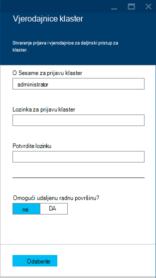
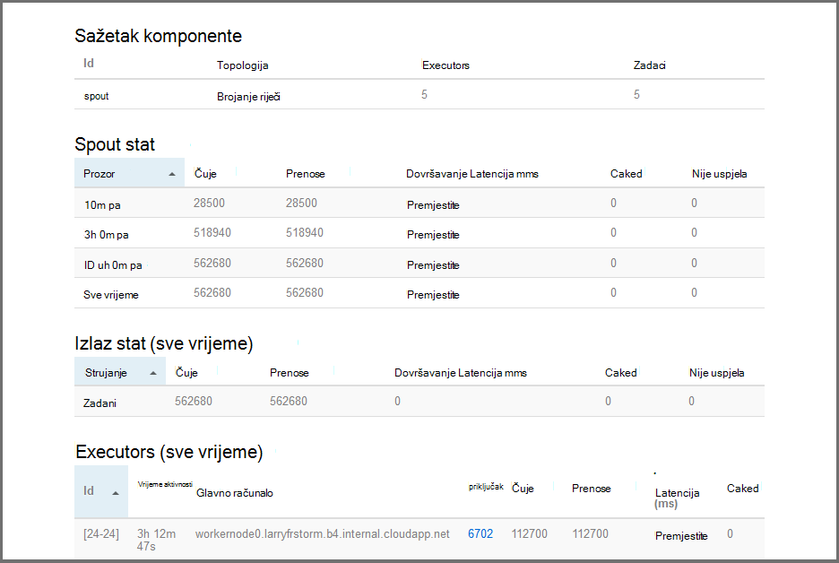

<properties
    pageTitle="Praktični vodič Apache oluja: početak rada s oluja | Microsoft Azure"
    description="Početak rada s velikih skupova podataka analize pomoću oluja Apache i uzorke oluja Starter na HDInsight. Saznajte kako koristiti oluja postupak podatke u stvarnom vremenu."
    keywords="Apache oluja, apache oluja vodič, analize velikih skupova podataka, oluja starter"
    services="hdinsight"
    documentationCenter=""
    authors="Blackmist"
    manager="jhubbard"
    editor="cgronlun"
    tags="azure-portal"/>

<tags
   ms.service="hdinsight"
   ms.devlang="java"
   ms.topic="article"
   ms.tgt_pltfrm="na"
   ms.workload="big-data"
   ms.date="09/07/2016"
   ms.author="larryfr"/>

# Praktični vodič Apache oluja: početak rada s oluja Starter uzorka za analizu velikih skupova podataka na HDInsight

Apache oluja je sustav prilagodljivi, pogreške, raspodijeljeno, u stvarnom vremenu izračuni za obradu strujanja podataka. S oluja na Microsoft Azure HDInsight, možete stvoriti na oblaku oluja klaster koja izvršava analize velikih skupova podataka u stvarnom vremenu. 

> [AZURE.NOTE] Koraci u ovom članku stvorite utemeljen na sustavu Windows HDInsight klaster. Upute za stvaranje oluja sa sustavom Linux klaster servisa HDInsight potražite u članku [Apache oluja Praktični vodič: početak rada s uzorak oluja Starter pomoću analize podataka na HDInsight](hdinsight-apache-storm-tutorial-get-started-linux.md)

## Preduvjeti

[AZURE.INCLUDE [delete-cluster-warning](../../includes/hdinsight-delete-cluster-warning.md)]

Morate imati sljedeće za uspješan dovršetak ovog praktičnog vodiča Apache oluja:

- **Mogući Azure pretplate**. Pogledajte [Početak Azure besplatnu probnu verziju](https://azure.microsoft.com/documentation/videos/get-azure-free-trial-for-testing-hadoop-in-hdinsight/).

### Preduvjeti za kontrolu pristupa

[AZURE.INCLUDE [access-control](../../includes/hdinsight-access-control-requirements.md)]

## Stvaranje oluja klaster

Oluja na HDInsight koristi spremište blobova platforme Azure za spremanje datoteke zapisnika i topologija šalje na klaster. Da biste stvorili račun Azure prostora za pohranu za korištenje s svoj klaster, poduzmite sljedeće korake:

1. Prijava na [Portal za Azure][preview-portal].

2. Odaberite **NOVO**odaberite __Analize podataka__, a zatim odaberite __HDInsight__.

    

3. Unesite __naziv klaster__. Zelena kvačica pojavit će se pokraj __Naziva klaster__ ako je dostupan.

4. Ako imate više pretplata, odaberite stavku __pretplate__ da biste odabrali Azure pretplatu koja će se koristiti za klaster.

5.  __Odaberite vrstu klaster__ koristite da biste odabrali __oluja__ klaster. U __operacijskom sustavu__, odaberite sustava Windows. Za __Sloju klaster__, odaberite STANDARDNO. Na kraju, koristite gumb za odabir da biste spremili postavke.

    

5. __Grupa resursa__, možete nam padajućeg popisa da biste vidjeli popis postojeće grupe resursa, a zatim odaberite jednu da biste stvorili klaster u. Ili možete odaberite __Novo__ , a zatim unesite naziv nove grupe resursa. Da biste naznačili ako je dostupan novi naziv grupe pojavit će se Zelena kvačica.

6. Odaberite __vjerodajnice__, a zatim unesite __Korisničko ime za prijavu klaster__ i __Lozinka za prijavu klaster__. Naposljetku, koristiti __Odaberite__ Postavljanje vjerodajnica. Udaljena radna površina će se koristiti u ovom dokumentu, tako da možete ostaviti je onemogućen.

    

6. Za __Izvor podataka__, odaberite odgovarajuću stavku da biste odabrali postojeći izvor podataka ili stvorite novi.

    

    Trenutno možete odabrati račun za Azure prostora za pohranu kao izvor podataka za programa klaster HDInsight. Koristite sljedeće da biste shvatili stavke na plohu __Izvora podataka__ .

    - __Odabir načina__: postaviti na __iz svih pretplata__ da biste omogućili pregledavanje računa za pohranu na svoje pretplate. Ako želite unijeti __Naziv prostora za pohranu__ i __Tipkovni prečac__ postojećeg računa za pohranu, postavite na __Tipkovni prečac__ .

    - __Stvaranje novog__: tom se mogućnošću poslužite da biste stvorili novi račun za pohranu. Pomoću polja koji se pojavljuje unesite naziv računa za pohranu. Ako je naziv dostupan, pojavit će se Zelena kvačica.

    - __Odaberite zadani spremnik__: tom se mogućnošću poslužite da biste unijeli naziv spremnika zadanog želite koristiti za klaster. Iako možete unijeti bilo koje ime, preporučujemo da koriste isti naziv kao klaster tako da možete jednostavno prepoznati spremnik služi za ovaj određene klaster.

    - __Lokacija__: u regiji koji će se na račun za pohranu ili stvorit će se u.

        > [AZURE.IMPORTANT] Odabir mjesta za zadani izvor podataka postavlja na mjesto klaster HDInsight. Izvor podataka za klaster i zadane moraju nalaziti u istom području.

    - __Odaberite__: tom se mogućnošću poslužite da biste spremili konfiguracije izvora podataka.

7. Odaberite __Čvor cijene razine__ za prikaz informacija o čvorove za ovaj klaster stvorit će se. Prema zadanim postavkama, broj radnih čvorove je postavljena na __4__. Postavite to na __1__, kao što je to je dovoljno za ovog praktičnog vodiča i smanjuje troškove klaster. Procijenjena trošak klaster prikazuje se pri dnu ovog plohu.

    

    __Odaberite__ koristite za spremanje informacija __Čvor cijene razine__ .

8. Odaberite __neobavezno konfiguracija__. U ovom plohu omogućuje odabir verzije klaster, kao i konfigurirajte ostale neobavezne postavke kao što su pridruživanje __Virtualne mreže__.

    

9. Provjerite je li odabran __Prikvači na Startboard__ , a zatim odaberite __Stvori__. Stvara klaster i dodaje pločicu za njega Startboard portalom Azure. Ikona pokazuje da je dodjeljivanje klaster, a promjene da biste prikazali ikonu HDInsight nakon dodjele resursa dovrši.

  	| Prilikom dodjele resursa | Dodjeljivanje dovršeno |
  	| ------------------ | --------------------- |
  	|  |  |

    > [AZURE.NOTE] Neke traje za klaster će biti stvoren obično oko 15 minuta. Pomoću pločicu na Startboard ili stavku __obavijesti__ na lijevoj strani stranice, možete provjeriti na postupka dodjele resursa.

## Pokretanje uzorka oluja Starter na HDInsight

Pomoću ovog praktičnog vodiča Apache oluja predstavlja velikih skupova podataka analize pomoću uzoraka oluja Starter na GitHub.

Svaki oluja na HDInsight klaster isporučuje se s nadzorne ploče oluja, koji se može koristiti da biste prenijeli i pokrenuti oluja topologija klaster. Svaki klaster i u sklopu topologija uzorka koje možete pokrenuti izravno iz oluja nadzornu ploču.

### Povezivanje s nadzorne ploče

Na nadzornoj ploči nalazi se na **https://&lt;clustername >.azurehdinsight.net//**, pri čemu je **clustername** klaster. Veza na nadzornu ploču možete pronaći i tako da odaberete klaster iz na Startboard i odabirom __nadzorne ploče__ veze pri vrhu na plohu.

> [AZURE.NOTE] Prilikom povezivanja s nadzorne ploče, zatraži da unesete korisničko ime i lozinku. To je ime administratora (**administrator**) i lozinku koje se koriste prilikom stvaranja klaster.

Kada na nadzornoj ploči oluja učitana, vidjet ćete **Poslati topologije** obrasca.

Obrazac za **Slanje topologije** se može koristiti da biste prenijeli i pokrenuti .jar datoteke koje sadrže topologija oluja. Sadrži i nekoliko osnovnih uzorke koji se isporučuju sa klaster.

### Pokretanje uzorka za Brojanje riječi iz oluja Starter projekta u GitHub

Uzorci dao klaster obuhvaćaju nekoliko varijacije topologije word Brojanje. Ta uzorka uvrstiti u **spout** koje slučajno emits rečenice i **Vijci s maticama** koji prijeloma svaku rečenicu na pojedinačne riječi, a zatim brojanja koliko je puta došlo je do svake riječi. Ta uzorka su [oluja Starter uzorka](https://github.com/apache/storm/tree/master/examples/storm-starter), koji su dio Apache oluja.

Poduzmite sljedeće korake da biste pokrenuli uzorka oluja Starter:

1. Odaberite **StormStarter - WordCount** **Posudu datoteke** padajući popis. To popunjava polja **Naziv klase** i **Dodatne parametre** parametara za ovaj uzorak.

    

    * **Naziv klase** - klase u datoteci .jar koja šalje topologije.
    * **Dodatni parametri** - parametre potrebnih topologije. U ovom se primjeru polje se koristi za pružanje neslužbeni naziv poslane topologije.

2. Kliknite **Pošalji**. Nakon trenutak, **rezultat** polja prikazuje naredba za slanje posla, kao i rezultatima naredbe. Polje **pogreške** prikazuje sve pogreške koje se pojavljuju u slanje topologije.

    

    > [AZURE.NOTE] Rezultati označava da topologije završio - **oluja topologije, jednom rada se pokreće dok ne zatvorite unijela** Topologija Brojanje riječi generira slučajni rečenice, a zadržava ukupan broj koliko je puta naiđe na svakoj riječi dok ne zatvorite.

### Praćenje topologije

Korisničko Sučelje oluja može se koristiti za praćenje topologije.

1. Na vrhu nadzorne ploče oluja odaberite **Oluja korisničkog Sučelja** . Prikazat će se sažetak informacija za klaster i sve pokrenute topologija.

    

    Na stranici iznad, vidjet ćete vrijeme topologije je aktivna, kao i broj zaposlenici zaduženi za, executors i zadataka koji se koristi.

    > [AZURE.NOTE] **Naziv** stupca sadrži neslužbeni naziv ranije putem **Parametara za dodatna** polja.

4. U odjeljku **Topologija sažetka**, odaberite stavku **wordcount** u stupcu **naziv** . Prikazat će se dodatne informacije o topologiji.

    

    Ova stranica sadrži sljedeće podatke:

    * **Topologija stat** - osnovne informacije o performansama topologije organizirane u windows vremena.

        > [AZURE.NOTE] Odabir prozora određeno vrijeme mijenja se doba informacija koje se prikazuju u ostale sekcije stranice.

    * **Spouts** - osnovne informacije o spouts, uključujući zadnju pogrešku vratio svaki spout.

    * **Vijci s maticama** - osnovne informacije o Vijci.

    * **Konfiguracija topologije** – detaljne informacije o konfiguraciji topologije.

    Ova stranica sadrži i akcije koje možete poduzeti na topologije:

    * **Aktiviraj** - životopise obrada deaktiviran topologije.

    * **Deaktiviranje** - zaustavlja izvodi topologije.

    * **Poduzme** - prilagođava parallelism topologije. Izvodi topologija treba poduzme kada ste promijenili broj čvorovi u klasteru. Time se omogućuje topologije da biste prilagodili parallelism za vaše za povećati/smanjiti broj čvorovi u klasteru. Dodatne informacije potražite u članku [objašnjenje parallelism oluja topologije](http://storm.apache.org/documentation/Understanding-the-parallelism-of-a-Storm-topology.html).

    * **Ukloni** - prekida oluja topologije nakon u navedenom vremenskom roku.

5. Ova stranica, odaberite neku stavku iz odjeljka **Spouts** ili **Vijci s Maticama** . Prikazat će se informacije o odabrane komponente.

    

    Ova stranica prikazuje sljedeće informacije:

    * **Spout/munje stat** - osnovne informacije o performansama komponente organizirane u windows vremena.

        > [AZURE.NOTE] Odabir prozora određeno vrijeme mijenja se doba informacija koje se prikazuju u ostale sekcije stranice.

    * **Unos stat** (munje samo) – informacije o komponenti koje daju podatke koji se munje.

    * **Izlaz stat** - informacije o podataka čuje tako da ova munje.

    * **Executors** - informacije o instance komponente.

    * **Pogreške** - pogreške koje je stvorio komponente.

5. Prilikom prikaza detalja spout ili munje, odaberite stavku iz stupca **priključak** u odjeljku **Executors** da biste pogledali detalje o instancu komponente.

        2015-01-27 14:18:02 b.s.d.task [INFO] Emitting: split default ["with"]
        2015-01-27 14:18:02 b.s.d.task [INFO] Emitting: split default ["nature"]
        2015-01-27 14:18:02 b.s.d.executor [INFO] Processing received message source: split:21, stream: default, id: {}, [snow]
        2015-01-27 14:18:02 b.s.d.task [INFO] Emitting: count default [snow, 747293]
        2015-01-27 14:18:02 b.s.d.executor [INFO] Processing received message source: split:21, stream: default, id: {}, [white]
        2015-01-27 14:18:02 b.s.d.task [INFO] Emitting: count default [white, 747293]
        2015-01-27 14:18:02 b.s.d.executor [INFO] Processing received message source: split:21, stream: default, id: {}, [seven]
        2015-01-27 14:18:02 b.s.d.task [INFO] Emitting: count default [seven, 1493957]

    Iz podataka, vidjet ćete da u programu word **sedam** došlo je do 1,493,957 vremena. To je koliko je puta je došlo je do jer je pokrenuta ova topologije.

### Zaustavljanje topologije

Vratite se na stranicu **topologije sažetka** za Brojanje riječi topologije, a zatim odaberite **Ukloni** iz odjeljka **topologije akcije** . Kada se to od vas zatraži, unesite 10 sekundi čekati prije zaustavljanja topologije. Nakon isteklo razdoblje topologije više neće prikazivati kada posjećujete **Korisničkog Sučelja oluja** sekcije nadzorne ploče.

##Brisanje klaster

[AZURE.INCLUDE [delete-cluster-warning](../../includes/hdinsight-delete-cluster-warning.md)]

## Sažetak

Pomoću ovog praktičnog vodiča Apache oluja koristi Starter oluja da biste saznali kako stvoriti na oluja na HDInsight klaster i koristiti na nadzornoj ploči oluja implementacije, praćenje i upravljanje topologija oluja.

## Daljnji koraci

* **Alati za HDInsight za Visual Studio** – Alati za HDInsight omogućuje vam korištenje Visual Studio da biste poslali, praćenje i upravljanje oluja topologija slično kao na nadzornoj ploči oluja ranije spomenutih. Alati za HDInsight i omogućuje stvaranje C# oluja Topologija i sadrži ogledne topologija koje možete uvesti i pokrenuti na svoj klaster.

    Dodatne informacije potražite u članku [Početak rada pomoću alata za HDInsight za Visual Studio](hdinsight-hadoop-visual-studio-tools-get-started.md).

* **Ogledne datoteke** - u HDInsight oluja klaster nudi nekoliko primjera u direktoriju **%STORM_HOME%\contrib** . Svaki primjer mora sadržavati sljedeće:

    * Šifra izvora – na primjer, oluja-starter-0.9.1.2.1.5.0-2057-sources.jar

    * Java dokumenti – na primjer, oluja-starter-0.9.1.2.1.5.0-2057-javadoc.jar

    * Na primjer – na primjer, storm-starter-0.9.1.2.1.5.0-2057-jar-with-dependencies.jar

    Pomoću naredbe "posudu" da biste izdvojili izvornog koda ili Java dokumente. Ako, na primjer, "posudu - xvf oluja-starter-0.9.1.2.1.5.0.2057-javadoc.jar".

    > [AZURE.NOTE] Dokumenti Java sastoje se od web-stranice. Kada dobivenih, koristite preglednik da biste prikazali **index.html** datoteku.

    Da biste pristupili ta uzorka, morate omogućiti udaljene radne površine oluja na HDInsight klaster, a zatim kopirajte datoteke s **%STORM_HOME%\contrib**.

* Sljedeći dokument sadrži popis još primjera koje je moguće koristiti s oluja na HDInsight:

    * [Primjer topologija za oluja na HDInsight](hdinsight-storm-example-topology.md)

[apachestorm]: https://storm.incubator.apache.org
[stormdocs]: http://storm.incubator.apache.org/documentation/Documentation.html
[stormstarter]: https://github.com/apache/storm/tree/master/examples/storm-starter
[stormjavadocs]: https://storm.incubator.apache.org/apidocs/
[azureportal]: https://manage.windowsazure.com/
[hdinsight-provision]: hdinsight-provision-clusters.md
[preview-portal]: https://portal.azure.com/
