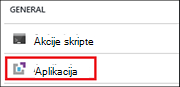
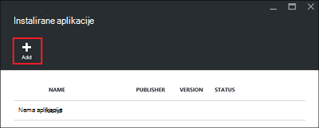
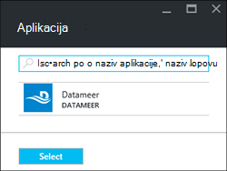
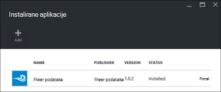

<properties
    pageTitle="Kliknite pločicu aplikacije Hadoop HDInsight | Microsoft Azure"
    description="Saznajte kako instalirati HDInsight aplikacije u aplikacijama za HDInsight."
    services="hdinsight"
    documentationCenter=""
    authors="mumian"
    manager="jhubbard"
    editor="cgronlun"
    tags="azure-portal"/>

<tags
    ms.service="hdinsight"
    ms.devlang="na"
    ms.topic="hero-article"
    ms.tgt_pltfrm="na"
    ms.workload="big-data"
    ms.date="09/14/2016"
    ms.author="jgao"/>

# Instalacija aplikacije HDInsight

Zatvaranje HDInsight aplikacija je koju korisnici mogu instalirati na sustavom Linux HDInsight klaster. Ti programi mogu biti razvijene od Microsofta, neovisno proizvođači (Neovisni) ili sami. U ovom se članku će Saznajte kako instalirati aplikaciju za objavljene. Instaliranje vlastite aplikacije, potražite u članku [Instalacija prilagođenih aplikacija HDInsight](hdinsight-apps-install-custom-applications.md). 

Trenutno postoji jedan objavljene aplikacija:

- **Datameer**: [Datameer](http://www.datameer.com/documentation/display/DAS50/Home?ls=Partners&lsd=Microsoft&c=Partners&cd=Microsoft) nudi analitičar analitičar podataka interaktivni način za otkrivanje, analizirati i vizualizacija rezultate velikih skupova podataka. Dohvaćanje dodatne izvore podataka jednostavno da biste otkrili nove odnose i čitati odgovore morate brzo.

>[AZURE.NOTE] Datameer trenutno je podržano samo u klastere verziju 3,2 Azure HDInsight.

Upute u ovom članku pomoću portala za Azure. Možete i izvoz predloška Azure Voditelj resursa na portalu ili nabavite kopiju predloška resursima dobavljača i pomoću komponente PowerShell Azure i Azure EŽA uvođenje predloška.  Potražite u članku [Stvaranje Linux sustavom Hadoop klaster u HDInsight pomoću predložaka Voditelj resursa](hdinsight-hadoop-create-linux-clusters-arm-templates.md).

## Preduvjeti

Ako želite da biste instalirali aplikacije HDInsight na postojeće klaster za HDInsight, morate imati programa klaster HDInsight. Da biste je stvorili, potražite u članku [Stvaranje klastere](hdinsight-hadoop-linux-tutorial-get-started.md#create-cluster). HDInsight aplikacije možete instalirati i prilikom stvaranja programa klaster HDInsight.

## Instalacija aplikacije za postojeće klastere

Sljedeći postupak prikazuje kako se instalira aplikacije HDInsight postojeće klaster za HDInsight.

**Da biste instalirali aplikaciju HDInsight**

1. Prijavite se na [portal za Azure](https://portal.azure.com).
2. U lijevom izborniku kliknite **Klastere HDInsight** .  Ako ga ne vidite, kliknite **Pregledaj**, a zatim kliknite **Klastere HDInsight**.
3. Kliknite na klaster HDInsight.  Ako ga nemate, morate stvoriti jednu prvi.  potražite u članku [Stvaranje klastere](hdinsight-hadoop-linux-tutorial-get-started.md#create-cluster).
4. U odjeljku kategoriju **Općenito** plohu **Postavke** kliknite **aplikacije** . **Instalirane aplikacije** plohu popis instaliranih aplikacija. 

    

5. Na izborniku plohu kliknite **Dodaj** . 

    

    Prikazat će popis postojećih aplikacija HDInsight.

    

6. Kliknite jednu od aplikacije, prihvatite uvjete pravne, a zatim **Odaberite**.

Vidjet ćete stanja instalacije portala obavijesti (kliknite ikonu zvona pri vrhu stranice portala za). Nakon što je aplikacija instalirana aplikacija će se prikazivati plohu instalirane aplikacije.

## Instalacija aplikacije tijekom stvaranja klaster

Imate mogućnost instalacije aplikacije HDInsight prilikom stvaranja klaster. Tijekom postupka HDInsight aplikacija instaliranih nakon Klaster se stvara i je u stanju izvršavanja. Sljedeći postupak prikazuje kako se instalira aplikacije HDInsight prilikom stvaranja klaster.

**Da biste instalirali aplikaciju HDInsight**

1. Prijavite se na [portal za Azure](https://portal.azure.com).
2. Kliknite **NOVO**, kliknite **podataka + analize**, a zatim **HDInsight**.
3. Unesite **Naziv klaster**: taj naziv mora biti globalno jedinstveni.
4. Kliknite **pretplatu** da biste odabrali Azure pretplatu koja će se koristiti za klaster.
5. Kliknite **Odaberite vrstu klaster**, a zatim odaberite:

    - **Vrsta klaster**: Ako ne znate što da biste odabrali, odaberite **Hadoop**. To je najčešće korištene vrsta klaster.
    - **Operacijski sustav**: odaberite **Linux**.
    - **Verzija**: koristite zadanu verziju ako ne znate što da biste odabrali. Dodatne informacije potražite u članku [HDInsight klaster verzije](hdinsight-component-versioning.md).
    - **Klaster sloju**: Azure HDInsight nudi ponude oblaka velikih skupova podataka u dvije kategorije: standardne sloju i Premium sloju. Dodatne informacije potražite u članku [klaster razine](hdinsight-hadoop-provision-linux-clusters.md#cluster-tiers).
6. Kliknite **aplikacije**, kliknite jednu od objavljene aplikacija, a zatim **Odaberite**.
6. Kliknite **vjerodajnice** , a zatim unesite lozinku za korisnika za administratore. Morate unijeti i **SSH korisničko ime** i ili **lozinku** ili **JAVNI KLJUČ**, koji će se koristiti za provjeru autentičnosti korisnika SSH. Javni ključ je preporučeni način. Kliknite **Odaberi** pri dnu da biste spremili konfiguracije vjerodajnice.
8. Kliknite **Izvor podataka**, odaberite jednu od postojećeg računa za pohranu ili stvorite novi račun za pohranu će se koristiti kao zadani račun za pohranu za klaster.
9. Kliknite **Grupu resursa** da biste odabrali postojeću grupu resursa ili kliknite **Novo** da biste stvorili novu grupu resursa

10. Na plohu **Novi HDInsight klaster** provjerite je li odabran **Prikvači na Startboard** , a zatim kliknite **Stvori**. 

## Popis instaliranih aplikacija HDInsight i svojstava

Na portalu prikazuje popis instaliranih aplikacija HDInsight za klaster i svojstva svaka instaliranih aplikacija.

**Da biste svojstva aplikacije i prikaz popisa HDInsight**

1. Prijavite se na [portal za Azure](https://portal.azure.com).
2. U lijevom izborniku kliknite **Klastere HDInsight** .  Ako ga ne vidite, kliknite **Pregledaj**, a zatim kliknite **Klastere HDInsight**.
3. Kliknite na klaster HDInsight.
4. U odjeljku kategoriju **Općenito** plohu **Postavke** kliknite **aplikacije** . Instalirane aplikacije plohu popis instaliranih aplikacija. 

    

5. Kliknite jednu od instalirane aplikacije da bi se prikazala svojstva. Popisi plohu svojstvo:

    - Naziv aplikacije: naziv aplikacije.
    - Status: stanje aplikacije. 
    - Web-stranice: URL web-aplikaciju koju ste implementiran na rub čvor ako je bilo. Vjerodajnicu je isti kao korisničke vjerodajnice za HTTP-a koji ste konfigurirali za klaster.
    - HTTP krajnja točka: vjerodajnicu jednak korisničke vjerodajnice za HTTP-a koji ste konfigurirali za klaster. 
    - Krajnja točka SSH: možete koristiti [SSH](hdinsight-hadoop-linux-use-ssh-unix.md) za povezivanje s čvor ruba. SSH vjerodajnice nisu jednaki korisničke vjerodajnice za SSH koji ste konfigurirali za klaster.

6. Da biste izbrisali neku aplikaciju, desnom tipkom miša kliknite program, a zatim na kontekstnom izborniku kliknite **Izbriši** .

## Povezivanje s čvor rub

Možete se povezati na rub čvor pomoću HTTP i SSH. Podaci o krajnjoj točki možete pronaći na [portal](#list-installed-hdinsight-apps-and-properties). Dodatne informacije o korištenju SSH potražite u članku [Korištenje SSH s operacijskim sustavom Linux Hadoop na HDInsight Linux, Unix, ili OS X](hdinsight-hadoop-linux-use-ssh-unix.md). 

Vjerodajnice za krajnje točke HTTP su korisničke vjerodajnice za HTTP-a koji ste konfigurirali za klaster HDInsight; vjerodajnice za krajnje točke SSH nisu SSH vjerodajnice koje ste konfigurirali za klaster HDInsight.

## Rješavanje problema

Potražite u članku [Otklanjanje poteškoća s instalacijom](hdinsight-apps-install-custom-applications.md#troubleshoot-the-installation).

## Daljnji koraci

- [Instalacija prilagođene aplikacije HDInsight](hdinsight-apps-install-custom-applications.md): uvođenje HDInsight nepotvrđen objavljene aplikacije HDInsight.
- [Objavljivanje HDInsight aplikacije](hdinsight-apps-publish-applications.md): Saznajte kako objaviti prilagođenih aplikacija HDInsight Azure Marketplace.
- [MSDN: instalirati aplikaciju za HDInsight](https://msdn.microsoft.com/library/mt706515.aspx): Saznajte kako odrediti HDInsight aplikacije.
- [Prilagodba Linux temelje HDInsight klastere pomoću skripte akcije](hdinsight-hadoop-customize-cluster-linux.md): Saznajte kako koristiti akciju skriptu da biste instalirali dodatne aplikacije.
- [Stvaranje Linux sustavom Hadoop klaster u HDInsight pomoću predložaka Voditelj resursa](hdinsight-hadoop-create-linux-clusters-arm-templates.md): Naučite poziva resursima predloške za stvaranje klastere HDInsight.
- [Korištenje prazan rub čvorove u HDInsight](hdinsight-apps-use-edge-node.md): Saznajte kako pomoću programa prazan rub čvor za pristup HDInsight klaster HDInsight aplikacije i testiranje hosting HDInsight aplikacije.

