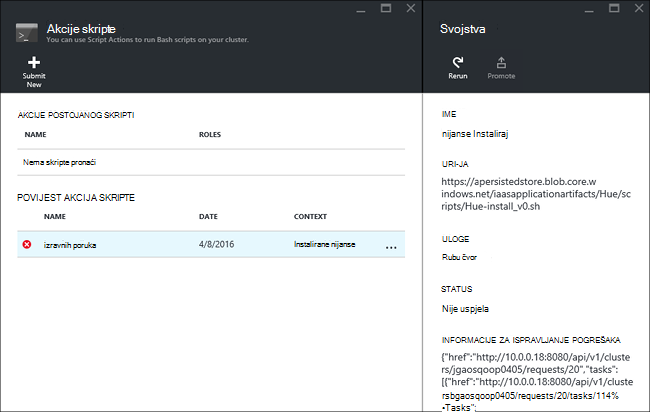

<properties
    pageTitle="Kliknite pločicu aplikacije Hadoop HDInsight | Microsoft Azure"
    description="Saznajte kako instalirati HDInsight aplikacije u aplikacijama za HDInsight."
    services="hdinsight"
    documentationCenter=""
    authors="mumian"
    manager="jhubbard"
    editor="cgronlun"
    tags="azure-portal"/>

<tags
    ms.service="hdinsight"
    ms.devlang="na"
    ms.topic="hero-article"
    ms.tgt_pltfrm="na"
    ms.workload="big-data"
    ms.date="09/14/2016"
    ms.author="jgao"/>

# Instalacija prilagođene aplikacije HDInsight

Zatvaranje HDInsight aplikacija je koju korisnici mogu instalirati na sustavom Linux HDInsight klaster.  Ti programi mogu biti razvijene od Microsofta, neovisno proizvođači (Neovisni) ili sami. U ovom se članku će Saznajte kako instalirati aplikaciju za HDInsight koji nisu objavljene portalu Azure HDInsight. Aplikacija će instalirati je [nijanse](http://gethue.com/). 

Ostali povezani članci:

- [Instalacija HDInsight aplikacije](hdinsight-apps-install-applications.md): Saznajte kako instalirati aplikaciju HDInsight vaše klastere.
- [Objavljivanje HDInsight aplikacije](hdinsight-apps-publish-applications.md): Saznajte kako objaviti prilagođenih aplikacija HDInsight Azure Marketplace.
- [MSDN: instalirati aplikaciju za HDInsight](https://msdn.microsoft.com/library/mt706515.aspx): Saznajte kako odrediti HDInsight aplikacije.

 
## Preduvjeti

Ako želite da biste instalirali aplikacije HDInsight na postojeće klaster za HDInsight, morate imati programa klaster HDInsight. Da biste je stvorili, potražite u članku [Stvaranje klastere](hdinsight-hadoop-linux-tutorial-get-started.md#create-cluster). HDInsight aplikacije možete instalirati i prilikom stvaranja programa klaster HDInsight.

## Instalacija aplikacije HDInsight

HDInsight aplikacije mogu instalirati kada stvarate klaster ili postojeći klaster za HDInsight. Definiranje Voditelj resursa Azure predložaka potražite u članku [MSDN: instalirati aplikaciju za HDInsight](https://msdn.microsoft.com/library/mt706515.aspx).

Datoteke potrebne za implementaciju aplikacije (nijanse):

- [azuredeploy.JSON](https://github.com/hdinsight/Iaas-Applications/blob/master/Hue/azuredeploy.json): predložak u Voditelj resursa za instalaciju aplikacije HDInsight. U odjeljku [MSDN: instalirati aplikaciju za HDInsight](https://msdn.microsoft.com/library/mt706515.aspx) za razvoj resursima predloška.
- [nijanse install_v0.sh](https://github.com/hdinsight/Iaas-Applications/blob/master/Hue/scripts/Hue-install_v0.sh): akcija u skriptu koja se poziva u predlošku resursima za konfiguriranje čvor rub. 
- [nijanse binaries.tgz](https://hdiconfigactions.blob.core.windows.net/linuxhueconfigactionv01/hue-binaries-14-04.tgz): nijanse binarne datoteke koja se poziva iz hui install_v0.sh. 
- [nijanse-binarne datoteke – 14-04.tgz](https://hdiconfigactions.blob.core.windows.net/linuxhueconfigactionv01/hue-binaries-14-04.tgz): nijanse binarne datoteke koja se poziva iz hui install_v0.sh. 
- [webwasb tomcat.tar.gz](https://hdiconfigactions.blob.core.windows.net/linuxhueconfigactionv01/webwasb-tomcat.tar.gz): uzorak web-aplikacije (Tomcat) koja se poziva iz hui install_v0.sh.

**Da biste instalirali nijanse postojeće klaster za HDInsight**

1. Kliknite na sljedećoj slici se prijaviti Azure i otvorite predložak Voditelj resursa na portalu za Azure. 

    

    Ovaj gumb otvara resursima predložak portala za Azure.  Voditelj resursa predložak nalazi se na [https://github.com/hdinsight/Iaas-Applications/tree/master/Hue](https://github.com/hdinsight/Iaas-Applications/tree/master/Hue).  Da biste saznali kako napisati ovaj predložak Voditelj resursa, potražite u članku [MSDN: instalirati aplikaciju za HDInsight](https://msdn.microsoft.com/library/mt706515.aspx).
    
2. Iz plohu **parametara** unesite sljedeće:

    - **ClusterName**: Unesite naziv klaster mjesto na koje želite instalirati aplikaciju. U ovom klaster mora biti postojeće klaster.
    
3. Kliknite **u redu** da biste spremili parametre.
4. Iz plohu **implementacije Prilagođeno** unesite **grupu resursa**.  Grupa resursa je spremnik koje grupira klaster, račun zavisne prostora za pohranu i ostale resurse. Potreban je da biste upotrijebili istoj grupi resursa klaster.
5. Kliknite **pravne uvjete**, a zatim kliknite **Stvori**.
6. Provjerite je li **Prikvači na nadzornoj ploči** potvrdni okvir odabran, a zatim kliknite **Stvori**. Vidjet ćete stanja instalacije iz pločicu prikvačene portala nadzorne ploče i portala obavijesti (kliknite ikonu zvona pri vrhu stranice portala za).  10 minuta potrebno za instalaciju aplikacije.

**Da biste instalirali nijanse prilikom stvaranja klaster**

1. Kliknite na sljedećoj slici se prijaviti Azure i otvorite predložak Voditelj resursa na portalu za Azure. 

    

    Ovaj gumb otvara resursima predložak portala za Azure.  Voditelj resursa predložak nalazi se na [https://hditutorialdata.blob.core.windows.net/hdinsightapps/create-linux-based-hadoop-cluster-in-hdinsight.json](https://hditutorialdata.blob.core.windows.net/hdinsightapps/create-linux-based-hadoop-cluster-in-hdinsight.json).  Da biste saznali kako napisati ovaj predložak Voditelj resursa, potražite u članku [MSDN: instalirati aplikaciju za HDInsight](https://msdn.microsoft.com/library/mt706515.aspx).

2. Slijedite upute za stvaranje klaster i instalirajte nijanse. Dodatne informacije o stvaranju klastere servisa HDInsight potražite u članku [Stvaranje Linux sustavom Hadoop klastere u HDInsight](hdinsight-hadoop-provision-linux-clusters.md).

Uz portal za Azure vam može poslužiti [Azure PowerShell](hdinsight-hadoop-create-linux-clusters-arm-templates.md#deploy-with-powershell) i [Azure EŽA](hdinsight-hadoop-create-linux-clusters-arm-templates.md#deploy-with-azure-cli) da biste nazvali resursima predložaka.

## Provjerite valjanost instalacije

Možete provjeriti status aplikacija na portalu Azure za instalaciju aplikacije za provjeru valjanosti. Osim toga, možete i provjeravate sve HTTP krajnje točke su se pojavili očekivani i web-stranicu ako postoji:

**Da biste otvorili portal nijanse**

1. Prijavite se na [portal za Azure](https://portal.azure.com).
2. U lijevom izborniku kliknite **Klastere HDInsight** .  Ako ga ne vidite, kliknite **Pregledaj**, a zatim kliknite **Klastere HDInsight**.
3. Kliknite klaster koje ste instalirali aplikaciju.
4. U odjeljku kategoriju **Općenito** plohu **Postavke** kliknite **aplikacije** . Prikazat će **nijanse** plohu **Instalirali aplikacije** na popisu.
5. Kliknite **željenu nijansu** s popisa da biste dobili popis svojstava.  
6. Kliknite vezu web-stranicu da biste provjerili valjanost web-mjesta; Otvorite krajnju točku HTTP u pregledniku da biste nijanse web korisničkog Sučelja za provjeru valjanosti, otvorite krajnju točku SSH pomoću [PuTTY](hdinsight-hadoop-linux-use-ssh-windows.md) ili drugim [SSH klijente](hdinsight-hadoop-linux-use-ssh-unix.md).
 
## Otklanjanje poteškoća s instalacijom

Možete provjeriti stanje instalacije aplikacije s portala obavijesti (kliknite ikonu zvona pri vrhu stranice portala za). 

Ako se instalacija aplikacije nije uspjela, možete vidjeti poruke o pogreškama i informacije s 3 mjesta za ispravljanje pogrešaka:

- HDInsight aplikacije: opće informacije o pogrešci.

    Otvorite klaster s portala sustava i kliknite aplikacijama iz plohu postavke:

    

- HDInsight skripte akcija: Ako HDInsight aplikacije poruka o pogrešci upućuje pogreške skripte akciju, dodatne detalje o pogreške skripte prikazat će se u oknu akcije skripte.

    Kliknite skripta akcija s plohu postavke. Povijest akcija skripte prikazuje poruka o pogrešci

    
    
- Ambari web-mjesto korisničkog Sučelja: Ako skripta za instalaciju je uzrok pogreške, koristite korisničko Sučelje Web Ambari za provjeru cijelog zapisnike o instalacija skripti.

    Dodatne informacije potražite u članku [Otklanjanje poteškoća](hdinsight-hadoop-customize-cluster-linux.md#troubleshooting).

## Uklanjanje aplikacije HDInsight

Da biste izbrisali HDInsight aplikacije na nekoliko načina.

### Korištenje portala

**Da biste uklonili aplikaciju pomoću portala**

1. Prijavite se na [portal za Azure](https://portal.azure.com).
2. U lijevom izborniku kliknite **Klastere HDInsight** .  Ako ga ne vidite, kliknite **Pregledaj**, a zatim kliknite **Klastere HDInsight**.
3. Kliknite klaster koje ste instalirali aplikaciju.
4. U odjeljku kategoriju **Općenito** plohu **Postavke** kliknite **aplikacije** . Prikazat će popis instaliranih programa. Za ovaj vodič **nijanse** navedene u plohu **Instalirane aplikacije** .
5. Desnom tipkom miša kliknite aplikaciju koju želite ukloniti, a zatim kliknite **Izbriši**.
6. Kliknite **da** da biste potvrdili.

Na portalu, možete izbrisati klaster ili izbrisati grupu resursa koji sadrži aplikaciju.

### Koristite Azure PowerShell

Pomoću komponente PowerShell Azure, možete izbrisati klaster ili izbrisati grupu resursa. Potražite u članku [Brisanje klastere pomoću Azure PowerShell](hdinsight-administer-use-powershell.md#delete-clusters).

### Korištenje Azure EŽA

Korištenje EŽA Azure, možete izbrisati klaster ili izbrisati grupu resursa. Potražite u članku [Brisanje klastere pomoću Azure EŽA](hdinsight-administer-use-command-line.md#delete-clusters).

## Daljnji koraci

- [MSDN: instalirati aplikaciju za HDInsight](https://msdn.microsoft.com/library/mt706515.aspx): dodatne informacije o razvoju resursima predložaka za implementaciju aplikacije HDInsight.
- [Instalacija HDInsight aplikacije](hdinsight-apps-install-applications.md): Saznajte kako instalirati aplikaciju HDInsight vaše klastere.
- [Objavljivanje HDInsight aplikacije](hdinsight-apps-publish-applications.md): Saznajte kako objaviti prilagođenih aplikacija HDInsight Azure Marketplace.
- [Klastere utemeljen na Prilagodba Linux HDInsight pomoću skripte akcije](hdinsight-hadoop-customize-cluster-linux.md): Saznajte kako koristiti akciju skriptu da biste instalirali dodatne aplikacije.
- [Stvaranje Linux sustavom Hadoop klaster u HDInsight pomoću predložaka Voditelj resursa](hdinsight-hadoop-create-linux-clusters-arm-templates.md): Naučite poziva resursima predloške za stvaranje klastere HDInsight.
- [Korištenje prazan rub čvorove u HDInsight](hdinsight-apps-use-edge-node.md): Saznajte kako pomoću programa prazan rub čvor za pristup HDInsight klaster HDInsight aplikacije i testiranje hosting HDInsight aplikacije.
