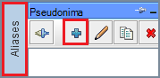

<properties
 pageTitle="Korištenje JDBC upit grozd na Azure HDInsight"
 description="Saznajte kako koristiti JDBC za povezivanje grozd na Azure HDInsight i daljinsko pokretanje upita na podatke pohranjene u oblaku."
 services="hdinsight"
 documentationCenter=""
 authors="Blackmist"
 manager="jhubbard"
 editor="cgronlun"
    tags="azure-portal"/>

<tags
 ms.service="hdinsight"
 ms.devlang="java"
 ms.topic="article"
 ms.tgt_pltfrm="na"
 ms.workload="big-data"
 ms.date="08/23/2016"
 ms.author="larryfr"/>

#Povezivanje s grozd na Azure HDInsight pomoću vrste Hive JDBC upravljački program

[AZURE.INCLUDE [ODBC-JDBC-selector](../../includes/hdinsight-selector-odbc-jdbc.md)]

U ovom dokumentu će Saznajte kako koristiti JDBC iz aplikacije Java daljinski slanje upita grozd programa klaster HDInsight. Ćete saznati kako se povezati putem klijentskog programa SQuirreL SQL i kako se povezati programski iz Java.

Dodatne informacije o JDBC sučelja vrste Hive potražite u članku [HiveJDBCInterface](https://cwiki.apache.org/confluence/display/Hive/HiveJDBCInterface).

##Preduvjeti

Da biste dovršili korake u ovom članku, morate sljedeće:

* Hadoop na klasteru HDInsight. Funkcionirat će klastere sustavom Linux ili utemeljen na sustavu Windows.

* [SQuirreL SQL](http://squirrel-sql.sourceforge.net/). SQuirreL je JDBC klijentske aplikacije.

Omogućuje stvaranje i pokretanje aplikacije Java primjer povezane iz ovog članka, trebat će sljedeće.

* [Java za razvojne inženjere Kit (JDK) verzije 7](https://www.oracle.com/technetwork/java/javase/downloads/jdk7-downloads-1880260.html) ili noviji.

* [Apache Maven](https://maven.apache.org). Maven je projekta sastavljanje sustava za projekte Java koji se koristi za projekt povezan s ovog članka.

##Niz za povezivanje

JDBC veze do HDInsight klaster na Azure vrše preko 443, a promet je osigurani putem SSL-a. Javni pristupnika koja skupina sjesti iza preusmjerava promet priključka koji HiveServer2 zapravo priključuje na. Da bi se niza za povezivanje uobičajeni željeli na sljedeći način:

    jdbc:hive2://CLUSTERNAME.azurehdinsight.net:443/default;ssl=true?hive.server2.transport.mode=http;hive.server2.thrift.http.path=/hive2

Zamijenite __CLUSTERNAME__ naziv svoj klaster HDInsight.

##Provjera autentičnosti

Nakon uspostave veze, morate koristiti HDInsight klaster administrator ime i lozinku za provjeru autentičnosti klaster pristupnika. Prilikom povezivanja s klijentima JDBC poput SQuirreL SQL, morate unijeti administrator ime i lozinku klijentske postavke.

Iz aplikacije Java, morate koristiti ime i lozinku prilikom uspostave veze. Na primjer, sljedeći kod programskog jezika Java otvara novu vezu pomoću niza za povezivanje, administrator ime i lozinku:

    DriverManager.getConnection(connectionString,clusterAdmin,clusterPassword);

##Povezivanje s klijentom SQuirreL SQL

SQuirreL SQL je klijent JDBC koje je moguće koristiti za daljinsko vođenje grozd upita uz svoj klaster HDInsight. Sljedeći koraci pretpostavlja da ste već instalirali SQuirreL SQL i će voditi kroz preuzimanje i konfiguriranje upravljačke programe za grozd.

1. Kopirajte upravljačke programe za vrste Hive JDBC iz svoj klaster HDInsight.

    * Za __HDInsight sustavom Linux__, poduzmite sljedeće korake da biste preuzeli datoteke potrebne posudu.

        1. Stvorite novi direktorij koja će sadržavati datoteke. Na primjer, `mkdir hivedriver`.

        2. Iz naredbenog retka, tulumu, PowerShell ili druge naredbenog, promijenite direktorija novi direktorij i koristiti sljedeće naredbe da biste kopirali datoteke sa servisa HDInsight klaster.

                scp USERNAME@CLUSTERNAME:/usr/hdp/current/hive-client/lib/hive-jdbc*standalone.jar .
                scp USERNAME@CLUSTERNAME:/usr/hdp/current/hadoop-client/hadoop-common.jar .
                scp USERNAME@CLUSTERNAME:/usr/hdp/current/hadoop-client/hadoop-auth.jar .

            Zamijenite SSH korisničko ime za klaster __korisničko ime__ . __CLUSTERNAME__ zamijenite nazivom klaster HDInsight.

            > [AZURE.NOTE] Na okruženja sustava Windows, morate koristiti uslužni PSCP umjesto pronađenim. Preuzmite ga iz [http://www.chiark.greenend.org.uk/~sgtatham/putty/download.html](http://www.chiark.greenend.org.uk/~sgtatham/putty/download.html).

    * Za __HDInsight utemeljen na sustavu Windows__, poduzmite sljedeće korake da biste preuzeli datoteke posudu.

        1. Na portalu Azure odaberite svoj klaster HDInsight, a zatim odaberite ikonu __Udaljene radne površine__ .

            

        2. Povezati klaster pomoću gumba __za povezivanje__ na plohu udaljene radne površine. Ako udaljene radne površine nije omogućena, pomoću obrasca da navede korisničko ime i lozinku, pa odaberite __Omogući__ da biste omogućili udaljene radne površine za klaster.

            

            Nakon odabira __Povezivanje__će se preuzeti .rdp datoteku. Pomoću ove datoteke da biste pokrenuli Udaljena radna površina. Kada se to od vas zatraži, pomoću korisničkog imena i lozinke za pristup udaljene radne površine.

        3. Nakon uspostave kopirajte sljedeće datoteke iz sesija udaljene radne površine na lokalno računalo. Stavite ih u lokalnom direktoriju `hivedriver`.

            * C:\apps\dist\hive-0.14.0.2.2.9.1-7\lib\hive-jdbc-0.14.0.2.2.9.1-7-Standalone.jar
            * C:\apps\dist\hadoop-2.6.0.2.2.9.1-7\share\hadoop\common\hadoop-Common-2.6.0.2.2.9.1-7.jar
            * C:\apps\dist\hadoop-2.6.0.2.2.9.1-7\share\hadoop\common\lib\hadoop-AUTH-2.6.0.2.2.9.1-7.jar

            > [AZURE.NOTE] Brojevi verzija obuhvaćeno putovima i nazivima datoteka mogu se razlikovati za svoj klaster.

        4. Prekid veze sesija udaljene radne površine kada završite kopiranja datoteka.

3. Pokretanje aplikacije SQuirreL SQL. Na lijevoj strani prozora odaberite __upravljačke programe__.

    

4. Ikone pri vrhu dijaloškog okvira __upravljačke programe__ , odaberite na __+__ ikonu da biste stvorili novi upravljački program.

    

5. U dijaloškom okviru Dodavanje upravljački program unesite sljedeće podatke.

    * __Naziv__: vrste Hive
    * __Primjer URL__: jdbc:hive2://localhost:443/default;ssl=true?hive.server2.transport.mode=http;hive.server2.thrift.http.path=/hive2
    * __Dodatni put klasa__: pomoću gumba Dodaj da biste dodali datoteke posudu preuzeti neke starije verzije
    * __Naziv klase__: org.apache.hive.jdbc.HiveDriver

    

    Kliknite __u redu__ da biste spremili postavke.

6. Na lijevoj strani prozora SQuirreL SQL, odaberite __pseudonima__. Zatim na __+__ ikonu da biste stvorili novi pseudonim veze.

    

7. Pomoću sljedeće vrijednosti za dijaloški okvir __Dodavanje pseudonima__ .

    * __Naziv__: vrste Hive na HDInsight
    * __Upravljački program__: koristite padajući popis za odabir __vrste Hive__ upravljački program
    * __URL__: jdbc:hive2://CLUSTERNAME.azurehdinsight.net:443/default;ssl=true?hive.server2.transport.mode=http;hive.server2.thrift.http.path=/hive2

        Zamijenite __CLUSTERNAME__ naziv svoj klaster HDInsight.

    * __Korisničko ime__: naziv računa klaster prijave za svoj klaster HDInsight. Zadana vrijednost je `admin`.
    * __Lozinka__: lozinku za prijavu klaster. To je lozinka koje ste naveli prilikom stvaranja klaster HDInsight.

    

    Da biste provjerili funkcionira li veze, koristite gumb za __testiranje__ . Kada __povezati: vrste Hive na HDInsight__ prikaže dijaloški okvir, odaberite __Poveži__ za izvođenje testiranja. Ako provjera ne uspije, prikazat će se dijaloški okvir __veza uspješno__ .

    Koristite gumb __u redu__ pri dnu dijaloškog okvira __Dodavanje pseudonima__ za spremanje pseudonim za vezu.

8. __Povezivanje s__ padajući izbornik na vrhu SQuirreL SQL, odaberite __vrste Hive na HDInsight__. Kada se to od vas zatraži, odaberite __Poveži__.

    

9. Nakon uspostave unesite sljedeći upit u dijaloškom okviru SQL upit, a zatim ikonu __Pokreni__ . Područje rezultata treba prikazati rezultate upita.

        select * from hivesampletable limit 10;

    

##Povezivanje s primjer Java aplikacije

Primjer korištenja klijentu Java upita grozd na HDInsight dostupan je na [https://github.com/Azure-Samples/hdinsight-java-hive-jdbc](https://github.com/Azure-Samples/hdinsight-java-hive-jdbc). Slijedite upute u spremištu omogućuje stvaranje i pokretanje uzorka.

##Otklanjanje poteškoća

### Pojavila se neočekivana pogreška prilikom da biste otvorili SQL vezom.

__Simptomi__: prilikom povezivanja programa HDInsight klaster koja je verzija 3,3 ili 3.4, možda primite poruku o pogrešci koja se pojavila se neočekivana pogreška. Praćenje stoga za tu pogrešku će početi sa sljedeće retke:

    java.util.concurrent.ExecutionException: java.lang.RuntimeException: java.lang.NoSuchMethodError: org.apache.commons.codec.binary.Base64.<init>(I)V
    at java.util.concurrent.FutureTas...(FutureTask.java:122)
    at java.util.concurrent.FutureTask.get(FutureTask.java:206)

__Uzrok__: ta se pogreška uzrokuje nepodudaranje verzije datoteke commons codec.jar koriste SQuirreL i jedan potrebnih komponente vrste Hive JDBC preuzete iz klaster HDInsight.

__Razlučivost__: da biste ispravili tu pogrešku, poduzmite sljedeće korake.

1. Preuzmite datoteku posudu commons kodek iz svoj klaster HDInsight.

        scp USERNAME@CLUSTERNAME:/usr/hdp/current/hive-client/lib/commons-codec*.jar ./commons-codec.jar

2. Izlaz iz SQuirreL, a zatim prijeđite u direktorij na računalu na kojem je instaliran SQuirreL. U direktoriju SquirreL u odjeljku s `lib` direktorija, Zamijeni postojeće codec.jar commons na jednom preuzete iz klaster HDInsight.

3. Ponovno pokrenite SQuirreL. Pogreška više ne treba pojaviti prilikom povezivanja grozd na HDInsight.

##Daljnji koraci

Sad kad ste naučili kako koristiti JDBC za rad s grozd, pomoću sljedećih veza da biste istražili druge načine za rad sa servisom Azure HDInsight.

* [Prijenos podataka HDInsight](hdinsight-upload-data.md)
* [Korištenje grozd s HDInsight](hdinsight-use-hive.md)
* [Korištenje Svinja s HDInsight](hdinsight-use-pig.md)
* [Korištenje MapReduce poslove s HDInsight](hdinsight-use-mapreduce.md)
