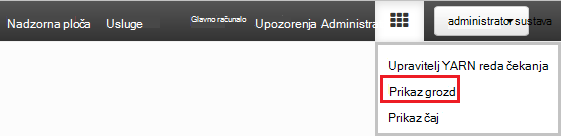
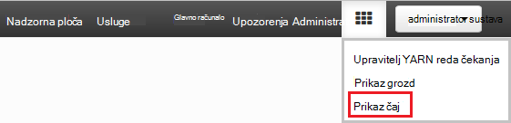
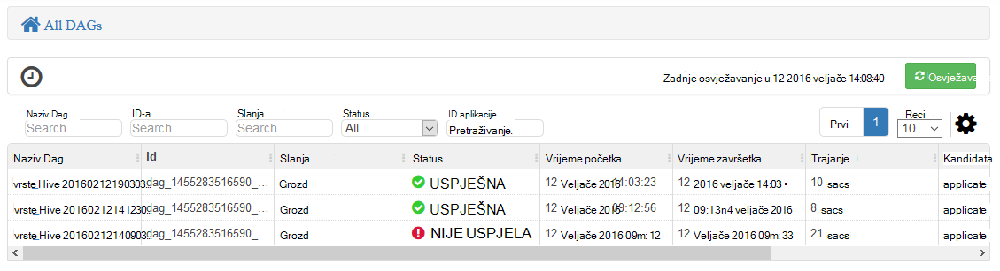
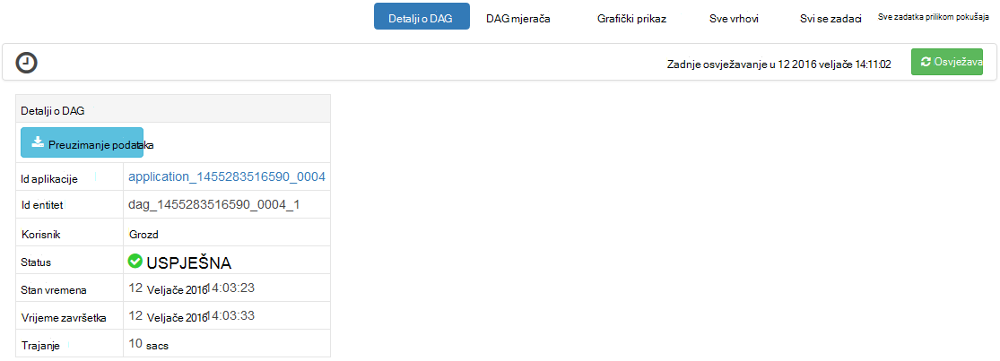
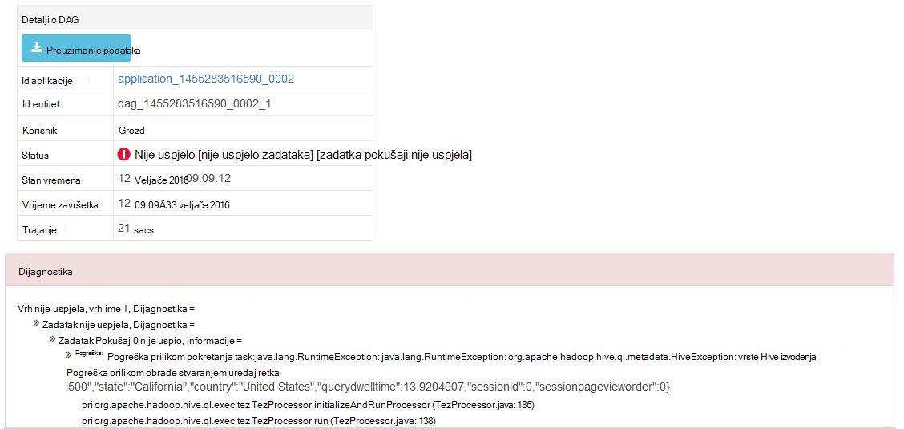
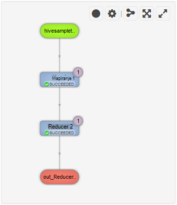
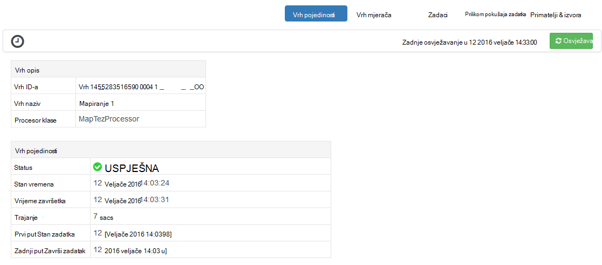
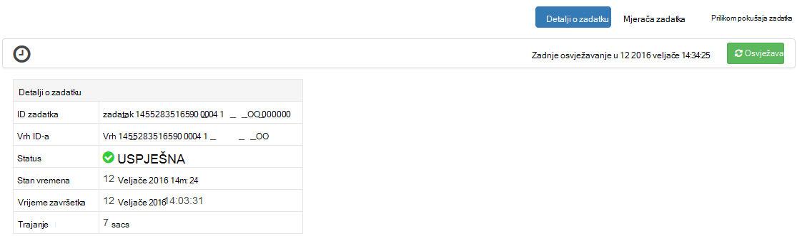

<properties
pageTitle="Korištenje prikaza Tez Ambari s HDInsight | Azure"
description="Saznajte kako koristiti prikaz Ambari Tez za ispravljanje pogrešaka Tez poslove na HDInsight."
services="hdinsight"
documentationCenter=""
authors="Blackmist"
manager="jhubbard"
editor="cgronlun"/>

<tags
ms.service="hdinsight"
ms.devlang="na"
ms.topic="article"
ms.tgt_pltfrm="na"
ms.workload="big-data"
ms.date="10/04/2016"
ms.author="larryfr"/>

# Korištenje prikaza Ambari za ispravljanje pogrešaka Tez poslove na HDInsight

Korisničko Sučelje Web Ambari za HDInsight sadrži prikaz Tez koje je moguće koristiti za razumijevanje i zadacima koje koriste Tez kao izvođenja modul za ispravljanje pogrešaka. Prikaz Tez omogućuje vizualizacija posla kao grafikon povezanih stavki, dubinski analizirati svake stavke i dohvatiti Statistika i podaci za zapisivanje.

> [AZURE.NOTE] Informacije u ovom dokumentu je za klastere sustavom Linux HDInsight. Informacije o ispravljanje pogrešaka Tez zadatke pomoću HDInsight utemeljen na sustavu Windows, potražite u članku [Korištenje Tez korisničko Sučelje za ispravljanje pogrešaka Tez poslove na HDInsight utemeljen na sustavu Windows](hdinsight-debug-tez-ui.md).

## Preduvjeti

* Klaster sustavom Linux HDInsight. Upute o stvaranju nove klaster potražite u članku [Početak rada s operacijskim sustavom Linux HDInsight](hdinsight-hadoop-linux-tutorial-get-started.md).

* Moderna web-pregledniku koji podržava HTML5.

## Razumijevanje Tez

Tez je extensible framework za obradu podataka u Hadoop koja omogućuje brzine veći od tradicionalni obrada MapReduce. Za klastere Linux temelje HDInsight je zadani modula za grozd.

Radni je poslan na Tez, stvara na usmjereni Acyclic grafikon (DAG) koji opisuje redoslijed izvršavanja od akcija potrebnih posao. Pojedinačne akcije nazivaju vrhovi i izvršavanje dio ukupnog posao. Stvarni izvođenja rada opisan vrha naziva zadatka, a možda raspodijeliti više čvorovi u klasteru.

### Objašnjenje Tez prikaz

Prikaz Tez daje informacije o postupaka koji se izvode ili ste već pokrenuli pomoću Tez. Omogućuje prikaz DAG generira Tez, mjerača kako distribuirati preko klastere, kao što su memorije koristi za zadatke i vrhovi i informacije o pogrešci. Može ponuditi korisne informacije u sljedećim scenarijima:

* Nadzor dugoročnih procesa, Prikaz tijeka karte web-mjesta i smanjivanje zadatke.

* Analiza povijesne podataka da biste saznali kako se mogu poboljšati obrada ili Zašto nije uspjelo ili nije uspjelo procesa.

## Generiranje na DAG

Prikaz Tez samo sadrže podatke ako zadatak koji koristi modul Tez je u tijeku ili je pokrenuta u prošlosti. Jednostavne upite grozd može obično riješi bez korištenja Tez, no složenije upite koji rade filtriranja, grupiranje, redoslijed, spojevi i itd obično zahtijevaju Tez.

Poduzmite sljedeće korake da biste pokrenuli upit grozd koje ćete izvršiti pomoću Tez.

1. U web-pregledniku otvorite https://CLUSTERNAME.azurehdinsight.net, pri čemu je __CLUSTERNAME__ svoj klaster HDInsight.

2. Na izborniku pri vrhu stranice odaberite ikonu __prikaza__ . To izgleda kao niz kvadrata. Na padajućem popisu koji će se prikazati odaberite __vrste Hive prikaz__. 

    

3. Kada se grozd prikaz opterećenje, zalijepite sljedeće u uređivaču upita, a zatim __izvršiti__.

        select market, state, country from hivesampletable where deviceplatform='Android' group by market, country, state;
    
    Kada je zadatak dovršen, trebali biste vidjeti izlaz prikazivati u odjeljku __Rezultati upita postupak__ . Rezultati moraju biti sličnu ovoj
    
        market  state       country
        en-GB   Hessen      Germany
        en-GB   Kingston    Jamaica
        
4. Odaberite karticu __zapisnika__ . Prikazat će se informacije poput ove:
    
        INFO : Session is already open
        INFO :

        INFO : Status: Running (Executing on YARN cluster with App id application_1454546500517_0063)

    Spremite vrijednost __id aplikacije__ , kao što je to će se koristiti u sljedećem odjeljku.

## Korištenje prikaza Tez

1. Na izborniku pri vrhu stranice odaberite ikonu __prikaza__ . Na padajućem popisu koji će se prikazati odaberite __Prikaz Tez__.

    

2. Kada se prikaz Tez učita, vidjet ćete popis DAGs koje su trenutno pokrenuti ili su pokrenuli na klaster. Zadani prikaz sadrži Dag naziv, Id, slanja, stanje, vrijeme početka, vrijeme završetka, trajanje, ID aplikacije i red. Više stupaca možete dodati pomoću ikone zupčanika u desnom kutu stranice.

    

3. Ako imate samo jednu stavku, bit će za upit koji ste pokrenuli u prethodnom odjeljku. Ako imate više stavki, možete pretraživati tako da unesete ID aplikacije u polju __ID aplikacije__ , a zatim pritisnite enter.

4. Odaberite __Naziv Dag__. Time će se prikazati informacije o na DAG, kao i mogućnost da biste preuzeli zip JSON datoteka koje sadrže podatke o na DAG.

    

5. Iznad __Pojedinosti DAG__ su nekoliko veza koje je moguće koristiti za prikaz informacija o na DAG.

    * __DAG mjerača__ prikazuje mjerača podatke za ovu DAG.
    
    * __Grafički prikaz__ prikazuje grafički prikaz u ovom DAG.
    
    * __Sve vrhovi__ prikazuje popis na vrhovi u ovom DAG.
    
    * __Svi se zadaci__ prikazuje popis zadataka za sve vrhovi u ovom DAG.
    
    * __Sve TaskAttempts__ prikazuje informacije o pokušava pokretanje zadataka za ovaj DAG.
    
    > [AZURE.NOTE] Ako pomičete prikaz stupca za vrhovi, zadaci i TaskAttempts, imajte na umu da postoje veze za prikaz __brojača__ i __Prikaz ili preuzimanje zapisnika__ za svaki redak.

    Ako pojavila se pogreška s posla, pojedinosti DAG prikazat će se status nije uspjelo, te veze na informacije o zadatku nije uspjelo. Informacije za dijagnostiku će se prikazati ispod DAG detalje.
    
    

7. Odabir __grafičkog prikaza__. Prikazat će se grafički prikaz u DAG. Možete postaviti miša preko svake vrh u prikazu za prikaz informacija o njemu.

    

8. Klikom na vrh učitavaju se __Vrh detalja__ za tu stavku. Kliknite na vrh __1 karte__ da biste prikazali detalje o za tu stavku.

    

9. Imajte na umu sada sadrži veze pri vrhu stranice koji se odnose na vrhovi i zadatke.

    > [AZURE.NOTE] Možete i dođete na ovu stranicu tako da odete __DAG detalje__, odaberete __Vrh detalje__, a zatim odaberite vrh __karte 1__ .

    * __Vrh mjerača__ prikazuje brojač podatke za ovu vrh.
    
    * __Zadaci__ prikazat će se zadaci za ovaj vrh.
    
    * __Zadatak pokušava__ prikazuje informacije o pokušaje izvršavanja zadataka za ovaj vrh.
    
    * __Izvori & primatelji__ prikazuje izvore podataka i primatelja za ovu vrh.

    > [AZURE.NOTE] Kao prethodni izbornik, možete se pomicati prikaz stupca za zadatke, prilikom pokušaja zadatka, izvora i Sinks__ da biste prikazali veze na dodatne informacije za svaku stavku.

10. Odaberite __Zadaci__, a zatim odaberite stavku pod nazivom __00_000000__. To će prikazati __Detalje o zadatku__ za taj zadatak. U ovaj zaslon možete vidjeti __Mjerača zadataka__ i __Zadataka pokušaja__.

    

## Daljnji koraci

Sad kad ste naučili kako koristiti prikaz Tez, Saznajte više o [Korištenju vrste Hive HDInsight](hdinsight-use-hive.md).

Detaljnije tehničke informacije o Tez, potražite u članku [Tez stranicu na Hortonworks](http://hortonworks.com/hadoop/tez/).

Dodatne informacije o korištenju Ambari sa servisa HDInsight potražite u članku [Upravljanje HDInsight klastere pomoću korisničkog Sučelja Web Ambari](hdinsight-hadoop-manage-ambari.md)
